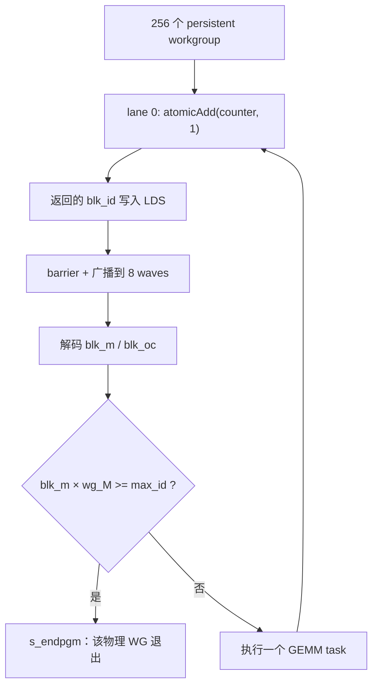
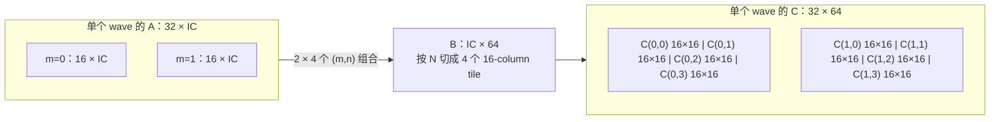
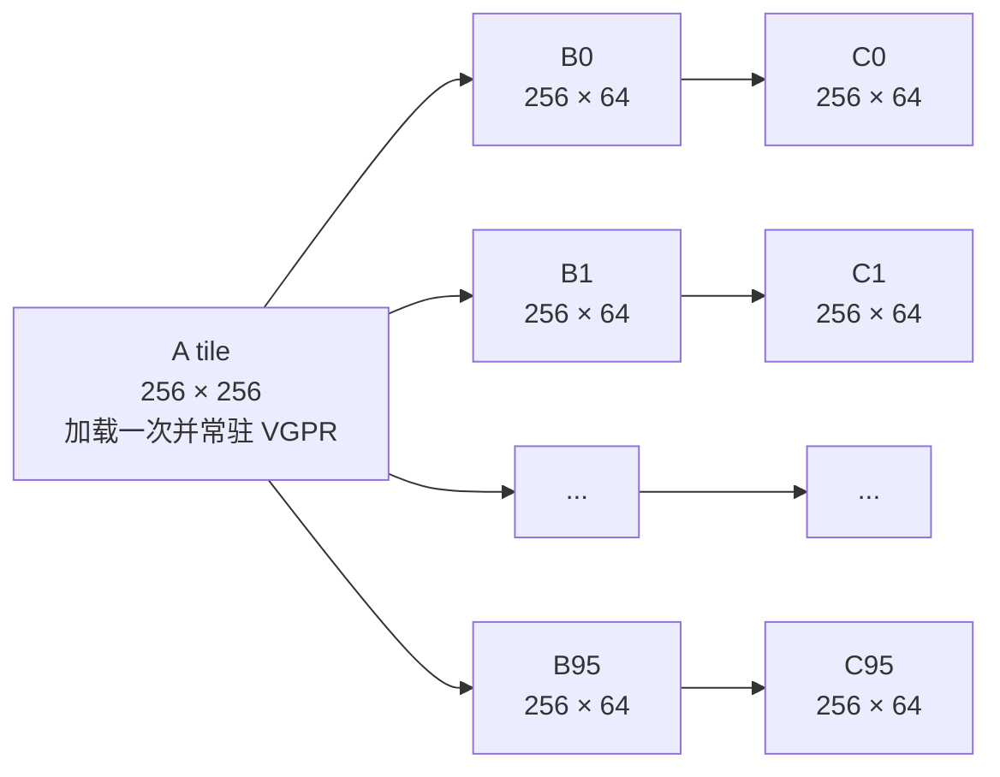
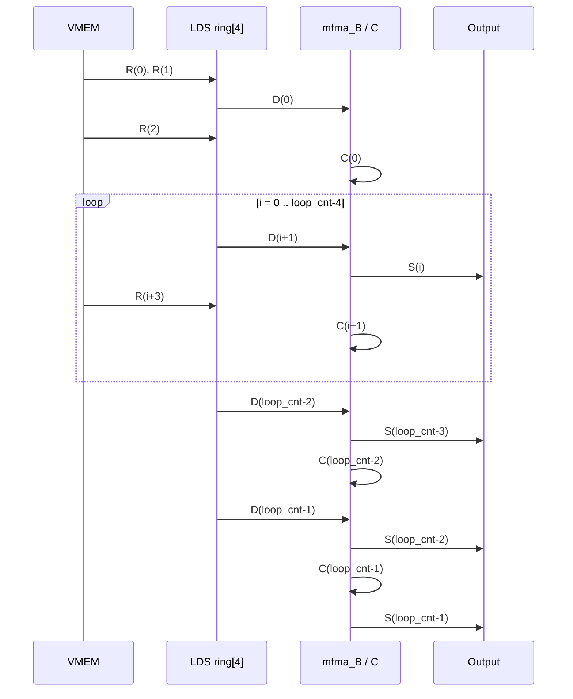

# `moe_gemm_8wave_down` 设计报告

## 1. 概述

`moe_gemm_8wave_down` 是面向 MoE down projection 的手写 AMDGPU **persistent JIT kernel**。它针对 `IC` 较小、权重访问占主导的场景，将一个逻辑 expert task 的 `wg_M` 行分给 8 个 wave，并沿输出通道连续处理多个 `wg_N=64` tile。固定数量的物理 workgroup 通过全局原子计数器持续领取逻辑 task，直到任务队列耗尽。

内核的核心策略是：

1. 启动固定的 256 个 persistent workgroup；
2. 每个 workgroup 用 `global_atomic_add` 动态领取一个 `(blk_m, blk_oc)` 逻辑 task；
3. 将该 task 的 `sorted_ids` 和 `sorted_weights` 缓存在 LDS；
4. 每个 wave 将自己负责的 activation 行完整加载到 VGPR，并跨所有输出 tile 复用；
5. 将预 shuffle 的权重 tile 通过 `buffer_load_* lds` 协作加载到四级 LDS 环形缓冲；
6. 在权重预取、LDS 读取、MFMA 和输出写回之间构建软件流水线；
7. 完成当前 task 后回到持久循环领取下一项；
8. FP8 路径按 `1×128` activation scale 和 `128×128` weight scale 做分块反量化；
9. 输出为 `[num_tokens, TOPK, OC_total]` 的 BF16 中间结果，随后由上层对 `TOPK` 求和。

实现入口见 [src/contrib/moe_gemm_8wave.py](src/contrib/moe_gemm_8wave.py#L769)，调用点见 [src/contrib/fused_moe.py](src/contrib/fused_moe.py#L550)。

---

## 2. 适用场景与上层调用

上层仅在以下条件成立时选择该 kernel：

- `inter_dim <= 256`；
- `w2` 已经 pre-shuffle；
- down projection 的输出 tile 固定为 `wg_N=64`；
- workgroup 固定为 512 threads，即 8 个 wave64。

调用逻辑位于 [src/contrib/fused_moe.py](src/contrib/fused_moe.py#L494-L563)。当前固定启动：

$$
G_{physical}=256
$$

物理 workgroup 数不再等于逻辑 task 数。所有 workgroup 共享一个初始化为 0 的 `blk_atomic_int`，每完成一个 task 后继续领取下一个编号。逻辑 task 总数为：

$$
G_{logical}=\left\lceil\frac{num\_valid\_ids}{wg\_M}\right\rceil
	imes num\_oc\_splits
$$

每个逻辑 task 对应一个 `(blk_m, blk_oc)` 组合。这里：

- `blk_m`：routing 后的 expert block 编号；
- `blk_oc`：输出通道大分片编号；
- 一个逻辑 task 会在内部遍历该大分片中的所有 `wg_N` tile；
- 一个物理 workgroup 在一次 kernel dispatch 中可能串行完成多个逻辑 task。

上层根据估算的尾部浪费率选择 `num_oc_splits`：若 256 CU 的最后一轮预计浪费超过 30%，取 4，否则取 1，见 [src/contrib/fused_moe.py](src/contrib/fused_moe.py#L507-L527)。动态 task 分配用于缓解不同 expert block 有效 token 数不均衡造成的长尾。

上层分配的 `stage2_out` 形状为 `[num_tokens, TOPK, model_dim]`。kernel 已乘上 routing weight，但不在 kernel 内归约 TOPK；上层最终执行 `stage2_out.sum(dim=1)`，见 [src/contrib/fused_moe.py](src/contrib/fused_moe.py#L620-L628)。

---

## 3. 接口

函数签名见 [src/contrib/moe_gemm_8wave.py](src/contrib/moe_gemm_8wave.py#L769-L780)。

### 3.1 JIT 特化参数

| 参数 | 含义 |
|---|---|
| `is_output_over_4GB` | 输出总字节数是否超过 32-bit buffer offset 范围 |
| `AB_dtype` | activation 和 weight 类型，支持 `fp8`、`bf16` |
| `wg_M` | 一个 expert block 的 routing 行数，当前典型值 256 |
| `wg_N` | 单个输出通道 tile，当前调用固定为 64 |
| `NUM_EXPERTS` | expert 数；当前 kernel 内未直接使用 |
| `OC` | down projection 的总输出维度，即 `model_dim` |
| `IC` | down projection 的归约维度，即 `inter_dim` |
| `num_oc_splits` | 将总 `OC` 切成多少个逻辑 task 分片，以增加可动态调度的任务数 |
| `gate_up` | 必须为 `False` |
| `bpreshuffle` | 必须为真，权重必须采用 MFMA 友好的预排布 |
| `TOPK` | 每个 token 的路由 expert 数 |

以上值参与 Python/JIT 侧循环展开和寄存器/LDS 分配，因此不是普通运行时标量。

### 3.2 运行时参数

| 参数 | 逻辑布局 | 用途 |
|---|---|---|
| `_sorted_ids` | `[num_e_blocks, wg_M]`, `uint32` | routing 行到 `(token, topk)` 的不可变基址 |
| `_sorted_weights` | `[num_e_blocks, wg_M]`, `float32` | routing weight 的不可变基址 |
| `_sorted_expert_ids` | `[num_e_blocks]`, `uint32` | 每个 expert block 对应的 expert |
| `num_valid_ids` | 至少一个 `uint32` | 有效、含 padding 的 routing 行总数 |
| `_weight` | pre-shuffled `[E, OC, IC]` | down projection 权重的不可变基址 |
| `_pScaleB` | FP8 weight block scales | 不可变基址；BF16 路径不使用 |
| `input` | `[num_tokens, TOPK, IC]` | stage-1 输出/量化输出 |
| `pScaleA` | FP8 activation scales | BF16 路径不使用 |
| `output` | `[num_tokens, TOPK, OC_total]`, BF16 | 尚未归约 TOPK 的输出 |
| `num_tokens` | 标量 | 用于边界和 buffer range |
| `blk_atomic_int` | 单个 GPU 可访问的 `uint32`，初值 0 | persistent workgroup 的全局任务计数器 |

---

## 4. Routing 编码和行映射

`sorted_ids` 的一个 `uint32` 同时编码 token 和 top-k slot：

$$
raw\_id = (topk\_id \ll 24)\;|\;token\_id
$$

因此：

$$
token\_id = raw\_id \mathbin{\&} 0xFFFFFF
$$

$$
topk\_id = raw\_id \gg 24
$$

activation/output 的线性行号为：

$$
row = token\_id \times TOPK + topk\_id
$$

该变换位于 [src/contrib/moe_gemm_8wave.py](src/contrib/moe_gemm_8wave.py#L861-L893)。

排序阶段会按 expert 将 routing 行打包到 `wg_M` 对齐的 block。padding 行通常编码为 `token_id=num_tokens, topk_id=TOPK`，并将 routing weight 设为 0。kernel 通过 `row < num_tokens*TOPK` 屏蔽 activation load；大输出路径还会显式屏蔽 store。

---

## 5. Persistent workgroup 与动态任务映射

### 5.1 全局原子任务队列

当前实现不使用 `blockIdx.x` 直接确定逻辑任务。每个 persistent workgroup 进入无条件 `While` 循环，在每轮开始时由 `threadIdx.x==0` 的 lane 执行：

$$
blk\_id=atomicAdd(blk\_atomic\_int,1)
$$

原子返回值先写入一个 4-byte LDS 临时槽，经 workgroup barrier 后由全部 wave 读出，再通过 `v_readfirstlane_b32` 转为 SGPR，见 [src/contrib/moe_gemm_8wave.py](src/contrib/moe_gemm_8wave.py#L817-L837)。



这种动态队列使先完成短 task 的 CU 可以继续领取任务，而无需等待静态分配给其他 CU 的长 task，从而降低 expert token 分布不均导致的尾部。

### 5.2 逻辑 task 解码

领取到 `blk_id` 后解码：

$$
blk\_oc = blk\_id \bmod num\_oc\_splits
$$

$$
blk\_m = \left\lfloor\frac{blk\_id}{num\_oc\_splits}\right\rfloor
$$

见 [src/contrib/moe_gemm_8wave.py](src/contrib/moe_gemm_8wave.py#L839-L840)。`blk_oc` 在一个 expert block 内变化最快。

### 5.3 已禁用的静态 XCD/CU 映射实验

动态队列之前保留了一段由 `if 0` 禁用的静态 block-id permutation，试图按 MI350 的：

- 8 XCD；
- 每 XCD 4 SE；
- 每 SE 8 CU；
- 总计 256 CU；

将初始 block 顺序重排为 XCD/CU 顺序，见 [src/contrib/moe_gemm_8wave.py](src/contrib/moe_gemm_8wave.py#L794-L815)。代码注释明确指出尚未找到 persistent 动态分配与 XCD swizzle 结合以提高 L2 命中率的方法。

该映射只是对逻辑任务编号做 permutation，并不能保证某个 block 实际落在推导出的物理 CU。真正的 workgroup-to-CU 分配仍由硬件调度器决定。因此这段代码应理解为工作负载排序实验，而不是物理 CU 绑定机制。

### 5.4 任务队列终止

`max_id=num_valid_ids[0]` 在 persistent 循环外只加载一次。每轮领取 task 后检查：

$$
blk\_m \times wg\_M \ge max\_id
$$

若成立，说明该编号及所有更大编号都已超出有效逻辑任务范围，当前物理 workgroup 执行 `s_endpgm`。由于全局计数器单调递增，不需要把编号放回队列，见 [src/contrib/moe_gemm_8wave.py](src/contrib/moe_gemm_8wave.py#L839-L843)。

### 5.5 每轮重新构造 task-local 状态

为了让同一个物理 workgroup 安全地处理多个 task，输入基址以 `_sorted_ids`、`_sorted_weights`、`_weight`、`_pScaleB` 保存为不可变 kernel 参数。每轮循环内重新复制到 SGPR，并加上当前 `blk_m/blk_oc/expert_id` 偏移，避免上一轮对指针的修改累积到下一轮，见：

- routing 指针重建：[src/contrib/moe_gemm_8wave.py](src/contrib/moe_gemm_8wave.py#L846-L854)；
- weight 指针重建：[src/contrib/moe_gemm_8wave.py](src/contrib/moe_gemm_8wave.py#L911-L916)；
- scaleB 指针重建：[src/contrib/moe_gemm_8wave.py](src/contrib/moe_gemm_8wave.py#L985-L989)。

task-local LDS 对象也在循环内分配，并由 JIT allocator 在代码生成期复用固定 LDS 地址；它们不是运行时逐轮增长的动态分配。

---

## 6. 8-wave 计算分工

### 6.1 把 down projection 看成标准 GEMM

对一个 persistent workgroup 当前领取到的、已经按 expert 聚合好的 routing task，内核计算的是标准矩阵乘法：

$$
\underbrace{C_{wg}}_{wg\_M\times wg\_N}
=
\underbrace{A_{wg}}_{wg\_M\times IC}
	imes
\underbrace{B_{tile}}_{IC\times wg\_N}
$$

三个矩阵分别对应：

- **A（输入激活）**：从 `[num_tokens, TOPK, IC]` 中按照 `sorted_ids` gather 出来的 `wg_M` 行；
- **B（权重）**：当前 expert 的权重 `W[expert, OC, IC]` 中，一个 `wg_N` 行的输出通道切片经过转置后的逻辑视图；
- **C（输出）**：`wg_M` 个 routing 行在当前 `wg_N` 输出通道窗口上的结果。

典型配置 `wg_M=256, IC=256, wg_N=64` 可以画成：

```mermaid
flowchart LR
    subgraph AM["A：当前逻辑 task 的输入激活  256 × 256"]
        direction TB
        A0["wave 0：A[0:32, 0:256]"]
        A1["wave 1：A[32:64, 0:256]"]
        A2["wave 2：A[64:96, 0:256]"]
        A3["wave 3：A[96:128, 0:256]"]
        A4["wave 4：A[128:160, 0:256]"]
        A5["wave 5：A[160:192, 0:256]"]
        A6["wave 6：A[192:224, 0:256]"]
        A7["wave 7：A[224:256, 0:256]"]
    end

    MUL(("×"))

    subgraph BM["B：当前 expert 的权重 tile  256 × 64"]
        direction LR
        BK0["K 0:64B"]
        BK1["K 64:128B"]
        BK2["K 128:192B"]
        BK3["K 192:256B"]
    end

    EQ(("="))

    subgraph CM["C：当前逻辑 task 的输出 tile  256 × 64"]
        direction TB
        C0["wave 0：C[0:32, 0:64]"]
        C1["wave 1：C[32:64, 0:64]"]
        C2["wave 2：C[64:96, 0:64]"]
        C3["wave 3：C[96:128, 0:64]"]
        C4["wave 4：C[128:160, 0:64]"]
        C5["wave 5：C[160:192, 0:64]"]
        C6["wave 6：C[192:224, 0:64]"]
        C7["wave 7：C[224:256, 0:64]"]
    end

    AM --> MUL --> BM --> EQ --> CM
```



> 图中的 B 是用于 GEMM 的逻辑 `IC×wg_N` 视图。物理参数 `weight` 的逻辑形状是 `[expert, OC, IC]`，并且在进入 kernel 前已按 MFMA 访问方式 pre-shuffle。

### 6.2 8 个 wave 如何切分 A 和 C

workgroup 固定包含 8 个 wave。M 维平均分给 8 个 wave：

$$
warp\_M = \frac{wg\_M}{8}
$$

每个 wave 的 MFMA M tile 数：

$$
nrM = \frac{warp\_M}{16} = \frac{wg\_M}{128}
$$

N 维 MFMA tile 数：

$$
nrN = \frac{wg\_N}{16}
$$

K 维以 64 bytes 为一个寄存器/LDS tile：

$$
nrK = \left\lceil\frac{IC\times sizeof(AB)}{64}\right\rceil
$$

相关定义见 [src/contrib/moe_gemm_8wave.py](src/contrib/moe_gemm_8wave.py#L861-L869)。

典型 `wg_M=256, wg_N=64` 时：

- 每 wave 负责 32 行；
- `nrM=2`；
- `nrN=4`；
- 每次 `compute()` 生成一个 `32×64` 的 C 子矩阵；
- 8 waves 合起来生成 `256×64`。

```mermaid
flowchart LR
    subgraph WA["A = 256 × IC（沿 M 切成 8 条）"]
        direction TB
        WA0["W0：32 × IC"]
        WA1["W1：32 × IC"]
        WA2["W2：32 × IC"]
        WA3["W3：32 × IC"]
        WA4["W4：32 × IC"]
        WA5["W5：32 × IC"]
        WA6["W6：32 × IC"]
        WA7["W7：32 × IC"]
    end

    WB["共享同一个 B tile\nIC × 64\n8 waves 协作搬入 LDS"]

    subgraph WC["C = 256 × 64（沿 M 切成 8 条）"]
        direction TB
        WC0["W0：32 × 64"]
        WC1["W1：32 × 64"]
        WC2["W2：32 × 64"]
        WC3["W3：32 × 64"]
        WC4["W4：32 × 64"]
        WC5["W5：32 × 64"]
        WC6["W6：32 × 64"]
        WC7["W7：32 × 64"]
    end

    WA -->|"每个 wave 使用自己的 32 行"| WB
    WB -->|"每个 wave 计算自己的 C 条带"| WC
```



所有 wave 都遍历完整的 `wg_N=64` 和完整 K。A 在 wave 内私有，B 通过 LDS 在 8 waves 间协作搬运，但每个 wave 从 LDS 读取自己 MFMA 所需的 B 片段。

换句话说，8 个 wave **只在 M 方向分工**：

| wave | A 的私有条带 | 共享的 B tile | 产生的 C 条带 |
|---:|---|---|---|
| 0 | `A[0:32, :]` | `B[:, 0:64]` | `C[0:32, 0:64]` |
| 1 | `A[32:64, :]` | `B[:, 0:64]` | `C[32:64, 0:64]` |
| 2 | `A[64:96, :]` | `B[:, 0:64]` | `C[64:96, 0:64]` |
| 3 | `A[96:128, :]` | `B[:, 0:64]` | `C[96:128, 0:64]` |
| 4 | `A[128:160, :]` | `B[:, 0:64]` | `C[128:160, 0:64]` |
| 5 | `A[160:192, :]` | `B[:, 0:64]` | `C[160:192, 0:64]` |
| 6 | `A[192:224, :]` | `B[:, 0:64]` | `C[192:224, 0:64]` |
| 7 | `A[224:256, :]` | `B[:, 0:64]` | `C[224:256, 0:64]` |

### 6.3 一个 wave 内部的 MFMA 微块

典型配置中，一个 wave 的 `32×64` 输出进一步拆成：

- M 方向：2 个 16-row tile，即 `nrM=2`；
- N 方向：4 个 16-column tile，即 `nrN=4`；
- 每个 `(m,n)` 位置对应一个 `16×16` FP32 accumulator。



所以每个 K step 会覆盖 `2×4=8` 个 `16×16` C 微块。BF16 路径每个 64-byte K tile 对这 8 个微块各发射一次 MFMA；FP8 路径每两个相邻 64-byte K tile 对这 8 个微块各发射一次 MFMA。

### 6.4 A 常驻、B 流动、C 逐 tile 输出

当 `num_oc_splits=1`、`OC=6144` 时，一个逻辑 task 并非只做一次 `256×256 × 256×64`，而是让同一个 A tile 连续乘以 96 个 B tile：

$$
\underbrace{A_{256\times256}}_{\text{只加载一次，常驻 VGPR}}
	imes
\left[
\underbrace{B_0}_{256\times64}\;
\underbrace{B_1}_{256\times64}\;
\cdots\;
\underbrace{B_{95}}_{256\times64}
\right]
=
\left[
\underbrace{C_0}_{256\times64}\;
\underbrace{C_1}_{256\times64}\;
\cdots\;
\underbrace{C_{95}}_{256\times64}
\right]
$$



这正是单个逻辑 task 内的关键设计：**A 在 VGPR 中保持不动，B tile 经四级 LDS 环形缓冲持续流过，C tile 计算后立即写回。** task 完成后，persistent workgroup 返回循环顶部领取下一项；静态分配的 VGPR/LDS 资源仍由该驻留 workgroup 占用，并在下一轮覆盖复用。

---

## 7. Activation A 路径

### 7.1 为什么 A 直接进入 VGPR

`IC <= 256` 时，每个 wave 负责的 activation 数据较小，并且同一组 A 行会被全部 OC tile 复用。将 A 一次性加载到 `mfma_A`，可以避免每个 N tile 重复读取 activation，也省去 A 的 LDS staging。

### 7.2 lane 到 A 地址的映射

每个 wave 先从 LDS 中读取自己负责的 `sorted_ids` 和 `sorted_weights`。lane 的 M 行为：

$$
local\_row = warp\_id\times warp\_M + m\times16 + (lane\_id\bmod16)
$$

见 [src/contrib/moe_gemm_8wave.py](src/contrib/moe_gemm_8wave.py#L875-L882)。

每 16 个 lane 对应同一 MFMA 行组，而：

$$
col\_byte = \left\lfloor\frac{lane\_id}{16}\right\rfloor\times16
$$

所以 wave64 的四个 16-lane group 分别加载该行 64-byte K tile 中的四个 16-byte 片段。A 地址为：

$$
A\_addr = input + row\times(IC\times sizeof(AB)) + col\_byte + 64k
$$

加载实现见 [src/contrib/moe_gemm_8wave.py](src/contrib/moe_gemm_8wave.py#L884-L893)。

### 7.3 A 的复用范围

A 的完整 K 维保存在：

$$
mfma\_A[nrM][nrK][4]
$$

之后每个 `block_n` 都复用同一份 `mfma_A`。这正是该 kernel 针对小 IC、长 OC 的主要优化。

---

## 8. Weight B 的预排布和加载

### 8.1 预排布要求

kernel 强制 `bpreshuffle=True`，见 [src/contrib/moe_gemm_8wave.py](src/contrib/moe_gemm_8wave.py#L899-L903)。逻辑上的 `[16, 64 bytes]` MFMA 输入 tile 在内存中已排列成可由 wave64 连续 `dwordx4` 搬运、并可由 `ds_read_b128` 直接读成 MFMA operand 的形式。

反排布参考可见 [src/contrib/moe_gemm_ref.py](src/contrib/moe_gemm_ref.py#L1-L18)。因此报告中的 `[N/16, Kbytes/64, 16, 64 bytes]` 是逻辑 tile 视图，不等价于原始 row-major 权重布局。

### 8.2 一个 B tile 的大小

定义：

$$
T_N = \frac{wg\_N}{16}
$$

$$
T_K = \left\lceil\frac{IC\times sizeof(AB)}{64}\right\rceil
$$

每个 `(n,k)` tile 固定占：

$$
16\times64 = 1024\ bytes
$$

所以一个 `wg_N×IC` 权重 tile 的 LDS 大小为：

$$
num\_bytes\_B = T_N\times T_K\times1024
$$

见 [src/contrib/moe_gemm_8wave.py](src/contrib/moe_gemm_8wave.py#L903-L908)。

### 8.3 四级 LDS 环形缓冲

内核分配四个等大的 `ldsB`：

$$
ldsB[0], ldsB[1], ldsB[2], ldsB[3]
$$

逻辑 N tile `block_n` 放入：

$$
ldsB[block\_n\bmod4]
$$

见 [src/contrib/moe_gemm_8wave.py](src/contrib/moe_gemm_8wave.py#L908) 和 [src/contrib/moe_gemm_8wave.py](src/contrib/moe_gemm_8wave.py#L1139-L1149)。

### 8.4 VMEM 到 LDS

`vm_load_B()` 使用 `buffer_load_dwordx4 ... lds`，数据不经过普通 VGPR，而是直接写 LDS：

- 每 lane 搬 16 bytes；
- 每 wave 搬 1024 bytes；
- 8 waves 每轮搬 8192 bytes；
- 若 tile 更大，则每 wave 迭代 `num_vm_loads` 次。

$$
num\_vm\_loads = \frac{T_N\times T_K}{8}
$$

当前公式使用整数除法，因此设计上要求 `T_N*T_K` 能被 8 整除，或至少该配置下没有尾块。实现见 [src/contrib/moe_gemm_8wave.py](src/contrib/moe_gemm_8wave.py#L910-L929)。

`vm_offset = block_n * num_bytes_B` 是权重 Buffer 内的偏移，不是 LDS 偏移；LDS 环形位置由传入的 `ldsB[block_n % 4]` 决定。

### 8.5 LDS 到 MFMA operand

`ds_read_B()` 按：

$$
offset = lds + n\times(T_K\times1024) + k\times1024
$$

读取一个 `b128` 到 `mfma_B[n,k]`。当绝对 LDS offset 超过 64 KiB 时，通过 `voff2=voff+64KiB` 将立即数 offset 拉回 16-bit 可表达范围，见 [src/contrib/moe_gemm_8wave.py](src/contrib/moe_gemm_8wave.py#L931-L941)。

---

## 9. FP8 scale 路径

### 9.1 Scale A

量化约定是 activation 每行每 128 个 K 元素一个 FP32 scale：

$$
scaleA[token, topk, bk]
$$

由于上游使用 `transpose_scale=True`，内核按 K block major 方式前进：同一个 `(token,topk)` 的下一个 K scale 地址增加：

$$
num\_tokens\times TOPK\times sizeof(float)
$$

初始地址由 routing id 构造，加载逻辑见 [src/contrib/moe_gemm_8wave.py](src/contrib/moe_gemm_8wave.py#L955-L982)。所有 K-block scale 一次性加载到：

$$
mfma\_scaleA[nrM][IC/128]
$$

### 9.2 Scale B

weight scale 的逻辑布局为：

$$
scaleB[expert][OC/128][IC/128]
$$

内核先根据 `expert_id` 和 `blk_oc` 移动 scale 指针，再将当前 OC 大分片的全部 B scales 搬入 LDS，见 [src/contrib/moe_gemm_8wave.py](src/contrib/moe_gemm_8wave.py#L991-L999)。

处理第 `block_n` 个 `wg_N` tile 时，其 128-channel scale block 为：

$$
bn\_wgN = \left\lfloor\frac{block\_n\times wg\_N}{128}\right\rfloor
$$

随后每个 wave 用 `ds_read_b32` 广播所需 scale，见 [src/contrib/moe_gemm_8wave.py](src/contrib/moe_gemm_8wave.py#L1000-L1008)。

当 `wg_N=64` 时，相邻两个 N tile 共用同一个 128-channel B scale。

---

## 10. MFMA 计算

### 10.1 BF16 路径

BF16 路径对每个 64-byte K tile 发射：

`v_mfma_f32_16x16x32_bf16`

因为一个 16×32 BF16 operand 恰好每行 64 bytes。循环顺序为 K、M、N；`k=0` 时 accumulator operand 为 0，后续 K tile 累加到 `mfma_C`，见 [src/contrib/moe_gemm_8wave.py](src/contrib/moe_gemm_8wave.py#L943-L953)。

每个 N tile 的 MFMA 数量为：

$$
N_{MFMA}=nrK\times nrM\times nrN
$$

### 10.2 FP8 路径

FP8 使用：

`v_mfma_f32_16x16x128_f8f6f4`

一次指令消费两个相邻的 64-byte K operand，因此：

$$
k=0,2,4,\ldots,nrK-2
$$

每个 MFMA 先写临时 FP32 accumulator `temp`，再计算：

$$
scaleAB = scaleA[m,bk]\times scaleB[n,bk]
$$

并执行：

$$
C_{m,n} \mathrel{+}= temp\times scaleAB
$$

实现见 [src/contrib/moe_gemm_8wave.py](src/contrib/moe_gemm_8wave.py#L1010-L1050)。

为隐藏 MFMA 结果相关延迟，代码维护深度约为 4 的 `dequant_queue`：发射后续 MFMA 的同时，处理较早的 `temp*scaleAB`。首次写某个 `(m,n)` 使用 `v_mul_f32` 初始化，后续 K block 使用 `v_fmac_f32` 累加。

### 10.3 Routing weight 和 BF16 转换

FP8 的 `mfma()` 末尾会：

1. 将每个输出乘 `vweights[m]`；
2. 将两个 FP32 pack 为两个 BF16；
3. 对相邻两个 N=16 tile 做 `v_permlane16_swap_b32`；
4. 写入 `mfma_C_bf16[m,n,0:4]`。

见 [src/contrib/moe_gemm_8wave.py](src/contrib/moe_gemm_8wave.py#L1051-L1063)。

---

## 11. 输出布局和地址生成

总输出行 stride 为：

$$
stride_C = OC_{total}\times sizeof(bf16)
$$

代码中先令 `OC = OC_total / num_oc_splits`，再使用：

$$
stride_C = num\_oc\_splits\times OC\times2
$$

见 [src/contrib/moe_gemm_8wave.py](src/contrib/moe_gemm_8wave.py#L1066-L1068)。

输出地址由四部分组成：

$$
output + row\times stride_C + blk\_oc\times OC\times2 + block\_n\times wg\_N\times2 + lane\_column
$$

其中 lane column 先对 wave 内四个 16-lane group 做：

$$
swap\_12\_col=(col\mathbin{\&}1)\times2+(col\gg1)
$$

对应 `0,1,2,3 -> 0,2,1,3`，与 `v_permlane16_swap_b32` 配合恢复连续 row-major BF16 输出，见 [src/contrib/moe_gemm_8wave.py](src/contrib/moe_gemm_8wave.py#L1069-L1080)。

### 11.1 小于 4 GiB

使用 Buffer descriptor：

- 64-bit base；
- 32-bit vector offset；
- scalar `soffset=block_n*wg_N*2`。

Buffer range 设置为整个输出大小，可利用硬件 OOB 行为抑制 padding 行写入。

### 11.2 大于 4 GiB

显式构造每行 64-bit 地址，并在 store 时用 `ExecMask(row < num_token_topks)`，见 [src/contrib/moe_gemm_8wave.py](src/contrib/moe_gemm_8wave.py#L1069-L1095)。

---

## 12. 四级权重流水线

设当前 OC 大分片包含：

$$
loop\_cnt = \frac{OC}{wg\_N}
$$

实现见 [src/contrib/moe_gemm_8wave.py](src/contrib/moe_gemm_8wave.py#L1098-L1100)。

### 12.1 操作定义

- `R(i)`：从 VMEM 将权重 tile `i` 搬到 `ldsB[i%4]`；
- `D(i)`：从 LDS 读取 tile `i` 到 `mfma_B`，FP8 时同时读取 B scale；
- `C(i)`：计算 tile `i`；
- `S(i)`：将 tile `i` 写回输出。

### 12.2 主时序



实际序列位于 [src/contrib/moe_gemm_8wave.py](src/contrib/moe_gemm_8wave.py#L1168-L1207)。

四级 LDS ring 的目的不是允许四个 tile 同时被 MFMA 使用，而是确保：

- 当前 tile 已在 `mfma_B`；
- 下一个 tile 已驻留 LDS；
- 后续 tile 可在 VMEM→LDS 途中；
- 被覆盖的环形槽至少落后三个 stage。

---

## 13. Conditional-displacement barrier

### 13.1 设计意图

8 waves 被逻辑分成两组：

- wave 0–3；
- wave 4–7。

开头仅 wave 4–7 多执行一个 barrier：

```text
wave 0–3:             barrier B
wave 4–7: barrier A → barrier B
```

结尾由 wave 0–3 补执行一个 barrier：

```text
wave 0–3: barrier Z
wave 4–7:             end
```

实现见 [src/contrib/moe_gemm_8wave.py](src/contrib/moe_gemm_8wave.py#L1173-L1176) 和 [src/contrib/moe_gemm_8wave.py](src/contrib/moe_gemm_8wave.py#L1210-L1210)。

其意图是把同一串 barrier checkpoint 在两组 wave 之间错位一格，使两组 wave 在同一物理代码区间处于不同流水阶段，从而实现注释中描述的：

- 一组做 `ds_read/global_read/store`；
- 另一组做上一阶段的 compute；
- 下一次 barrier 再交换进度。

### 13.2 关键语义

这种写法依赖 AMDGPU barrier 的“到达同一 barrier 代次”语义，而不是要求所有 wave 在相同 PC 处执行同一条 `s_barrier`。开头增加的 barrier 在逻辑代次上由另一组稍后到达的 barrier 配对；结尾补齐总次数，保证两组 barrier 代次数一致。

这是高风险但有意为之的手工调度技巧。修改流水线时必须保证：

1. 两组 wave 最终执行相同数量的 barrier；
2. 任何 wave 都不能在中途条件退出；
3. 所有 LDS 环形槽的生产/消费关系仍与 barrier 代次一致；
4. workgroup 必须固定为 8 waves。

---

## 14. `waitcnt` 设计

### 14.1 启动阶段

先发出 `R(0)`、`R(1)`。随后：

`vmcnt(num_vm_loads)`

表示允许较新的一个 tile load 仍 outstanding，但更老的 load 必须完成，以便安全读取 B0。之后发出 `D(0)` 和 `R(2)`，再等待：

`lgkmcnt(0) vmcnt(num_vm_loads)`

确保：

- B0 的 LDS reads 完成；
- 更老的权重搬运已完成；
- 仍允许最新一批预取保留在 VM queue。

见 [src/contrib/moe_gemm_8wave.py](src/contrib/moe_gemm_8wave.py#L1168-L1181)。

### 14.2 稳态循环

每轮同时发出：

- `D(i+1)`；
- `S(i)`；
- `R(i+3)`。

随后使用：

`lgkmcnt(0) vmcnt(num_vm_loads + num_vm_stores)`

意图是：等待 LDS reads 完成，同时允许当前最新的 load/store 留在 VM counter 中；依赖指令发射顺序和 counter 的“等待至不大于 N”语义，保留可与 compute 重叠的较新 VMEM 操作。

见 [src/contrib/moe_gemm_8wave.py](src/contrib/moe_gemm_8wave.py#L1183-L1192)。

### 14.3 尾部

尾部逐步 drain：

- 等待 `D(loop_cnt-2)`，允许最后一批 stores outstanding；
- 计算倒数第二 tile；
- 读取最后 tile；
- 计算并写回最后 tile。

最后没有显式 `vmcnt(0)`；kernel 结束时未完成的 global store 由 GPU kernel completion/内存系统语义负责完成，但做微架构实验时应注意这与显式 drain 的 trace 形态不同。

---

## 15. 资源模型

### 15.1 LDS

每轮领取任务时还会短暂使用一个 4-byte `lds_blk_id` 广播原子返回值。该对象在进入 GEMM task 前调用 `free_lds()`，因此 JIT LDS allocator 可以让后续 task-local LDS 复用其地址；通常不需要在下面的稳态峰值上额外累加 4 bytes。

固定 routing LDS：

$$
LDS_{routing}=wg\_M\times(4+4)=8wg\_M
$$

四级 B ring：

$$
LDS_B=4\times\frac{wg\_N}{16}\times
\left\lceil\frac{IC\times sizeof(AB)}{64}\right\rceil\times1024
$$

FP8 scale LDS：

$$
LDS_{scaleB}=\frac{OC_{split}}{128}\times\frac{IC}{128}\times4
$$

当前实现使用整数除法，公式反映其实际分配，而非带尾部的通用正确公式。

### 15.2 典型 FP8 配置

对命令行场景：

- `model_dim=6144`；
- `IC=256`；
- `wg_M=256`；
- `wg_N=64`；
- `num_oc_splits=1`；
- FP8。

得到：

| 项目 | 数值 |
|---|---:|
| `warp_M` | 32 |
| `nrM` | 2 |
| `nrN` | 4 |
| `nrK` | 4 |
| 每个 `ldsB` | 16 KiB |
| 四个 `ldsB` | 64 KiB |
| routing LDS | 2 KiB |
| scaleB LDS | `48×2×4 = 384 B` |
| 显式 LDS 合计 | 67,968 B |
| `loop_cnt` | `6144/64 = 96` |
| 每 wave 每个 B tile 的 VM load | 2 条 dwordx4-to-LDS |
| 每 N tile FP8 MFMA | `(nrK/2)×nrM×nrN = 16` |

这里不含 allocator 对齐碎片。该 LDS 用量通常使一个 CU 只能驻留很少 workgroup；结合每 workgroup 8 waves，预期 occupancy 很可能由 LDS 或 VGPR 限制。

### 15.3 典型 BF16 配置

同样 `IC=256` 时：

- `nrK=8`；
- 每个 `ldsB=32 KiB`；
- 四级 ring 单独需要 128 KiB；
- 加上 routing LDS 后至少约 130 KiB。

这要求目标 GPU 支持足够大的每-workgroup LDS，并会显著限制驻留 workgroup 数。

### 15.4 VGPR 主要组成

按 32-bit VGPR slot 粗略计数：

$$
V_A=nrM\times nrK\times4
$$

$$
V_B=nrN\times nrK\times4
$$

$$
V_C=nrM\times nrN\times4
$$

此外还有 `mfma_C_bf16`、FP8 临时 accumulator/dequant queue、地址寄存器、scale 和 routing 寄存器。实际 VGPR 数应以生成 code object 的 metadata 或反汇编为准，不能简单按 Python 对象的 dtype 名称换算字节数。

---

## 16. 设计约束

当前实现隐含以下约束：

1. `AB_dtype` 只能是 FP8 或 BF16；
2. `gate_up=False`；
3. 权重必须 pre-shuffle；
4. `OC_total % num_oc_splits == 0`；
5. `OC_split % wg_N == 0`；
6. `wg_M % 128 == 0`，否则 8 waves 的 16-row MFMA 划分会截断；
7. `wg_N % 32 == 0`，因为输出转换/存储一次配对两个 N=16 tile；
8. BF16 的 `IC*sizeof(bf16)` 应按 64 bytes 对齐，即 `IC % 32 == 0`；
9. FP8 的 `IC` 应按 128 对齐，以匹配 FP8 MFMA 和 scale block；
10. `loop_cnt >= 3`，因为 prologue 无条件读取 B0、B1、B2；
11. `T_N*T_K` 应与 8-wave cooperative load 划分兼容；
12. LDS 总量不得超过目标架构的每-workgroup限制；
13. `num_oc_splits` 后的每个 OC 大分片仍须满足 scale 和流水线边界要求。
14. `blk_atomic_int` 必须位于当前 GPU 可访问的 device memory，并在每次 kernel launch 前清零；
15. 物理 grid 必须非零；当前固定 256 个 workgroup 是针对 256-CU 目标设备的策略参数，而非算法正确性的逻辑任务数；
16. persistent 循环的末尾 barrier 必须让 8 waves 在返回下一轮原子取任务之前重新汇合。

这些约束目前只被部分 `assert` 表达，不能把 kernel 当成任意形状的通用 GEMM。

---

## 17. 已知正确性风险

本节记录静态代码层面的风险，不代表所有当前生产形状都会触发。

### 17.1 BF16 输出转换缺失

BF16 `mfma()` 只产生 `mfma_C`，但 `storeC()` 固定存 `mfma_C_bf16`。当前 `mfma_C_bf16` 的 routing-weight 乘法、BF16 转换和 lane 重排仅存在于 FP8 分支。因此 BF16 路径会存储未初始化寄存器。相关位置：

- BF16 compute：[src/contrib/moe_gemm_8wave.py](src/contrib/moe_gemm_8wave.py#L943-L953)；
- FP8-only 转换：[src/contrib/moe_gemm_8wave.py](src/contrib/moe_gemm_8wave.py#L1051-L1063)；
- 通用 store：[src/contrib/moe_gemm_8wave.py](src/contrib/moe_gemm_8wave.py#L1084-L1095)。

### 17.2 FP8 dequant queue 尾部初始化

主循环弹出 queue 时会用 `mfma_C_initialized` 区分首次 `mul` 和后续 `fmac`；尾部 drain 却无条件 `fmac`。当某个 `(m,n)` 的第一次结果仍留在尾部 queue 时，会在未初始化的 `mfma_C` 上累加，见 [src/contrib/moe_gemm_8wave.py](src/contrib/moe_gemm_8wave.py#L1044-L1050)。

### 17.3 K 尾部没有 masking/zero padding

`nrK` 使用向上取整，但 A/B 均加载完整 64-byte tile。非对齐 IC 会读取并计算越界尾部。FP8 断言只检查 `nrK` 为偶数，不足以证明 `IC % 128 == 0`。

### 17.4 小 `loop_cnt`

流水线无条件执行 R0、R1、R2，并在 epilogue 使用 `loop_cnt-3` 等索引；当 `OC_split/wg_N < 3` 时会越界。

### 17.5 Scale B 使用向下取整

`sizeof_scaleB` 使用 `OC/128` 和 `IC/128` 的整数除法，没有处理 scale 尾块。因此 FP8 必须满足对应整除条件，尤其要关注 `num_oc_splits` 后的 `OC_split`。

### 17.6 Padding 行的非 4 GiB store

大输出路径显式用 `ExecMask` 屏蔽 padding row；普通 Buffer 路径依赖 descriptor range 的 OOB store suppression。虽然符合当前设计，但显式 mask 更稳健，也更容易审计。

### 17.7 物理 CU 映射假设

禁用的 block permutation 不能“还原当前 block 实际分配到的 CU”。如果未来启用，它只能改变逻辑任务顺序；不能以其计算结果代替 ATT/硬件计数器测得的物理调度位置。

### 17.8 Persistent counter 的生命周期

若 `blk_atomic_int` 未在 dispatch 前清零，首个领取到的 `blk_id` 会从旧值继续增长，可能导致部分或全部逻辑 task 被跳过。当前调用点为每次调用创建零值张量并传入其 pointer，见 [src/contrib/fused_moe.py](src/contrib/fused_moe.py#L494) 和 [src/contrib/fused_moe.py](src/contrib/fused_moe.py#L550-L563)。调用方重用 counter 时必须显式清零并保证其生命周期覆盖整个异步 kernel 执行。

当前 `torch.zeros(1, dtype=torch.uint32)` 没有显式指定 `device=device`。必须确认应用环境设置了正确的 PyTorch 默认 device，或者改为显式在目标 GPU 上分配；否则传入的可能是 host pointer，无法作为普通 GPU global atomic 地址安全使用。

### 17.9 动态任务分配与确定性

原子计数器保证每个 `blk_id` 只被领取一次，但不保证 task 到物理 workgroup/CU 的映射顺序。结果正确性不应依赖某个 expert task 固定落到某个 CU；profiling、缓存命中和执行时间也可能随运行时调度产生小幅波动。

---

## 18. 性能设计动机

### 18.1 小 IC、长 OC 的数据复用

对 `IC=256, OC=6144`：

- 每个 routing 行的 A 很小；
- 同一 A 要与 96 个 N=64 weight tile 相乘；
- 权重流量远大于 A 流量。

因此“一次加载 A，全 OC 复用；B 连续流式加载”比通用 GEMM 的 A/B 双 LDS pipeline 更合适。

### 18.2 8-wave cooperative load

8 waves 每轮可用 512 lanes 协作搬权重。FP8 典型 tile 为 16 KiB，每 wave 两条 dwordx4-to-LDS 即可完成整 tile staging，减少每 wave 的 load 指令数。

### 18.3 四级 ring

较深 LDS ring 用空间换取 VMEM latency hiding。它允许 B2/B3 等后续 tile 在当前 tile 计算和前一 tile store 时进入 LDS，尤其适合 occupancy 受资源限制、不能依赖其他 workgroup 隐藏内存延迟的场景。

### 18.4 FP8 dequant queue

FP8 MFMA 之后需要额外 scale multiplication。queue 将 MFMA 结果依赖与后续 MFMA 发射错开，避免紧邻读取 MFMA destination 导致 scoreboard stall。

### 18.5 `num_oc_splits`

当有效 expert blocks 太少，逻辑 task 数不足以让 256 个 persistent workgroup 都获得足够工作时，可沿 OC 增加逻辑大分片：

$$
tasks=num\_valid\_e\_blocks\times num\_oc\_splits
$$

代价是同一个 expert block 的 A 会在不同 task 中重复加载，scale/固定开销增加，并且每个 split 的 `loop_cnt` 变短。当前上层以 256 CU 为基准估算最后一轮浪费率，大于 30% 时选择 4-way OC split，否则不切分。

### 18.6 Persistent 动态负载均衡

静态分配中，一个 CU 若拿到有效 token 多的 expert block，会比处理 padding 较多 block 的 CU 更晚结束。persistent workgroup 完成 task 后立即通过全局原子计数器领取下一项，使任务分配近似 work-conserving：短 task 所在 CU 会自动多处理若干 task。

该策略的额外成本包括：

- 每个逻辑 task 一次全局原子操作；
- 原子结果经 LDS 广播和 workgroup barrier；
- 每轮重新加载 `expert_id`、routing metadata 和 A；
- 动态顺序可能削弱按 expert/XCD 组织的 L2 locality。

因此它主要改善跨 expert block 的负载不均衡和 dispatch 尾部，不改变单个 GEMM task 内的四级 B pipeline。

---

## 19. 调优建议

1. **先修正确性再调流水线**：尤其是 BF16 conversion 和 FP8 queue tail。
2. **显式表达 shape contract**：为 `wg_M`、`wg_N`、IC、OC split、`loop_cnt`、cooperative load 整除关系增加断言。
3. **测量 ring 深度**：对 2/3/4-stage LDS ring 比较 kernel 时间、LDS occupancy 和 VMEM stall；四级并不一定在所有 IC 上最优。
4. **根据 dtype 选 ring 深度**：BF16 的四级 LDS 成本是 FP8 的两倍，可能因 occupancy 降低抵消 latency hiding 收益。
5. **调 dequant queue 深度**：当前阈值 `>3` 应结合目标 CDNA 架构的 MFMA latency、VGPR 压力和生成 ISA 测量。
6. **检查 `waitcnt` 的实际 counter 顺序**：以最终 ISA 和 ATT 为准，确认编译器/JIT 发射顺序与源码生成器假设一致。
7. **评估显式最后 `vmcnt(0)`**：它可能改变测得的 kernel 尾部时间，但能让 store drain 更容易分析；是否保留应基于端到端语义和性能测试。
8. **不要用逻辑 block permutation 代替硬件调度测量**：XCD locality 优化应通过多次 ATT、L2 hit-rate 和稳定 benchmark 验证。
9. **比较静态与 persistent 调度**：分别测总 kernel 时间、原子领取开销、每个物理 workgroup 完成的 task 数分布，以及 L2 hit-rate；动态均衡收益可能被权重缓存局部性下降抵消。
10. **调物理 grid 大小**：当前固定 256 workgroups。可比较每 CU 1 个、少于 1 个和多于 1 个 persistent workgroup，但必须同时考虑 LDS/VGPR 实际 occupancy。

---

## 20. Profiling 与 ATT 解读

### 20.1 Workgroup 生命周期

ATT 的 UI JSON 原生记录 wave begin/end。一个 8-wave **物理 persistent workgroup** 的生命周期应聚合为：

$$
WG_{begin}=\min_{i=0}^{7}(wave_i.begin)
$$

$$
WG_{end}=\max_{i=0}^{7}(wave_i.end)
$$

相邻物理 workgroup 的候选空隙为：

$$
gap=WG_{next,begin}-WG_{prev,end}
$$

不能使用两个 workgroup 的 begin 差值作为空闲时间；该差值通常主要包含前一个 workgroup 的执行时间。更重要的是，最新实现中一个物理 workgroup 会在单条 wave trace 内执行多个逻辑 GEMM task，因此 `occupancy.json` 的 wave begin/end **不能直接给出每个 task 的边界**。task 边界需要通过原子领取序列、源码/ISA PC 区间或额外 instrumentation 推断。

### 20.2 为什么该 kernel 容易出现“一次驻留一个 workgroup”

该 kernel 同时具备：

- 每 workgroup 8 waves；
- 至少约 67 KiB FP8 LDS，BF16 更高；
- 较高 VGPR 占用；
- 大量 workgroup barrier。

因此同一 CU 上多个 persistent workgroup 并发驻留可能受到限制。当前又只启动 256 个物理 workgroup；正常情况下它们会长时间驻留并连续处理多个 task，直到原子计数器越过任务尾部才退出。ATT 中同一组 waves 内部的长短变化可能对应不同 task，而不是新 workgroup 启动。

### 20.3 Persistent trace 的观察重点

对最新实现，更有价值的观察量是：

1. kernel 开头 256 个物理 workgroup 的实际铺开速度；
2. 每个物理 workgroup 在退出前执行了多少次原子领取循环；
3. 最后阶段仍活跃的 persistent workgroup 数量如何下降；
4. 原子领取点附近是否出现显著 VMEM/LDS/barrier stall；
5. 动态 task 顺序是否降低同一 XCD 对相同 expert 权重的 L2 复用。

### 20.4 推荐 ATT 范围

若目标是分析完整 workgroup begin/end，建议只采一个 SE 的目标 CU，但保留四个 SIMD：

- `att_shader_engine_mask: "0x1"`；
- `att_target_cu: 0`；
- `att_simd_select: "0xf"`。

只采一个 SIMD 虽然开销更低，但无法可靠获得 8-wave workgroup 的最大结束时间。

---

## 21. 与 `moe_gemm_down_tp` 的关系

[src/contrib/moe_gemm_down_tp.py](src/contrib/moe_gemm_down_tp.py) 是该设计的较早/较简单版本：

| 特性 | `moe_gemm_down_tp` | `moe_gemm_8wave_down` |
|---|---:|---:|
| waves/workgroup | 4 | 8 |
| 任务调度 | grid 静态映射 | 256 个 persistent WG + 原子动态领取 |
| A 路径 | 直接 VGPR | 直接 VGPR |
| B LDS ring | 2 级 | 4 级 |
| OC split | 无 | 支持 |
| barrier 调度 | 普通 ping-pong | conditional displacement |
| 目标 | TP 小 IC | 更高 B 搬运并行度和更深 latency hiding |

调试时可将其作为结构参考，但两者的 pipeline/barrier 和输出暂存方式不同，不能逐指令等价比较。

---

## 22. 总结

`moe_gemm_8wave_down` 的本质是一个由全局原子任务队列驱动的 persistent MoE batched GEMM；每个逻辑 task 内采用小 K、A 常驻 VGPR、B 四级流式 LDS staging 的计算结构：

$$
C[token,topk,:]
=
route\_weight[token,topk]\times
A[token,topk,:]\times W[expert,:,:]^T
$$

其性能来自：

- 256 个 persistent workgroup 动态领取 task，缓解 expert block 长短不均和静态调度尾部；
- routing 后按 expert 聚合；
- 8-wave cooperative B load；
- A 跨 96 个典型 N tile 的高复用；
- VMEM→LDS、LDS→VGPR、MFMA、store 的手工流水；
- FP8 scale 乘法与 MFMA 的 queue 化交叠。

同时，它是高度 shape-specialized 的实验性 kernel。当前实现包含未完全编码的形状约束以及明确的 BF16/FP8 正确性风险。后续维护应优先把 shape contract、persistent counter 生命周期、task 循环 invariant、pipeline invariant 和 barrier 代次写成断言与测试，再继续做 task 排序、XCD locality、ring 深度和 waitcnt 调优。
