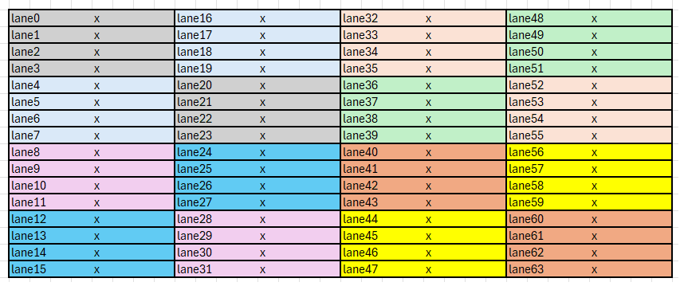
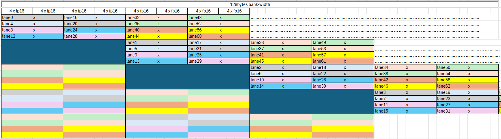

# Measuring bank-conflict behaviour

according to [lds-bank-conflict](https://rocm.blogs.amd.com/software-tools-optimization/lds-bank-conflict/README.html), `ds_read_b128` has non-trivial lane-group, but there is no documentation mentioned that. [test.py](./test.py) was designed to :
 - detect LDS bank numbers;
 - detect such lane-groups;

example test results on MI300 GPU:

```bash
======================== LDS bank size
stride_dword:    0   dt:   358.8 us
stride_dword:    1   dt:   358.3 us
stride_dword:    2   dt:   474.4 us
stride_dword:    3   dt:   362.3 us
stride_dword:    4   dt:   907.2 us
stride_dword:    5   dt:   356.8 us
stride_dword:    8   dt:  1805.6 us
stride_dword:    9   dt:   357.4 us
stride_dword:   16   dt:  3600.6 us
stride_dword:   17   dt:   357.8 us
stride_dword:   32   dt:  7196.0 us <=========== bank size 32 DWORDs (128 bytes)
stride_dword:   33   dt:   357.3 us
stride_dword:   64   dt:  7196.2 us
stride_dword:   65   dt:   358.0 us
stride_dword:  128   dt:  7199.9 us
stride_dword:  129   dt:   357.7 us
stride_dword:  256   dt:  7193.8 us
stride_dword:  512   dt:  3714.7 us
stride_dword: 1024   dt:  1919.8 us
======================== ds_read_b64 
lane_group:  [0, 1, 2, 3, 4, 5, 6, 7, 8, 9, 10, 11, 12, 13, 14, 15]
lane_group:  [16, 17, 18, 19, 20, 21, 22, 23, 24, 25, 26, 27, 28, 29, 30, 31]
lane_group:  [32, 33, 34, 35, 36, 37, 38, 39, 40, 41, 42, 43, 44, 45, 46, 47]
lane_group:  [48, 49, 50, 51, 52, 53, 54, 55, 56, 57, 58, 59, 60, 61, 62, 63]
======================== ds_read_b128 
lane_group:  [0, 1, 2, 3, 20, 21, 22, 23]
lane_group:  [4, 5, 6, 7, 16, 17, 18, 19]
lane_group:  [8, 9, 10, 11, 28, 29, 30, 31]
lane_group:  [12, 13, 14, 15, 24, 25, 26, 27]
lane_group:  [32, 33, 34, 35, 52, 53, 54, 55]
lane_group:  [36, 37, 38, 39, 48, 49, 50, 51]
lane_group:  [40, 41, 42, 43, 60, 61, 62, 63]
lane_group:  [44, 45, 46, 47, 56, 57, 58, 59]
```

it's not surprise to see that total amount of data read by each lane-group is exactly what 32-banks can provide: 128 bytes, to avoid bank-conflict, we only need to ensure data for lanes from same group doesn't conflict.

above tests confirmed lane group arrangement of `ds_read_b128` mentioned in above article, also it shows for `ds_read_b64`, the grouping was much more straight-forward.

# Using Memory Buffer Load to LDS

CDNA3 has a special type of MUBUF instructions which supports directly load from memory into LDS, w/o them, kernel has to issue load request to VGPR, wait data to come (possibly running some other computations in parallel), and then saving VGPRs to LDS. Following [Little's law](https://en.wikipedia.org/wiki/Little%27s_law), usually considerable amount of VGPRs are required (at least 8 x DWORDx4 = 32 VGPRs, considering Occupancy=8 cases) to fullfill the bandwidth of long-latency HBM memory.

But this instruction stores data from each of 64 lanes contiguously into LDS, which is `64-DWORDs` or `128-halfs` or `256-bytes` or `two 128-bytes bank-width`, w/o the opportunity of applying bank swizzling algorithm. while writing 256-bytes to LDS in continous way is bank-conflict free by nature, reading them into MFMA register layout isn't.

we want to read them using `ds_read_b128` which has lane-groups as shown below (lanes are colored by lane-groups):



And we'd also like to avoid the need for complex swizzling patterns (to save VGPRs & swizzle op) by simply padding between these 256-bytes units and make sure each unit's LDS-offset starts from required bank.

the padding may seem to be wasteful at first glance, but if we have a lot of instances of such 256-bytes units, we can group the units according to their bank request and only incur 1 padding for each group of units.



Also note that LDS bandwidth is shared by all SIMDs per CU, so that best performance kernel should use all SIMDs and share LDS data among them, for example, if your kernel allocated all LDS-memory, then a thread-block best uses all 4 SIMDs (at least 64*4=256 threads).

after introduced above method, we do observed speed-up. and if we replace the LDS reading index with `lane*8` (which is naturally bank-conflict-free), we do not see any further speed-up, which confirms that no bank-conflict is happening.

# Manual pipelining in occupancy=1 cases

If VGPRs register pressure is big and no over-subscription (SIMD unit hyper-threading) can exists, which means we can only afford 1 wave per SIMD and 4-waves per CU/thread-block, in this case, we have to do manual pipelining: 
 - allocating ping-pong/circular buffers in LDS
 - manually parallel(by interleaving) following stages:
   - directly loading data from HBM to LDS 
   - ds_read into registers
   - call MFMA instructions

But we found many un-neccessary `s_waitcnt vmcnt(0)` instructions following `buffer_load_dword lds` instructions, perhaps compiler failed to detect the independencies between these two stages, if we remove them from assembly files, we can see a great boost in performance.

