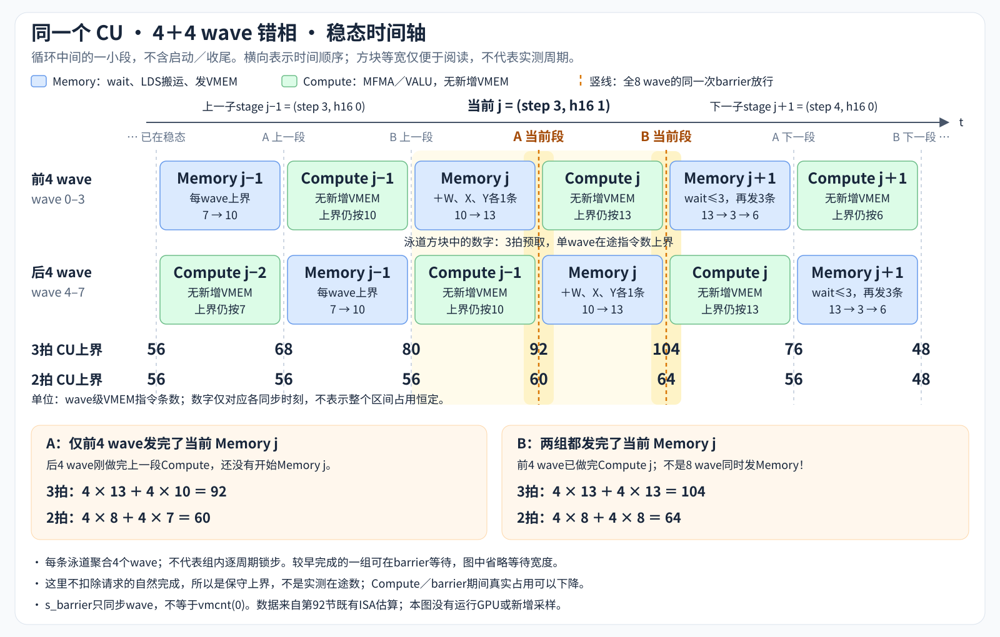
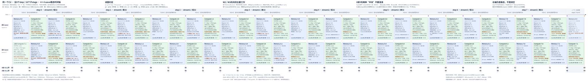

# GR read：性能基线与优化记录

本文件作为 GR read 的追加式优化日志。后续按日期和阶段在末尾追加实现、正确性、资源与性能结果；不覆盖旧基线，不把计划写成已实现收益。

**2026-09-14 当前状态：** 已完成 decoding 实现及 64K batch 基线测试；本次只阅读参考代码、记录结果、提出 prefill 方案，尚未修改 GPU kernel，也未重新运行 GPU 测试或采集 ISA/ATT/PMC。

## 1. 算子与接口契约

- 接口：[CombinedPaddedGRRead](combined_host.py#L13)，保留构造、`run_down(x)`、`run_up(x)`、`reader(x)`。
- 当前实现：[kernel.py](kernel.py)；单个基本测试及性能入口：[run_test](test_gr_read.py#L100)。
- 固定 `C=4`、`H=2560`、`R=320`、`K=C*H=10240`。`X[T,K]`、`W_down[R,K]`、`W_up[K,R]` 均为 BF16，输出 `Y[T,H]` 为 BF16。
- 当前 host 支持 `T=0..65536`，不代表逐一验证了范围内的每种形状。本轮已验证的代表点为 `T=1`、`T=17`、`T=65536`。

数学定义：

$$
A=\operatorname{SiLU}\left(\frac{XW_{down}^{T}}{C}\right),\qquad
L=AW_{up}^{T},\qquad
Y_{t,h}=\operatorname{BF16}\left(\frac{1}{C}\sum_{s=0}^{C-1}\sigma(L_{t,sH+h})X_{t,sH+h}\right).
$$

这里的 Down 是长归约维 `K=10240` 的降维投影；Up 是归约维 `R=320`、输出 `10240` 个 logits 的升维投影。不能混淆 Up 的归约维与算子输入宽度 `K`。

数值与内存约束：

1. GEMM 用 BF16 MFMA、FP32 累加；Down 在 FP32 中除以 4、计算 SiLU。
2. Up 使用 `A_hi=BF16(A)`、`A_lo=BF16(A-FP32(A_hi))`。对每个输出，当前累加顺序为 `hi128 → lo128 → hi128 → lo128 → hi64 → lo64`。
3. logits 在 sigmoid 前保持 FP32；四个 stream 按 `0,1,2,3` 顺序进行 FP32 乘加，再除以 4，最终只做一次 BF16 转换。不能先将 logits 或各 stream 的乘积降为 BF16。
4. [权重准备](combined_host.py#L36-L40)将 Up 权重变为逻辑 `[H,C,R]` 后 preshuffle；对应同一 `h` 的四个 stream 在 GEMM 的输出通道上连续。
5. 构造时完成 shuffle、JIT、workspace 分配；热路径为两个 GPU launch，一个已编译 host entry 串接。`partial`、`output` 地址复用，单实例用于顺序调用，不承担并发 stream 的 workspace 隔离。
6. `T>16` 的当前 `partial` 是 FP32 `[padded_T,R]` 的 SiLU 结果；`T<=16` 是 16 份 split-K 原始 dot partial。新 prefill 路径优先保持前一种 FP32 SiLU ABI，不额外引入全局 high/low 缓冲区。

## 2. 2026-09-14 / D0：小 batch decoding 基线

实现过程：

- 建立 BF16 K128 B 双缓冲实现，保留原接口、两个 launch 以及高／低 BF16 补偿。
- `T<=16` 使用 CTA split-K partial；`T>16` 使用四 wave 分 K、LDS 求和并融合 SiLU。
- Up 使用 `BM=16`、`BN=128` logits、四 wave 分 N；归约维固定 `128+128+64`。high 常驻寄存器，low 按需从 LDS 读取。
- 测试先验证 combined、分段 Down/Up、padding 和修改输入后的 graph replay，然后可选测速。

历史小 batch 测量（本会话前一轮结果，本次未重测）：

| T | 阶段 | 时延（µs） | 有效 TFLOPS |
| ---: | --- | ---: | ---: |
| 17 | Down | 18.700 | 5.958 |
| 17 | Up + gate/mean | 13.220 | 8.427 |
| 17 | Total | 30.160 | 7.388 |

`T=17` 输出 `rel_l2=0.0016524929080964723`，最大绝对误差 `0.0020203144535453355`，超限数 0；`T=1` 的小行分支也通过。这里不声称已有完整小 batch 性能矩阵。

## 3. 2026-09-14 / D1：64K batch 全量验证与当前性能

### 3.1 这一步实际改了什么

- 将 host/CLI 的行数上限从 24 扩大至 65536，**未改变 BM16 decoding 流水、tile、调度或 GEMM 数学**。
- [FP64 参考](test_gr_read.py#L40)及[误差检查](test_gr_read.py#L58)以至多 1024 行分块执行，覆盖全部 65536 行，不是抽样。
- 保留一个 pytest 基本测试。CLI 的 `--rows 65536` 测试大 batch；`--check-only` 只验证正确性。

### 3.2 测量口径

- GPU4：AMD Instinct MI308X，`gfx942:sramecc+:xnack-`，运行时报告 **80 CUs**，PCI `0001:0B:00.0`。
- 已核验 PTL 为 **Enabled / VECTOR,F8**，功耗上限 650 W；测试未修改 PTL、频率、功耗或 NUMA 设置。
- 性能测前目标卡 GPU use / VRAM 为 0%；测后 GPU use 为 0%、VRAM 为 4%，PTL 未变。这是首尾查询，不是全程无外载证明。
- `cudaPerf`，预热 2 次、测量 10 次、**10 组真实 X／已 shuffle 权重／partial／Y 缓冲轮换，取时延中位数**。
- shuffle、JIT、分配、FP64 参考、投毒及输出校验均不计时；性能计时不是 graph replay，graph 仅用于功能验证。
- Down、Up、Total 分别计时。**Total 是组合入口的实测值，不由两个组件时延相加得到。**
- 测试输入使用 `seed=131`，随机 BF16 X 与随机 BF16 权重（权重乘以 0.02）。所有计时缓冲的输出也经过校验。

有效 GEMM 工作量：

$$
F_{down}=F_{up}=2TKR,\qquad F_{total}=4TKR.
$$

`T=65536` 时，单阶段有效工作量为 `429496729600 FLOPs`，Total 为 `858993459200 FLOPs`。这不计 SiLU、sigmoid、gate/mean 的逐元素操作。

“执行 GEMM TFLOPS”另包含 M padding 和 Up 的 high/low 两次 MFMA：

$$
F^{exec}_{down}=2T_{pad}KR,\quad
F^{exec}_{up}=4T_{pad}KR,\quad
F^{exec}_{total}=6T_{pad}KR.
$$

这是执行工作量除以 wall time，不是 ATT union×roof 得到的模型 TFLOPS。64K 已整除 BM16，`T_pad=T`。

### 3.3 当前性能

以下数字已重新对照上一轮保存的 64K 测试 stdout；本次仅记录，不产生新性能样本。

| 阶段 | 时延（µs） | 时延（ms） | 有效 TFLOPS | 执行 GEMM TFLOPS | 理想 TB/s |
| --- | ---: | ---: | ---: | ---: | ---: |
| Down | 18637.650 | 18.637650 | 23.045 | 23.045 | 0.077 |
| Up + gate/mean | 20716.460 | 20.716460 | 20.732 | 41.464 | 0.085 |
| **Total** | **39331.209** | **39.331209** | **21.840** | **32.760** | **0.081** |

“理想 TB/s”只按各阶段操作数读／写各一次建模；没有计入所有 CTA 重复读取，也不是 HBM 计数器值。不能据此判定实际带宽利用率或具体瓶颈。

### 3.4 正确性

容差保持参考测试原值：Down `rtol=atol=2e-5`，输出 `rtol=1e-2, atol=5e-3`。

| 指标 | Down（FP32 SiLU） | 输出 Y（BF16） |
| --- | ---: | ---: |
| 状态 | PASS | PASS |
| 最大绝对误差 | 1.56504818638048e-06 | 0.0039061109999947163 |
| 平均绝对误差 | 6.027915763886822e-08 | 0.00028127446136413004 |
| rel_l2 | 3.264998013526857e-07 | 0.0016615941737686932 |
| calc_diff | 5.3512749786932545e-14 | 1.3804498398828358e-06 |
| 超限数 | 0 | 0 |

combined、分段调用、修改输入后的 graph replay 均通过。64K 本身没有 M padding 行，不能将该点的空 padding 检查当作非整齐尾块验证；原 `T=1/17` 覆盖过 BM16 的非整齐尾部。64K 修改后小 batch pytest 回归为 `1 passed`，另有既有 allocator 配置 warning。

### 3.5 当前结构与大 batch 约束

| 项目 | Down | Up + gate/mean |
| --- | --- | --- |
| tile | M16 × N16 × K128 | M16 × N128 logits，归约 128+128+64 |
| wave / CTA | 4，分 K | 4，分 N |
| 64K grid | `(4096,20,1)` | `(4096,80,1)` |
| CTA 数 | 81920 | 327680 |
| 源码 LDS 分配账本 | 36864 B = 36 KiB | 61696 B = 60.25 KiB |

Down LDS = 四个 wave 各自的双槽 B 共 32 KiB + 四 wave 的 FP32 partial 共 4 KiB。Up LDS = high/low hidden 共 20736 B + B 双槽 32768 B + FP32 logits 8192 B。以上是源码分配账本，尚不是编译产物的寄存器／occupancy 实测。

每组 64K 缓冲：X 1.25 GiB，partial 0.078125 GiB，Y 0.3125 GiB，另有两份各 6.25 MiB 的权重。X 大小小于 2 GiB，当前声明的 64K 范围内不需要为它强行改成大于 4 GiB 的 buffer 方案。

当前可证的是 BM 小、CTA 数多、A/B 复用范围有限；这些给出优化方向，**尚无 ATT/PMC 或干预实验能将 39.331209 ms 精确归因于某一项**。

## 4. 2026-09-14 / P0：阅读后的 prefill 实现方案（未实现）

### 4.1 两条参考路径的实际分工

| GR read 阶段 | 参考代码 | 可借鉴的结构 | 不应直接搬入 |
| --- | --- | --- | --- |
| Down | [1x4 GEMM](../../../src/contrib/flydsl/moe_gemm_2stage/gemm1.py#L1476-L1760)与[gateup prefill 入口](../../../src/contrib/flydsl/moe_gemm_2stage/gemm1.py#L2094) | 4 waves 分输出通道；B-first MFMA；A 的 LDS ping-pong；B 直读寄存器双缓冲；K 循环预取与 MFMA 交织；尾拍排空 | MoE sorted IDs、expert/scatter、两路 gate/up、FP8 scale、BF16 gate-up 输出舍入 |
| Up + gate/mean | [k128n body](../../../src/contrib/flydsl/moe_gemm_2stage/gemm2_8x1.py#L455-L905)及[逐拍流水](../../../src/contrib/flydsl/moe_gemm_2stage/gemm2_8x1.py#L911-L1022) | 8 waves 分 M；A 在 prologue 驻寄存器；B g→r→s 双槽与双寄存器预取槽；N 循环；4+4 waves 错相；上一输出片段的 epilogue 与当前独立 MFMA 交织 | FP8 数据类型和 lane packing、routing/scale、MoE packed-output ABI、原 BF16 pack 的数学、原 VMEM/LDS wait 常量 |

重要区别：

- [参考 8x1 入口](../../../src/contrib/flydsl/moe_gemm_2stage/gemm2_8x1.py#L47-L75)限定 FP8；其实际 `K=320` 被分流到 `128+192` 专用实现。GR read 此处要借鉴 k128n 的架构，**不是直接调用 K320 分支，也不是将 R320 补到 384**。
- GR read 的 Up 保留 `K_widths=(128,128,64)`。尾 64 能被 BF16 MFMA 的 K16 整除，须使用真正的 K64 读／算片段，不越界多读 64 元素。
- FP8→BF16 后，同几何 B 的字节数翻倍；不能直接复制 `M256/N128` 和原 LDS 分配。
- [1x4 调度器](../../../src/contrib/flydsl/moe_gemm_2stage/gemm1.py#L1666-L1737)按两个 gate/up GEMM 预算；改成单投影后需要重算每拍 VMEM、LDS、MFMA 数量，不能只删第二个 GEMM 而保留原预算。

### 4.2 首选 Up：dense 8x1，A 常驻，B 跨 N 流水

**首个候选几何：BM128 / BN64 logits / 8 waves。** BF16 MFMA `16×16×16`，B-first：矩阵 M 侧为输出通道，N 侧为 token，waves 按 token 分布，每 wave 16 行。

1. **A 准备。** 从当前 FP32 SiLU `partial` 直接按片读取、生成 BF16 high/low 并放入 MFMA 寄存器布局；不要保留整个 BM128 的 high/low LDS。逐小片转换后释放 FP32 临时值，不同时常驻整份 FP32 A 与 high/low。
2. **A 资源预算。** high/low 总 payload 为 `128*320*2*2/512/4 = 80` 个 32-bit 寄存器槽／lane，仅是数据量账本，未包括 B、C、地址和临时值，不能当作最终 VGPR 数量或无 spill 保证。暂不直接上 BM256。
3. **B 存储。** 两个完整 `N64×K128×BF16` 槽共 32 KiB，每槽保留独立的 N32 L/H 半区，各预留 8 KiB。K128 的 N32 packet 为 8 KiB，可由 512 lanes 各搬 16 B；K64 尾包为 4 KiB，各搬 8 B。槽间／半区间偏移按最大容量固定；半区内部的 preshuffle 布局、N16 子片偏移和读取长度按实际 K128/K64 计算，尾包不读取预留的空余区域。
4. **明确时间与地址。** `q=6*n+step`，`kb=step%3`，`half=step//3`；每个 N64 的六拍为 `L128,L128,L64,H128,H128,H64`。参考的 full-slot parity 可按 `(3*n+kb)&1` 扩展，half 另占地址区间。不能把所有半区压成两个 N32 槽后直接用 `q&1` 覆写，否则会改变错相消费者的存活期。
5. **Memory / Compute。** Memory 读当前 B s→r，等待旧预取 B 后向后继槽 r→s，再发出更远 B g→r；Compute 使用驻留 A high/low 与当前 B。首 N、跨 N 回边、末 N 分开排空。只有在明确的 consumer-retired 屏障之后才能复用 LDS；4+4 错相的 prologue/epilogue 必须成对闭合。
6. **跨 N 复用。** 一个 CTA 顺序处理多个 N64，避免当前每个 N CTA 重读／重建同一 A。64K 首版可先让每个 M128 CTA 遍历全部 160 个 N64，形成 512 个 CTA；这里只是明确起点，不宣称 512 CTA 的负载分布已经最优。先不叠加 OC 拆分、persistent queue、task swizzle。
7. **精度顺序。** 每个 logit 保持 `hi128,lo128,hi128,lo128,hi64,lo64` 的累加顺序；允许在不同 logit 的 MFMA 之间交织独立 gate/mean，但不重结合单个输出的高／低项。

**Up epilogue 单独处理，不调用原 MoE `pack_8x1_record`：**

- 目标 B-first 坐标是 `token=128*m_block+16*wave+lane%16`，`channel=64*n+16*packet+4*(lane//16)+v`，其中 `packet=0..3` 为整个 N64 内的 N16 子片号，`v=0..3`。因此同一 lane 的四个 FP32 值对应同一个 H 列的四个 stream；这份坐标需要先用布局枚举核验，再用于生成代码。
- 对完整归约后的 FP32 logits 做 sigmoid，读同一 token/H 的四路原始 X，按既有 stream 顺序 FP32 乘加／除 4，最后 BF16 RNE。绝不把 logits 提前存为 BF16。
- 尝试像 k128n 一样，把已完成片段的 gate/mean 放到后续独立 MFMA 的 Compute 段，而不是统一塞到 Memory 段。只携带尚未处理的 FP32 logit 片段和已经完成的 BF16 Y，控制跨 N 生存期。
- 初始最终 Y 重排可用 wave-private scratch：`8*16*(64/4)*2 = 4096 B`。目标分配账本为 B 32 KiB + 最终 Y 4 KiB = **36 KiB**，不包含 hidden LDS 和全量 FP32 logits LDS。
- 必须同时验证 **X g→r 合并访问**和 Y r→g 布局；“每 lane 四个连续 logits”不等于 X 的 stream-major 读取已经合并。若需要 FP32 片段重排，保留 FP32 的 N16 微片 scratch 也只需 `128*16*4 = 8 KiB`，加上上述分配是 44 KiB；这是可行的保守后备，不先牺牲精度来坚持 36 KiB。
- wave-private scratch 只由所属 wave 使用，读完后才复用；不能在部分 wave 的 epilogue 中随意插入全 CTA barrier，破坏 4+4 错相协议。

以上 LDS 与寄存器均是**候选设计账本**。实际 ISA、编译器额外临时值、bank conflict、occupancy 与时延尚未验证，不据此预报加速倍数。

### 4.3 首选 Down：单投影 1x4，A LDS 双缓冲、B 直读

**首个候选几何：BM64 / BN64 / BK128 / 4 waves 分 N。** `R=320` 恰好是 5 个 N64，不将降维输出错误地再除以 2，也不为 N128 补出大量无效通道。

1. 使用 1x4 的 B-first BF16 MMA 和 A 的 swizzled LDS ping-pong。每个 A 槽 `64*128*2=16 KiB`，双槽 **32 KiB**。B 为原始 preshuffle 权重，直接 g→r 双缓冲，不再为各 split-K wave 建立 B LDS。
2. 去掉 MoE IDs、expert、scatter、gate/up 成对权重以及 FP8 scale。X 直接用连续 M 行，输出为 FP32 SiLU `partial[:,320]`。
3. 长 K 为 80 个 BK128，预取、当前 LDS 读取、MFMA、下一 A r→s 交织；末拍不读第 81 个 K tile。
4. **首版保留当前 Down 的分组累计顺序。** 当前 wave `s` 依次计算 `kb=4*i+s`，最后按 `s=0..3` 在 FP32 求和。新四 waves 已用来分 N，因此在各 wave 内保留四条 C 寄存器链：一轮展开四个 BK128，共 20 轮，分别更新 C0/C1/C2/C3，最后同序求和。这样移除跨 wave 的 K 归约通信，同时不把它悄悄改成 80 个块的一条串行累加链。
5. 四链 payload 为 `4*64*64/256=64` 个 FP32 值／lane；不是四倍 GEMM 工作，每条链只接收四分之一 K。需要实际检查寄存器分配，不能为减少寄存器而放宽 Down 的 `2e-5` 门限。
6. 求和后在 FP32 除以 4、做 SiLU，再写 FP32 P。若需要 CShuffle，`64*64*4=16 KiB` 的 FP32 scratch 可在全部 A LDS 读完成后复用 A 区域，峰值仍由 32 KiB A ring 决定；重排的 FP32 swizzle 需另行推导。
7. 64K 时 Down CTA 数从 81920 减为 `1024*5=5120`。这是工作划分变化，不是已经测得的 16 倍提速。

### 4.4 接口、workspace 与实施顺序

- 只在 GR read 的本地实现中新增候选；不修改两份生产 MoE 参考实现，不直接调用它们带 MoE 契约的 builder。
- Down/Up 使用独立的 `block_m` 配置，不再把单个 `Config.block_m` 同时用于两阶段。prefill workspace 按 Up BM128 对齐，Down 按统一 padded rows 覆盖写出全部 P，包括零 padding；小 batch decoding 的原布局保留。
- 公共输出仍为 BF16 `[T,H]`、中间仍为 FP32 `[padded_T,R]`、组合仍为两个 GPU launch。内部实现选择先显式启用候选，**不立即根据未经测量的阈值替换所有 batch 的默认路径**。
- 权重仍在准备阶段处理，热路径不得增加 Torch GEMM、重新 shuffle、临时分配或 host 回读同步。

后续按以下小步执行，每一步完成后只往本日志末尾追加：

1. **P1：仅替换 Up。** Down 与 P 不变，先验证 tile/lane 映射、K64 尾部、slot 生命周期、graph，然后比较旧／新 Up-only，确认后测 Total。
2. **P2：仅替换 Down。** 使用上述四累加链和 FP32 SiLU ABI，对照旧 Down；Up 固定，不同时改变两边数学或 workspace。
3. **P3：整合两阶段。** 验证 combined/staged 与实际计时输出。确认正确性与时延后，再讨论大 batch 默认选择；保留小 batch 路径。

验证范围先保持最小：复用一个 `run_test`，一个非整齐小形状检查新 M padding，再做目标 `T=65536` 的分块全量 FP64 检查和 changed-input graph replay；不自动扩大 batch/shape 矩阵。性能使用空闲 GPU、相同 PTL、相同数据与共享预分配地址的两版本对照、多 buffers、中位数；有效工作量公式不变，Total 独立计时。

代码改动后需要另核对实际 BF16 MFMA、VMEM/LDS producer-consumer 等待、VGPR/SGPR/AGPR、LDS 与 spill。源码中的 wait 数字和本节数据量估算都不能代替这些检查。ATT/PMC 仅在出现具体待解释的问题时再采，不因为生成文档重跑。

**本轮停在 P0：方案待确认；没有实施 P1/P2/P3，也没有新性能结论。**

## 5. P0 准备修改前的源码身份

以下 SHA256 是本轮记录文档时只读核验的当前文件身份；不是追补声称历史测量时已保存了完整 ELF/ISA 证据。后续改动需用新条目绑定新源码和测量，保留本表。

| 文件 | SHA256 |
| --- | --- |
| [kernel.py](kernel.py) | `ed2e63b21cdae93368b699565bda455764e4e27b04b0613efc7d7a5a7fd9b2c4` |
| [combined_host.py](combined_host.py) | `e0d066516e5eedc85ff5fdd98f72585ea05f42d18f5ac13bcefc1123df71d7da` |
| [test_gr_read.py](test_gr_read.py) | `fb980c514f8383a85e5de0b1bd5e2e2a35c315bf86c4de82b086a5a26d4b6045` |
| [Down 参考](../../../src/contrib/flydsl/moe_gemm_2stage/gemm1.py#L1494) | `0d0acc47f2cc19e0aef021d118f595ecd0d01b7c055b7416bb99b909d1e0f9a7` |
| [Up 参考](../../../src/contrib/flydsl/moe_gemm_2stage/gemm2_8x1.py#L456) | `ef53d88c19ebedbbc955c2a7c8642206800992c7cdb2e93266967996bdd8875a` |

## 6. 2026-09-14 / P1–P3：BF16 Up K64×5 与 Down 1x4 已实现

本条覆盖第 4 节的待实施状态及 Up `128+128+64` 提案，历史文字不回写。本轮用户明确要求：**Up 归约使用五个 K64，8x1 Memory 不包含 VALU，后处理融合进 MFMA Compute 段。**

### 6.1 实际代码与选择方式

- [up_8x1.py](up_8x1.py)：dense Up，`BM128/BN128 logits/BK64/8 waves`。K64 使同样 32 KiB B 双槽能够容纳 N128，因此首版使用 BN128，而非原提案的 BN64。
- [down_1x4.py](down_1x4.py)：单投影 Down，`BM64/BN64/BK128/4 waves`；A 经 LDS 双缓冲、B 直读寄存器。
- [combined_host.py](combined_host.py)显式选择 `implementation="prefill"` 使用两阶段新实现；`implementation="up_8x1"` 只换 Up，要求 `T>16` 的 FP32 SiLU P；默认 `decode` 保留，未凭单个 64K 点推广 batch 切换阈值。
- [test_gr_read.py](test_gr_read.py)仍只有一个 pytest 基本测试，现验证 `T=129` prefill 的非整齐尾行。CLI `--rows 65536 --implementation prefill --check-only` 进行新路径全量功能验证；`--rows 65536 --compare` 进行同址两版本对照。`--json-output` 保存结果，拒绝覆盖已有收据。
- 生产 MoE 两份参考代码与 [kernel.py](kernel.py) 的旧 decoding GPU 实现保持原样。公共输出和两个 GPU launch 契约不变。

### 6.2 Up 的实际 Memory / Compute 分工

1. **prologue：** 从 FP32 P 直接读取并生成五个 K64 的 BF16 high/low；A 驻寄存器，不分配 hidden LDS。准备输入掩码、B/输出/重排地址并约束为 VGPR，后续 N 奇偶槽地址在上一 N 的 Compute9 准备并通过 SSA 回边传递。
2. **B ring：** 两个完整 N128×K64 BF16 槽，共 32 KiB；每槽有独立 N64 L/H 半区。`q=10*n+step`，`kb=step%5`、`half=step//5`、槽为 `(5*n+kb)&1`。每 packet N64×K64 为 8 KiB，由 512 lanes 各搬 16 B。B 寄存器预取也是两个槽，当前 Memory 读 q、写 q+1、再预读 q+3，末尾不越过第 79 个 N128。
3. **Memory：** 使用原生 buffer load/store、DS read/write、标量 soffset、wait/barrier；无 BF16 转换、sigmoid、gate/mean、向量地址计算或 `v_mov`。原生 DS inline asm 不提供 LLVM 可分析的异步依赖，因此消费前显式 `lgkmcnt(0)`；B/X 消费先用保守 `vmcnt(0)`，本轮不再为放宽 wait 扩展调优。
4. **Compute：** 每个 K64 依次完成 high 的四次 K16 MFMA、low 的四次 K16 MFMA。相邻输出通道组可以交织，但不将高／低项分别累加成两个全 K 结果。相比 D1，K 分组从 `128+128+64` 改为 `64×5`，浮点累计次序随之变化；保留原 FP64 容差验证，而非声称与旧输出逐位相同。
5. **后处理：** Compute0 处理上一 N 的 upper logits，Compute5 处理当前 N 的 lower logits；独立 sigmoid、X BF16 解包、四 stream FP32 乘加、mean 和最终 BF16 RNE 与当前 MFMA 交织。已算好的 BF16 字在下一 Memory 写入 wave-private Y scratch，重排后的字在 Compute1/6 打包，随后 Memory2/7 写全局。
6. **错相：** group1 在首拍前补一次 barrier，group0 在末拍后补一次 barrier，闭合 4+4 waves 的 Memory/Compute 错相。wave-private scratch 在读取完成后才复用，不引入非对称 CTA 同步。
7. **drain：** 最后一个 upper 输出没有后继 GEMM，只能在显式 Compute drain 做数学，再按 Memory shuffle → Compute pack → Memory store 收尾；不能把这部分描述成仍与不存在的下一拍 MFMA 重叠。

64K 的 Up grid 为 `(512,1,1)`，每 CTA 跨全部 80 个 N128；每 wave 动态执行 `80*10*32=25600` 条 BF16 MFMA。没有新增 persistent queue、atomic、task swizzle 或 N 拆分优化。

### 6.3 Down 的实际实现

- 4 waves 按输出通道分布，单个 CTA 计算 64 行×64 列，`R320` 恰好是 5 个 N64；64K grid 为 `(1024,5,1)`，共 5120 CTA。
- 32 KiB A LDS ping-pong，BF16 swizzle；B 直读寄存器双缓冲。无需 MoE 排序、expert/scatter、成对 gate/up 或 FP8 scale。
- 每 wave 保留四条 FP32 C 链，分别处理 `kb=4*i+s`，最后按 `s=0..3` 求和。与旧四 wave K 分组一致，但不再通过跨 wave LDS 做 K 归约。
- 19 轮四拍消费 K0..75，尾部四拍消费 K76..79；`next_k` 是预取目标，不是当前计算块，不遗漏 K77，也不读 K80。每 wave 动态 MFMA 为 `80*32=2560` 条。
- 最后 FP32 除以 4、SiLU、直接向量化写 P；该首版无需 CShuffle scratch。prefill P 按 BM128 对齐，Down 覆盖全部 padded 行；Up 按真实 rows 掩码读取，最终 Y 只写有效行。

### 6.4 正确性与真实 ISA 验收

证据入口：

- [64K 全量正确性](results/k64x5_20260914/correctness.json)。
- [64K 最终 ISA 审计](results/k64x5_20260914/isa_final.json)和[审计实现](check_isa.py)。
- [独立 Up ISA](results/k64x5_20260914/ir/gr_read_up_8x1_k64_0/21_final_isa.s)、[独立 Down ISA](results/k64x5_20260914/ir/gr_read_down_1x4_0/21_final_isa.s)、[组合入口 ISA](results/k64x5_20260914/ir/combined/21_final_isa.s)。同目录保留编译 IR 与嵌入 code object。
- [小 batch decode 回归](results/k64x5_20260914/decode_small.json)。

功能结果：

| case | 结果 | Down rel_l2 | 输出 rel_l2 | 输出最大绝对误差 |
| --- | --- | ---: | ---: | ---: |
| T129，仅替换 Up | PASS | 3.2681602267558377e-07 | 0.0016580732224435416 | 0.0037348989476688743 |
| T129，完整 prefill | PASS | 3.2681602267558377e-07 | 0.0016580732224435416 | 0.0037348989476688743 |
| T65536，完整 prefill | PASS | 3.264998013526857e-07 | 0.001661594173770282 | 0.0039061109999947163 |
| T1，原 decode | PASS | 1.6283053586013683e-07 | 0.0016552570283416214 | 0.0019153120488761832 |

全部超限数为 0，未放宽 Down `rtol=atol=2e-5`、输出 `rtol=1e-2,atol=5e-3`。combined/staged、NaN 投毒、P padding 清零、修改 X 后的 graph replay 均通过。最终唯一 pytest 为 `1 passed`，保留既有 allocator warning；不是全仓测试通过声明。

资源是实际 64K 编译产物 metadata，不是模型：

| kernel | VGPR | SGPR | AGPR | LDS | private bytes | VGPR/SGPR spill |
| --- | ---: | ---: | ---: | ---: | ---: | --- |
| Down1x4 | 138 | 26 | 0 | 32768 B = 32 KiB | 0 | 0 / 0 |
| Up8x1 K64×5 | 238 | 36 | 0 | 40960 B = 40 KiB | 0 | 0 / 0 |

Up 的 40 KiB = B 双槽 32 KiB + Y wave-private scratch 8 KiB。`next_free_sgpr=96` 与表中 SGPR metadata 是不同口径，不能混用。238 VGPR 仍高，不从“无 spill”推出最佳 occupancy。

**Memory 无 VALU 的检查范围：** 首 N 10 段 + 运行时 N 回边的静态循环体 10 段 + 末 N 10 段 + drain 2 段，共 **32 个静态区间**；再按 `s_setprio 0→3` 边界和末尾 store 后检查，全部拒绝任何 `v_` 指令，包括 move。32 不代表动态只有 32 拍：每 wave 实际经历 800 个主体 Memory 拍。

Up 每个静态主体 Compute 有 32 条 MFMA，首／循环／末合计 960 条静态 MFMA。独立与组合 ISA 的五个带后处理 Compute（FIRST5、LOOP0/5、LAST0/5）均有 16 条 exp，且最后一条 exp 之后仍有 MFMA，证明不是所有 MFMA 完成后才统一处理。布局 CPU 枚举验证 wave 内 512 个 Y 值无重复／缺失；800 拍×两组 producer 的 B 槽生命周期检查通过。额外插入 Memory VALU、标记外尾部 move、删除显式 DS 等待、破坏阶段标签的四个负例均被拒绝。这些 CPU 模型检查不替代上面的 GPU 功能结果。

实施中修复过两项真实编译问题：单 DWORD 原生 load/DS 要用标量 i32，`vector<1xi32>` 导致 LLVM scalarize/寄存器约束错误；Down C 累加需保留 fragment 层次布局再做 Vector SiLU。另修复过审计器 YAML 首字段假设与测试新增预检块缩进；未通过修改容差、放宽审计或覆盖旧失败收据解决。

### 6.5 64K 同址两版本性能

[原始性能数据](results/k64x5_20260914/performance.json)保存 60 个有效事件（3 scopes×2 实现×10 samples），10 buffers、预热 2 次、交替 AB/BA。所有 X、已 shuffle 权重、P、Y 地址在对应的 decode/prefill pair 中相同；仅 callable 不同。首先测 Up-only，再 Down-only，最后直接测组合 Total。所有输出在每次事件后校验，校验不计时。

环境仍为 GPU4、gfx942、运行时 80 CUs、PCI `0001:0B:00.0`、PTL **Enabled / VECTOR,F8**。测前 GPU/VRAM 为 0%，测后 GPU use 0%、VRAM 4%、R/W activity 1%，PTL 未变；本轮无硬件设置写入。首尾查询不能证明整个测量窗口无外部干扰。

| 阶段 | decode 时延（ms） | prefill 时延（ms） | decode 有效 TFLOPS | prefill 有效 TFLOPS | 中位数时延比 |
| --- | ---: | ---: | ---: | ---: | ---: |
| Up + gate/mean | 20.660424 | 11.472227 | 20.788 | 37.438 | 1.801× |
| Down | 18.658675 | 3.755436 | 23.019 | 114.367 | 4.968× |
| **Total** | **39.308319** | **15.370163** | **21.853** | **55.887** | **2.557×** |

有效工作量继续为 Down/Up 各 `2*T*K*R`，Total `4*T*K*R`；Up 的 high/low 额外 MFMA 只影响执行工作量，不人为翻倍有效 TFLOPS。Total 独立计时，不由组件相加替代。该表使用同场 decode 对照，不能把 D1 历史 39.331209 ms 当作本次配对值。

prefill Total 有一个 `18.229984 ms` 样本，其余约 `15.285–15.395 ms`；全部保留，未删除长尾或重测到更好结果。这是本次 10 样本的基线改进，不外推其他 batch，也没有 ATT/PMC 因果归因或自动扩大矩阵。

### 6.6 交付边界与后续

- 旧 README 前 18626 字节（SHA256 `9d3bb6085d8bdb5646d05e64c805b6bac2214d6d96456f54d78873c577e5388f`）保留；本节只追加。
- 性能/64K 正确性收据绑定当时的 host、test、audit SHA；之后只更新 host/test 说明、增加对照前逐组件投毒预检、加强审计器 stage/DS等待/尾部检查。**计时循环和三份 GPU 源码未变**；旧样本不冒称由后加的预检生成。后加预检只在计时外执行，不重新生成性能数字。
- 最终 GPU 源码：Up SHA256 `4621f891077ee7d1290915a83fdd3c39546e9e74e2b8b4b30b04ce4674b4a926`；Down SHA256 `1a99c684e5dec332993f292e70c2cec48be215405c83bb6895ebf9d44cc39de9`；旧 decode 保持第 5 节 `ed2e63b2…`。
- 明确保留两个实现供复测：默认 `decode`，显式 `prefill` 启用本轮优化。下一步若调优，优先查 Up 的 238 VGPR、X/Y transaction 合并与保守 waits；不以减少源码指令数量直接宣称提速，不把后处理迁回 Memory。
- 编辑器对 `pyhip.misc` 仍可能有环境相关 `reportMissingImports`；实际同一配置 Python 的根目录 pytest/CLI 导入均通过，本轮未改全局 Python/Pylance 路径以掩盖提示。

## 7. 2026-09-14 / T200：以 200 有效 TFLOPS 为目标的优化

**结论：Down 达到 224.233 有效 TFLOPS，Total 达到 107.468 有效 TFLOPS；整链 200 目标尚未达到。** 本节不以 Up high/low 的执行工作量翻倍改变有效 TFLOPS 口径，也不以 Down 单阶段达标代替整链达标。

### 7.1 目标与范围

目标形状仍为 `T=65536,C=4,H=2560,R=320,K=10240`。按此前有效工作量 `F_total=4*T*K*R=858993459200 FLOPs`，200 TFLOPS 对应 **Total≤4.294967296 ms**；若单阶段以 200 为目标，则 Down/Up 各需≤2.147483648 ms。

本轮只优化这一形状及必要的小尾块正确性，不扩大 batch 矩阵。继续遵守：

- Up 必须为 **BF16 K64×5**，不移除 high/low 补偿。
- Up Memory 不含 VALU，地址与转换在 prologue/Compute；sigmoid、gate/mean、最终 BF16 RNE 融合在 MFMA Compute。
- 单个 pytest；使用当前 FP64 容差，不能为候选放宽门限。
- 原 `decode` 与 `prefill` 保留作对照；通过 [CombinedPaddedGRRead](combined_host.py)的 `implementation="tuned"` 显式启用本轮最佳组合，默认不变。

### 7.2 采用的 Up 改动

[up_8x1.py](up_8x1.py)保留 `BM128/BN128/BK64/8 waves` 和 4+4 错相，加入以下已测改动：

1. **按需 VMEM 等待。** `up_vmem_waits` 按实际 B、X、Y 指令顺序计算 producer 年龄，替代每拍无差别 `vmcnt(0)`。X 从 Memory4/9 提前到 Memory3/8；等待前后的调度屏障保持请求顺序。B/X 的消费都受保护，不能仅以 B 的年龄忽略 X。
2. **N 四分片。** 每个 M128 分成四个连续 N 区间，每 CTA 处理 20 个 N128，64K grid 从 `(512,1,1)` 变为 `(512,4,1)`。所有 B/X/Y 都加同一 `n_base`，分片前缀互不重叠，不增加有效 GEMM 工作量；P 准备被重复四次，这是代价而非免费并行。
3. **X 合并读取。** 每半区由 4 lane 覆盖一个 token 的 8 个 H 元素，分两轮、四 stream，共 8 条 DWORD VMEM／wave；用 16 条 `ds_bpermute_b32` 恢复 MFMA 输出 lane 的 X 值。旧版本为 16 条分散 DWORD VMEM。原始 BF16 位值不变，源 lane 选择在 prologue，Memory 只执行固定地址路由，BF16 解包留在 Compute。
4. **分散后处理。** 上一 N 的 upper 结果在 Compute0–3、当前 N 的 lower 在 Compute5–8 处理，每拍仅四个 sigmoid，而非将 16 个集中在 Compute0/5。最后打包分别放在 Compute3/8，Memory4/9 进行 Y scratch 重排，随后 Compute4/9 生成待存 DWORD；Memory5 和下一 N Memory0 写回。lower 待存字通过显式 SSA 跨 N 携带，最后 N 的 lower 在 drain 写出。
5. **Memory 仍为纯访存。** 数学、bit 操作、lane 地址计算均未搬回 Memory；原生 DS load-use 保留显式 `lgkmcnt(0)`。同一 logit 仍按每个 K64 的 high→low 顺序累计，四路 gate/mean 顺序不变。

### 7.3 采用的 Down 改动

[down_1x4.py](down_1x4.py)的 tuned 配置为 **BM64/BN320/BK64/4 waves，A LDS 双槽，B 直读**：

- 一次覆盖全部 320 个降维输出通道，避免旧五个 N64 CTA 重复读取 A；64K grid 为 `(1024,1,1)`。
- A 双槽由 32 KiB 降到 16 KiB。每 wave 分担 80 个通道，160 个 K64 tile 按原始 K 顺序计算。
- 使用单条 FP32 输出累加链，不再保留旧四条 K128 分组链。**这是浮点求和顺序的变化**，不是逐位等价重构；单独 Down 及最终整链对全部 64K 行维持原 `rtol=atol=2e-5`，未放宽精度。
- 按真实片段预算 A/B VMEM、A LDS 读写和 MFMA，加入指令交错。该调度只允许已验证的 `(BM,BN,BK,single_chain)=(64,320,64,True)`，不泛化原 gate/up 双投影调度的计数。
- 最终仍 FP32 除 4、SiLU、写 FP32 P；没有新增量化或单独后处理 kernel。

### 7.4 组件实验过程（含回退，不拼接样本）

实验入口：[benchmark_tuning.py](benchmark_tuning.py)。下面每行都是各自同场的组件对照，通常 4 buffers、预热 2、6 个有效样本，正反顺序。Up 先做 T129 FP64＋changed-input graph，64K 调优阶段对照已验证旧 prefill 的 BF16 输出；最终晋级后另做完整 64K FP64。Down 调优直接检查全部行 FP64。组件实验数字不是最终整链时延，不跨行拼接成配对数据。

| 实验 | 同场对照 ms / 有效 TFLOPS | 候选 ms / 有效 TFLOPS | 结果与证据 |
| --- | --- | --- | --- |
| Up 按需 VMEM | 原 Up 11.467728 / 37.453 | 10.576383 / 40.609 | 采用，[vmem.json](results/target200_20260914/vmem.json) |
| Up AGPR 编译选项 | VMEM 10.571104 / 40.629 | 10.563764 / 40.658 | 无明确有用收益，未选，[agpr_split.json](results/target200_20260914/agpr_split.json) |
| Up N 四分片 | VMEM 10.571104 / 40.629 | 9.610780 / 44.689 | 采用，同上收据 |
| Up 合并 X | split4 9.614118 / 44.674 | 6.586746 / 65.206 | 采用，[xcoal2.json](results/target200_20260914/xcoal2.json) |
| Up MFMA 四链轮转 | xcoal 6.586866 / 65.205 | 6.747287 / 63.655 | 回退，未选，[roundrobin.json](results/target200_20260914/roundrobin.json) |
| Up B LDS XOR | xcoal 6.587367 / 65.200 | 6.984209 / 61.495 | 回退，未选，[bswizzle.json](results/target200_20260914/bswizzle.json) |
| Up 同步单屏障 | xcoal 6.583328 / 65.240 | 7.236650 / 59.350 | 回退，保留错相，[sync.json](results/target200_20260914/sync.json) |
| Up B 直读、无跨 wave 交接 | xcoal 6.577028 / 65.303 | 6.728848 / 63.829 | 回退，保留 B LDS，[directb.json](results/target200_20260914/directb.json) |
| Up 显式 AGPR | xcoal 6.584107 / 65.232 | 7.132190 / 60.219 | 回退，未选，[accum.json](results/target200_20260914/accum.json) |
| Up 分散后处理 | xcoal 6.583168 / 65.242 | 6.039306 / 71.117 | 采用，[spread.json](results/target200_20260914/spread.json) |
| Up N64 减资源 | spread 6.023325 / 71.306 | 7.194531 / 59.698 | 回退，保留 N128，[n64c.json](results/target200_20260914/n64c.json) |
| Down BM128/BK128 四链 | 原 Down 3.757176 / 114.314 | 5.173321 / 83.021 | 未选，[down_tiles.json](results/target200_20260914/down_tiles.json) |
| Down BM128/BK64 四链 | 原 Down 3.757176 / 114.314 | 4.828140 / 88.957 | 未选，同上收据 |
| Down BM128 单链 | 原 Down 3.742996 / 114.747 | 4.964481 / 86.514 | 未选，[down_single2.json](results/target200_20260914/down_single2.json) |
| Down BM256/BK64 单链 | 原 Down 3.742996 / 114.747 | 6.538388 / 65.688 | 未选，同上收据 |
| Down BN320/BM64/BK64 | 原 Down 3.745976 / 114.655 | 2.343010 / 183.310 | 采用，[down_n320.json](results/target200_20260914/down_n320.json) |
| Down BN320/BM32/BK64 | n320 2.340910 / 183.474 | 2.527370 / 169.938 | 未选，[down_m32.json](results/target200_20260914/down_m32.json) |
| Down BN320/BM32/BK128 | n320 2.340390 / 183.515 | 2.511190 / 171.033 | 未选，[down_balanced.json](results/target200_20260914/down_balanced.json) |
| Down N320 指令交错 | n320 2.343889 / 183.241 | 1.916028 / 224.160 | 采用，[down_schedule.json](results/target200_20260914/down_schedule.json) |

另有两类失败：

- X 合并读初版错误地按源 lane 选择 DWORD，在 T129 正确性门禁失败；改为按目的 lane 路由后得到上表 xcoal2，旧失败不视为性能样本。
- Up N256/two-packet ring 在编译产物出现 `256 VGPR`、`532 private bytes`、`177 VGPR spill`，T129 输出存在 NaN，故拒绝。保留[失败 ISA](results/target200_20260914/n256_ir/gr_read_up_8x1_k64_0/21_final_isa.s)，移除调优 CLI 的该候选，并在 builder 中显式拒绝 N256；未以去掉 high/low 或放宽容差使其通过。

早期探索的 dump 目录以 kernel 名命名，多 variant/shape 编译会在同一实验目录中更新同名 dump，不能把最后一份 dump 当作该表每个历史 variant 的独立冻结 ISA。最终选定组合的专用 dump/源码身份见下节；组件 JSON 保留原始时延及 variant 参数，不把探索证据升级成完整逐变体 ISA 验收。

### 7.5 单次 ATT 线索及限制

采集了一次 xcoal 的目标 Up dispatch（kernel 第四次调用），目标 CU1、SE mask `0x1`、4 SIMD，未因 profiling 改 PTL/频率。入口：[ATT driver 记录](results/target200_20260914/att_xcoal_driver.json)、[指令统计](results/target200_20260914/att_xcoal/stats_ui_output_agent_38240_dispatch_13.csv)与[decoder code](results/target200_20260914/att_xcoal/ui_output_agent_38240_dispatch_13/code.json)。

200 个采样 wave 的原始 opcode 汇总中，barrier latency/stall 约 32421764 cycles，MFMA latency 17206088 cycles，buffer DWORDx4 latency 8344820 cycles。代表 wave 的相邻 attempt 间隔归到 barrier 的累计 207984 cycles、MFMA 86088 cycles。这些值有 wave 间重叠，**不是可相加的独占 kernel 时间，不是全 GPU 占用率或 HBM 瓶颈证明**。

该线索促成“单屏障同步”及“B 直读”两个反事实实验，但两者均回退，不能简单归因为 barrier 越少越快。最终采用的是后处理负载分散，不宣称一次 ATT 已证明所有剩余时延的因果来源，也不将 ATT 插桩耗时写入性能表。

### 7.6 最终整链结果与目标差距

最终收据：[final_schedule_performance.json](results/target200_20260914/final_schedule_performance.json)。同址 `prefill` 对 `tuned`，10 buffers、2 次预热、10 次有效测量取中位数，交替 AB/BA，保留全部 60 个原始事件。每个事件后检查实际输出；准备、投毒和 FP64 检查不计时。Total 是完整两个 launch 的直接计时。

| 阶段 | 上一版 prefill ms | 最终 tuned ms | 上一版有效 TFLOPS | tuned 有效 TFLOPS | 同场加速 |
| --- | ---: | ---: | ---: | ---: | ---: |
| Up + gate/mean | 11.462323 | 6.053943 | 37.470 | 70.945 | 1.893× |
| **Down** | **3.762055** | **1.915407** | **114.165** | **224.233** | **1.964×** |
| **Total** | **15.353741** | **7.992990** | **55.947** | **107.468** | **1.921×** |

硬件仍为 GPU4、gfx942、运行时 80 CUs、PCI `0001:0B:00.0`，PTL **Enabled / VECTOR,F8**、650 W，整轮未写 PTL/频率/功耗/NUMA。正式测量前后以及最后独立查询均见 GPU use / VRAM 0%；只读瞬时查询不是全程无外载证明。组件探索测前并非每轮都保存独立遥测收据，不将其与最终正式对照混为同等完整环境证据。

目标所需时延 `4.294967296 ms`；最终 `7.992990494 ms`，还需 **1.861×** 的整体提速（时延进一步降低约 46.27%）。Down 已超过单阶段 200，**Up 和 Total 未达到 200**。当前不能承诺在保持同精度与现有结构下单凭更多 wait 调参即可达标。

此前未启用 Down 指令交错的中间整链记录仍保留：[final_performance.json](results/target200_20260914/final_performance.json)，Total 8.389053 ms / 102.395 TFLOPS。此为不同代码阶段，不与最终样本拼接，不因为两次测量都称 final 而覆盖旧记录。

### 7.7 最终数值与 ISA

[最终 64K 全量 FP64/graph 结果](results/target200_20260914/final_schedule_correctness.json)：

| 指标 | Down FP32 SiLU | 输出 BF16 |
| --- | ---: | ---: |
| 超限数 | 0 | 0 |
| 最大绝对误差 | 5.705716755954882e-06 | 0.0039061109999947163 |
| mean_abs | 1.1300410169771642e-07 | 0.0002812744616220122 |
| rel_l2 | 7.157022300537652e-07 | 0.0016615941738632063 |

完整 combined/staged、padding、changed-input graph 均通过。最终 T129 唯一 pytest 为 `1 passed`，保留 allocator warning；[原 decode T1](results/target200_20260914/decode_regression.json)回归通过。没有全仓或全 batch 全绿声明。

[最终 ISA 审计](results/target200_20260914/final_schedule_isa.json)：

| kernel | VGPR | SGPR | AGPR | LDS | private | spill |
| --- | ---: | ---: | ---: | ---: | ---: | --- |
| tuned Down N320 交错 | 210 | 24 | 0 | 16384 B = 16 KiB | 0 | 0 |
| tuned Up K64×5 | 242 | 40 | 0 | 40960 B = 40 KiB | 0 | 0 |

Up 独立及组合 kernel 的 32 个静态 Memory 区间仍为 **0 VALU**，另按 priority 边界与尾部检查；包含 `ds_bpermute_b32` 但无 lane 选择 VALU。带后处理的静态 Compute 从 5 段×16 exp 变为 **20 段×4 exp**，每段都与 MFMA 交织，数学操作总数没有少算。[check_isa.py](check_isa.py)显式 `--spread-epilogue` 使用新时序门禁，旧模式仍保留，未放宽 Memory 禁止向量指令的规则。

测试结束后增加 builder 保护，拒绝失败 N256、错误 coalesced-X 时序组合及未验证 Down interleave 参数；没有修改已测候选算法。再次编译核验三份独立／组合 ISA 全文件 SHA 相同，见[guard_equivalence.json](results/target200_20260914/guard_equivalence.json)，不为这些 host 保护重新跑性能。

### 7.8 交付与后续方向

- 使用 `implementation="tuned"` 或测试参数 `--implementation tuned`；同址对照用 `--compare --compare-baseline prefill --compare-candidate tuned`。默认仍为 decode，旧 prefill 留作可复测基线。
- 探索开关留在调优入口中，未选方案不在 `tuned` 启用；已失败 N256 直接拒绝。无生产 MoE 改动、无 Git index 写入。
- 本节之前 29317 字节 SHA256 `136e39662f9fa7df26d74263549b72572a4e8ec6770d5f0686a6ebba6aee29d2` 原样保留。本节追加记录，没有把第 6 节 55.887 TFLOPS 重写成最新值。
- 当前交付为 **Down 达标、Total 从 55.947 提升至 107.468，但整链目标未完成**。下一轮应重点调整 Up 的数据/输出复用粒度、降低 242 VGPR 与跨 wave 发布开销，并以实际占用及事务证据驱动；不能恢复到已拒绝的 spill 方案、删掉 high/low、或把后处理搬回 Memory 来换表面达标。

## 8. 2026-09-14 / U200：Up 单阶段 200 目标的可达性核验

本轮用户明确将目标限定为 **Up + gate/mean 的 200 有效 TFLOPS**；Down 未改。目标仍按单次 GEMM 的 `2*T*K*R` 计算，64K 对应 **≤2.147483648 ms**，不是第 7 节 Total 的 4.295 ms。

### 8.1 定向实验：B 直读寄存器双缓冲

与第 7 节“B 直读后立即等待”不同，本轮尝试将下一 K64 的 B 预取保留到当前 Compute 期间，Memory 只等待当前 B 与当前 X。仍保留 8 waves、K64×5、high/low、合并 X 和分散后处理，不更改输入或计算工作量。

[实测收据](results/up200_20260914/direct_pipeline.json)：4 buffers、2 次预热、6 个有效事件取中位数，同址正反对照。T129 FP64 与 changed-input graph 通过，两版超限数均为 0；64K 调优输出对照已验证的旧 prefill BF16 结果。

| Up 实现 | 时延（ms） | 有效 TFLOPS | 结论 |
| --- | ---: | ---: | --- |
| 当前最佳 spread | 6.047124 | 71.025 | 保留 |
| B 直读双缓冲 | 6.490366 | 66.175 | 更慢，未采用 |

该候选已从源码和调优入口撤销，收据与实验编译产物保留；本轮没有通过更换候选名称或 TFLOPS 分子制造收益。恢复后 Up、Down、benchmark 源码分别回到入场 SHA256：

- [up_8x1.py](up_8x1.py)：`bbc8df6e53ad5d7c68ae9cf3f51d72d1c973f24af1f6038357e2d989a0f2761f`。
- [down_1x4.py](down_1x4.py)：`c9305a152b2b7c0926d336ff77a7a02844e5b8def3d1e7b8533e13e38c900882`。
- [benchmark_tuning.py](benchmark_tuning.py)：`1448c11f7798b8699757157c06e4247a2b89a26f06bd5d2ab6c4a1c9e46cec64`。

### 8.2 发现的硬件／工作量上限

**在本机、保持两次 dense BF16 high/low MFMA、有效分子不翻倍的前提下，200 有效 TFLOPS 超出理论上限。** 这一判断来自硬件和实际执行量，不是将本轮一个失败候选当作不可优化证明。

交叉核验：

1. Torch 报告 GPU4 为 MI308X/gfx942、80 CUs。
2. PCI `0001:0B:00.0` 对应的 KFD node 6 报告 `simd_count=320`、`simd_per_cu=4`，再次得到 80 CUs；`max_engine_clk_fcompute=1850 MHz`。
3. ROCm SMI 与 AMD SMI 列出的最高支持 SCLK 都为 **1850 MHz**。空闲 SCLK 89 MHz 不用于下面计算；测试也没有尝试超频。
4. [AMD CDNA3 架构资料](https://rocm.docs.amd.com/en/latest/reference/gpu-arch/mi300.html)给出的 Matrix BF16 峰值为 **2048 FLOP/clock/CU**；[MFMA 指令资料](https://rocm.blogs.amd.com/software-tools-optimization/matrix-cores-cdna/README.html)列出 BF16 16×16×16 为 16 cycles。不能套用完整 304-CU MI300X 的 1307.4 TFLOPS 数字到当前 80-CU 设备。

最大频率下的 **理论执行峰值**：

$$
P_{BF16}^{max}=80\times2048\times1.85\times10^9
=303.104\times10^{12}\ \mathrm{FLOP/s}.
$$

当前 Up 的 high/low 执行量是有效工作量的两倍：

$$
F_{effective}=2TKR=429496729600,\qquad
F_{MFMA}=4TKR=858993459200.
$$

同一结论可由实际几何核对：2048 CTAs × 8 waves × 每 wave 6400 条 MFMA × 每条 8192 FLOPs = 858993459200 FLOPs。没有 M padding 增量，但 high/low 两次 GEMM 工作仍存在。

于是有效吞吐的理论上限与纯矩阵计算时间下界为：

$$
P_{effective}^{max}=303.104/2=151.552\ \mathrm{TFLOPS},\qquad
t_{MFMA}^{min}=\frac{858993459200}{303.104\times10^{12}}
=2.833989189\ \mathrm{ms}.
$$

这已经假定矩阵核 100% 利用率，忽略所有访存、sigmoid、gate/mean、重排和输出开销。**实际时延只能更长，不可能靠 wait/布局优化降到 2.147 ms。** 达到 200 有效 TFLOPS 意味着至少 400 执行 TFLOPS，在同样 80 CUs 上对应约 2441.406 MHz，高于支持的 1850 MHz。

[roofline.json](results/up200_20260914/roofline.json)保存核验数据、公式和限定条件。151.552 是理论模型上限，不是实测性能；它也不证明不同算法、不同算术表示或不同设备的上限。

### 8.3 当前状态与必要的下一步选择

- 当前最佳实测仍为本轮 Up **6.047 ms / 71.025 有效 TFLOPS**，与第 7 节正式 10-buffer 结果 6.054 ms / 70.945 一致的量级；没有达到 200，也没有将两轮样本拼接。
- 可以继续在现有结构下逼近较低的实际时延，但应以 **低于 151.552 的有效理论上限**为约束，不再承诺保持两倍 MFMA 的同时达到 200。
- 若必须达到 200，有两类可讨论的改变：在**不放宽原 FP64 验证门限**的条件下重新设计 high/low 补偿、减少额外 MFMA；或者换用更高矩阵算力设备。未取得进一步确认前，本轮没有移除 low 分量、改用 FP16/FP8 或降低精度。
- 本轮只运行一次新候选对照，其余为源码／硬件只读核验；Down 与生产 MoE 未变，PTL/频率/功耗/NUMA 未写。撤销候选后不重复冷 JIT 或性能抽样。
- 本节前 42912 字节 SHA256 `d71f817616c4ab55d1add392948881bea23b9155ae27e66bbbc36aa7b9e7cca9` 原样保留，仅追加该轮过程和目标限制。

## 9. 2026-09-14 / MFMA200：修正目标口径，Up 达到 203.253 TFLOPS

**本节是当前结果。** 用户澄清并要求“修正 TFLOPS 计算公式之后达到 200”；目标改为 **high/low 两次 BF16 GEMM 的实际 MFMA 工作量除以完整 Up + gate/mean 时延**。不是第 8 节所解释的单 GEMM 有效吞吐 200，也不是只计 MFMA 活跃区间。第 8 节的 151.552 仍是双计算路径的**有效口径模型上限**，不限制本节的执行口径 200。

### 9.1 统一公式与判定条件

设 `T_down_pad`、`T_up_pad` 分别为实际参与计算的填充行数：

| 阶段 | 有效问题 FLOPs | 实际 MFMA FLOPs（本轮主指标） |
| --- | --- | --- |
| Down | `2*T*K*R` | `2*T_down_pad*K*R` |
| Up + gate/mean | `2*T*K*R` | `4*T_up_pad*K*R` |
| Total | `4*T*K*R` | `(2*T_down_pad+4*T_up_pad)*K*R` |

两种 TFLOPS 都除以对应阶段的实测 wall time；sigmoid/gate/mean/重排/store 的时间全部包含，但不把它们另折算进 GEMM FLOPs。Total 必须直接计时，不将组件时延相加。更新了 [test_gr_read.py](test_gr_read.py) 的统一工作量函数及比较输出、[benchmark_tuning.py](benchmark_tuning.py) 的执行指标与 `target_met`；保留 `effective_tflops`，旧 JSON 不重写。

本轮 `T=65536, K=10240, R=320`，无行填充增量：

$$
F_{MFMA}=4\times65536\times10240\times320=858993459200,
\qquad t_{200}=F_{MFMA}/(200\times10^{12})=4.294967296\ \mathrm{ms}.
$$

用户指出的 1.8 GHz 下硬件理论峰值按 `16×16×16 BF16 MFMA` 计算为：

$$
\frac{2\times16\times16\times16}{16}\times4\times80\times1.8\times10^9
=294.912\times10^{12}\ \mathrm{FLOP/s}.
$$

因此 200 **执行** TFLOPS 在硬件峰值以内；294.912 是峰值模型，不是本轮实测频率或吞吐。1.85 GHz 上限模型为 303.104；本轮没有写入频率设置。

### 9.2 采用的优化链

1. **转置 MFMA 的输入方向。** 保持 `16×16×16 BF16`，由 B-first 改为 A-first；每 lane 的结果对应四个 M 行、相邻 lane 对应相邻 H。四个 stream 分别占四条 N16 累加链，X 可直接按合并地址读取，不再每 N 做 32 条 X `ds_bpermute`。
2. **准备阶段重排 W。** 原始输入仍是 `W_up[K,R]`，接口不变。构造 `tuned` 时将交错 `[H,C,R]` 在每个 N128 内变为 `[half,H16,C,R] → [half,C,H16,R]`，再执行既有 BF16 preshuffle。Memory 的 B 写回变成连续 `tid*16`，不在热路径转置权重。
3. **X 请求分散到四拍。** 每半块原先在 Memory3/8 集中发 16 条 DWORD；现在 Memory0–3、5–8 每拍四条。依据实际 B/X/Y VMEM 顺序重新生成 `vmcnt`，保留完整 X 消费前的等待；不是删请求或放宽正确性。
4. **N 分成两段。** `n_splits=2`，每 CTA 处理 40 个 N128；64K grid 为 `(512,2,1)`，共 1024 CTAs、每 CTA 8 waves。比此前 4 段摊薄 A/prologue/drain 成本。

保持 K64×5、完整 high/low、每输出 high K16×4 后 low K16×4、stream0/1/2/3 FP32 求和、最后一次 BF16 舍入；Memory 仍无 VALU，后处理仍交织在 Compute0–3/5–8 的 MFMA 之间。Down 没有改动。

定向短测均为 4 buffers、2 次预热、6 个样本中位数，先做 T129 FP64/graph，再验证 64K 输出；以下不同收据不是一个混合样本池：

| 候选 | 时延（ms） | MFMA TFLOPS | 有效 TFLOPS | 收据 |
| --- | ---: | ---: | ---: | --- |
| 原 spread，同场基线 | 6.031544 | 142.417 | 71.208 | [转置对照](results/mfma200_20260914/transpose.json) |
| 转置 MFMA | 4.854359 | 176.953 | 88.477 | [转置对照](results/mfma200_20260914/transpose.json) |
| 转置 + 分散 X | 4.379557 | 196.137 | 98.069 | [X 请求对照](results/mfma200_20260914/xspread.json) |
| 上述 + W 准备期重排 | 4.326277 | 198.553 | 99.276 | [X 请求对照](results/mfma200_20260914/xspread.json) |
| 上述 + N 两段 | 4.213217 | 203.881 | 101.940 | [分段短测](results/mfma200_20260914/xspread_tune.json) |

### 9.3 独立 10-buffer 最终确认

结果：[final_performance.json](results/mfma200_20260914/final_performance.json)。GPU4 MI308X/gfx942/80 CUs，PTL **Enabled / VECTOR,F8**，650 W、auto；显式绑定 GPU4 并清除冲突的可见设备变量。2 次预热、10 buffers 轮换、每版 10 个事件、AB/BA 反序，全部样本保留。

| Up + gate/mean | 时延（ms） | MFMA 执行 TFLOPS | 有效 TFLOPS |
| --- | ---: | ---: | ---: |
| 本轮旧 spread 基线 | 6.041044 | 142.192882 | 71.096441 |
| 当前 `tuned` / `txps2` | **4.226237** | **203.252550** | **101.626275** |

- 时延降低 **30.041280%**，加速 **1.429414×**；不是把旧 71 乘 2 就声称优化完成，实测时延确实从 6.041 降至 4.226 ms。
- 10 个候选样本为 **4.197457–4.247217 ms**，全部低于 4.294967296 ms；最终数字只取该轮中位数，不拼接短测，不删除长尾，不重复抽样到有利结果。
- X/P/Y 在同一次候选对照中地址相同；W 因准备布局不同使用各自正确数据与缓冲，JSON 明确 `same_addresses=false`、`same_x_p_y_addresses=true`，不能称全部指针同址。
- 正式 Up 计时使用已验证的 prefill FP32 P；最终 `tuned` Down→Up 的原始 FP64/graph 合同另外全量验证。计时的 Up ISA 与该全量正确性测试的独立 Up ISA **逐字节相同**。
- 本轮只确认 Up 性能，**没有重测 Down 或 Total 性能**；第 7 节的历史 Down/Total 不冒充本轮结果。

### 9.4 正确性、ISA 与交付

[全 64K FP64 收据](results/mfma200_20260914/final_correctness.json)：原始 BF16 X/W 独立升 FP64、每批 1024 行覆盖全部 65536 行；combined/staged、NaN 投毒、零 padding、changed-input graph 和地址稳定检查通过，未放宽门限。

| 指标 | Down | Output |
| --- | ---: | ---: |
| max_abs | 5.705716755955e-6 | 0.003906110999995 |
| rel_l2 | 7.157022300538e-7 | 0.001661594173863 |
| 超限数 | 0 | 0 |

[单个 pytest](results/mfma200_20260914/final_pytest.xml)：1 passed、0 skipped，一条既有 allocator 警告；未新增 pytest 矩阵。新增工作量公式断言也在这个基本测试内。

[最终 ISA 审计](results/mfma200_20260914/final_isa.json)：独立及 combined 中的 Up 均为 **248 VGPR / 36 SGPR / 0 AGPR / 40 KiB LDS / 0 private / 0 spill**。32 个静态 Memory 区间及独立 priority/tail 检查均为 0 VALU；20 个融合 Compute 区间各有 4 个 sigmoid exp，前后均有 MFMA。审计规则未放宽。

每 wave 动态执行 `40*10*32=12800` 条 MFMA：`1024 CTAs * 8 waves * 12800 * 8192 = 858993459200 FLOPs`，与执行公式一致。960 是 first/loop/last 的**静态** MFMA 条数，不能直接当动态工作量。独立 Up ISA SHA256：`8f53c889ae04422b03c2126c32f358ea2aafb90d1ba579274a92a59d083623fc`。

使用 [CombinedPaddedGRRead](combined_host.py) 的 `implementation="tuned"`；默认 decode、显式 prefill 与旧 spread 调优基线继续保留。当前源码 SHA256 已与功能、性能收据逐项核对：

- [up_8x1.py](up_8x1.py)：`0d4eafd406b7847a620a94af5d7c9c7010d35ef356d6736bcaf05768645774d2`。
- [combined_host.py](combined_host.py)：`699737bb7ddcaaa3e0af291cb699bc769a655e21229a9eae9d4ded709fa0f619`。
- [benchmark_tuning.py](benchmark_tuning.py)：`ceb85487d5038446e1c8eb91fc8c0f5b502a78f5e7c7e8904b22d3b83478ae8c`。
- [test_gr_read.py](test_gr_read.py)：`b2e6a7aa6b20ca84c4cc1dbf6645ad973573274e4c898f46db94bace40031dbb`。
- [down_1x4.py](down_1x4.py)：仍为 `c9305a152b2b7c0926d336ff77a7a02844e5b8def3d1e7b8533e13e38c900882`，未改。

### 9.5 未采用方案与追踪限制

本轮没有把所有看似减少屏障/寄存器的方案都留下。新增失败原型已清理，旧收据与编译产物保留；相关结果仅针对本次 64K shape：

| 实验 | 时延（ms）/MFMA TFLOPS | 结论与收据 |
| --- | --- | --- |
| 三组 B 双包发布 | 6.948248 / 123.627 | 正确但慢；[对照](results/mfma200_20260914/bpair.json) |
| N128 整拍、按 K 流式 A | 7.994973 / 107.442 | 正确但慢；[对照](results/mfma200_20260914/n128stream.json) |
| 转置后 Y 寄存器重排 / B XOR | 4.860999 / 176.711；4.836079 / 177.622 | 无足够收益；[对照](results/mfma200_20260914/transpose_lanes.json) |
| 转置后分组调度 / N八段 / 双包 | 4.932060 / 174.165；5.110240 / 168.093；5.423042 / 158.397 | 均落选；[对照](results/mfma200_20260914/transpose_schedule.json) |
| Y 单half暂存 / N单段 | 4.856079 / 176.890；5.133240 / 167.339 | 均落选；[对照](results/mfma200_20260914/transpose_compact4.json) |
| X 两stream分摊、DPP重排 | 4.875580 / 176.183 | 正确但无收益；[对照](results/mfma200_20260914/x_dpp.json) |
| B紧凑环 / 4wave小CTA | 4.855120 / 176.925；5.514602 / 155.767 | 均落选；[对照](results/mfma200_20260914/transpose_ring.json) |
| MFMA链轮转 / AGPR选项 / 强制AGPR | 4.988281 / 172.202；4.855841 / 176.899；5.415462 / 158.619 | 均落选；[对照](results/mfma200_20260914/transpose_mfma.json) |
| 三槽提前发布并在Compute读LDS / 同相 | 5.555180 / 154.629；6.238261 / 137.698 | 正确但慢；[对照](results/mfma200_20260914/transpose_lds2.json) |
| 转置N128整拍 / M256N64 | 5.775480 / 148.731；8.443269 / 101.737 | 虽数值通过仍分别有56/46 VGPR spill，拒绝；[N128](results/mfma200_20260914/tn128.json)、[M256](results/mfma200_20260914/tm256.json) |
| Compute优先级0/1 | 4.866436 / 176.514；4.860176 / 176.741 | 未形成有效改善；[对照](results/mfma200_20260914/priority.json) |
| 后处理集中Compute0/5 | 5.278058 / 162.748 | 慢于分散后处理；[对照](results/mfma200_20260914/transpose_post.json) |
| B请求移至Memory头部 | 4.913879 / 174.810 | 无收益；[对照](results/mfma200_20260914/early_b.json) |

另有未进入性能计时的失败：早期 N128 常驻 A 为 118 spill/private308、强制 AGPR 仍 116 spill/private324，均出现 NaN；32×32 MFMA 的 M256 原型 87 spill/private220 且未过 FP64。首次直接 LDS 前读缺少另一错相组的完整发布，数值失败；改为提前两包发布后三槽版本才通过。X 的 `ds_swizzle` 原型存在 API/取lane错误，未进入性能；后续编译器可见的 DPP quad_perm 通过但无收益。没有保留这些路径来冒充最终零溢出实现。

本轮一次 [ATT 收据](results/mfma200_20260914/att_transpose_driver.json) 与 [指令统计](results/mfma200_20260914/att_transpose/stats_ui_output_agent_27568_dispatch_13.csv)针对转置、尚未分散 X 的版本，SE0/CU1/4SIMD，208 waves、每 wave 6400 MFMA。代表 wave 稳态的 MFMA 发射间隔中位数为16 cycles；Memory3/8 的 X 集中读取后，B请求和下一同步出现长间隔，这一线索促成了有效的分散 X 实验。

同 SIMD 的 MFMA 16-cycle 窗并集约61.895%是**局部追踪模型**，不是全卡实测利用率，不能乘峰值冒充有效 TFLOPS。各 wave 的 barrier/stall 不求和为 kernel 独占时间；未采最终版本 ATT/PMC，不将一次追踪外推为全部瓶颈的证明。

本轮未写 PTL/频率/功耗/NUMA，结束再次确认 GPU4 auto/650 W、PTL Enabled/VECTOR,F8、GPU use0%/VRAM0%；入口与退出观测不等于连续全程负载监控。生产 MoE 两参考源、原 decode 与 Git index 均保持；无后台任务。

本节之前 **47861 字节** SHA256 `1a360499ad5a7862e9c99ebc4cd920f792296e6196d2fe96140ea5fca30f7247` 原样保留，仅追加本轮公式澄清、优化和验收，不覆盖历史记录。

## 10. MFMA230：两个 GEMM 分别达到 230 TFLOPS

**当前交付：Down 241.879、Up + gate/mean 231.714 MFMA 执行 TFLOPS。** 用户要求两个 kernel 分别达到 230，仍按第 9 节已确认的实际执行工作量计数，不把有效 TFLOPS 或 ATT 模型吞吐混入主指标。目录沿用本会话的 `mfma230_20260914` 名称，最终 pytest 时间戳已跨至 2026-09-15。

### 10.1 目标与正式结果

`T=65536, K=10240, R=320`，两阶段均无行填充增量。完整阶段时延包括 Down 的 SiLU，以及 Up 的 sigmoid/gate/mean/输出。

$$
F_{Down}=2TKR=429496729600,\qquad
F_{Up}=4TKR=858993459200.
$$

因此 230 TFLOPS 的时延门槛分别是 **Down ≤1.867377085 ms、Up ≤3.734754170 ms**。两阶段独立计时，没有相加得到 Total，也没有宣称本轮 Total 吞吐。

| 阶段 | 本轮同场基线时延（ms） | 当前时延（ms） | 基线 MFMA TFLOPS | 当前 MFMA TFLOPS | 当前有效 TFLOPS | 加速 |
| --- | ---: | ---: | ---: | ---: | ---: | ---: |
| Down + SiLU | 1.913988 | **1.775667** | 224.398863 | **241.879095** | 241.879095 | 1.077898× |
| Up + gate/mean | 4.228936 | **3.707134** | 203.122812 | **231.713625** | 115.856812 | 1.140756× |

正式收据：[final_down.json](results/mfma230_20260914/final_down.json)、[final_up.json](results/mfma230_20260914/final_up.json)。各自 **10 buffers、2 次预热、每版10个事件、AB/BA、中位数**，共40个保留样本；同一个阶段的新旧实现使用相同 X/W/P/Y 地址和正确布局。两阶段的计时是两次独立实验，不将不同实验的样本混池。

- Down 时延降低 **7.226847%**；候选10个样本在 **1.774247–1.782327 ms**，10/10低于门槛。
- Up 时延降低 **12.338857%**；候选10个样本在 **3.688374–3.741335 ms**，8/10低于门槛。两个略慢样本完整保留，**中位数达标，不声称所有样本都达到230**；没有再次抽样或筛除样本。
- GPU4 MI308X/gfx942/80 CUs，PTL **Enabled / VECTOR,F8**，auto、650 W。测量前检查目标卡空闲，整轮没有写PTL/频率/功耗/NUMA。

### 10.2 Down：调整实际请求之间的 MFMA 交错

保持 M64/N320/K64、4 waves、单条 FP32 累加链、A LDS 双缓冲与 B 寄存器双缓冲，原始累加顺序完全不变。仅将 [down_1x4.py](down_1x4.py) 的 `mfma_per_read` 从4改为6，用当前片段的矩阵计算隐藏下一片段 VMEM。

每 wave 每 K64：A有2条、B有10条16B VMEM，合计12条；原方案每请求插4条MFMA，新方案插6条，共72条，然后余下4条及两次A写LDS各配2条，合计仍 **80条MFMA/拍**。总160拍、12800条MFMA/wave：

$$
1024\ \mathrm{CTAs}\times4\ \mathrm{waves}\times12800\times8192=429496729600.
$$

[短测](results/mfma230_20260914/down_read2.json)：原4条为1.917027 ms/224.043 TFLOPS，5条为1.853848 ms/231.678，6条为1.776987 ms/241.699，选择6后再执行上述独立正式确认。没有改K分块、输出精度或采用不同的SiLU近似。

### 10.3 Up：Memory交错、DPP输出与编译调度

沿用第9节的 BF16 high/low、K64×5、8 waves、M128/N128、A-first转置MFMA、stream预排权重与N两段，在此基础上采用：

1. **Memory交错读取。** 每组两个 B `ds_read_b128` 后发一条 X DWORD，而不是先集中发完8条B LDS读再发4条X。仍每N320条MFMA、80条B LDS读、32条X DWORD、10条B DWORDx4，工作量和字节数不减少。
2. **M组内交错任务。** 每16个M块为一组，先遍历组内M、再遍历其两个N分段，末尾不足16个M时按实际宽度处理。纯CPU覆盖112组形状/分段/分组组合，证明不重不漏。逻辑任务映射不冒充实际XCD固定归属。
3. **整N128包相位。** 每个M块按 `phase=(block_m%8)*5` 旋转40个N128的遍历顺序，B/X/Y统一物理N偏移，两半不拆开。`n+phase` 有界于0..78，条件减法替代模40；CPU穷举验证与原模运算一致。
4. **Y用原生DPP重排。** BF16两行先打包，再用 `quad_perm:[0,0,2,2]` / `[1,1,3,3]` 交换相邻H，形成按行合并的DWORD输出。删除Y实际LDS写/读；打包在Compute4/9与MFMA交织，不移回Memory。保留原FP32 stream0→1→2→3求和与最后BF16 RNE。
5. **局部关闭SLP。** Up的 `vectorize-slp=False`，减少packed运算所需的寄存器搬移；每个后处理Compute用 `sched_group_barrier` 安排1条MFMA/1条VALU，post位置为每8条MFMA的偏移4。独立N16链轮转，但去掉轮转内部额外的 `sched_barrier`，每个输出仍按high K16×4再low K16×4累加。
6. **仅去掉已冗余的Compute尾等待。** 所有原生DS操作仍在Memory，并在那里显式 `lgkmcnt(0)`；最终实际ISA的32个Compute区间无异步DS/VMEM操作，因此Compute尾不再重复等LGKM。所有CTA发布/覆写屏障及Memory等待保留。

最终 Up 仍1024 CTAs、8 waves、每wave40个N128×10拍×32条MFMA=12800条，执行总量仍858993459200 FLOPs；静态first/loop/last共960条MFMA，不能把静态条数直接当动态工作量。

有效优化链的代表短测（不同文件各自独立，非可相加收益）：

| 候选 | 时延（ms） | MFMA TFLOPS | 收据 |
| --- | ---: | ---: | --- |
| 第9节txps2，本轮基线 | 4.227435 | 203.195 | [B/Memory对照](results/mfma230_20260914/up_bmix.json) |
| Memory交错 | 4.152495 | 206.862 | [B/Memory对照](results/mfma230_20260914/up_bmix.json) |
| 加M16任务分组 | 4.087996 | 210.126 | [任务对照](results/mfma230_20260914/up_tasks.json) |
| 加Y DPP | 4.041936 | 212.520 | [DPP对照](results/mfma230_20260914/up_ydpp.json) |
| 加N八相位 | 4.010756 | 214.172 | [N相位](results/mfma230_20260914/up_nphase.json) |
| DPP打包移到Compute4/9 | 3.963656 | 216.717 | [打包时机](results/mfma230_20260914/up_ypack.json) |
| 关闭SLP | 3.835275 | 223.972 | [编译调度](results/mfma230_20260914/up_compute.json) |
| 无SLP + 1MFMA/1VALU | 3.746215 | 229.296 | [无SLP交错](results/mfma230_20260914/up_noslp.json) |
| 有界N偏移 + post位置4 | 3.734715 | 230.002 | [地址/插入位置](results/mfma230_20260914/up_phasefast.json) |
| 去Compute冗余等待 | 3.728994 | 230.355 | [控制开销](results/mfma230_20260914/up_control.json) |
| 无额外屏障的MFMA链轮转 | 3.712175 | 231.399 | [最终短测](results/mfma230_20260914/up_lastquick.json) |

### 10.4 独立编译、完整正确性与真实ISA

`implementation="tuned"` 已接入上述 Down `n320read6` 与 Up `trrnobar`。两版权重布局与第9节tuned一致，不需要额外运行时转置或新的中间张量。

安装的FlyDSL在已有IR上下文中调用嵌套jit时直接展开函数体，不会为该子调用单独应用LLVM选项。因此本轮 [combined_host.py](combined_host.py) 的tuned整链改为调用**分别编译完成的Down/Up**，同一stream顺序两个launch；不将Up的SLP选项套到Down，也不让combined默默忽略它。没有热路径分配、CPU数据回读或额外GPU kernel；其它实现的原combined路径不变。本轮没有测整链Total时延。

[全64K独立FP64](results/mfma230_20260914/final_correctness.json)：原始BF16 X/W升FP64，按1024行分块覆盖全部65536行；combined/staged、NaN投毒、零padding、修改输入后graph replay及workspace地址稳定检查全部通过。

| 指标 | Down | Output |
| --- | ---: | ---: |
| max_abs | 5.705716755955e-6 | 0.003906110999995 |
| rel_l2 | 7.157022300538e-7 | 0.001661594173863 |
| 超限数 | 0 | 0 |

Down仍用 `rtol=atol=2e-5`，Output仍用 `rtol=1e-2, atol=5e-3`。正式Up计时沿用既有prefill产生的相同FP32 P；新Down→Up链另经上述全FP64验证，没有把不同P误称逐位相同。

[final_isa.json](results/mfma230_20260914/final_isa.json) 使用未改动的严格审计器，结果：

| kernel | VGPR | SGPR | AGPR | LDS（字节） | private / VGPR spill / SGPR spill |
| --- | ---: | ---: | ---: | ---: | --- |
| Down | 214 | 24 | 0 | 16384 | 0 / 0 / 0 |
| Up | 242 | 35 | 0 | 32772 | 0 / 0 / 0 |

Up仍有32个Memory标记区间及32个独立priority区间，全部 **0 VALU**；20个融合Compute各4个sigmoid exp，前后有MFMA。DPP输出保留了4字节未用占位，故实际LDS是 **32 KiB+4 B**，不是恰好32 KiB；去占位/16 KiB环曾测试但没有优势，未擅自改成未正式计时的配置。原始审计规则没有放宽。

两个计时产物均与全64K正确性测试的同名独立ISA**逐字节一致**：

- Down ISA SHA256：`b975ffdc61fdadb59b6c60e32ecce19d51d52e58aebf358bbd0ed998169b85ec`。
- Up ISA SHA256：`2eb24de85b188cae94c338b340c9862cf9b8f2aa0d9848b17a5a73ab5c72f539`。

[基本pytest收据](results/mfma230_20260914/final_pytest.xml)：1 passed、0 skipped、1条allocator警告；仅原T129测试，不增加pytest矩阵。此前新增Down独立graph检查最初误用了捕获外stream，产生空graph和NaN，修正为捕获上下文当前stream后再完整执行；这是测试驱动问题，不是放宽数值检查。

### 10.5 落选实验与追踪边界

主要落选结果保留，防止下一轮重复尝试；以下仍为完整Up时延/执行TFLOPS，不能将“减少指令/屏障”直接等同提速：

| 尝试 | 时延（ms）/MFMA TFLOPS | 证据 |
| --- | --- | --- |
| X奇偶stream分摊+DPP；B DS128拆DS64 | 4.271237/201.111；4.467277/192.286 | [读取粒度](results/mfma230_20260914/up_reads.json) |
| X按stream发射；B预取进Compute；Y合并DS64 | 4.251257/202.056；4.341637/197.850；4.249077/202.160 | [请求顺序](results/mfma230_20260914/up_order.json) |
| 原生B直达LDS四槽 | 4.339637/197.941 | [DMA](results/mfma230_20260914/up_dma.json) |
| 连续K64 B包g2r；B预取放Memory最前 | 4.222476/203.434；4.227135/203.209 | [B布局](results/mfma230_20260914/up_bmix.json) |
| X/W/Y分别SLC标志 | 4.587137/187.261；4.411437/194.720；4.193556/204.837 | [缓存策略](results/mfma230_20260914/up_cache.json) |
| X延后到1–4拍；三寄存器B预取 | 4.161275/206.426；4.234976/202.833 | [生存期](results/mfma230_20260914/up_lifetimes.json) |
| 后处理按stream；X/后处理都按stream | 4.153556/206.809；4.187356/205.140 | [后处理](results/mfma230_20260914/up_poststream.json) |
| DPP后改N单段/四段 | 4.359977/197.018；4.181977/205.404 | [DPP组合](results/mfma230_20260914/up_ydpp_tune.json) |
| 16个sigmoid分五拍3/3/3/3/4 | 4.090897/209.977 | [五拍后处理](results/mfma230_20260914/up_post5.json) |
| wave私有B直读/寄存器预取 | 5.369261/159.984；5.486521/156.564 | [私有B](results/mfma230_20260914/up_private_b.json) |
| FP32→BF16也后移到Compute4/9 | 4.074716/210.811 | [打包时机](results/mfma230_20260914/up_ypack.json) |
| 无SLP时两VALU/MFMA；M64组；N四相位 | 3.941996/217.908；3.769215/227.897；3.796376/226.267 | [接近230的组合](results/mfma230_20260914/up_near230.json) |
| 每4组额外一VALU；每8组额外一VALU；2MFMA/2VALU | 3.741935/229.559；3.809935/225.461；3.867195/222.123 | [细分调度](results/mfma230_20260914/up_valu2.json) |
| 删除4B Y占位；B环压到16KiB | 3.733495/230.078；3.737134/229.854 | [LDS大小](results/mfma230_20260914/up_lds_size.json) |
| 最后赢家再用三寄存器B预取 | 3.734675/230.005 | [最终短测](results/mfma230_20260914/up_lastquick.json) |

无SLP、stream后处理的落选样本中有一次7.142149 ms长尾，原样保留在 [up_noslp.json](results/mfma230_20260914/up_noslp.json)。一次编译失败源于FlyDSL constexpr提前求值布尔表达式中的模零，修正禁用状态的除数后才重跑，没有丢弃完成的性能样本。多候选实验共享dump目录时同名ISA会被最后一个候选覆盖，**不得将该目录最后的资源记录当作全部候选的资源**；最终功能/性能使用专用目录并严格匹配。

本轮仅采一次 [Up基线ATT](results/mfma230_20260914/att_up_baseline_driver.json)，[统计](results/mfma230_20260914/att_up_baseline/stats_ui_output_agent_24856_dispatch_16.csv)属于第9节txps2、不是最终赢家。SE0/CU1/4SIMD；SIMD0有26个wave、每wave12800条MFMA，16-cycle MFMA窗口并集约72.256%，只作为局部追踪模型，不乘峰值冒充实测TFLOPS；barrier/raw stall不能跨wave相加为独占时延。未采最终ATT或PMC，不声称所有改善均由某一缓存/银行冲突因素造成。

### 10.6 交付身份与保护范围

- [up_8x1.py](up_8x1.py)：`ddf17b1360b90455a13f0935f28c5164ab658080037d2d4371cddd600a1a4703`。
- [down_1x4.py](down_1x4.py)：`828bbf68ce9751d3d42f8d8e6a2484cbe0ecf84e54d5d0fae783b5a5b3761669`。
- [combined_host.py](combined_host.py)：`1369ba9dece7b32368cdea733315b3c8aba509961c72c38bb50358cb6511a37d`。
- [benchmark_tuning.py](benchmark_tuning.py)：`b273c6877e4d9d67bbdb545f46021db69ffdab2737a5476690cd57b955b4fb0a`，默认目标230，可用 `--target-tflops` 明确指定；保留原基线和采用的优化链，清理落选新分支。
- [test_gr_read.py](test_gr_read.py) 测量时SHA为 `b2e6a7aa6b20ca84c4cc1dbf6645ad973573274e4c898f46db94bace40031dbb`，测量后仅将200提示改230、更新比较说明，当前为 `de6556767782b111baa6fc0692314a599a28de07b28ad7dcb8b8efa34754063c`。将这两处文字还原后的字节SHA与原测量完全一致；不重写旧收据，也不因展示文字再跑GPU。
- 原decode、生产MoE两个参考源与严格ISA审计器未改；Git index从入场到最终仍为 `d36a635d9aeb1018c241d9c1cec1fe310051e9fd026619f685dd49b265a42777`，没有stage/reset/commit。
- 收尾目标GPU4再次只读确认 auto/650 W、PTL Enabled/VECTOR,F8、GPU use0%/VRAM0%。没有遗留GPU任务，未写任何硬件设置；入口/退出空闲不冒称连续监控。
- 本节前 **59313字节** SHA256 `fd3049725e518cfaf064d32eefda572e4341cb3288ae93033ead7dbcca6ec556` 保持原样，仅追加本轮过程和结果。

最终机器可读摘要：[final_summary.json](results/mfma230_20260914/final_summary.json)。

## 11. 2026-09-15 / Batch sweep：4K 到 64K

用户要求测试更多batch。本轮按 **4K、8K、16K、32K、64K**（4096、8192、16384、32768、65536行）测试第10节同一 `implementation="tuned"`；**没有修改kernel、host、计时器或调优参数**，没有为小batch重新选型，也没有扩展到其它形状。

### 11.1 协议与工作量

直接复用 [test_gr_read.py](test_gr_read.py) 的 `run_test`，每个batch独立进程、seed131、2次预热、10 buffers轮换、每阶段10个事件取全部样本中位数；依次测Down、Up、Total。每个batch先完成全部行的独立FP64参考、combined/staged、NaN投毒、零padding和changed-input graph，再开始计时；每阶段结束验证真正参与计时的缓冲，不用重跑整链掩盖错误。

这是单版本batch扩测，**不是第10节的双版本AB/BA实验**。Total直接计时同一stream的Down+Up两个launch，不由组件时延相加；Up使用当前tuned Down产生的P，而第10节独立Up配对计时使用prefill P。因此新64K结果独立保留，不拼接旧样本或覆盖旧结论。

所有batch都整除Down M64与Up M128，无padding工作增量。固定 `K=10240, R=320`：

| 口径 | Down + SiLU | Up + gate/mean | Total |
| --- | --- | --- | --- |
| MFMA执行FLOPs | `2*T*K*R` | `4*T*K*R` | `6*T*K*R` |
| 有效问题FLOPs | `2*T*K*R` | `2*T*K*R` | `4*T*K*R` |

各FLOPs除以对应阶段完整实测秒数及 `1e12` 得到TFLOPS，包含SiLU/sigmoid/gate/mean/DPP/store耗时；不计准备、JIT和参考检查，不用ATT模型吞吐替代测量。显式启用现有编译缓存，关闭IR/ISA dump；本轮未新采ATT、PMC或逐batch资源，因此不声称五种batch机器码和资源完全相同。

GPU4 MI308X/gfx942/80 CUs；进入与结束核验 PTL **Enabled / VECTOR,F8**、auto、650 W，目标卡空闲。只读硬件状态，未写PTL、频率、功耗或NUMA；入口/出口观测不等于全程连续监控。

### 11.2 时延与MFMA执行吞吐

| Batch | Down（ms） | Down MFMA TFLOPS | Up（ms） | Up MFMA TFLOPS | Total（ms） | Total MFMA TFLOPS |
| --- | ---: | ---: | ---: | ---: | ---: | ---: |
| 4K | 0.154641 | 173.586 | 0.284921 | 188.428 | 0.428842 | 187.786 |
| 8K | 0.281341 | 190.826 | 0.563002 | 190.717 | 0.830283 | 193.983 |
| 16K | 0.553102 | 194.131 | 1.120025 | 191.735 | 1.669386 | 192.959 |
| 32K | 0.961563 | 223.333 | 1.970988 | 217.909 | 2.940791 | 219.072 |
| 64K | **1.784187** | **240.724** | **3.714754** | **231.238** | **5.574222** | **231.152** |

对应的有效吞吐仍完整保留，不能将Up的双MFMA直接算作单GEMM有效算力：

| Batch | Down有效TFLOPS | Up有效TFLOPS | Total有效TFLOPS |
| --- | ---: | ---: | ---: |
| 4K | 173.586 | 94.214 | 125.191 |
| 8K | 190.826 | 95.359 | 129.322 |
| 16K | 194.131 | 95.868 | 128.639 |
| 32K | 223.333 | 108.955 | 146.048 |
| 64K | 240.724 | 115.619 | 154.101 |

结论：**本轮仅64K的两个GEMM同时超过230 MFMA TFLOPS**，且其Down/Up各10个样本全部超过230；4K–32K尚未达到该目标，不因前一轮64K达标而外推小batch。所有点正确性通过，没有自动进行小batch性能优化。

当前两kernel的CTA总数均为 `T/64`，分别为64/128/256/512/1024；4K只有64个CTA，少于80 CUs，是确定的并行工作量事实。其它batch的吞吐变化可能涉及驻留、收尾、访存与编译差异，本轮未作单因素实验，不将其归因于某个已证明的硬件瓶颈。Total独立计时，可能小于或大于两个组件中位数之和，不据此推算某段“负开销”。

### 11.3 正确性与收据

五个batch的Down和Output均为 **0超限**。仍使用Down `rtol=atol=2e-5`、Output `rtol=1e-2, atol=5e-3`，未放宽门限。

| Batch | Down rel_l2 | Output rel_l2 | 原始结果 |
| --- | ---: | ---: | --- |
| 4K | 7.168290392172e-7 | 0.001661889553244 | [t4096.json](results/batch_sweep_20260915/t4096.json) |
| 8K | 7.164967549091e-7 | 0.001661319866665 | [t8192.json](results/batch_sweep_20260915/t8192.json) |
| 16K | 7.164173127706e-7 | 0.001661468415441 | [t16384.json](results/batch_sweep_20260915/t16384.json) |
| 32K | 7.159958850324e-7 | 0.001661672208713 | [t32768.json](results/batch_sweep_20260915/t32768.json) |
| 64K | 7.157022300538e-7 | 0.001661594173863 | [t65536.json](results/batch_sweep_20260915/t65536.json) |

五份收据共 **150个原始计时样本**，已逐个核对有限正数、每阶段10个样本、中位数、执行/有效FLOPs及TFLOPS重算；未删样本、未因性能不足重测。合计覆盖126976行的原始FP64对照，另有每batch的changed-input graph参考检查。

五份收据记录的8个本地Python源SHA均相同，且与实际源码一致；原decode、两个生产MoE参考源与Git index未变。README入场 **73215字节** SHA256 `f78f6811b4e09b13e3881eaf6bb849cd6e74d4865f1f5091b7a52117a2d44860` 原样保留，仅追加本节。结束GPU4再次确认use0%/VRAM0%、PTL Enabled/VECTOR,F8、auto/650 W，无遗留测试进程。

机器可读汇总：[summary.json](results/batch_sweep_20260915/summary.json)。

## 12. 2026-09-15 / Up + gate/mean 统计修正：补计普通FP32算术

用户明确选择 **保留实际执行口径，补计gate/mean**。本轮只修改统计与展示，不修改kernel/host、计时范围、输入、精度门限或硬件设置；直接用第11节原始时延重算，**没有新的GPU测量或性能优化**。旧收据和第9–11节历史表格保持原样，其 `executed_tflops` 始终表示MFMA-only，不重标为融合算术吞吐。

### 12.1 计数约定

令 `T_up_pad` 为执行Up矩阵计算的填充行数，`T_post` 为执行融合后处理的行数。当前 `tuned`/`prefill`/`up_8x1` 对填充行也计算后处理、仅掩码存储，因此 `T_post=T_up_pad`；旧 `decode` 在后处理外有有效行判断，因此 `T_post=T`。

| 工作项 | 普通FLOPs或调用次数 | 说明 |
| --- | --- | --- |
| high/low两次BF16 MFMA | `4*T_up_pad*K*R` FLOPs | 既有执行口径保持 |
| sigmoid缩放 | `T_post*K` FLOPs | 乘 `-log2(e)`；一元变号不另算 |
| sigmoid加1 | `T_post*K` FLOPs | `1 + exp2(...)` |
| gate乘X | `T_post*K` FLOPs | 每个logit一项 |
| stream规约 | `T_post*K` FLOPs | 当前实现从0开始，每输出执行C次加法 |
| mean缩放 | `T_post*H` FLOPs | 每输出乘 `1/C` 一次 |
| exp2 | `T_post*K` 次 | 特函单列，不赋予普通FLOPs权重 |
| rcp | `T_post*K` 次 | 特函单列，不与MFMA/普通FP32直接相加 |

这里刻意区分**当前从零累加的执行约定**和最少数学操作数：C项求和的最少加法数为C−1，但当前源码执行C次。已只读核对最终 [Up ISA](results/mfma230_20260914/final_correctness_ir/gr_read_up_8x1_k64_0/21_final_isa.s)：每wave每N128循环、每lane有32个logit和8个最终输出，普通FP32为 **72次乘法、64次加法**，另有32次exp2和32次rcp；`72+64=4*32+8` 与下面公式一致。该核对不声称所有历史实现、所有编译器的动态ISA都相同。

新增统计：

$$
F_{gate/mean,FP32}=4T_{post}K+T_{post}H,
$$

$$
\mathrm{UpGateTFLOPS}
=\frac{4T_{up\_pad}KR+4T_{post}K+T_{post}H}
{t_{Up+gate/mean,\ seconds}\times10^{12}}.
$$

分母仍是**完整融合Up + gate/mean时延**。exp2和rcp各自另报Gop/s，即 `调用次数 / elapsed_us / 1e3`，不代表单独测量gate阶段。BF16转换/pack、DPP、地址、访存和high/low准备不折算成普通FLOPs；新增值的完整名称是 **MFMA + gate/mean普通FP32 TFLOPS**，不是所有ISA指令的总FLOPs，也不能直接用作纯BF16矩阵核利用率。

当 `T_post=T_up_pad=T`、`K=4H`、`R=320` 时，额外FP32工作量是 `17*T*H`，新指标比原MFMA-only高 **0.33203125%**。64K的计数为：

- MFMA：858993459200 FLOPs（不变）。
- gate/mean普通FP32：2852126720 FLOPs。
- 两者合计：861845585920 FLOPs。
- exp2、rcp：各671088640次，未加到上述FLOPs。

### 12.2 复用原batch时延的修正表

| Batch | 原Up时延（ms，不变） | MFMA-only TFLOPS（保留） | MFMA + gate/mean普通FP32 TFLOPS（新增） | exp2 Gop/s | rcp Gop/s |
| --- | ---: | ---: | ---: | ---: | ---: |
| 4K | 0.284921 | 188.428 | **189.054** | 147.209 | 147.209 |
| 8K | 0.563002 | 190.717 | **191.350** | 148.998 | 148.998 |
| 16K | 1.120025 | 191.735 | **192.372** | 149.793 | 149.793 |
| 32K | 1.970988 | 217.909 | **218.633** | 170.242 | 170.242 |
| 64K | 3.714754 | 231.238 | **232.006** | 180.655 | 180.655 |

第10节另一场独立配对测试的64K Up时延3.707134 ms，则对应原231.713625 MFMA-only TFLOPS、新232.482987融合普通算术TFLOPS。它与上表不混池、不替代第11节时延。

Down和Total继续保留原先明确标注的MFMA-only与有效GEMM列；本轮没有只补Up后处理就将Total伪称为“全部算术吞吐”。原230目标的 `target_met` 仍按MFMA-only评判，不通过切换分子制造新的达标结论。

### 12.3 代码、回归与数据追溯

- [test_gr_read.py](test_gr_read.py)：新增 `up_gate_work`、`up_gate_metrics` 与计数约定；普通测试、比较输出都补充 `up_gate_flops`、`gate_mean_fp32_flops`、`up_gate_tflops`、`exp2_gops_per_s`、`rcp_gops_per_s`，保留原 `executed_tflops`/`effective_tflops` 数值与含义。
- [benchmark_tuning.py](benchmark_tuning.py)：使用同一统计函数，输出融合指标、MFMA-only与特函数率，并显式标注目标仍为MFMA-only；计时与正确性循环不变。
- 仍只保留一个基本pytest，在其中加入新公式、64K常量、填充/有效行、非法时延的CPU断言。本轮实际执行的是该测试的**CPU统计断言部分**及独立计数/边界/打印表格验证，未运行GPU测试，不冒称重新通过完整GPU pytest。
- 五个batch的50个Up样本中位数及旧MFMA/有效指标已重算；原五份完整收据共150个计时样本保持不变。新重算文件只引用旧收据SHA，没有覆写任何历史结果。
- kernel、host、Down/Up ISA、精度门限与Git index未改；本轮不查询或写GPU设置。README原 **78317字节** SHA256 `707ed770c445a482bc1c94aaea9533572ac650906b165af104d1a7599846b2e6` 原样保留，仅追加本节。

重算收据：[up_gate_recount.json](results/batch_sweep_20260915/up_gate_recount.json)。

## 13. 2026-09-15 / 一条命令复现4K→64K性能

按用户要求，仅扩展 [test_gr_read.py](test_gr_read.py) 的命令行入口、汇总与运行记录；kernel、host、精度门限、FLOP公式和原计时循环保持不变。现在从仓库根目录运行一条命令即可复现第11–12节的五个batch：

```bash
.venv/bin/python tests/contrib/gr_read/test_gr_read.py --sweep --gpu 4
```

无需手动设置本容器的 `PYTHONPATH` 或GPU可见设备变量。CLI在导入Torch/FlyDSL之前绑定物理GPU，并为当前容器补充存在的依赖路径；不安装包，不改生产包。`--help` 和非法参数检查只需Python标准库。

### 13.1 默认协议与可选参数

- `--sweep` 默认 `tuned`、物理GPU4、batch **4K/8K/16K/32K/64K**、seed131、2次预热、10 buffers、每阶段10个样本取中位数。
- 每个batch在独立子进程运行，完整FP64/graph/投毒/padding验证先于性能；依次独立计时Down、Up、Total，保留全部样本。Total不是组件时延相加。
- 汇总同时显示时延、MFMA-only、有效GEMM、修正后的Up+gate/mean TFLOPS以及exp2/rcp Gop/s。默认新建带时间戳与进程号的结果目录，保存每batch日志/JSON及完整汇总；重复运行不覆盖旧结果。
- 每批前后只读核验空闲GPU和PTL **Enabled / VECTOR,F8**。利用率>5%、VRAM>20%、PTL关闭或不可识别时明确失败，不轮询、不重试、不自动修改硬件。当前容器优先使用已验证的新AMD SMI；其它环境可用 `--amd-smi` 指定支持PTL报告的可执行程序或Python CLI。
- 失败或中断保留已生成的文件与 `complete=false` 汇总；拒绝输出目录复用、汇总覆盖单batch文件、重复batch和不兼容的参数组合。
- 单batch默认仍为原来的T17/decode；只有显式 `--sweep` 才默认切换tuned。原 `--compare` 和唯一pytest基本用例保留。

只复现64K，可直接运行：

```bash
.venv/bin/python tests/contrib/gr_read/test_gr_read.py --rows 64K --implementation tuned --gpu 4
```

需要选择batch并启用逐批环境门禁，可使用 `--sweep --batches 4K 64K --gpu 4`；可选 `--output-dir` 指定一个**尚不存在**的目录。`--check-only` 保留全部正确性检查但跳过性能及空闲/PTL门禁。

### 13.2 新入口的实际端到端验证

清除外部 `PYTHONPATH` 和GPU可见性变量后，用新入口**一次**完成默认五点、150个计时样本，全部FP64/graph及计时缓冲检查通过，没有修改配置或重抽样。本轮结果：[完整汇总](results/cli_reproduce_20260915/summary.json)。

| Batch | Down（ms） | Down MFMA TFLOPS | Up（ms） | Up MFMA TFLOPS | Up+gate/mean TFLOPS | Total（ms） | Total MFMA TFLOPS |
| --- | ---: | ---: | ---: | ---: | ---: | ---: | ---: |
| 4K | 0.154940 | 173.251 | 0.284841 | 188.481 | 189.107 | 0.428881 | 187.769 |
| 8K | 0.282201 | 190.244 | 0.563362 | 190.595 | 191.228 | 0.830463 | 193.942 |
| 16K | 0.553322 | 194.054 | 1.120144 | 191.715 | 192.352 | 1.671067 | 192.765 |
| 32K | 0.962843 | 223.036 | 1.971447 | 217.859 | 218.582 | 2.941531 | 219.017 |
| 64K | **1.786086** | **240.468** | **3.707994** | **231.660** | **232.429** | **5.575461** | **231.100** |

执行工作量Down/Up/Total仍为 `2/4/6*T*K*R`；有效工作量为 `2/2/4*T*K*R`。Up融合普通算术额外包含 `4*T*K+T*H`，特函数率单列；64K的有效Up/Total分别为115.830/154.067 TFLOPS。五个batch三阶段时延与第11节相比，最大绝对相对偏差约 **0.306%**，未把这次复测波动宣称为优化收益，也不保证其它机器/负载下逐数字相同。

10份逐批硬件记录均满足门禁：PTL Enabled/VECTOR,F8、auto、650 W；64K子进程退出后的那次快照为GPU use0%、VRAM2%，其余批次退出为0%/0%，均如实保留。没有写PTL、频率、功耗或NUMA，也没有把入口/出口检查说成持续监控。

### 13.3 回归与身份

- [单pytest回归](results/cli_reproduce_20260915/pytest.xml)：**1 passed、0 skipped、1条allocator警告**，包含新CLI默认值断言和原T129正确性。
- 纯CPU验证覆盖：单batch兼容、K后缀、默认/自选sweep、13类非法参数、真实SMI文本解析、未知/关闭PTL和忙GPU拒绝；结果验收的8个负例、环境归一化、硬件/子进程失败的部分汇总，以及汇总与原始结果路径冲突。
- 逐份核对父汇总与子JSON一致、150个原始样本与中位数、全部TFLOP公式、源码SHA、10份硬件快照。没有新增pytest矩阵或重跑kernel调优。
- 当前 [test_gr_read.py](test_gr_read.py) SHA256：`b451eec30dfec9c965a08d6781e124835a4ec74fb8509a4ee7803201363b7bd8`；汇总SHA256：`343fee058b8d928d92925ca1a4c6919df4c63f082f02486105054d4373da9159`。
- Up、Down、host、调优驱动和生产MoE参考源均未改，Git index仍为 `d36a635d9aeb1018c241d9c1cec1fe310051e9fd026619f685dd49b265a42777`。本节前 **83501字节** SHA256 `4c6bcb66e8f02bba6ec35cca47d2895e83a3155d184c317b8344767e8ea0ad48` 保持原样，仅追加使用方法与验证结果。

## 14. 2026-09-15 / 删除独立调优入口

- 按用户要求删除独立调优脚本，正式功能测试和性能复现继续使用 [test_gr_read.py](test_gr_read.py) 的单batch或 `--sweep` 入口；kernel与host未改。
- 历史章节中指向已删除调优脚本的链接、旧结果中的源码名称和SHA仅表示当时的实验身份，原样保留，不改写历史测量。新的运行会自动记录当前目录实际存在的源码集合，不要求与历史文件清单相同。
- 当前目录没有用户提到的ID检查脚本；实际存在的是 [check_isa.py](check_isa.py)。它是离线ISA审计工具，不被运行时或性能复现入口导入；本次仅说明其用途，尚未删除。

## 15. 2026-09-15 / 两个新增kernel文件添加 `prefil_` 前缀

- 按用户指定的 `prefil_` 拼写重命名：Down模块 `down_1x4` → [prefil_down_1x4.py](prefil_down_1x4.py)，Up模块 `up_8x1` → [prefil_up_8x1.py](prefil_up_8x1.py)。旧模块文件不再保留兼容副本。
- [combined_host.py](combined_host.py) 仅同步四处包内/独立运行导入；工厂函数、GPU kernel符号、调度参数及 `implementation` 选项保持不变，包括原有 `prefill` 和 `up_8x1` 选项。
- 两个kernel的SHA256与重命名前完全相同；host还原四处导入后SHA256与原文件一致。所有七个Python源码的AST检查、新模块独立导入通过；现有T129 `tuned` 单pytest为 **1 passed、1条allocator警告**，未重新测试性能矩阵。
- 历史章节和结果中的旧源码路径/SHA继续作为当时身份保留，不批量改写；新运行的 `source_hashes()` 自动记录新文件名。本节仅追加，前89278字节SHA256 `9d6490163074ee1528454377901d918e12f7d6d5c028976f3cd18f7847fd03bc` 保持不变。

## 16. 2026-09-15 / 仅保留胜出prefill配置与基础测试

### 16.1 清理范围

- [prefil_down_1x4.py](prefil_down_1x4.py)：150 → 130行。固定M64/N320/K64、单FP32累加链、A LDS双缓冲、每VMEM间隔6条MFMA；删除可选分块、四链累加和调度实验参数。
- [prefil_up_8x1.py](prefil_up_8x1.py)：570 → 340行。固定M128/N128/K64×5、8 waves、双N分片、M16组任务重排、N8相位、A-first high/low双BF16、X交错读取、DPP后处理及独立禁SLP。删除direct-B、AGPR、B swizzle、旧X/Y布局、Y LDS读写等实验分支。
- 两个工厂只接收 `rows, padded_rows`；保留原MFMA/FP32 gate/mean/BF16顺序、显式DS等待、4+4 wave错相首尾与调度边界。固定的3组VMEM等待表覆盖first/steady/last共400拍，不再保留通用调优预算生成器。
- [combined_host.py](combined_host.py)：137 → 114行。`prefill` 和兼容名称 `tuned` 都使用胜出配置；删除 `up_8x1` 分阶段实验入口，默认独立 `decode` 仍保留，公共 [kernel.py](kernel.py) 不变。
- [test_gr_read.py](test_gr_read.py)：702 → 258行。保留唯一T129基础pytest、全部行FP64参考、Down/输出容差与padding检查，以及 `run_test()` 的Down/Up/直接Total性能测试。删除版本AB/BA、changed-input graph扩展校验、子进程扫描/JSON收据/源码身份框架和重复统计函数；旧结果不改写。
- 当前CLI保留 `--rows 64K --gpu 4`、`--sweep --gpu 4`、`--sweep --batches 4K 64K`、`--check-only`、seed/计时参数和只读PTL门禁。默认单batch为64K且固定胜出prefill；旧 `--implementation tuned` 仍可用，但 `--compare`、`--json-output`、`--output-dir` 已删除。sweep为简单单进程循环，batch边界回收reader引用环/缓存显存，不将回收计入kernel时延。

### 16.2 验证

- 最终T129基本pytest通过。7个源码AST、CLI默认值/兼容参数/6个非法参数检查通过；独立重建的400拍VMEM等待表完全一致；CPU枚举M块数1..512和8个N相位，任务与包顺序无重复、无遗漏。
- [最终T129 ISA审计](results/winner_cleanup_20260915/isa_final_t129.json)：Down214 VGPR/24 SGPR/16384B LDS，Up242 VGPR/35 SGPR/**32772B LDS**；均0 AGPR、0 scratch/spill，Up32个Memory区间及priority窗口无VALU、20个融合Compute各4条exp。这里资源数据只对应T129实采，不宣称64K机器码逐字节相同。
- 首次清理删掉无用地址后，编译器将未使用的4B LDS字段裁掉，变为32768B；最终显式保留占位地址并重新验证32772B，避免把清理变成未声明的驻留条件调整。该字段不产生Y LDS读写。
- [64K单次复核日志](results/winner_cleanup_20260915/performance64k.log)：GPU4 MI308X/gfx942，入口use=0%、VRAM=0%、PTL Enabled/VECTOR,F8、auto/650W，未写硬件设置；全65536行FP64检查通过，Down rel_l2 `7.15702e-7`，输出rel_l2 `0.00166159`。计时实际轮换X/两份已shuffle权重/P/Y，2次预热、10 buffers、10样本全部取中位数，计时输出直接校验。

| Scope | 时间(ms) | MFMA执行TFLOPS | 有效TFLOPS | MFMA+gate/mean FP32 TFLOPS |
|---|---:|---:|---:|---:|
| Down | 1.785767 | 240.511 | 240.511 | — |
| Up | 3.700554 | 232.126 | 116.063 | 232.896 |
| 直接Total | 5.589221 | 230.531 | 153.687 | — |

- MFMA执行工作量仍为Down `2*Tpad*K*R`、Up `4*Tpad*K*R`、Total `6*Tpad*K*R`；有效工作量为 `2/2/4*T*K*R`。融合Up另加普通FP32 `4*Tpad*K+Tpad*H`；exp2/rcp各 `Tpad*K` 次，分别181.348 Gop/s，分母均为完整Up时延。Total直接计时，不能由Down+Up重建。
- 本次是代码清理后的单点复核，不是新一轮调优或同址AB/BA收益结论；没有重跑4K→64K性能矩阵。历史性能口径与结果原样保留。
- 本节前90339字节SHA256 `5e83d681c09b60e8694a81fbe5181bfa73001b147ce8564ae654b037d80f7174` 保持不变；公共kernel、ISA审计器、包导出未改，本轮Git index SHA256 `2dedb5772c07c0361b810379f2fde776055a4c6579846dc036851955cd297a2a` 未改。

## 17. 2026-09-15 / 对齐原算法：BF16 P与单路Up GEMM

### 17.1 数值契约与实现

- 用户提供的[原始sglang算法](https://github.com/apinge/sglang/blob/540d564c19436f28f2644e2247350da56c124452/python/sglang/srt/layers/hyperconnection.py#L193-L209)使用BF16输入/权重；第一次 `input_mix_weight = F.silu(F.linear(X, WD) / 4)` 的逻辑类型是BF16。旧版FP32 P加high/low补偿是不同的高精度变体，不是原算法必须的计算量。
- 本机Torch 2.9.1/ROCm7.2生成的T129编译代码已核验：两个GEMM均写BF16；除法/SiLU和sigmoid/gate/mean在各自逐元素kernel内融合为FP32，输出写回时舍入BF16。这是当前编译环境的观测，不将其推广为所有后端的逐步舍入保证，也不宣称与eager逐算子执行逐位相同。
- [prefil_down_1x4.py](prefil_down_1x4.py)：保持M64/N320/K64、4 waves和read6流水；FP32累加结果先舍入BF16，再转FP32执行缩放/SiLU，最后用64-bit packed store写出BF16 P。
- [prefil_up_8x1.py](prefil_up_8x1.py)：直接从BF16 P读取，字节地址步长由4改2，每lane常驻40 DWORD；删除high/low分解和low MFMA。每拍32条MFMA减为16条，仍使用K64×5、8 waves、双N分片、4+4错相与DPP输出；logits在sigmoid前先舍入BF16。4个logit的后处理分散到16条MFMA中，使用局部调度边界防止exp集中后移。
- B/X/Y请求和发布/覆写协议没有改变，原first/steady/last VMEM等待表及显式DS等待/CTA同步保持。Up仍保留32772B LDS分配；没有通过删除必要同步或改变Memory/Compute职责减少工作量。
- [combined_host.py](combined_host.py)：仅prefill/tuned工作区改BF16，`compensate_hidden=False`；64K每buffer的P由80 MiB降至40 MiB。默认decode及其FP32工作区、公共 [kernel.py](kernel.py) 保持旧实现，本节不宣称decode已完成同样的数值对齐。
- [test_gr_read.py](test_gr_read.py)：参考改为原表达式的 `torch.compile` BF16算子链，按最多1024行分块覆盖全部输入，额外返回P以验证中间值；检查P/Y dtype。参考编译、计算与校验均不计入kernel时延，仍只有一个基础pytest和原多buffer性能入口。

### 17.2 正确性与舍入边界

- 初版T129在P检查处有2/41280个元素超过单个BF16 eps相对容差。独立FP64 dot定位到BF16舍入中点附近；库GEMM与自定义MFMA累加顺序选择相邻BF16值，再经过SiLU和输出舍入，得到下表。两处实际P都与相邻GEMM值的SiLU结果一致，不是地址/布局错误。

| P位置(row, channel) | 库GEMM BF16 | 相邻BF16 | 参考P | 实际P |
|---|---:|---:|---:|---:|
| (85, 301) | 0.29296875 | 0.294921875 | 0.037841796875 | 0.038330078125 |
| (118, 168) | 2.4375 | 2.453125 | 0.39453125 | 0.3984375 |

- P验收改为 `rtol=2*torch.finfo(torch.bfloat16).eps=0.015625, atol=2e-5`，这是BF16相对误差门限，不是严格的2 ULP距离测试。最终Y仍采用原 `rtol=0.01, atol=0.005`，未放宽；通过不代表与库GEMM逐位一致。原FP64无中间舍入参考不再用于宣称原算法对齐。
- [最终T129 pytest](results/bf16_p_20260915/pytest_t129_final.xml)：1 passed、0 skipped。此前小样本诊断的P rel_l2为0.000158964，Y rel_l2为0.0000727741，最终Y无超限；保留初次失败记录，不用重写历史隐藏验收变化。
- [最终T129 ISA审计](results/bf16_p_20260915/isa_t129_final.json)：Down214 VGPR/24 SGPR/16384B LDS；Up160 VGPR/35 SGPR/32772B LDS，旧Up为242 VGPR。均0 AGPR、0 scratch/spill；Up静态MFMA为480条（旧960），32个Memory区间及priority窗口0 VALU，20个融合Compute各16条MFMA/4条exp，全部通过未修改的 [check_isa.py](check_isa.py)。资源数据对应T129实采，不宣称64K ISA逐字节相同。

### 17.3 单次64K性能复核

- [性能与正确性日志](results/bf16_p_20260915/performance64k.log)：GPU4 MI308X/gfx942，入口use=0%、VRAM=0%、PTL Enabled/VECTOR,F8、auto/650W；未改硬件设置。全65536行原BF16编译参考检查通过，P rel_l2 `5.5173e-5`，Y rel_l2 `4.61805e-5`。
- 仍为2次预热、10 buffers、10样本全部取中位数；X/已shuffle的两份权重/P/Y实际轮换，直接校验计时输出；Total为两次launch直接计时，不由Down+Up相加。本轮只测一次64K，没有重跑4K→64K矩阵或按吞吐目标重抽样本。

| Scope | 时间(ms) | MFMA执行TFLOPS | 有效TFLOPS | MFMA+gate/mean FP32 TFLOPS |
|---|---:|---:|---:|---:|
| Down | 1.789868 | 239.960 | 239.960 | — |
| Up | 3.053813 | 140.643 | 140.643 | 141.577 |
| 直接Total | 4.888121 | 175.731 | 175.731 | — |

- 新执行FLOPs：Down=Up=`2*Tpad*K*R`，Total=`4*Tpad*K*R`；有效FLOPs分别为 `2/2/4*T*K*R`。64K无padding，两种口径相等：Down/Up各429496729600 FLOPs，Total858993459200 FLOPs。
- 融合Up另加普通FP32 `4*Tpad*K+Tpad*H`，64K为2852126720 FLOPs，合计432348856320 FLOPs；BF16转换/pack/DPP不计普通FLOPs。exp2/rcp各671088640次，分别219.754 Gop/s，均除以完整Up时延。
- Up MFMA工作量已减半，不能把旧high/low版本的232 TFLOPS直接沿用到新版。表中是BF16原算法的新工作量/时延，非同址AB/BA优化收益结论；旧结果与公式作为各自版本历史保留。

### 17.4 文件身份

- Down SHA256：`0fbf1fd194cb9fecbc898f18c45a1a63cbd41c25b754831d0dd76f192b4fa474`；Up：`cbba89d34712304a4a7081c8c69b9ca3cebf5bdb6ba13b93224ab44a010407c3`。
- Host SHA256：`75a7bca7a94c12b7a43a75e86e5273a1b5cfcebc26d035300b03c8228c8862be`；测试：`6ae709cb4131eb737cd2e3ed86071bfeb2bc0be873fada7c6c929ecf85e86aa1`。
- 七个Python源AST检查、已有ISA重新审计、pytest XML及日志公式离线复算通过。公共kernel、ISA审计器、包导出未改；Git index仍为 `2dedb5772c07c0361b810379f2fde776055a4c6579846dc036851955cd297a2a`。
- 本节仅追加，前94365字节SHA256 `dfe922b7d9c3b36c562433ba343f9a250372b25bdc328ec9f01e6709587ce215` 保持不变。

## 18. 2026-09-15 / BF16 Up 230目标探索与4 TB/s带宽核验

### 18.1 当前状态

- 本轮目标是单路BF16 Up的 `2*T*K*R / time` 达230 TFLOPS，64K需约1.867377ms；不能恢复high/low或改变FLOP分子来达标。用户追加允许显存带宽达到4 TB/s时停止。
- 已测的临时候选没有达到230 TFLOPS，正式 [prefil_up_8x1.py](prefil_up_8x1.py) 仍为第17节版本，未替换成失败/回退候选。Down、host、正式测试与ISA检查器均未因本轮探索修改；临时实验没有重新引入正式测试的调参框架。
- Up-only主要候选结果（6样本全部中位数，4个真实buffer，2次预热）：32KiB LDS约3.050ms、stream后处理约3.070ms、M256常驻A约7.480ms/74项VGPR spill、N256约3.724ms/13项spill、M256流式A约6.904ms、M256压缩X约3.515ms、K64配对约3.262ms、直接B约5.160ms、四wave约3.581ms、W-first约3.184ms，均未胜出。较快的[完整K320候选](results/bf16_up230_20260915/fullk.json)为2.992473ms/143.526有效TFLOPS，数据校验通过，但未完成正式接入/最终全套验收，因此不以它替换当前版本。不同权重布局的32×32候选还存在数值失败或显著回退。
- 已进行一次原版ATT采集；逐wave等待统计提示同步、VMEM/LDS等待与VALU均值得分析，但这些值不可相加当作独占wall time，也不能据此直接认定HBM带宽饱和。

### 18.2 当前64K Up的源码流量模型

- 使用第17节普通计时3.053813ms（PTL Enabled/VECTOR,F8）；设 `T=65536, K=10240, R=320, H=2560, BM=128, S=2`。下表按每lane发出的全局访存字节累计，不是HBM事务计数。TB/s使用十进制 `1 TB = 10^12 bytes`。

| 数据 | 请求量公式 | 字节数 |
|---|---|---:|
| P读取 | `2*T*R*S`，两个N分片各读取一次 | 83886080 |
| W读取 | `2*K*R*(T/BM)`，每个M块各读取一次全W | 3355443200 |
| X读取 | `4*T*K`，相邻lane重复请求同一BF16 pair | 2684354560 |
| Y写入 | `2*T*H` | 335544320 |
| 合计 | — | **6459228160** |

- **请求带宽 = 6.459228160 GB / 3.053813ms = 2.115135 TB/s**，未达4 TB/s。若请求量不变，4 TB/s要求时延不高于1.614807ms。
- 若仅合并X的相同地址请求，CTA流量模型为5.117051GB/1.675627 TB/s；若每个操作数仅算一份，最小逻辑量为1.726218GB/0.565267 TB/s。这两个数同样不是实际HBM测量。
- B的LDS读量是全局W请求量的8倍（8个wave各读一次），加LDS写合计30.198989GB，除以普通时延为9.888945 TB/s。**这是片上LDS流量，不可与全局/HBM字节混加，也不能用它满足显存4 TB/s停止条件。**

### 18.3 独立PMC显存流量采集

- [带宽汇总](results/bf16_up230_20260915/bandwidth_summary.json)保存计算口径、字节量、原始CSV路径和停止判据。使用实际安装的ROCprofiler gfx942 `FETCH_SIZE` / `WRITE_SIZE` 定义，单位均为bytes/1024；`FETCH_SIZE` 的当前YAML公式包含128B `TCC_BUBBLE`，不能沿用旧XML或将DRAM请求一概乘32。派生结果已汇总TCC实例，不再乘XCD数量。
- 同次采集两个派生指标超过硬件计数器容量，报error38；随后拆成[读采样](results/bf16_up230_20260915/pmc_read/pass_1/out_counter_collection.csv)和[写采样](results/bf16_up230_20260915/pmc_write/pass_1/out_counter_collection.csv)。两者是不同进程/不同dispatch，不能冒称同时采到的总读写量。
- PMC启用期间原始SMI字段为PTL Disabled/N/A，退出后恢复Enabled/VECTOR,F8；没有执行硬件设置命令。计数器下约4.314ms的时延不能混用第17节普通PTL环境的3.053813ms。以下每个速率都用对应CSV中同一dispatch的字节量与 `End_Timestamp-Start_Timestamp` 重算，再对10个速率取中位数。

| 独立采样 | 每次字节量中位数 | 时延中位数(ms) | 带宽中位数(TB/s) |
|---|---:|---:|---:|
| FETCH_SIZE | 2139041152 | 4.314055 | **0.495992** |
| WRITE_SIZE | 508598352 | 4.313615 | **0.117895** |

- 两次独立采样的中位速率之和约**0.613888 TB/s**，仅作为该PMC环境的合计估计，**不是同一次dispatch读写带宽，更不是Enabled PTL普通计时带宽**。两次所选dispatch均为60..69、Agent6（物理GPU4）；分别核对了kernel trace时间戳，未混入Down、随机数或拷贝kernel。
- trace实际含23次Up，包括一次构造/编译阶段发射；配置选取Up序号13..22，仍覆盖10个已准备buffer各一次，但不能把它标为普通timer完全相同的预热后窗口。Profiler CSV的寄存器列不代替既有ISA资源审计。
- 采集结束只读核验：GPU4 use=0%、VRAM=0%、auto/650W，PTL恢复Enabled/VECTOR,F8。正式四个源码SHA仍与第17节相同，Git index仍为 `2dedb5772c07c0361b810379f2fde776055a4c6579846dc036851955cd297a2a`。
- **结论：当前230 TFLOPS与显存4 TB/s都未达到或得到证明，不能以LDS超过4 TB/s宣告完成。** 本节仅追加，原100316字节SHA256 `e54aa05fbbb7f935b9e15c75f5b8f9ccb8d1800e7eba6a7c1735902f629e73c5` 保持不变。

## 19. 2026-09-15 / 按指定M128四wave swizzle/PF3方案移植的验证结果

### 19.1 采用的参考与适配边界

- 本轮明确参考 [moe_multistage_down_m128.py](../../flydsl/moe_8w_down/moe_multistage_down_m128.py) 的**独立任务分支**：M128、4 waves、每wave两组M16、OC8、width2前缀转置、PF3/ring4、N包相位，以及上一结果的后处理穿插到当前Compute。未引入persistent队列，也未修改参考文件。
- 逻辑task映射为 `mapped=(worker%2)*(tasks//2)+worker//2`，有效前缀外保留原task；再解码 `(block_m,oc)=divmod(mapped,8)`。GRRead相位以完整四stream组旋转，保证同一输出的stream顺序仍为0→1→2→3；不能直接使用会拆开stream组的原FP8包相位公式。此处只证明逻辑覆盖，不宣称XCD实际绑定。
- 参考为gfx950 FP8/K256，本轮目标为gfx942 BF16/K320。已用gfx942汇编器并核对实际ISA：`buffer_load_dword ... lds`可用，而所测 `buffer_load_dwordx4 ... lds`不支持。初版因此采用N16×K320=10KiB B包，四槽共40KiB，每包10条DWORD g2s请求，而不是照抄gfx950每lane16字节DMA。
- 所有候选沿用BF16 P、logits的BF16舍入、FP32 gate/mean和原输出容差。除单独标出的K四链试验外，候选还逐位匹配现有Up；K四链仅改变FP32累加顺序，在原输出容差下通过，但没有采用。

### 19.2 64K Up-only同址对照

- [本轮汇总](results/m128_pf3_20260915/summary.json)及各收据保存全部样本；每版2次预热、4个真实X/W/P/Y buffer轮换、6样本全部取中位数、AB/BA交替，参考计算和计时输出校验在计时之外。正确性先于性能；未重新跑4K→64K矩阵、Down/Total性能或PMC。
- 各候选均使用M128/OC8，按自身必要全局请求量计算带宽：P335544320B、W3355443200B、X1342177280B、Y335544320B，合计5368709120B。**该列是请求带宽，不是HBM事务实测；它与旧版含重复lane-X读取的6.459GB口径不同。** 有效GEMM工作量统一为 `2*T*K*R=429496729600 FLOPs`。

| 候选 | 同场基线(ms) | 候选(ms) | 有效TFLOPS | 请求TB/s | 结论 |
|---|---:|---:|---:|---:|---|
| [PF3/ring4、DWORD直达LDS](results/m128_pf3_20260915/paired.json) | 3.050773 | 5.292442 | 81.153 | 1.014 | 回退 |
| [N16完整K320、128-bit中转双槽](results/m128_pf3_20260915/g2r.json) | 3.046293 | 3.635475 | 118.140 | 1.477 | 本轮最快，仍慢于基线 |
| [参考缓存提示与wave约束](results/m128_pf3_20260915/g2r_attrs.json) | 3.055153 | 3.884836 | 110.557 | 1.382 | 回退 |
| [N64、K128+128+64、PF3](results/m128_pf3_20260915/n64k128.json) | 3.057693 | 5.790345 | 74.175 | 0.927 | 回退且Memory含向量寄存器搬运 |
| [N32完整K320中转](results/m128_pf3_20260915/n32_g2r.json) | 3.045093 | 4.817561 | 89.152 | 1.114 | 回退 |
| [N16、K四链累加](results/m128_pf3_20260915/g2r_chain4_verified.json) | 3.047573 | 3.774036 | 113.803 | 1.423 | 回退；原容差通过，非逐位同 |
| [N64、K64中转双槽](results/m128_pf3_20260915/n64k64.json) | 3.056673 | 4.743021 | 90.553 | 1.132 | 回退 |
| [只交换Memory/Compute优先级](results/m128_pf3_20260915/g2r_priority.json) | 3.056233 | 3.637575 | 118.072 | 1.476 | 无明显收益 |

- K四链对照中的基线长样本3.893697ms保留，没有为提高结果删除或重采；表中均来自全部原始样本中位数。
- PF3初版与宽VMEM版分别为180 VGPR/74 SGPR/40960B LDS和192 VGPR/42 SGPR/20480B LDS；两者无scratch，各13个标记Memory区间未见 `v_` 指令。这里是对当前候选实际区域的检查，不套用旧8wave固定32区间数量冒称通过。
- N64/K128版原生metadata为 `vgpr_count=290, agpr_count=34`，Memory内发现8条AGPR read/write向量搬运，即使数值通过且无scratch也拒绝；不把metadata大于256解释成普通VGPR数量。N32版metadata为264/8，其余详细资源见汇总。
- CPU枚举512个M块数域、1050624个task验证width2双射；代表域的包相位覆盖完整80包/CTA，并保持每H的stream0..3；PF3四槽模型的80步消费/refill和尾部边界通过。这些检查不替代GPU数值检查，也不作为实测XCD归属证据。

### 19.3 4 TB/s目标的口径与本轮决定

- 对这组固定M128/OC8候选，请求算术强度 `429496729600/5368709120=80 FLOP/byte`。**4 TB/s请求带宽要求1.342177ms、相当于320 TFLOPS的MFMA吞吐。**
- 根据此前已核验的80 CU、最高1.85GHz和每CU每周期2048个BF16 FLOP，MFMA理论峰值模型为303.104 TFLOPS，对该请求量模型的上限为3.7888 TB/s，尚未扣除后处理、访存与同步。**这是固定工作量/请求量下的计算上限，不是HBM硬件峰值或HBM实测上限；不能据此改用更多重复请求来达标。**
- 本轮没有候选超过现有正式Up，更未达到4 TB/s；不以落选实现替换正式kernel，也不恢复旧双路MFMA计量。若以实际HBM带宽为目标，第18节中缓存/PMC环境的限制仍适用，本轮没有新的HBM达标证据。
- 收尾GPU4 use=0%、VRAM=0%、PTL Enabled/VECTOR,F8、auto/650W，未执行硬件设置命令。正式Up/Down/host/test与第17节SHA相同；指定参考SHA仍为 `f75ba5aa231a5e913f5f358d5dba22a9e63fcb2b556bb6a606039e240a9c36d7`，Git index仍为 `2dedb5772c07c0361b810379f2fde776055a4c6579846dc036851955cd297a2a`。
- 本节仅追加，原105335字节SHA256 `317021b28c872f3608da27329bcd260312cc8d4bf055181073d213a6c449f39d` 保持不变。

## 20. 2026-09-15 / 多路径再优化：3 TB/s目标与已接入的小幅改进

### 20.1 结果与计量边界

- 用户将目标调整为3 TB/s。本轮共完成27个不同配置/后端的64K Up-only快速对照，没有扩大batch矩阵；独立最终验收使用10 buffers/10 samples。**最终仅获得1.84%的时延下降，请求带宽为2.150688 TB/s，未达到3 TB/s；本轮未重新采PMC，也没有3 TB/s实际HBM达标证据。**
- [最终同址对照](results/up3tb_20260915/final_rne_fma.json)：GPU4 MI308X/gfx942、PTL Enabled/VECTOR,F8，2次预热、10个真实X/W/P/Y buffer轮换、每版10样本全部取中位数，AB/BA交替。参考计算与校验在计时外，实际计时输出逐次验证。基线3312.252998us长样本保留，不重抽、不删除。

| 64K Up | 时延(ms) | 有效/MFMA TFLOPS | 含gate/mean普通FP32 TFLOPS | 请求TB/s |
|---|---:|---:|---:|---:|
| 本轮同场基线 | 3.059732 | 140.371 | 141.303 | 2.111044 |
| 最终接入 | **3.003331** | **143.007** | **143.956** | **2.150688** |

- 加速比1.018779，时延下降1.843320%。本次没有Down/直接Total性能结果，不能把Up改进套到旧Total上。
- 请求量仍为第18节的 `2*T*R*2 + 2*K*R*(T/128) + 4*T*K + 2*T*H = 6459228160 bytes`，没有增加流量。带宽为该请求字节量除以完整Up时延，不是HBM计数器读数；LDS和查表/stream-P实验增加的字节未用来抬高达标指标。
- 有效/MFMA工作量仍为 `2*T*K*R=429496729600 FLOPs`；gate/mean普通FP32加2852126720 FLOPs，合计432348856320 FLOPs。FMA按2 FLOPs计，exp2/rcp仍单列，每种671088640次，不改变计量约定。固定请求量达到3 TB/s需要不高于2.153076ms，最终版本还需要约1.3949倍提速。

### 20.2 唯一接入的改动

- [prefil_up_8x1.py](prefil_up_8x1.py) 增加整数实现的FP32→BF16→FP32 RNE，显式使用32位掩码，保留正负零/Inf；NaN归一为quiet NaN。没有删除logits的BF16舍入，也未恢复high/low双路计算。
- gate累加改为显式FP32 FMA，仍固定stream0→1→2→3。**乘法与加法合并为一次舍入，因此不宣称与旧版逐位相同**；对原BF16 `torch.compile`参考按原 `rtol=0.01, atol=0.005` 验证通过，未放宽输出门限。最终参考rel_l2约4.54719e-5，基线约4.61805e-5，不能将容差通过等同逐位等价。
- 已计时版本的W载入使用同宽度、同cache-policy的原生buffer-load helper；请求量与实际地址不变。8wave/M128/N128/K64×5、N分片/相位、所有必要VMEM/DS等待、4+4错相屏障和DPP输出均保持；正式文件不保留调优开关。
- 最终Up源码SHA256：`1160d9bbb7e9a03f3e374c72cc72d5e623d18c28e7a4ed528fbdf16e6f7eb8d9`。Down、host、正式测试、公共decode、ISA审计器和包导出未改。

### 20.3 数值、ISA与接入身份核验

- [基础pytest](results/up3tb_20260915/production_t129.xml)：1 passed、0 skipped；正式接入后又完成64K全行原BF16参考校验（不计时），并保留原padding检查。
- [RNE及graph专项验证](results/up3tb_20260915/rne_graph_validation.json)：枚举全部65536种BF16高位与中点两侧6种低位，加262144个随机位型，共655360个输入；非NaN结果逐位等于BF16 round-trip，NaN类别和quiet bit检查通过。变输入、工作区投毒后的graph重放通过，输出rel_l2为3.891333e-5。专项验证未扩充正式pytest矩阵。
- [最终ISA审计](results/up3tb_20260915/final_rne_fma_isa.json)：Up161 VGPR/36 SGPR/32772B LDS、0 AGPR、0 scratch/spill；480条静态MFMA，32个Memory区间及priority窗口无VALU，20个融合Compute各4条exp，使用未修改的原审计规则。
- 接入后的[64K ISA](results/up3tb_20260915/production64k_ir/gr_read_up_8x1_k64_0/21_final_isa.s)与[实际计时候选ISA](results/up3tb_20260915/final_rne_fma_ir/gr_read_up_8x1_k64_0/21_final_isa.s)逐字节一致，SHA256均为 `37952e7564628b45b0b8304b2c791798f1dddae51bdde6921c7947c1a3983f9b`，没有沿用另一份机器码的性能。

### 20.4 本轮落选路径（避免重复冷JIT）

- [全部配置及原始收据汇总](results/up3tb_20260915/summary.json)保留27个已完成快速对照及失败记录。各快速点为4 buffers、2次预热、6样本全部中位数；每个配置只测一次，不把不同实验的最佳单样本混成结果。
- 低寄存器N32（98 VGPR/8KiB LDS）3.669715ms；单屏障lockstep3.629794ms；SLP启用3.134672ms；B/Y缓存提示3.406813ms；资源属性约3.045691ms，无稳定收益。
- 原生vector2后处理3.176353ms、vector4后处理3.213571ms；不透明packed inline-asm版本先发生数值失败，独立packed指令微测试通过，但未修到可交付状态，不能采用其结果。原生可识别版本数值通过但更慢。
- Triton融合6.647266ms；库GEMM加融合gate完整Up4.719519ms。二者使用各自W布局，X/P/Y共享；库路径计入两个阶段与中间张量读写，不拿单GEMM时延冒充整个Up。
- B双拍发布3.829655ms；完整K320多链3.041492ms；LDS bank swizzle3.726174ms；单N分片3.327473ms；identity/width2任务布局3.143392/3.085111ms；取消N相位3.137791ms。
- 强制4 waves/SIMD产生129项VGPR spill、332B private，时延10.069396ms，拒绝；二维wave划分5.240857ms，二维错相5.724560ms；提前压缩logits3.213351ms，W-first加压缩logits检查虽通过但VGPR升到161，不再计时。
- 原生32×32两stream MFMA5.058358ms；全BF16编码sigmoid表6.394063ms；B预取深度4为3.050111ms；P按K64流式预取5.276500ms。查表和stream-P增加的读取不能拿来凑带宽；查表收据中复用旧打印模板的融合FLOP字段不代表查表实现的实际算术量，这里只引用完整时延和单GEMM有效吞吐。
- 独立RNE约3.036591ms、FMA约3.006811ms，组合快速点2.994370ms；最终使用独立10-buffer的3.003331ms作为交付值，而非挑快速点的更低数值。

### 20.5 保护与收尾

- GPU4结束时use=0%、VRAM=0%、auto/650W、PTL Enabled/VECTOR,F8，未写硬件设置；本轮无新PMC，旧Disabled-PTL采样不重新标为当前版本带宽。
- Git index仍为 `2dedb5772c07c0361b810379f2fde776055a4c6579846dc036851955cd297a2a`，未stage/reset/commit。仅追加本节，前110797字节SHA256 `0afdcb9056becb26cd5398eae097428a57aa5b429013e0b4f5dd9301ba0e4c19` 保持不变。
- **结论：保留已验证的1.84%改进，但3 TB/s请求目标和3 TB/s实际HBM目标均未达到或得到证明。**

## 21. 2026-09-16：完整K320／连续X-Y布局接入，严格验收与3 TB/s进度

本节只追加，不修改前20节历史。原117269字节前缀SHA256为
`f8fdee4fb76b5d47ad7acbe5130208b47095b16972205797f1260e9d270e88eb`。

### 21.1 已接入的唯一prefill配置

- Down仍为M64/N320/K64、4wave、BF16 GEMM输出边界与BF16 P；仅修复全padding CTA的逻辑布局，见21.4。
- Up改为M128/H32/K320、8wave、两个N分片；每CTA遍历160个单stream H32包，每包两个H16依次完成20条MFMA，完整每wave6400条MFMA。
- 每wave16行P常驻40DWORD，B为两个20KiB槽；4+4组都执行Memory/Compute，不是专职搬运/计算。
- 静态W预排先按H64/stream/H32，再交换H16子块和lane组，使每lane的8个H、每row的H32都连续。热路径不预排X，不新增中间全局logits或额外kernel。
- 当前B的20次DS读中间发射X128-bit读取；下一B r2s、后续B g2r与旧Y写回仍在Memory。上一包的BF16 RNE、FP32 sigmoid和stream0→3 FMA放在Compute；最后stream的Y两元素成对及时打包，无DPP。
- 最后一组H64的FP32总和在Compute内显式pin，防止LLVM把部分后处理下沉到priority0区间。未修复的旧临时候选虽然数值正确，但**不满足严格Memory合同**，不能作为最终交付版本。
- 工厂接口仍为`make_up_8x1(rows, padded_rows)`，无实验参数；默认decode保留旧路径，不能把其FP32 P与prefill BF16 P混称。

### 21.2 正式源码的独立Up-only性能

正式代码整理后寄存器分配与临时候选不同，因此没有把旧2.284ms候选收据直接套到正式源码；重新对实际正式产物计时。
证据：[正式性能收据](results/continue3_20260915/production_performance.json)、[本轮汇总](results/continue3_20260915/summary.json)。

环境：GPU4 MI308X/gfx942、PTL Enabled/VECTOR,F8、auto、650W；无硬件设置写入。
协议：同址X/P/Y，静态W布局不同；10buffer、2warmup、10samples、AB/BA、全样本中位数。
完整64K参考、所有计时buffer校验与旧正式版逐位对照通过。所有样本保留，没有删长尾或复测到达标。

| Up版本 | ms | 有效GEMM TFLOPS | Up+gate/mean普通FLOPs口径 TFLOPS | 请求TB/s |
|---|---:|---:|---:|---:|
| 冻结旧正式版 | 3.005973 | 142.881124 | 143.829944 | 2.148798 |
| 当前正式版 | **2.278190** | **188.525420** | **189.777347** | **2.246104** |

同轮加速1.319456倍，时延下降24.211216%。P rel_l2=5.517298e-5，Y rel_l2=4.547191e-5，原始容差不变。
本轮没有新Down或直接Total性能；不得把旧Down与新Up相加冒充Total。

每GEMM有效工作量为`2*T*K*R=429496729600 FLOPs`；Up普通后处理额外`4*T*K+T*H=2852126720 FLOPs`。
exp2/rcp各`T*K`次单列，不折算普通FLOPs；FMA按2 FLOPs。

### 21.3 请求带宽与剩余目标

当前T=65536、K=10240、R=320、H=2560。只计实际有用global请求，不计LDS、OOB和人为重复载荷：

| 操作数 | 字节数 | 依据 |
|---|---:|---|
| P | 83886080 | BF16 P由两个N分片读取 |
| W | 3355443200 | 每M128 CTA各读取完整对应N分片一次 |
| X | 1342177280 | 原BF16 X读取一次，无相邻lane重复DWORD |
| Y | 335544320 | BF16输出一次 |
| 总计 | **5117050880** | `4*T*R + 2*K*R*(T/128) + 2*T*K + 2*T*H` |

以正式2.278190ms为分母，得到**2.246104 TB/s请求带宽**，不是PMC实测HBM带宽。本轮没有新PMC。
同分子达到3 TB/s需1.705684ms，仍需1.335646倍加速；230有效GEMM TFLOPS也尚未达到。
M64等更小tile引入更多W重读的结果不作为达标依据。正式精简测试入口已输出此请求公式与带宽标签。

### 21.4 功能、Graph与机器码验收

- [基础JUnit](results/continue3_20260915/production_basic.xml)：唯一pytest测试1 passed/0 skipped；内部检查T1与T129。
- 新发现并修复的Down边界：T1时输入逻辑layout只有一个M tile，额外全padding CTA重复读取首tile，P第64行出现320个非零值。NaN及有限哨兵证明不是未写入，见[诊断](results/continue3_20260915/padding_t1_diagnosis.json)。逻辑M改为padded_rows，物理buffer边界仍为rows*K*2，padding按OOB读取零；64K rows=padded_rows的计算路径不变。
- [Graph回归](results/continue3_20260915/production_graph_fixed.json)：T1/129/257，各3次changed-input graph replay；每次输入同址换值、P/Y投毒，完整原参考、P padding=0通过；初次输出与冻结获胜源码逐位一致。旧失败收据保留。
- [严格ISA审计](results/continue3_20260915/production_isa_audit.json)：Up960条静态MFMA；24个主Memory+2个drain，25个priority窗口及未标记尾部均零VALU；每个主Memory显式lgkmcnt0。24个主Compute各40MFMA，除FIRST0外23个均有8个exp且穿插在MFMA之间；drain另8个exp。旧K64审计规则保留，新拓扑有独立严格规则。
- 正式Up资源192VGPR/33SGPR/0AGPR，40960B LDS，private/VGPR spill/SGPR spill全0。
- 正式实际ELF SHA256：`60bfe3fc9ea37dba38d4120dcd183fbcd2799bb291e68c6272d601c2a91475b1`；[ISA](results/continue3_20260915/production64k_ir/gr_read_up_fullk_n16_0/21_final_isa.s) SHA256：`7e39c4866191afdf3d5102d9f53cc3a4f929519cd860e0bc6aaf3bad62d93dbf`。计时进程的实际binary-text哈希与该验收产物一致。

### 21.5 探索与诊断边界

[汇总](results/continue3_20260915/summary.json)保留c3/c4共165份收据（95份含计时、63份仅功能、7份失败；这是实验记录数，不是独立测试样本总数）。
尝试了连续X/Y布局、M复用、wave二维分工/专职/三相、单/双/三槽、精确VMEM账本、native g2s、DS read2、AGPR、LLVM排程、N分片、无损sigmoid表等；未把回退或失败方案放进正式接口。

- 无损sigmoid表的65536个BF16编码验证通过，压缩LDS表与全表延迟查询仍回退；这些候选的旧通用harness会打印沿用exp公式的up_gate_tflops，不能当作LUT实际执行FLOPs。
- 非M128实验的旧通用harness曾把candidate padding用于baseline执行FLOPs，基线有效TFLOPs与raw时延仍可用，但不使用其执行TFLOPs作结论。
- [一次最快临时候选ATT](results/continue3_20260915/c4_att_fast_driver.json)实际二进制与当時計时版本一致，104个wave均完整stitch；[阶段重建](results/continue3_20260915/c4_att_phases.json)是每wave跨度，不跨wave相加作独占kernel时延。它跟踪的是last pin修复前版本，不能重标为最终正式ATT。
- 同wave时钟诊断显示最快与M256版主要阶段均约1.8GHz；插桩改变资源，不用插桩时延当正式性能或精确因果证明。
- 使用中遇到标量i32→bf16 bitcast位宽错误、动态if闭包/局部变量遮蔽、opaque MFMA源AGPR数值失败等，均按真实编译/运行结果排除或窄修复；没有修改全局Pylance配置来掩盖既有导入诊断。

本轮未修改MoE参考文件或Git暂存区；index SHA256保持`2dedb5772c07c0361b810379f2fde776055a4c6579846dc036851955cd297a2a`。
**已正式保留24.21%的完整Up时延收益；3 TB/s请求目标与实际HBM目标均未达成，继续优化不得通过增加重复请求或隐藏准备成本达标。**

## 22. 2026-09-16：后续探索状态、正式Down/Up ATT与当前伪代码

### 22.1 状态：正式基线不变

- 用户要求报告状态/伪代码并抓取ATT，本次没有继续性能搜索或变更kernel。
- 当前正式Up仍为第21节的2.278190ms、188.525420有效GEMM TFLOPS、189.777347融合普通FLOPs TFLOPS；请求带宽2.246104 TB/s，分子5117050880B，非实测HBM。
- 3 TB/s仍需1.705684ms，未达成。没有新的Down/直接Total普通计时，不从ATT时延或组件中位数推算Total。
- 第21节之后的c5探索共27份记录：12份计时、8份仅功能、7份失败。所有样本与失败记录保留，未晋级正式源码。详见[状态与dispatch核验](../../../att_gr_read_prefill_64k_20260916/status_and_dispatch_verification.json)。
- 五阶段后处理2.401770ms、双logit SFU错排2.417891ms、三槽写完成等待后移2.351550ms、四wave/K160为2.953592ms、M256链间BF16包装2.750551ms、范围精确LDS表3.455574ms、H16细分2.732552ms，均回退。DS逆序快测2.273069ms仅比同轮2.280890ms低约0.34%，未独立确认，不作为已交付收益。
- 固定P AGPR与长向量pin存在数值失败；LLVM寄存器选项对照产物未变。32×32/K160在64K与原版有631个BF16输出差异，原参考容差通过但逐位门禁未过，未产生性能收据。本轮没有删除NaN处理或放宽门限。

### 22.2 正式产物ATT已复制到工作区根目录

完整目录：[att_gr_read_prefill_64k_20260916](../../../att_gr_read_prefill_64k_20260916)。
包含原始ATT、code objects、实际runtime ELF、IR/ISA、decoded UI、kernel trace、驱动、配置、正式源码快照及硬件记录。
[复制核验](../../../att_gr_read_prefill_64k_20260916/copy_verified.json)：原始312个文件、319649776B，复制前后全部SHA256相同；后附状态收据未覆盖原始文件。

| kernel | decoded UI | 捕获dispatch | 完整wave数 | 每wave动态MFMA |
|---|---|---:|---:|---:|
| Down | [索引](../../../att_gr_read_prefill_64k_20260916/down/ui_output_agent_61308_dispatch_17/filenames.json) | 17 | 52 | 12800 |
| Up | [索引](../../../att_gr_read_prefill_64k_20260916/up/ui_output_agent_60014_dispatch_17/filenames.json) | 17 | 104 | 6400 |

- GPU4/Agent6、SE0/CU1、4 SIMD；两次独立采集均选择第3次目标dispatch。runtime存在一次额外初始化dispatch，因此驱动5次显式调用对应trace内6次目标dispatch；附加核验按真实时间戳确认捕获位置，不把显式调用数冒充实际dispatch总数。
- 全部wave均`num_stitched == num_insts`，decoded指令顺序与实际ISA逐opcode匹配，捕获code object与真实runtime ELF逐字节SHA匹配。
- Up ELF为`60bfe3fc9ea37dba38d4120dcd183fbcd2799bb291e68c6272d601c2a91475b1`，与正式普通计时产物一致，不是此前LAST-pin修复前候选；[本次严格审计](../../../att_gr_read_prefill_64k_20260916/up/isa_audit.json)的26个Memory和25个真实priority窗口仍零VALU。
- Down实际ELF资源214VGPR/24SGPR/16KiB，Up192VGPR/33SGPR/40KiB；两者private/VGPR spill/SGPR spill均0。资源以实际ELF metadata为准，不混用profiler CSV的Arch/Accum拆分字段。
- 本次只做trace期间投毒输出后的重复调用逐位检查，既有全参考/changed-input Graph证据仍为第21节；不将本次重复调用称为新全参考验证。
- [采集后硬件](../../../att_gr_read_prefill_64k_20260916/hardware_after_up.json)：use0%、VRAM0%、auto/650W、PTL Enabled/VECTOR,F8，与采集前相同，无硬件设置写入。原README完整前缀、Git index、MoE参考及正式Python源均保持。
- ATT是局部指令轨迹，不是新的普通计时/HBM计数器证据，wave跨度不能跨wave相加作独占kernel耗时。

### 22.3 当前正式伪代码（省略lane地址与显式SSA展开）

下面的Torch步骤对应 [test_gr_read.py](test_gr_read.py) 中的原算法参考表达式，按`torch.compile`整体编译语义理解：两个GEMM输出均有BF16物化边界；本机已核验的生成代码将后续逐元素计算以FP32融合，最后分别写回BF16的`p`和`y`。逻辑中间变量不表示每一步都单独物化或按eager方式舍入。

Down：每CTA M64×R320；4wave分R，每wave负责5段R16，覆盖全部M64。

**Torch计算步骤：**

```python
import torch
import torch.nn.functional as F

@torch.compile(fullgraph=True)
def down_torch(x, w_down):
	# x[T,10240]、w_down[320,10240]：BF16。
	down_logits = F.linear(x, w_down)  # GEMM：[T,320]，BF16输出边界。
	scaled = down_logits / 4          # 按stream数缩放。
	p = F.silu(scaled)                # SiLU；最终p[T,320]写回BF16。
	return p
```

**Kernel伪代码：**

```text
# 全局：X[T,10240]，WD[320,10240]，P[Tpad,320]，均为BF16
Tpad = ceil_div(T,128) * 128
CTA_tile = (M=64, N=320, K=64)
grid = (Tpad/64, 1, 1)                  # T=64K：1024个CTA
block = 256 threads = 4 waves × 64 lanes
CTA im的M行 = im*64 + [0..63]

# wave划分：4wave分N，不分K；每wave覆盖全部M64
wave w的N列 = 64*j + 16*w + [0..15]，j=0..4
wave_tile = M64 × (5个N16)              # 共80列，不是连续N80
acc_fp32 = 4个M16 × 5个N16的累加tile
MFMA_tile = N16 × M16 × K16             # WD在前，转置计算后写回P[M,N]
每K64拍：2个K32 × 2个K16片段 × 4个M16 × 5个N16
         = 80条MFMA/wave；完整K10240为160拍

# LDS只放X，逻辑形状与物理swizzle分开描述
LDS_X[2][M64][K64] : BF16
每槽 = 64*64*2 = 8192 B = 8 KiB；双槽共16 KiB
槽内布局 = K连续的基础布局 + Swizzle(3,3,3)
WD使用双寄存器缓冲；WD、acc和输出P不占LDS

# prologue：第0片只在此发起全局读取
X_g2r = load_global(X[CTA的M64, 0:64])
WD_r[0] = load_global(WD[wave的5个N16, 0:64])
等待X_g2r就绪；store_lds(LDS_X[0], X_g2r)
lgkmcnt(0)；CTA barrier
acc_fp32 = 0

# 以下表示数据依赖；实际VMEM/DS搬运与80条MFMA由调度提示交错
for q = 0..159:                         # 源码为20组×8拍
	slot = q % 2
	# 当前第q片X已经在LDS_X[slot]；第q片WD也已在此前发起g2r
	# q=0来自prologue，q>0来自上一轮；这里不再加载第q片全局数据
	if q + 1 < 160:
		next_k = (q + 1) * 64
		X_g2r = load_global(X[CTA的M64, next_k : next_k+64])
		WD_r[slot^1] = load_global(WD[wave的5个N16, next_k : next_k+64])
	按两个K32片段读取 LDS_X[slot] -> X_s2r
	使用前等待对应数据就绪；以X_s2r和WD_r[slot]执行80条BF16 MFMA/wave
	if q + 1 < 160:
		等待X_g2r就绪；store_lds(LDS_X[slot^1], X_g2r)
	lgkmcnt(0)；CTA barrier             # q=159既不预取也不写下一片
z_fp32 = FP32(BF16_RNE(acc_fp32)) / 4
P_bf16 = BF16_RNE(z_fp32 * sigmoid(z_fp32))
写回P[CTA的M64, wave的5个N16]
padding输入通过真实buffer边界读取零，padding输出P为零
```

Up：每CTA的GEMM工作域是M128×N5120个logits，四路stream归约后写出M128×H1280的Y；N5120是GEMM分片宽度，H1280是最终输出宽度，不能混称。8wave各16行，4+4错相；工作域按单stream的N32（H32）包遍历，并非一次驻留整个N5120。

**Torch计算步骤：**

```python
@torch.compile(fullgraph=True)
def up_torch(x, p, w_up):
	# x[T,10240]、p[T,320]、w_up[10240,320]：BF16。
	logits = F.linear(p, w_up)              # GEMM：[T,10240]，BF16输出边界。
	gates = torch.sigmoid(logits)           # 逐元素gate。
	gates = gates.unflatten(-1, (4, 2560))   # [T,4,2560]。
	x_streams = x.unflatten(-1, (4, 2560))   # [T,4,2560]，原输入的四路stream。
	weighted = gates * x_streams            # gate与对应stream相乘。
	y = weighted.mean(dim=-2)               # 四路归约取均值；y[T,2560]写回BF16。
	return y
```

**Kernel伪代码：**

```text
C = 4；H = 2560；R = 320
N_up = C*H = 10240；K_up = R = 320     # logits的列数N_up、GEMM归约维K_up
BM = 128；N_SPLITS = 2；PACKETS = 160；GROUP_STEPS = 8
Tpad = ceil_div(T,BM)*BM
# Torch变量对应：X=x，P=p，WU=w_up，Y为返回的y
# 全局张量：P[Tpad,320]，WU[10240,320]，X[T,10240]，Y[T,2560]
W = 静态预排(WU)                       # 构造时执行；W是kernel实际读取的权重
grid = (ceil_div(T,BM), N_SPLITS, 1)   # T=64K：512×2=1024个CTA
block = 512 threads = 8 waves × 64 lanes
N_split = N_up/N_SPLITS = 5120         # 每CTA处理的logits列数
H_split = H/N_SPLITS = 1280            # 每CTA写回Y的列数
(block_m, split_n) = width2任务解码(block_idx.x, block_idx.y)
h_range = split_n*H_split : (split_n+1)*H_split
# (block_m,split_n)处理M128×N5120的logits，写Y中的M128×H1280
# 原始logits列集合：{s*H+h | s=0..3, h∈h_range}，不是连续5120列
# 静态预排后的W将上述四段列组织到同一个N5120分片
tid = thread_idx.x
lane = tid % 64；wave = tid // 64；group = wave // 4
row = block_m*BM + wave*16 + lane%16
lane_h = (lane//16)*8                  # row行内，本lane负责每H32包中的8个H
# wave处理M16×N32/包；group=0的wave0..3与group=1的wave4..7错相搬运/计算

# packet(q)等仅定义索引关系，不表示载荷，也不新增Memory内的向量地址计算
n_base = split_n*PACKETS；n_phase = (block_m%2)*80
packet(q) = n_base + ((q+n_phase) % PACKETS)
stream(q) = (packet(q)%8)//2
h_base(q) = (packet(q)//8)*64 + (packet(q)%2)*32
# W的每8包：stream0低/高H32，stream1低/高，stream2低/高，stream3低/高
# 160包×N32=N5120 logits；每8包的totals归约为H64，最终写Y的20×H64列
packet_tile = (M=BM, N=32, K=K_up)
MFMA_tile = H16 × M16 × K16            # b为W的片段，p_bf16为P的片段
# c_f32的两个H16各累加20次MFMA；K_up=320=5×K64，每包40条MFMA/wave

# 持久/临时载体：以下寄存器形状均为每lane，LDS形状为每CTA
b_lds[2][H32][R320] : BF16             # 只存W的包；源码shared.b
B_SLOT_BYTES = 32*320*2 = 20480        # b_lds两槽共40960B=40KiB
# b_lds[slot]的物理预排：[2个H16][10个K32][4个K组][16个H位置][8个BF16]
# b_lds[0]占[0,20480)，b_lds[1]占[20480,40960)；每K32片段1024B
p_bf16[20][4] : BF16                  # P的20个K16片段，共40 DWORD/lane
b_g2r[2][10] : DWORD                  # W的两份预取载体；每份2×128b+1×64b
b_s2r[2][10][4] : DWORD               # 当前W包，2个H16×10次128b DS读
c_f32[2][4], c_previous[2][4] : FP32   # 当前/上一包MFMA结果，各8个H/lane
x_g2r[4], x_previous[4] : DWORD       # 当前/上一包原始X，各8个BF16/lane
totals[16] : FP32                     # 当前H64组的低/高H32，各8个累加值
y_words[4] : DWORD                    # 8个BF16输出打包；对应源码局部y，不是全局Y
# p_bf16、b_g2r、b_s2r、c_f32、c_previous、x_g2r、x_previous、totals、y_words均在寄存器

# 搬运helper：调用才发起实际访问；row>=T时P/X读零、Y不写
load_p_g2r(P, row, lane): 按MFMA布局读取P[row,0:R]中本lane负责的片段，返回p_bf16[20][4]
read_b_g2r(q): 从W的packet(q)读取本lane的10 DWORD并返回
store_b_r2s(q, payload): 将payload[10]写入b_lds[q%2]的本lane负责位置
load_lds128(b_lds[slot], sub, k32, lane): 从指定W子片读取本lane的4 DWORD，返回b_s2r[sub][k32]
load_x_g2r(q): 读取X[row, stream(q)*H+h_base(q)+lane_h : ...+8]，返回4 DWORD
store_y_r2g(q, y_words): 将y_words写入Y[row, h_base(q)+lane_h : ...+8]
# read_b_g2r/store_b_r2s/load_x_g2r/store_y_r2g的lane地址在prologue准备，包偏移为标量

# 后处理helper：输入c_previous/x_previous明确对应q_old；返回更新后的totals
post_one(q_old, sub, m, c_previous, x_previous, totals):
	i = (q_old%2)*8 + sub*4 + m          # totals的低/高H32半区和该元素
	x_f32 = FP32(解包BF16(x_previous[sub*2+m//2], 半字=m%2))
	logit_f32 = FP32(BF16_RNE(c_previous[sub][m]))
	gate_f32 = sigmoid(logit_f32)
	if stream(q_old) == 0: totals[i] = 0
	totals[i] = FMA(gate_f32, x_f32, totals[i])
	return totals                      # 不物化weighted；同一totals[i]按stream0→1→2→3更新

pack_pair(i, totals):
	y0 = BF16_RNE(totals[i]*0.25)
	y1 = BF16_RNE(totals[i+1]*0.25)
	return pin_v(打包DWORD(y0, y1))      # 一个返回值随后成为y_words的一项

# prologue：P只读一次；W的第0包入LDS，W的第1/2包只发起g2r
p_bf16 = load_p_g2r(P, row, lane)      # 按MFMA布局返回20×4 BF16，后续160包复用
b0 = read_b_g2r(0)
vmcnt(0)                             # p_bf16和b0均已完成g2r
store_b_r2s(0, b0)                    # b0 -> b_lds[0]
lgkmcnt(0)；CTA barrier               # 发布b_lds[0]
b_g2r[0] = read_b_g2r(1)
b_g2r[1] = read_b_g2r(2)
c_previous = zeros_fp32(2,4)；x_previous = zeros_dword(4)
totals = zeros_fp32(16)；y_words = zeros_dword(4)
if group == 1: CTA barrier            # group1比group0晚半拍进入b_lds/Compute流水

VMEM_WAITS = {
	FIRST: [4,4,4,4,4,4,4,4],           # q=0..7
	LOOP:  [5,6,5,4,4,4,4,4],           # q=8..151
	LAST:  [5,6,5,4,4,4,1,0],           # q=152..159
}
for q = 0..PACKETS-1:
	slot = q%2；step = q%GROUP_STEPS
	phase = FIRST if q<8 else LAST if q>=152 else LOOP
	Memory(priority=0，无VALU):
		for ds = 0..19:
			sub = ds//10；k32 = ds%10
			b_s2r[sub][k32] = load_lds128(b_lds[slot], sub, k32, lane)
			if ds == 9: x_g2r = load_x_g2r(q)   # X当前包，Compute本拍不消费它
		if q>=8 and step<2:
			store_y_r2g(q-2, y_words)     # 写此前Compute打包的Y，不重算y_words
		vmcnt(VMEM_WAITS[phase][step])  # 保护b_g2r[slot]和x_previous；末拍也保护x_g2r
		if q+1<PACKETS:
			store_b_r2s(q+1, b_g2r[slot]) # 已预取的W第q+1包 -> b_lds[slot^1]
		if q+3<PACKETS:
			b_g2r[slot] = read_b_g2r(q+3) # 复用已消费的寄存器载体，不新增LDS槽
		lgkmcnt(0)；CTA barrier        # 等待b_s2r读完和本组b_lds写完，参与错相交接
	Compute(priority=3):
		if (step==0 and q>0) or step==7: y_words = []
		c_f32 = zeros_fp32(2,4)
		for ordinal = 0..39:
			sub = ordinal//20；k16 = ordinal%20
			b = 解包4个BF16(b_s2r[sub][k16//2], 半段=k16%2)
			c_f32[sub] = MFMA(b, p_bf16[k16], c_f32[sub])
			if q>0 and ordinal%5==2:
				m = (ordinal//5)%4
				totals = post_one(q-1, sub, m, c_previous, x_previous, totals)
				if phase == LAST:
					i = ((q-1)%2)*8 + sub*4 + m
					totals[i] = pin_v(totals[i]) # 固定totals[i]及其依赖在Compute内
			if ((step==0 and q>0) or step==7) and ordinal∈{7,17,27,37}:
				pair = (ordinal-7)//10
				i = ((q-1)%2)*8 + pair*2
				y_words.append(pack_pair(i, totals)) # q-1的stream3已完成，打包一对Y
		(c_previous, x_previous) = (c_f32, x_g2r) # 传给下一拍：q的结果成为q+1的旧包
	priority=0；CTA barrier              # 与另一组的b_lds读取/写入配对

# epilogue：此时c_previous/x_previous属于q=159，y_words属于q=158
if group == 0: CTA barrier            # 与prologue的group1额外barrier闭合错相
Memory(priority=0):
	store_y_r2g(158, y_words)            # q=158的低H32结果先写入Y
Compute(priority=3):
	for sub = 0..1:
		for m = 0..3:
			totals = post_one(159, sub, m, c_previous, x_previous, totals)
	y_words = [pack_pair(8+pair*2, totals) for pair=0..3] # q=159的高H32结果
Memory(priority=0):
	store_y_r2g(159, y_words)            # y_words -> 最后一包对应的Y位置
```

## 23. 2026-09-16：步骤1／2／3实测，32×32严格使用标准 `(32,16)` shuffle

本轮完成 **7个独立候选的T129基础检查和64K配对Up-only性能**，并补完同址换输入Graph。所有候选均未胜过各自同期正式基线，**没有替换正式kernel**；正式版仍是第21节的 **2.278190 ms / 188.525有效TFLOPS / 2.246104请求TB/s**。**3请求TB/s和230有效TFLOPS目标仍未达到**。

完整收据见 [本轮汇总](results/steps123_20260916/summary.json)。本轮只复用第22节已经交付的正式ATT，没有新采ATT，也没有新的Down或直接Total普通性能；没有恢复独立benchmark目录、复杂正式CLI或增加正式pytest。

### 23.1 测量合同和七个结果

- 固定GPU4、PTL **Enabled / VECTOR,F8**、auto、650W；每次性能入口只读核验use=0%/VRAM=0%，未改频率、功耗、PTL或NUMA设置。
- 先T129原参考及正式版逐位检查，再64K全覆盖原参考。相同X/P/Y地址、4个buffer轮换、2次warmup、每版本6个sample、AB/BA顺序、**全部sample的median**，没有删除长尾或重复测到达标。
- 所有配置的有效GEMM工作量相同：$F=2\times65536\times10240\times320=429496729600$ FLOPs；FMA计2 FLOPs。下表TFLOPS均为该有效工作量除以普通wall-time，不是执行冗余FLOPs、ATT模型值或SFU计数。
- 请求流量为 $4TR+2KR(T/BM)+2TK+2TH$ 字节，**不等于实测HBM流量**。BM128为5,117,050,880B；BM256为3,439,329,280B，不能沿用BM128分子。

| 候选与收据 | 同期基线 ms / 有效TFLOPS | 候选 ms / 有效TFLOPS | 时延变化 | 请求TB/s，非HBM | VGPR / SGPR / LDS KiB |
|---|---:|---:|---:|---:|---:|
| [8算4搬W，双W载体](results/steps123_20260916/c6_8c4l.json) | 2.269069 / 189.283 | 2.424330 / 177.161 | +6.842% | 2.110708 | 214 / 33 / 40 |
| [8算4搬W，单W载体](results/steps123_20260916/c6_8c4ld2.json) | 2.276751 / 188.645 | 2.418271 / 177.605 | +6.216% | 2.115996 | 190 / 33 / 40 |
| [ATT定向分摊Y包装](results/steps123_20260916/c6_packspread.json) | 2.286950 / 187.803 | 2.306391 / 186.220 | +0.850% | 2.218640 | 196 / 33 / 40 |
| [32×32/M128，标准LDS](results/steps123_20260916/c6_mma32.json) | 2.281289 / 188.269 | 3.554015 / 120.848 | +55.790% | 1.439794 | 220 / 31 / 20 |
| [32×32/M128，仅LDS重排](results/steps123_20260916/c6_mma32lds.json) | 2.274610 / 188.822 | 3.555616 / 120.794 | +56.318% | 1.439146 | 220 / 33 / 20 |
| [32×32/M128，2+2错相](results/steps123_20260916/c6_mma32stagger.json) | 2.283690 / 188.071 | 3.187174 / 134.758 | +39.562% | 1.605513 | 220 / 32 / 20 |
| [32×32/M256，8wave 4+4错相](results/steps123_20260916/c6_mma32m256.json) | 2.282450 / 188.174 | 3.473256 / 123.658 | +52.172% | 0.990232 | 214 / 33 / 20 |

七个真实64K产物均为 **0 AGPR、0 private、0 VGPR/SGPR spill**，按实际CFG传播`s_setprio`检查后 **所有priority0路径零VALU**。8算4搬W有两条静态控制流，因此52个Memory标记/1920个静态MFMA，实际每wave仍执行26个Memory模板、6400个动态16×16 MFMA；不能把两条互斥分支相加当执行工作量。32×32候选为25个Memory/Compute模板、480个静态32×32 MFMA，每wave6400个动态32×32 MFMA。

### 23.2 步骤1：8个wave都计算，只有4个wave搬W

- 保持BM128、每wave16行、每H32包40条16×16 MFMA、K320 P常驻和原X/Y布局；**不是旧的4搬4算**。
- wave0..3独立搬完整20KiB W包：256个lane各5次128-bit load/store；wave4..7不搬W，但仍读取B LDS、X、做MFMA/post并写Y。全CTA的W VMEM/DS写指令由24变20，**有效W字节不变**。
- 双槽协议：先行组Memory(q)之前，后行组已完成Memory(q−1)；先行组读取槽q后，只能覆写已被两组读完的q−1槽来发布q+1。prologue只loader写q0，所有wave同步；错相首尾仍闭合。CPU检查覆盖全部160包，不能用本wave局部等待代替跨wave读完证明。
- 双载体预取q+3的loader VMEM预算为FIRST `(6,6,6,6,6,6,6,6)`、LOOP `(7,8,7,6,6,6,6,6)`、LAST `(7,8,7,6,6,6,1,0)`；另一组按X/Y-only账本独立等待。见 [布局与协议证明](results/steps123_20260916/cpu_layout_protocol.json)。
- 缩为单W载体、预取q+2后，VGPR从214降到190，但仍比同期正式版慢6.216%。**寄存器降低和W指令减少没有转化成收益**，不能只根据资源表宣称优化成功。

### 23.3 步骤2：正式ATT按四SIMD／两组／barrier配对

输入仍是第22节正式Up ISA SHA `7e39c486...` 对应的104个完整wave，逐opcode对齐、全部stitch完整。根据prologue实际barrier次数识别两组，各52wave；同SIMD按开始顺序配对52对，并逐对核验322次共同barrier后的事件时点，**全部时间差为0 cycles**，不是猜测slot代表CTA/wave组。

证据：[逐wave阶段分析](results/steps123_20260916/production_att_analysis.json)、[四SIMD错相配对](results/steps123_20260916/production_att_pairs.json)。

- 两组稳态20次`ds_read_b128`的首尾事件跨度中位数都为 **504 cycles**；最后DS读到首次DS写 **32 cycles**，首次DS写到Compute入口 **316/320 cycles**。
- 普通step2..6：Memory主体到barrier约 **816–824 cycles**，Compute主体约 **804–820 cycles**，barrier事件到下一阶段约 **20–40 cycles**。两组的主体重叠中位数 **808 cycles**，并不存在“大多数普通拍都在等另一组”的证据。
- 打包拍step0/7：Compute主体约 **1020–1028 cycles**，比普通拍多约200 cycles；这会让另一组相应Memory后等待扩大到 **204–288 cycles**，以及step7的约 **212 cycles**。这支持“输出包装造成局部拍失衡”的假设，而不支持笼统删除barrier。
- 相邻MFMA事件中，无SFU穿插时中位间隔 **16 cycles**，有SFU穿插时 **24 cycles**。ATT统计的Latency/hit约5.321不是该指令的原生执行周期。
- 据此实现了step7/0只包前两对Y、step1/2在相应`totals`被重置前包后两对，Y store移到后续Memory并重算VMEM预算。全参考/逐位/Graph及零VALU均通过，但实测 **2.306391 ms / 186.220 TFLOPS**，较同期基线慢0.850%，不晋级。

以上均为**局部逐wave事件跨度**；barrier到下一事件还包含调度/发射等待，不是纯barrier硬件成本。跨wave时间重叠，不能求和成kernel独占耗时，也不能由DS统计直接认定bank conflict或HBM饱和。解析时还单独识别了循环回跳到标记前的`s_setprio`，没有将它误作另一次Compute覆盖真实LOOP_7。

### 23.4 步骤3：原生32×32×8 BF16＋真正标准 `(32,16)` 权重

四种32×32候选全部实际调用AITER普通分支 `shuffle_weight(ordered, layout=(32,16))`；没有用 `(32,8)`，没有复用c5的定制K布局，也没有修改Down/decode共用的shuffle函数。

- `ordered`仅做静态stream/H列排列，使W-first累加器每lane的16个Y位置连续；这是shuffle之前独立的**列置换**，不处理动态X。随后标准shuffle产物直接作为GPU全局W，未再做K重排。
- BF16实际物理布局为 `[N/32,K/32,4,32,8]`，本例 `[320,10,4,32,8]`；连续pack为8 BF16/16B。CPU以两份16-bit位模式编码所有索引，逐元素检查 **3,276,800个权重值及3,276,800个MFMA lane输入**。
- 标准LDS版每lane地址为 `n_lane*16 + k_lane*8`，以`ds_read2st64_b64`连接相距512B的两个K8 pack，分别消费低/高4个BF16。原生ISA为 **`v_mfma_f32_32x32x8_bf16`**，不是32×32×4；每K160拍20条，完整K320为40条。
- 另外只在r2s时重排LDS，用`ds_write2st64_b64`换消费者`ds_read_b128`；**全局W依然是原样标准shuffle**，不增加全局请求。CPU全LDS双射见 [M128内部LDS映射](results/steps123_20260916/cpu_lds_reorder.json)、[M256内部LDS映射](results/steps123_20260916/cpu_m256_lds.json)。
- M128的2+2错相将这一32×32拓扑降到3.187174 ms，但仍明显慢于正式版；M256/8wave 4+4错相也不胜出。结论仅限这四种完整融合实现，**不代表原生32×32指令自身峰值低于16×16**。

**数值差异已经完整定位，而不是通过放宽门限跳过：**

1. 标准32×32的T129与正式版逐位相同；64K原BF16参考容差通过，但与正式版有 **631 / 167,772,160** 个BF16 Y不逐位相同，最大abs **0.00390625**。初次exact失败收据保留在 [全64K exact检查](results/steps123_20260916/c6_mma32_fullcheck.json)。
2. 对这631个输出涉及的 **2524个点积**运行独立原生16×16和32×32探针，再接完全相同的BF16-logits→sigmoid→顺序FMA→mean后处理；**全部631处分别逐位复现正式版和32×32版**。正式16×16实际K32内先取 `[0:4,8:12,16:20,24:28]`，再取 `[4:8,12:16,20:24,28:32]`；32×32按连续K8，不能用连续K16探针冒充正式遍历顺序。
3. 632个BF16 logits跨舍入中点；相对于FP64点积，最大FP32 dot绝对误差为16×16 **7.26432e-8**、32×32 **9.09349e-8**，中点距离均落在实际dot误差范围内。因此这些输出差异来自原生点积及K遍历顺序的浮点累加舍入，**不是权重地址重排错误**。详见 [完整差异诊断](results/steps123_20260916/mma32_rounding_diagnosis_v2.json)。
4. 全64K原参考P `rel_l2=5.51729814e-5`；正式Y **4.54719146e-5**、32×32 Y **4.54816912e-5**。保留原Y `rtol=0.01, atol=0.005`，未放宽；后续LDS/wave变体又对已经诊断的标准32×32全64K逐位通过后才计时。

### 23.5 验收边界、失败记录与保护

- 三个16×16调度候选用seed137做T1/T129各3次同址换输入Graph，P/Y预先NaN投毒，Down→Up使用真实capture stream，P padding为0，所有候选对正式版逐位同；见 [调度Graph](results/steps123_20260916/schedule_graph.json)。
- 四个32×32候选用seed131做全64K同标准32×32逐位检查，以及T1/T129各3次换输入Graph；原参考门限不变。见 [标准版与LDS版](results/steps123_20260916/mma32_lds_full_graph_v2.json)、[错相与M256版](results/steps123_20260916/mma32_wave_variants_graph.json)。
- 诊断工具也保留失败证据：最初独立16×16探针错误假定连续K16，修正为正式实际遍历后完整复现；第一次Graph驱动误用捕获外stream，使Up没有入图，改为capture块内当前stream后通过。**没有因这些驱动错误改kernel或旧失败JSON**。
- [展开源码和原始日志快照](results/steps123_20260916/experiment_sources_and_logs.json)及每case的loaded/ELF/ISA收据已落在本轮结果目录，不能拿T129 ELF冒充64K实际计时产物。
- 七个正式Python源、公共shuffle、生产MoE参考和Git index SHA均保持不变；本节只在既有README末尾追加。追加前完整139,583B前缀SHA为 `dd3e840359487954184452ae605859da0e8915458ab144c540216c09d35f0dde`。
- 结束只读核验GPU4 **use0% / VRAM0% / auto650W / PTL Enabled,VECTOR,F8**，与各次性能入口一致；没有硬件设置写入。没有候选晋级，因此没有扩大为10buffer最终验收或新Down/Full性能矩阵。

## 24. 当前正式Up：精简流水伪代码

对应 [正式Up实现](prefil_up_8x1.py)，不是第23节的实验候选。计算仍为 **P×W → BF16 logits → sigmoid → 与X相乘 → 四stream均值 → BF16 Y**。

- **任务切分**：每CTA计算M128×N5120 logits，归约成M128×H1280输出；8wave各负责M16，分成4+4错相，**两组都搬运、都计算**。
- **包与存储**：每包是一个stream的H32、完整K320，共160包。每8包依次为stream0..3各自的低/高H32，合成一组H64输出。`b_lds[2]`只存W，每槽20KiB；`p_bf16`、`b_g2r[2]`、`b_s2r`、`c_previous`、`x_previous`、`totals`、`y_words`均在寄存器。
- **编号约定**：`q`是逻辑包号；W/X/Y统一通过第22.3节的`packet(q)`映射寻址。下面省略lane地址和具体waitcnt数值；每个wave只搬运自己负责的W片段。
- **VMEM计数口径**：`+n VMEM`表示**每wave每次执行该行新发起的向量内存指令数**；`buffer_load_dwordx4`仍是1条，不是4条，也不乘64个lane。LDS的DS读写、标量内存指令、wait和barrier不计入VMEM；`vmcnt(n)`是未完成计数的等待阈值，不代表新发起n条。

```text
# 后处理：0 VMEM；按本lane的8个H写成向量式，实际穿插在MFMA之间
post(q_old, c_old, x_old, totals, y_words):
	s = stream(q_old)；half = q_old % 2
	if s == 0: totals[half] = 0                      # 开始新的四stream归约
	gate = sigmoid(FP32(BF16_RNE(c_old)))
	totals[half] = FMA(gate, FP32(解包BF16(x_old)), totals[half])
	if s == 3: y_words = 打包BF16_RNE(totals[half] / 4)
	return totals, y_words

# 1. 启动：共29 VMEM = P的20条 + W第0/1/2包各3条
p_bf16 = load_p_g2r(P)                              # +20 VMEM：20×64-bit load；完整K320常驻
b0 = read_b_g2r(0)                                  # +3 VMEM：2×128-bit + 1×64-bit load
wait_VMEM_all()                                     # +0 VMEM；等待P和b0完成
store_b_r2s(0, b0)                                  # +0 VMEM：2×DS写128-bit + 1×DS写64-bit → b_lds[0]
wait_LDS_all()；CTA barrier
b_g2r = [read_b_g2r(1), read_b_g2r(2)]               # +6 VMEM：两个W包，各3条load
totals[2] = 0；y_words = 空；c_previous = x_previous = 空
if group == 1: CTA barrier                          # 后4wave晚半拍进入流水

# 2. 主循环：Memory搬当前/未来包，Compute计算当前包并后处理上一包
# 每拍新发起：通常4 VMEM；有旧Y写回时5；q=157..159停止W预取，只剩1
for q = 0..159:
	slot = q % 2
	Memory(priority=0，无VALU):
		b_s2r = read_b_s2r(b_lds[slot])                 # +0 VMEM：20×DS读128-bit；第q包W → 寄存器
		x_g2r = load_x_g2r(q)                          # +1 VMEM：128-bit load；第q包X，穿插在DS读中
		if q>=8 and q%8<2: store_y_r2g(q-2, y_words)   # +1 VMEM：128-bit store；只写已打包的旧Y
		wait_VMEM_ready(q)                            # +0 VMEM；等b_g2r/旧x_previous，末拍也等x_g2r
		if q+1<160: store_b_r2s(q+1, b_g2r[slot])     # +0 VMEM：3条DS写；W(q+1) → 另一LDS槽
		if q+3<160: b_g2r[slot] = read_b_g2r(q+3)     # +3 VMEM：2×128-bit + 1×64-bit load，预取W(q+3)
		wait_LDS_all()；CTA barrier                    # 当前DS读/本组DS写完成，错相交接
	Compute(priority=3，0 VMEM，以下两项交织执行):
		c_f32 = MFMA_K320(b_s2r, p_bf16)              # 第q包：两个H16各20条MFMA，FP32累加
		if q>0:
			totals, y_words = post(q-1, c_previous, x_previous, totals, y_words)
		c_previous, x_previous = c_f32, x_g2r         # 当前结果留给下一拍，不立即后处理
	priority=0；CTA barrier                          # 与另一组Memory配对，保护LDS槽复用

# 3. 收尾：共2 VMEM；最后一个包没有下一拍，单独完成其后处理
if group == 0: CTA barrier                          # 闭合启动时的半拍错相
Memory(priority=0): store_y_r2g(158, y_words)        # +1 VMEM：128-bit store；第158包的Y
Compute(priority=3，0 VMEM):
	totals, y_words = post(159, c_previous, x_previous, totals, y_words)
Memory(priority=0): store_y_r2g(159, y_words)        # +1 VMEM：128-bit store；第159包的Y
```

**动态合计（每wave）**：启动29条＋主循环669条（160次X load＋157×3次W load＋38次Y store）＋收尾2条＝**700条VMEM**。按张量分为P 20条load、W 480条load、X 160条load、Y 40条store；不是700次HBM事务。

**读法**：第`q`拍计算W包`q`的GEMM，但sigmoid/FMA/均值处理的是`c_previous/x_previous`中的包`q−1`；未来W包`q+1`进LDS、`q+3`进寄存器。`totals`只在stream3完成后变成`y_words`，再由后续Memory写Y。`logits`、`gates`和`weighted`均不落全局内存；所有后处理及BF16打包留在Compute，末轮也不能下沉到Memory。

## 25. 2026-09-16：Y的LDS 8×8／128B写出与X缓存策略

本轮按要求实现了 **Y经LDS拼齐H64、相邻8个lane各写8个BF16、每行覆盖对齐128B并采用NT**，同时测试X的NT及其他缓存标志。共11种配置的64K配对Up-only计时、2次独立确认；完整收据见 [本轮汇总](results/lds_cache_20260916/summary.json)。**LDS／NT方案没有胜过同期正式基线，暂未替换正式kernel。** X的`sc0`有0.27–0.47%的小幅优势，但样本仍交叉；`sc1`独立确认接近零，不把这些结果报告成稳定提速。

### 25.1 当前到底是什么写出layout

最终Y一直是普通行主序BF16 `[T,2560]`，**改变的是wave内lane到Y的映射，不是对外输出格式**。以下`j=0..7`表示每lane的8个BF16，`h64`是当前H64归约组的起点，`half=0/1`表示低／高H32：

```text
# 当前正式版：每次buffer_store_dwordx4，16行 × 4个lane列片 × 8个BF16
m = block_m*128 + wave*16 + lane%16
h = h64 + half*32 + (lane//16)*8 + j
解包BF16(y_words)[j] → Y[m,h]        # y_words实际为4 DWORD/lane，j索引解包后的8个BF16

# LDS重排版：每次buffer_store_dwordx4，8行 × 8个lane列片 × 8个BF16
# part=0/1分别写该wave负责的前8行／后8行，不再按低／高H32拆store
m = block_m*128 + wave*16 + part*8 + lane//8
h = h64 + (lane%8)*8 + j
解包BF16(y_s2r)[j] → Y[m,h]          # y_s2r每lane依然是4 DWORD/16B，没有增加全局写字节
```

| 属性 | 当前正式版 | 本轮LDS重排版 |
|---|---|---|
| 同一行的lane | `r, r+16, r+32, r+48` | 连续的8个lane |
| 每lane一次store | 8 BF16＝16B＝`dwordx4` | 相同 |
| 一次wave store覆盖 | 16行，每行64B（H32） | 8行，每行128B（H64） |
| 两次wave store合计 | 同16行的低／高H32 | 前／后8行的完整H64 |
| Y对外layout | `[T,2560]`行主序 | 不变 |
| Y缓存标志 | `aux=0`，无`nt/sc0/sc1` | NT实验为`aux=2`，实际ISA带`nt` |

例如当前lane0、16、32、48分别写第0行的H `[0:8]、[8:16]、[16:24]、[24:32]`；下一次再写H `[32:64]`。lane0与lane1反而属于不同行，地址相差5120B。LDS版lane0..7分别写同一行的8段16B，合计连续128B；lane8..15负责下一行。**这里证明的是128B对齐地址覆盖，不保证硬件只发一笔HBM事务，也不据此宣称HBM带宽提高。**

当前`load_x_g2r`的lane布局与正式Y相同：`lane%16`选行、`lane//16`选8元素H片；再加对应`stream*2560`偏移。一次wave X load同样覆盖16行、每行64B，原始缓存标志也为0。

### 25.2 LDS中转的具体流程及额外成本

新增输出LDS逻辑域 `y_s[8 waves][16 rows][64 H]`，BF16共 **16KiB**；与原W双槽40KiB合计 **56KiB**。每wave独占自己的2KiB，不跨wave交换Y，所以无需新增CTA barrier。`y_words`已经完成原来的FP32/FMA/BF16算术，中转只搬位模式，不改变舍入。

```text
# 对一个已经完成四stream归约的H64输出组：
Memory(step0): y_words_low  → y_s[本wave, :, 0:32]   # 1×DS写128-bit/lane；VMEM=0
Memory(step1): y_words_high → y_s[本wave, :,32:64]   # 1×DS写128-bit/lane；VMEM=0
# 各拍原有lgkmcnt(0)保证同wave的DS写已完成
Memory(step2):
	y_s2r[0] = LDS读回前8行，按8行×8lane重分配       # 1×DS读128-bit/lane
	y_s2r[1] = LDS读回后8行，按8行×8lane重分配       # 1×DS读128-bit/lane
	lgkmcnt(0)
	store_nt(Y前8行, y_s2r[0])                      # 1 VMEM，每行完整128B
	store_nt(Y后8行, y_s2r[1])                      # 1 VMEM，每行完整128B
# 分拍变体将后8行的DS读和store移到Memory(step3)，降低step2集中发射量。
# 最后H64在epilogue依次写low/high入LDS、等待、读回、等待，再发两次store。
```

- LDS按16B chunk做 `physical_chunk = logical_chunk ^ (row%8)`；读写使用相同映射，并另测无xor版本。lane地址和尾行mask都在prologue准备，Memory内不新增VALU。
- 保留原两组错相及所有B同步；Y的两次store移位后独立重算VMEM账本。每wave全kernel仍 **660 load＋40 store＝700条VMEM**，有效P/W/X/Y全局请求字节不变。
- 每wave新增40条Y的DS写、40条Y的DS读；LDS版本资源为 **200 VGPR / 34 SGPR / 56KiB LDS**，对比正式版 **192 / 33 / 40KiB**，均无spill。更好的全局地址合并要付出DS发射、等待和额外资源成本。
- CPU逐BF16元素验证plain／xor两种映射，共16,384元素；两个N分片×两种N相位输出覆盖共655,360元素均不重不漏。准备时的布局和lane例子见 [布局证明](results/lds_cache_20260916/prepared_layout.json)，补充全覆盖核验见 [汇总](results/lds_cache_20260916/summary.json)。未把CPU地址证明当作bank-conflict性能证明。

### 25.3 gfx942缓存位必须看真实ISA

本机LLVM `raw.ptr.buffer.load/store` 的`aux`低位映射，通过8种组合的离线LLVM探针和实际FlyDSL kernel双重核验：

| aux | gfx942实际修饰符 |
|---:|---|
| 0 | 无 |
| 1 | `sc0` |
| 2 | `nt` |
| 3 | `sc0 nt` |
| 16 | `sc1` |
| 17 | `sc0 sc1` |
| 18 | `nt sc1` |
| 19 | `sc0 nt sc1` |

`sc0/sc1`涉及缓存一致性scope，不能把它们与NT或其他架构的`.ca/.cg`含义混称。NT的LLVM映射参见 [gfx942 memory model](https://llvm.org/docs/AMDGPUUsage.html#memory-model-gfx942)；本机实际证据见 [缓存位探针](results/lds_cache_20260916/cache_bits.json)。**aux16在本机是sc1，不是NT。** 最初两个名字含nt的check-only收据实际使用aux16，检查ISA后已明确纠正；原收据保留，真正NT的检查和计时使用aux2，没有拿sc1结果冒充NT。

仅改X/Y缓存标志的候选，去掉缓存修饰符后，含操作数的机器指令列表与对应正式ISA逐条相同；因此不存在将其他调度变化误算成cache-only效果。LDS变体则按各自真实ISA独立检查。

### 25.4 64K Up-only性能结果

11种配置均先T129功能／ISA检查，再全64K原参考和正式版逐位检查。普通测试4 buffers、2 warmup、每版6 samples，AB/BA、全部sample中位数；X `sc0/sc1`各独立确认一次，使用10 buffers、10 samples。没有删除长尾、重复测到达标或扩展batch性能矩阵。

有效工作量为 $2\times65536\times10240\times320=429496729600$ FLOPs。以下TFLOPS均为该工作量除普通wall-time；各候选有效请求仍为5,117,050,880B，**请求TB/s不是实测HBM TB/s**。

| 配置与收据 | 同期基线 ms / 有效TFLOPS | 候选 ms / 有效TFLOPS | 时延变化 | 请求TB/s |
|---|---:|---:|---:|---:|
| [Y LDS 8×8＋NT](results/lds_cache_20260916/c7_yldsnt2.json) | 2.282289 / 188.187 | 2.318170 / 185.274 | +1.572% | 2.207367 |
| [原Y布局，仅NT](results/lds_cache_20260916/c7_ynt.json) | 2.273590 / 188.907 | 2.296970 / 186.984 | +1.028% | 2.227740 |
| [Y LDS 8×8，不带NT](results/lds_cache_20260916/c7_ylds.json) | 2.283590 / 188.080 | 2.331489 / 184.216 | +2.098% | 2.194757 |
| [Y LDS 8×8＋NT，分两拍写](results/lds_cache_20260916/c7_yldssplitnt.json) | 2.283970 / 188.048 | 2.292750 / 187.328 | +0.384% | 2.231840 |
| [Y LDS无xor＋NT](results/lds_cache_20260916/c7_yldsplainnt.json) | 2.296509 / 187.022 | 2.389630 / 179.734 | +4.055% | 2.141357 |
| [X NT](results/lds_cache_20260916/c7_xnt2.json) | 2.273429 / 188.920 | 2.502750 / 171.610 | +10.087% | 2.044571 |
| [X sc0](results/lds_cache_20260916/c7_xsc0.json) | 2.277609 / 188.574 | 2.271449 / 189.085 | −0.270% | 2.252769 |
| [X sc1](results/lds_cache_20260916/c7_xsc1.json) | 2.277329 / 188.597 | 2.271230 / 189.103 | −0.268% | 2.252987 |
| [X sc0＋NT](results/lds_cache_20260916/c7_xsc0nt.json) | 2.268569 / 189.325 | 2.507491 / 171.285 | +10.532% | 2.040706 |
| [X sc0＋Y LDS分拍NT](results/lds_cache_20260916/c7_xsc0_ysplitnt.json) | 2.276629 / 188.655 | 2.291050 / 187.467 | +0.633% | 2.233496 |
| [X sc0＋原Y布局NT](results/lds_cache_20260916/c7_xsc0_ynt.json) | 2.283370 / 188.098 | 2.306189 / 186.237 | +0.999% | 2.218834 |
| [X sc0独立10样本确认](results/lds_cache_20260916/c7_xsc0_confirm.json) | 2.286690 / 187.825 | 2.275930 / 188.713 | −0.471% | 2.248334 |
| [X sc1独立10样本确认](results/lds_cache_20260916/c7_xsc1_confirm.json) | 2.283990 / 188.047 | 2.283669 / 188.073 | −0.014% | 2.240715 |

**结论**：Y的LDS合并布局功能成立，分拍输出能减小该实现的回退，但尚未转化为整体收益。X NT及`sc0 nt`均回退约10%，不采用；X `sc0`的独立确认有7/10对sample更快，但只有0.471%的中位时延优势，暂作微小收益候选保留；`sc1`确认只有4/10对更快，效果接近零。没有本轮PMC/ATT，因此不直接归因于L1/L2命中、写分配或HBM事务数量。

### 25.5 数值、Graph和保护状态

- 所有11种已计时配置全64K输出与正式版逐位相同；原BF16参考Y `rel_l2=4.54719146e-5`，未改变sigmoid/FMA/mean顺序或任何容差。
- 11配置覆盖T1／T9／T129，各3次同址换输入Graph replay；T9专门跨8行输出分界。每次P/Y先NaN投毒，P padding为0，Y前后各128B guard保持不变；实际capture stream内依次Down→各Up，全部对正式版逐位同。见 [Graph收据](results/lds_cache_20260916/graph_checks.json)。这不是重新运行正式pytest，也不是新增Down/Full性能。
- 所有实际64K ISA均通过未放宽的fullK检查：26个Memory标记、25个真实priority窗口，**零Memory VALU、960条静态MFMA、零private/spill**。NT版本已逐阶段检查实际`nt`标志，地址/算术没有下沉到Memory。
- [源码与原始日志快照](results/lds_cache_20260916/experiment_sources_and_logs.json)和每case的loaded／ELF／ISA收据保留；初始aux16命名错误的check-only记录也保留，不重写历史。
- 正式七个Python源、公共W布局、生产MoE参考与Git index不变。本节只追加到既有README；追加前155,314B前缀SHA为 `84dbd723c62fa0d069b54ab37e3938e2d61678605083405c01745b86787ee3de`。结束GPU4仍 **PTL Enabled / VECTOR,F8、auto650W、use0%／VRAM0%**，全程未写硬件设置。
- 正式版继续使用 **2.278190 ms / 188.525有效TFLOPS / 2.246104请求TB/s** 的既有验收记录，**3请求TB/s和230有效TFLOPS目标仍未达到**。

## 26. 2026-09-16：`load_x_g2r`在prologue提前一拍

已实现单独候选：**prologue读取X第0包，Memory(q)预取X(q+1)**；当前包GEMM和上一包后处理的对应关系不变，最后不预取X160。B流水、X/Y布局、cache标志及数值计算均未改动。候选功能和ISA通过，但配对时延回退，**暂未替换正式版**；第24节仍描述正式流水。

### 26.1 精简变化与VMEM账本

以下只展开X数据流，其余B搬运、Y写回、错相barrier及`post`沿用第24节：

```text
Prologue:
	p_bf16 = load_p_g2r(P)
	b0 = read_b_g2r(0)
	x_g2r = load_x_g2r(0)                          # +1 VMEM：第0包只在这里读取
	wait_VMEM_all()                               # P、b0、X0均完成
	b0 → b_lds[0]；wait_LDS_all()；CTA barrier
	b_g2r = [read_b_g2r(1), read_b_g2r(2)]
	c_previous = x_previous = 空
	if group == 1: CTA barrier

for q = 0..159:
	x_current = x_g2r                             # 第q包的既有载荷；SSA引用，不重新读取
	Memory(priority=0，无VALU):
		b_s2r = read_b_s2r(b_lds[q%2])
		if q+1<160: x_g2r = load_x_g2r(q+1)       # +1 VMEM：下一包；仍穿插在20条DS读中
		写旧Y、wait_VMEM_ready(q)、发布B(q+1)、预取B(q+3)
		wait_LDS_all()；CTA barrier
	Compute(priority=3，以下两项交织执行):
		c_f32 = MFMA_K320(b_s2r, p_bf16)
		if q>0: post(q-1, c_previous, x_previous) # 消费的是第q-1包X，不是刚预取的X(q+1)
		c_previous, x_previous = c_f32, x_current
	priority=0；CTA barrier

Epilogue:
	闭合错相barrier、写已打包的Y158
	Compute: post(159, c_previous, x_previous)     # X159已在Memory(158)读取并完成等待
	Memory: 写Y159
```

其中`load_x_g2r(q)`仍通过`packet(q)`计算H64组地址，并用`q%8`选择stream和低／高H32，跨step7→0及N相位回绕时不能只将旧X偏移加64B。

| 阶段 | 新的`vmcnt`阈值，step0..7 |
|---|---|
| FIRST | `(4,5,5,5,5,5,5,5)` |
| LOOP | `(6,7,6,5,5,5,5,5)` |
| LAST | `(6,7,6,5,5,5,2,0)` |

等待仍保护B(q+1)与后处理使用的X(q−1)，最后一拍还保护drain的X159。以上是完成阈值，不是每拍新发起条数。X0已在prologue排空，所有X包0..159各读一次，无额外全局流量：**启动30条＋主循环668条＋收尾2条＝700条VMEM/wave**，仍为660 load＋40 store。最后三拍的VMEM读取从原来的`1,1,1`变为`1,1,0`。

### 26.2 验证与结果

- CPU验证X包0..159读取／消费顺序、两个N分片×两种相位的640个地址及等待账本，见 [准备与索引证明](results/x_prologue_20260916/prepared.json)。展开候选源码保存在该收据及 [源码日志快照](results/x_prologue_20260916/experiment_sources_and_logs.json)。
- T129基础检查和全64K原BF16参考／正式版逐位检查通过，Y `rel_l2=4.54719146e-5`。seed157的T1／T129／T257各3次同址换输入Graph、P/Y NaN投毒、P padding零及Y前后各128B guard全部通过，见 [Graph收据](results/x_prologue_20260916/graph_checks.json)。没有放宽容差。
- [实际64K ISA](results/x_prologue_20260916/c8_xprologue_isa_audit.json)通过原fullK严格检查：26 Memory、25真实priority窗口、零Memory VALU、960静态MFMA、零spill/private。资源由正式版192 VGPR／33 SGPR变为 **200 VGPR／35 SGPR**，LDS仍40KiB。
- 仅做一次两版本Up-only配对：4 buffers、2 warmup、每版6 samples，AB/BA、全部sample中位数。有效工作量 $2\times65536\times10240\times320=429496729600$ FLOPs；请求字节仍5,117,050,880B，以下请求带宽不是HBM实测。

| 版本 | 时延 ms | 有效TFLOPS | 请求TB/s，非HBM |
|---|---:|---:|---:|
| 同期正式基线 | 2.273710 | 188.897 | 2.250530 |
| X prologue提前一拍 | 2.299569 | 186.773 | 2.225222 |

候选中位时延 **+1.137%**，6对sample中仅1对更快；不反复重测或扩大性能矩阵。完整 [配对原始结果](results/x_prologue_20260916/c8_xprologue.json)和 [汇总](results/x_prologue_20260916/summary.json)已保存。

正式七个Python源、生产MoE参考和Git index保持不变。本节只追加说明，原165,487B文档前缀SHA `9b623de05b5e70cd1ef687629a94dc02815a367dff02f48ac84504804f194597`保留；性能入口及结束GPU4均为 **PTL Enabled / VECTOR,F8、auto650W、use0%／VRAM0%**，无硬件设置写入、无新ATT/PMC/Down/Full计时。**3请求TB/s和230有效TFLOPS目标仍未达到**。

## 27. 2026-09-16：bank conflict、MFMA子阶段与M256／128K Batch

本轮完成三个方向：**当前正式版bank模型＋实际PMC检查；2／4个Memory–Compute子阶段；M256在64K和128K Batch的同形状对照与稳态ATT**。全部汇总见 [本轮收据](results/bank_split_m256_20260916/summary.json)。64K没有胜出候选；128K下M256两段有小幅优势，但不覆盖64K正式配置，也未扩大正式CLI的batch限制。

### 27.1 当前正式Up没有观察到LDS bank conflict

当前每条B的`ds_read_b128`地址可直接化简为：

```text
byte_address = slot*20480 + h16*10240 + k32*1024 + lane*16
bank(dword)  = (byte_address/4 + dword) % 32       # dword=0..3
```

按 [既有MI300 lane分组实测](../../../archive/bank-conflict/README.md)检查，`ds_read_b128`的一个处理组例如lane `{0,1,2,3,20,21,22,23}`，不是随意按连续8lane分组；其32个DWORD恰好分散在32个bank上。双槽／两个H16／十个K32的所有读地址，以及8wave的128-bit、64-bit写地址均通过。CPU还以`lane*128`作为冲突负例，检查器能检出每bank8个不同DWORD。见 [完整bank模型与冻结源](results/bank_split_m256_20260916/prepared_banks.json)。

随后对真实正式64K Up、Agent6／GPU4、同一dispatch16采集三个PMC：

| 计数器 | 实测值 |
|---|---:|
| `SQ_LDS_BANK_CONFLICT` | **0** |
| `SQ_INSTS_LDS` | **30,146,560** |
| `SQ_LDS_IDX_ACTIVE` | **235,929,600** |

源码与计数也完全一致：每wave有3200条B DS读和480条B DS写，1024 CTA×8wave得到 `(3200+480)*8192 = 30,146,560`。按b128每wave8个处理组、b64每wave4个处理组，`(3200*8+320*8+160*4)*8192 = 235,929,600`。SDK定义的 `BANK_CONFLICT/(IDX_ACTIVE−BANK_CONFLICT)` 为0。原始 [PMC CSV](results/bank_split_m256_20260916/pmc_baseline/pass_1/out_counter_collection.csv)和 [实际产物身份](results/bank_split_m256_20260916/profile_baseline_driver.json)已保存。

结论限定为**本次正式Up的LDS访问没有bank conflict证据**；DS指令吞吐、跨wave发射争用、VMEM延迟及同步等待仍可能有开销，不把它们统称为bank conflict，也不额外添加无依据的swizzle。PMC的profiled时间不用于普通性能对比，profiler CSV的寄存器拆分字段不覆盖真实ELF资源。

### 27.2 实现2／4个子阶段，分散DS与VMEM

保持正式H32／K320权重包与40KiB B双槽，不变更P/W/X/Y布局或cache标志。沿用第26节的X0 prologue预取：最后一个子阶段读取X(q+1)，当前子阶段MFMA仍穿插上一包的后处理。与旧c5仅把DS拆开、VMEM集中在前半的版本不同，本轮**W的3条预取和3条DS写也分到各子阶段**。

每wave、普通无Y写回的包内计数如下；VMEM读包含W＋X：

| M／子阶段 | 每个子阶段MFMA | DS读 | DS写 | W VMEM读 | X VMEM读 | VMEM读合计 |
|---|---|---|---|---|---|---|
| M128／2段 | `[20,20]` | `[10,10]` | `[2,1]` | `[2,1]` | `[0,1]` | `[2,2]` |
| M128／4段 | `[10,10,10,10]` | `[5,5,5,5]` | `[1,1,1,0]` | `[1,1,1,0]` | `[0,0,0,1]` | `[1,1,1,1]` |
| M256／2段 | `[40,40]` | `[10,10]` | `[2,1]` | `[2,1]` | `[0,2]` | `[2,3]` |
| M256／4段 | `[20,20,20,20]` | `[5,5,5,5]` | `[1,1,1,0]` | `[1,1,1,0]` | `[0,0,0,2]` | `[1,1,1,2]` |

DS写的前两条为128-bit、第三条为64-bit；每H64组step0/1的第0子阶段还分别写一次旧Y（M128为1条、M256为2条VMEM store）。因此是**在不增加无用请求的前提下分散**，并非宣称所有子阶段的读写字节、指令种类或耗时完全相同。

```text
Prologue: P常驻；W0进LDS；W1/W2预取到寄存器；X0预取
for 每个H32包q:
	for micro in 0..子阶段数-1:
		Memory(priority=0，无VALU):
			b_s2r = 读取本子阶段的10或5条DS片段
			等待本子阶段要写的B(q+1)片段及旧X
			本组负责的B(q+1)片段 → 另一LDS槽
			预取同一片段的B(q+3) → 空出的寄存器
			最后一子阶段预取X(q+1)
			lgkmcnt(0)；错相CTA barrier
		Compute(priority=3):
			本子阶段MFMA，按原K顺序累加
			穿插上一包对应logit的BF16/sigmoid/FMA/打包
		priority=0；错相CTA barrier
Epilogue: 不越界预取，完成最后一包post和Y写回
```

2段按两个H16分别计算完整K320；4段再把每个H16分为两个K160片段，同一FP32累加器跨K160延续，**中途没有BF16舍入**。M256每wave负责两个M16，同一B片段复用两次，P常驻量翻倍；每个累加器的K遍历保持原顺序。CPU行覆盖、K次序、槽生命周期与逐子阶段VMEM预算见 [模型核验](results/bank_split_m256_20260916/models.json)。

另测一个**同相2段对照**：保留分散搬运，仅在完整H32包末放一个CTA barrier，取消4+4错相。它同时改变了同步数和wave重叠，不能用其结果单独推导“每个barrier的成本”。

### 27.3 64K结果：分段减少寄存器，但整体回退

同原计时合同：4 buffers、2 warmup、每版6 samples、AB/BA、全部sample中位数；原正式Down生成BF16 P，两版本共享同址X/P/W/Y，全64K原参考及逐位比较。有效工作量固定为 $2\times65536\times10240\times320=429496729600$ FLOPs。

| 配置与收据 | 同期基线 ms / 有效TFLOPS | 候选 ms / 有效TFLOPS | 时延变化 | VGPR / SGPR / LDS KiB |
|---|---:|---:|---:|---:|
| [M128两段错相](results/bank_split_m256_20260916/c9_split2.json) | 2.273589 / 188.907 | 2.389410 / 179.750 | +5.094% | 154 / 36 / 40 |
| [M128四段错相](results/bank_split_m256_20260916/c9_split4.json) | 2.277689 / 188.567 | 2.592051 / 165.698 | +13.802% | 134 / 36 / 40 |
| [M256两段错相](results/bank_split_m256_20260916/c9_m256split2.json) | 2.277429 / 188.588 | 2.406450 / 178.477 | +5.665% | 236 / 42 / 40 |
| [M256四段错相](results/bank_split_m256_20260916/c9_m256split4.json) | 2.281089 / 188.286 | 2.630611 / 163.269 | +15.323% | 214 / 42 / 40 |
| [M128两段同相／少barrier](results/bank_split_m256_20260916/c9_split2sync.json) | 2.290749 / 187.492 | 2.996233 / 143.346 | +30.797% | 154 / 35 / 40 |

五个候选均零AGPR/private/spill，并且真实Memory及priority0窗口零VALU。两段为50个Memory标记／49个Compute与priority窗口；四段为98／97。M128每wave仍6400动态MFMA／700 VMEM，M256为12800／920；M256的CTA数减半、B重复读取减少，不能直接比较“每wave条数”作为全kernel工作量。

### 27.4 扩大Batch：128K下M256两段略优于同形状基线

为不改正式CLI的64K上限，独立驱动直接构造原kernel工厂。两种Batch均使用seed163，**原torch.compile参考生成的BF16 P**在计时外准备，两版本共享；不调用/计时Down，也不隐藏动态X预排。这个P来源与27.3不同，不能把两组`rel_l2`或raw样本混合。

| Batch／收据 | M128基线 ms / 有效TFLOPS | M256两段 ms / 有效TFLOPS | 时延变化 |
|---|---:|---:|---:|
| [64K同形状对照](results/bank_split_m256_20260916/c9_large_65536.json) | 2.284829 / 187.978 | 2.421990 / 177.332 | +6.003% |
| [128K同形状对照](results/bank_split_m256_20260916/c9_large_131072.json) | 4.724999 / 181.798 | 4.634559 / 185.345 | −1.914% |
| [128K独立10样本确认](results/bank_split_m256_20260916/c9_large_confirm_131072.json) | 4.689479 / 183.175 | 4.637839 / 185.214 | −1.101% |

初轮仍4 buffers／2 warmup／6 samples；独立确认保持4 buffers，增加为10 samples，两版实际ELF与初轮相同，全部sample保留，9/10对sample为M256更快。每个Batch各自使用 $F=2T\times10240\times320$，128K工作量为858,993,459,200 FLOPs，**不是用大Batch分子除小Batch时延**。

128K X约2.5GiB，最大字节偏移2,684,354,559，已全覆盖检查超过2GiB的后半输入。两版本输出逐位相同，原参考Y `rel_l2=1.18722582e-5`；64K对应为`1.26011520e-5`。本轮只验证这两个完整tile的Batch，不宣称任意大于64K的尾行或超过4GiB buffer也受支持。

请求字节公式仍为 $4TR+2KR(T/BM)+2TK+2TH$。128K时M128为10,234,101,760B、M256为6,878,658,560B；独立确认的M256为 **1.483160请求TB/s，非HBM实测**。M256确实降低了W重读，不能为了报告更高带宽沿用M128分子。更大Batch提升了这份M256实现的有效TFLOPS，但没有达到230 TFLOPS，也没有超过原正式64K验收的188.525 TFLOPS。

### 27.5 M256的真实稳态ATT

另外捕获128K M256两段的**实际普通计时产物**：ELF SHA `dc52307c...`，ISA SHA `e6859f10...`，codeobject10匹配；SE0／CU1／4 SIMD、第三个目标dispatch4289。完整 [ATT及源码/ELF](results/bank_split_m256_20260916/att_m256_128k/driver.json)、[decoded索引](results/bank_split_m256_20260916/att_m256_128k/ui_output_agent_39057_dispatch_4289/filenames.json)、[稳态解析](results/bank_split_m256_20260916/att_m256_steady.json)已保存。

- 104个wave全部stitch完整、逐opcode匹配ISA；每wave12800 MFMA、3200 DS读、480 DS写、840 VMEM load＋80 store均与源码一致。按prologue实际barrier路径区分两组各52wave，再配对52对同SIMD wave，每wave642次barrier释放均已核验。
- 热循环仅取 **q8..151**，排除FIRST/LAST；每wave每H32包的平均跨度再跨wave取中位数，group0／1分别约 **3620.111／3620.083 cycles**。
- 普通step2..6的每个子阶段：Memory主体中位数 **380–448 cycles**，Compute主体 **808–864 cycles**；Memory侧等待通常数百cycles，Compute侧通常只有 **12–20 cycles**。step0／7包含输出打包，Compute主体约 **992–1068 cycles**，另一组等待进一步增加。
- 相邻MFMA事件不夹SFU时中位间隔16 cycles，夹SFU时28 cycles。本实现的子阶段Memory完成得更早，而计算／后处理更长，说明继续机械均匀化内存指令或减少bank别名不是已证实的主要解决方向。

以上是**局部逐wave阶段跨度**，包含依赖、执行与wave仲裁，不是单独SFU/纯barrier硬件周期；跨wave区间重叠，不能相加成GPU独占耗时。整kernel有效TFLOPS仅取27.4普通计时，不用ATT时钟或profiled时间代替。局部Compute侧较长也不能单独证明全GPU算力已饱和。

### 27.6 验收、失败记录和保护

- 五个候选T129基础检查及全64K原参考／正式版逐位检查通过；seed167的T1／T129／T257各3次同址换输入Graph、P/Y NaN投毒、padding P零及Y前后128B guard均通过。见 [Graph收据](results/bank_split_m256_20260916/graph_checks.json)。没有放宽任何数值门限。
- 两次最初PMC入口在profiling进程内查询PTL失败，独立只读查询及未注入父进程的同一门禁均通过；**仅在父门禁成功后采集**，两次失败日志保留。没有通过设频/改PTL/改功耗绕过门禁。ATT解析初次遇到标记前循环头`s_lshl_b32,s_setprio`，已按实际纯标量过渡识别，不覆盖真实热段；初次失败日志保留。
- [实验源码和原始日志快照](results/bank_split_m256_20260916/experiment_sources_and_logs.json)、每case的实际ELF/loaded/ISA审计、PMC和ATT均已落盘。正式七个Python源、64K接口、MoE参考和Git index不变；未重跑正式pytest，未新增Down/Full性能。
- 只在既有README末追加本节；原169,860B前缀SHA `f871f7fe76918b2476772e2c186978b0bd4f9e94e568428af0c2bc3ad690f505`保留。结束GPU4仍 **PTL Enabled / VECTOR,F8、auto650W、use0%／VRAM0%**，全程没有硬件设置写入。
- **生产默认仍为M128完整K320版：2.278190 ms / 188.525有效TFLOPS / 2.246104请求TB/s。3请求TB/s和230有效TFLOPS目标仍未达到。**

## 28. 2026-09-16：改用 `cvt_f32_to_bf16` 后重新统计VALU

按用户指定，两个M256 Up候选的 **logits FP32→BF16边界与最终Y FP32均值→BF16打包** 都直接调用 [现有转换函数](../../../src/contrib/flydsl/helpers.py#L681)，没有复制函数实现或修改公共helper。16×16对应第27节两段版本，32×32对应第23节标准 `(32,16)` shuffle的M256版本；Down和正式默认Up未改。完整证据见 [汇总](results/cvt_helper_20260916/summary.json)、[逐Compute ISA计数](results/cvt_helper_20260916/valu_counts.json)。

### 28.1 实际使用方式

`cvt_f32_to_bf16`接受fragment并按两个FP32打包，不能把原标量`_round_bf16`简单替换成单值调用。候选将同lane相邻两个旧logits放入rmem fragment，调用真实helper，随后两个post分别消费对应BF16；每次Y pair打包同样使用helper。rmem在降低后仍是寄存器，不增加LDS或全局访问。

原helper做 `uint32_bits + 0x8000`，再以`v_perm_b32`取高16位打包；其inline asm保留`has_side_effects=True`。运行时已核对实际导入位置及函数SHA `71ebc607...`；整个helper文件SHA `655c41db...`在本轮保持不变。

### 28.2 稳态Compute的真实指令条数

下表是**每wave、一次Compute执行**，普通VALU包含整数位操作、比较和选择，但将MFMA及`exp/rcp`单列。两个opcode配置下每个普通Compute都处理8个后处理元素，MFMA有效工作量相同：40条16×16或20条32×32。

| 类别 | 原RNE普通拍 | helper普通拍 | 原RNE带Y打包拍 | helper带Y打包拍 |
|---|---:|---:|---:|---:|
| **普通VALU** | **72** | **52** | **124** | **72** |
| `v_exp_f32` | 8 | 8 | 8 | 8 |
| `v_rcp_f32` | 8 | 8 | 8 | 8 |
| **非MFMA向量指令合计** | **88** | **68** | **140** | **88** |
| 16×16 MFMA | 40 | 40 | 40 | 40 |
| 32×32 MFMA | 20 | 20 | 20 | 20 |

16×16两段的普通拍为LOOP step1..6的两个子阶段，带Y打包为step0/7；32×32 K160版普通拍为LOOP step2..7，带Y打包为step0/1。这里按实际拓扑分类，不把不同step编号混同。

helper普通拍的52条普通VALU具体为：

| opcode | 条数 |
|---|---:|
| `v_add_u32_e32` | 8 |
| `v_perm_b32` | 4 |
| `v_lshlrev_b32_e32` | 8 |
| `v_and_b32_e32` | 8 |
| `v_mul_f32_e32` | 8 |
| `v_add_f32_e32` | 8 |
| `v_fma_f32` | 8 |
| 合计 | **52** |

即logits转换由原40条RNE／NaN操作，变为8条加法＋4条pack permutation＋8条BF16→FP32解包，共20条；X解包8条、sigmoid缩放和加1共16条、FMA累加8条不变。带Y打包拍额外增加的普通VALU从52条降为20条，因此整拍124→72。

实际ISA例子：[16×16 helper普通拍](results/cvt_helper_20260916/mfma16_65536_helper_ir/gr_up_split2_m256_0/21_final_isa.s#L4044-L4169)、[32×32 helper普通拍](results/cvt_helper_20260916/mfma32_65536_helper_ir/gr_up_mma32_m256_0/21_final_isa.s#L1952-L2059)。两种版本全任务每wave的普通VALU均由27,202降到18,240，`exp/rcp`仍5120；非MFMA向量指令由32,322降到23,360。MFMA动态条数仍分别为12,800／6400。

### 28.3 对隐藏窗口的含义：只有条数预算，没有新时延

若继续沿用“普通VALU 4 cycles／条、SFU 16 cycles／条、MFMA发射占4 cycles”的**粗略预算模型**：

- 普通拍后处理：`72*4+16*16=544` → **`52*4+16*16=464 cycles`**。
- 带Y打包拍：`124*4+16*16=752` → **`72*4+16*16=544 cycles`**。
- 纯MFMA 640-cycle预算内，16×16的粗剩余窗口为480 cycles，32×32为560 cycles。

因此条数预算上，helper普通拍现在可以放进两种窗口；带打包拍可以放进32×32的560-cycle窗口，但超过16×16的480-cycle窗口。**这不是“已经完全隐藏”的实测证明**：依赖、发射仲裁和编译器NOP仍存在。例如所列16×16普通拍含6条`s_nop`，32×32普通拍含8条，不能把它们算成VALU，也不能从条数直接推出最终640-cycle实测跨度。本轮没有新cudaPerf、ATT或PMC，不能把第27节旧808–864 cycles当作转换后的耗时。

### 28.4 数值影响和保护状态

该函数的加`0x8000`截断**不是原RNE，也没有原NaN保护**。CPU位模型例子：FP32 `0x3f808000`由原RNE得到BF16 `0x3f80`，helper得到`0x3f81`；FP32 NaN `0x7f800001`会得到BF16 `0x7f80`（Inf）。因此不能称普适数值等价，也没有删除原正式版NaN逻辑。

两种候选都完成T129及全64K原参考检查，保留原Y `rtol=0.01, atol=0.005`：

| Up配置 | 64K原RNE Y rel_l2 | helper Y rel_l2 | helper与对应原版不等的BF16 Y项 | 最大绝对差 |
|---|---:|---:|---:|---:|
| [16×16／M256两段](results/cvt_helper_20260916/mfma16_65536.json) | 4.54719146e-5 | 4.79465825e-5 | 1971 / 167772160 | 0.00390625 |
| [32×32／M256](results/cvt_helper_20260916/mfma32_65536.json) | 4.54816912e-5 | 4.79285398e-5 | 1964 / 167772160 | 0.00390625 |

T129两者均有7项与原版不等，但均通过原容差。16×16资源仍 **236 VGPR / 42 SGPR / 40KiB LDS**；32×32从214/33降为 **204 VGPR / 32 SGPR / 20KiB LDS**。所有前后实际ISA都检查Memory标记与真实priority0路径：零VALU、零private/spill，MFMA/SFU条数不变。

本轮仅为按指定函数重新编译／统计及检查数值影响，**没有晋级正式版或测新性能**，没有运行Down/Full性能或扩大Batch。正式七个Python源、公共helper、MoE参考及Git index保持不变；所有临时候选展开源、实际ELF／ISA及 [源码日志快照](results/cvt_helper_20260916/experiment_sources_and_logs.json)已保存。README只追加本节，原181,371B前缀SHA `14b3d69f66e473f9e220a1c7927d28b8ad7de3427c82e476c1d336157774b4ca`保持不变。

### 28.5 普通拍／打包拍：VALU分类与对应算法

这里的“拍”指**一个稳态Compute子阶段**，每次处理本lane的8个旧logit／X元素。计数是每wave执行的指令条数，不乘64lane；普通VALU排除MFMA和单列的`exp/rcp`。

- **普通拍**：当前包做MFMA，同时对上一包做logits舍入、sigmoid、X解包和四stream加权累加；不生成最终Y。
- **打包拍**：包含普通拍的全部操作；上一包的stream3完成后，额外做`totals/4`、Y的BF16转换，并将8个BF16打包为4 DWORD，供后续Memory写出。**实际global store不在Compute内。**
- 16×16／M256两段版本：LOOP step1..6为普通拍，step0/7为打包拍，每step都有两个子阶段；32×32／M256 K160版本：LOOP step2..7为普通拍，step0/1为打包拍。FIRST/LAST/drain不套用这一稳态分类。

**A. 使用helper后的普通拍：52条普通VALU＋16条SFU。** `c_old`、`x_previous`来自上一包；当前包的MFMA计算与下表操作交织，下面仅按算法依赖排序，不表示实际ISA按表串行排列。

| 算法步骤 | 对应数据变化 | 普通VALU opcode及条数 | 普通VALU小计 |
|---|---|---|---:|
| 1. logits转BF16 | `logits_bf16 = cvt_f32_to_bf16(c_old)`；8个FP32加舍入偏置，成对取高16位 | `v_add_u32_e32` ×8，`v_perm_b32` ×4 | **12** |
| 2. BF16 logits解包成FP32 | `logit_f32 = FP32(logits_bf16)`，用于sigmoid | `v_lshlrev_b32_e32` ×4，`v_and_b32_e32` ×4 | **8** |
| 3. 原始X解包成FP32 | `x_f32 = FP32(BF16(x_previous))` | `v_lshlrev_b32_e32` ×4，`v_and_b32_e32` ×4 | **8** |
| 4. sigmoid指数缩放 | `a = -logit_f32 * log2(e)`；常数约−1.442695，ISA为`0xbfb8aa3b` | `v_mul_f32_e32` ×8 | **8** |
| 5. 指数 | `e = exp2(a)` | `v_exp_f32_e32` ×8，**归SFU，不计普通VALU** | **0** |
| 6. sigmoid分母 | `d = 1 + e` | `v_add_f32_e32` ×8 | **8** |
| 7. 倒数 | `gate = rcp(d)`，即sigmoid结果 | `v_rcp_f32_e32` ×8，**归SFU，不计普通VALU** | **0** |
| 8. 四stream加权累加 | `totals = FMA(gate, x_f32, totals)`，按stream0→1→2→3更新 | `v_fma_f32`或`v_fmac_f32_e32`，合计×8 | **8** |
| **普通拍合计** | 不含当前包的MFMA | **普通VALU 52，另有8 exp＋8 rcp** | **52** |

步骤2和3虽然opcode相同，处理的不是同一份数据：前者解包量化后的logits，后者解包读入的X。每个DWORD含两个BF16，低半字以`word << 16`组成FP32位模式，高半字以`word & 0xffff0000`组成FP32位模式，属于无损位展开，不是再次舍入。`v_perm_b32`在这里合并**同一lane内**两个寄存器的字节，不是跨lane交换，也不访问LDS。

步骤8在stream0开始时将对应`totals`视为0，编译器可直接使用第三操作数为0的FMA；后续stream使用原`totals`，可以编码成`v_fmac`。这不是另一个算法：乘法与加法始终融合，`weighted`不单独落地，也不在每个stream之后舍入BF16。

**B. 使用helper后的打包拍：普通拍52条＋以下额外20条＝72条普通VALU；SFU仍为16条。**

| 额外算法步骤 | 对应数据变化 | 普通VALU opcode及条数 | 小计 |
|---|---|---|---:|
| 9. 四stream取均值 | `y_f32 = totals * 0.25`；仅在该输出的四路累加完成后 | `v_mul_f32_e32` ×8，常数`0x3e800000` | **8** |
| 10. 最终Y的helper舍入 | 8个`y_f32`的整数位模式各加`0x8000` | `v_add_u32_e32` ×8 | **8** |
| 11. 将Y成对打包 | 从每对舍入后FP32取高16位，形成`y_words[4]` | `v_perm_b32` ×4 | **4** |
| **打包新增合计** | `y_words`留寄存器，下一Memory才store |  | **20** |

因此helper普通拍也有4条`v_perm_b32`，用于**logits**临时打包；“打包拍”特指额外生成最终**Y**，这时共8条`v_perm_b32`（logits4＋Y4）。两种`v_mul_f32`也须区分：普通拍的8条是sigmoid指数缩放，打包拍另8条才是均值除4。

**C. 当前打开的旧RNE ISA为何是72／124条，而helper是52／72条。**

| 算法类别 | 旧RNE：普通VALU | helper：普通VALU |
|---|---:|---:|
| logits舍入＋供sigmoid使用的FP32值 | **40**＝8×(`bfe`取保留LSB＋`add3`舍入＋`and`清低16位＋`cmp_o`检查非NaN＋`cndmask`选择) | **20**＝8次加偏置＋4次pack＋8次BF16位展开 |
| X解包 | 8 | 8 |
| sigmoid缩放、加1 | 16 | 16 |
| 加权FMA累加 | 8 | 8 |
| **普通拍** | **72** | **52** |
| Y均值乘0.25 | 8 | 8 |
| Y舍入／NaN处理 | **40**＝8×(`bfe`＋`add3`＋`or`置quiet-NaN位＋`cmp_u`检查NaN＋`cndmask`) | **8**＝8次加`0x8000` |
| 最终Y的pair打包 | 4 | 4 |
| **打包拍额外操作** | **52** | **20** |
| **整个打包拍** | **124** | **72** |

旧logits路径在32-bit寄存器中直接构造`FP32(BF16_RNE(c_old))`，因此没有helper的临时pack→unpack；旧Y路径最终直接用`v_perm_b32`截取高16位，不需要先`and`清低半字。表内NaN操作是真实语义保护，不是可证明冗余指令；helper省去它们并改变tie舍入，数值区别见28.4。

代表ISA：[当前打开的旧RNE普通拍](results/bank_split_m256_20260916/att_m256_128k/ir/gr_up_split2_m256_0/21_final_isa.s#L4347-L4479)、[旧RNE打包拍](results/bank_split_m256_20260916/att_m256_128k/ir/gr_up_split2_m256_0/21_final_isa.s#L3397-L3597)、[helper普通拍](results/cvt_helper_20260916/mfma16_65536_helper_ir/gr_up_split2_m256_0/21_final_isa.s#L4044-L4169)、[helper打包拍](results/cvt_helper_20260916/mfma16_65536_helper_ir/gr_up_split2_m256_0/21_final_isa.s#L3195-L3357)。MFMA、`exp/rcp`、`s_nop`、barrier和VMEM/DS均不包含在上表“普通VALU”小计中；本次仅补充已有ISA的分类说明，没有重新编译或运行GPU。

## 29. 2026-09-17：直接FP32 logits＋显式FMAAK输出打包

按用户两项要求，新增独立候选：**sigmoid直接消费原始FP32 `c_old`，取消logits的BF16舍入；四stream完成后用`v_fmaak_f32`计算均值／浮点偏置，再以`v_perm_b32`取高16位组成Y。** 16×16沿用第27节M256两段，32×32沿用第28节M256／标准AITER `shuffle_weight(layout=(32,16))`；P仍由原正式Down生成，Memory/MFMA拓扑不变。没有修改正式Up、Down、公共helper或生产MoE。

保留三个明确不同的版本用于归因：`before`是第28节logits/Y均用helper的候选；`direct`仅取消logits舍入、Y仍用原helper；`fmaak`再将Y打包改成显式FMAAK。源码及实际结果见 [实验生成器](results/raw_fmaak_20260917/experiment_sources_and_logs/prefil_up_raw_fmaak.py)、[16×16展开源](results/raw_fmaak_20260917/mfma16_65536_fmaak_source.py)、[32×32展开源](results/raw_fmaak_20260917/mfma32_65536_fmaak_source.py)、[完整汇总](results/raw_fmaak_20260917/summary.json)。

### 29.1 FMAAK的数值含义：不是原helper的整数舍入

实际生成`v_fmaak_f32 dst, totals, mean_scale, 0x8000`，其中`mean_scale=0.25`在prologue准备并留在VGPR。原helper和新路径分别是：

$$
\begin{aligned}
	ext{helper:}\quad &u=\operatorname{bits}_{32}(\operatorname{FP32}(totals\cdot0.25))+0x8000,
\quad Y=\operatorname{BF16bits}(u\gg16),\\
	ext{FMAAK:}\quad &v=\operatorname{FMA}_{32}(totals,0.25,\operatorname{bitcast}_{f32}(0x00008000)),
\quad Y=\operatorname{BF16bits}(\operatorname{bits}_{32}(v)\gg16).
\end{aligned}
$$

**FMAAK是浮点加法，`0x8000`作为FP32位模式等于 $2^{-134}\approx4.5917748\times10^{-41}$，并不是向结果的整数位模式加`0x8000`。** 因此本轮实现的是用户指定的FMAAK形式，不能称作“无损融合原helper舍入”。在普通数值量级，该极小加数不足以改变FP32值，取高16位通常表现为截断；在近零、subnormal和符号零处又可能有不同变化。

[真实GPU微探针](results/raw_fmaak_20260917/fmaak_probe.json)验证了这一点：均值为`+1.005859375`（FP32 `0x3f80c000`）时，新路径得到BF16 `0x3f80`即1.0，helper得到`0x3f81`即1.0078125；负值分别为`0xbf80`和`0xbf81`。探针还记录了零、Inf、NaN、subnormal例子，不宣称覆盖所有特殊值。实际ISA使用FP32 denorm mode3，与新Up一致；没有修改浮点模式或公共MoE路径。用户选中的测试fixture仅是合成审计形状；本轮数值结论来自真实执行，不来自fixture字符串。

### 29.2 实际VALU：普通32条，打包44条

单位仍是**每wave每次稳态Compute**，每lane处理8个旧logit／X元素；16×16每次40条MFMA，32×32每次20条MFMA。exp/rcp另列，不计普通VALU。

| 普通VALU分类 | 第28节helper | 仅直接c_old | 直接c_old＋FMAAK |
|---|---:|---:|---:|
| logits舍入／pack／unpack | 20 | 0 | 0 |
| X解包：4移位＋4掩码 | 8 | 8 | 8 |
| sigmoid指数缩放：8乘法 | 8 | 8 | 8 |
| sigmoid分母加1：8加法 | 8 | 8 | 8 |
| 四stream加权FMA／FMAC | 8 | 8 | 8 |
| **普通拍** | **52** | **32** | **32** |
| 打包额外：均值／偏置运算 | 16＝8浮点乘＋8整数加 | 16 | **8条FMAAK** |
| 打包额外：Y pair permutation | 4 | 4 | 4 |
| **整个打包拍** | **72** | **52** | **44** |
| SFU：8 exp＋8 rcp | 16 | 16 | 16 |

两种MFMA布局的所有LOOP普通／打包拍均逐段核验上述条数。整任务每wave Compute普通VALU为 **18,240→11,840→11,200**，SFU仍5120；MFMA仍分别12,800／6400。FMAAK没有合并sigmoid中被`exp2`隔开的乘与加，`weighted`仍不物化，四stream FMA顺序不变。

实际ISA：[16×16普通拍](results/raw_fmaak_20260917/mfma16_65536_fmaak_ir/gr_up_raw_fmaak16_0/21_final_isa.s#L3494-L3585)、[16×16打包拍](results/raw_fmaak_20260917/mfma16_65536_fmaak_ir/gr_up_raw_fmaak16_0/21_final_isa.s#L2760-L2896)、[32×32普通拍](results/raw_fmaak_20260917/mfma32_65536_fmaak_ir/gr_up_raw_fmaak32_0/21_final_isa.s#L1705-L1776)、[32×32打包拍](results/raw_fmaak_20260917/mfma32_65536_fmaak_ir/gr_up_raw_fmaak32_0/21_final_isa.s#L1305-L1429)。

资源：16×16 `before`为236 VGPR／42 SGPR，`direct`232／42，`fmaak`232／41，LDS均40KiB；32×32为204／32→206／32→206／32，LDS均20KiB。全部零AGPR/private/spill，真实Memory及priority0窗口零VALU，逐阶段VMEM/DS条数和wait参数不变。16×16 FMAAK的9个LAST Memory段各有一条标量`s_lshr_b32`改成`s_ashr_i32`，已在汇总单列，**不宣称全ISA相同**；其它Memory opcode计数相同。

### 29.3 原容差通过，但误差明显增加

完整覆盖T129与64K，仍以原BF16 `torch.compile`算法为参考，不改Y `rtol=0.01, atol=0.005`。64K的P `rel_l2=5.51729814e-5`；三版本均通过原逐元素容差，数值结果并非逐位相同。

| Up配置／收据 | before Y rel_l2 | direct Y rel_l2 | FMAAK Y rel_l2 | FMAAK对原参考最大绝对差 |
|---|---:|---:|---:|---:|
| [16×16／64K](results/raw_fmaak_20260917/mfma16_65536.json) | 4.79465825e-5 | 5.33016918e-4 | **4.06049990e-3** | 0.0078125 |
| [32×32／64K](results/raw_fmaak_20260917/mfma32_65536.json) | 4.79285398e-5 | 5.33017205e-4 | **4.06050019e-3** | 0.0078125 |

FMAAK相对“直接logits＋原Y helper”分别改变 **83,761,574／83,761,656** 个BF16 Y，分母均167,772,160，约一半输出不同；不是少数BF16中点差异。这里只将其标为通过原容差的非等价候选，不将FMAAK伪称为helper同舍入优化。

两种最终FMAAK候选还完成seed173的T1／129／257、每shape三次同址换输入Graph replay、P/Y NaN投毒、P padding零、Y前后128B guard。每个Graph输出与同版本同新输入的direct launch逐位相同；最大原参考Y `rel_l2≈4.07775e-3`。见 [Graph结果](results/raw_fmaak_20260917/graph.json)。

### 29.4 最小64K Up配对性能：16×16改善，32×32回退

每种MFMA仅一次配对：4 buffers、2 warmup、每版6 samples，AB/BA同址X/W/P/Y轮换，全部sample中位数；实际ELF、展开源、资源与上述完整数值检查逐项相同。基线是**同布局的第28节helper候选**，不是正式M128。只有`before`与`fmaak`计时；不能从这次联合改动的收益分离两项改动各自的收益。

有效工作量 $F=2\times65536\times10240\times320=429496729600$ FLOPs，Down及参考准备在计时外。

| 配置／收据 | 同期helper ms / 有效TFLOPS | 直接c_old＋FMAAK ms / 有效TFLOPS | 时延变化 | 更快sample对 |
|---|---:|---:|---:|---:|
| [16×16／M256两段](results/raw_fmaak_20260917/timing_mfma16.json) | 2.394749 / 179.349 | **2.289609 / 187.585** | **−4.390%** | 6/6 |
| [32×32／M256](results/raw_fmaak_20260917/timing_mfma32.json) | 3.289412 / 130.569 | **3.329133 / 129.012** | **+1.208%** | 0/6 |

两种候选的请求量均为 $4TR+2KR(T/256)+2TK+2TH=3,439,329,280$ B，分别 **1.502147／1.033101请求TB/s，非HBM实测**。不能因VALU减少声称已经完全隐藏到640 cycles；本轮没有新ATT/PMC，也没有Down/Full或128K性能。

前后只读门禁均为GPU4 **PTL Enabled / VECTOR,F8、auto650W、use0%／VRAM0%**，无频率／功耗／PTL／NUMA修改。源码、实际ELF/ISA、所有样本、Graph、微探针及 [实验源码日志快照](results/raw_fmaak_20260917/experiment_sources_and_logs.json)已保存。首轮CPU准备遗漏了32版导入式helper，已仅修候选生成器；首轮CPU汇总的全Memory opcode相等断言因上述LAST标量差异失败，之后改为明确记录该差异，未放宽零VALU或实际wait检查。

**本轮未晋级正式配置。** 16×16的改善仅相对同布局helper候选，尚未证明优于原正式64K验收的2.278190 ms／188.525有效TFLOPS；32×32回退，且FMAAK输出精度明显降低。正式七个Python源、公共helper、选中的MoE测试、生产MoE和Git index保持原样。README仅追加本节，原192,704B前缀SHA `35188141bcee8154fa040a6879d3bc8b2b6811f79f9cfabad0996394f1aaa441`保留；230有效TFLOPS／3请求TB/s目标仍未达到。

## 30. 2026-09-17：合入直接FP32 logits；M128／M256与60K均衡尺寸

**本节为最新生效实现，替代此前“正式Up仍为原RNE版本”的状态。** 按用户取舍，只使用原始FP32 `c_old`直接计算sigmoid；不使用第29节的FMAAK输出路径。最终Y仍先乘0.25，再调用真实`cvt_f32_to_bf16`，进行整数位加`0x8000`及pair打包。P和Down不变，原参考及容差不变；此次是明确接受取消logits舍入边界，不宣称与原BF16算法逐位等价。

### 30.1 正式接口与两种M实现

- [M128及公共入口](prefil_up_8x1.py)：`make_up_8x1(rows, padded_rows, *, block_m=128)`。M128保留完整H32/K320拍、8 waves／两个N分片；只改变logits后处理和Y helper。
- [M256两段实现](prefil_up_m256.py)：`block_m=256`选择两个H16子阶段，每个子阶段仍40条16×16 MFMA；每wave两组M16共享B，完整K320 P驻留。沿用已验证的X0 prologue及第二子阶段读取X(q+1)，不是32×32 MFMA版本。
- [Host](combined_host.py)：新增`up_block_m=128|256`，默认128；权重布局相同，workspace分别按128／256对齐，热路径无额外分配。M256不依赖临时目录或历史实验生成器。
- [基础测试与CLI](test_gr_read.py)：仍只有一个`test_gr_read()`，内部覆盖两种M的T1／129；CLI以`--up-block-m 256`选择M256。请求字节按实际所选M计算，不沿用M128分子。CLI的160份额整除信息明确标为任务数模型，不是CU归属实测。
- [ISA审计](check_isa.py)：原M128规则保持，另增加固定M256两段规则；没有放宽真实priority0零VALU检查。额外8个CPU变异负例检查标记内／外VALU、漏DS等待及尾端FMAAK，全部被拒绝。

完整 [汇总](results/raw_merge_20260917/summary.json)和 [当前源码／驱动／日志快照](results/raw_merge_20260917/experiment_sources_and_logs.json)已保存。两个正式Up路径的实际ISA均无`v_fmaak_f32`。

### 30.2 80CU×2不是当前两个kernel的实际驻留能力

本轮对**实际验收和计时的HSACO**调用`hipModuleOccupancyMaxActiveBlocksPerMultiprocessor`，blockSize512、dynamic LDS0，并查询设备属性：

| 查询项 | M128 | M256 |
|---|---:|---:|
| GPU实际CU数 | 80 | 80 |
| LDS/CU | 65,536 B | 65,536 B |
| 静态LDS/CTA | 40,960 B | 40,960 B |
| HIP最大驻留CTA/CU | **1** | **1** |
| 全GPU最大同时驻留CTA | **80** | **80** |

因此，**若“80CU×2”指每CU同时驻留两个CTA，当前不成立**：两份40KiB LDS超过每CU64KiB。CTA内部的4＋4 wave错相组也不是两个独立CTA。查询程序只加载原ELF并读属性，不启动额外kernel、不修改硬件，源码见 [驻留查询](results/raw_merge_20260917/experiment_sources_and_logs/occupancy.cpp)。这是静态驻留上限，不是运行中实际占用率或逐CU任务直方图。

任务数按 $Q=2\lceil T/B_M\rceil$，其中2来自两个N分片，不是wave组数量。两个所测Batch均为完整tile，CPU还按实际width2转置验证了所有(M tile,N split)不重不漏：

| Batch T | M tile | CTA任务数Q | 按用户160份额：满轮＋尾任务 | 按HIP实际80容量：满轮＋尾任务 | 整轮均衡条件 |
|---|---:|---:|---:|---:|---|
| 64K＝65536 | 128 | 1024 | 6＋64 | 12＋64 | **两者均不整除** |
| 64K＝65536 | 256 | 512 | 3＋32 | 6＋32 | **两者均不整除** |
| **60K＝61440** | 128 | **960** | **6＋0** | **12＋0** | **两者均整除** |
| **60K＝61440** | 256 | **480** | **3＋0** | **6＋0** | **两者均整除** |

按80容量、各CTA等时且按整轮执行的简化模型，64K的M128末轮为64/80、M256为32/80，整体轮次利用率分别为98.462%／91.429%；60K均为100%。这些是**尾轮模型，不是实测GPU利用率**。任务可整除是均衡条件，不保证动态分派给每个物理CU的数量完全相同；本轮未采逐CU归属直方图，不以`block_id % 80`冒充硬件映射。

同时满足两种M的160份额条件，T需为20,480的倍数；在正式64K上限内，离65536最近的是 **61,440＝3×20,480**。因此只补测这一个更合适的Batch，不添加128K或其它矩阵。

### 30.3 64K及60K的真实Up-only配对性能

每个Batch分别将合入前后的M128、M256在同址X/W/P/Y上配对；4 buffers、2 warmup、每版6 samples，AB/BA且反转两种M的执行顺序，全部sample中位数，四组均6/6对为新版更快。实际ELF、binary text、FlyDSL工厂源码及资源与完整数值验收一致；基线为冻结的原RNE M128／M256，不是第28节helper候选。

有效GEMM工作量 $F(T)=2T\times10240\times320$：64K为429,496,729,600 FLOPs；60K为402,653,184,000 FLOPs。Down生成的BF16 P、参考计算和权重准备在Up计时外；没有动态X预排。

| Batch／收据 | M tile | 同期原RNE ms / 有效TFLOPS | 合入版 ms / 有效TFLOPS | 时延变化 |
|---|---:|---:|---:|---:|
| [64K](results/raw_merge_20260917/timing_65536.json) | 128 | 2.288988 / 187.636 | **2.220768 / 193.400** | **−2.980%** |
| [64K](results/raw_merge_20260917/timing_65536.json) | 256 | 2.425448 / 177.079 | **2.304288 / 186.390** | **−4.995%** |
| [60K](results/raw_merge_20260917/timing_61440.json) | 128 | 2.089787 / 192.677 | **2.036807 / 197.688** | **−2.535%** |
| [60K](results/raw_merge_20260917/timing_61440.json) | 256 | 2.066108 / 194.885 | **1.974487 / 203.928** | **−4.434%** |

**64K仍以M128较快；补充的60K下M256较快。** 更均衡Batch的有效TFLOPS分别升至197.688／203.928；这是各自真实工作量除以各自时延，不是拿大Batch分子除小Batch耗时。尾轮模型与此方向相符，但没有将全部收益归因于任务平衡，也没有由VALU条数推断MFMA已经完全隐藏。

请求流量仍按 $4TR+2KR(T/B_M)+2TK+2TH$，只包含有用global请求，不含LDS/OOB：

| Batch | M tile | 请求字节 | 合入版请求TB/s，非HBM实测 |
|---|---:|---:|---:|
| 64K | 128 | 5,117,050,880 | 2.304181 |
| 64K | 256 | 3,439,329,280 | 1.492578 |
| 60K | 128 | 4,797,235,200 | 2.355272 |
| 60K | 256 | 3,224,371,200 | 1.633017 |

### 30.4 数值、ISA及交付状态

- [T129](results/raw_merge_20260917/check_129_v2.json)、[完整64K](results/raw_merge_20260917/check_65536_v2.json)、[完整60K](results/raw_merge_20260917/check_61440_v2.json)均通过原Y `rtol=0.01, atol=0.005`。两种M输出逐位相同；原参考Y `rel_l2`分别为5.35070001e-4、5.33016918e-4、5.32868272e-4。64K／60K相对旧版最大BF16差为0.0078125；没有恢复FMAAK造成的约4.06e-3误差。
- 原BF16 `torch.compile`参考函数、`check_close`、容差和只读硬件门禁均未改。删除的是Up logits边界；Down原BF16边界仍保留。Y helper仍有此前说明的非RNE／特殊值限制，不宣称普适NaN/舍入等价。
- [正式Host Graph](results/raw_merge_20260917/graph.json)：seed179，T1／129／257各三次同址换输入replay；两种M各自workspace对齐、P/Y投毒、P padding零、输出前后128B guard及与同版本direct launch逐位比较均通过，两个M也彼此逐位相同。最大原参考Y `rel_l2≈6.51461e-4`。[唯一正式pytest](results/raw_merge_20260917/basic.xml)为 **1 passed**，不是新增四个pytest。
- 两种M每稳态Compute均 **32条普通VALU＋16条SFU＋40条16×16 MFMA**；打包拍为 **52条普通VALU**，其中新增8乘法＋8整数加法＋4 permutation。M128每wave整任务为6400 MFMA／2560 SFU／5920普通VALU；M256为12800／5120／11840。M256任务数减半，不能将每wave条数直接当全kernel工作量比较。
- M128实际资源 **192 VGPR／32 SGPR／40KiB LDS**；M256 **232／42／40KiB**；均0 AGPR/private/spill/FMAAK。M128严格26 Memory／25真实priority0窗口，M256为50／49，全部零VALU。实际ISA：[M128普通](results/raw_merge_20260917/m128_65536_after_v2_ir/gr_read_up_fullk_n16_0/21_final_isa.s#L2317-L2408)、[M128打包](results/raw_merge_20260917/m128_65536_after_v2_ir/gr_read_up_fullk_n16_0/21_final_isa.s#L1861-L1990)、[M256普通](results/raw_merge_20260917/check_65536_v2_host_ir/gr_read_up_m256_n16_0/21_final_isa.s#L3460-L3551)、[M256打包](results/raw_merge_20260917/check_65536_v2_host_ir/gr_read_up_m256_n16_0/21_final_isa.s#L2742-L2870)。
- 首轮T129驱动误以为进程内cached M256会再次生成ISA目录，故收据失败；已在v2中引用Host先编出的ISA，并严格核对实际binary text哈希，失败收据未覆盖，kernel不因驱动错误修改。
- 两次性能前后均只读核验GPU4 **PTL Enabled / VECTOR,F8、auto650W、use0%／VRAM0%**；没有改频率／功耗／PTL／NUMA或Git index，没有新ATT/PMC、Down/Full性能。
- **两种M均已合入，默认仍M128**；不根据两点测试自动新增选择策略。原Down、decode、公共helper、生产MoE及用户选中的MoE测试保持不变。README仅追加本节，原200,781B前缀SHA `6d5e8dd9ce093ce290bccbc4e5ab6178636aa5f43c4dc0624ace30e03f72ea83`保持；230有效TFLOPS／3请求TB/s目标仍未达到。

## 31. 2026-09-17：60K稳态Compute是否遮盖Memory——当前正式ELF的ATT

**结论：M128不能完全遮盖；M256大部分普通子阶段可以，但仍有周期性Memory长等待，不能称完全遮盖。** 本轮专门追踪第30节已合入的FP32 logits／整数Y helper版本，不沿用旧RNE或FMAAK的阶段时间，也没有修改kernel或重跑普通计时。

### 31.1 捕获身份与比较方法

- T=61440、seed131、原正式Down生成BF16 P，与第30节60K普通计时相同。两次捕获的ELF分别为M128 `7bc64433...`、M256 `66b51168...`，与实际计时ELF逐字节匹配；采集codeobject11也匹配。五次显式Up调用均先投毒，重复输出逐位相同，原参考Y `rel_l2=5.32868272e-4`。
- 分别捕获SE0／CU1／四SIMD、第三个匹配dispatch3619。两次trace的目标dispatch按时间排序均为372、1996、3619、3625、3631、3637；首个来自编译初始化，不能把第3个匹配误称为第3次显式调用。
- M128记录 **96个完整wave／12个CTA**，每wave6400 MFMA、660 VMEM load＋40 store；M256记录 **48个完整wave／6个CTA**，每wave12800 MFMA、840 load＋80 store。两种均3200 DS读／480 DS写，全部stitch完整、逐opcode与实际ISA对齐、无FMAAK。
- 先按同SIMD与开始时间配对两组，再逐322／642次共同barrier核验：同SIMD对应释放事件时间差为0；同CTA八wave的释放跨度最多4 cycles。另用**原始barrier序号**独立计算所有完成先后差，与基于ISA标记的解析完全一致。
- 热区只取 **q8..151**，排除FIRST/LAST。M128每H32包一个Compute，M256每包两个H16子阶段；都以一次含40条16×16 MFMA及后处理的Compute为单位。按Compute是否生成最终Y，step1..6归普通、step0/7归打包；group1 Compute配对的是group0的**下一Memory**，不是同编号Memory。

对每个同CTA配对，定义：

$$
\Delta=t_{C,\mathrm{ready}}-t_{M,\mathrm{ready}},\qquad
t_{C,\mathrm{ready}}=\max_{w\in C组}t_w(\text{barrier到达}),\quad
t_{M,\mathrm{ready}}=\max_{w\in M组}t_w(\text{barrier到达}).
$$

**Δ≥0**表示Memory组已先准备好，本次配对无需因Memory更晚而延长；**Δ<0**表示Compute先到，仍需等待Memory。阶段主体是组内首条阶段事件到该组最晚barrier到达，包含依赖、调度及本stage所需的VMEM/DS等待，不包含随后同步等待。不是要求所有跨stage预取的global请求在本拍全部完成。

### 31.2 实测普通／打包阶段

下面均为**局部GPU cycles**，Memory列取与该Compute真正错相配对的阶段，不是机械对比同step。各列中位数独立计算，不能用两列中位数直接相减代替逐配对Δ的中位数。

| 实现 | Compute类型 | Memory主体中位数 | Compute主体中位数 | 配对Δ中位数 | Memory不晚于Compute的配对比例 |
|---|---|---:|---:|---:|---:|
| M128 | 普通 | **828** | **796** | **−36** | **0.04%** |
| M128 | 打包 | **992** | **860** | **−168** | **29.93%** |
| M256 | 普通子阶段 | **460** | **808** | **＋348** | **89.85%** |
| M256 | 打包子阶段 | **500** | **836** | **＋344** | **73.66%** |

- **M128**：2592个普通配对中2591个Memory更晚，通常只差几十cycles，但不是完全遮盖；打包配对中597/852个Memory更晚。普通／打包的正向Memory晚到量`max(0,-Δ)`按全部同类配对取平均，分别48.80／208.09 cycles。
- **M256**：普通配对中2329/2592个Memory先完成，263个仍暴露等待；打包配对中632/858个Memory先完成，226个更晚。对应平均Memory晚到量分别19.87／145.06 cycles。普通子阶段的Compute通常比Memory长，但均值／中位数不能抹掉这些长尾。
- 上述比例是**配对次数比例，不是wall-time占比**。M256约10.15%的普通配对Memory更晚，不意味着kernel有10.15%的独占访存耗时。

### 31.3 仍未隐藏的周期性交界

最明显的M256例外是 **group1的step7/sub1 Compute，与group0下一H64组的step0/sub0 Memory**：102个热区配对全部Memory更晚，Δ中位数 **−922 cycles**。这个下一Memory包括两条旧Y写出及B搬运／等待；因此不能用普通子阶段约460-cycle的Memory中位数代表组边界。本轮没有再细分到某条cache miss的因果归属。

同样，M256的group0 Compute对group1 Memory，在step0/sub0、step2/sub0、step4/sub0、step6/sub0的Δ中位数分别为 **−184、−112、−30、−24 cycles**；另一些step3／5等配对则均先完成Memory。完整逐step／sub／方向统计见 [M256解析](results/att_60k_20260917/m256_steady.json)。

M128普通step的Δ大多为−26..−72 cycles，step0的两个错相方向分别约−378／−128 cycles，step7的group1→下一Memory约−178 cycles；group0 step7则多数能覆盖Memory。见 [M128解析](results/att_60k_20260917/m128_steady.json)。**60K消除了CTA任务尾轮，并没有消除每个H64归约组内部的周期性等待。**

这里的“MFMA stage”指当前**含MFMA、sigmoid/FMA及可选Y打包的Compute阶段**，不是纯40条MFMA的640-cycle原生吞吐预算。两种粒度的每H32稳态循环跨度也不能直接比较：本次逐wave热区平均再取中位，M128约1791.46／1791.78 cycles，M256约3493.75／3493.99 cycles；后者每CTA做两倍M，且每包有两个子阶段。

### 31.4 证据与限制

[独立复核汇总](results/att_60k_20260917/summary.json)、[M128捕获收据](results/att_60k_20260917/m128/driver.json)、[M256捕获收据](results/att_60k_20260917/m256/driver.json)、[M128 decoded索引](results/att_60k_20260917/m128/ui_output_agent_63022_dispatch_3619/filenames.json)、[M256 decoded索引](results/att_60k_20260917/m256/ui_output_agent_33152_dispatch_3619/filenames.json)与原始ATT/ELF均已保存；[分析源码日志](results/att_60k_20260917/experiment_sources_and_logs.json)也已归档。

首轮CPU解析把group0末Compute之后额外的错相收尾barrier误算为异常；已按实际ISA精确识别这一非热区屏障，旧失败日志保留。热区仍要求每stage一个barrier，且全部配对由原始barrier序号独立复核，没有重采GPU来规避失败。

本轮仅两次各一个dispatch的局部ATT；不能由单CU推全GPU/HBM饱和，不能把跨wave区间相加成独占kernel时间，也不能把profiled dispatch时延代替cudaPerf。第30节普通计时仍为M128 **2.036807 ms／197.688有效TFLOPS**、M256 **1.974487 ms／203.928有效TFLOPS**，工作量均 $2\times61440\times10240\times320$，本轮没有新普通性能。

采集前后由未注入profiler的父进程只读核验GPU4 **PTL Enabled / VECTOR,F8、auto650W、use0%／VRAM0%**，无硬件设置写入。所有正式源码、公共helper、生产MoE和Git index不变；README只追加本节，原209,766B前缀SHA `4ac900318ff97f7decc0d9cd4b020a66486ffc3d07fc7d424b07a1be5c4aeacc`保持。

## 32. 2026-09-17：重新统计当前Compute的VALU与理论预算

本轮只用CPU重新读取第31节**当前60K正式M128／M256实际ISA**，逐个FIRST／LOOP／LAST／drain计数；没有改kernel、重新编译或运行GPU。结果见 [逐Compute复计数及预算](results/att_60k_20260917/compute_valu_recount.json)。当前两种M都使用16×16 MFMA，不是此前32×32实验。

### 32.1 稳态每wave、每次Compute的条数

M128一次Compute对应一个H32包；M256一次Compute对应其中一个H16子阶段。两者每次都处理本lane的8个旧logit／X元素，当前包执行40条MFMA；计数不乘64lane。LOOP step1..6为普通，step0/7带最终Y打包；M256每step有两个子阶段。FIRST/drain另见逐段收据，不套用稳态表。

| 算法／opcode | 普通拍 | 打包拍 |
|---|---:|---:|
| logits BF16舍入／展开 | **0** | **0** |
| X解包：`v_lshlrev_b32`＋`v_and_b32` | 4＋4 | 4＋4 |
| sigmoid指数缩放：`v_mul_f32` | 8 | 8 |
| sigmoid分母加1：`v_add_f32` | 8 | 8 |
| stream加权累加：`v_fma_f32`／`v_fmac_f32` | 8 | 8 |
| Y均值：`v_mul_f32` | 0 | 8 |
| Y helper整数舍入：`v_add_u32` | 0 | 8 |
| Y pair打包：`v_perm_b32` | 0 | 4 |
| **普通VALU小计** | **32** | **52** |
| SFU：`v_exp_f32` | 8 | 8 |
| SFU：`v_rcp_f32` | 8 | 8 |
| **非MFMA向量指令总数（含SFU）** | **48** | **68** |
| MFMA：`v_mfma_f32_16x16x16_bf16` | 40 | 40 |
| **全部v_指令数（再含MFMA）** | **88** | **108** |

所以“32／52”是**排除SFU和MFMA的普通VALU**；若把exp/rcp也归入广义VALU，应报 **48／68**。Y没有FMAAK，新增打包始终是8乘法＋8整数加法＋4 permutation。M256完整H32包包含两次Compute，因此按整包计数为上述两倍，不能与M128单次Compute混比。

### 32.2 理论耗时：吞吐预算不等于实测依赖延迟

沿用此前讨论的**简化假设**：普通VALU每wave每条4 cycles，exp/rcp每条16 cycles，16×16×16 BF16 MFMA每条16 cycles；另假设每条MFMA占4-cycle发射份额。这是吞吐／发射工作量预算，**不是逐opcode依赖延迟表，也没有证明所有SFU／VALU都能与MFMA自由并发**。

| 预算项目 | 普通拍 | 打包拍 |
|---|---:|---:|
| 仅普通VALU | $32\times4=\mathbf{128}$ | $52\times4=\mathbf{208}$ |
| SFU | $16\times16=\mathbf{256}$ | $16\times16=\mathbf{256}$ |
| **后处理预算：普通VALU＋SFU** | **384 cycles** | **464 cycles** |
| 纯MFMA吞吐预算 | $40\times16=\mathbf{640}$ | **640 cycles** |
| 若MFMA与后处理完全不重叠：粗加和 | **1024 cycles** | **1104 cycles** |

在同一简化模型下，MFMA的发射份额为 $40\times4=160$ cycles，留下 $640-160=480$ cycles账面窗口。后处理分别占384／464 cycles，因此：

$$
\begin{aligned}
T_{\mathrm{issue,ordinary}}&=160+384=544, &480-384&=96,\\
T_{\mathrm{issue,packed}}&=160+464=624, &480-464&=16.
\end{aligned}
$$

若进一步**理想化地假设依赖与并发规则都允许填满这些窗口**，两种Compute的账面预算都是 $\max(640,T_{\mathrm{issue}})=640$ cycles。普通拍尚余96 cycles，打包拍仅余16 cycles。**544／624不是完整Compute耗时，640也不是当前实现已实现的耗时。** 该模型不能模拟MFMA/SFU并发限制、分散窗口、寄存器依赖、发射仲裁、尾部收束或对侧Memory指令的竞争；“总工作量装得下”不足以证明实际完全隐藏。

第31节同ELF的ATT实测Compute组主体中位数仍为：M128普通／打包 **796／860 cycles**，M256 **808／836 cycles**。它们包含真实执行及调度，比上述理想预算大；不能把差值全部记为VALU或全部归因于NOP。

### 32.3 NOP与整任务计数单列

| 实现 | LOOP普通拍`s_nop`条数 | LOOP打包拍`s_nop`条数 | 编码等待量 $\sum(imm+1)$：普通／打包 |
|---|---:|---:|---:|
| M128 | **0** | 2 | 0／6..12 |
| M256 | 0..3 | 1..5 | 0..4／1..11 |

例如M128打包step0为`s_nop 5`两条，step7为`s_nop 4`与`s_nop 0`；M256普通step2的两个子阶段均无显式NOP。`s_nop`是标量指令，不属于VALU；编码等待量与在途运算可重叠，不能直接追加为相同数量的wall-time开销。**普通拍没有显式NOP也仍可能发生硬件依赖等待。**

包含FIRST／LOOP／LAST／drain的每wave整个任务：

| 实现 | 普通VALU | exp＋rcp | 非MFMA向量合计 | MFMA |
|---|---:|---:|---:|---:|
| M128 | 5920 | 1280＋1280 | 8480 | 6400 |
| M256 | 11840 | 2560＋2560 | 16960 | 12800 |

复计数与第30／31节身份一致。正式源和所有已有ATT／计时收据不变；README只追加本节，原216,650B前缀SHA `56d83f2a1af2c5789616ac07da17b53b1f5681d198ce80132182bd3d6dd45cc6`保持。没有新的硬件周期测量，理论数值必须保留上述假设。

## 33. 2026-09-17：M256边界拍与普通拍的B等待是否不同

**普通拍也有同样的B搬运和等待。** 第31节的“包含旧Y写出及B搬运／等待”只是该Memory的组成，不能作为922-cycle晚到的充分归因。继续用同一份60K ATT核对后，结论是：**B请求数量、需要消费的B代次和wait指令条数没有增加；`vmcnt`阈值因Y store的事件账本而不同，实际长间隔主要出现在该wait之后的新B load相关区间。** 本轮只做CPU解析，没有改kernel或重采GPU。

### 33.1 相同sub0之间的静态比较

以下均为每wave一次Memory，不乘64lane；B就是Up权重W。

| 项目 | step0/sub0（组边界） | step3/sub0（普通对照） |
|---|---:|---:|
| 当前B(q) LDS→寄存器，`ds_read_b128` | **10** | **10** |
| 下一B(q+1)寄存器→LDS，`ds_write_b128` | **2** | **2** |
| 未来B(q+3)global→寄存器，`buffer_load_dwordx4` | **2** | **2** |
| X global读取 | 0 | 0 |
| 旧Y global写出，`buffer_store_dwordx4` | **2** | **0** |
| VMEM等待指令 | 1条`vmcnt(7)` | 1条`vmcnt(5)` |
| LDS等待指令 | 1条`lgkmcnt(0)` | 1条`lgkmcnt(0)` |
| 非wait标量指令 | 25 | 7 |

每个sub1则固定为10条B LDS读、1条B `ds_write_b64`、1条B `buffer_load_dwordx2`、2条X读取；没有Y写出。整个H32包每wave始终3条B VMEM读／20条B LDS读／3条B LDS写，边界拍并没有多搬B。

实际ISA：[边界step0/sub0](results/att_60k_20260917/m256/ir/gr_read_up_m256_n16_0/21_final_isa.s#L2668-L2738)、[普通step3/sub0](results/att_60k_20260917/m256/ir/gr_read_up_m256_n16_0/21_final_isa.s#L3709-L3759)。稳态完整wait阈值为：

| step | sub0 vmcnt | sub1 vmcnt | 本step新Y store |
|---|---:|---:|---:|
| 0 | 7 | 9 | sub0两条 |
| 1 | 9 | 11 | sub0两条 |
| 2 | 7 | 9 | 0，账本后缀仍含前拍Y事件 |
| 3..7 | 5 | 7 | 0 |

### 33.2 vmcnt(7)不是“等7条B”

`vmcnt(n)`表示允许最多n个未完成VMEM事件继续在途，**不是需要等待n条指令，更不是专属B计数**。本kernel的buffer load/store进入同一VMEM计数账本。

sub0等待保护B(q+1)的前两部分及后处理消费的X(q−1)；B(q+3)在wait之后才读取，不属于这条wait所保护的消费者。按源码发出次序，最晚的必需请求是X(q−1)的第二条读取：

- 普通step3/sub0：它后面有 **3条B(q+2)读取＋2条X(q)读取＝5个**可继续在途的事件，所以用`vmcnt(5)`。
- 边界step0/sub0：还多出当前发起的 **2条旧Y写出**，后缀变为7，所以用`vmcnt(7)`。这是补计新事件，而不是更严格等待或多等两条B。
- step1后缀同时包含前拍和本拍的Y，得到9；step2仍有前拍Y，得到7；到step3恢复5。sub1在sub0之后又发出2条B(q+3)读取，阈值相应再加2。

完整FIRST／LOOP／LAST账本已与正式`SUB_WAITS`逐项核验，见 [事件账本与ATT细分](results/att_60k_20260917/m256_memory_wait_breakdown.json)。账本用于说明阈值与消费者关系，不推断混合load/store在硬件中具体何时完成。

### 33.3 长间隔实际在哪里

对group0每个wave的18次LOOP取相邻ATT执行事件时间差，共432个step0/sub0样本，同step3/sub0比较：

| 局部事件区间 | step0/sub0中位数 | step3/sub0中位数 |
|---|---:|---:|
| Memory开始→`vmcnt`事件 | 320 cycles | 208 cycles |
| `vmcnt`事件→下一条事件 | **4 cycles** | **4 cycles** |
| wait后的首条事件→末尾`lgkmcnt`事件 | **1062 cycles** | **192 cycles** |
| `lgkmcnt`事件→barrier事件 | 4 cycles | 36 cycles |
| 整个单wave Memory主体 | 1466 cycles | 448 cycles |

进一步看两条未来B(q+3)读取对应的相邻事件间隔，边界拍为 **364／622 cycles**，普通step3为 **12／8 cycles**。因此现有trace不能把大延迟表述为“`vmcnt(7)`多等了B”；主要新增跨度落在**wait之后的VMEM load相关执行区间**。这些是相邻事件间隔，包含执行／排队／调度，不是单条指令固有latency。

边界还有一个实际寄存器复用关系：两条Y store读取`v[40:43]`和`v[44:47]`，紧接着两条新B load分别把`v[44:47]`和`v[40:43]`作为目的寄存器；普通step3没有前置Y store这条复用链。该事实与VMEM通路／store数据寄存器复用造成的阻塞假设相符，**但当前ATT本身尚不能排他确定是寄存器依赖、发射背压还是其它内存系统因素**；没有通过修改或删Y store的实验给出因果证明。

各段中位数不能直接相加，以上单wave统计也不是第31节102个CTA配对的922-cycle差值分解。当前可确定的是：**B数量相同，wait阈值不同但不是等待更多B；额外Y store及其后的新B读取区间出现长间隔，具体底层原因仍需单独验证。** 正式源码、旧ATT／计时／交付收据保持不变；本节仅追加说明。

## 34. 2026-09-17：尝试均匀MFMA／VALU交织；合入M256四拍旧Y写出

**结果：只合入M256四拍分散旧Y写出；均匀Compute交织不合入。** 均匀调度缩短了普通Compute，但打包Compute回退；与分散Y的组合没有超过更简单的单独分散Y。M128与原数值算法保持不变，默认仍M128。以下结果均基于直接FP32 logits／整数Y helper，无FMAAK。

### 34.1 两种独立修改及落选的细粒度流水

1. **Compute均匀调度 `group_uniform`**：去掉每个完整post后的局部硬切分，以40组`MFMA×1 → 非MFMA向量指令×1或2`的调度组分散普通拍48条／打包拍68条向量后处理，保留原算术依赖与LAST保护。实际ISA仍由依赖约束决定，不能把源码调度组直接当成每个间隔严格均匀。
2. **旧Y两子阶段分散 `ysplit`**：原step0/1、sub0的两次M16写出拆成sub0/sub1各一次，保留旧Y快照并重算wait。这版完整通过功能，但性能回退，未合入。
3. **旧Y四拍分散 `yscatter`，最终选择**：将四个旧Y的128-bit store分别放在step0..3的sub1，且位于本拍未来B/X读取之后。仍为4次store，没有新增事务、LDS中转、缓存标志或动态X预排。
4. **组合 `group_scatter`**：均匀调度＋四拍Y；以及ATT定向的 **`ordinary_scatter`**：只均匀化普通拍、打包拍保留原调度＋四拍Y。两者都未优于最终简单版本。

最初还编译了“逐元素跨多个MFMA turn”与“两元素／10 MFMA短流水”两版，显式pin中间值后寄存器压力过大，分别出现实际 **256 VGPR／552B private／137个VGPR spill计数** 和 **256 VGPR／216B private／53个VGPR spill计数**，均未进入数值launch或性能计时。首版最先触发的是审计对基线启动`vmcnt(3)`的过强相等断言，随后实际ISA检查确认候选本身也有spill；不把该失败误报成数值失败。

正式基线FIRST_0/sub1在源码中为`vmcnt(5)`，编译器在实际ISA收紧为3。此次将这一特定启动差异单列；稳态wait仍逐段核对，实际scratch/spill和真实priority0 VALU仍严格拒绝。未运行的初始组合／M128细粒度生成源不算已测候选。

### 34.2 六个有效候选的最小60K配对

固定T=61440、原Down BF16 P；每个候选先T129，再完整60K原参考及与当前基线逐位比较，均通过。每个初轮4 buffers、2 warmup、每版6 samples，AB/BA、全部sample中位数，长尾保留。有效工作量固定 $F=2\times61440\times10240\times320=402653184000$ FLOPs。

| 候选／收据 | M | 同期基线 ms / 有效TFLOPS | 候选 ms / 有效TFLOPS | 时延变化 | 更快对数 |
|---|---:|---:|---:|---:|---:|
| [两sub分散Y](results/interleave_store_20260917/m256_ysplit_61440_timing.json) | 256 | 1.984288 / 202.921 | 2.015847 / 199.744 | +1.590% | 0/6 |
| [全部Compute均匀交织](results/interleave_store_20260917/m256_group_uniform_61440_timing.json) | 256 | 1.981807 / 203.175 | 1.973068 / 204.075 | −0.441% | 4/6 |
| [四拍分散Y](results/interleave_store_20260917/m256_yscatter_61440_timing.json) | 256 | 1.983548 / 202.996 | 1.972128 / 204.172 | −0.576% | 5/6 |
| [全部交织＋四拍Y](results/interleave_store_20260917/m256_group_scatter_61440_timing.json) | 256 | 1.987027 / 202.641 | 1.982187 / 203.136 | −0.244% | 4/6 |
| [全部Compute均匀交织](results/interleave_store_20260917/m128_group_uniform_61440_timing.json) | 128 | 2.038647 / 197.510 | 2.044007 / 196.992 | +0.263% | 2/6 |
| [仅普通交织＋四拍Y](results/interleave_store_20260917/m256_ordinary_scatter_61440_timing.json) | 256 | 1.991727 / 202.163 | 1.974887 / 203.887 | −0.845% | 5/6 |

随后做两次用途不同的独立10-buffer／2-warmup／10-sample确认，均为同址ABC/CBA配对，全部样本保留，不与初轮混池：

| 确认／收据 | 同期基线 ms / 有效TFLOPS | 候选 ms / 有效TFLOPS | 时延变化 | 更快对数 |
|---|---:|---:|---:|---:|
| [确认1：全部Compute均匀交织](results/interleave_store_20260917/confirm.json) | 1.993807 / 201.952 | 1.984367 / 202.913 | −0.473% | 8/10 |
| [确认1：四拍Y](results/interleave_store_20260917/confirm.json) | 1.993807 / 201.952 | 1.975367 / 203.837 | −0.925% | 9/10 |
| [确认2：四拍Y对照](results/interleave_store_20260917/confirm_ordinary.json) | 1.987247 / 202.619 | 1.978568 / 203.507 | −0.437% | 10/10 |
| [确认2：仅普通交织＋四拍Y](results/interleave_store_20260917/confirm_ordinary.json) | 1.987247 / 202.619 | 1.979128 / 203.450 | −0.409% | 8/10 |

确认2中增加普通拍交织没有超过单独四拍Y，因此不为微小的初轮百分比保留更复杂的Compute调度。没有继续增加候选或重测到达标。

### 34.3 均匀交织的实际ISA与ATT取舍

M256 `group_uniform`实际仍为普通32／打包52条普通VALU，加16条SFU和40条MFMA；没有减少算法指令。MFMA间含后处理的间隔数量中位数由普通 **24→27**、打包 **29→32**；打包最长连续非MFMA向量串由7降为4。它确实更分散，但依赖间隙的显式NOP增加：一个静态LOOP内，普通12个子阶段的NOP总数 **13→35**，打包4个子阶段 **11→39**。

对两个独立M256候选各捕获一次60K实际计时ELF，SE0/CU1／四SIMD、各48个完整wave／6个CTA；逐12800 MFMA／840 VMEM load＋80 store／3200 DS读＋480 DS写及642个barrier核验。用原始barrier序号再次独立复核所有错相配对，不按同step强行配对。基线ATT沿用第31节，未把这些局部周期当作普通计时。

| 局部ATT指标 | 原M256 | 全部Compute均匀交织 | 仅四拍Y |
|---|---:|---:|---:|
| 普通Compute组主体中位数 | 808 cycles | **792 cycles** | 808 cycles |
| 打包Compute组主体中位数 | 836 cycles | **864 cycles** | 836 cycles |
| 原step7/sub1→下一step0/sub0边界Δ中位数 | −922 cycles | −874 cycles | **＋250 cycles** |
| 原边界Memory不晚到比例 | 0/102 | 0/102 | **93/102** |

Δ仍定义为同CTA Compute组最晚barrier到达减Memory组最晚到达；正数表示Memory先准备好。**均匀交织只缩短普通Compute约16 cycles，却使打包Compute增加28 cycles**，没有实现所有Compute都缩短，也没有达到纯MFMA的640-cycle理想预算。

四拍Y明显缓解了原组边界，但部分等待迁移到新的写出拍：group1 step1/sub1、step3/sub1 Memory主体中位数约 **1024／1116 cycles**。打包配对Memory不晚到比例从73.66%升至93.71%，普通配对则从89.85%降至77.51%；因此不是“所有Memory等待消失”。两者热循环每wave平均再取中位的H32跨度分别约3467.50／3445.67 cycles，原基线约3493.75 cycles，跨运行局部变化不替代wall-time收益。

证据：[均匀交织ATT解析](results/interleave_store_20260917/m256_group_uniform_steady.json)、[四拍Y ATT解析](results/interleave_store_20260917/m256_yscatter_steady.json)、[均匀交织decoded索引](results/interleave_store_20260917/m256_group_uniform_att/ui_output_agent_20201_dispatch_3619/filenames.json)、[四拍Y decoded索引](results/interleave_store_20260917/m256_yscatter_att/ui_output_agent_65408_dispatch_3619/filenames.json)。捕获ELF分别为`73c44848...`、`a575b0e2...`，各自与对应普通计时ELF相同。

### 34.4 最终合入：四拍Y协议与正式验收

已只修改 [正式M256](prefil_up_m256.py)，原Compute顺序不变。设当前H64组号为g，新写出次序如下，均位于sub1未来B/X读取之后：

| step | 旧输出包 | M16索引mi | 数据来源 |
|---|---|---:|---|
| 0 | `8*g-2`，低H32 | 0 | step0开始保存的`y_low_r2g` |
| 1 | `8*g-2`，低H32 | 1 | 同一旧Y快照 |
| 2 | `8*g-1`，高H32 | 0 | step0 Compute完成后的`y` |
| 3 | `8*g-1`，高H32 | 1 | 同一`y` |

快照仅保存SSA值，防止step0新pack覆盖尚未写出的低H32，不增加LDS或全局副本。FIRST不写不存在的旧Y，LAST之后仍排空两组各两条store。CPU生命周期表逐包验证不重不漏：每wave主循环76次＋drain4次＝80次store，原全局请求字节量不变。

新的LOOP `SUB_WAITS`按step0..7依次为 **(5,7)、(6,8)、(7,9)、(7,9)、(7,9)、(6,8)、(5,7)、(5,7)**；FIRST／LAST另有独立预算，已按完整B/X消费者及Y事件顺序核验。没有用更宽松的wait掩盖依赖。

正式源SHA `7102cd1b...`；60K正式ELF `56ca1c90...`，由于符号名与实验候选不同，**不称其整ELF与候选ATT相同**。已验证全部实际ISA指令及操作数相同，ELF `.text`逐字节相同，SHA `f16e0698...`；资源均为 **238 VGPR／42 SGPR／40KiB LDS，零AGPR/private/spill**。HIP实际驻留上限仍1 CTA/CU，60K的480任务仍为80容量的6个整轮。

合入后重新验收的 [正式60K Up配对](results/interleave_store_20260917/final_timing.json)：10 buffers、2 warmup、每版10 samples、AB/BA全部中位数；**同期旧版1.992068 ms／202.128有效TFLOPS → 正式新版1.975928 ms／203.779有效TFLOPS，时延−0.810%，10/10对更快**。请求量3,224,371,200B，**1.631827请求TB/s，非HBM实测**。各轮绝对时延只属于该轮环境，不能用第30节的旧独立中位数替代本轮同期基线。

- [正式功能验收](results/interleave_store_20260917/final_check.json)：完整60K／64K原参考与旧版逐位比较通过，Y `rel_l2`仍为5.32868272e-4／5.33016918e-4；原容差不变。正式T1／129／257每shape三次同址换输入Graph、P padding零、Y前后128B guard均通过。
- 六个无spill实验候选各自T129／完整60K原参考及逐位检查通过，[五候选Graph](results/interleave_store_20260917/graph.json)及 [最后组合Graph](results/interleave_store_20260917/graph_ordinary.json)均通过。[唯一正式pytest](results/interleave_store_20260917/final_basic.xml)为 **1 passed**。
- 最终两份实际ISA均保持50个Memory／49个真实priority0窗口零VALU、零FMAAK；正式普通／打包VALU仍32／52，MFMA12800／SFU5120／普通VALU11840每wave整任务不变。没有把spill、move或标记外VALU漏算为“零”。
- 最终性能前门禁use0%／VRAM0%，后门禁use1%／VRAM1%，均通过；PTL始终 **Enabled / VECTOR,F8、auto650W**，没有频率／功耗／PTL／NUMA写入。两次ATT也由未注入的父进程先后只读门禁。
- **M128、Host默认选择、Down、原参考与容差、公共helper、生产MoE及Git index均不变**。没有新Down/Full、64K性能或其它大Batch矩阵。完整 [汇总](results/interleave_store_20260917/summary.json)和 [实验／当前源码日志快照](results/interleave_store_20260917/experiment_sources_and_logs.json)已保存。
- 本节为M256最新状态，替代前文“两次Y集中在step0/1 sub0”的描述，历史ATT不重标。README仅追加，原226,291B前缀SHA `44a25ac88d4f99638bfe4e9bf58fab00358e4eaaee0c78d52d6d827e572d39e9`保持；230有效TFLOPS／3请求TB/s目标仍未达到。

## 35. 2026-09-17：VALU移入Memory并均匀交织，Compute仅保留MFMA

**已在M256独立实现并验证两版；完整向量指令数量不增加，但60K时延分别回退6.454%／6.577%，不替换第34节正式版。** 本轮按新要求允许Memory执行后处理，不再对实验候选套用旧“Memory零VALU”规则。正式M128／M256和默认M128选择未修改。

### 35.1 实现与数据依赖

保持单路BF16 P、完整K320、raw FP32 `c_previous`直接sigmoid、stream0→3依次FP32 FMA、最终乘0.25和真实`cvt_f32_to_bf16`整数helper；不恢复logits舍入，不用FMAAK。CTA仍是M256×N5120 logits／M256×H1280输出，每wave两组M16共享B，B双20KiB LDS，总40KiB。

- **`uniform`**：将旧包`q-1`的X展开、sigmoid、FMA和Y打包从Compute移到Memory；10条DS读之间穿插原后处理，使用真实DS／VMEM调度组分散普通48条／打包68条非MFMA向量指令。最后单独的post drain也改为真实priority0 Memory，不能只移动标记而把算术留在Compute。
- **`staged`**：进一步拆开scale→exp→加1→rcp→FMA的依赖链，在14个真实Memory操作位置之间分配不同元素的算术。sub0包含10次DS读、2次B写LDS和2次未来B读取；sub1包含10次DS读、1次B写LDS、1次未来B读取和2次下一X读取。step0..3的sub1仍在B/X读取后各写一次旧Y。末包按原有效范围裁剪，绝不增加无用请求来填间隔。
- `vmcnt`移到旧X第一次使用之前，仍按原B/X/Y事件顺序验证FIRST／LOOP／LAST账本；X0只在prologue读一次，最后不读X160。LDS读后仍有`lgkmcnt(0)`与完整4＋4 wave错相barrier。
- 保留第34节`y_low_r2g`快照和四拍Y协议，避免step0新pack覆盖尚未写出的旧low Y。中间sigmoid值不逐个pin；LAST必要total和最终Y寄存器约束保留。

两版实际主Compute及48个静态真实priority3窗口均为 **40 MFMA、0普通VALU、0 SFU、0 DS／VMEM**。普通Memory为 **32普通VALU＋16 SFU**，打包Memory为 **52＋16**；FIRST首包没有旧post，末尾Memory post drain为104普通VALU＋32 SFU。

源码证据：[均匀迁移展开源](results/memory_valu_20260917/uniform_61440_timing_v2_candidate_source.py#L1)、[依赖分组展开源](results/memory_valu_20260917/staged_61440_timing_v2_candidate_source.py#L1)、[依赖分组生成器](results/memory_valu_20260917/experiment_sources_and_logs/candidate_staged.py#L1)、[独立阶段审计](results/memory_valu_20260917/experiment_sources_and_logs/support.py#L1)。正式旧路径的零VALU审计未放宽。

### 35.2 完整指令计数与实际交织程度

**计数口径补全：先前11,840是主流水＋drain后处理的普通VALU数，不包含prologue；完整kernel是11,881。** 本次按实际ISA唯一18次稳态回边加权，单列启动段和标记外指令，再用基线／staged完整ATT逐wave opcode复核。普通VALU按`v_`且排除MFMA与exp/rcp计数，包含move、地址计算和readfirstlane，不漏掉寄存器搬运。

| 每wave完整任务计数 | 当前正式基线 | `uniform` | `staged` |
|---|---:|---:|---:|
| 主流水＋drain普通VALU | 11,840 | 11,840 | 11,840 |
| prologue普通VALU | 41 | 41 | 41 |
| **完整普通VALU** | **11,881** | **11,881** | **11,881** |
| 完整SFU | 5,121 | 5,121 | 5,121 |
| MFMA | 12,800 | 12,800 | 12,800 |
| VMEM load／store | 840／80 | 840／80 | 840／80 |
| DS read／write | 3,200／480 | 3,200／480 | 3,200／480 |
| `s_nop`指令数 | 484 | 2,048 | 320 |
| VGPR／SGPR | 238／42 | 222／42 | 224／42 |

完整SFU中的5,120条用于post，另1条rcp来自prologue地址准备。prologue另含51次VMEM load（40 P＋9 B＋2 X）和3次DS写；扣除这些和已标记阶段后，**其余标记外向量指令为零**。三版LDS均40KiB，private／VGPR spill／SGPR spill均零，FMAAK为零。NOP不是VALU，表中条数也不是可直接相加的独占周期。

不按源码调度组宣称“严格均匀”，而是沿实际ISA把DS／VMEM之间及阶段首尾的间隔逐一计数，非MFMA向量串包含SFU：

| 静态LOOP的实际Memory指标 | `uniform` | `staged` |
|---|---:|---:|
| 普通拍有post的访存间隔数范围 | 10 | 12–13 |
| 打包拍有post的访存间隔数范围 | 10–12 | 14 |
| 普通拍最长连续非MFMA向量串上界 | 6 | 6 |
| 打包拍最长连续非MFMA向量串上界 | 17 | 10 |

因此第二版确实把Memory内的算术分得更散，且没有增加VALU或访存。真实例子见 [普通Memory及其纯Compute](results/memory_valu_20260917/staged_61440_timing_v2_candidate_ir/gr_up_m256_memory_staged_0/21_final_isa.s#L3360-L3506)；完整计数与每段间隔向量见 [CPU汇总](results/memory_valu_20260917/summary.json#L185)。

### 35.3 最小60K Up-only配对性能

两版均先T129、再完整T=61440原参考与当前正式版逐位验证，然后各做一次4-buffer／2-warmup／每版6-sample AB/BA。全部sample中位数、长尾保留，不把两轮混池，也不重测到达标。有效GEMM工作量为 $F=2\times61440\times10240\times320=402653184000$ FLOPs；后处理不冒充GEMM FLOPs。M256请求量均为3,224,371,200B。

| 候选／收据 | 同期基线 ms / 有效TFLOPS | 候选 ms / 有效TFLOPS | 时延变化 | 更快对数 | 候选请求TB/s |
|---|---:|---:|---:|---:|---:|
| [均匀迁移](results/memory_valu_20260917/uniform_61440_timing_v2.json#L1) | 1.966018 / 204.806 | 2.092900 / 192.390 | +6.454% | 0/6 | 1.540624 |
| [依赖分组迁移](results/memory_valu_20260917/staged_61440_timing_v2.json#L1) | 1.957827 / 205.663 | 2.086587 / 192.972 | +6.577% | 0/6 | 1.545285 |

请求TB/s不是HBM实测带宽。两次基线均为当前c16正式60K ELF `56ca1c90...`，不同轮的绝对中位数不能替代同轮对照。性能前后GPU4均use0%／VRAM0%，PTL **Enabled / VECTOR,F8、auto650W**，门禁通过且没有硬件设置写入。

### 35.4 ATT：Compute缩短，但Memory成为更晚到达的一侧

只新增一份`staged`的60K ATT，实际ELF `231dcdba...`与该版普通计时逐字节相同，捕获code object20／dispatch2004。基线复用第34节四拍Y ATT：其ELF `a575b0e2...`与当前正式版符号名不同，但已重新验证**全部ISA指令及操作数相同、ELF `.text`逐字节相同**，`.text` SHA为`f16e0698...`；不称为重新捕获了正式ELF。

两份均为 **SE0/CU1、四SIMD、48个完整wave／6个CTA**；每wave642个barrier。独立按原始barrier序号和首MFMA前屏障数识别错相组，再复核所有配对：同SIMD共同释放差最大0 cycles，CTA八wave释放差最大4 cycles。热区只取q8..151。

| 局部CTA配对指标 | 复用四拍Y基线 | `staged` Memory-VALU |
|---|---:|---:|
| 普通逻辑配对Compute组主体中位数 | 808 cycles | **736 cycles** |
| 打包逻辑配对Compute组主体中位数 | 836 cycles | **728 cycles** |
| 普通逻辑配对Memory组主体中位数 | 460 cycles | **816 cycles** |
| 打包逻辑配对Memory组主体中位数 | 460 cycles | **892 cycles** |
| 普通配对Memory不晚到 | 2,009/2,592 | **0/2,592** |
| 打包配对Memory不晚到 | 804/858 | **0/858** |
| 全部配对Memory不晚到 | 2,813/3,450 | **0/3,450** |

也就是新候选的 **3,450/3,450次热区CTA配对都是Memory晚到**。普通／打包配对的Δ中位数分别为−80／−212 cycles，Δ定义仍为Compute组最晚barrier到达减Memory组最晚到达。普通／打包按配对Compute的逻辑step分类；现在真正的post／pack已在Memory，且group1 Compute(i)配group0 Memory(i+1)，不能将逻辑类别误当成相同step或相同Memory算法类型。配对Δ中位数也不等于两列独立主体中位数之差。

原step7/sub1→下一step0/sub0边界Δ由四拍Y的+250变为−216 cycles；group1 step1/sub1和step3/sub1 Memory主体分别由1,024／1,116增到1,420／1,420 cycles。热循环每wave平均再取中位的H32跨度，group0由约3,445.67变为3,711.33 cycles。**纯Compute缩短不足以补偿Memory增长**，这与普通计时回退一致，但不是HBM带宽受限的排他证明。

这些都是单CU局部发射／依赖／调度跨度，不能跨wave求和成全GPU独占时间；736／728也不是MFMA原生吞吐由640变成了新周期。没有用ATT dispatch时延替代cudaPerf或换算未经定义的TFLOPS。

证据：[新ATT解析](results/memory_valu_20260917/staged_steady.json#L1)、[新decoded索引](results/memory_valu_20260917/staged_att/ui_output_agent_36384_dispatch_2004/filenames.json#L1)、[基线／候选独立barrier复核](results/memory_valu_20260917/summary.json#L2078)。

### 35.5 验收、保留失败与最终状态

- 两版T129和完整60K均通过原Y容差`rtol=0.01, atol=0.005`，并与当前正式版**逐位一致**；完整60K Y `rel_l2=5.3286827242e-4`，P `rel_l2=5.9151468057e-5`。没有放宽参考算法／容差，也没有重复BF16／FP32计算来掩盖调度问题。
- [换输入Graph](results/memory_valu_20260917/graph.json#L1)：seed191、T1／129／257、两版各3次同址换输入replay；每轮P／Y投毒NaN，padding P归零，输出前后各128B guard完整，全部与正式版逐位一致。捕获内获取当前stream。
- 保留首轮 [启动wait审计失败](results/memory_valu_20260917/uniform_129_check.json#L1)：FIRST_0/sub1出现`vmcnt(5), vmcnt(3)`，而基线实际收紧为单3；仅对该启动路径单列记录后，v2通过。稳态wait没有泛化放宽。
- 另一个自然调度诊断版 [natural记录](results/memory_valu_20260917/natural_129_check_v2.json#L1)已编译为228 VGPR／42 SGPR、40KiB、零spill，但FIRST_7/sub0的单`vmcnt(5)`被编译器拆成`6,5`，未通过本轮精确等待审计。**尚未进入独立原容差／逐位验收或计时，不称为数值失败或有效性能候选**，没有为了多测一版放宽检查。
- 正式8个Python文件、M128、Down、Host默认选择、公共helper、生产MoE及Git index全部保持本轮准备时SHA。没有新增正式实验开关，唯一正式pytest不变，本轮未重跑pytest；没有新M128、64K、Down／Full性能矩阵。
- 完整 [汇总](results/memory_valu_20260917/summary.json#L1)和 [33份脚本／日志／当前依赖快照](results/memory_valu_20260917/experiment_sources_and_logs.json#L1)已保存。最终结论为：**Memory迁移与均匀交织已实现，指令数量增长为零；两版均回退，因此实验保留、正式版不晋级。230有效TFLOPS／3请求TB/s目标仍未达到。**
- 本节仅末尾追加；原237,217B前缀SHA `7212f634546141cfb86643a49936e9d02b3cf4793074db050dc19286890d1c5c`保持，旧计时、ATT和交付收据均不重标。

## 36. 2026-09-17：仅XCD0参与，其余XCD直接返回的性能诊断

按用户要求，**不验证数值正确性，不重新分配被跳过的任务**；只比较当前最快M256／60K Up与真实XCD0早退版。结果是：计算任务减少到25%，但时延仅下降 **2.051%／40.520µs**。

### 36.1 真实硬件过滤与隔离范围

实验读取`hwreg(HW_REG_XCC_ID, 0, 4)`，等于0继续执行，否则`s_endpgm`。不是用`blockIdx % 4`假设物理归属。实际ISA过滤前仅有两条任务编号SALU，**无张量访存、DS、VALU或barrier**；同CTA所有wave位于同一CU／XCC，条件一致，不会留下部分wave等待屏障。本机KFD报告`num_xcc=4`，Torch报告MI308X／gfx942／80 CU。

- 当前基线ELF：`56ca1c90...`；实验ELF：`66bfd429...`。计时实际加载的ELF与编译审计完全相同。
- 所有Memory／Compute标记阶段的**完整指令、操作数和顺序均与基线相同**，保留50个Memory／49个真实priority0窗口零VALU；没有因过滤顺便改调度。两版同为238 VGPR／42 SGPR／40KiB LDS，零private／VGPR spill／SGPR spill。
- 过滤仅存在于独立 [实验展开源](results/xcd0_20260917/xcd0_source.py#L1)，未改正式kernel。可直接查看 [早退ISA](results/xcd0_20260917/xcd0_ir/gr_up_m256_xcd0_0/21_final_isa.s#L7-L20)和 [编译／资源／阶段核验](results/xcd0_20260917/compiled.json#L1)。

### 36.2 同期60K Up-only配对

固定T=61440、M256、原Down生成的BF16 P、原四拍Y配置。同址10 buffers、2 warmup、每版10 samples，AB/BA，全部样本中位数且不丢长尾。每次计时前在计时外将Y置NaN，计时后只统计完整输出tile的写覆盖；不运行参考或误差检查，不把覆盖完整等同于数值正确。填充、统计、D2H及Down均不在Up计时内。

| 版本 | Up中位时延 | 每次实际完成CTA | 完成比例 | 按已完成tile计算的TFLOPS |
|---|---:|---:|---:|---:|
| 全部XCD，当前正式版 | **1.975389 ms** | 480/480 | 100% | **203.835** |
| 仅XCD0，其余直接返回 | **1.934868 ms** | 120/480 | 25% | **52.026** |

**XCD0版10/10对更快，时延−2.051%，绝对减少40.520µs。** 两次warmup及十次计时中，完成CTA数和逻辑tile集合均各自保持不变，XCD0版每次剩余360个tile完全未写，没有部分写出的tile。全部样本及逐次覆盖见 [原始计时收据](results/xcd0_20260917/timing.json#L1)，紧凑统计见 [汇总](results/xcd0_20260917/summary.json#L1)。

吞吐分子明确按已完成任务计算：

$$
F_{\mathrm{CTA}}=2\times256\times5120\times320=838860800,
\quad F_{\mathrm{all}}=402653184000,
\quad F_{\mathrm{XCD0}}=100663296000.
$$

**52.026 TFLOPS是不完整工作量的吞吐，不是完整60K的有效吞吐**；不能拿完整张量FLOPs除以1.934868ms宣称加速。该实验也不是把480个任务全部转交一个XCD。

### 36.3 解释与保留状态

本机4个XCD，完整480任务平均为每XCD120任务；限制后XCD0仍执行120任务。因此计算资源和工作量一起减少，**不应预期耗时自动变成四分之一**。本轮其他XCD停止实际GEMM后，仅观察到约2%的时延收益；这不能排他证明或否定HBM／跨XCD竞争，也未采新ATT／PMC。

性能门禁前GPU4 use0%／VRAM0%，后use0%／VRAM1%，均通过；PTL始终 **Enabled / VECTOR,F8、auto650W**。未写频率、功耗、PTL或NUMA设置。无新Graph、pytest、数值验收、M128／其它Batch／Down／Full性能矩阵。

正式8个Python文件、公共helper、生产MoE及Git index均保持本轮准备SHA。实验只用于观察，不晋级、不修改默认选择。仅追加本节，原247,849B前缀SHA `1bee38830708ac35efc529a3cdc9381c3ad4556cb61577a6045239d1d231c630`保持；所有历史收据不覆盖。

### 36.4 按后续请求补采XCD0 ATT

已单独捕获上述**仅XCD0执行**版本的60K ATT，不重新测普通时延，不检查数值正确性。捕获ELF `66bfd429fe733a04f1165f5414ba8b94a05bcca2fa2f2e24952c4709e2e6d440`与第36.2节实际计时ELF逐字节相同；对应code object7、dispatch21。目标kernel的6次dispatch按时间为12／14／21／28／35／42，其中1次来自compile初始化、5次为显式调用，采集第3次。

- [XCD0 ATT数据索引](results/xcd0_20260917/att_xcd0/ui_output_agent_49823_dispatch_21/filenames.json#L1)
- [对应ISA及硬件早退分支](results/xcd0_20260917/att_xcd0/ir/gr_up_m256_xcd0_0/21_final_isa.s#L7-L20)
- [完整wave／分支路径核验](results/xcd0_20260917/att_xcd0/verified.json#L1)
- [Memory／Compute阶段与错相配对统计](results/xcd0_20260917/att_xcd0/steady.json#L1)

采样范围为**XCD0的SE0/CU1、四SIMD、48个完整wave／6个CTA**；全部stitch完整，逐opcode对齐实际ISA，每个wave均执行XCC读取和比较后跳过早退`s_endpgm`、进入计算路径。每wave核验12,800 MFMA、840 VMEM load＋80 store、3,200 DS读＋480 DS写、642个barrier，普通VALU11,881／SFU5,121。五次显式调用仍各只写120/480个CTA对应输出，未把25%覆盖当成完整结果。

局部CTA配对的普通／打包Compute组主体中位数为808／836 cycles，Memory组主体均460 cycles；这些是SE0/CU1局部跨度，不是全GPU独占时间或新性能结论。采集前后未注入profiler的父进程只读门禁均为PTL **Enabled / VECTOR,F8、auto650W、use0%／VRAM0%**；无硬件设置或正式源码修改。此次仅追加本小节，原251,641B前缀SHA `f9a69184902b9542873e6aaa5d9d248acdff1910cbe296a92c5bca1cdcd748b7`及此前性能收据保持不变。

## 37. 2026-09-17：回到全XCD最快版，合入Compute内旧包VALU依赖流水

**已正式合入M256的`streamed`交织：60K验收时延下降4.086%，全部输出逐位保持。** 基线是第34节全XCD／四拍Y正式版，不是第35节Memory-VALU候选，也不是第36节只算25%任务的XCD0诊断版。默认M128选择不变，本轮仅修改 [正式M256](prefil_up_m256.py)。

### 37.1 依赖回答：落后一整包，但不能说完全没有依赖

在改动前后，同一个Compute(q,h16)中：

- **MFMA**消费当前包的B与常驻P，产生`C(q,h16)`。
- **VALU／SFU**消费`C(q-1,h16)`、`X(q-1)`和此前stream的`totals`，完成旧包后处理。
- 旧`c_previous`在该子阶段后处理完成后，才被当前`c_f32`更新。q0不执行不存在的旧post；q159的post由drain完成。

因此VALU已经落后**一个完整H32包，即两个H16 Compute子阶段**，不是等着同段正在计算的MFMA结果。CPU token表验证了全部160包的这一关系，实际ISA逐Compute寄存器last-writer检查也确认：**当前MFMA→旧post、旧post→当前MFMA均为0条RAW依赖**。见 [逻辑依赖与ISA核验汇总](results/compute_dependencies_20260917/summary.json#L29)。

但仍须区分另外两类依赖：

1. **真正的数据依赖**：旧post仍依赖前一包MFMA的结果，只是已提前完成；VALU内部仍有scale→exp→加1→rcp→FMA，以及FMA→均值→整数BF16 helper依赖。不同stream对同一`totals`的FP32 FMA顺序不能改变。
2. **物理寄存器复用约束**：MFMA读取过的B寄存器可被VALU重用，旧c读完后可被新MFMA覆盖，反方向也可能发生。实际机器码仍有WAR／WAW顺序限制；**没有当前包RAW，不等于任意重排都安全，也不等于没有发射／资源冲突**。这些复用边的存在本身不是每一处stall的原因证明。

### 37.2 改动：拆开VALU自己的依赖链，而不是再增加一包延迟

旧版约每5条MFMA放一个完整post，并在整个post后切分调度区域，导致exp／rcp的消费者有时靠得很近。本轮保留一包延迟、原B/X预取、wait表、4＋4wave错相、四拍Y及`y_low_r2g`快照，只重新安排Compute里的算术。

尝试了两种不逐中间值pin的排列：

- **`pair`**：每10条MFMA推进两个旧元素的后处理，限制中间值生存期。
- **`streamed`，最终选择**：设旧元素编号i=0..7、MFMA ordinal=0..39，scale／exp／X展开／加1／rcp／FMA／mean依次放在 **4i＋[0,1,2,3,4,7,8]**；pair打包位于14／22／30／38。多个独立元素的依赖链交错推进，同一位置先消费较旧元素，保留LAST必要total及最终Y的pin。

这与第34节曾spill的逐中间值pin实验不同：本轮两版均**零private／VGPR spill／SGPR spill**，VGPR由238降到234，SGPR仍42、LDS仍40KiB。没有添加XCD过滤、FMAAK、动态X预排或额外全局请求。

实际ISA的LOOP分布如下；“间隔”包含首MFMA前和末MFMA后的区间，非MFMA向量串包含SFU：

| 指标 | 原四拍Y基线 | `pair` | `streamed`／新正式版 |
|---|---:|---:|---:|
| 普通拍有post的MFMA间隔数中位数 | 24 | 32 | **34** |
| 打包拍有post的MFMA间隔数中位数 | 28.5 | 40 | **36** |
| 普通拍最长连续非MFMA向量串上界 | 3 | 2 | **2** |
| 打包拍最长连续非MFMA向量串上界 | 5 | 3 | **4** |
| exp→加1之间的MFMA数中位数 | 1 | 2 | **2** |
| rcp→FMA之间的MFMA数中位数 | 1 | 2 | **3** |

SFU依赖间隔统计覆盖各静态Compute及drain，drain无MFMA，不能将中位数解释为所有实例的固定间隔。`pair`虽然部分区间更均匀，但性能不及`streamed`；**优化目标是隐藏依赖，不是让每个间隔的条数完全相同**。

每wave普通／打包Compute仍为32／52条普通VALU、16 SFU、40 MFMA。主流水＋drain普通VALU **11,840**，含prologue完整普通VALU **11,881**；完整SFU5,121、MFMA12,800、VMEM load/store840/80、DS read/write3,200/480，三版完全相同。50个Memory标记段、49个真实priority0窗口仍零VALU，标记外扣除prologue后没有漏出的向量指令。

**NOP并未减少**：完整每wave`s_nop`条数由484变为`pair`655、`streamed`657；仅Compute分别为446／617／619。计数已完整保留，不把“VALU不增加”误写成“所有机器指令不增加”，也不能直接由NOP条数预测独占时间。

### 37.3 最小60K对比、独立确认与正式验收

有效GEMM工作量固定 $F=2\times61440\times10240\times320=402653184000$ FLOPs，均计算完整输出。每个候选先T129、再完整60K原参考及旧正式版逐位检查，随后4-buffer／2-warmup／每版6-sample AB/BA，全部样本中位数、长尾不删。

| 初轮／收据 | 同期基线 ms / 有效TFLOPS | 候选 ms / 有效TFLOPS | 时延变化 | 更快对数 |
|---|---:|---:|---:|---:|
| [短pair](results/compute_dependencies_20260917/pair_61440_timing.json#L1) | 1.978188 / 203.546 | 1.913509 / 210.427 | −3.270% | 6/6 |
| [跨元素streamed](results/compute_dependencies_20260917/streamed_61440_timing.json#L1) | 1.979488 / 203.413 | 1.893288 / 212.674 | −4.355% | 6/6 |

再做**一次独立**10-buffer／2-warmup／每版10-sample ABC/CBA确认，三版同址、全样本中位数，不与初轮混池：

| [独立确认](results/compute_dependencies_20260917/confirm.json#L1) | ms / 有效TFLOPS | 相比基线时延 | 更快对数 |
|---|---:|---:|---:|
| 原四拍Y基线 | 1.975648 / 203.808 | — | — |
| `pair` | 1.910048 / 210.808 | −3.320% | 10/10 |
| **`streamed`** | **1.889807 / 213.066** | **−4.345%** | **10/10** |

最终将`streamed`用紧凑编译期循环接入正式M256，重新做一次 [正式60K验收](results/compute_dependencies_20260917/final_timing.json#L1)：同址10 buffers、2 warmup、每版10 samples、AB/BA，**同期旧版1.972668 ms／204.116有效TFLOPS → 新正式版1.892068 ms／212.811有效TFLOPS，时延−4.086%，10/10对更快**。请求量仍3,224,371,200B，对应 **1.704152请求TB/s，非HBM实测**。

正式源码SHA `3fcd92a4...`，60K实际ELF `9b43742d...`。T129和60K的正式紧凑循环与已验证展开候选**全部ISA指令／操作数以及ELF `.text`逐字节相同**；60K `.text` SHA为`87c786a93e14efef092cc8276a037d6b4da5755508ec073fa20b2b94c9749c4a`。符号名不同，整ELF不同，不把候选计时或ATT直接重标为正式产物。

### 37.4 ATT确认：普通Compute缩短80 cycles，打包缩短32 cycles

只为胜出`streamed`新增一份60K ATT，ELF `39bfb6e8...`与独立确认一致；基线复用第34节四拍Y ATT。各为SE0/CU1四SIMD、48个完整wave／6个CTA、每wave642个barrier，均再次以原始barrier序号独立核验3,450个错相配对；同SIMD共同释放差最大0 cycles，CTA八wave释放差最大4 cycles。

| 局部CTA配对主体中位数 | 原四拍Y基线 | `streamed` |
|---|---:|---:|
| 普通Compute | 808 cycles | **728 cycles** |
| 打包Compute | 836 cycles | **804 cycles** |
| 普通／打包Memory | 460／460 cycles | 460／460 cycles |

热循环每wave平均后再取中位的H32跨度，group0由3,445.67降至3,259.83 cycles。但本次ATT存在明显长尾：普通Memory主体最大 **124,496 cycles**、打包最大11,176 cycles，导致平均未遮盖Memory并未同步改善。**全部长尾保留，没有删样本或重采到好结果；不宣称所有stall消失。** 上述局部跨度不替代普通wall-time，也不是MFMA原生周期。

入口：[胜出版ATT索引](results/compute_dependencies_20260917/streamed_att/ui_output_agent_38622_dispatch_2004/filenames.json#L1)、[阶段／错相配对统计](results/compute_dependencies_20260917/streamed_steady.json#L1)、[对应实际ISA](results/compute_dependencies_20260917/streamed_att/ir/gr_up_m256_dep_streamed_0/21_final_isa.s#L1)。

### 37.5 功能及保留范围

- [正式功能验收](results/compute_dependencies_20260917/final_check.json#L1)：T129、完整60K、完整64K原容差全部通过，并与旧正式版及展开候选逐位一致。60K Y `rel_l2=5.3286827242e-4`；没有沿用XCD0诊断的正确性豁免。
- 两个实验候选的 [换输入Graph](results/compute_dependencies_20260917/graph.json#L1)及正式合入后的Graph均通过：seed197、T1／129／257各3次同址换输入replay，P/Y投毒NaN、P padding零、Y前后各128B guard完整；捕获内获取当前stream。
- [唯一正式pytest](results/compute_dependencies_20260917/final_basic.xml#L1)：**1 passed**。未扩大pytest收集或新增正式实验CLI。
- 只改M256；M128、Down、Host默认选择、原参考／容差、公共helper、生产MoE和Git index均保持SHA。无新M128／64K／Down／Full性能矩阵，64K只做功能验证。
- 所有性能与ATT门禁均通过，PTL **Enabled / VECTOR,F8、auto650W**；最终正式计时前后use0%／VRAM0%，没有频率／功耗／PTL／NUMA写入。独立确认后use1%／VRAM3%也满足门禁，未隐藏该状态。
- [完整汇总](results/compute_dependencies_20260917/summary.json#L1)已保存。**当前最快已验收M256是本节全XCD的新交织版，不是此前XCD0版。230有效TFLOPS／3请求TB/s目标仍未达到。** 本节只追加，原253,417B前缀SHA `66dda270d4ca1f4f325f9804dd71d2be19a609786a5f441576cf862d9dfbdc57`保持；历史源码与计时收据不重标。

## 38. 2026-09-17：严格限定每个MFMA之后的SFU／普通VALU组合

**已按用户新标准合入正式M256及ISA检查器：含SFU的MFMA间隔只能有一条exp或rcp，不能混入其他VALU；无SFU的间隔最多三条普通VALU。** 全部主Compute实际ISA通过。60K候选初测快1.766%，但随后独立10-buffer确认因GPU4显存占用81%被门禁拒绝，未重试；因此本节不宣称稳定性能收益，也没有新正式ELF计时或ATT。

### 38.1 检查标准与覆盖范围

每个区间从一条MFMA之后开始，到下一条MFMA之前结束；最后一条MFMA到Compute结束的区间也检查。满足二选一：

1. **SFU区间**：恰好一条`v_exp_*`或`v_rcp_*`，普通VALU为零。
2. **普通区间**：没有exp／rcp，普通VALU不超过3条；可以为空。

覆盖FIRST／LOOP／LAST全部48个主Compute，每段40个MFMA，共 **1,920个静态区间／每份ISA**。同时检查真实priority3窗口，禁止把post放到首MFMA之前或标记外绕过规则。SALU／必要`s_nop`不算VALU，仍原样记录，不用删除hazard等待来满足表面条数。

**末包独立drain没有MFMA，不适用“MFMA后的区间”检查。** 其104条普通VALU＋32条SFU单列，未增加无用MFMA给drain制造间隔；prologue地址计算也不伪装成主Compute。

第37节旧`streamed`版按新标准共有 **362个静态区间不合规**：332个SFU区间混有其他VALU，30个普通区间超过3条。典型情况是`rcp`后紧跟下一元素的缩放乘法。旧版通过的是此前分散程度／依赖检查，不等于通过本次更严格标准。证据见 [新旧严格规则汇总](results/strict_interleave_20260917/summary.json#L1)。

### 38.2 正式排列：每10条MFMA处理一对旧元素

仍由MFMA计算当前包q、VALU处理上一包q−1，落后一整个H32包；不改变raw FP32 logits、stream0→3 FP32 FMA、四路均值、真实整数BF16 helper，以及Memory的B/X/Y顺序、wait表和四拍Y快照。

设一对旧元素为a／b，`turn = ordinal % 10`。下表每行都位于一条MFMA之后，重复4次完成8个旧元素：

| turn | 普通拍允许的工作 | 打包拍额外工作 | 该区间向量条数 |
|---:|---|---|---:|
| 0 | scale(a)、scale(b)、展开X(a) | — | 3条普通VALU |
| 1 | exp(a) | — | **仅1条exp** |
| 2 | exp(b) | — | **仅1条exp** |
| 3 | 加1(a)、加1(b)、展开X(b) | — | 3条普通VALU |
| 4 | rcp(a) | — | **仅1条rcp** |
| 5 | rcp(b) | — | **仅1条rcp** |
| 6 | FMA(a) | — | 1条普通VALU |
| 7 | FMA(b) | mean(a) | 普通拍1条／打包拍2条 |
| 8 | 空 | mean(b) | 普通拍0条／打包拍1条 |
| 9 | 空 | helper的2次整数add＋1次perm | 普通拍0条／打包拍3条 |

正式实现使用紧凑编译期循环，不pin各个中间值。实际ISA允许同一普通区间内的等价调度，但SFU独占和普通条数上限必须逐区间满足。见 [正式实现](prefil_up_m256.py#L153)及 [正式60K实际ISA](results/strict_interleave_20260917/formal_61440_ir/gr_read_up_m256_n16_0/21_final_isa.s#L1)。

| 每wave完整任务 | 第37节旧版 | 严格版 |
|---|---:|---:|
| 普通Compute／打包Compute普通VALU | 32／52 | 32／52 |
| 主流水＋drain普通VALU | 11,840 | 11,840 |
| 含prologue的完整普通VALU | **11,881** | **11,881** |
| 完整SFU／MFMA | 5,121／12,800 | 5,121／12,800 |
| VMEM load／store | 840／80 | 840／80 |
| DS read／write | 3,200／480 | 3,200／480 |
| 完整`s_nop`条数 | 657 | 654 |
| VGPR／SGPR | 234／42 | 238／42 |

两版LDS均40KiB，private／VGPR spill／SGPR spill均零；主流水普通VALU和访存没有增加。NOP属于SALU，条数不直接等于独占周期。严格版每wave12,800个动态主区间中，5,088个为SFU独占、5,712个为普通VALU、2,000个为空，混合区间为零；另外32条SFU位于独立drain，1条rcp位于prologue。

### 38.3 性能初测及被拒绝的独立确认

仅M256／全XCD／T=61440 Up-only，同址4 buffers、2 warmup、每版6 samples、AB/BA全部样本中位数，先原容差与逐位验证再计时。有效GEMM工作量 $F=2\times61440\times10240\times320=402653184000$ FLOPs，请求量3,224,371,200B。

| [初测收据](results/strict_interleave_20260917/isolated_61440_timing.json#L1) | ms / 有效TFLOPS | 相比同期基线 |
|---|---:|---:|
| 第37节全XCD `streamed`基线 | 1.890007 / 213.043 | — |
| **SFU独占严格交织候选** | **1.856627 / 216.873** | **−1.766%，6/6对更快** |

候选请求带宽为 **1.736682请求TB/s，非HBM实测**。初测前GPU4 use0%／VRAM0%，后use2%／VRAM0%，PTL均为 **Enabled / VECTOR,F8、auto650W**；未删除长尾样本。

随后 [独立确认记录](results/strict_interleave_20260917/confirm.json#L1)在入场门禁处被拒绝：GPU4 use1%、**VRAM81%**。该次**没有计时样本、没有确认产物，没有绕过门禁或重测**。之后仅继续不要求空闲GPU的功能检查。

为了落实用户明确的交织标准，本轮将已通过原数学合同和严格ISA检查的排列接入正式M256；**采用新规则不等于独立性能确认完成**。初测候选ELF为`5676e265...`，新正式60K ELF为`0781168a...`。已重新核验T129／60K的正式紧凑循环与候选全部ISA指令及操作数、ELF `.text`逐字节相同；60K `.text` SHA为`49d2d149c9b5945f603f97c7928581727da52080b4dd2affed5cdc3c89a2ca3d`。符号名不同，整ELF不同，不将候选初测重标为正式新ELF实测。

### 38.4 检查器、功能与最终状态

- [ISA检查器](check_isa.py#L18)新增`audit_mfma_valu_interleave`，正式M256的`audit_up`入口强制调用。原`audit_up_m256`拓扑检查仍可单独用于历史ISA，M128检查不变。
- [检查器测试](results/strict_interleave_20260917/checker_tests.json#L1)：9个反例全部拒绝，包括SFU前后混普通VALU、同一间隔两个SFU、普通VALU超过3条、末MFMA区间违规、首MFMA前／标记外post，以及试图用NOP隔开违规组合。合法ISA及仅插入SALU/NOP的合法组合通过；反例仅在内存构造，真实ISA产物未修改。
- [正式验收](results/strict_interleave_20260917/formal_check.json#L1)：T129、完整60K／64K原容差通过，同场与旧正式版及展开候选逐位一致，padding P零、Y前后各128B guard完整。三份实际ISA各 **1,920/1,920个主区间合规**，没有以抽样替代FIRST／LAST检查。
- 候选 [换输入Graph](results/strict_interleave_20260917/graph.json#L1)及正式Graph均通过：seed211、T1／129／257各3次同址换输入，P/Y投毒NaN、padding／guard／逐位检查保持。[唯一基础pytest](results/strict_interleave_20260917/formal_basic.xml#L1)为 **1 passed**。
- 正式源SHA `e963bc5b...`，检查器SHA `2f78bccb...`。M128、Down、Host默认M128选择、原参考／容差、公共helper、生产MoE与Git index保持SHA，无频率／功耗／PTL／NUMA写入。
- **没有此严格版的新ATT，旧第37节ATT不能当作当前严格版追踪。** 没有新M128／64K／Down／Full性能矩阵；64K只做功能与ISA验证。完整 [汇总](results/strict_interleave_20260917/summary.json#L1)保留初测与繁忙失败记录，230有效TFLOPS／3请求TB/s目标仍未达到。
- 本节只在末尾追加，原262,779B前缀SHA `52303ab6766b27bec0e7d6b5e5cead7ff1f025bf7425d9d7a900839e8b3f776b`保持；历史收据不重写。

## 39. 2026-09-17：严格交织M256简要伪代码与流水账本

对应第38节当前 [M256实现](prefil_up_m256.py#L47)，按 [MoE说明2.2节](../../../src/contrib/flydsl/moe_gemm_2stage/README.md#L393-L443)的“加载／等待／落LDS／计算／pack／写回”形式整理。只解释当前代码，不改变kernel，不做新性能测试。

### 39.1 算法与记号

Torch式数学伪代码；`gemm_acc_f32`表示BF16乘法、按当前MFMA顺序FP32累加，不暗含BF16 logits边界：

```python
# X[T,10240], WD[320,10240], WU[10240,320]：BF16；C=4, H=2560, R=320
d = gemm_acc_f32(X, WD.T)
z = bf16_rne(d).float() * 0.25
P = bf16_rne(silu(z))                           # Down；无效padding行为零
c = gemm_acc_f32(P, WU.T).reshape(T, 4, H)       # Up raw FP32，不先舍入logits
a = zeros([T, H], float32)
for stream in range(4):
	gate = rcp(1 + exp2(-c[:, stream] * log2e))
	a = fma(gate, X.reshape(T, 4, H)[:, stream].float(), a)
Y = helper_bf16(a * 0.25)                       # bits加0x8000再取高16；不是RNE
```

| 记号 | 含义 |
|---|---|
| CTA／wave | CTA有8个wave、512线程；每wave计算两组M16，记行组`mi=0,1`。wave0–3／4–7为错相组`wg=0,1`。 |
| CTA工作域 | 完整Up为M×N10240、归约K320；每CTA取M256×N5120 logits，即4个stream各H1280，归约后写M256×H1280的Y。**N5120不是H1280。** |
| `g=0..19, s=0..7` | 一个g覆盖输出H64；`q=8*g+s`为H32包，s依次为`stream0 L,H → stream1 L,H → stream2 L,H → stream3 L,H`。L/H是H64内的两个H32。 |
| `u=0,1` | 源码`h16`，每个q的两个H16子阶段；**不是**上面的H32 L/H。每个子阶段40条MFMA/wave，完成两组M16的完整K320 dot。 |
| `B[g,s]`、`X[g,s]`、`c[g,s]` | 同一逻辑包的WU权重32×320、匹配stream的X片段、FP32 logits。以下也用`B[q]`等线性记号；`B[q,u]`表示本子阶段的读取部分。 |
| `b_g2r[0/1]`、`B_lds[0/1]` | 前者是两个未来B包的VGPR搬运槽，不是激活P；后者是两个20KiB LDS槽，共40KiB。`p_bf16`是本CTA完整M256×K320的常驻激活寄存器。 |
| `Y[g,L/H].mi` | 四路归约并完成helper打包的BF16输出；`.mi`表示每wave的一组M16。一次写回列中的`.mi`对应每wave一条128-bit store；`Y[g,L/H]`完整写回需两条。 |

g/q是**遍历次序**，不是直接的物理列号。实际地址统一经`packet(q) = n_base + ((q + 80*(block_m % 2)) % 160)`映射，`n_base=0或160`；相位80是8的倍数，不拆散stream或L/H配对。下表B/X/Y都使用同一映射，省略lane重排细节。BF16路径没有MoE的scale load或CShuffle。

### 39.2 简要执行伪代码

以下是**每个wave的指令流程**；`compute_interleaved`不是先算完dot再做post，而是按第38.2节的10-MFMA规则交织。伪代码的`c_previous[u]`合并了该u下`mi=0,1`的两份结果；B寄存器槽与LDS槽即使都以`q%2`编号，也不是同一存储。`wait_table[g,s,u]`按g=0／1..18／19选择FIRST／LOOP／LAST表。

```python
p_bf16 = load_P_g2r()                       # VMEM：40×64bit，完整K320常驻
b0 = load_B_g2r(0)                          # VMEM：2×128bit + 1×64bit
x_g2r = load_X_g2r(0)                       # VMEM：2×128bit；X0只在这里预取
wait_vmcnt(0)
B_lds[0] = store_B_r2s(b0)                  # LDS：2×128bit + 1×64bit
wait_lgkmcnt(0); barrier()
b_g2r[0], b_g2r[1] = load_B_g2r(1), load_B_g2r(2)   # VMEM：各3条
if wg == 1: barrier()                       # 与wg0首Memory结束配对，启动错相
c_previous, x_previous, totals, y = zero_state()   # q0不消费旧c/X/Y

for q in range(160):
	g, s = q // 8, q % 8
	x_current = x_g2r                       # SSA快照，不是再次加载X[q]
	if s == 0: y_low_r2g = y.copy_ssa()      # 保护上一组尚未写出的low Y
	for u in (0, 1):
		priority(0)                        # Memory：没有VALU
		b_s2r = read_B_s2r(B_lds[q % 2], u) # 10×ds_read_b128
		wait_vmcnt(wait_table[g, s, u])     # 表中FIRST／稳态／LAST预算
		for part in ((0, 1) if u == 0 else (2,)):
			if q + 1 < 160: store_B_r2s((q + 1) % 2, part, b_g2r[q % 2][part])
			if q + 3 < 160: b_g2r[q % 2][part] = load_B_g2r(q + 3, part)  # VMEM
		if u == 1 and q + 1 < 160: x_g2r = load_X_g2r(q + 1)             # VMEM×2
		if u == 1 and g > 0 and s < 4:
			words = y_low_r2g if s < 2 else y
			store_Y_r2g(8*g - 2 + s//2, mi=s%2, words=words)            # VMEM×1
		wait_lgkmcnt(0); barrier()
		priority(3)
		c_new, totals, y = compute_interleaved(
			q=q, sub=u, state=(totals, y),
			dot_q=(p_bf16, b_s2r),          # 40 MFMA，计算c[q,u]
			post_old=(c_previous[u], x_previous) if q > 0 else None,
			pack_old=(q > 0 and s in (0, 7)))  # 只在旧包stream3完成时生成Y
		c_previous[u] = c_new               # 旧c[q-1,u]消费后才更新
		priority(0); barrier()
	x_previous = x_current

if wg == 0: barrier()                       # 平衡错相；不再预取新B/X
store_Y_r2g(158, mi=(0, 1), words=y)         # VMEM×2：最后一组low Y
priority(3)
y = post_and_pack_q159(c_previous, x_previous, totals)  # 无MFMA的独立drain
priority(0)
store_Y_r2g(159, mi=(0, 1), words=y)         # VMEM×2：最后一组high Y
```

每个u的Memory依次为 **读B LDS → vmcnt → 对各part依次B r2s/g2r → u1预取X → u1写旧Y → lgkmcnt(0) → barrier**。按CTA协作搬运的完整B包计，u0搬part0/1（16KiB），u1搬part2（4KiB）；每个wave的两次B s2r则各读取一个10KiB逻辑半包，**搬运分块16＋4与计算分块10＋10不是同一划分**，不把重复的各wave LDS读取加进Global字节。CTA两组错相配对为`Compute_wg0(i) ↔ Memory_wg1(i)`、`Compute_wg1(i) ↔ Memory_wg0(i+1)`，不能把表格理解成八个wave同时处于同一行同一阶段。

### 39.3 Prologue与首组g=0账本

| 启动部分 | Global→VGPR | 等待／VGPR→LDS | c／Y状态 |
|---|---|---|---|
| 常驻P、首B／X | `P → p_bf16`；`B[0,0] → b0`；`X[0,0] → x_g2r` | `vmcnt(0)`，保护全部启动读取 | 无旧c／Y可消费 |
| 首B落LDS | — | `b0 → B_lds[0]`；`lgkmcnt(0)`；共同barrier | 只有B[0,0]已在LDS |
| 两个未来B种子 | `B[0,1] → b_g2r[0]`；`B[0,2] → b_g2r[1]` | 在各自消费者处再wait | 没有旧Y写回 |
| wave错相 | — | wg1额外barrier，与wg0的Memory(0,0)结束配对 | 从第一个子阶段开始错相 |

下面**一行代表两个M/C对子阶段**：`M(s,0)→C(s,0)→M(s,1)→C(s,1)`。`VM等待(u0/u1)`分别用于两个Memory；其余B列表示合并后的完整H32包。每行Compute列都有80条MFMA/wave，**不是40条**；post与pack分散在两个Compute内。表按功能列展示，实际指令顺序以上述Memory流程为准。

| M/C step | B：LDS→VGPR | VM等待(u0/u1) | B：VGPR→LDS | B：Global→VGPR | X：Global→VGPR（u1） | Compute产生FP32 | 交织post／total | Pack产生BF16 |
|---:|---|---|---|---|---|---|---|---|
| 0 | `B[0,0]` | `4 / 5*` | `B[0,1]` | `B[0,3]` | `X[0,1]` | `c[0,0]` | 无旧post | — |
| 1 | `B[0,1]` | `6 / 7` | `B[0,2]` | `B[0,4]` | `X[0,2]` | `c[0,1]` | post `[0,0]`：L从0开始FMA | — |
| 2 | `B[0,2]` | `5 / 7` | `B[0,3]` | `B[0,5]` | `X[0,3]` | `c[0,2]` | post `[0,1]`：H从0开始FMA | — |
| 3 | `B[0,3]` | `5 / 7` | `B[0,4]` | `B[0,6]` | `X[0,4]` | `c[0,3]` | post `[0,2]`：L加入stream1 | — |
| 4 | `B[0,4]` | `5 / 7` | `B[0,5]` | `B[0,7]` | `X[0,5]` | `c[0,4]` | post `[0,3]`：H加入stream1 | — |
| 5 | `B[0,5]` | `5 / 7` | `B[0,6]` | `B[1,0]` | `X[0,6]` | `c[0,5]` | post `[0,4]`：L加入stream2 | — |
| 6 | `B[0,6]` | `5 / 7` | `B[0,7]` | `B[1,1]` | `X[0,7]` | `c[0,6]` | post `[0,5]`：H加入stream2 | — |
| 7 | `B[0,7]` | `5 / 7` | `B[1,0]` | `B[1,2]` | `X[1,0]` | `c[0,7]` | post `[0,6]`：L加入stream3，完成 | `Y[0,L]` |

g=0各行均**无旧Y store**。post `[g,s]`统一表示消费同包c／X并执行`totals = fma(sigmoid(c), X, totals)`。`5*`是源码FIRST0/u1预算；当前 [正式ISA](results/strict_interleave_20260917/formal_61440_ir/gr_read_up_m256_n16_0/21_final_isa.s#L400-L416)收紧为`vmcnt(3)`，不是另一个稳态规则。

g=0结束：`Y[0,L]`已打包但未写；`c[0,7]`尚未post，H的total只累加stream0..2；`x_previous=X[0,7]`，`x_g2r`承载已发起的`X[1,0]`。此时LDS可读下一`B[1,0]`，两个B寄存器槽承载后续`B[1,1]／B[1,2]`。

### 39.4 g=1首次写回及g=2..18稳态账本

两者使用**同一份**下表，没有MoE示例中额外的N1专用等待差异。这里Pack列是生成寄存器BF16，Y store列才是Global写回；前四个旧Y写回都在u1、未来B/X加载之后。

| M/C step | B：LDS→VGPR | VM等待(u0/u1) | B：VGPR→LDS | B：Global→VGPR | X预取（u1） | 旧Y store（u1） | Compute产生FP32 | 交织post | Pack产生BF16 |
|---:|---|---|---|---|---|---|---|---|---|
| 0 | `B[g,0]` | `5 / 7` | `B[g,1]` | `B[g,3]` | `X[g,1]` | `Y[g-1,L].0`，取low快照 | `c[g,0]` | `[g-1,7]`：完成旧H | `Y[g-1,H]` |
| 1 | `B[g,1]` | `6 / 8` | `B[g,2]` | `B[g,4]` | `X[g,2]` | `Y[g-1,L].1`，取low快照 | `c[g,1]` | `[g,0]`：新L从0开始 | — |
| 2 | `B[g,2]` | `7 / 9` | `B[g,3]` | `B[g,5]` | `X[g,3]` | `Y[g-1,H].0`，取step0生成的y | `c[g,2]` | `[g,1]`：新H从0开始 | — |
| 3 | `B[g,3]` | `7 / 9` | `B[g,4]` | `B[g,6]` | `X[g,4]` | `Y[g-1,H].1`，取step0生成的y | `c[g,3]` | `[g,2]`：L加stream1 | — |
| 4 | `B[g,4]` | `7 / 9` | `B[g,5]` | `B[g,7]` | `X[g,5]` | — | `c[g,4]` | `[g,3]`：H加stream1 | — |
| 5 | `B[g,5]` | `6 / 8` | `B[g,6]` | `B[g+1,0]` | `X[g,6]` | — | `c[g,5]` | `[g,4]`：L加stream2 | — |
| 6 | `B[g,6]` | `5 / 7` | `B[g,7]` | `B[g+1,1]` | `X[g,7]` | — | `c[g,6]` | `[g,5]`：H加stream2 | — |
| 7 | `B[g,7]` | `5 / 7` | `B[g+1,0]` | `B[g+1,2]` | `X[g+1,0]` | — | `c[g,7]` | `[g,6]`：完成本组L | `Y[g,L]` |

`vmcnt(n)`表示至多n个请求仍未完成，**不是等待n条B**。它保护本段要写LDS的`B[q+1]`，以及Compute消费的`X[q-1]`；B/X预取和旧Y写回都计入VM事件顺序。每个子阶段最后另有`lgkmcnt(0)`及barrier，保护本段读和下一段的跨wave LDS交接。槽覆写靠完整错相协议，不只是本wave的wait。

### 39.5 最后一组g=19与排空

g=19的step0..4沿用稳态表（g=19代入）；step4最后一次预取`B[19,7]`。随后停止向不存在的g=20预取：

| M/C step（q） | B：LDS→VGPR | VM等待(u0/u1) | B：VGPR→LDS | B：Global→VGPR | X预取（u1） | Compute／post | Pack |
|---|---|---|---|---|---|---|---|
| 5（157） | `B[19,5]` | `6 / 6` | `B[19,6]` | **无** | `X[19,6]` | 算c[19,5]；post[19,4] | — |
| 6（158） | `B[19,6]` | `2 / 2` | `B[19,7]` | **无** | `X[19,7]` | 算c[19,6]；post[19,5] | — |
| 7（159） | `B[19,7]` | `2 / 0` | **无** | **无** | **无** | 算c[19,7]；post[19,6] | `Y[19,L]` |

末Memory(159,1)的`vmcnt(0)`同时排空drain要用的最后X。两组平衡barrier后：**Memory PRE_DRAIN写Y[19,L]两条 → Compute DRAIN处理c[19,7]并打包Y[19,H] → Memory DRAIN写Y[19,H]两条**。绝不读B160／X160，也不回写未打包的Y。

每wave总账可交叉核对：160包×2子阶段×40＝**12,800 MFMA**；P读40＋B读480＋X读320＝**840次VMEM load**；旧组Y写19×4＋最后drain4＝**80次VMEM store**；B LDS读160×20＝3,200，写160×3＝480。这里只是指令／生命周期账本，不是HBM事务统计、时延预测或新的性能测量。

## 40. 2026-09-17：换用空闲GPU2完成严格版性能确认与正式ATT

**当前严格交织正式M256已在GPU2完成独立性能确认及同ELF ATT。** 第38节GPU4因VRAM81%被拒绝的记录保持原样；本轮使用另一张卡的新收据，不改写旧失败、不与GPU4样本混池。源码和第39节账本没有变化。

### 40.1 选卡与完整60K性能对照

只读扫描中GPU2／3／6／7满足低利用率和低显存条件；按索引选择首个PTL已满足参考条件的 **GPU2，MI308X／gfx942，PCI 0000:A4:00.0**。实际HIP逻辑设备0的PCI再次核验为该地址，KFD node4／ROCprof Agent4，80 CU、4 XCD。没有用GPU4，也没有修改任何频率、功耗、PTL或NUMA设置。

固定全XCD、M256、T=61440、原Down BF16 P；旧版为第37节`streamed`，新版为第38节SFU独占严格正式版。先在本卡完成原参考、逐位输出、guard及1,920个静态交织区间检查，再同址 **10 buffers、2 warmup、每版10 samples，AB/BA全部样本中位数**。所有计时输出也逐位检查，长尾原样保留。

有效GEMM工作量 $F=2\times61440\times10240\times320=402653184000$ FLOPs；两版请求量均为3,224,371,200B。

| GPU2同期版本 | Up时延 | 有效TFLOPS | 请求TB/s（非HBM实测） |
|---|---:|---:|---:|
| 旧`streamed`版 | 1.900588 ms | 211.857 | 1.696512 |
| **当前严格交织正式版** | **1.860647 ms** | **216.405** | **1.732930** |

**时延下降2.101%，减少39.940µs，10/10对更快。** 这是同GPU2配对结果，不用GPU4历史中位数计算收益。当前正式ELF `0781168aa39dc0c88ce11f528824d9218270228765a7bfb4dea4055aa0d686ae`与第38节已验证的正式ELF完全相同；旧版ELF为`9b43742d...`。新版238 VGPR／42 SGPR／40KiB LDS，零private／VGPR spill／SGPR spill。

本卡P `rel_l2=5.9151468057e-5`，两版Y `rel_l2=5.3286827242e-4`且彼此逐位一致；原容差没有放宽。证据：[性能原始样本](results/strict_other_gpu_20260917/timing.json#L1)、[本卡功能与身份核验](results/strict_other_gpu_20260917/correctness.json#L1)、[独立确认汇总](results/strict_other_gpu_20260917/summary.json#L1)。

### 40.2 当前正式版ATT入口与动态交织核验

**UI目录：** [results/strict_other_gpu_20260917/att_formal/ui_output_agent_7158_dispatch_3618/](results/strict_other_gpu_20260917/att_formal/ui_output_agent_7158_dispatch_3618/)

- [ATT数据索引](results/strict_other_gpu_20260917/att_formal/ui_output_agent_7158_dispatch_3618/filenames.json#L1)
- [对应正式ISA](results/strict_other_gpu_20260917/att_formal/ir/gr_read_up_m256_n16_0/21_final_isa.s#L1)
- [Memory／Compute阶段统计](results/strict_other_gpu_20260917/formal_steady.json#L1)
- [动态交织规则核验](results/strict_other_gpu_20260917/att_verified.json#L1)

只捕获一次当前正式kernel，**GPU2 Agent4、SE0/CU1、四SIMD、48个完整wave／6个CTA**，对应code object11／dispatch3618。6次目标dispatch按时间为372／1995／3618／3624／3630／3636，包含1次compile初始化及5次显式调用；采集第3次。捕获code object、实际runtime ELF与本轮正式计时ELF逐字节相同，不只是符号或源码相同。

全部wave stitch完整，每wave12,800个主MFMA区间，共 **614,400个动态区间，违规0**：SFU间隔仅1条exp或rcp、普通间隔至多3条VALU。独立drain仍单列，没有无用MFMA填充。每wave普通VALU11,881、SFU5,121、VMEM load/store840/80、DS read/write3,200/480、barrier642均已核验。原始barrier序号又独立复核3,450个热区CTA配对；同SIMD共同释放差最大0 cycles，CTA八wave释放差最大4 cycles。

本次局部CTA配对主体中位数：普通／打包Compute为 **700／756 cycles**，Memory为 **488／468 cycles**。普通Memory不晚到65.28%、打包75.87%，说明严格交织不等于所有等待消失。这些数值只描述本次GPU2的局部追踪；没有GPU2旧版ATT，不把与GPU4旧ATT的差值当作本轮单变量周期收益，也不将各wave等待相加成全GPU独占耗时。

### 40.3 门禁与保护

- 性能入口GPU2 use0%／VRAM0%；全部输入／10 buffers准备后、实际samples前再次核验use2%／VRAM8%；计时结束use0%／VRAM2%，均通过。
- ATT由未注入profiler的父进程前后只读检查，均use0%／VRAM0%。所有门禁的PTL均为 **Enabled / VECTOR,F8、auto650W**，没有硬件设置写入。
- 当前正式8个Python文件、公共helper、生产MoE、Git index及GPU4历史失败／验收收据保持SHA；没有新M128／64K／Down／Full性能矩阵或额外Graph／pytest。
- 本轮补齐了“其他空闲卡上的独立确认＋当前严格正式版ATT”；历史章节的“尚未确认／尚无ATT”仍保留为当时状态。230有效TFLOPS／3请求TB/s目标仍未达到。
- 仅追加本节，原281,547B前缀SHA `8a7172d4ff97c004ab100f2e1f66d72a6ac57bb1178c2dbe93654b7c20f62fa4`保持。

## 41. 2026-09-17：尝试B仅提前两包预取

**已实现并完成最小对照，未观察到性能收益，未合入；正式版仍保留B(q+3)预取。** 此处“两拍”指Memory(q)读取B(q+2)，一拍是完整H32包、包含两个H16子阶段，不是只提前两个H16子阶段。

### 41.1 改动与等待账本

以第38／40节严格交织M256为基线，只改B搬运：

| 项目 | 正式三拍预取 | 两拍候选 |
|---|---|---|
| prologue首包 | B0进LDS，X0读入寄存器 | 不变 |
| prologue未来B种子 | B1、B2，两包VGPR | **仅B1，一包VGPR** |
| Memory(q)写LDS | 将B(q+1)写入另一LDS槽 | 不变 |
| Memory(q)新Global读取 | B(q+3) | **B(q+2)** |
| B g2r→r2s间隔 | 2个H32包 | **1个H32包** |
| B g2r→Compute间隔 | 3个H32包 | **2个H32包** |
| B搬运寄存器逻辑容量 | 每lane20 DWORD | **每lane10 DWORD** |
| B的LDS容量 | 双20KiB，共40KiB | 不变 |

每个part先将旧B寄存器值写LDS，再预取下一值；同时收缩跨回边SSA中B的3个向量载体，不留下无用第二包。X(q+1)预取、旧c(q−1)后处理、SFU独占交织、四拍旧Y写回及快照均不变。最后一次B159的预取由Memory156移到Memory157；Memory158／159不再发新B读取，没有B160／X160。

新`SUB_WAITS`按step0..7排列，每对数字分别对应u0／u1：

| 阶段 | 0 | 1 | 2 | 3 | 4 | 5 | 6 | 7 |
|---|---|---|---|---|---|---|---|---|
| FIRST | (1,2) | (3,4) | (3,4) | (3,4) | (3,4) | (3,4) | (3,4) | (3,4) |
| LOOP | (3,4) | (4,5) | (4,5) | (4,5) | (4,5) | (3,4) | (3,4) | (3,4) |
| LAST | (3,4) | (4,5) | (4,5) | (4,5) | (4,5) | (3,4) | (3,2) | (2,0) |

已按B/X/Y事件次序及寄存器／LDS代次重算全部320个子阶段。新候选实际ISA与新等待表逐段一致；旧基线FIRST0/u1源码5、实际3的既有收紧仍单列。`vmcnt`数字变小不能解释为“等待更少”：它是允许尚未完成的请求上限，需要结合新的请求后缀和消费者位置理解。

### 41.2 资源、功能与GPU2性能

实际VGPR **238→224**，SGPR仍42，LDS仍40KiB，零private／VGPR spill／SGPR spill。B寄存器逻辑容量减少10 DWORD，而实际VGPR少14是编译器整体分配结果，不将二者混为同一个计数。40KiB LDS仍使驻留上限不超过1 CTA/CU，寄存器减少没有打开第二CTA的驻留空间。

两版每wave完整普通VALU均 **11,881**，SFU5,121、MFMA12,800、VMEM load/store840/80、DS read/write3,200/480均不变。prologue VMEM load由51减至48，减少的3次B读取移到主循环，**整任务请求量未减少**。完整NOP由654减至602（仅Compute616→564）；条数不等于独占周期。每份T129／60K ISA的1,920个主MFMA间隔均满足严格SFU／普通VALU规则。

仅GPU2、全XCD、M256、T=61440 Up-only，同址4 buffers、2 warmup、每版6 samples，AB/BA全部样本中位数。有效GEMM工作量 $F=2\times61440\times10240\times320=402653184000$ FLOPs，请求量仍3,224,371,200B。

| 版本 | Up中位时延 | 有效TFLOPS | 请求TB/s（非HBM实测） |
|---|---:|---:|---:|
| 当前严格交织，B三拍 | **1.857647 ms** | **216.754** | 1.735729 |
| B两拍候选 | 1.861467 ms | 216.310 | 1.732166 |

两拍候选时延 **+0.206%／+3.820µs，3/6对更快**。差异很小，结论仅为“本次未见收益”，不声称稳定回退，也不重复计时直到出现更好结果。寄存器减少与VMEM隐藏窗口缩短是同时发生的取舍；没有候选ATT，不能排他断言哪种等待抵消了收益。

性能入口及结束GPU2 use0%／VRAM0%，实际samples前use1%／VRAM4%，均满足门禁；PTL始终 **Enabled / VECTOR,F8、auto650W**，没有硬件设置写入。原始证据：[60K配对](results/b_prefetch2_20260917/b2_61440_timing.json#L1)、[资源／完整指令／账本汇总](results/b_prefetch2_20260917/summary.json#L1)、[两拍候选实际ISA](results/b_prefetch2_20260917/b2_61440_timing_candidate_ir/gr_up_m256_b_prefetch2_0/21_final_isa.s#L1)。

### 41.3 验收及最终保留

- T129和完整60K原参考／原容差通过，与当前三拍正式版逐位一致，P padding及Y前后128B guard完好；60K Y `rel_l2=5.3286827242e-4`。不是只编译未验证的候选。
- [换输入Graph](results/b_prefetch2_20260917/graph.json#L1)：seed223、T1／129／257各3次同址换输入，P/Y投毒、padding、guard及逐位检查全部通过。
- 两拍候选展开源SHA `d7c40d6f...`，60K ELF `0c38f921...`；基线为正式ELF `0781168a...`。本轮未合入两拍候选，正式8个Python文件、公共helper、生产MoE、Git index和历史收据均保持SHA。
- 无新ATT／PMC、pytest、64K／M128／Down／Full性能矩阵。第40节ATT仍属于保留的三拍正式版，不能重标为两拍候选。
- 本节只追加，原286,465B前缀SHA `44c741a4cdbdbdb0808dfa264ab47d888f6c89a1de07acddd6ade9af5c518899`保持；230有效TFLOPS／3请求TB/s目标仍未达到。

## 42. 2026-09-17：将下一X读取分散到u0/u1

**已接入正式M256：X读取由u0/u1的0+2改成1+1，B仍提前三包，严格Compute和四拍Y不变。** 同GPU2独立60K确认时延下降3.834%，10/10对更快。请求发起更均匀，但整个Memory阶段的等待**未完全均衡**，不能仅凭`vmcnt`数字或一项ATT指标宣称完全隐藏。

### 42.1 最小修改与新账本

原`load_x_g2r`一次返回两组M16（`mi=0,1`）各一条`buffer_load_dwordx4`。**每条是16B/lane，并同时含本行组的两个H16子片**；不是一条对应一个u。现在只把`mi0`的整条128-bit读取提前到u0，`mi1`留在u1，不拆成64-bit、不更改X地址或数据布局，不增加流量、VALU或VMEM条数。

`x_current = x_g2r[:]`显式保存当前包的SSA列表快照，然后分片更新`x_g2r[u]`。这是Python列表／SSA引用的复制，不是额外GPU搬运。若沿用列表别名再原地更新，当前包快照也会被改成未来包；不能依赖变量名称来保证代次。

以下为`q<157`且`q+1<160`的常规Memory，按每wave列出。每段仍先读10条`ds_read_b128`，最后`lgkmcnt(0)`和原错相barrier；每个u之后仍40 MFMA，交织处理旧包`q−1`。

| 子阶段 | wait保护 | B r2s／g2r次序 | X g2r | 旧Y r2g |
|---|---|---|---|---|
| u0 | `B(q+1).part0/1`及旧`X(q−1).mi0/1` | part0先落LDS再预取`B(q+3).part0`；part1同样处理 | **`X(q+1).mi0`，1条128-bit** | 无 |
| u1 | `B(q+1).part2`及旧`X(q−1).mi0/1` | part2落LDS后预取`B(q+3).part2` | **`X(q+1).mi1`，1条128-bit** | `g>0,s<4`时仍在未来B/X之后写1条 |

每个H32包仍共2条X load／wave，即2,048B／wave；CTA八wave合计16KiB，与M256×H32 BF16一致。所有包合计P40＋B480＋X320＝**840条VMEM load／wave**，没有以更细的请求粒度凑“均匀”。B协作搬运仍16+4KiB、每wave LDS计算片仍10+10KiB，不能把二者混为一种划分。

按320个子阶段重算的`SUB_WAITS`，每对为u0/u1：

| 阶段 | 0 | 1 | 2 | 3 | 4 | 5 | 6 | 7 |
|---|---|---|---|---|---|---|---|---|
| FIRST | (4,6) | (6,8) | (5,8) | (5,8) | (5,8) | (5,8) | (5,8) | (5,8) |
| LOOP | (5,8) | (6,9) | (7,10) | (7,10) | (7,10) | (6,9) | (5,8) | (5,8) |
| LAST | (5,8) | (6,9) | (7,10) | (7,10) | (7,10) | (6,7) | (2,3) | (2,0) |

相对第39节，u0预算不变；u1通常增加1，因为新增的u0 X读取也在“允许未完成的请求后缀”里。**不是让u1多等一条，也不是将两边阈值设为相同就能均衡。** 两个Compute仍都要使用旧X的两组M16，常规稳态最后必需请求仍为`X(q−1).mi1`；`mi0`虽提前，但不能跳过`mi1`。从X读取到post，mi0在u0/u1分别相隔4/5个子阶段，mi1仍为3/4个子阶段。

- prologue仍完整读取X0；q0无旧post。B0落LDS和B1/B2种子不变。
- q156最后预取B159；q157／158仍各u读一条下一X，但不再预取B；q159不读B160／X160。
- 最后`(2,0)`仍排空最后X供drain；Y快照／四拍写回和PRE_DRAIN／DRAIN顺序保持。
- 源码FIRST0/u1为6，实际ISA为更严格的4，类似旧版5→3的启动收紧，其余段逐项一致。首次检查因此拒绝，保留失败收据；只登记这一处已核验的收紧，**候选源码和ELF未改**，同ELF重新功能验收通过，不放宽稳态检查。

正式修改：[prefil_up_m256.py](prefil_up_m256.py)；[逐请求账本](results/x_substage_20260917/prepared.json#L1)。

### 42.2 60K初测及一次独立确认

仅physical GPU2／MI308X／gfx942／PCI 0000:A4:00.0，全XCD、M256、T=61440 Up-only。原Down的BF16 P、raw FP32 logits、顺序FP32 FMA和整数Y helper均不变。初测4 buffers／2 warmup／每版6 samples；观察到收益后仅同shape做一次10 buffers／2 warmup／每版10 samples独立确认，均AB/BA、全部样本中位数，不混池、不删长尾。

工作量 $F=2\times61440\times10240\times320=402653184000$ FLOPs；两版请求量均3,224,371,200B。

| 场次 | 原X集中u1：ms／有效TFLOPS | X分散：ms／有效TFLOPS | 时延变化 | 分散更快 |
|---|---:|---:|---:|---:|
| 最小初测 | 1.863607／216.061 | 1.803346／223.281 | −3.234% | 6/6 |
| **独立确认** | **1.862067／216.240** | **1.790667／224.862** | **−3.834%（−71.400µs）** | **10/10** |

独立确认请求速率1.731609→1.800654 TB/s，**不是实测HBM带宽**。基线整ELF仍`0781168a...`；初测／确认／ATT候选整ELF同为`edb7276e...`。两场记录：[初测](results/x_substage_20260917/xsplit_61440_timing.json#L1)、[独立确认](results/x_substage_20260917/confirm.json#L1)。

资源维持 **238 VGPR、42 SGPR、40KiB LDS、零AGPR／private／spill**；40KiB LDS仍限制最多1 CTA/CU。每wave普通VALU **11,881**、SFU5,121、MFMA12,800、VMEM load/store840/80、DS read/write3,200/480均不变。完整NOP654→648、Compute NOP616→610；只记录条数，不能当作独占周期收益。每份ISA的1,920个主MFMA间隔严格检查通过，Memory及真实priority0窗口零VALU。

### 42.3 ATT：请求分散有效，不宣称整个Memory完全均衡

本轮只采一次候选ATT：GPU2／Agent4／SE0/CU1／四SIMD，**48个完整wave、6个CTA、code object20／dispatch3619**，整ELF与独立计时相同。正式版改回符号后另核验全部ISA操作数及`.text`与候选相同，但整ELF不同；因此该捕获准确名称是“与正式版同机器码的候选ATT”，不是假称捕获了正式符号的同一整ELF。

- [ATT索引](results/x_substage_20260917/att_candidate/ui_output_agent_24855_dispatch_3619/filenames.json#L1)
- [u0/u1与动态严格检查](results/x_substage_20260917/att_substages.json#L1)
- [错相配对阶段统计](results/x_substage_20260917/candidate_steady.json#L1)

以下是热区q8..151、全部wave的中位cycle。旧列复用第40节**同GPU2归档ATT**，不是本轮同期基线采集，差值只作参考；本轮性能收益由上面的配对cudaPerf支持。

| 同wave局部指标：u0/u1 | 第40节旧X集中 | 本轮X分散 |
|---|---:|---:|
| B+X各VMload事件到下一事件的间隔和 | 28/48 | **32/28** |
| `vmcnt`事件到下一事件 | 4/4 | 4/4 |
| Memory首事件到barrier到达（主体） | 456/392 | **464/384** |
| barrier到下一阶段事件 | 256/320 | 248/332 |

X发起条数已严格1+1，VMload相关局部间隔更接近；但B的2+1条／16+4KiB、Y写回所在子阶段和寄存器依赖仍不同，**主体与barrier等待并未变成相等**。事件间隔包含仲裁／发射／依赖，不是单条Global请求的完整HBM延迟，也不可将各wave等待相加成全GPU独占时间。`vmcnt`两边都是4 cycles仅描述事件间隔，不表示没有其他VMEM相关停顿。

当前追踪普通／打包CTA配对的Memory不晚到比例为72.53%／89.16%，仍有Memory较晚的配对。**614,400个动态MFMA区间全部零违规**，普通VALU／SFU／MFMA／访存／642个barrier及648个NOP的逐wave总量均通过，独立drain单列，没有无用MFMA。

### 42.4 正式接入与保护

- [正式验收](results/x_substage_20260917/formal_acceptance.json#L1)：T129和完整60K原容差通过，同期旧版／候选／正式版逐位相同；P padding零、Y前后128B guard完好。60K独立确认Y `rel_l2=5.3286827242e-4`；正式独立验收为`5.3287927565e-4`，三版在各自同次验收内相同，不把跨进程参考的末位差异混为kernel差异。
- 候选及正式Graph均seed227、T1／129／257各3次同址换输入，P/Y投毒、padding、guard、逐位均通过；[唯一pytest](results/x_substage_20260917/pytest.xml)为1 passed、0 skipped。
- 正式源SHA `3ba030637555f78480985c81aa3b798ad6789d7b86b3335c212d8ac84897a14c`；正式60K ELF `a501b1e5...`，`.text` SHA `675b3843...`与已测／ATT候选一致。正式改回符号后未再次计时，不将候选计时收据重标为新正式整ELF收据。
- 仅正式M256源改变；M128、Host默认M128、Down、helper、checker、简洁CLI、唯一pytest源、生产MoE及Git index保持。无新64K／M128／Down／Full性能矩阵，没有回滚成B两拍。
- 初测入口／出口use0%／VRAM0%，samples前3%／4%；确认入口／出口0%／0%，samples前1%／8%；ATT父门禁前后0%／0%。均为 **PTL Enabled / VECTOR,F8、auto650W**，没有任何硬件设置写入。
- [本轮汇总](results/x_substage_20260917/summary.json#L1)；本节仅追加，原291,388B前缀SHA `f9ce790ed7ff3acaf9d04cb6545e52676b8f1c618c5b558e8f22225ad3f7d22d`保持，历史第39–41节不改写。230有效TFLOPS／3请求TB/s目标仍未达到。

## 43. 2026-09-17：当前X分散正式版的伪代码与完整账本

本节按当前 [prefil_up_m256.py](prefil_up_m256.py) 重新生成，可独立阅读：**B(q+3)预取、X(q+1)按mi分散到u0/u1、Compute算q并处理q−1、旧Y四拍写出**。对应正式源SHA `3ba030637555f78480985c81aa3b798ad6789d7b86b3335c212d8ac84897a14c`；第39节为旧X集中版的历史账本，不改写。本次仅更新文档，无kernel修改或新GPU测量。

### 43.1 算法与记号

算法伪代码只表示有效行T；实际P工作区扩展至Tpad，额外行写零，不参与有效输出。`gemm_acc_f32`是BF16乘法、当前MFMA次序的FP32累加。`bf16_rne`与最终`bf16_integer_helper`是不同舍入边界：

```python
C, H, R = 4, 2560, 320
log2e = 1.4426950408889634
d = gemm_acc_f32(X, WD.T)                        # X[T,10240]，WD[320,10240]
z = bf16_rne(d).float() * 0.25                   # Down GEMM的BF16边界
P = bf16_rne(silu(z))                           # 有效P[T,320]；工作区padding另写零
c = gemm_acc_f32(P, WU.T).reshape(T, C, H)        # WU[10240,320]，raw FP32 logits
acc = zeros([T, H], float32)
for stream in range(C):
	gate = rcp(1 + exp2(-c[:, stream] * log2e))
	acc = fma(gate, X.reshape(T, C, H)[:, stream].float(), acc)
Y = bf16_integer_helper(acc * 0.25)              # FP32位型加0x8000再取高16，不是RNE
```

| 记号 | 当前含义 |
|---|---|
| CTA／wave | 512线程、8个wave；每wave两组M16，记`mi=0,1`。wave0–3为`wg0`，wave4–7为`wg1`。 |
| CTA工作 | M256×N5120 logits、完整归约K320；N5120是4个stream各H1280，最终写M256×H1280的Y。 |
| `g=0..19`、`s=0..7` | `q=8*g+s`是遍历中的H32包。s依次为stream0的L/H、stream1的L/H、stream2的L/H、stream3的L/H；L/H各H32，一组g对应H64输出。 |
| `u=0,1` | 源码`h16`：同一H32包的两个Compute子阶段，每段40 MFMA/wave。**u不是mi，也不是H32的L/H。** |
| `B[g,s]`、`X[g,s]`、`c[g,s]` | 同一逻辑q的权重、输入及FP32 logits；后缀`.mi0/.mi1`表示X的行组，`c[q,u]`合并该u下两组mi的结果。 |
| `b_g2r[0/1][part]`、`B_lds[0/1]` | 两个未来B的VGPR搬运槽，以及两个20KiB LDS槽；不是激活P。完整P始终驻留寄存器。 |
| `X[q].mi` | 每wave一条128-bit load，16B/lane，包含该mi的两个u所需数据。u0/u1都消费旧X的**两个mi**；只是下一X的mi0在u0发起、mi1在u1发起。 |
| `Y[g,L/H].mi` | 已完成四路FMA、乘0.25并经整数helper打包的输出；每mi一次128-bit store/wave。Pack是生成寄存器结果，不是Global store。 |

所有B/X/Y地址经同一`packet(q)=n_base+((q+80*(block_m%2))%160)`映射，`n_base=0或160`。表中的g/q是逻辑遍历坐标，不是直接物理列号。相位80不拆散8个stream/L/H包。

### 43.2 每wave执行伪代码

下面逻辑展开全部20组；源码实际为FIRST(g0)、18次LOOP(g1..18)、LAST(g19)。`wait_table`直接取当前`SUB_WAITS`，三个完整表也列在后面的账本中。`c_previous[u]`在伪代码中合并两组mi；`zero_state()`按源码建立零状态，q0不会消费它。

```python
wait_table = SUB_WAITS
p_bf16 = load_P_g2r()                           # 40条64-bit，完整K320常驻
b0 = [load_B_g2r(0, part) for part in range(3)]
x_g2r = [load_X_g2r(0, mi) for mi in (0, 1)]    # X0仅在prologue发起
wait_vmcnt(0)
for part in range(3):
	store_B_r2s(slot=0, part=part, value=b0[part])
wait_lgkmcnt(0); barrier()
b_g2r = [[load_B_g2r(slot + 1, part) for part in range(3)] for slot in (0, 1)]
if wg == 1: barrier()                           # 启动4+4 wave错相
c_previous, x_previous, totals, y = zero_state()

for g in range(20):
	phase = 0 if g == 0 else 2 if g == 19 else 1
	for s in range(8):
		q = 8 * g + s
		x_current = x_g2r[:]                    # SSA列表快照；不读取新X，也不等待VMEM
		if s == 0: y_low_r2g = y[:]             # 保护上一组尚未写出的low Y
		for u in (0, 1):
			priority(0)                        # Memory：零VALU
			b_s2r = read_B_s2r(slot=q % 2, sub=u)  # 10条ds_read_b128
			wait_vmcnt(wait_table[phase][s][u])
			for part in ((0, 1) if u == 0 else (2,)):
				if q + 1 < 160:
					store_B_r2s(slot=(q + 1) % 2, part=part, value=b_g2r[q % 2][part])
				if q + 3 < 160:
					b_g2r[q % 2][part] = load_B_g2r(q + 3, part)
			if q + 1 < 160:
				x_g2r[u] = load_X_g2r(q + 1, mi=u)  # u0读mi0，u1读mi1，各1条128-bit
			if u == 1 and g > 0 and s < 4:
				old_q, mi = 8 * g - 2 + s // 2, s % 2
				words = y_low_r2g if s < 2 else y
				store_Y_r2g(old_q, mi, words)    # 在本段未来B/X读取之后
			wait_lgkmcnt(0); barrier()
			priority(3)
			c_new, totals, y = compute_interleaved(
				q=q, sub=u, p=p_bf16, b=b_s2r,
				c_old=c_previous[u], x_old=x_previous, totals=totals, y=y,
				has_post=(q > 0), pack_old=(q > 0 and s in (0, 7)))
			c_previous[u] = c_new               # 旧c[q−1,u]消费后更新为c[q,u]
			priority(0); barrier()
		x_previous = x_current                 # 保留X[q]，供下一包的两个Compute使用

if wg == 0: barrier()                           # 闭合错相；无B160/X160
priority(0)
for mi in (0, 1): store_Y_r2g(158, mi, y)        # PRE_DRAIN：写最后一组low Y
priority(3)
y = post_and_pack_q159(c_previous, x_previous, totals)  # 独立drain，无MFMA
priority(0)
for mi in (0, 1): store_Y_r2g(159, mi, y)        # DRAIN：写最后一组high Y
```

`compute_interleaved`每条MFMA算当前q，VALU处理旧q−1，**不是先完成40条MFMA再post**。每10条MFMA穿插旧元素a/b的一对操作，4对覆盖本u下两组mi共8个FP32结果：

| 10-MFMA组内turn | 紧随该MFMA的操作 | 约束 |
|---:|---|---|
| 0 | scale(a)、scale(b)、展开X(a) | 3条普通VALU |
| 1 | exp(a) | 仅1条SFU |
| 2 | exp(b) | 仅1条SFU |
| 3 | denom(a)、denom(b)、展开X(b) | 3条普通VALU |
| 4 | rcp(a) | 仅1条SFU |
| 5 | rcp(b) | 仅1条SFU |
| 6 | FMA(a) | 1条普通VALU |
| 7 | FMA(b)；需要pack时另乘0.25(a) | 1或2条普通VALU |
| 8 | 需要pack时乘0.25(b) | 0或1条普通VALU |
| 9 | 需要pack时2条整数add＋1条perm | 0或3条普通VALU |

FIRST的s0没有旧post；只有旧包stream3完成时pack，即非首组s0处理旧H、s7处理本组L。MFMA与旧post之间没有当前结果的RAW，但post内部和stream0→3累加仍有真依赖。SALU/NOP不计VALU，原hazard等待保留。

### 43.3 Prologue与首组g=0

| 启动部分 | Global→VGPR | 等待／VGPR→LDS | 进入下一部分的状态 |
|---|---|---|---|
| P、首B／X | 完整P；B[0,0]的part0/1/2；X[0,0].mi0/mi1 | `vmcnt(0)` | 首次数据读取完成 |
| 首B落LDS | — | B[0,0]→槽0；`lgkmcnt(0)`；共同barrier | LDS只有首B |
| 未来B种子 | B[0,1]→VGPR槽0，B[0,2]→VGPR槽1 | 在后续各Memory消费者处wait | 两个B寄存器包，不是B两拍方案 |
| wave错相 | — | wg1额外barrier，配对wg0首Memory末尾 | 无旧c、旧X或Y可post/store |

以下每行按 **M(s,0)→C(s,0)→M(s,1)→C(s,1)** 执行，合计80 MFMA/wave，不是一个40-MFMA阶段。B三列表示合并后的完整H32包：u0处理part0/1，u1处理part2；X明确分两列。每段实际顺序是 **B LDS读→vmcnt→逐part B r2s/g2r→本u X g2r→可选u1旧Y store→lgkmcnt(0)→barrier**。

| s | B：LDS→VGPR | VM等待u0/u1 | B：VGPR→LDS | B：Global→VGPR | X g2r（u0） | X g2r（u1） | 旧Y store（u1） | Compute产生 | 交织post／total | Pack产生 |
|---:|---|---|---|---|---|---|---|---|---|---|
| 0 | `B[0,0]` | `4 / 6*` | `B[0,1]` | `B[0,3]` | `X[0,1].mi0` | `X[0,1].mi1` | — | `c[0,0]` | 无旧post | — |
| 1 | `B[0,1]` | `6 / 8` | `B[0,2]` | `B[0,4]` | `X[0,2].mi0` | `X[0,2].mi1` | — | `c[0,1]` | `c[0,0]`：L从stream0开始 | — |
| 2 | `B[0,2]` | `5 / 8` | `B[0,3]` | `B[0,5]` | `X[0,3].mi0` | `X[0,3].mi1` | — | `c[0,2]` | `c[0,1]`：H从stream0开始 | — |
| 3 | `B[0,3]` | `5 / 8` | `B[0,4]` | `B[0,6]` | `X[0,4].mi0` | `X[0,4].mi1` | — | `c[0,3]` | `c[0,2]`：L加入stream1 | — |
| 4 | `B[0,4]` | `5 / 8` | `B[0,5]` | `B[0,7]` | `X[0,5].mi0` | `X[0,5].mi1` | — | `c[0,4]` | `c[0,3]`：H加入stream1 | — |
| 5 | `B[0,5]` | `5 / 8` | `B[0,6]` | `B[1,0]` | `X[0,6].mi0` | `X[0,6].mi1` | — | `c[0,5]` | `c[0,4]`：L加入stream2 | — |
| 6 | `B[0,6]` | `5 / 8` | `B[0,7]` | `B[1,1]` | `X[0,7].mi0` | `X[0,7].mi1` | — | `c[0,6]` | `c[0,5]`：H加入stream2 | — |
| 7 | `B[0,7]` | `5 / 8` | `B[1,0]` | `B[1,2]` | `X[1,0].mi0` | `X[1,0].mi1` | — | `c[0,7]` | `c[0,6]`：L加入stream3，完成 | `Y[0,L]` |

`6*`为源码预算；当前 [正式ISA启动区](results/x_substage_20260917/formal_61440_ir/gr_read_up_m256_n16_0/21_final_isa.s#L376-L421)在FIRST0/u1使用`vmcnt(4)`，单列其实际更严格值，其余主段与表一致。

g0结束：Y[0,L]已打包但未写；c[0,7]尚未post，H只累加了stream0..2。`x_previous`保留X[0,7]两mi，`x_g2r`已发起X[1,0]两mi；LDS已准备B[1,0]，VGPR两槽承载B[1,1]／B[1,2]。

### 43.4 g=1首次写回与g=2..18稳态

这两类使用同一账本；g1直接将下面g代入1即可，不另造等待表。s0入口先保存`y_low_r2g`；s0/u0已经开始生成旧H的pack，故s0/1写旧L时必须用快照。s2/3再写s0两个Compute生成的旧H。

| s | B：LDS→VGPR | VM等待u0/u1 | B：VGPR→LDS | B：Global→VGPR | X g2r（u0） | X g2r（u1） | 旧Y store（u1） | Compute产生 | 交织post／total | Pack产生 |
|---:|---|---|---|---|---|---|---|---|---|---|
| 0 | `B[g,0]` | `5 / 8` | `B[g,1]` | `B[g,3]` | `X[g,1].mi0` | `X[g,1].mi1` | `Y[g-1,L].mi0`（low快照） | `c[g,0]` | `c[g-1,7]`：H加入stream3，完成 | `Y[g-1,H]` |
| 1 | `B[g,1]` | `6 / 9` | `B[g,2]` | `B[g,4]` | `X[g,2].mi0` | `X[g,2].mi1` | `Y[g-1,L].mi1`（low快照） | `c[g,1]` | `c[g,0]`：新L从stream0开始 | — |
| 2 | `B[g,2]` | `7 / 10` | `B[g,3]` | `B[g,5]` | `X[g,3].mi0` | `X[g,3].mi1` | `Y[g-1,H].mi0`（当前y） | `c[g,2]` | `c[g,1]`：新H从stream0开始 | — |
| 3 | `B[g,3]` | `7 / 10` | `B[g,4]` | `B[g,6]` | `X[g,4].mi0` | `X[g,4].mi1` | `Y[g-1,H].mi1`（当前y） | `c[g,3]` | `c[g,2]`：L加入stream1 | — |
| 4 | `B[g,4]` | `7 / 10` | `B[g,5]` | `B[g,7]` | `X[g,5].mi0` | `X[g,5].mi1` | — | `c[g,4]` | `c[g,3]`：H加入stream1 | — |
| 5 | `B[g,5]` | `6 / 9` | `B[g,6]` | `B[g+1,0]` | `X[g,6].mi0` | `X[g,6].mi1` | — | `c[g,5]` | `c[g,4]`：L加入stream2 | — |
| 6 | `B[g,6]` | `5 / 8` | `B[g,7]` | `B[g+1,1]` | `X[g,7].mi0` | `X[g,7].mi1` | — | `c[g,6]` | `c[g,5]`：H加入stream2 | — |
| 7 | `B[g,7]` | `5 / 8` | `B[g+1,0]` | `B[g+1,2]` | `X[g+1,0].mi0` | `X[g+1,0].mi1` | — | `c[g,7]` | `c[g,6]`：L加入stream3，完成 | `Y[g,L]` |

常规稳态wait保护本u即将写LDS的B(q+1)以及Compute所需的**旧X(q−1)两mi**。`vmcnt(n)`是允许仍未完成的请求上限，不是等待n条B。u1之前多出u0的一条新X，因此预算通常比u0大3，但不能解释成等待多3条或3个周期。

### 43.5 最后g=19与排空

最后8个包完整列出。q156（s4）是最后一次预取B159；q158（s6）是最后一次预取X159，两mi分别在u0/u1；q159不读取任何未来B/X。

| s（q） | B：LDS→VGPR | VM等待u0/u1 | B：VGPR→LDS | B：Global→VGPR | X g2r（u0） | X g2r（u1） | 旧Y store（u1） | Compute产生 | 交织post／total | Pack产生 |
|---|---|---|---|---|---|---|---|---|---|---|
| 0（152） | `B[19,0]` | `5 / 8` | `B[19,1]` | `B[19,3]` | `X[19,1].mi0` | `X[19,1].mi1` | `Y[18,L].mi0`（low快照） | `c[19,0]` | `c[18,7]`：H加入stream3，完成 | `Y[18,H]` |
| 1（153） | `B[19,1]` | `6 / 9` | `B[19,2]` | `B[19,4]` | `X[19,2].mi0` | `X[19,2].mi1` | `Y[18,L].mi1`（low快照） | `c[19,1]` | `c[19,0]`：新L从stream0开始 | — |
| 2（154） | `B[19,2]` | `7 / 10` | `B[19,3]` | `B[19,5]` | `X[19,3].mi0` | `X[19,3].mi1` | `Y[18,H].mi0`（当前y） | `c[19,2]` | `c[19,1]`：新H从stream0开始 | — |
| 3（155） | `B[19,3]` | `7 / 10` | `B[19,4]` | `B[19,6]` | `X[19,4].mi0` | `X[19,4].mi1` | `Y[18,H].mi1`（当前y） | `c[19,3]` | `c[19,2]`：L加入stream1 | — |
| 4（156） | `B[19,4]` | `7 / 10` | `B[19,5]` | `B[19,7]` | `X[19,5].mi0` | `X[19,5].mi1` | — | `c[19,4]` | `c[19,3]`：H加入stream1 | — |
| 5（157） | `B[19,5]` | `6 / 7` | `B[19,6]` | — | `X[19,6].mi0` | `X[19,6].mi1` | — | `c[19,5]` | `c[19,4]`：L加入stream2 | — |
| 6（158） | `B[19,6]` | `2 / 3` | `B[19,7]` | — | `X[19,7].mi0` | `X[19,7].mi1` | — | `c[19,6]` | `c[19,5]`：H加入stream2 | — |
| 7（159） | `B[19,7]` | `2 / 0` | — | — | — | — | — | `c[19,7]` | `c[19,6]`：L加入stream3，完成 | `Y[19,L]` |

| 排空阶段 | 操作 | 必须满足的代次 |
|---|---|---|
| 最后M(159,1)与错相闭合 | `vmcnt(0)`；正常M/C后wg0额外barrier | X159两mi已完成，c159尚未post |
| MEMORY_PRE_DRAIN | 写Y[19,L].mi0/mi1，共2条128-bit store | 写的是post c158刚生成的low Y |
| COMPUTE_DRAIN | 消费c159和X159，完成H的stream3 FMA→乘0.25→整数helper | 无MFMA，不向下一g预取 |
| MEMORY_DRAIN | 写Y[19,H].mi0/mi1，共2条128-bit store | 所有20组H64输出完成 |

### 43.6 同步、总账与验证边界

- 每wave的M/C顺序如表，但两个4-wave组错相：`C_wg0(i) ↔ M_wg1(i)`，`C_wg1(i) ↔ M_wg0(i+1)`，其中`i=2*q+u`。不是八个wave同时在同一行Memory；prologue／尾部附加barrier用于闭合协议。
- B搬运按CTA协作分为u0的16KiB和u1的4KiB；各wave实际B s2r按Compute分为10KiB＋10KiB逻辑片，**不是相同分块**。LDS覆写安全由完整错相与`lgkmcnt(0)`／barrier保证，不能仅看本wave已读完。
- 新X的两条请求分散为1+1，不等于两个Compute只用各自一个mi；X读取与消费之间还有快照和q−1后处理代次。账本不证明整个Memory等待相等，实测解释仍以第42节为准。

| 每wave完整任务总账 | 数量／公式 |
|---|---|
| 主MFMA | `160 × 2 × 40 = 12,800` |
| VMEM load | P40＋B480＋X320＝840；X两mi各160次，仅一次覆盖每个逻辑包 |
| VMEM store | 19组旧Y各4条＋末尾4条＝80，均为128-bit |
| B LDS read／write | `160 × 2 × 10 = 3,200`／`160 × 3 = 480` |
| 普通VALU／SFU | 11,881／5,121，含prologue；独立drain计入，无额外MFMA |
| barrier | `1 + 320 × 2 + 1 = 642`：共同启动＋每M/C＋本组错相附加 |
| 资源 | 238 VGPR／42 SGPR／40KiB LDS，零private／spill；没有因文档重写而重新测量 |

以上为当前源码和已保存正式ISA的功能／生命周期账本，不是HBM事务数或周期预测。当前 [正式验收](results/x_substage_20260917/formal_acceptance.json#L1)仍有效；本次只做CPU伪代码、B/X/c/Y代次、等待表和文档核验，保留旧299,944B前缀SHA `5b72176c48149c0dc3e4b399a8c94077787f5c3293643b11afd7b892aff4b136`。

## 44. 2026-09-17：尝试让各stage等待更均匀——隔包写Y

**本次局部ATT的等待分布有所变均匀，但普通计时没有收益，未合入。** 当前正式版及第43节账本保持不变：X仍按u0/u1分散，B仍提前三包，旧Y仍在s0/1/2/3写回。不能为了使`vmcnt`数值整齐，或只降低stage间等待的标准差，就牺牲完整kernel时延。

### 44.1 假设、最小改动与安全预算

第42节当前机器码的GPU2归档ATT中，较大未隐藏Memory等待集中在wg1的s1/u1、s3/u1，以及错相配对的wg0后继s2/u0、s4/u0。这里“后继”必须按`C_wg1(i) ↔ M_wg0(i+1)`映射，不能把Compute标签直接当Memory标签。

只构造一个候选：把四条旧Y写回间隔拉开，每条仍在对应包的u1、未来B/X读取之后发起。B/X读取、LDS分块、Compute源代码、严格交织、算术和完整访存字节量均不变。

| 旧Y片段 | 当前正式写回位置 | 候选写回位置 | 数据来源 |
|---|---|---|---|
| Y[g−1,L].mi0 | s0/u1 | s0/u1 | s0入口保存的low快照 |
| Y[g−1,L].mi1 | s1/u1 | **s2/u1** | 同一low快照，延长到s2 |
| Y[g−1,H].mi0 | s2/u1 | **s4/u1** | s0两段Compute完成的high y |
| Y[g−1,H].mi1 | s3/u1 | **s6/u1** | 同一high y，在s7新low pack覆盖之前 |

没有新增快照副本、拆小store或重复写回。CPU逐请求／代次检查确认所有80条Y store只写一次，并保持先完成四路顺序FMA与helper打包再写回；q159及drain不读B160／X160。

候选`SUB_WAITS`每对为u0/u1：

| 阶段 | 0 | 1 | 2 | 3 | 4 | 5 | 6 | 7 |
|---|---|---|---|---|---|---|---|---|
| FIRST | (4,6) | (6,8) | (5,8) | (5,8) | (5,8) | (5,8) | (5,8) | (5,8) |
| LOOP | (5,8) | (6,9) | (6,9) | (6,9) | (6,9) | (6,9) | (6,9) | (6,9) |
| LAST | (6,9) | (6,9) | (6,9) | (6,9) | (6,9) | (6,7) | (3,4) | (3,0) |

深稳态最宽安全预算均为6/9；但g1/s0前没有上一组s6的旧Y请求，必须用5/8。候选不增加g1专用展开或动态分支，共用LOOP在g2..18/s0也采用保守5/8。最后一段最宽安全预算允许1条旧Y仍未完成，但仍保留`vmcnt(0)`完整排空，不把尾部安全性换成表格整齐。**数字是允许未完成的请求后缀，不是实际等待条数或周期。**

两项前置拒绝均保留：第一次CPU检查拒绝了“g1与深稳态最宽预算相同”的错误假设，未运行GPU；首次T129审计只因FIRST0/u1源码6、实际ISA4的更严格启动等待未登记而停止，候选源／ELF未改，明确该例外后同ELF功能验证通过。其余实际wait逐段符合新表，没有放宽稳态或严格交织要求。证据：[准备与账本](results/stage_balance_v2_20260917/prepared.json#L1)。

### 44.2 最小60K配对：未观察到时延收益

physical GPU2／MI308X／gfx942／PCI 0000:A4:00.0，全XCD、T=61440、M256 Up-only。先通过T129及完整60K原容差、逐位一致和guard检查，再仅一次4 buffers、2 warmup、每版6 samples，AB/BA全部样本中位数，不删除长尾，也未做10-buffer确认或重复计时求更好结果。

有效GEMM工作量 $F=2\times61440\times10240\times320=402653184000$ FLOPs，两版请求量均3,224,371,200B。

| 版本 | Up时延 | 有效TFLOPS | 请求TB/s（非实测HBM） |
|---|---:|---:|---:|
| 当前正式X分散，Y连续四包 | **1.790267 ms** | **224.912** | 1.801057 |
| Y隔包s0/2/4/6候选 | 1.804487 ms | 223.140 | 1.786864 |

候选 **+0.794%／+14.220µs，仅2/6对更快**。这是一场最小对照的无收益结果，不宣称已证明稳定回退。原始记录：[60K配对与全部样本](results/stage_balance_v2_20260917/y_even_61440_timing.json#L1)。

VGPR **238→244**，SGPR仍42、LDS仍40KiB，零AGPR／private／spill；快照与输出生存期延长是编译分配变化的背景，但不能仅凭多6个VGPR断言回退原因，驻留仍受LDS限制为最多1 CTA/CU。每wave普通VALU **11,881**、SFU5,121、MFMA12,800、VMEM load/store840/80、DS read/write3,200/480均相同；完整NOP648→593（仅Compute610→555），减少NOP条数也不等于缩短walltime。

### 44.3 ATT：降低最差stage，等待主要换了位置

候选只采一次ATT，整ELF `c01f8722...`与本次普通计时相同；GPU2／Agent4／SE0/CU1四SIMD，48个完整wave／6个CTA，code object20／dispatch3619。基线复用第42节同GPU2、与当前正式`.text`一致的归档ATT，**不是本轮同期配对采集**，以下周期差值仅为局部观察，不作稳定因果结论。

- [候选ATT索引](results/stage_balance_v2_20260917/att_candidate/ui_output_agent_55649_dispatch_3619/filenames.json#L1)
- [逐stage等待均匀性及动态严格核验](results/stage_balance_v2_20260917/att_balance.json#L1)
- [完整错相配对统计](results/stage_balance_v2_20260917/candidate_steady.json#L1)

定义每个CTA配对的未隐藏等待为 $U=\max(0,t_{M,\mathrm{last}}-t_{C,\mathrm{last}})$，时间取本组4个wave最晚barrier到达。热区q8..151按32类Memory `(wg,s,u)`分别取U均值，再计算这些stage均值的标准差与最大值；不是把所有wave等待相加为kernel独占时间。

| 局部指标 | 当前机器码归档ATT | Y隔包候选ATT | 变化 |
|---|---:|---:|---:|
| 32类stage平均未隐藏等待的标准差 | 103.345 cy | **86.483 cy** | −16.317% |
| 最差stage的平均未隐藏等待 | 417.889 cy | **356.037 cy** | −14.801% |
| 全部3,450个配对的平均未隐藏等待 | 70.530 cy | 69.935 cy | −0.843% |
| Memory不晚于Compute的配对比例 | 76.667% | 70.435% | −6.232个百分点 |

最差项从旧wg1/s3/u1的417.889 cycles，转到wg0/s6/u0的356.037 cycles；候选wg0/s2/u0、s4/u0、s6/u0仍是较长等待。**等待更分散、最差项变小，但更多stage发生较短等待，总体均值几乎不变。** 聚合u0/u1主体中位数为484/388 cycles（基线464/384），也没有变成等长。

候选全部 **614,400个动态MFMA区间零违规**，每wave算术／访存总量、642个barrier及593个NOP与实际静态ISA一致。不能用`vmcnt`下一事件均为4 cycles来声称VMEM不等待，也不能把上述局部标准差改善当成全GPU加速。

### 44.4 保留当前正式版

- T129和完整60K输出与当前正式版逐位一致，原容差、P padding及Y前后128B guard通过；60K两版Y `rel_l2=5.3286827242e-4`。候选展开源SHA `b28c8c5f...`，60K ELF `c01f8722...`、ISA `5ca42016...`。
- 由于walltime未见收益，**未合入**；正式源仍`3ba030637555f78480985c81aa3b798ad6789d7b86b3335c212d8ac84897a14c`，正式60K ELF仍`a501b1e5...`。无需回滚，因为始终是独立候选。
- 本次没有新Graph／pytest、64K／M128／Down／Full性能矩阵；不扩大筛选、不复测，当前正式第43节伪代码与账本仍有效。
- 性能入口／出口GPU2 use0%／VRAM0%，samples前0%／4%；ATT未注入父进程前后0%／0%。PTL均为 **Enabled / VECTOR,F8、auto650W**，没有硬件设置写入。
- [完整汇总](results/stage_balance_v2_20260917/summary.json#L1)。正式8个Python文件、公共helper、生产MoE、Git index及历史收据不变；本节只追加，旧314,748B前缀SHA `c0fb598237df5b1170167f20018a3993f42dfa87e9f92a782c11b0e649d9a45d`保持。230有效TFLOPS／3请求TB/s仍未达到。

## 45. 2026-09-17：在最快正式版重新测试X/Y cache修饰符

**六项cache-only实验及一次独立确认均未得到值得合入的稳定收益，未合入；正式X/Y仍保留aux0。** 本轮以当前最快X分散M256源`3ba03063...`为基线，不使用第44节较慢的隔包Y候选，也不沿用第25节旧M128的性能结论。B三拍、P常驻、X两段1+1、Y连续四包、raw FP32 logits及严格MFMA/VALU交织全部不变。

### 45.1 只改变提示位，不改变请求或调度

X在本Up内没有Global时间复用，Y只写一次，因此重新测试一次性访问的缓存策略是合理的；但**无时间复用不等于NT必定更快**。本次不改变地址／布局／请求粒度，也不增加读写来制造不同的带宽口径。

按本机 [gfx942缓存位证据](results/lds_cache_20260916/cache_bits.json#L1)和本轮实际ISA复核：`aux=1`为`sc0`、`aux=2`为`nt`（**non-temporal**）、`aux=16`为`sc1`、`aux=18`为`nt sc1`。`sc0/sc1`涉及scope，不能简单命名为某级缓存bypass；`nt`不是no-translate，也不能把aux16当NT。固定六项如下，除表中X/Y外，B/P仍无这些修饰符。

| 候选 | X aux／实际ISA | Y aux／实际ISA |
|---|---|---|
| X NT | 2／`nt` | 0／无 |
| Y NT | 0／无 | 2／`nt` |
| X/Y NT | 2／`nt` | 2／`nt` |
| X sc0 | 1／`sc0` | 0／无 |
| X sc0＋Y NT | 1／`sc0` | 2／`nt` |
| X/Y NT＋sc1 | 18／`nt sc1` | 18／`nt sc1` |

T129和60K共14份ISA（各1个基线＋6个候选）全部核验：**去掉X/Y cache修饰符后，全部机器指令和操作数逐条相同**，包括寄存器、NOP、wait和指令顺序。按buffer资源和唯一18次回边计数，X恰好320条128-bit load／wave、Y恰好80条128-bit store／wave，B/P的520条load提示保持默认；X0和尾部Y也完整覆盖。

全部版本均为 **238 VGPR／42 SGPR／40KiB LDS／零AGPR、private及spill**。每wave普通VALU **11,881**、SFU5,121、MFMA12,800、VMEM load/store840/80、DS read/write3,200/480及NOP648不变。每份ISA **1,920个严格交织区间**通过，Memory和真实priority0窗口零VALU；FIRST0/u1源码6、实际4的已知启动收紧也不变。这里是纯cache提示对照，不将其他调度变化计入收益。

### 45.2 六项固定60K Up-only初测

physical GPU2／MI308X／gfx942／PCI 0000:A4:00.0，全XCD、M256、T=61440。每项先完整原参考／逐位／实际ISA检查，再固定4 buffers、2 warmup、每版6 samples；**每项各自与相邻基线AB/BA对照**，全部样本中位数，不混不同项的基线或删除长尾。

有效工作量 $F=2\times61440\times10240\times320=402653184000$ FLOPs；两版有效请求量均3,224,371,200B，请求速率不等于实测HBM带宽。

| 配置 | 同期基线：ms／有效TFLOPS | 候选：ms／有效TFLOPS | 时延变化 | 候选更快 |
|---|---:|---:|---:|---:|
| X NT | 1.802088／223.437 | 2.113410／190.523 | **+17.276%** | 0/6 |
| Y NT | 1.788769／225.101 | 1.794409／224.393 | +0.315% | 3/6 |
| X/Y NT | 1.791469／224.761 | 2.123710／189.599 | **+18.546%** | 0/6 |
| X sc0 | 1.793168／224.548 | 1.783089／225.818 | −0.562% | 4/6 |
| X sc0＋Y NT | 1.797649／223.989 | 1.787469／225.264 | −0.566% | 4/6 |
| X/Y NT＋sc1 | 1.799469／223.762 | 2.152910／187.027 | **+19.641%** | 0/6 |

X NT相关三项均明显变慢，Y NT单独无收益；仅两个含X sc0的候选有约0.56%的小幅优势，进入一次独立确认，而非直接采用。全部72个初测计时样本保留：[六项结果与原始样本](results/xy_cache_20260917/cache_61440_timing.json#L1)。

### 45.3 同60K独立确认：小幅优势未保持

只对`baseline`、`x_sc0`、`x_sc0_y_nt`做一次 **10 buffers／2 warmup／每版10 samples，ABC/CBA全部中位数**，共30个计时样本。复用并核对与初测相同的整ELF；不再扩配置、不与初测混池。

| 独立确认版本 | 时延 | 有效TFLOPS | 相对基线 | 更快配对 |
|---|---:|---:|---:|---:|
| 当前正式默认X/Y | 1.789469 ms | 225.013 | — | — |
| X sc0 | 1.788649 ms | 225.116 | **−0.046%** | 7/10 |
| X sc0＋Y NT | 1.814589 ms | 221.898 | **+1.404%** | 3/10 |

X sc0虽7/10对更快，但中位差仅0.820µs，按本次证据归为**接近持平，不能称为稳定提速**。组合相对单独X sc0慢1.450%，只有1/10对更快；Y NT没有显示增量收益。证据：[独立确认](results/xy_cache_20260917/confirm.json#L1)。不继续重复计时直到出现正收益，正式版维持默认cache策略。

“X加载无复用”和“X NT变慢”并不矛盾：缓存策略还可能影响请求处理或合并等行为，但本轮没有PMC／ATT，**不能据此排他断言具体缓存层、命中率、写分配或HBM事务数量是原因**。Y的后续消费者也没有单独计时，结果只适用于本Up-only测试，不外推Full。

### 45.4 功能、身份与保护

- 六项T129和完整60K均与当前正式版逐位相同、原容差不变，P padding零、Y两侧128B guard通过。60K各版本Y `rel_l2=5.3286827242e-4`，所有实际计时输出也逐位检查。
- [换输入Graph](results/xy_cache_20260917/graph.json#L1)：seed229、T1／129／257，全部六项各3次同址换输入replay；P/Y投毒、padding、guard、缓存可见性和逐位一致均通过。
- 正式源仍`3ba030637555f78480985c81aa3b798ad6789d7b86b3335c212d8ac84897a14c`，正式60K ELF仍`a501b1e5...`。确认的X sc0 ELF为`56e44c79...`，X sc0＋Y NT为`80f3d84b...`；各项源／ELF／实际ISA身份见[完整汇总](results/xy_cache_20260917/summary.json#L1)。
- 初测入口／出口GPU2 use0%／VRAM0%，每项samples前0%／4%；确认入口／出口0%／0%，samples前0%／8%。均 **PTL Enabled / VECTOR,F8、auto650W**，没有硬件设置写入。
- 未合入、无新ATT／PMC／pytest或64K／M128／Down／Full性能矩阵；正式8个Python源、helper、生产MoE、Git index及历史收据不变。第43节当前流水账本仍有效。
- 本节仅追加，旧322,022B前缀SHA `6a7a809c098276637fff476a63648d96cea0ea5dc3e87243152a30ebe4f72c8a`保持；230有效TFLOPS／3请求TB/s目标仍未达到。

## 46. 2026-09-17：重新采集当前最快正式版ui_output

按用户要求重新采集一份独立ATT，**直接捕获当前正式符号`gr_read_up_m256_n16_0`及正式整ELF**，不是复用第42节同机器码候选，也不是第44节隔包Y或第45节cache候选。当前仍为X分散、Y连续四包、B三拍预取、X/Y默认cache。

- **[新ui_output入口](results/formal_ui_refresh_20260917/att_formal/ui_output_agent_13310_dispatch_3619/filenames.json#L1)**
- [对应正式ISA](results/formal_ui_refresh_20260917/att_formal/ir/gr_read_up_m256_n16_0/21_final_isa.s#L1)
- [解码完整性与身份核验](results/formal_ui_refresh_20260917/ui_verified.json#L1)

本次范围为 **GPU2／PCI 0000:A4:00.0／Agent4，T=61440、M256 Up-only、全XCD，SE0/CU1四SIMD**；捕获第3次目标dispatch，实际dispatch3619、code object11。共48个完整wave／6个CTA，索引与波形文件全部匹配；原始ATT保留，没有替换或覆盖旧UI。

捕获整ELF SHA `a501b1e5e9e0d9167507e0659ed5f6472e0e90becef7a592a7b454ecaf59623e`，与当前正式版及第45节默认基线普通计时ELF逐字节相同；ISA SHA `880a6a26d926f4a42d8ffcca90f7ab30b9f56ab4a9f964c7eef0ffe7ed1f7a6d`保持。所有wave完整stitch，静态1,920及动态 **614,400个MFMA间隔零违规**，逐wave指令总量与正式ISA一致；每CTA八wave共同barrier释放差最大4 cycles。

采集驱动原容差检查及重复投毒输出一致性通过。未注入profiler的父进程前后只读门禁均为use0%／VRAM0%，**PTL Enabled / VECTOR,F8、auto650W**，未写硬件设置。**未重新计时**、未扩展性能矩阵，本次追踪不产生新的wall-time性能结论。

正式源码、helper、生产MoE、Git index和历史收据均保持；只追加本节，旧328,153B前缀SHA `d2fb8540e6ac877b0da57e248bfd68d153efb57798f9173552060da36523bebd`不变。

## 47. 2026-09-17：减少X／A预取与当前pipeline的cycle窗口

**已依次单独测试缩短X提前量、限制A启动加载批次；两项均未见收益，未合入。** 同时按第46节重新采集的正式ATT计算了当前加载到使用的周期。这里的逻辑GEMM **A=P=`p_bf16`**，不是W-first MFMA的第一个源操作数；后者对应本文件的B权重，另列其窗口，不混称。

### 47.1 `buffer issue stall`的含义与当前分布

本机decoder头文件明确区分gfx9的发射与数据返回。本轮将48个wave的每条事件汇总，与原始CSV的Hitcount／Latency／Stall逐项匹配，验证JSON字段为`[time, category, stall, duration, code_line_id]`：

- `time`：首次尝试发射的shader clock时刻。
- **`time+stall`：成功发射时刻。** `stall`是发射前阻塞，不直接报告原因。
- **`time+duration`：gfx9指令发射完成时刻。** `duration−stall`是发射所占周期，不是load数据从HBM返回的延迟。
- `s_waitcnt`事件结束不能独立作为真实data-ready时间戳；相邻事件时间差也不能直接当作某条load的内存延迟。实际结果只支持下文定义的流水间隔和发射stall统计。

第46节当前正式ATT中，按指令所属代码区域汇总的buffer issue stall如下。**这些是48个wave的事件cycle之和，只用于分类，不是全GPU独占时间。** “热区”指LOOP对应的q8..151，其他区域包含prologue、FIRST、LAST及drain。

| 区域／数据 | 动态buffer指令数（48 waves合计） | issue stall cycles合计 |
|---|---:|---:|
| 非热区A/P | 1,920 | 516,452 |
| 非热区B | 2,304 | 143,324 |
| 非热区X | 1,536 | 61,672 |
| 非热区Y | 384 | 25,456 |
| 热区B | 20,736 | 757,112 |
| 热区X | 13,824 | 519,552 |
| 热区Y | 3,456 | 349,648 |

总计2,373,216个stall cycles中约 **68.528%在热区**。A/P每wave仅启动40条读取，**热区A请求为零**；限制A启动批次不直接减少热区的VMEM请求数。第一条A load本身的issue stall中位数为4,180 cycles、均值5,605.583 cycles，此时本wave后续40条请求尚未全部发出：这不排除其他wave或共享资源压力，但不能仅据此认定“本wave后续预取太多”是原因。热区较大的发射stall仍集中在s1/s3的Y写回及附近B/X操作，也不能由一个stall字段排除寄存器依赖等因素。

证据：[原始字段／分类与首次使用追踪](results/prefetch_pressure_20260917/baseline_cycles.json#L1)、[独立代次与cycle复核](results/prefetch_pressure_20260917/cycle_validation.json#L1)。后者澄清前者早期`completion_wait_bound`等命名：它是静态保护wait的**发射结束位置**，不是观察到的显存回包完成界。

### 47.2 当前设计给A／X留下多少cycle

单个Compute含40条16×16×16 BF16 MFMA，按native吞吐16 cycles/条给出条件预算：

$$
C_{\mathrm{native}}=40\times16=640\ \text{cycles}.
$$

该预算只累计中间可做的MFMA，不包括Memory、VALU/SFU、barrier、仲裁和实际停顿，**不是完整stage的实测耗时**。

对当前`M(q,u)`读取的`X(q+1).mi=u`，首次post发生在`C(q+2,0)`，且该Compute会用两个mi：

| 数据／消费者 | 加载之后、首次post前wait之前的完整Compute | native-MFMA隐藏预算 | 本次ATT：成功发射→首次实际使用，中位cycle |
|---|---|---:|---:|
| A/P→首个MFMA使用 | prologue先wait，之前无Compute | **0**；不能套稳态拍数 | **18,128** |
| X.mi0→第一次post | C(q,0)、C(q,1)、C(q+1,0)、C(q+1,1) | **4×640＝2,560** | **6,292** |
| X.mi1→第一次post | C(q,1)、C(q+1,0)、C(q+1,1) | **3×640＝1,920** | **5,324** |

A/P值在启动时加载，随后跨160个H32包复用。A/P的0预算只指**启动保护wait之前没有MFMA重叠窗口**，不表示实际load-to-use为零。第一个Compute内部，各P片段按各自第一次MFMA使用位置消费。

实测A/P统计覆盖48×40＝1,920条load；X分别覆盖6,816条mi0／mi1 load，要求加载和首次使用都处于热区，排除FIRST／LAST边界。寄存器追踪独立验证：X每包两个mi都被对应的两个H16 Compute使用，c/X代次一致；两套CPU实现所得首次使用统计相同。

另列相关wait的**位置间隔**，便于对照UI，不将其当纯等待或HBM响应延迟：

| 间隔 | ATT中位cycle |
|---|---:|
| A/P成功发射→prologue `vmcnt(0)`发射结束 | 10,456 |
| X.mi0成功发射→其首次post前wait发射结束 | 5,738 |
| X.mi1成功发射→其首次post前wait发射结束 | 4,412 |
| prologue `vmcnt(0)`自身事件duration | 3,854 |
| 热区`vmcnt`自身事件duration | 4 |

最后两行也不等于完整数据等待：gfx9记录的是指令发射过程，相关停顿可在后续操作体现。**当前可以精确计数设计拍数及已观测的load-to-use间隔，但不能从这些事件确定每条请求真正返回的时刻。**

若按W-first指令的首源称权重为“A”，它实际是本文件B：`B(q+3)`从g2r到`M(q+2,u)`的r2s之间有4个完整Compute，即2,560 native-MFMA cycles；本次热区成功发射→首次DS写源使用中位数 **5,936 cycles**。本轮没有改这个B环，不用A/P批次实验冒充减少B预取的实验。

### 47.3 第一项：X从预取q+1缩为读取q

仍在u0/u1各读一条128-bit X，但`M(q,u)`改读当前`X(q).mi=u`，留给`C(q+1)`的post。X0在prologue读入、q0不重复读；每包结束保存当前X的SSA快照。最后X159.mi1在M(159,1)新发起，故该段唯一的`vmcnt(0)`移到load之后，排空再进入drain；无B160／X160。

新窗口分别只有2／1个完整Compute，native-MFMA预算 **1,280／640 cycles**，相较当前的2,560／1,920各缩短1,280。总X读取仍320条／wave，减少的是提前量与可同时在途的空间，**不是删除有效请求或降低字节量**。B三拍、P常驻和Y四拍均不改。

按新请求次序计算的`SUB_WAITS`，每对为u0/u1：

| 阶段 | 0 | 1 | 2 | 3 | 4 | 5 | 6 | 7 |
|---|---|---|---|---|---|---|---|---|
| FIRST | (4,5) | (4,6) | (0,3) | (0,3) | (0,3) | (0,3) | (0,3) | (0,3) |
| LOOP | (0,3) | (1,4) | (1,4) | (1,4) | (1,4) | (0,3) | (0,3) | (0,3) |
| LAST | (0,3) | (1,4) | (1,4) | (1,4) | (1,4) | (0,1) | (0,1) | (0,0) |

FIRST0/u1源码5、ISA3的更严格启动收紧单列；首次审计因此停止的收据保留，源／ELF未改变，登记该已核验例外后同ELF验证通过。更小的wait阈值表示容许未完成的后缀更短，不是等待更少。

### 47.4 第二项：A/P启动批次40→4×10

这项**独立从当前正式版出发**，没有叠加X缩短。逻辑A/P每读取10个64-bit片段就执行`vmcnt(0)`，4批覆盖40条；实际ISA在累计第10、20、30、40条VM load后各有一次排空，之后仍有原B0/X0的启动排空。P仍读取一次并全K驻留，不变成每个N包重新读取，稳态X/B/Y操作保持原设计。

这只限制启动在途批次，不声称降低A最终寄存器容量或热区请求数。与X缩短相比是不同机制的独立验证，不把结果混成一个组合方案。

### 47.5 60K性能、功能与结论

按用户顺序先X后A；两项各自只有一次 **GPU2、全XCD、T=61440、M256 Up-only，4 buffers、2 warmup、每版6 samples，AB/BA全部中位数**。有效GEMM工作量 $F=2\times61440\times10240\times320=402653184000$ FLOPs，两版请求量均3,224,371,200B；以下均为wall-time有效TFLOPS，不是ATT模型值。

| 独立修改 | 同期正式版：ms／有效TFLOPS | 候选：ms／有效TFLOPS | 时延变化 | 候选更快 |
|---|---:|---:|---:|---:|
| X读取q+1→q | 1.799408／223.770 | 1.859108／216.584 | **+3.318%** | 0/6 |
| A/P启动批次40→10 | 1.790068／224.937 | 1.794468／224.386 | +0.246% | 2/6 |

**两项均未见收益，未合入。** X隐藏窗口缩小后明显变慢；A/P限制启动批次接近持平，不能称为稳定回退或提速。没有重复计时、独立确认或继续缩短多档，也没有候选ATT，不能断言候选issue stall具体变小或转成另一类等待。

- X候选VGPR **238→226**，A/P批次候选仍238；两者SGPR42、LDS40KiB、零AGPR／private／spill，驻留仍受LDS限制。X完整NOP648→595（Compute610→557），A/P保持648／610；数量变化不直接等于耗时变化。
- 两项每wave普通VALU11,881、SFU5,121、MFMA12,800、VMEM load/store840/80、DS read/write3,200/480均保持。全部T129／60K ISA满足1,920个严格交织间隔、Memory零VALU和新等待账本，没有改变数值计算或增加无用请求。
- T129及完整60K原容差、与正式版逐位一致、P padding和Y前后128B guard全部通过；[换输入Graph](results/prefetch_pressure_20260917/graph.json#L1)使用seed233、T1／129／257各3次同址换值，两项均通过。
- X候选60K ELF `3c30f202...`、源`36fecf44...`；A/P候选ELF `37a458ed...`、源`fba0ea83...`。同期正式ELF仍`a501b1e5...`。完整证据：[X性能](results/prefetch_pressure_20260917/x_late_61440_timing.json#L1)、[A/P性能](results/prefetch_pressure_20260917/a_batch10_61440_timing.json#L1)、[汇总](results/prefetch_pressure_20260917/summary.json#L1)。
- 最初只读扫描GPU2曾为use100%，没有在该状态计时；后续空闲后，两场实际入口／出口均0%／0%，X samples前0%／4%、A/P samples前3%／4%，均通过门禁。PTL始终为 **Enabled / VECTOR,F8、auto650W**，无硬件设置写入。
- 未新采ATT／PMC或运行pytest、64K／M128／Down／Full性能矩阵。正式8个Python源、helper、生产MoE、Git index及旧收据不变；当前第43节流水和第46节正式UI仍有效。本节仅追加，旧330,023B前缀SHA `c25bc4f05705ba64219fe4411ff4093333c9d4a857591a2b05226aa492e61c3c`保持。

## 48. 2026-09-17：减少X／P提前量后，issue stall是否改善

**有改善，但buffer发射处的stall减少，同时相关区域的`vmcnt`指令stall大幅增加，没有转化成此前普通计时的收益。** 本轮补齐第47节当时尚未采集的候选ATT；三版各新采一次，不用旧正式ATT代替本轮基线，不修改第47节的历史状态。

### 48.1 同配置新采集与统计定义

三版均为 **physical GPU2／PCI 0000:A4:00.0／Agent4、T=61440、M256 Up-only、全XCD、SE0/CU1四SIMD**。每版独立进程，使用相同seed131和输入形状；各进程都按baseline→X缩短→P分批的同一顺序初始化三份kernel，之后仅对目标版执行5次显式调用，采第3次目标dispatch。实际三份UI都对应dispatch3621，各48个完整wave／6个CTA。

| 版本 | 本轮新UI入口 | 捕获code object／整ELF |
|---|---|---|
| 当前正式基线 | [baseline UI](results/prefetch_issue_20260917/baseline/ui_output_agent_40377_dispatch_3621/filenames.json#L1) | 11／`a501b1e5...` |
| X：M(q)读取X(q)，少提前一包 | [X缩短 UI](results/prefetch_issue_20260917/x_late/ui_output_agent_12009_dispatch_3621/filenames.json#L1) | 20／`3c30f202...` |
| P：启动每10条load排空 | [P分批 UI](results/prefetch_issue_20260917/a_batch10/ui_output_agent_62108_dispatch_3621/filenames.json#L1) | 21／`37a458ed...` |

每个捕获的**整ELF、ISA及资源都与第47节实际计时版本一致**，没有重构候选或加入新调度变化。P指逻辑激活`P / p_bf16`，不是W权重；两候选仍为单变量、未组合。

直接使用每条ATT事件的`stall`字段，并逐指令核对原始CSV的Hitcount／Latency／Stall总数。下表采用 **每wave平均累计stall = 48个wave的事件stall之和÷48**；不是单条指令平均值，也不是全GPU独占时间。启动区为首个Memory标记前；稳态热区为LOOP的q8..151，FIRST／LAST／drain另列。三版每wave完整buffer指令均920条，热区均792条；启动P均40条，热区W/X/Y分别432／288／72条，比较没有靠少执行工作降低计数。

本机gfx9定义仍为`time+stall`成功发射，`time+duration`发射完成；wait字段不能当作某条显存请求的真实返回延迟。三份各一次顺序capture，配置一致，但不属于重复采样的统计显著性证明。

### 48.2 实测：buffer处更顺，vmcnt处阻塞增加

单位：**平均累计cycles／wave**，全部48个wave保留。

| 区域／指令 | 本轮正式基线 | X提前量减少 | P每10条分批 |
|---|---:|---:|---:|
| 整任务全部buffer issue stall | 50,363.2 | 35,206.9 | 39,847.2 |
| 稳态全部buffer issue stall | **34,545.8** | **20,320.2** | **33,396.2** |
| 稳态W load issue stall | 15,953.4 | 7,051.8 | 15,778.9 |
| 稳态X load issue stall | **10,801.2** | **6,434.2** | **10,277.3** |
| 稳态Y store issue stall | 7,791.2 | 6,834.2 | 7,340.0 |
| 启动P全部40条load issue stall | **10,571.5** | **10,620.2** | **3,119.6** |
| 启动P第一条load issue stall | 5,549.3 | 5,570.9 | 188.4 |
| 启动P余下39条load issue stall | **5,022.2** | **5,049.3** | **2,931.2** |
| 稳态vmcnt指令stall | **1,152.0** | **21,943.1** | **1,152.0** |
| 启动vmcnt指令stall | **3,857.2** | **3,876.6** | **17,887.8** |

**减少X提前量：**

- 稳态全部buffer issue stall下降 **41.18%**，X读取自身下降40.43%，整任务全部buffer下降30.09%。每wave的稳态buffer stall中位数也由23,104降至19,368 cycles，不只是均值被单个wave改变。
- 与此同时，稳态`vmcnt`指令stall增加约20,791 cycles/wave，由1,152.0增至21,943.1；两版热区仍各288条`vmcnt`。更短预取窗口对应更紧的消费者等待，观测结果支持**阻塞位置发生变化**，而非总等待必然减少。
- A/P启动区基本不变；X缩短没有减少P请求。X候选还包含先前已验证的VGPR分配变化，不能将所有计数变化排他归因于某一个硬件请求队列。

**P启动分批：**

- 启动P load issue stall下降 **70.49%**。第一条P load也出现很大差异，不能把它归因于尚未发出的后续请求；将这条单独剔除作分项分析后，余下39条P load仍下降 **41.64%**，全部40条数据和原样计数均保留。
- 启动`vmcnt`由1条变成5条，其累计stall由3,857.2增至17,887.8 cycles/wave，增加约14,031。分批load更容易发射，但增加了批次之间的显式等待；不是凭P load图上的stall缩小就能证明启动更快。
- 稳态没有P load，全部buffer issue stall只下降3.33%，稳态`vmcnt`累计stall保持1,152.0。P分批影响主要在启动；该3.33%为本次局部观测，不作为稳定优化收益。

证据：[三版直接stall对照](results/prefetch_issue_20260917/analysis.json#L1)、[核验汇总](results/prefetch_issue_20260917/summary.json#L1)。逐wave中位数、分位数、全部stage分项和CSV核对记录均保留，不把不同wave或指令类别的变化直接相加预测kernel时延。

### 48.3 与性能结论的关系及保护

本轮**未重新计时**，只补issue stall证据。第47节同ELF的普通wall-time结果仍为：X缩短1.799408ms／223.770有效TFLOPS→1.859108ms／216.584（+3.318%）；P分批1.790068ms／224.937→1.794468ms／224.386（+0.246%）。工作量仍为 $2\times61440\times10240\times320$ FLOPs，不使用ATT局部周期产生新的有效TFLOPS。

因此可以回答“**buffer issue stall确实减少了**”，但不能回答“整体更快了”或“已证明请求队列满是唯一原因”。两候选继续不合入，正式版与第43节账本不变。

- 三版各静态1,920、动态 **614,400个MFMA间隔零违规**；48个wave均完整stitch，各6个CTA通过共同barrier序列核验。算术、VMEM／LDS指令总量与各自已计时ISA一致。
- 每个进程的原容差和5次显式调用投毒后输出一致性通过；三版初始化加载的全部9份ELF也逐项与冻结目标匹配。
- 三次采集前后均由未注入profiler的父进程只读检查GPU2，均use0%／VRAM0%，**PTL Enabled / VECTOR,F8、auto650W**；无硬件设置写入。
- 无新PMC／pytest／Graph或扩展性能矩阵；只新采这三份ATT，未修改正式源码、helper、生产MoE、Git index或旧收据。本节仅追加，旧339,769B前缀SHA `47393a4ac686bc113cfe0c81eea8c3558189069d354cce6a0c72b9bb82584f33`保持。

## 49. 2026-09-17：循环稳态对比，prologue／epilogue单独统计

本节只对第48节已有的三份同配置ATT做CPU重分区，**不重新采集或计时**。主表不再混入启动P加载、首次回写过渡、末组预取裁剪或epilogue；当前正式kernel和两个候选的源码均未改变。

### 49.1 固定边界与分母

| 区间 | 范围 | 每wave的M→C子阶段对数 |
|---|---|---:|
| prologue | wave开始至首个M(0,0)标记内事件；含P／首W／首X、W种子及wg1启动错相barrier | 0 |
| 首组过渡 | g0，q0..7 | 16 |
| 首次回写过渡 | g1，q8..15 | 16 |
| **循环深稳态** | **g2..18，q16..151，共17轮** | **272** |
| 最后组 | g19，q152..159，至末C的正常barrier之后 | 16 |
| epilogue | 最后正常C barrier之后至wave结束；含wg0闭合barrier、PRE_DRAIN两写、独立post、DRAIN两写及退出 | 0 |

“一对子阶段”指一个Memory加紧随其后的一个Compute，后者40 MFMA；不是一条wait。稳态每wave执行10,880 MFMA、748条buffer指令（W408／X272／Y68）和272条`vmcnt`，**P读取为0**。原第48节g1..18口径也保留在结果中，新的主表只是把g1单独列出，不删任何wave或首CTA。

下文stall取decoder原始`event.stall`；**累计值先按每wave求和，再对48个wave取算术均值**。稳态主表额外除以272，得到每个M→C子阶段对的均值。区间跨度取边界时间差，不是累计stall或duration之和，也不是全GPU wall-time；六段跨度逐wave相加恰好等于该wave的完整跨度。

### 49.2 只比较循环深稳态

单位：**平均cycles／M→C子阶段对**，固定g2..18、48个wave。

| 指标 | 正式基线 | X提前量减少 | P启动每10条分批 |
|---|---:|---:|---:|
| 全部buffer issue stall | **119.49** | **70.14** | **115.11** |
| 其中W load issue stall | 54.95 | 24.46 | 54.18 |
| 其中X load issue stall | 37.62 | 22.22 | 35.41 |
| 其中Y store issue stall | 26.92 | 23.45 | 25.51 |
| `vmcnt`指令stall | **4.00** | **75.72** | **4.00** |
| `lgkmcnt`指令stall | 27.43 | 29.42 | 27.87 |
| 两个正常barrier指令的累计stall | 340.73 | 400.91 | 340.51 |
| **该区间跨度÷272** | **1,589.53** | **1,647.65** | **1,585.20** |

- **X提前量减少：** 稳态buffer issue stall下降41.30%，但`vmcnt`及barrier阻塞增加，局部稳态跨度反而 **+3.66%**。排除prologue和epilogue后，仍然是“buffer处更顺，但循环没有更快”。
- **P启动分批：** 稳态P读取本来就是0，`vmcnt`仍为4.00 cycles／子阶段对；buffer issue stall仅下降3.66%，局部稳态跨度 **−0.27%**，接近不变。这是一组单次ATT的局部差异，不作稳定提速结论。
- 对应**整个17轮稳态的每wave累计**`vmcnt` stall依次为 **1,088.0／20,595.1／1,088.0 cycles**。因为每对恰好1条`vmcnt`，上述4.00／75.72／4.00也等于该稳态内单条`vmcnt`的平均stall；它与prologue的17,887.8不是同一统计范围或分母。

### 49.3 prologue单独统计

单位：**平均累计cycles／wave**，不除以272；只统计启动段。

| 指标 | 正式基线 | X提前量减少 | P启动每10条分批 |
|---|---:|---:|---:|
| 启动`vmcnt`条数／wave | 1 | 1 | 5 |
| 全部buffer issue stall | 13,410.7 | 13,444.7 | 4,474.2 |
| 其中P load issue stall | 10,571.5 | 10,620.2 | 3,119.6 |
| `vmcnt`累计stall | **3,857.2** | **3,876.6** | **17,887.8** |
| barrier累计stall | 6,679.7 | 6,642.1 | 1,516.2 |
| **prologue区间跨度** | **25,877.5** | **25,891.5** | **25,745.8** |

P分批的17,887.8是**每wave启动5条wait的累计stall，再跨48个wave取均值**，并非一次wait，也不属于循环。它同时伴随启动buffer和barrier记录的stall减少，因此不能只看`vmcnt`增加量就说启动多花了14K wall cycles；完整启动区间跨度只变化约−0.51%。

### 49.4 epilogue与首尾过渡分别列出

epilogue从最后正常C barrier之后开始，**不包含最后组中等待X159的`vmcnt(0)`**；后者归到最后组。单位仍为平均累计cycles／wave。

| epilogue指标 | 正式基线 | X提前量减少 | P启动每10条分批 |
|---|---:|---:|---:|
| Y store条数／wave | 4 | 4 | 4 |
| buffer issue stall（全为Y store） | 199.2 | 217.2 | 192.2 |
| 显式`vmcnt`条数／累计stall | 0／0 | 0／0 | 0／0 |
| 闭合barrier累计stall，按全部wave平均 | 375.0 | 374.7 | 366.0 |
| **epilogue跨度均值** | **2,491.5** | **2,691.2** | **2,519.1** |
| epilogue跨度中位数 | 2,490 | 2,492 | 2,562 |

闭合barrier只由wg0执行；全wave平均不等于每个wave都执行半条。epilogue没有显式`vmcnt`不代表不存在store完成或退出相关等待；区间一直统计到wave结束，不能把“0条显式wait”写成“0耗时”。X候选epilogue均值与中位数差异保留，未删除较长wave。

为使全流程不漏项，其余过渡区单独如下；同样为每wave均值，不并入稳态主表。

| 区间／指标 | 正式基线 | X提前量减少 | P启动每10条分批 |
|---|---:|---:|---:|
| 首组g0：区间跨度 | 22,938.8 | 23,227.6 | 23,172.6 |
| 首组g0：累计`vmcnt` stall | 118.9 | 627.6 | 74.8 |
| 首次回写g1：区间跨度 | 25,785.8 | 26,858.8 | 25,900.6 |
| 首次回写g1：累计`vmcnt` stall | 64.0 | 1,348.0 | 64.0 |
| 最后g19：区间跨度 | 25,147.8 | 26,393.6 | 24,546.8 |
| 最后g19：累计`vmcnt` stall | **354.0** | **1,695.4** | **354.0** |

### 49.5 核验与结论边界

- [完整分区结果](results/prefetch_issue_20260917/region_comparison.json#L1)保留六区间、逐wave数据、逐轮g1..18统计、均值／中位数／分位数，以及原g1..18口径便于对照；不重写旧analysis或summary。
- 全部144个wave的六区间互不遗漏；跨度和等于wave总跨度，stall重新求和与旧完整／prologue／hot统计一致。深稳态的272个M→C对、748条buffer及P读取0均逐wave核验。
- 这是固定软件流水稳态，不意味着缓存或频率绝对稳定；三版各一次采集仍包含首CTA及全部长尾，不扩大样本、不同wave的stall不相加当全GPU独占时间。
- 本轮没有新GPU工作、计时、ATT、PMC或硬件设置；正式源、Git index及旧收据不变。只追加本节，旧346,172B前缀SHA `57fb5d06f020b8ca85adef168b266cbb2d77bb76b14d923d43ad9e7bc660660e`保持；候选继续未合入。

## 50. 2026-09-17：纠正P槽命名，补齐W搬运与Y写出数据

**用户所指的P预取槽承载W；前面把它与GRRead中间激活张量P混淆，导致“P每10条分批”实验实际改了激活启动加载，而不是减少W预取。W在稳态持续读取，并非没有读取。** 第47–49节的`a_batch10`数据仍是那个实际执行的实验，不能重标为权重实验；下面明确命名并补齐W和输出的分项。

### 50.1 名称与实际数据路径

| 本节名称 | 实际对象 | 稳态行为 |
|---|---|---|
| W权重／权重预取槽 | [参考MoE账本](../../../src/contrib/flydsl/moe_gemm_2stage/README.md#L393-L409)的`P0/P1`承载B/W；当前GRRead对应`W / wr / b_g2r` | 每个H32包读取3条W，`M(q)`读取W(q+3)，将W(q+1)写LDS |
| 中间激活 | 当前GRRead参数`P`、descriptor `pr`、寄存器`p_bf16` | 仅启动40条64-bit加载，之后全K常驻；“稳态没有读取”仅指它 |
| X输入 | `X / xr / x_g2r` | 正式版每个H32包读2条128-bit，u0/u1各1条 |
| Y输出 | `Y / yr` | 各g的前4包u1写旧Y；epilogue另写最后4条，无Y的LDS中转 |

源码对应 [P与W资源及加载](prefil_up_m256.py#L68-L104)。当前这三份ATT的W预取始终相同：g2r目标q+3、r2s目标q+1，VGPR双搬运包和LDS双槽不变。**第三列只能称“激活启动分批（非W）”，不是减少W预取的对照。** 本次仅补已有追踪的数据，不以它补造新的权重预取实验结论。

### 50.2 深稳态：W Global／LDS与Y写出完整分项

仍固定 **g2..18、q16..151，17轮、每wave 272个M→C子阶段对**。三版各48个wave，不删首CTA或长尾。表中cycle是对应指令的 **issue stall累计值÷48÷272**，不是一条指令的延迟，更不是内存响应时间。

| 搬运方向 | 深稳态指令数／wave | 正式基线：cycles／M→C对 | 减少X提前量 | 激活启动分批（非W） |
|---|---:|---:|---:|---:|
| **W Global→VGPR** | **408** | **54.95** | **24.46** | **54.18** |
| **W VGPR→LDS** | **408** | **53.67** | **33.45** | **53.67** |
| W LDS→VGPR | **2720** | **158.66** | **158.89** | **158.82** |
| X Global→VGPR | **272** | **37.62** | **22.22** | **35.41** |
| **Y VGPR→Global** | **68** | **26.92** | **23.45** | **25.51** |

计数含义：136个H32包各3条W g2r/r2s，各2条X load；每个子阶段10条W LDS read；17组各4条旧Y store。故平均每对子阶段是1.5条W load、1.5条W LDS write、10条W LDS read、1条X load、0.25条Y store，**不是每个stage都执行0.25条store**，也不能直接比较不同分母的“每指令平均stall”。全任务每wave仍是480条W Global load／480条W LDS write／3200条W LDS read／320条X load／80条Y store。

因此减少X提前量时，W Global发射stall也明显下降，W的LDS写发射stall有所下降，但W LDS读基本不变；Y写出issue stall有小幅下降。它仍不意味着W预取被减少，也不抵消第49节已看到的`vmcnt`和barrier阻塞增加。

`vmcnt`共享统计中包含W、X及Y请求，且保护的消费者依赖不同；本次可以按opcode／buffer资源分离**各load/store本身的issue stall**，不能把一条`vmcnt`的stall无依据地拆成“W等待”与“Y等待”。LDS数据不并入Global流量或HBM带宽。

### 50.3 W全局读取与Y写出：首尾和过渡区单独列出

单位：**平均累计issue stall cycles／wave**；每个数据格按 **W Global读取／Y Global写出** 排列，不除以272。深稳态行在这里也使用累计口径，供与上表交叉核对。

| 区间 | W／Y指令数每wave | 正式基线：W／Y | 减少X提前量：W／Y | 激活启动分批（非W）：W／Y |
|---|---|---:|---:|---:|
| prologue | 9／0 | **2,072.2／0.0** | **2,057.4／0.0** | **957.9／0.0** |
| 首组g0 | 24／0 | 215.0／0.0 | 79.6／0.0 | 245.1／0.0 |
| 首次回写g1 | 24／4 | 1,006.2／469.9 | 397.7／455.0 | 1,041.0／400.4 |
| 深稳态g2..18 | 408／68 | **14,947.2／7,321.3** | **6,654.1／6,379.2** | **14,737.9／6,939.6** |
| 最后g19 | 15／4 | 775.5／472.3 | 343.9／453.8 | 599.0／351.2 |
| epilogue | 0／4 | **0.0／199.2** | **0.0／217.2** | **0.0／192.2** |

prologue的9条W load包含首包及两个未来包种子，每包3条；首组没有旧Y可写。最后组仅前5包继续预取W，共15条load；epilogue不再读W，只写最后4条Y。**写出一直在稳态发生**，不是只在epilogue写；稳态68条旧Y输出与末尾4条分别统计。对应全部W r2s/s2r首尾分项和逐wave值也保存在下方结果中。

### 50.4 核验与范围纠正

- [W与输出完整分项](results/prefetch_issue_20260917/w_output_breakdown.json#L1)重新逐指令统计原始wave事件，W/X/Y Global计数及stall与第49节六区间完全相同，额外拆出W的LDS写／读；同一48wave分母和边界不变。
- 原`a_batch10`确实测了GRRead中间激活的40→10启动分批，**不是用户要求的权重预取槽缩短**。它降低的启动激活load issue stall不能冒称W稳态优化；这三份数据没有“减少W提前量”的新对照，原收据不改写。
- 本次未重新采集、未运行GPU、未计时或修改kernel／硬件／Git；正式源及旧收据保持。只追加本节，旧352,549B前缀SHA `729c2cd0c177c42a11d32455e8d037a5d181ddacc1db996c31aa8c1ac7e239ea`不变。

## 51. 2026-09-17：当前X分散版减少W预取，稳态与头尾分别实测

**本次真正只缩短W权重的提前量，不改中间激活P；在当前最快X分散正式版上，将Memory(q)读取W(q+3)改为W(q+2)。** 独立候选已完成功能、最小60K普通计时和两份新ATT。结果是：稳态W load issue stall仅下降约1.25%，`vmcnt`没有增加，但普通时延中位数慢0.3143%；未见可确认收益，**未合入**，不重复测到达标。

### 51.1 改动边界、等待账本和资源

基线仍是正式源SHA `3ba030637555f78480985c81aa3b798ad6789d7b86b3335c212d8ac84897a14c`，不是第41节的旧X集中基线，也不是第47节的激活分批。候选[展开源](results/w_prefetch2_xsplit_20260917/w2_61440_timing_w2_source.py#L1)SHA `ff31c02ab1ecc5368072e5ba52f60eee310267dcbdbbc078f4bb717a4952042f`。

| 项目 | 本轮W3基线 | 本轮W2候选 |
|---|---|---|
| Memory(q)的W Global→VGPR | W(q+3) | W(q+2) |
| Memory(q)的W VGPR→LDS | W(q+1) | W(q+1)，不变 |
| W VGPR搬运包 | 2包，共20 DWORD／lane | 1包，共10 DWORD／lane |
| 启动种子 | W0写LDS，W1/W2留VGPR | W0写LDS，仅W1留VGPR |
| 最后W159预取位置 | M156 | M157；无W160 |
| W g2r→r2s之间的Compute数 | 4 | 2 |
| 对应native MFMA吞吐预算 | **2560 cycles** | **1280 cycles** |
| 实际VGPR／SGPR | 238／42 | 226／42 |
| LDS／AGPR／private／spill | 40KiB／0／0／0 | 全部不变 |
| 整wave NOP／Compute内NOP | 648／610 | 691／653 |

吞吐预算按每Compute 40条native MFMA、每条16 cycles计算，**不是实测W请求延迟或纯等待周期**。X保持u0/u1各读下一包一个mi，即1+1；X的同口径预算mi0／mi1仍为2560／1920 cycles。中间激活40条启动加载、全K常驻、raw FP32 sigmoid、stream0→3 FMA、整数BF16 helper、Y旧结果连续四包写出和SSA快照均不改。Compute源码逐字相同，但寄存器分配及NOP改变，不能宣称整ISA除W地址外完全相同。

W2[完整请求账本](results/w_prefetch2_xsplit_20260917/prepared.json#L1)重算了320个M→C子阶段的W/X/Y请求顺序，同时验证W寄存器／LDS代次、两mi旧X消费者、Y low快照、先pack后写出和末包排空。W2实际ISA的wait全部与新表一致；基线仍仅有已核验的FIRST0/u1源码6→实际4启动收紧例外：

| W2阶段 | s0 (u0,u1) | s1 | s2 | s3 | s4 | s5 | s6 | s7 |
|---|---|---|---|---|---|---|---|---|
| FIRST | (1,3) | (3,4) | (3,4) | (3,4) | (3,4) | (3,4) | (3,4) | (3,4) |
| LOOP | (3,4) | (4,5) | (4,5) | (4,5) | (4,5) | (3,4) | (3,4) | (3,4) |
| LAST | (3,4) | (4,5) | (4,5) | (4,5) | (4,5) | (3,4) | (3,2) | (2,0) |

每wave仍是12800 MFMA、11881普通VALU、5121 SFU、840 Global load／80 Global store、3200 LDS read／480 LDS write，搬运总量没有减少。Memory全部标记及49个真实priority0窗口保持0 VALU；每版1920个静态MFMA间隔和ATT中614400个动态间隔均零违规。LDS仍为限制：两个CTA需80KiB，超过本机每CU64KiB，不能因VGPR下降就声称驻留翻倍。

### 51.2 功能与最小60K普通计时

- GPU2，PCI `0000:A4:00.0`，gfx942／80CU／4XCD；完整T61440、M256、480个CTA，不截取XCD工作量。
- PTL全部显式核验为 **Enabled / VECTOR,F8**，perf auto、cap650W；启动及结束use/VRAM=0%/0%，样本前3%/4%，无硬件设置写入。
- T129和完整60K均按原容差全覆盖检查，与基线Y逐位相同；guard完整、P padding为0。60K P rel_l2=`5.9151468056997616e-05`，两版Y均为`0.0005328682724197875`。ATT各5次显式调用均重复投毒后逐位一致。
- 仅一次4buffer、2warm、6sample／版、AB/BA交替，同buffer配对，全部样本中位数；约1.9ms的长尾保留，没有删样本或扩大复测。

| 版本 | 中位数ms | 有效TFLOPS | 请求TB/s，非实测HBM |
|---|---:|---:|---:|
| 当前W3 | **1.800646484** | **223.615900** | 1.790674199 |
| W2候选 | **1.806306541** | **222.915200** | 1.785063126 |

候选`+5.660057 us / +0.314335%`，6对中3对更快，**恰好一半**，不足以确认收益，也不把这组小差异称为稳定回退。有效工作量 $F=2\times61440\times10240\times320=402653184000$；请求字节 $4TR+2KR(T/256)+2TK+2TH=3224371200$，不加LDS流量。原始样本见[本轮计时收据](results/w_prefetch2_xsplit_20260917/w2_61440_timing.json#L1)。

### 51.3 新ATT深稳态：W／X／Y、LDS与显式等待

两版各新采一次，均GPU2／Agent4、SE0 CU1、四SIMD，固定初始化顺序`baseline,w2`、seed131，各取第三次目标dispatch3620。每版48完整wave／6CTA，不删首CTA和长尾；不是把第48–50节旧baseline拿来拼接本轮候选。

固定 **g2..18、q16..151，共272个M→C子阶段对／wave**。以下cycles为 **sum(event.stall)÷48÷272**；每个stage的数量不均时仍按整个固定区间归一化，不是每条load的延迟。

| 指标 | 指令数／wave | W3：cycles／M→C对 | W2：cycles／M→C对 |
|---|---:|---:|---:|
| Global buffer全部 | 748 | **124.01** | **121.99** |
| **W Global→VGPR** | **408** | **55.28** | **54.59** |
| W VGPR→LDS | **408** | 53.68 | 53.66 |
| W LDS→VGPR | **2720** | 158.68 | 158.73 |
| X Global→VGPR | **272** | 40.07 | 39.35 |
| **Y VGPR→Global** | **68** | **28.65** | **28.04** |
| `vmcnt` | 272 | **4.00** | **4.00** |
| `lgkmcnt` | 272 | 27.31 | 27.28 |
| 两个barrier合计 | 544 | 336.28 | 337.69 |
| 区间跨度÷272，非stall求和 | — | **1589.70** | **1588.56** |

W g2r stall变化`−1.2464%`，全部Global buffer `−1.6289%`，Y store `−2.1417%`；W的LDS写／读基本不变，稳态跨度仅`−0.0716%`。**与缩短X不同，本次缩短W没有把明显的buffer阻塞搬到稳态vmcnt；但也没有明显消除稳态issue stall或得到普通计时收益。** 单次trace中的小幅变化不当作统计显著性结论。

稳态W读取408条、Y写出68条，两版数量相同；“减少预取”是降低提前量／在途窗口，不是少搬权重或少写结果。`vmcnt`是共享等待，不能把其4.00 cycles擅自拆成独立W/X/Y响应延迟。LDS写是W内部搬运，Y写才是最终Global输出，两者不混为一种“写出”。

### 51.4 头尾与过渡单列：不让prologue混入稳态

每格按 **W3／W2** 排列。stall单位均为 **平均累计cycles／wave**；跨度为两边界时间差，同样每wave平均，**本表不除以272**。六段跨度逐wave之和严格等于完整wave跨度。

| 区间 | W Global读取条数 | Y写出条数，两版相同 | W load issue stall | Y store issue stall | `vmcnt`累计stall | 区间跨度 |
|---|---|---:|---:|---:|---:|---:|
| **prologue** | **9／6** | 0 | **2,050.5／1,871.3** | 0.0／0.0 | **3,861.4／3,883.7** | **25,934.2／26,011.1** |
| 首组g0 | 24／24 | 0 | 243.7／276.6 | 0.0／0.0 | 171.1／99.5 | 23,096.3／23,098.6 |
| 首次回写g1 | 24／24 | 4 | 928.1／846.3 | 455.8／420.2 | 64.0／64.0 | 25,716.6／25,448.9 |
| 深稳态g2..18 | 408／408 | 68 | 15,037.0／14,849.6 | 7,793.8／7,626.9 | 1,088.0／1,088.0 | 432,398.2／432,088.8 |
| 最后g19 | **15／18** | 4 | 749.7／634.1 | 505.8／392.2 | 354.0／354.0 | 25,124.3／24,673.5 |
| **epilogue** | **0／0** | **4** | 0.0／0.0 | **198.4／186.2** | **0.0／0.0** | **2,501.1／2,520.2** |

- **启动**：W种子少一包，W load由9条降至6条，所以累计stall的`−8.7377%`不能直接称每条W请求更快。对应每条W指令的平均issue stall是227.83／311.89 cycles。P40条、X0两条和保护首45条加载的单次`vmcnt(0)`保持；prologue跨度反而`+0.2966%`，没有实际缩短。启动全buffer累计13,462.5／13,447.8 cycles，其中激活为10,645.0／10,809.4、X均767.0。
- **最后组**：W3在q156预取W159，W2在q157才预取W159，因此本区W load是15→18条。这是预取位置后移：prologue少3条、末组多3条，整wave仍480条W load，**不是额外读W、额外尾部恢复或延后到epilogue读取**。最后X159保护wait0仍归g19，不藏进epilogue。
- **尾排空**：从末C正常barrier之后到wave.end，含wg0额外错相闭合barrier、PRE_DRAIN两条Y写、独立post、DRAIN两条Y写及退出。两版都没有显式vmcnt，但不代表写完成没有代价；Y自身issue stall虽`−6.1739%`，epilogue跨度仍`+0.7663%`。跨度中位数2488／2552 cycles；平均barrier stall374.7／374.3 cycles，仅wg0有该额外屏障。

### 51.5 追踪身份与结论

- [本轮W3 UI](results/w_prefetch2_xsplit_20260917/baseline/ui_output_agent_42640_dispatch_3620/filenames.json#L1)：code object11，整ELF `a501b1e5e9e0d9167507e0659ed5f6472e0e90becef7a592a7b454ecaf59623e`。
- [本轮W2 UI](results/w_prefetch2_xsplit_20260917/w2/ui_output_agent_19533_dispatch_3620/filenames.json#L1)：code object20，整ELF `5a9fcb2c5796d0d85e24c6e6a9d1358a5c5ad0d0f9295eecf3698b451fa2423f`；ISA SHA `1c808b41f99e793577283325b4b50f83c0d4b819cf58f6273ed139ce9861862c`。
- 两进程全部4份加载记录与本轮普通计时的对应完整ELF／factory source／资源一致。每版原始wave的Hitcount／Latency／Stall与stats CSV逐行全部核对；642个barrier／wave，配对CTA各wave对应release最大差4 cycles；静态和动态严格交织均零违规。
- [六区间分析](results/w_prefetch2_xsplit_20260917/analysis.json#L1)SHA `b603e98933e485ade9847fd66177cd9a6729b246562bc0e885a869a8435e1080`；[最终实验摘要](results/w_prefetch2_xsplit_20260917/summary.json#L1)SHA `4a1819eb9ba4d73674c2ce744af5f329e46d66a1f53507442e15eb120539a9c3`。各方向逐wave完整值、每指令口径和请求字节保留，LDS不加入Global/HBM。
- **只确认“W窗口变短、寄存器减少，但当前最小测试无收益”，候选未合入。** 本轮未新增Graph／pytest／PMC／64K／M128／Down或Full性能矩阵，未更改正式源、旧收据、Git index或硬件设置；只有上述一场普通计时和两份新ATT。后续没有重复采集或重测。
- 本节只追加，之前357,899B文档前缀SHA `6ce630cb0810a60e9c8f421fea63fc9a4c7b25cf8dde921f9dc305d005f6137f`保持不变。

## 52. 2026-09-17：Memory内交织LDS与VMEM，LDS发射stall下降但整体回退

**已在当前最快W三拍／X分散基线上实施一次LDS/VMEM交织候选，而不是继续叠加第51节未合入的W两拍。** 功能及实际ISA均通过；60K普通计时中位数慢3.5619%，新ATT深稳态跨度增加4.6725%，因此候选**未合入**。LDS读写发射stall确实下降，但X/Y的VMEM发射stall、末尾`lgkmcnt`及barrier等待增加，不能仅凭LDS单项下降判断整体更快。

### 52.1 实际交织方案与依赖边界

正式源仍为SHA `3ba030637555f78480985c81aa3b798ad6789d7b86b3335c212d8ac84897a14c`。只替换每个Memory子阶段的指令顺序：原来先连续10条`ds_read_b128`，现在把这10条读分组放到原有W/X/Y请求之间。候选[展开源](results/lds_vmem_interleave_20260917/interleave_61440_timing_interleave_source.py#L1)SHA `c90af298394ccc163c223ee3affa2856b004c5ff1365f141752b236140f7af6f`。

下表`R`为当前W(q)的LDS→VGPR读，`S0/S1/S2`为W(q+1)各part写LDS，`GW0/GW1/GW2`为W(q+3)各part的Global加载；`GX`是X(q+1)的本mi加载，`GY`是该拍旧Y写出。只省略SALU、标记及两端原有barrier，**不是省略必要硬件等待**：

| 子阶段 | 基线顺序 | 交织候选顺序 |
|---|---|---|
| u0 | R×10 → vmcnt → S0/GW0 → S1/GW1 → GX → lgkm0 | **R×3 → vmcnt → S0/GW0 → R×3 → S1/GW1 → R×4 → GX → lgkm0** |
| u1，有旧Y写出 | R×10 → vmcnt → S2/GW2 → GX → GY → lgkm0 | **R×3 → vmcnt → S2/GW2 → R×3 → GX → R×4 → GY → lgkm0** |
| u1，无旧Y写出 | R×10 → vmcnt → S2/GW2 → GX → lgkm0 | **R×5 → vmcnt → S2/GW2 → R×5 → GX → lgkm0** |

即u0使用**3/3/4**，u1回写拍使用**3/3/4**，其余u1使用**5/5**；末组按原条件裁掉未来W/X，不添加无用请求。真实[60K ISA](results/lds_vmem_interleave_20260917/interleave_61440_timing_interleave_ir/gr_up_m256_lds_vmem_interleave_0/21_final_isa.s#L2648-L2712)及全部48个静态Memory子阶段已逐条核对，交织没有被编译器重新聚拢。本次**没有增加`rocdl.sched_barrier(0)`或硬件barrier**。

- VM事件顺序保持Wpart→X→Y；W仍q+3预取，X仍u0/u1各1条，原`SUB_WAITS`阈值不变。两版都仅有FIRST0/u1源码6→实际4的已核验启动收紧例外。
- 10条LDS read的ki次序0..9不变，读取当前W(q)槽；W(q+1)写另一槽。槽跨度为20KiB、合计40KiB，不能误写成每槽40KiB。所有移动只在同一Memory子阶段内，不跨原`lgkmcnt(0)`或CTA barrier。
- 各wave的VGPR不共享；跨wave的LDS生产／消费仍由原4+4错相barrier协议保护。保留下一槽覆写前的旧消费者完成条件，而不是仅凭当前wave读完便允许覆盖。
- 中间激活P的40条启动加载、raw FP32 sigmoid／四stream FMA／真实整数BF16 helper、Y快照及回写包、整个Compute和epilogue源码都不改。不能把Memory中DS后移引起的实际时间变化说成“所有请求的cycle提前量完全相同”。

每wave实际VGPR **238→236**，SGPR42、LDS40KiB、AGPR/private/spill均0；ordinary11881、SFU5121、MFMA12800、Global load840／store80、LDS read3200／write480全部不变。整wave NOP **648→647**，但Compute内NOP **610→647**，寄存器和SALU调度也改变，不能把结果唯一归因于某条LDS指令。所有Memory标记及49个真实priority0窗口仍零VALU，严格MFMA间隔规则没有放宽。

### 52.2 功能与最小60K普通计时

GPU2，PCI `0000:A4:00.0`，完整T61440／M256／480CTA／全部4XCD。所有门禁PTL **Enabled / VECTOR,F8**，perf auto、cap650W；计时前后use/VRAM=0%/0%，样本前4%/4%，没有硬件设置写入。

T129和完整60K按原容差全覆盖通过，Y与当前基线逐位一致，guard完整、P padding为0。60K P rel_l2=`5.9151468056997616e-05`，两版Y均为`0.0005328682724197875`；ATT各5次显式调用均输出投毒后重验。只有一次4buffer、2warm、每版6sample、AB/BA同buffer配对，全部样本取中位数；基线约1.922ms的长尾保留，不删样本或复测求收益。

| 版本 | 中位数ms | 有效TFLOPS | 请求TB/s，非实测HBM |
|---|---:|---:|---:|
| 当前正式基线 | **1.793987036** | **224.445983** | 1.797321349 |
| LDS/VMEM交织候选 | **1.857887506** | **216.726353** | 1.735504001 |

候选`+63.900471 us / +3.561925%`，6对中仅1对更快。有效工作量 $F=2\times61440\times10240\times320=402653184000$；请求字节 $4TR+2KR(T/256)+2TK+2TH=3224371200$，LDS流量不加入。原始样本见[计时收据](results/lds_vmem_interleave_20260917/interleave_61440_timing.json#L1)。未增加Graph／pytest／PMC／64K／M128／Down或Full性能矩阵。

### 52.3 新ATT深稳态：减少LDS发射阻塞没有转化为整体收益

两版各新采一次，均GPU2／Agent4、SE0 CU1、四SIMD、seed131、相同初始化顺序`baseline,interleave`，各取第三目标dispatch3620；每版48完整wave／6CTA。固定 **g2..18、q16..151、每wave 272个M→C子阶段对**，不删首CTA或长尾，也不复用第51节旧capture作为本轮基线。

以下单位为 **issue stall cycles／M→C对子阶段**，即`sum(event.stall)/(48×272)`，**不是单条请求的返回延迟**：

| 指标 | 指令数／wave | 基线 | 交织 |
|---|---:|---:|---:|
| Global buffer全部 | 748 | **115.05** | **187.75** |
| W Global→VGPR | 408 | 54.15 | 46.55 |
| **W VGPR→LDS** | 408 | **53.61** | **16.88** |
| **W LDS→VGPR** | **2720** | **158.63** | **75.06** |
| **X Global→VGPR** | 272 | **36.33** | **89.87** |
| **Y VGPR→Global** | 68 | **24.58** | **51.33** |
| `vmcnt` | 272 | 4.00 | 4.00 |
| **`lgkmcnt`** | 272 | **27.91** | **70.49** |
| 两个barrier合计 | 544 | 342.96 | 414.16 |
| 区间跨度÷272，非stall之和 | — | **1587.45** | **1661.63** |

LDS read自身issue stall `−52.6808%`、LDS write `−68.5166%`，W Global load `−14.0400%`；但X load `+147.3794%`、Y store `+108.8446%`，全部Global buffer `+63.1797%`。`lgkmcnt`累计stall `+152.5633%`、barrier `+20.7602%`，稳态跨度`+4.6725%`。这些是同一局部trace的分项，不相加为全GPU独占时间。

LDS每对子阶段有10条读，而Global buffer平均2.75条，两类累计值相近也不能推出每条延迟相等；更不能把gfx9的`time+duration`当内存返回时刻。本次只能确认**LDS发射更顺、等待分布和其他请求阻塞更差，整体反而变慢**。

### 52.4 末条LDS读到lgkm的窗口：直接检查后移的代价

原版先发完全部LDS读，后续W/X/Y搬运及地址计算可覆盖部分LDS延迟；交织把最后一组LDS读移近`lgkmcnt(0)`。对深稳态每个u0/u1分别统计 **48×136=6528个子阶段**，窗口定义为`lgkm首次尝试time − (末条ds_read的time+stall)`，从成功发射算起，**不是LDS完成时间，也不假定最后一条读是lgkm唯一等待对象**。

| 指标，单位cycles | 基线：均值／中位数 | 交织：均值／中位数 |
|---|---:|---:|
| u0末DS读成功发射→lgkm尝试 | **356.52／258** | **128.66／28** |
| u1末DS读成功发射→lgkm尝试 | **222.62／108** | **139.69／32** |
| u0的lgkm指令issue stall | **4.94／4** | **57.80／72** |
| u1的lgkm指令issue stall | **50.87／68** | **83.18／116** |

窗口明显缩短且lgkm等待增加，支持“后移LDS压缩可隐藏窗口”的解释。不过`lgkmcnt`同时保护本wave全部DS读写，寄存器分配、NOP和其他wave资源竞争也会影响调度，不能用这一个相关性排除其他机制。完整逐子阶段窗口见[窗口结果](results/lds_vmem_interleave_20260917/lds_wait_windows.json#L1)。

### 52.5 头尾和过渡区单列

每格按 **基线／交织** 排列；issue stall为**平均累计cycles／wave**，跨度为实际分区端点差。**本表不除272**，六段跨度逐wave求和严格等于完整wave跨度。

| 区间 | W Global load stall | Y Global store stall | vmcnt stall | lgkmcnt stall | 区间跨度 |
|---|---:|---:|---:|---:|---:|
| **prologue** | 2,080.8／2,138.1 | 0.0／0.0 | 3,827.9／3,850.1 | 113.8／115.4 | **26,033.5／25,976.8** |
| 首组g0 | 181.7／283.1 | 0.0／0.0 | 71.9／91.2 | 722.8／1,696.8 | 22,759.8／23,161.3 |
| 首次回写g1 | 907.5／909.4 | 362.4／643.1 | 64.0／64.0 | 433.4／1,111.2 | 25,435.4／26,813.9 |
| 深稳态g2..18 | 14,728.2／12,660.3 | 6,684.8／13,960.9 | 1,088.0／1,088.0 | 7,591.0／19,172.1 | **431,787.5／451,962.8** |
| 最后g19 | 630.9／456.3 | 339.8／820.6 | 354.0／64.2 | 784.8／1,385.9 | 24,621.2／25,866.3 |
| **epilogue** | 0.0／0.0 | 194.8／192.3 | 0.0／0.0 | 0.0／0.0 | **2,483.7／2,519.6** |

各区W Global指令数仍为9／24／24／408／15／0，两版相同；Y对应0／0／4／68／4／4。中间激活仍只在启动加载40条，W和Y在稳态持续搬运。最后X159保护wait0仍归g19；epilogue包含末C正常barrier之后的wg0错相闭合barrier、PRE_DRAIN两写、独立post、DRAIN两写到wave.end，两版均无显式vmcnt/lgkmcnt，不能因此当作0耗时。启动跨度差`−0.2180%`、尾排空`+1.4461%`，不把单次小差异视为稳定收益。

### 52.6 追踪身份和交付结论

- [本轮基线UI](results/lds_vmem_interleave_20260917/baseline/ui_output_agent_60323_dispatch_3620/filenames.json#L1)：code object11，完整ELF `a501b1e5e9e0d9167507e0659ed5f6472e0e90becef7a592a7b454ecaf59623e`。
- [本轮交织UI](results/lds_vmem_interleave_20260917/interleave/ui_output_agent_54282_dispatch_3620/filenames.json#L1)：code object20，完整ELF `527c911a15fc88cb07e4bf1535ce6189e361d930967057085f9bfcd7e5bca2c4`，ISA SHA `3afe3faa663737679a8304b5b90adf93b09194c5f6435b94c7fb6c33fff03d3f`。
- 两进程全部4份加载记录都与本轮普通计时的完整ELF／factory source／资源匹配。每版1920静态与614400动态MFMA间隔零违规，全部wave事件的Hitcount／Latency／Stall与CSV逐行完全一致；642barrier／wave，CTA各wave对应release最大差4 cycles。
- [完整六区间分析](results/lds_vmem_interleave_20260917/analysis.json#L1)SHA `70d1cfd45638766e72bbb965bdb7f25a77512a9b3a159c2b70e865446e8e3424`；[最终实验摘要](results/lds_vmem_interleave_20260917/summary.json#L1)SHA `4194bababb8afff8c5f28e9fa139ffce73b5ea71e19c73ad15f50043c7650237`。窗口、逐wave分区、原始样本、ISA和候选源均保留，不以失败候选替换最快正式版。
- **交织方案正确但本轮性能回退，未合入。** 只执行上述一次最小计时和两份新ATT，未追加重复性能测试或采集；正式源、Git index、旧收据和硬件设置保持。本节只追加，旧367,972B文档前缀SHA `7aee9509dc4753991859a3bd7905843149d88cb4dd3397cc642fe08445a6bab6`不变。

## 53. 2026-09-17：继续向240有效TFLOPS优化，确认235.56并合入，240未达成

**目标仍按完整60K Up的有效GEMM FLOPs计算，不计额外执行量或LDS字节。** $F=2\times61440\times10240\times320=402653184000$，240 TFLOPS要求时延不超过 **1.677721600 ms**。本轮独立10buffer确认达到 **235.559659有效TFLOPS／1.709346950 ms**，比同期旧正式基线快 **4.720109%**、10/10对更快；合入这项已验证提升，但**240未达成**，仍需缩短31.625350 us，约当前时延的1.850142%。

### 53.1 验收口径与独立确认

所有性能测试仅GPU2、PCI `0000:A4:00.0`，PTL **Enabled / VECTOR,F8**，perf auto、cap650W；不修改频率、功耗、PTL或NUMA。普通测试均为完整T61440、M256、全部4XCD，除单独标出的N分片探索外保留480个CTA。成功采样前后均通过只读idle／VRAM门禁，没有用单XCD或部分任务的时间计算完整工作量吞吐。

探索阶段每个新候选一次4buffer、2warm、每版6sample、AB/BA同buffer配对，保留全部样本和约1.9ms长尾，不在不同场次之间混池。最后对原生MFMA的`p_wfirst`和完整tile去掩码候选`fulltile`做独立seed257、**10buffer／2warm／10sample／ABC/CBA**确认：

| 独立确认版本 | 中位数ms | 有效TFLOPS | 请求TB/s，非实测HBM | 相对基线时延 |
|---|---:|---:|---:|---:|
| 旧正式基线 | **1.794026971** | **224.440987** | 1.797281341 | — |
| **p_wfirst，最终合入** | **1.709346950** | **235.559659** | 1.886317579 | **−4.720109%，10/10更快** |
| fulltile，未选 | 1.710886955 | 235.347626 | 1.884619665 | −4.634268%，10/10更快 |

请求字节仍为 $4TR+2KR(T/256)+2TK+2TH=3224371200$，与旧正式版相同；激活加载指令合并没有减少有效激活字节。计时直接测Up，不把Down／Up相加替代Full，也不把gate附加算术加入有效GEMM TFLOPS。

第一份[确认失败收据](results/target240_20260917/confirm.json#L1)在样本前发现GPU利用率7%、VRAM8%，被门禁拒绝，**未采集任何确认时延**。原失败文件保留。后续[原生MFMA独立确认](results/target240_20260917/confirm_native.json#L1)在功能检查之后实际执行CPU源码／ELF／ISA核验，再检查门禁，样本前use0%／VRAM8%，结束0%／0%；没有降低门禁或修改timer。该成功确认与探索小样本不混池，不能把小场最高值237.555323或单个快样本称作已达到240。

### 53.2 合入的有限改动

只修改正式 [prefil_up_m256.py](prefil_up_m256.py)，没有合入实验开关或改动M128／Down／decode／host默认选择。胜出组合包含：

1. **width8有效前缀转置**，不足8的尾部保持identity；CPU枚举支持的M块／task域验证一一覆盖。N分片仍2，不减少任务工作量，也不把逻辑task置换当作实测XCD绑定。
2. **N四相位**：`n_phase=(block_m%4)*40`，偏移为0/40/80/120个H32包。相位均是8包的整数倍，B/X/Y一致旋转，四stream归约顺序仍0→1→2→3。160和80不是2的幂，旋转不能替换成`q ^ 80`。
3. **无符号包地址与每8包共用地址**。`packet()`结果已穷举证明非负，改为`Uint32`，使除8／模2不用有符号修正；`run_group()`复用当前／下一组packet以及旧Y组偏移。没有合入未胜出的其他解码、descriptor-base或cache提示变体。
4. **中间激活P的相邻64-bit加载合并为128-bit**：每wave启动40条→20条，随后按原顺序拆为两个BF16片段，供原MFMA使用。P仍为BF16、全K常驻，权重W仍q+3预取；这里的P是中间激活，不是W的VGPR预取槽。
5. **启动源码中先声明W0／X0，再声明激活P加载**，调整编译器调度与生存期。名称`p_wfirst`仅标识这个源码候选；实际ISA仍会把部分P加载穿插到W/X之前，**不宣称机器上所有W加载都先于P发射**。首`vmcnt(0)`仍保护全部25条必需请求，然后W1/W2的6条种子进入原主流水。
6. **删除重复的Memory入口priority0**。首Memory保留设置，后续Memory继承前一Compute末尾的priority0；每个Compute仍priority3，所有原硬件barrier及`lgkmcnt(0)`保留。每wave少 **319条**重复`setprio`，不是少319个CTA同步。

W仍2+1搬运、X仍u0/u1各一条、Y仍旧结果连续四拍写出；`SUB_WAITS`完全不变，实际ISA仅保留FIRST0/u1源码6→实际4的已核验启动收紧例外。raw FP32 logits、exp/rcp、stream顺序FMA、乘0.25和真实整数BF16 helper全部保持；未采用packed FP32、tied MFMA、FMAAK替代舍入、LDS等待后移或30KiB环。

| 每wave机器资源／指令数 | 旧正式 | 新正式 |
|---|---:|---:|
| VGPR／SGPR | 238／42 | **238／35** |
| LDS／AGPR／private／spill | 40KiB／0／0／0 | 不变 |
| 普通VALU／SFU／MFMA | 11881／5121／12800 | 不变 |
| Global load／store | 840／80 | **820／80** |
| LDS read／write | 3200／480 | 不变 |
| 启动Global load | 51 | **31＝P20＋W9＋X2** |
| `s_setprio` | 963 | **644** |
| 全wave NOP／Compute内NOP | 648／610 | **636／576** |

这些变化不代表占用率翻倍：LDS仍40KiB／CTA，两个CTA需80KiB，超过每CU64KiB。胜出源码与旧版不同，编译器寄存器、SALU和NOP调度也不同，不能把全部性能收益唯一归因于某一条指令。

### 53.3 探索结果与未采用的方向

[完整探索盘点](results/target240_20260917/exploration_inventory.json#L1)包含 **71份成功的独立候选计时**与 **12份失败／拒绝收据**；失败数包含后续仅修正统计口径后通过的旧拒绝，不等于12个数值失败。下表列代表性小场结果，**不能与上面的10buffer确认混池**。每行“基线／候选”均来自该行自己的同期AB/BA场次，F均为同一完整60K有效工作量。

| 候选及改动 | 基线ms／有效TFLOPS | 候选ms／有效TFLOPS | 时延变化；更快对数 |
|---|---:|---:|---:|
| unsigned：无符号packet地址 | 1.804628／223.123 | 1.774207／226.948 | −1.686%；6/6 |
| grouped：每8包共用地址 | 1.793587／224.496 | 1.765188／228.108 | −1.583%；5/6 |
| packed：成对FP32乘／加 | 1.792628／224.616 | 1.929968／208.632 | +7.661%；0/6 |
| lds64：保持位序的双64位LDS布局 | 1.802068／223.439 | 1.783828／225.724 | −1.012%；5/6 |
| n1：单N分片 | 1.808968／222.587 | 1.861668／216.286 | +2.913%；0/6 |
| n4：四N分片 | 1.804808／223.100 | 1.839588／218.882 | +1.927%；0/6 |
| phase0：关闭相位 | 1.800088／223.685 | 1.898609／212.078 | +5.473%；0/6 |
| phase4：四相位 | 1.811007／222.337 | 1.738167／231.654 | −4.022%；6/6 |
| task8：四相位＋width8 | 1.812768／222.121 | 1.735407／232.022 | −4.268%；6/6 |
| p128：再合并激活加载 | 1.797288／224.034 | 1.723687／233.600 | −4.095%；6/6 |
| p_wfirst：再调整启动源码声明顺序 | 1.807328／222.789 | 1.698227／237.102 | −6.037%；6/6 |
| w_tied：约束MFMA累加器 | 1.813947／221.976 | 1.695966／237.418 | −6.504%；6/6 |
| w_sc1：W的SC1提示 | 1.798368／223.899 | 1.694987／237.555 | −5.749%；6/6 |
| w_nt：W的NT提示 | 1.812547／222.148 | 1.980288／203.331 | +9.254%；0/6 |
| w_ntsc1：W的NT+SC1 | 1.803388／223.276 | 1.979208／203.442 | +9.749%；0/6 |
| yfirst：旧Y先于W/X发射 | 1.790847／224.839 | 1.832068／219.781 | +2.302%；1/6 |
| x2：X多提前一包 | 1.792767／224.599 | 1.722467／233.765 | −3.921%；6/6 |
| w02：W搬运改12／8KiB | 1.795847／224.214 | 1.716306／234.605 | −4.429%；6/6 |
| ring_fixed：30KiB三半包环 | 1.806368／222.908 | 1.722507／233.760 | −4.643%；6/6 |
| lds_latewait：下一W写等待跨Compute | 1.798548／223.877 | 1.718347／234.326 | −4.459%；6/6 |
| unroll2：两个8包组展开 | 1.790588／224.872 | 1.717967／234.378 | −4.056%；6/6 |
| rowwave：只置换逻辑行块到wave | 1.792687／224.609 | 1.714847／234.804 | −4.342%；6/6 |
| wg_pair：交替双wave划分4+4组 | 1.801327／223.531 | 3.100312／129.875 | +72.113%；0/6 |
| wg_alternate：交替wave划分4+4组 | 1.790327／224.905 | 3.093272／130.171 | +72.777%；0/6 |
| compute1：Compute优先级1 | 1.815727／221.759 | 1.703247／236.403 | −6.195%；6/6 |
| compute2：Compute优先级2 | 1.803247／223.293 | 1.707827／235.769 | −5.292%；6/6 |

完整其余post间隔、mi链顺序、task16/32、phase8/10/20、启动种子、完整tile、解码、标量常量和FMA变体均保留在盘点及原收据中；不把相近小场结果当作组合可加收益。`locality_both`、`p_flipmi`、`p_post20`、`soffset0`仅定义，**未执行**，不列为实测结果。

两项统计显示修正只写入盘点，**旧文件不覆盖**：N1/N4的旧run模板把候选请求字节用于该行baseline的请求带宽显示；baseline实际仍3224371200B。其原时延、有效TFLOPS、候选请求字节均不受影响。盘点已按各版本字节分别重算，不能引用旧baseline请求TB/s作为实测HBM数据。

### 53.4 门禁拒绝与实现边界

- `endfence`删除一侧编译调度栅栏后实际MFMA间隔出现普通VALU和exp混排，被SFU独占门禁拒绝；未降低规则或进入性能计时。
- M512／16wave候选试图增加W的LDS复用，但实际发生寄存器spill，被资源门禁拒绝；没有M512性能结果，也没有以其减少请求字节宣称加速。
- 30KiB `ring30`的CPU逐字节读写模型通过，但循环携带地址旋转在priority0区域产生VGPR搬移，被Memory零VALU门禁拒绝。改为三相位固定模板的`ring_fixed`通过原strict规则（静态3200个间隔、6次回边），完整工作量不变，但未胜出；没有仅凭LDS容量宣称实测驻留翻倍。`ring_split`的启动额外wait尚未独立完成验收，未计时。
- `lds_latewait`对下一W写完成等待的重定位有最坏错相顺序的CPU字节模型及实际指令顺序检查，但模型依赖同wave DS顺序完成；该实验没有合入，不能把它的模型当作删除任意LDS等待的许可。
- `lds64`初次拒绝是旧计数器漏识别`ds_read2st64_b64`／`ds_write2st64_b64`前缀，N1初次拒绝是启动除法被常量化后没有额外rcp，`rowwave`初次拒绝是启动行寻址多1条VALU。这些只修正对应的准确统计预期，Memory／Compute严格规则及机器产物不变；各初次拒绝收据保留。
- `wx_g2rfirst`、`xfirst`等启动额外wait未作为通用例外放行；`rowmi`未完成额外启动寻址审计。执行代理的错路径／错标签日志也保留，不能把命令没运行或审计拒绝误称数值失败，更不能只信其“exit0”摘要。

### 53.5 正式接入、数值和机器产物验收

候选与正式版分别执行独立验收，未放宽原Y `rtol=0.01, atol=0.005`，P门限不变：

- [候选验收](results/target240_20260917/candidate_acceptance.json#L1)：seed263，T1／129／257／1025各3次同址换输入Graph replay，P/Y投毒、padding和guard检查；完整65536行只做功能边界检查。所有输出与旧正式版逐位一致。
- [正式验收](results/target240_20260917/formal_acceptance.json#L1)：seed269，上述4个shape各3次换输入Graph，加完整61440／65536行功能检查；正式与冻结计时候选逐位一致，各shape全部ISA操作数及`.text`逐字节相同。6份正式ISA均通过原1920个静态MFMA间隔严格检查。
- [唯一pytest](results/target240_20260917/pytest.json#L1)完整nodeid运行，**1 passed**；仍覆盖M128/M256各T1和129，不附加全仓测试收集。仅有环境allocator提示，未据此修改公共依赖。
- 成功10buffer确认使用seed257，P rel_l2=`6.130654352705454e-05`，三版Y均为`0.0005333524151861315`。正式60K功能验收P=`5.974239119301306e-05`、Y=`0.0005338123138885299`，与计时候选逐位同。

| 身份 | SHA256 |
|---|---|
| 旧正式M256源 | `3ba030637555f78480985c81aa3b798ad6789d7b86b3335c212d8ac84897a14c` |
| **新正式M256源** | **`b3b56761d858049fff59ebb7af00fcf46b89146cb6b17ae4bacd5744f684274a`** |
| 胜出候选展开源 | `4474189c5cc1a99427228c34b62b95b90b097a35179207dd68be559cbabc1c1f` |
| 胜出候选60K完整ELF | `55c4a5914407cde3936f647c0e381d29bec7f590e43872934514e2766d1b1dd7` |
| **新正式60K完整ELF** | **`f0c42e033822329f4f9bdcd9ea781b9a05f1956c862e96c86464bae6243ae73d`** |
| 新正式60K ISA | `d0bb14365269d1e613074aa4ba0f7ac9877cd20d778d9eebab204f2f82513470` |
| 正式／候选共享60K `.text` | `c5b2d4511a61d0127e1f8c565d7d4afc56979458b6f39980c885e6fd86816d58` |

正式和候选因kernel符号不同，完整ELF不同，不能写成整ELF相同；已验证相同的是`.text`和全部机器指令操作数。正式factory source SHA `c920f956829bdd82dd07ee54113519eb7cb28d0cc03d160e381be43cbffd61d6`与文件SHA不同，来自FlyDSL源码转换，不是正式文件被偷偷修改。正式接入后只做功能和ISA验收，没有再次普通计时。

### 53.6 交付状态

[最终摘要](results/target240_20260917/summary.json#L1)SHA `5cf8714ad98011b19bfa5da6162c5c664e1bf9d1ebbabb664727306870b8a6d7`明确记录`promoted=true`但`performance_target.reached=false`：**合入已确认4.72%的提升，不等于240目标完成**。独立确认仍差31.625350 us，不能用小场最佳237.555323或其他shape、额外gate FLOPs、部分XCD工作量补足。

本轮**未采新ATT**或PMC，第52节及更早UI继续属于旧3ba030源，不能重标为当前b3b567正式版。未跑新的Down／Full／64K性能矩阵；64K仅为功能边界验收。其他正式文件、原检查器、Git index、所有历史收据和硬件设置保持不变。本节只追加，旧378,716B文档前缀SHA `1572ea7bf5d146b37de875a16d3e12d6844243ae822ad92f0f6c52fe0a9037ae`保持。

## 54. 2026-09-17：第53节合入后当前正式M256的新ATT

按用户要求，仅对**当前正式版**重新采集一次完整60K Up ATT，没有新优化或普通性能测试。第53节“未采新ATT”是该轮结束时的历史状态，本节补齐新正式版的追踪，旧UI不重标。

**入口：[当前正式ATT UI](results/current_formal_att_20260917/formal/ui_output_agent_29328_dispatch_3619/filenames.json#L1)。** GPU2，PCI `0000:A4:00.0`／Agent4；T61440、M256、全4XCD、480个CTA，ATT仅观察SE0 CU1的四个SIMD。捕获第三次目标dispatch **3619**、code object **11**，得到 **48个完整wave／6个CTA**。

### 54.1 身份、门禁和解码核验

| 项目 | 本次实核结果 |
|---|---|
| 正式源SHA | `b3b56761d858049fff59ebb7af00fcf46b89146cb6b17ae4bacd5744f684274a` |
| **捕获的完整ELF SHA** | **`f0c42e033822329f4f9bdcd9ea781b9a05f1956c862e96c86464bae6243ae73d`** |
| 实际ISA SHA | `d0bb14365269d1e613074aa4ba0f7ac9877cd20d778d9eebab204f2f82513470` |
| 与计时候选相同的`.text` SHA | `c5b2d4511a61d0127e1f8c565d7d4afc56979458b6f39980c885e6fd86816d58` |
| 资源 | 238 VGPR／35 SGPR／40KiB LDS，0 AGPR／private／spill |
| 原始ATT | 15,364,488 bytes，SHA `3bd92997cd5f6283b4550da279647e8e0f8f0468398c568c6e80efce3c29bb46` |
| 严格交织 | 1920个静态、**614400个动态MFMA间隔，0违规** |
| 同步核验 | 642个barrier／wave；同CTA各wave对应release最大差4 cycles |

完整ELF与第53节正式验收产物逐字节相同，**不是**此前计时所用不同符号的候选完整ELF；二者`.text`相同。实际capture加载源码、资源、ISA及输出身份均核对，不只匹配相近kernel名字。

采集前后均由**未注入profiler的父进程**执行只读门禁，PTL为 **Enabled / VECTOR,F8**、perf auto、cap650W，GPU use／VRAM均0%／0%；无硬件设置写入。seed131全量原容差检查通过，P rel_l2=`5.9151468056997616e-05`，Y rel_l2=`0.0005328682724197875`。5次显式目标调用（另有compile初始化调用）每次输出投毒，重复结果逐位相同。

全部48个wave的`num_insts==num_stitched`，原始事件逐行汇总与stats CSV的Hitcount／Latency／Stall完全一致。当前激活加载为 **P20** 条128-bit，不能套用旧40条64-bit的分类：每wave总Global load820／store80，其中P20、W480、X320、Y80；LDS read3200／write480，MFMA12800、普通VALU11881、SFU5121、NOP636均与正式ISA相符。

### 54.2 固定深稳态：W／X／Y及LDS分项

固定 **g2..18、q16..151**，17轮、每wave **272个M→C对子阶段**。各项取`sum(event.stall)/(48×272)`，单位为 **issue stall cycles／M→C对子阶段**，不是单条请求的完成延迟。

| 项目 | 指令数／wave | cycles／M→C对 |
|---|---:|---:|
| 全部Global buffer | 748 | **96.02** |
| W Global→VGPR | 408 | **46.72** |
| X Global→VGPR | 272 | **30.57** |
| Y VGPR→Global | 68 | **18.73** |
| W VGPR→LDS | 408 | **53.54** |
| W LDS→VGPR | 2720 | **168.94** |
| `vmcnt` | 272 | **4.00** |
| `lgkmcnt` | 272 | **35.28** |
| 两个barrier合计 | 544 | **337.45** |
| 区间跨度÷272，非stall求和 | — | **1548.95** |

稳态中间激活Global加载为0，仅表示激活全K常驻；**W持续读取、Y持续写出**。每对子阶段包含10条LDS read，而W Global平均1.5条，不能把这些累计值直接当作可比较的“单条访存延迟”。LDS写属于内部W搬运，不并入Global／HBM请求字节。

### 54.3 启动、过渡、末组和排空单列

下表单位为**平均累计issue stall cycles／wave**；跨度取各区间端点时间差，**本表不除以272**。六段覆盖全部事件，其跨度逐wave求和严格等于完整wave跨度，没有删首CTA或长尾。

| 区间 | W Global load stall | Y Global store stall | vmcnt stall | lgkmcnt stall | 区间跨度 |
|---|---:|---:|---:|---:|---:|
| **prologue** | **1,267.4** | 0.0 | **2,269.0** | 108.2 | **14,653.0** |
| 首组g0 | 344.2 | 0.0 | 147.2 | 775.1 | 23,049.8 |
| 首次回写g1 | 939.2 | 318.1 | 64.0 | 543.2 | 25,175.1 |
| 深稳态g2..18 | 12,707.6 | 5,095.6 | 1,088.0 | 9,597.2 | **421,315.4** |
| 最后g19 | 503.5 | 230.7 | 354.0 | 872.7 | 24,354.2 |
| **epilogue** | 0.0 | **184.7** | 0.0 | 0.0 | **2,520.7** |

- 启动范围为wave.begin至首条Memory标记内事件，含P20、W9和X2条加载、W种子及wg1额外错相barrier。启动全buffer累计stall6,442.7 cycles／wave，其中激活P为3,729.4、X为1,445.8；prologue跨度中位数14,432 cycles。首`vmcnt(0)`保护25条必需加载，另外6条W种子由主流水后续等待保护。
- 最后g19包含裁剪未来预取及最终X159保护`vmcnt(0)`，不能把这项等待移到epilogue统计。
- Epilogue从末Compute正常barrier之后直到wave.end，含wg0额外闭合barrier、PRE_DRAIN两条Y写、独立post、DRAIN两条Y写和退出。只有4条Y Global store、没有W/X新加载或显式vmcnt/lgkmcnt；这不表示写完成没有代价。跨度中位数2,520 cycles，额外barrier的全wave平均stall374.3 cycles。

### 54.4 数据与结论边界

[逐wave六区间](results/current_formal_att_20260917/formal_regions.json#L1)、[完整分析](results/current_formal_att_20260917/analysis.json#L1)及[复算摘要](results/current_formal_att_20260917/summary.json#L1)均已核验。分析SHA `47aa08b3d8e563e25c81e80fc2efc6e926f8dd1900c49baf56c701fa251464d4`，摘要SHA `f841b5cfb030723e7d8f0e06d65ee83f559757b4cfe49772c48947bf9c179a31`。

这是一份当前正式版的单次局部追踪，不是同期新旧A/B显著性对照；本轮**未重新计时**，不据ATT局部cycles更新第53节235.56有效TFLOPS或声称240达标。gfx9的`time+stall`表示成功发射，`time+duration`只表示发射完成，均不能当作显存返回时刻；shared vmcnt/lgkm不能无依据拆为独立W/X/Y响应延迟，跨wave累计stall不等于全GPU独占时间。

本轮不改kernel、Git index、历史收据或硬件设置，不扩普通性能矩阵，仅采上述一次正式ATT并做CPU分析。只追加本节，旧392,444B文档前缀SHA `3d60c2363f8039fd60e9114edcc1a5631ec27d7e160b6b001bdaaaa448e5e655`保持。

## 55. 2026-09-17：头尾首轮8项候选与3份ATT收尾，未合入

承接“优化prologue和epilogue”请求，首轮的8项功能／计时、3份ATT及CPU摘要均已完成；上一条回复未完整交付，本节补齐原始收据与实际结论，**不重复已完成的计时或采集**。本节基线为第53–54节正式源`b3b567…`、完整60K ELF`f0c42e…`，正式kernel未改。

### 55.1 改动范围与完整60K计时

8项候选的`run_group()`主体源码均与正式版逐字相同，各自只改变启动或独立尾部；硬件barrier总数保持。所有T129和完整61440行原容差、逐位对比、guard和P padding检查通过，Memory零VALU与每MFMA后SFU独占／最多3普通VALU规则不变。每项GPU2、PTL **Enabled / VECTOR,F8**，只读空闲门禁；4buffer、2warm、6sample／版、同buffer AB/BA配对、全部样本中位数，保留长尾，不混不同场次。

| 候选 | 实际改动 | 同期基线ms／有效TFLOPS | 候选ms／有效TFLOPS | 候选时延变化；更快对数 |
|---|---|---:|---:|---:|
| `pro_u32` | 有效task启动解码无符号化，去掉恒1动态width除法 | 1.707167／235.860 | 1.705307／236.118 | −0.108954%；3/6 |
| `epi_batch` | 尾部16元素按scale、exp、add、rcp分阶段处理 | 1.697387／237.219 | 1.716887／234.525 | +1.148822%；1/6 |
| `epi_store` | 已打包Y158的两条store移到闭合barrier之前 | 1.695427／237.494 | 1.714147／234.900 | +1.104145%；0/6 |
| `pro_imm` | 激活P启动常量偏移改为地址加法表达，期望折成立即数 | 1.697587／237.191 | 1.711967／235.199 | +0.847087%；1/6 |
| `epi_b4` | 尾部按4元素小批展开，控制临时量生存期 | 1.708067／235.736 | 1.714047／234.914 | +0.350104%；0/6 |
| `epi_overlap` | 尾部scale／exp／add放到原闭合barrier之前，rcp仍在之后 | 1.699887／236.871 | 1.720207／234.073 | +1.195377%；2/6 |
| `pro_afterbar` | W0/X0先等5条并发布W0，再加载激活P20和未来W种子 | 1.695907／237.426 | 1.714967／234.788 | +1.123883%；0/6 |
| `epi_packed` | 仅独立尾部采用成对FP32运算，末尾仍整数BF16 helper | 1.699187／236.968 | 1.710247／235.436 | +0.650899%；1/6 |

有效工作量仍为 $F=2\times61440\times10240\times320=402653184000$，请求字节3224371200B，不加LDS、冗余算术或SFU凑有效TFLOPS。`pro_u32`的小幅变化只有3/6对更快；其余候选中位数均回退，因此**本轮未合入**，没有独立性能确认或扩大到Down／Full／64K性能矩阵。全部原始样本与身份见[实验摘要](results/endpoints_20260917/summary.json#L1)。

### 55.2 主循环机器码核对

[ISA对照](results/endpoints_20260917/isa_comparison.json#L1)逐一比较32个静态LOOP Memory／Compute模板：

- 7项非`pro_u32`候选全部32/32模板的opcode和操作数逐指令相同；这只证明标记内模板相同，不自动证明跨CTA发射时刻、缓存状态或完整动态跨度相同。
- `pro_u32`为32/32模板opcode相同、12/32模板全部操作数相同；启动寻址普通VALU41→37、SFU1→0，主循环没有减少MFMA或改变算术，但寄存器分配连带改变。
- 8项均为238 VGPR／35 SGPR／40KiB LDS、0 AGPR／private／spill。`epi_packed`只减少独立尾部的普通VALU，总ordinary11881→11849；`epi_batch`和`epi_overlap`NOP636→634，packed则647。不能只凭更少指令推断更短epilogue。

### 55.3 三份ATT：启动局部改善，尾算批处理没有缩短尾部

同GPU2／Agent4、SE0 CU1四SIMD、seed131、初始化顺序`baseline,pro_u32,epi_batch`，每版新采一次第三目标dispatch **3621**，各 **48完整wave／6CTA**。3份capture前后use／VRAM均0%／0%，PTL状态保持；每版1920静态与 **614400动态MFMA间隔零违规**，全部wave事件的Hitcount／Latency／Stall与CSV逐行一致，六区间覆盖全部事件。

单位：**平均区间跨度cycles／wave**；固定深稳态为g2..18／q16..151，共 **272个M→C对子阶段／wave**，首组g0、首次回写g1、最后g19和epilogue分开。

| 区间 | 基线 | pro_u32 | epi_batch |
|---|---:|---:|---:|
| **prologue** | **14,839.1** | **14,389.0** | **14,633.7** |
| 首组g0 | 22,893.9 | 23,166.2 | 23,341.7 |
| 首次回写g1 | 24,837.8 | 24,619.8 | 24,831.1 |
| 深稳态g2..18 | 417,302.8 | 419,435.2 | 417,240.1 |
| 最后g19 | 24,293.6 | 24,443.8 | 23,996.2 |
| **epilogue** | **2,522.8** | **2,499.7** | **2,539.6** |

`pro_u32`的prologue均值缩短 **450.08 cycles／−3.0331%**，但首组均值增加 **272.25 cycles／+1.1892%**；prologue+g0净变化仅−177.83 cycles。这是单次trace的区间变化，**不能说改善完全未转移到首组**，也不能断言全部首组增加唯一由prologue导致。深稳态跨度另增加0.5110%，不据局部启动改善宣称整体Up稳定加速。

`epi_batch`的epilogue均值 **2,522.75→2,539.58 cycles，+0.6673%**，中位数2524→2542；**实际没有缩短尾部**。其深稳态跨度−0.0150%，基本相当。先前仅凭16条独立exp／rcp的源码分组推测尾部会更快，未得到该ATT支持。它不是“尾部已明显变快、仅稳态拖慢”的证据。

这3份顺序单次capture不是重复统计显著性验证；局部cycle跨度不能代替普通时延，`event.stall`也不是显存响应延迟。完整W／X／Y、LDS和wait分项保留在[三版六区间分析](results/endpoints_20260917/analysis.json#L1)，不重新计算普通TFLOPS或改变第53节确认口径。

### 55.4 UI身份与交付边界

- [本轮基线UI](results/endpoints_20260917/baseline/ui_output_agent_12853_dispatch_3621/filenames.json#L1)：code object11，完整ELF `f0c42e033822329f4f9bdcd9ea781b9a05f1956c862e96c86464bae6243ae73d`，与当前正式版及本轮计时基线完全相同。
- [pro_u32 UI](results/endpoints_20260917/pro_u32/ui_output_agent_53297_dispatch_3621/filenames.json#L1)：完整ELF `e705ec00131a4fd5488e47bcd1129639d4f799e7f948fb55c3ccf50147b896a3`；候选展开源SHA `b3bb65e93116003657c9f10c6e31e0681cebf96847216476b24f122affdff52f`。
- [epi_batch UI](results/endpoints_20260917/epi_batch/ui_output_agent_61203_dispatch_3621/filenames.json#L1)：完整ELF `1ad2390e9754a7ddfa5e73454ef0fd6410153561415d6e51ae21810c4518b1fd`；候选展开源SHA `729e13b1d0e8a02eda0107e237e9b1291f24e08b03dd065730d47f6c454e2fb9`。
- 摘要SHA `10020a3a5fb635b21acc0d6423c358193fa6c83a960d1780295e9d5cfb3d58d7`，分析SHA `1495e0033d044fa543a5ff018294a8d318962d2b84358097dc1b43c613bedc0e`。三份采集都与各自普通计时的整ELF对应，不能将候选UI重标为新正式版。

**8项实验未显示可确认完整Up收益，正式源仍b3b567、ELF仍f0c42e。** 本节只是补齐上轮已结束实验的记录与归档，未重跑GPU、计时或ATT；没有新增Graph／pytest／PMC。源、Git index、旧收据和硬件设置保持不变。只追加本节，旧398,619B文档前缀SHA `a09e65c0d15268b8e7f0a2946c80ae2d79cde7b6c5ee237d0fcee91bd2afa860`保持。

## 56. 2026-09-17：头尾细分驱动的三项新候选，局部cycle改善未转为Up收益

### 56.1 先细分上轮ATT，不重跑已有八项

本轮先补齐第55节归档，再只用CPU重读上一轮48wave／版的三份ATT。原头尾区间各进一步拆分，所有细分跨度之和逐wave等于原prologue／epilogue，旧收据不改。[旧ATT头尾细分](results/endpoints_continue_20260917/endpoint_details.json#L1)的关键事实：

- `epi_batch`尾部SFU累计issue stall由288.75降至131.50 cycles／wave，但普通VALU由54.92升至219.67；首个mean之前的跨度1063.83→1076.17，并没有更快。不是“SFU stall消失后只剩稳态问题”。
- 原基线首mean到Y159 Memory标记约252 cycles，真实ISA为8个均值／整数舍入／perm pair连续处理，可以单独尝试调整打包调度，但不能替换helper的整数位型语义。
- 原基线wg0从首W0 LDS写到首W种子发射平均7520 cycles，wg1为1232.17；这个区间含共同barrier等待和标量指令，**不是LDS写返回延迟**。约530 cycles的`endpgm→wave.end`也不能全部归为Y store完成等待。

上述证据对应第55节旧capture。下文新三份capture独立统计，不把旧／新trace拼成重复样本。

### 56.2 三项改动、功能与实际机器码

三项均从当前正式b3b567源独立生成，不叠未合入候选，`run_group()`主体源码逐字不变；不改W3预取、X1+1、Y四拍、K320、raw logits、stream0→3 FMA、wait表或硬件barrier。

1. **`pro_y_smem`**：启动时用标量恒等inline-asm提前物化`yr`，实际ISA的Y kernarg SMEM读取0x30／0x38移到首条VMEM之前，不再拖到FIRST0/u0之前。SGPR35→37，VGPR238／LDS40KiB不变；LOOP32/32模板opcode相同、12/32全部操作数相同，寄存器分配和尾部调度也受影响，不能称整kernel只移动两条SMEM。
2. **`epi_pack16`**：仅独立尾部先算16个mean，用一个16元素fragment调用真实`cvt_f32_to_bf16()`。机器码仍16条整数`+0x8000`和8条`v_perm_b32`，不采用FMAAK或RNE替代；mean、整数add、perm变成批量排列。LOOP32/32模板含操作数完全相同。
3. **`epi_pipe`**：仅独立尾部按元素流水交错scale／exp／X拆位／add／rcp／FMA；源码tick偏移0／1／2／4／5／8，每对FMA完成后调用原pack。每元素FP32依赖顺序与BF16 pair索引先CPU证明，实际ISA已交错，但调度栅栏不保证源码tick一一对应固定机器周期。LOOP32/32模板含操作数完全相同。

三项T129和完整61440行都通过原P／Y容差、与正式版逐位一致、前后guard、P padding检查；完整60K `P rel_l2=5.9151468056997616e−5`、`Y rel_l2=0.0005328682724197875`。所有1920静态MFMA间隔符合“仅1条exp／rcp且无其他VALU，或最多3条普通VALU”；标记内以及真实49个priority0 Memory窗口零VALU，唯一FIRST0/u1源码6→ISA4的收紧例外不变。

每wave仍ordinary11881／SFU5121／MFMA12800、VM820load+80store、DS3200read+480write；独立drain104普通VALU+32SFU，不新增MFMA凑间隔。三项0 AGPR／private／spill；两项epi为V238／S35，`pro_y_smem`为V238／S37。前两项NOP636，`epi_pipe`为638（尾部1→3），这些数量不是独占cycle耗时。

### 56.3 最小完整60K计时：三项均未合入

GPU2／PCI A4:00.0，全XCD，PTL **Enabled / VECTOR,F8**，auto／650W。每候选各一次4buffer、2warm、6sample／版、同buffer AB/BA、全部样本中位数，保留约1.8ms长尾；功能后CPU核验再只读idle门禁。入口use0%／VRAM0%，样本前use0／0／1%、VRAM4%，出口use1／1／0%、VRAM0%，无任何硬件设置写。

有效工作量 $F=2\times61440\times10240\times320=402653184000$，按 $F/(t_{\rm us}\times10^6)$ 计算有效TFLOPS；请求3224371200B，不加LDS／冗余／gate／SFU凑吞吐，请求TB/s不冒充实测HBM。

| 候选 | 同期基线ms／有效TFLOPS | 候选ms／有效TFLOPS | 候选时延变化 | 更快对数 |
|---|---:|---:|---:|---:|
| `pro_y_smem` | 1.702627／236.489 | 1.713107／235.043 | +0.615519% | 1/6 |
| `epi_pack16` | 1.693627／237.746 | 1.714208／234.892 | +1.215175% | 2/6 |
| `epi_pipe` | 1.703767／236.331 | 1.715247／234.749 | +0.673800% | 0/6 |

三项整体中位时延均回退，**未合入、不追加独立性能确认、不复测求收益**。不选`epi_pack16`单个1676.967µs样本宣称达到240；其全部sample中位数仍1714.208µs。完整原样本、源码／整ELF／ISA身份及保护核验见[本轮摘要](results/endpoints_continue_20260917/summary.json#L1)。第53节正式独立确认仍为 **1.709346950ms／235.559659有效TFLOPS**，240阈值1.677721600ms尚未达到。

### 56.4 三份定向ATT：区分首组转移与首mean提前

只为核验两个具体假设新采`baseline,pro_y_smem,epi_pipe`；未给每个候选自动采ATT。GPU2／Agent4、SE0 CU1四SIMD、同seed131、相同三kernel初始化顺序、第三目标dispatch **3621**，各 **48完整wave／6CTA**。每版1920静态与 **614400动态MFMA间隔零违规**；CSV Hitcount／Latency／Stall逐项核对、完整stitch，642barrier／wave，CTA对应release最大差4 cycles。每次采集前后父进程idle0%／VRAM0%，PTL不变；采集实际整ELF与各自普通计时完全相同。

单位：**区间跨度均值cycles／wave**；六区相加等于整wave跨度。深稳态g2..18／q16..151为 **272个M→C对／wave**，不是把启动、末wait0和尾部混入稳态。

| 区间 | 基线 | pro_y_smem | epi_pipe |
|---|---:|---:|---:|
| **prologue** | **14,658.9** | **14,458.0** | **14,643.4** |
| 首组g0 | 22,992.8 | 23,181.7 | 23,358.6 |
| 首次回写g1 | 24,678.0 | 24,754.8 | 24,348.1 |
| 深稳态g2..18 | 420,182.5 | 417,115.2 | 416,252.6 |
| 最后g19 | 24,321.0 | 23,885.7 | 24,075.2 |
| **epilogue** | **2,523.3** | **2,501.1** | **2,497.2** |

**启动descriptor前移**：prologue均值−200.92 cycles／−1.3706%，但g0+188.92 cycles，prologue+g0净差仅−12 cycles。首VMEM之前978.25→1054.58，种子到首Memory573.42→527.67；SMEM读取确已前移，但原位置缩短不等于全段消除同等等待。prologue累计lgkm issue stall116.67→56.33，也不能独立当总收益。

**尾算交错**：epilogue均值2523.33→2497.25，−26.08 cycles／−1.0337%，中位2522→2500；仅局部小幅下降，没有普通Up收益。首mean前跨度大降，但首mean后的区间现在包含剩余post，必须合起来看：

| 尾部机器边界区间，均值cycles／wave | 基线 | pro_y_smem | epi_pipe |
|---|---:|---:|---:|
| 末C正常barrier后→PRE_DRAIN | 405.17 | 398.00 | 404.92 |
| Y158 PRE_DRAIN→COMPUTE_DRAIN | 222.83 | 229.17 | 222.58 |
| COMPUTE_DRAIN→首mean | 1064.17 | 1094.17 | 593.83 |
| 首mean→Y159 MEMORY_DRAIN | 252.00 | 168.00 | 692.00 |
| **上述两段尾算合计** | **1316.17** | **1262.17** | **1285.83** |
| Y159 MEMORY_DRAIN→endpgm | 49.00 | 53.00 | 53.00 |
| endpgm→wave.end | 530.17 | 558.75 | 530.92 |

`epi_pipe`首mean提前约470.33 cycles，但其后增加440 cycles，尾算合计仅−30.33 cycles；不能报告“尾算节省470 cycles”。尾部SFU累计issue stall288.92→306.92，普通VALU55.25→26.92，另SALU24.17→32.17；这次并非SFU stall大幅下降。`pro_y_smem`虽然源码只改启动，实际寄存器分配／尾部整数add次序也变了，mean后252→168不能解释成纯SMEM延迟减少。

完整W/X/Y／LDS／wait六区分项见[新ATT分析](results/endpoints_continue_20260917/analysis.json#L1)，头尾各段／wg0／wg1／opcode发射stall见[新ATT细分](results/endpoints_continue_20260917/current_endpoint_details.json#L1)。两候选深稳态span在该单次trace也较低（−0.7300%／−0.9353%），而普通计时较慢；**这不是同一测量口径，更不能挑ATT替代全部普通样本或宣称稳定因果收益**。gfx9事件的`stall`、`duration`描述发射，不表示HBM/LDS数据返回；跨wave累计stall不等全GPU独占时间，末退出区间也不当Y完成延迟。

### 56.5 新UI、身份与归档

- [本轮正式基线UI](results/endpoints_continue_20260917/baseline/ui_output_agent_61309_dispatch_3621/filenames.json#L1)：code object11，完整ELF `f0c42e033822329f4f9bdcd9ea781b9a05f1956c862e96c86464bae6243ae73d`，ISA `d0bb14365269d1e613074aa4ba0f7ac9877cd20d778d9eebab204f2f82513470`。
- [pro_y_smem UI](results/endpoints_continue_20260917/pro_y_smem/ui_output_agent_17424_dispatch_3621/filenames.json#L1)：code object20，完整ELF `54a6317169eb142223882b27608cb2e9d02f29cc16a86d20234f3d3fbd615504`，展开源 `b9099f0b04095d2a2b695b641621f895c17f83d77e025158689db9191980ef69`，ISA `08be80c5e45bc5eec1bca198c12ed3e883cc9e941ba6d664cd43f2c1494784b6`。
- [epi_pipe UI](results/endpoints_continue_20260917/epi_pipe/ui_output_agent_50512_dispatch_3621/filenames.json#L1)：code object21，完整ELF `73e1b443817e962c5fcd1a498a2565d6f50c07dabf27f381883afca3d6fec90f`，展开源 `3d9897f0565f06bccc1a81aae46b2df1553325ac0a4390a8907ee354c22521fa`，ISA `331aed700705ae843335f8582bddaf50256f2b4614299a09343c1eaa08fb53aa`。
- `epi_pack16`只功能／计时，未采ATT；60K完整ELF `55f8c226f02d67bcf08a5a681890cb83f19598b089d4cbab789acf1ea0b38868`，展开源 `db44d0f9f5eda5e8bc467d71e03c9a6a2e31c104fc56c983c8522ad330d96c05`，ISA `77471e99fec485e6b605daec689853c8491a9a30ec51c6a29aa906627bd77230`。
- 摘要SHA `6a2ef15d09f2c1f5943e54b7de0c7cd4181979af045d794eaf3d0953201ce446`；新六区分析 `3f6d4a91b7b80faddd87b8d1214d0fd5b05b13576b7cb61d83f6733f1902237b`；新细分 `bbedc7cd8fffc3aab9e3e3da8f1d502b8d79267a246e14108eecab34ae756e9a`；旧ATT本轮细分 `f1595800a0268719ffe6666a0b8e1d81a5fc6dc717708be4d6fc6930479af8e3`。

本轮没有新增Graph／pytest／PMC、独立确认或Down／Full／64K性能测试。**三候选未合入，正式源b3b567和已确认235.56有效TFLOPS基线保持**；未改M128、host默认、MoE参考或真实helper，Git index、全部旧收据和硬件设置保持。只追加第56节，原405,613B文档前缀SHA `0afbd88f9fdcd15721d55dcc6e42b445fee00f841d79b04148dad71536477fb9`保持；本轮源码、日志、配置与解析依赖独立归档，exclusive收据不覆盖、不重跑。

## 57. 2026-09-18：当前正式60K Up的HBM PMC，与X/P/Y各访问一次比较

### 57.1 采集对象、隔离与硬件状态

本轮按用户要求只采当前正式完整60K Up的PMC，不修改kernel或重新普通计时。T61440／K10240／R320／H2560、M256、两个N分片、480CTA；GPU2／PCI A4:00.0／Agent4，实核 **4XCD、80CU**。源仍b3b567，读写两个进程实际加载的完整ELF均为 `f0c42e033822329f4f9bdcd9ea781b9a05f1956c862e96c86464bae6243ae73d`，ISA均为 `d0bb14365269d1e613074aa4ba0f7ac9877cd20d778d9eebab204f2f82513470`，与当前正式验收完全相同。

- 为避免TCC计数器容量冲突，读、写各采一个独立pass；读进程1290697、写进程1292165。每pass为10个真实独立X/W/P/Y buffer，先全部功能验收，再两次预热、10次轮换，保留全部10样本取中位数。
- trace各有24次Up：一次编译发射、一次参考输出检查、10次buffer验收、2warm+10sample。配置准确选择Up序号 **15..24**；两进程的dispatch数字恰同为 **3787..3796**，但它们是**不同进程、不同时间的执行**，不能配成同一次读写采样。
- 所选10次buffer顺序为2..9、0、1，各一次；测量区间仅Up与同步，不插入fill／clone／Down／参考／输出比较。CSV、原始JSON与kernel trace的counter值、dispatch、时间戳、grid/block全部逐项相等，无重叠或混入其他GPU kernel。
- 两pass采集前、后均只读确认PTL **Enabled / VECTOR,F8**、auto／650W、use0%／VRAM0%。PMC进程初始／采样前／采样后三处实际均为 **Disabled / N/A**；退出后自动恢复原状态，未执行任何PTL、频率、功耗或NUMA设置。下文PMC时延不能与第53节Enabled环境时延混用。
- 原P／Y容差、10buffer前后逐位输出、NaN投毒和guard全部通过；P rel_l2 `5.9151468056997616e−5`，Y rel_l2 `0.0005328682724197875`。ISA仍1920严格MFMA间隔、49真实priority0窗口零VALU，V238／S35／40KiB LDS／0 AGPR／private／spill。Profiler CSV的寄存器显示列不代替实际ELF／ISA资源审核。

### 57.2 HBM口径：按本机32／64／128字节请求加权

本机ROCm7.2 gfx942定义已逐字节冻结，见[实际计数器定义](results/pmc_20260918/counter_definitions/counter_defs.yaml#L573-L593)，SHA `a4f129653c1f1ea35458a09c81eb8f6e2be3be62661ec5bbd4b5aadceb11a2e5`。实际输出JSON中的派生表达式与冻结定义完全相同。

设下列变量均为对全部TCC实例求和后的计数：

- $R_{all}$ = `TCC_EA0_RDREQ_sum`，$R_{32}$ = `TCC_EA0_RDREQ_32B_sum`，$R_{128}$ = `TCC_BUBBLE_sum`。
- $W_{all}$ = `TCC_EA0_WRREQ_sum`，$W_{64}$ = `TCC_EA0_WRREQ_64B_sum`。

$$
B_{read}=128R_{128}+64(R_{all}-R_{128}-R_{32})+32R_{32}
$$

$$
B_{write}=64W_{64}+32(W_{all}-W_{64})
$$

每个dispatch均验证 `FETCH_SIZE*1024 == B_read`、`WRITE_SIZE*1024 == B_write`；原始派生单位是KiB，不是bytes。尤其`TCC_BUBBLE`在本机定义中是128字节读请求，不能按旧描述把全部RDREQ乘32或64。

另外，同一dispatch直接采集了DRAM目的地计数，每个样本均有：

- `TCC_EA0_RDREQ_DRAM_sum == TCC_EA0_RDREQ_sum`；
- `TCC_EA0_WRREQ_DRAM_sum == TCC_EA0_WRREQ_sum`。

因此本轮可将上述尺寸加权后的EA流量用于**发往HBM的请求字节量**，而不是把TCP→TCC或L2命中请求冒充HBM；并非读取HBM引脚的物理总线字节计。实际派生输出维度已归约成单标量，**不能再乘4个XCD或TCC实例数**。

| 请求类型 | 每dispatch计数中位数 | 说明 |
|---|---:|---|
| HBM读请求总数 | 15,871,619.5 | DRAM与EA总数逐样本相等 |
| 其中32B读 | 0 | 全部样本均0 |
| 其中64B读 | 2,578 | 最少130，最多2,593 |
| 其中128B读 | 15,869,034 | 几乎全部读取为128B |
| HBM写请求总数／64B写 | 5,654,896.5 | 全部写请求为64B，32B写为0 |

10个样本的中位数允许出现`.5`；不同counter的中位数不保证来自同一个样本，**字节中位数先逐dispatch换算再取中位数**，不由上表各中位数拼装。原始计数见[读PMC CSV](results/pmc_20260918/read/pass_1/out_counter_collection.csv#L1)和[写PMC CSV](results/pmc_20260918/write/pass_1/out_counter_collection.csv#L1)。

### 57.3 与“X/P各读一次，Y写一次”的差距

所有张量均BF16，本节只讨论Up：P的生产写发生在Down，不计为Up流量；X只读、Y只写，不按三个张量各读写一次计算。$1\ \mathrm{MiB}=2^{20}$ bytes。

| 理想逻辑访问 | 公式 | bytes | MiB |
|---|---|---:|---:|
| X读一次 | $2TK$ | 1,258,291,200 | 1200 |
| P读一次 | $2TR$ | 39,321,600 | 37.5 |
| **X+P读一次** | $2T(K+R)$ | **1,297,612,800** | **1237.5** |
| Y写一次 | $2TH$ | 314,572,800 | 300 |
| **X/P/Y合计一次** | $2T(K+R+H)$ | **1,612,185,600** | **1537.5** |
| W另算读一次 | $2KR$ | 6,553,600 | 6.25 |

下表每pass取全部10样本中位数。**HBM读实测包含W以及整个kernel的其他读取，不能把它标成X/P专属计数**；“合计”只为读写两个独立pass中位数之和，不是一次dispatch的同时测量。

| 比较项 | 一次访问基准MiB | PMC实测MiB | 多出MiB | 实测／基准 | 多出比例 |
|---|---:|---:|---:|---:|---:|
| 全Up HBM读 vs X+P读一次 | 1237.500 | **1937.296** | **699.796** | **1.565492×** | **56.549%** |
| 全Up HBM写 vs Y写一次 | 300.000 | **345.147** | **45.147** | **1.150492×** | **15.049%** |
| 两pass中位数合计 vs X/P/Y一次 | 1537.500 | **2282.443** | **744.943** | **1.484516×** | **48.452%** |

对应精确实测字节：读 **2,031,401,824B**，写 **361,913,376B**，两中位数之和 **2,393,315,200B**。读样本范围2,028,419,520..2,035,054,592B；写361,496,192..362,646,848B。

若将W也按读一次纳入参考，读基准变为1243.75MiB、读写基准1543.75MiB：

- HBM读比X+P+W各一次多 **693.546MiB／55.762%**；
- 合计比X/P/Y/W各一次多 **738.693MiB／47.851%**。

**不能直接从PMC读量扣6.25MiB就宣称得到了X/P流量**，因为W实际可能被缓存命中，也可能多次从HBM填入；本次没有按张量地址区分的counter。额外读取可能包含W重复填充、P跨N分片、缓存行放大／重复miss等；额外写量也可能受到部分写回与脏行跨dispatch边界影响，聚合计数不足以唯一归因。

作为另一层口径，源码发出的逻辑全局请求为X1200MiB、P75MiB、W1500MiB、Y300MiB，总 **3075MiB**。HBM两pass合计估计2282.443MiB，比此少25.774%；说明不能把源请求量当成实际HBM量，但不据此计算W专属命中率。P的40条64-bit→20条128-bit没有减少其75MiB请求字节，两个N分片仍各读一份。

“每张量访问一次”是理想逻辑参考，不是任意热缓存初态下的无条件HBM下限；本轮没有强制cache flush。结果也不等价于“还能按48.452%比例降低时延”。

### 57.4 PMC下的时延／有效吞吐单列

工作量仍是 $F=2\times61440\times10240\times320=402653184000$，有效TFLOPS由完整Up时延计算；不加gate、LDS或冗余算术。每个带宽样本使用**同一dispatch**的字节量除以自身时长，再对10个速率取中位数。

| 独立PMC pass，PTL Disabled / N/A | 时延中位数ms | 有效TFLOPS | 对应方向HBM TB/s中位数 |
|---|---:|---:|---:|
| 读计数 | **3.010693** | **133.741** | **0.674774** |
| 写计数 | **3.008532** | **133.837** | **0.120309** |

两个独立pass中位带宽相加约0.795083TB/s，仅是分pass合计估计；**不属于第53节PTL Enabled环境的普通带宽或性能**。当前正式已确认的普通结果仍1.709346950ms／235.559659有效TFLOPS，没有因PMC时延替换或重测。

### 57.5 交付与限制

[逐dispatch分析](results/pmc_20260918/analysis.json#L1)包括全部原counter、32／64／128B分解、CSV/JSON/trace精确一致验证、各次buffer、源/ELF/ISA哈希、PTL前中后状态与比较公式；分析SHA `0e30f8504107bc5cb16e028f40da7b2711d45dfd341a11556f3c3b4a9840dc43`。[最终摘要](results/pmc_20260918/summary.json#L1)SHA `f655088930acc212406fe8dae8e5ac24e4d33cebf3e2c11aa8493e8920ba6d7d`。

只采以上读写各一pass，无失败后反复采样、无ATT／新kernel／Graph／pytest／普通性能矩阵。正式源码、真实helper、MoE参考、Git index及全部历史收据**未修改**，硬件恢复采集前状态。只追加本节，原415,826B文档前缀SHA `cdaefd9d49969b326e828f770f205ea4fe9611e58b05945f8b4cd3077f05366c`保持；本轮脚本、日志、YAML和本机完整计数器定义独立归档，已完成exclusive流程不重跑。

## 58. 2026-09-18：注释真实X/Y访存指令的PMC诊断，残余读取主要为W而不是P

### 58.1 先证明逻辑覆盖：X每byte读一次，Y每byte写一次

用户要求确认X/Y仅访问一次，并允许注释真实读写指令验证。本轮保持正式源b3b567不动，先CPU枚举实际prologue／main／drain地址，核width8任务双射、240个M256块的wave／mi／lane行覆盖、四相位0/40/80/120及两个N分片的列覆盖。结果见[逐字节覆盖证明](results/pmc_ablation_20260918/coverage.json#L1)。

| 对象 | 一次完整60K Up中每个有效byte的Global指令请求次数 | 总请求量 | 实际覆盖依据 |
|---|---:|---:|---|
| **X** | **1** | **1200MiB** | 启动X0的mi0/1各读一次；主循环仅预取X1..159的mi0/1，每wave合计320条128-bit load；两个N分片列不重叠 |
| **Y** | **1** | **300MiB** | 主循环19组×4条=76 store，尾Y158/Y159各2条=4，合计80条128-bit store／wave；所有输出byte不重不漏 |
| P，中间激活 | **2** | **75MiB** | 每个N分片各启动读取一次，稳态没有P Global读取 |
| W，Up权重 | **240** | **1500MiB** | 每个M256块的两个N分片合计读完整W；共有240个M块，每块内通过LDS给8wave复用 |

这里的“1次／2次／240次”是**全局指令的逻辑地址覆盖**，不是HBM cache line只传输对应次数。特别是W独立张量只有6.25MiB，但源请求量是240×6.25=1500MiB；不能以W只有6.25MiB就忽略它的重复填充。

### 58.2 直接在冻结ISA中屏蔽真实buffer指令，不让高层编译器DCE

为避免在Python源码中用0代替X后让LLVM删除gate／FMA／store，本轮直接从已验证正式60K ISA生成独立HSACO：

- `control`：只改kernel符号，重新组装后`.text`逐字节等于正式版；实际direct launch与正式输出逐位一致、原参考容差通过。新完整ELF `7cfa2e1f90fd884e7de1e9a414a57c66e051830fb37585f560fc49e34d3cd8a4`，共享`.text` SHA `c5b2d4511a61d0127e1f8c565d7d4afc56979458b6f39980c885e6fd86816d58`；符号不同，不能说整ELF同f0c42e。
- `no_x`：注释全部X `buffer_load_dwordx4`，逐DWORD将原目的VGPR置0；P、W和Y访存保留。
- `no_y`：注释全部Y `buffer_store_dwordx4`，用两个标量NOP占据原8字节指令长度；P、W、X读取保留。
- `no_xy`：同时屏蔽X读取和Y写出，只保留P/W的buffer读取。
- `only_p`：再屏蔽W读取，只有P的buffer读取；`only_w`反过来只有W读取。两者仍保留kernarg SMEM、指令取指和全部原MFMA／后处理，不能叫整个kernel只执行读内存。

示例见[no_xy真实ISA](results/pmc_ablation_20260918/kernels_v3/no_xy.s#L190-L215)。每wave保留请求如下，顺序为P/W/X/Y：control=20/480/320/80，no_x=20/480/0/80，no_y=20/480/320/0，no_xy=20/480/0/0，only_p=20/0/0/0，only_w=0/480/0/0。编译后buffer opcode序列已与生成ISA逐项核对。

所有原Compute指令及操作数、MFMA数量、DS指令、硬件barrier与资源元数据保持，但删除VMEM请求后**不能原封不动沿用共享vmcnt阈值**。本轮将原`N-c`个已完成请求的前缀投影到保留请求序列：新阈值为原后c个请求中保留的数量；循环复用模板取各动态迭代允许值的最小值。只收紧、不放宽，lgkm等待与LDS发布／覆写同步保留。

被删load的VGPR置0会在Memory增加VALU，这是**访存诊断专用**，不是符合生产Memory零VALU约束的优化候选；不据诊断时延报告有效TFLOPS或加速，不合入。六版[原生启动检查](results/pmc_ablation_20260918/native_check.json#L1)确认control逐位同正式、no_x输出全0、其余屏蔽Y的版本所有Y仍为哨兵42，所有guard保持。正式P rel_l2 `5.9151468056997616e−5`／Y `0.0005328682724197875`，诊断版不冒充正确GRRead输出。

### 58.3 八个固定PMC pass的结果

GPU2／PCI A4:00.0／Agent4，全4XCD、80CU、T61440、M256、480CTA。读侧control／no_x／no_y／no_xy／only_p／only_w各一次，写侧control／no_y各一次；每pass10个独立X/W/P/Y buffer，10次前验、2次预热、10sample，保留全部样本中位数。每个诊断符号22次调用，选择ordinal13..22，dispatch174..183，buffer2..9、0、1；不同进程不能把相同dispatch数字配为同时计数。测量区无fill／clone／输出校验kernel插入，CSV／JSON／trace逐dispatch核对。

所有采集前后未注入profiler的父进程都为PTL **Enabled / VECTOR,F8**、auto／650W、idle0%／VRAM0%；PMC期间三次实际记录均 **Disabled / N/A**，退出后自动恢复，未写任何硬件设置。沿用第57节本机尺寸公式，128B读由`TCC_BUBBLE`计数，sum已覆盖全部实例，不能再乘XCD。

| 诊断版本 | 实際保留的buffer访存 | HBM读中位MiB | HBM写中位MiB |
|---|---|---:|---:|
| **control** | P/W/X读取、Y写出 | **1938.563** | **345.464** |
| **no_x** | P/W读取、Y写出 | **637.652** | 未采 |
| **no_y** | P/W/X读取，无Y写出 | **1909.518** | **0.000** |
| **no_xy** | 仅P/W读取 | **637.650** | 未采 |
| **only_p** | 仅P读取 | **37.650** | 未采 |
| **only_w** | 仅W读取 | **600.150** | 未采 |

读与写列属于不同pass；P-only两个异常的HBM精度边界见58.5，其全部10样本的HBM中位数仍可严格确定为上表值。第57节旧1937.296MiB／345.147MiB不覆盖，本表是本轮direct-control对照。

### 58.4 回答“其余读取是不是P”：不是，屏蔽X/Y后主要是W

以下为**独立pass中位数之差**，不是原kernel逐地址标记的张量计数；删除访存会改变缓存竞争和请求时序，不能强制线性相加。

| 差分 | HBM读减少MiB | 能支持的结论 |
|---|---:|---|
| control − no_x | **1300.911** | 去掉X读取后大幅减少HBM读；差分比X逻辑1200MiB更大，包含交互影响 |
| no_y − no_xy | **1271.868** | 没有Y写出时，X相关差分仍略大于1200MiB，但不是“X被源码重复读取”的证据 |
| no_xy − only_p | **600.000** | 在无X/Y条件下，删除W使读取减少约600MiB，残余不可能全是P |
| no_xy − only_w | **37.500** | 同条件下删除P的差分约等于P独立张量37.5MiB，尽管源请求是75MiB |
| control − no_y | **29.045** | 有X时，删除Y store也会降低HBM读取 |
| no_x − no_xy | **0.002** | 无X时，删除Y store的读取差分近零；说明X/Y访存存在交互 |

**核心结论：逻辑上X一次、Y一次成立；“其余都是P”不成立。** `no_xy`还读637.650MiB，而`only_p`中位仅37.650MiB、`only_w`约600.150MiB。W没有因CTA内LDS复用而变成全GPU只从HBM读一次。

写侧control有345.464MiB，`no_y`十个样本全部为0；确认这个测量窗口中的写请求随Y store消失，**但逻辑300MiB的一次写仍对应约345MiB的HBM请求，不代表Y元素被store了两次**。同样，Y store对读取的29.045MiB差分可能涉及写分配／写回相关行为或竞争变化，本实验没有足够counter证明唯一具体机制。

X/Y的读差分交互项 $B_{control}-B_{no\_x}-B_{no\_y}+B_{no\_xy}$ 为 **29.043MiB**。因此不能把control−no_x直接当精确“X HBM字节”，也不能将only_p+only_w强行当原kernel残余；后一对与no_xy还相差约0.15MiB的公共非tensor读取／缓存状态。

### 58.5 P-only异常全部保留，不将EA请求偷换成HBM

除P-only两个样本之外，所有pass逐样本均有EA总请求数＝DRAM目的地请求数。P-only的dispatch178／181（buffer6／9）各出现4656个非DRAM请求：

| P-only dispatch | EA字节 | HBM字节可证区间 | 非DRAM请求 |
|---|---:|---:|---:|
| 178 | 83,445,760 | **[82,849,792, 83,147,776]** | 4,656 |
| 181 | 83,441,600 | **[82,845,632, 83,143,616]** | 4,656 |

现有counter只提供DRAM请求总数、全部EA的32／64／128B分布，没有逐尺寸DRAM交叉分类。故按已知尺寸库存分别给非DRAM请求分配最大／最小字节，从EA总字节扣除，得到上述HBM上下界，**不填造这两条的精确HBM值**。两个异常仍进入全部10样本统计，不删除、不重新采到正常；两套上下界取中位数完全相同，都是 **39,479,200B＝37.650299MiB**，因此中位数确定。均值只能限定在48,137,241.6..48,196,838.4B，不能把中位37.65MiB描述成所有样本的最大值。

未确定这两个异常的具体原因，不将其自动归因P重复读取或系统干扰。原始CSV／JSON、分析初次拒绝及带上下界的最终分析全部保留。

### 58.6 正式状态、时延边界与交付

本轮不是性能优化。只有数值正确的control可给有效吞吐：$F=2\times61440\times10240\times320=402653184000$，PMC读pass **3.008872ms／133.822有效TFLOPS**，写pass **3.011672ms／133.698有效TFLOPS**。五个屏蔽版本无正确GRRead结果，不给有效TFLOPS／speedup；其trace时长仅保留在诊断JSON，不能挑更短者合入。第53节普通PTL环境的正式确认仍1.709346950ms／235.559659有效TFLOPS。

[完整诊断分析](results/pmc_ablation_20260918/analysis.json#L1)SHA `c0691fd236cb15a94b105866d55bf3678473d05fc1a20985008864315ca5d73c`，包括全部counter与异常区间；[摘要](results/pmc_ablation_20260918/summary.json#L1)SHA `b2e5f81bb9a9b0b1b52fe8d57e22c1971bacab64ffbe5f7d72e18fa002a07fb9`；机器生成／wait投影收据SHA `42b7275dc4e15ddf3c6890c874926cf1aee9cfe6c4859924fee5fb121781e37e`。

CPU构建最初因clang triple不匹配拒绝，第二次control已组装且.text相同，但AMD objdump地址在行尾导致解析拒绝；第三次修正解析后六版完成，两次拒绝日志／收据未覆盖。初次CPU分析因P-only非DRAM样本拒绝“全部EA即HBM”，最终用区间严格处理，没有重采GPU或放宽数值验收。

**正式kernel、host/helper/MoE参考、Git index与历史收据均未修改**，无新普通计时、ATT、Graph／pytest或Down／Full／64K性能测试；本轮独立诊断HSACO不合入。只追加第58节，原424,417B前缀SHA `f89cb66bc261875c9f611f58d7f01e3fbceb3150fbc697b216f873dd80a0aada`保持。所有诊断源码／原始ISA／HSACO／PMC／异常证据独立归档，已完成exclusive流程不重跑。

## 59. 2026-09-18：W cache、N4/N8与widthx探索，N4读量下降但整体未加速

### 59.1 实验基点、范围与保护

用户根据第58节W读取放大，要求测试不同cache方案、N方向切4份或更多、不同widthx。本轮从**当前正式b3b567源／f0c42e整ELF**独立生成正确候选，不使用第58节屏蔽访存诊断kernel，不复跑第53节旧N4。旧N4只有grouped地址基点，尚无当前P128启动／width8／重复priority删除，不能拿旧结果代替本轮验证。

共测试 **24项正确候选**：N4/N8各width1/2/4/8/16/32的12项默认cache、N4-width16和N8-width8各SC0/SC1/NT的6项W提示、4项N-major解码、2项共同包起点。另对正式基线和6个代表候选各采一次完整Up读PMC；没有无界扩大搜索，也没有重复抽样到达标。**全部24项普通中位时延回退，每项0/6对更快，未合入。**

本轮开始时用户暂存区已经变化：历史index SHA2ded...与当前不符，首次CPU冻结在GPU前拒绝。父进程只读核验正式源／全部保护源码／文档均未变化，随后将当前index SHA **`b22cec3ac9db6b74aaf1fd6f32dc5aad61f0658654c6393b5de5140a052b8213`**作为本轮冻结点，不恢复、不stage、不改index；[首次拒绝收据](results/ncache_20260918/prepare_attempt1.json#L1)保留。后续“index未变”均指本轮当前b22cec基点，不将它冒称历史2ded。

### 59.2 新映射与phase：保持完整四stream，不等于XCD绑定

完整N共有320个H32包，每8包对应一个H64区段的四stream低／高半块。N分片S需满足 $320/S$ 为8的倍数，即 **S整除40**，不是“PACKETS必须整除40”。N5的64包／8组在数学上合法，本轮只作CPU覆盖证明，**未进行N5 GPU测试**。

| 配置 | 每CTA包数Q | 组数G | LOOP迭代G−2 | 相位偏移（包） | 全60K CTA数 |
|---|---:|---:|---:|---|---:|
| 正式N2 | 160 | 20 | 18 | 0／40／80／120 | 480 |
| N4 | 80 | 10 | 8 | **0／16／40／56** | **960** |
| N8 | 40 | 5 | 3 | **0／8／16／24** | **1920** |

候选相位为 `((block_m % 4) * GROUPS // 4) * 8`，先按完整组取整，再乘8；没有把N2的最大偏移120直接用于N4/N8，也没有用不对齐的20或10包等距偏移切断四stream顺序。

- 普通任务映射仍是有效前缀转置 $t=(v\bmod w)\lfloor L/w\rfloor+\lfloor v/w\rfloor$，不足w的尾部identity，之后按M-major解码 $m=\lfloor t/S\rfloor,\ n=t\bmod S$。
- N-major候选只改解码为 $m=t\bmod M_{tiles},\ n=\lfloor t/M_{tiles}\rfloor$，phase仍由映射后的m决定。选择的N4-width1/2、N8-width1/4已CPU确认不与上述12项M-major完整60K映射重复；N-major width=S会与M-major width1产生等价映射，未作为新点重测。
- `phase0`只在N4/N8-width1上令所有M块从同一包起点开始，检验同步消费同W片段；不是关闭四stream归约。
- CPU穷举M块数1..256、width1/2/4/8/16/32，以及N2/4/5/8的packet／X／Y完整覆盖、组地址恒等式与所有VM消费者。原FIRST／LOOP／LAST wait表、Wq+3／Xq+1／Y四拍及全部LDS屏障保持；末尾无越界预取，4stream FMA顺序仍0→1→2→3。

这些是**逻辑任务／地址映射**。4XCD不代表N4自动固定一个分片到一个XCD；width也不是物理XCD编号或pinning。本轮没有硬件任务归属探针，不报告“W分片已固定驻留某个XCD”。

### 59.3 功能、ISA与真实分片成本

24项各先T129，再完整61440行：原P/Y容差、逐位同当前正式、guard及padding全通过。完整60K P rel_l2 `5.9151468056997616e−5`、Y rel_l2 `0.0005328682724197875`；raw FP32 logits、BF16 P、真实整数BF16 helper、K320累加和stream顺序不变。

所有ISA均1920静态MFMA间隔符合SFU独占／最多3普通VALU，标记内及49个真实priority0窗口零VALU；wait仅原已核FIRST0/u1源码6→ISA4收紧例外。按各自G−2次数统计动态指令，N4为8轮、N8为3轮；早期JSON继承的`note`文字仍写18，但已保存实际`count_source`与`count_note`，数值一直按正确迭代数计算，旧收据不覆盖。

- 全部VGPR238、LDS40960B、0 AGPR／private／spill。普通／cache／N-major为S35，两个phase0为S32；没有占用率提升，每CU64KiB LDS仍最多容纳一个40KiB CTA。
- W hint统一作用于prologue W0、W1/W2种子和主循环全部Wg2r；X/P/Y仍默认cache。实际gfx942 aux1→`sc0`、16→`sc1`、2→`nt`；NT是non-temporal，不从名称直接推断固定绕过某级缓存。
- [缓存ISA比对](results/ncache_20260918/cache_isa_comparison.json#L1)证明六项cache候选，去掉W hint token后**整个ISA所有指令与操作数逐条相同**于同N／width默认版，wait/NOP/资源也相同。普通计时仍各自对同期正式N2，不把不同场次相减当SC1对default的稳定独立收益。

[分片成本核验](results/ncache_20260918/cost_model.json#L1)明确：

| 全60K工作／请求 | N2 | N4 | N8 |
|---|---:|---:|---:|
| 全GPU MFMA指令 | 49,152,000 | 相同 | 相同 |
| gate exp/rcp总指令，不含算址rcp | 19,660,800 | 相同 | 相同 |
| P Global请求MiB | 75 | **150** | **300** |
| W Global请求MiB | 1500 | 相同 | 相同 |
| X读／Y写请求MiB | 1200／300 | 相同 | 相同 |
| 总Global请求MiB，非HBM | 3075 | **3150** | **3300** |
| wave总数／独立drain次数 | 3840 | **7680** | **15360** |
| prologue P load指令总数 | 76,800 | **153,600** | **307,200** |
| 每wave硬件barrier，按各group实际路径 | 642 | 322 | 162 |

总MFMA与gate工作没少，只是每CTA变短；N增加后更多wave重新支付启动和独立尾算成本，P重复请求也增加。上述成本有源码/ISA数量依据，但不能仅靠数量宣称是实测回退的唯一原因。

### 59.4 24项普通计时：完整工作量、全部样本，不混场次

GPU2／PCI A4:00.0，全部4XCD，PTL **Enabled / VECTOR,F8**、auto／650W，入口／功能后采样前／出口只读idle门禁。每新候选仅一次4buffer／2warm／6sample每版／同buffer AB/BA，全部sample中位数，约1.8..2.0ms长尾不删除。每表格均为该行自己的同期正式N2基线，不把较低候选绝对时延解释为跨场显著排名。

有效工作量 $F=2\times61440\times10240\times320=402653184000$，有效TFLOPS为 $F/(t_{us}\times10^6)$。请求字节分别按版本计算：N2=3224371200B，N4=3303014400B，N8=3460300800B；没有重复旧N1/N4实验中把候选请求字节套给baseline的显示错误。

**A. N4/N8与width1..32，默认W提示：**

| 候选 | 同期正式ms／有效TFLOPS | 候选ms／有效TFLOPS | 时延变化 | 更快对数 |
|---|---:|---:|---:|---:|
| `n4_w1_default` | 1.709127／235.590 | 1.773247／227.071 | +3.752% | 0/6 |
| `n4_w2_default` | 1.707007／235.883 | 1.769907／227.500 | +3.685% | 0/6 |
| `n4_w4_default` | 1.724786／233.451 | 1.773787／227.002 | +2.841% | 0/6 |
| `n4_w8_default` | 1.709287／235.568 | 1.774327／226.933 | +3.805% | 0/6 |
| `n4_w16_default` | 1.698267／237.097 | 1.767868／227.762 | +4.098% | 0/6 |
| `n4_w32_default` | 1.722546／233.755 | 1.773528／227.035 | +2.960% | 0/6 |
| `n8_w1_default` | 1.712587／235.114 | 1.892168／212.800 | +10.486% | 0/6 |
| `n8_w2_default` | 1.701846／236.598 | 1.886387／213.452 | +10.844% | 0/6 |
| `n8_w4_default` | 1.702667／236.484 | 1.904048／211.472 | +11.827% | 0/6 |
| `n8_w8_default` | 1.713947／234.927 | 1.876708／214.553 | +9.496% | 0/6 |
| `n8_w16_default` | 1.705807／236.049 | 1.883548／213.774 | +10.420% | 0/6 |
| `n8_w32_default` | 1.705027／236.156 | 1.884368／213.681 | +10.518% | 0/6 |

**B. 同N／width仅W cache提示：**

| 候选 | 同期正式ms／有效TFLOPS | 候选ms／有效TFLOPS | 时延变化 | 更快对数 |
|---|---:|---:|---:|---:|
| `n4_w16_sc0` | 1.699267／236.957 | 1.774167／226.953 | +4.408% | 0/6 |
| `n4_w16_sc1` | 1.696827／237.298 | 1.764347／228.217 | +3.979% | 0/6 |
| `n4_w16_nt` | 1.707547／235.808 | 1.968648／204.533 | +15.291% | 0/6 |
| `n8_w8_sc0` | 1.704027／236.295 | 1.867848／215.571 | +9.614% | 0/6 |
| `n8_w8_sc1` | 1.706807／235.910 | 1.876907／214.530 | +9.966% | 0/6 |
| `n8_w8_nt` | 1.708387／235.692 | 2.121588／189.789 | +24.187% | 0/6 |

**C. 不重复原映射的N-major与共同起点：**

| 候选 | 同期正式ms／有效TFLOPS | 候选ms／有效TFLOPS | 时延变化 | 更快对数 |
|---|---:|---:|---:|---:|
| `n4_w1_default_nmajor` | 1.720547／234.026 | 1.793307／224.531 | +4.229% | 0/6 |
| `n4_w2_default_nmajor` | 1.713187／235.032 | 1.786507／225.386 | +4.280% | 0/6 |
| `n8_w1_default_nmajor` | 1.710567／235.392 | 1.928828／208.755 | +12.760% | 0/6 |
| `n8_w4_default_nmajor` | 1.714767／234.815 | 1.902528／211.641 | +10.950% | 0/6 |
| `n4_w1_default_phase0` | 1.711387／235.279 | 1.819167／221.339 | +6.298% | 0/6 |
| `n8_w1_default_phase0` | 1.714867／234.801 | 1.866687／215.705 | +8.853% | 0/6 |

24项T129／60K功能ISA均通过，无候选编译或数值失败，但全部普通计时回退、每项0/6对更快。**未合入、不运行独立确认，也不反复计时。** N5、SC0+SC1组合及独立confirm入口只准备／定义，未GPU执行，不计为实测点。

### 59.5 新七份读PMC：N4下降约9.15%，但cache提示无明显额外下降

按预先冻结的[PMC选择理由](results/ncache_20260918/pmc_selection.json#L1)，只采正式N2与六个代表配置。各一次独立进程、10真实buffer／10sample，输出原容差及逐位同正式，实际整ELF与本轮普通计时逐字节相同。仅完整Up读PMC，没有对每个候选自动采ATT／写PMC。

配置选择目标符号ordinal15..24，每进程24次目标调用含一次编译；正式目标dispatch3787..3796，候选3794..3803；各窗口内只有目标Up，无Down/Torch/拷贝/检查kernel混入。每条CSV值与原始JSON、trace的dispatch／时间戳／Agent／grid逐项一致；全70样本EA读请求总数都等于DRAM目的地请求数，按本机32／64／128B公式加权后取字节中位数，无非DRAM异常、无额外XCD倍乘。

PMC前后父进程PTL **Enabled / VECTOR,F8**、auto／650W、idle0%／VRAM0%；采样进程前中后实际 **Disabled / N/A**，退出自动恢复，没有主动硬件设置写。以下PMC时延/TFLOPS只配PMC环境，不与上表Enabled普通时延混算。

| 配置 | HBM读中位MiB | 相对本轮N2读量 | PMC时延ms | PMC有效TFLOPS |
|---|---:|---:|---:|---:|
| 正式N2／width8 | **1936.220** | — | 3.010672 | 133.742 |
| `n4_w16_default` | **1759.005** | **−9.153%** | 3.070552 | 131.134 |
| `n4_w16_sc1` | **1759.124** | −9.146% | 3.073792 | 130.996 |
| `n8_w8_default` | **1996.597** | +3.118% | 3.198833 | 125.875 |
| `n8_w8_sc0` | **1996.315** | +3.104% | 3.197293 | 125.936 |
| `n4_w1_default_nmajor` | **2624.025** | +35.523% | 3.074332 | 130.973 |
| `n4_w1_default_phase0` | **2624.488** | +35.547% | 3.075752 | 130.912 |

完整原counter／每sample字节／目标身份／环境保存在[PMC分析](results/ncache_20260918/pmc_analysis.json#L1)。本轮基线只作为新capture对照，不覆盖第57／58节异时1937..1938MiB历史值。

**可确认的区别：**

1. **N4-width16确实改善了流量**：完整Up HBM读减少约177.215MiB／9.153%，但普通时延从同期1.698267ms增加到1.767868ms（+4.098%），没有整体收益。不是“分片完全没降流量”，也不是“流量下降就一定更快”。
2. **W SC1没有进一步可见的大幅降读量**：同N4-width16默认1759.005MiB、SC1 1759.124MiB；N8-width8默认1996.597MiB、SC0 1996.315MiB也基本相当。都是单次pass，不据约0.1..0.3MiB差异宣称稳定效果。
3. **N8不划算**：代表配置HBM读反而+3.1%，且P源请求增至300MiB、CTA增至1920，普通时延回退更大。不能从“4XCD可分8片”直接推断更高局部性。
4. **N-major与共同起点没有实现预期复用**：这两个N4代表的完整HBM读升到约2624MiB；逻辑上让同W片段更集中／同步，并不保证实际缓存或物理分布有利。未测XCD任务归属，不归因某个固定XCD映射。
5. **不是W专属PMC拆账**：这些都是正确完整Up的聚合读取，包含W/P/X以及可能的store相关读取。N4改善W复用是动机，但不能把−177MiB全部标为W、或据此计算W专属L2命中率。没有将第58节only_w隔离诊断与本轮完整kernel混成同一测量。

### 59.6 身份、交付与结论

- 正式源仍 `b3b56761d858049fff59ebb7af00fcf46b89146cb6b17ae4bacd5744f684274a`，正式完整ELF仍 `f0c42e033822329f4f9bdcd9ea781b9a05f1956c862e96c86464bae6243ae73d`。
- N4-width16默认ELF `5619d182cc2f5a5ba41569a3f22cffde49134c9058b974af4478beb37c16c86d`；SC1 ELF `e100d53ca8302a33d67c10d901a17e40197496c652e3f7fa9302f1e94a58b194`。
- N8-width8默认ELF `1b7ac92cc21f9d4308c6a9d5470572f9731c8e8d8aa5b476210751598eb585cd`；SC0 ELF `d33a18a8437758e078feff12bd9308751d22819c2b43a4245845cac76f76d455`。
- N4-width1 N-major ELF `bbe063a8cf5ffdcc3b457446ba30ab5a91618766468392316e27a3811d200b94`；phase0 ELF `4ca290bb7a807c3949851e49fa5a667b3447501d9727bda80175b9cb27bddd49`。其余每项源码／ELF／ISA身份与全部样本见[最终摘要](results/ncache_20260918/summary.json#L1)。
- 摘要SHA `d6fab70879f4eff052a201c4079342a83272fcb395b1504b5712800b530e8cd0`；PMC分析SHA `02440efff36b71995862385504462d048addfbcaa82d8ea2d588c5cd0efe20fa`。

**24项无整体收益，正式N2保持，未合入。** 普通基准的独立确认仍1.709346950ms／235.559659有效TFLOPS，240目标没有因本轮流量下降而达成。本轮没有新ATT、Graph／pytest、Down／Full／64K性能或独立确认；不因未晋级扩大验收矩阵。

统一文档只追加第59节，原434,594B前缀SHA `3deafba0691dd3f0402fea0f920cb8450dd9a86e1c58c3b178b7ea7a3c3b34e5`保持。正式源码、helper、MoE参考、历史收据和本轮当前b22cec暂存区未改，硬件状态恢复采集前。一次N-major CPU inspection在GPU批次尚未结束时因收据未生成而拒绝，旧日志保留，后来只完成CPU核验，没有重复GPU计时。全部脚本／原始日志／配置／计数器定义独立归档，已完成exclusive流程不重跑。

## 60. 每XCD 4MiB L2下的B复用切分设计（2026-09-18，仅设计／CPU核验）

### 60.1 目标与边界

用户要求设计尽量复用B的切分方案，并给定每XCD共享L2只有4M。本节按 **4MiB／XCD** 预算，不把整块缓存都留给B。只读KFD拓扑中的level2描述符报告size4096、cache_line_size128；只有一条此类描述符，不能凭描述符数量另推XCD数或总容量。下文以128B行估算竞争集合，仍以用户给定容量为约束。

固定完整61440行、M256、4stream、R320、H2560；当前40KiB LDS／512线程CTA，既有实测1CTA／CU、全GPU80CU／4XCD。均匀驻留时约20CTA／XCD，**不是已测的新persistent placement**。全B为6.25MiB；N2半块3.125MiB虽然小于4MiB，却只剩0.875MiB，不能据此认定能驻留。N4的1.5625MiB也不自动保住X/Y穿流之间的B。

第59节已证实N4-width16降低完整HBM读9.153%但普通时延回退4.098%；N-major、全局phase0也已有负结果。此前裸N1同样没有晋级。这里不重标这些配置为新优化，也不预测已获得加速；新假设是：**以实际XCD形成B消费域，缩短跨CTA复用间隔，同时消除独立N任务反复加载P和首尾处理的代价。**

### 60.2 两级N遍历，但不再拆成独立N4任务

建议候选为 **M256完整N任务＋80个静态persistent CTA＋实际XCD内相同N起点**。

| 层次 | 划分 | B大小／用途 |
|---|---|---|
| N宏区段 | H2560分4个H640；每段包含完整4stream | 每段1.5625MiB；只用于4XCD错开遍历起点，不要求整段留在L2 |
| N微面板 | 每个H640再分10个H64 | 每面板8个H32包、160KiB；保持四stream归约完整 |
| 实际流水包 | H32、完整R320 | 每包20KiB，保留双LDS槽与B提前3包预取 |
| M任务 | 一个M256块覆盖全部40个H64组 | 每个M任务只加载一次160KiB P，不在每个N区段重新加载 |

设真实四个XCC ID经确认后映射为ordinal $x\in\{0,1,2,3\}$，局部组序号 $g=0\ldots39$、包内步 $s=0\ldots7$：

$$h_{group}=(g+10x)\bmod40,\qquad packet=8h_{group}+s.$$

四个XCD的宏区段遍历顺序分别为 **0→1→2→3、1→2→3→0、2→3→0→1、3→0→1→2**。同一实际XCD的CTA采用相同起点，不再用各自`block_m % 4`分散其N相位；不同XCD错开起点。宏区段切换只是连续流水中的地址变化，**没有全XCD／全GPU屏障，也不保证各CTA同时切换**。

读取`HW_REG_XCC_ID`只选择N环起点，不决定任务归属。每个CTA所属的M任务都覆盖全部H，所以即使实际CTA分布不均或多个XCD使用相同起点，仍不漏算／重算。不能默认原始XCC ID是0..3，也不能把`blockIdx % 4`当实际XCD；归一化映射须另行核验。它不是永久“一个XCD独占四分之一B”的方案，各XCD最终都会遍历全B。

完整60K的240个M块分给80个固定worker，建议逻辑M置换为：

$$F_4(w)=20(w\bmod4)+\lfloor w/4\rfloor,\qquad m(w,j)=F_4(w)+80j,\quad j=0,1,2.$$

逻辑`w % 4`相同的20个worker分别从连续20个M块开始，之后加80／160。**这个width4是M任务置换，不是XCD pinning**；其M地址亲和收益有赖实际placement，而N相位使用真实XCC，正确性不依赖两者相等。一般形状取worker数 $U=\min(80,M_{tiles})$，按width4有效前缀转置、尾部identity，并执行 $m=F_4(w)+jU<M_{tiles}$。零行仍由host跳过。

不用全局／分片atomic队列、不用跨CTA自旋、不新增每次调用要清零的head；固定任务集合在每次调用／Graph replay重新计算。60K每个硬件CTA执行3个M任务，**P每个硬件CTA加载3次，不是只加载一次**；任一时刻只保留当前M的P。

### 60.3 流水与数值契约

- 对每个M，320包／40组连续运行；不能每8包重新执行prologue／drain，否则只是把N分片代价换了名字。每组仍按stream0低／高→stream1低／高→stream2低／高→stream3低／高；4包容量预算不表示拆开数值归约组。
- P留在VGPR跨全部40组复用；`b_g2r`、当前／上一包C/X、totals和延迟Y写回状态跨组衔接。B、X、Y使用同一个旋转后的组地址，组边界只重算必要的无符号标量地址。
- K320 MFMA顺序、raw FP32 logits、exp/rcp、stream0→1→2→3的FP32 FMA、乘0.25、真实整数BF16 helper均不变。保留严格Compute规则与Memory零VALU要求。
- 切到下一个M前闭合4＋4 wave错相协议，完成必要VM／LDS等待及CTA屏障，再重用LDS、改行地址、加载新P，并重新初始化C/X/totals/Y。当前kernel退出时依靠退出语义完成的操作，不能在persistent循环中直接视为已完成；不得机械复用旧vmcnt而不检查新增任务边界请求。
- 不同时保留3组P或3组累加器。LDS设计仍40KiB；V238只是当前正式资源，不是新候选已编译结果。外层循环的SGPR／VGPR生存期、spill、真实驻留和ISA调度都需重新验收。

### 60.4 L2必须预算复用窗口，而非整块B尺寸

一个M256 CTA在一个H64组中的逻辑X读为128KiB、Y写为32KiB。同XCD20CTA的X/Y合计 **3.125MiB／组**，加共享B160KiB就是3.28125MiB。这个按有效字节的整组估算还不包含预取、缓存行填充及跨组Y写回，不能直接拿来证明小于4MiB。

CPU进一步枚举全部320个包起点，以128B缓存行计X/Y竞争集合：设D为近同步消费域的包访问窗口，B计D＋3包，X计D＋1包；X同一H64／stream的低高半共用行，Y按当前真实四拍写回、跨组及两组M16计行。对20CTA不同行的X/Y相加、共享B只计一份，得到以下**条件性窗口模型**：

| D个H32包窗口 | B KiB | X KiB | Y KiB | 总MiB | 距4MiB余量 |
|---|---:|---:|---:|---:|---:|
| **4** | **140** | **1920** | **640** | **2.636719** | **1.363281MiB** |
| 8 | 220 | 3200 | 1280 | **4.589844** | **超0.589844MiB** |
| 16 | 380 | 5760 | 1920 | 7.871094 | 超3.871094MiB |

最坏起点并非组首：4包表项出现在step7，8／16包表项在step2，此时X行填充和两个／三个旧Y组同时进入窗口。只按有效字节、且按对齐组算出的8包3.652344MiB会低估这类竞争，不能作为最终预算。

因此第一候选的目标是把**一条B行被同XCD第一个CTA读取到最后一个CTA读取期间的实际复用距离**压到约4包量级，而不只是说“大家在同一个H64组”。这是假设／验收目标，不是由相同起点就能强制达到的进度上限。静态等工作量减少调度变量，但不能消除启动差、内存阻塞和M任务边界漂移；本设计不增加跨CTA同步来强行锁步。

上述表不是无条件L2驻留上界，也不是带宽／时延模型：未计相联冲突、其他请求、未完成事务、实际replacement策略以及更早的存留行。P启动后虽不再由该M任务读取，20CTA每批P仍向缓存流过 **3.125MiB**，不能当作“P不占L2”；M切换时新P还可能干扰同XCD尚未结束的旧任务。启动／M切换／稳态须分开观察。若实际复用窗口扩大到8包以上，这个4MiB容量论据已不成立，不能继续声称B必然命中。

第一版不叠加cache hint，W/P/X/Y沿用默认，以区分任务设计本身；尤其不把`nt`当作硬性的L2绕过／驱逐优先级承诺。

### 60.5 可确定的结构成本与有条件的流量模型

| 完整60K | 当前正式N2 | 本设计 |
|---|---:|---:|
| 硬件CTA总数 | 480 | 80（persistent） |
| 逻辑M／N任务及完整首尾次数 | 480 | 240个完整N的M任务 |
| wave级独立drain次数 | 3840 | 1920 |
| P源请求MiB | 75 | **37.5** |
| W源请求MiB | 1500 | **1500，不减少** |
| X读／Y写源请求MiB | 1200／300 | **1200／300，各元素仍一次** |
| 总源请求MiB | 3075 | **3037.5** |
| 全GPU MFMA指令 | 49,152,000 | 相同 |

与独立N4/N8不同，P不随N宏区段数增加，完整首尾不按宏区段重复；persistent只减少硬件CTA接纳次数，不能把它误称为消除了全部逻辑任务启动／尾算。每CU仍需目标1个CTA，不因总CTA从480变80就宣称新占用率。

若理想地实现“每XCD的20个CTA在一个M批次内，每条B行只需从HBM取一次”，3批M任务的W流量模型为：

$$B_{HBM,W}^{model}=4\times3\times6.25\ \mathrm{MiB}=75\ \mathrm{MiB}.$$

**75MiB仅是上述复用条件下的W模型，不是实测、不是无条件下界，也不是完整kernel读量预测。** 源码仍请求1500MiB W；希望其中更多由L2满足。不能拿第58节only_w的约600MiB隔离诊断当当前完整kernel精确W量，再宣称已经减少525MiB。聚合PMC仍含X/P/W及store相关读取，流量降低也不自动意味着时延降低。

工作量保持 $F=2\times61440\times10240\times320=402653184000$ FLOPs，后续有效TFLOPS仍用完整Up wall time计算，gate额外FLOPs不混入。这里没有新时延或TFLOPS测量；正式独立确认仍1.709346950ms／235.559659有效TFLOPS。

### 60.6 已做的CPU证明与最小后续验证

本次只读CPU枚举M块数1..256：identity和width4有效前缀M映射均不重不漏；穷举40个完整组相位，每个M的320个B包、X有效元素、Y两组M16／低高半写回完整覆盖，X/Y各一次、stream顺序始终0→1→2→3。另核对B前三包启动＋q＋3预取、X0＋q＋1、最后两包Y独立写回和跨组地址恒等式。这是**映射证明，不是新kernel编译／wait／数值验收**。

若实现，最小验证顺序为：

1. 单一候选，先短行及完整60K原容差、正式逐位对照、guard／padding；检查实际ISA、strict、Memory零VALU、任务边界等待、spill和驻留，不放宽旧规则。
2. 记录真实XCC／CU归属及少量组进度，验证相位消费域、活跃CTA数和实际B复用距离；诊断记录会扰动调度，不能用诊断kernel的时延替代普通版本，更不能只看placement就认定近同步。
3. 只做完整60K Up的一个小场AB／BA多buffer中位数比较，保留全部样本；普通性能入口只读idle／PTL门禁，使用Enabled／VECTOR,F8参考。没有收益不继续盲扫width或扩大Down／Full／64K。
4. 普通结果值得继续时，才做同机器码PMC验证读写量；保留PMC内部PTL变化的独立口径。Graph重放和独立确认属于后续晋级验收。

本节未改kernel、host、helper、MoE参考及暂存区，没有新GPU／JIT／ATT／PMC／普通计时，也没有新结果目录或新说明文档。仅在本统一文档末尾追加设计，之前448,770B前缀SHA `4e195b6cfe7654870d893117560a561a48c429bf9fc02efc73af1e6c8e31a4b0`保持；正式源仍b3b567，当前用户暂存区仍b22cec。所有旧exclusive实验流程均未重跑。

## 61. 4MiB/XCD持久M256方案实测（2026-09-18，单候选，未合入）

### 61.1 实现范围与真实XCC

按用户“测试”要求，实现第60节的**单个**候选：[生成器](results/persistent_l2_20260918/experiment_sources_and_logs/candidate.py#L1)从冻结正式源构造独立模块，不修改正式kernel、host、helper或MoE参考。完整60K使用80个512线程CTA，width4静态M映射 $m=20(w\bmod4)+\lfloor w/4\rfloor+80j$，每CTA三个M256任务；每M完整320包／40组，P只在该M启动加载，B默认cache、预取3包、X1＋1与延迟Y四拍写回不变。

轻量[XCC探针](results/persistent_l2_20260918/xcc_probe.json#L1)在GPU2／PCI0000:A4:00.0读出真实ID **0／1／2／3**，320个探针CTA各ID80个。候选实际读取`HW_REG_XCC_ID`并按该集合映射ordinal，N起点为80×ordinal个H32包；宏区段循环0→1→2→3等，但每M仍覆盖完整N。**轻量探针的分布不是候选80CTA的实际placement或近同步证据**；本轮未测候选跨CU进度／B行复用距离，也不声称实现了4包上限。

跨M任务新增末Y后`vmcnt(0) lgkmcnt(0)`及CTA屏障，复用LDS前闭合4＋4 wave错相协议；任务准备区使用priority1，主Memory仍priority0、主Compute仍priority3。没有atomic队列、私有head、跨CTA自旋或全局barrier；不同时保存多个M的P／累加器。新增任务控制和地址生存期属于实测候选成本，不能只把它当纯swizzle。

### 61.2 功能、ISA、资源与审计拒绝

[T129检查](results/persistent_l2_20260918/persistent_129_check_a2.json#L1)及[完整60K功能](results/persistent_l2_20260918/native_61440_functional.json#L1)均通过原逐元素容差、与正式逐位一致、Y两端guard；T129的P padding保持0。完整60K P rel_l2 **5.9151468056997616e−5**，Y rel_l2 **0.0005328682724197875**，正式与候选相同。真实native启动的正式版还与FlyDSL正式调用逐位核对，避免两条错误native路径相互比较。

| 资源／完整M任务 | 正式N2 | 持久N1候选 |
|---|---:|---:|
| VGPR | 238 | **244** |
| SGPR | 35 | **106** |
| AGPR／private／VGPR spill／SGPR spill | 全0 | 全0 |
| LDS／CTA | 40960B | 40960B |
| HIP occupancy上限 | 1CTA／CU | 1CTA／CU |
| 主循环组迭代 | 18 | 38 |

候选每逻辑M任务／wave：Compute **25,600 MFMA、10,240 SFU、23,680普通VALU**；Memory主路径1589 load＋160 store、6400 DS read＋957 DS write；task setup另31 load＋3 DS write。总load1620=P20＋W960＋X640。完整60K的MFMA工作未减少，P源请求75→37.5MiB、逻辑完整首尾次数480→240，但每硬件CTA仍执行三次逻辑启动／drain。

[完整ISA核验](results/persistent_l2_20260918/cfg_validation_60k.json#L1)保留1920静态MFMA间隔原strict规则、独立drain104普通VALU＋32SFU、49个Memory priority窗口零VALU、原wait表及唯一FIRST0/u1源码6→ISA4更严格启动例外。还对**实际CFG的所有分支和回边**传播priority，检查未标记路径，无priority0 VALU；Memory VALU及SFU混普通VALU两个CPU负例均被拒绝。

两份计时前拒绝完整保留，没有放宽门禁或反复采样：

1. [T129 a1](results/persistent_l2_20260918/persistent_129_check_a1.json#L1)：LLVM把drain基本块排在task setup之前，旧文本顺序检查拒绝。随后核实入口→setup、LAST→drain、close→setup／exit的实际跳转；仅对审计视图重排，指令／操作数多重集合完全保持，**真实ISA与候选源码均未改**。
2. [60K a2](results/persistent_l2_20260918/persistent_61440_timing_a2.json#L1)：新检查器假设退出块后还有下一个基本块，遇末退出块触发`StopIteration`。修正解析边界后只CPU重验已生成ISA；这不是硬件门禁失败或GPU数值错误，此时没有性能样本。

之后直接复用已核验HSACO完成60K功能和计时，**不重新冷JIT Up，也不重跑任何已完成exclusive脚本**。候选从首版到最终计时源码SHA始终`dbdd276b5e3741655f35c072a219db2291cb44e34e18142f88a7ec375bc38bc3`。

### 61.3 唯一完整60K Up配对计时

[完整结果](results/persistent_l2_20260918/native_61440_timing.json#L1)：physical GPU2、gfx942／MI308X、80CU／4XCD；4组真实X/W/P/Y buffer轮换、2轮预热、6对AB／BA。双方用相同native启动方式与`cudaPerf`，功能／参考／编译均不计时。只采这一场，**全部样本取中位数，长尾保留**。

| 版本 | 中位ms | 有效TFLOPS | 候选相对同期正式 |
|---|---:|---:|---:|
| 当前正式N2 | **1.708285987** | **235.705957** | — |
| static80／完整N／真实XCC相位 | **1.787346005** | **225.279931** | **时延＋4.628032%** |

候选增加 **79.060018us**，**0／6对更快**。以下单位均us：

| 样本 | 正式 | 候选 |
|---|---:|---:|
| 1 | 1713.127017 | 1794.487000 |
| 2 | 1701.285958 | 1764.526963 |
| 3 | 1841.246963 | 1925.606966 |
| 4 | 1706.805944 | 1780.565977 |
| 5 | 1709.766030 | 1780.886054 |
| 6 | 1697.685957 | 1793.805957 |

工作量 $F=2\times61440\times10240\times320=402653184000$ FLOPs，有效TFLOPS为 $F/t_{us}/10^6$，不包含gate额外FLOPs。源请求字节正式3,224,371,200B／3075MiB，候选3,185,049,600B／3037.5MiB；相应1.887489／1.781999TB/s仍只是**源码请求带宽，不是HBM**。

入口／样本前／出口PTL全部 **Enabled／VECTOR,F8**、perf auto、650W；GPU use均0%，VRAM分别0／4／0%。只有只读检查，无频率／功耗／PTL／NUMA设置写。先前第53节独立确认235.559659有效TFLOPS仍是正式晋级记录，不把本轮235.705957替换为新的独立确认。

### 61.4 结论与尚未验证的部分

**该实现正确，但整体性能回退，未合入。** 本轮只是一个方案的第一实现，不证明所有持久任务设计都无效，也不证明B复用一定没有改善。

- VGPR238→244、SGPR35→106是实测资源变化；真实ISA出现大量从task循环外计算并保持的派生N地址。若继续，优先研究如何缩短这些标量生存期，而不是再盲扫N4／N8／width。**寄存器增长尚未经过消融，不能唯一归因4.63%回退。**
- occupancy仍1CTA／CU，并未掉到更低的静态驻留上限；不把SGPR增长直接说成占用率下降。
- 没有候选placement／组进度／实际B复用距离证据，第60节约4包窗口和75MiB W-HBM模型仍是条件性设计，未得到本次验证。
- 按先小场决定是否扩展的原则，本轮普通结果回退后停止：**无新PMC、ATT、Graph／pytest、独立性能确认，未扩大Down／Full／64K，也未追加其他配置计时**。不能由完整wall time判断B HBM量是否下降，不能把源请求少37.5MiB写成实测HBM节省。

### 61.5 身份、归档与保护

- 正式源仍`b3b56761d858049fff59ebb7af00fcf46b89146cb6b17ae4bacd5744f684274a`；完整ELF仍`f0c42e033822329f4f9bdcd9ea781b9a05f1956c862e96c86464bae6243ae73d`，ISA仍`d0bb14365269d1e613074aa4ba0f7ac9877cd20d778d9eebab204f2f82513470`。
- 候选完整ELF `94c32d3e130274aeb794d0f36f3782721e391908640631c179c521ddc1d45b1c`，ISA `601a3d16e6e4b5bf26da6069b7869c71420163a24a2533e22d0c4a55a0531e1a`；T129 ELF `622a35f2786baaf794ea02fe70facbb03ccc7011f428a4280a9e4b5c7eaf0b4c`。计时与审计逐hash绑定。
- [最终摘要](results/persistent_l2_20260918/summary.json#L1)SHA `7f64ca49c9a7b65f790d0202cda8876e00420fef600c14d7154111ec850c2c2c`；28份脚本／日志／展开源码快照、只读依赖hash、两份拒绝收据及全部样本保留。
- 只在本统一文档末尾追加第61节，原459,457B前缀SHA `f9b1a88be90f4e5b6d40d23c5fbb69942dd1a27065314f78ac209ddada50aead`保持。正式／helper／MoE参考、1692项旧收据与脚本保护、当前用户暂存区b22cec均未改，没有stage／reset／commit／push。所有任务已结束，不重跑本轮任何exclusive流程。

## 62. N4-width4缺失PMC补采与任务映射解释（2026-09-18）

### 62.1 先纠正证据范围：此前N4-width4没有PMC

用户问“N4 Width4为何不能减少HBM读取量，PMC数据是多少”。核对第59节[实际PMC选择](results/ncache_20260918/pmc_selection.json#L1)：7个目标中有N4-width16默认／SC1、N4-width1 N-major／phase0，**没有N4-width4**。N4-width4此前仅通过功能／ISA及普通时延测试；不能把“普通时延回退”直接说成“HBM没有减少”，也不能拿N4-width16或width1的数据替代width4。

因此本轮只补采 **当前正式N2-width8＋原N4-width4-default／phase4** 两个完整60K Up读PMC。不是第61节的持久N1／width4候选，不换kernel、不增加cache配置，不重测普通性能，不修改正式或历史候选源。

### 62.2 新PMC：N4-width4实际增加26.43%读取

[分析简表](results/n4_width4_pmc_20260918/analysis_brief.json#L1)与[逐dispatch分析](results/n4_width4_pmc_20260918/pmc_analysis.json#L1)：GPU2／Agent4／PCI0000:A4:00.0，完整61440行，4XCD／80CU；每目标独立10组X/W/P/Y buffer，2次预热、10次采样全部取中位数，不删样本、不复采。

| 版本 | HBM目的地读取中位B | 中位MiB | 对同期正式 | PMC下中位ms | PMC下有效TFLOPS |
|---|---:|---:|---:|---:|---:|
| 正式N2-width8 | **2,031,767,680** | **1937.644653** | — | 3.0104905 | 133.750026 |
| **N4-width4-default** | **2,568,846,336** | **2449.842773** | **＋26.434058%** | 3.0751310 | 130.938547 |

差值 **537,078,656B＝512.198120MiB**。正式10样本范围2,026,229,888..2,034,112,256B，候选2,567,938,944..2,570,324,352B；并非单个异常样本抬高中位数。两pass全部20个sample均EA总读请求＝DRAM目的地请求，没有非DRAM区间异常。

仍使用本机已冻结计数定义，逐样本计算：

$$B_{read}=128\,TCC\_BUBBLE\_sum+64\,(TCC\_EA0\_RDREQ\_sum-TCC\_BUBBLE\_sum-TCC\_EA0\_RDREQ\_32B\_sum)+32\,TCC\_EA0\_RDREQ\_32B\_sum.$$

结果逐样本等于`FETCH_SIZE × 1024`；各`sum`已归约全部TCC实例，**不再乘4XCD**。这里是HBM目的地EA请求字节，不是TCP/L2访问量、LDS字节或HBM物理引脚字节。CSV／JSON counter、trace时间、PID／kernel／code object／Agent／grid／block逐项绑定且目标dispatch无其他kernel重叠。

PMC运行期间真实PTL为 **Disabled／N/A**，未注入profiler的父进程每pass前后均恢复 **Enabled／VECTOR,F8**、perf auto、650W、use0%／VRAM0%；没有主动硬件设置。表中PMC时延／有效TFLOPS仅属于PMC环境，工作量仍 $F=2\times61440\times10240\times320=402653184000$ FLOPs，不与Enabled普通时延混算。

第59节N4-width16默认的独立旧pass是 **1759.004517MiB**，对当场正式1936.219910MiB **减少9.152648%**。这说明不是“N4必定增加读量”，而是**不同width／任务消费顺序确实表现不同**；旧width16与本轮width4不是新同场两候选消融，不能据两场差值计算精确机制收益。

### 62.3 width4实际分散M范围，没有固定N分片

[CPU映射证明](results/n4_width4_pmc_20260918/mapping.json#L1)枚举60K的960个CTA：240个M块×4个N分片，width4前缀转置为

$$task=240(v\bmod4)+\lfloor v/4\rfloor.$$

写成 $v=4j+x$，其中 $x=v\bmod4$ 只是**逻辑余数**，按真实候选的M-major解码：

$$m=60x+\lfloor j/4\rfloor,\qquad n=j\bmod4.$$

所以固定x、让j取0／1／2／3，会得到 **同一个M块的N0／N1／N2／N3**，并非固定N、换不同M。即使采用有利于说明的条件性硬件模型`XCD(v)=v%4`，首80个CTA中每个XCD的20个CTA仍为：

- **5个M块×全部4个N分片**，每个N分片只有5个CTA负责。
- 全部任务负责的B集合为 **4×1.5625MiB＝6.25MiB**，不是只负责1.5625MiB。4MiB L2不能据“单分片能放下”推出“整个消费域权重能保住”。
- 同一N内的5个M还采用0／16／40／56／0包起始phase；跨CTA对同一B行的访问不是天然紧邻，依旧存在复用距离及进度偏差。

**以上物理分布是条件模型，不是候选placement实测。** 第61节轻量XCC探针不能替代本kernel的归属测量。6.25MiB指这些CTA完整任务的B地址并集，也**不是同时驻留工作集的精确值**，不能仅由6.25>4断言每次miss。可以确定的是：当前width4公式没有实现“一XCD永久一个N分片”这一预想。

此外，B之外仍有X/Y流式缓存竞争，P在N4中每行被4个CTA读取而非N2的2个：P源请求 **75→150MiB**，CTA数 **480→960**，W源请求仍1500MiB、X1200MiB、Y300MiB。P在各CTA启动后留VGPR，并不是每组重新加载；但启动请求与缓存污染不能忽略。

**证据支持的结论是：这个N4-width4实现的完整HBM读取确实更多，且任务映射并未实现预期的N-XCD单片亲和。** 具体512.198MiB增量中多少来自W miss、P重复请求、X/Y/cacheline交互，聚合PMC不能精确拆账；不能把增量全部归W，也不能直接减去75MiB P源增量后把余数叫W实测。

### 62.4 不混普通时延、身份与交付

此前N4-width4的[普通计时](results/ncache_20260918/n4_w4_default_61440_timing.json#L1)仍为：正式1.724786460ms／233.451035有效TFLOPS，候选1.773786962ms／227.001998有效TFLOPS，候选＋2.840960%，0／6胜出，PTL Enabled／VECTOR,F8；**本轮未重新采普通时延**。这组数据与上面的PMC环境分开保留。

- 直接复用既有已验证HSACO：正式ELF `f0c42e033822329f4f9bdcd9ea781b9a05f1956c862e96c86464bae6243ae73d`；N4-width4 ELF `01f86e1ab0fb1731ae7243e02e834175d50e5e851c1ce9794016a203a686d5d7`，ISA `244eb89395cfee995eb5f874bedb1238383722e634067c78b733345953125603`。V238／S35／LDS40KiB／无spill不变；没有新Up JIT或替换二进制。
- 捕获时重新验证原P/Y容差、每buffer与当前正式逐位相同、guard完整；P rel_l2 `5.9151468056997616e−5`，Y `0.0005328682724197875`。每目标23次native调用，选择第14..23次，完整覆盖10个buffer；采样区无fill／clone／校验kernel，也没有强制cache flush。
- 正式PID1878532／kernel5770／codeobj19／dispatch5410..5419；候选PID1879554／kernel5771／codeobj20／dispatch5412..5421。**两个PID的dispatch数字部分相同不代表同次执行。**
- [最终摘要](results/n4_width4_pmc_20260918/summary.json#L1)SHA `98f7464760a6d19c84f16681da5481625aba92ebcf4c5e75a5ec6d64c63f2bf8`；PMC分析SHA `3159780bad65358a83b3c275b7270a11a9f7b584a493af2f5650853dd9fd981f`。原始CSV／JSON／trace／driver／profiler日志、10份脚本日志快照及逻辑映射证明保留。
- 只追加本节；原467,306B文档前缀SHA `0298921e06b5cdf98048ce4324c78b69013ba2fff4b25a705e333976e054d668`保持，正式源／helper／MoE参考、1740项旧收据与脚本、当前用户index b22cec未改。本轮仅两个读pass，无写PMC／ATT／普通性能／新kernel候选，均已结束，exclusive流程不重跑。

## 63. 真实XCC固定N4＋独立M队列：方案、PMC与测前预期（2026-09-18，未合入）

### 63.1 不再靠width：由实际XCC直接决定唯一N分片

用户要求“N分为4份，设计固定XCD选择固定N的方案并测试PMC，与预期对比”。本轮[候选生成器](results/fixed_n_xcd_20260918/experiment_sources_and_logs/candidate.py#L1)从冻结正式M256源构造独立kernel：

- **N切成4份**：每份H640、4stream、完整R320，对应80个H32包／10个完整H64组，B为 **1.5625MiB／N**。
- 每CTA512线程；读取真实`HW_REG_XCC_ID`，用已确认的ID0／1／2／3选择 **N0／N1／N2／N3**。此N在该CTA整个生命周期不变，不轮换到别的N；与第61节“完整N只换起始相位”不同。
- 启动80个persistent CTA。四个agent作用域原子M队列分别只服务对应真实XCC；leader为CTA线程0，单一while-header站点`atomicAdd(head[N],1)`领取M，然后经独立LDS槽＋CTA barrier＋readfirstlane广播。每队列有效rank0..239，rank≥240退出，**无跨N／跨XCD取任务、无跨CTA自旋或grid barrier**。
- 队列head间隔128B；每次调用在同一当前stream显式清零，无kernel内自复位。不会把前次head值带入下一次调用或Graph replay；并发stream须独立metadata，不能共享head。
- 每M/N任务内phase0，从自己的第一个B包开始，B、X、Y始终位于固定N的区间。K320与stream0→1→2→3归约、rawlogits、真实整数BF16 helper和原strict调度均不变。B三包预取、X1＋1、旧Y四拍保持默认cache。
- 每任务末Y后显式`vmcnt(0) lgkmcnt(0)`、CTA barrier闭合4＋4 wave错相协议，再进入priority1队列／地址准备。主Memory仍priority0零VALU，Compute仍priority3。每个新M任务重新加载自己的P，不同时保留多份M激活。

**覆盖前提必须验证**：只按实际XCC取队列，不意味着GPU API保证四个队列必有worker。如果某XCD没有worker，这个实验入口拒绝不完整结果，不等待／自旋，也不把它当通用生产实现。下述同一被测kernel的任务记录验证了本次所有功能和PMC调用的前提；不再用`blockIdx % 4`代替物理证据。

### 63.2 真实固定绑定已验证，不再是映射假设

候选本体保留16B／task及16B／worker的记录，写入实际XCC、N、M和worker编号；**功能测试与PMC使用相同完整ELF、相同记录指令**。没有拿轻量探针归属替代真实计算kernel，也没有用带记录版验证后给另一版计数。

[每个PMC样本的所有权核验](results/fixed_n_xcd_20260918/comparison.json#L1)均得到：

| 实际XCC | 固定N | worker数 | 完成M任务数 | 最终head |
|---|---|---:|---:|---:|
| 0 | N0 | 20 | 240 | 260 |
| 1 | N1 | 20 | 240 | 260 |
| 2 | N2 | 20 | 240 | 260 |
| 3 | N3 | 20 | 240 | 260 |

10个sample各960条任务记录逐项满足 **实际XCC＝N编号**、M0..239每N完整覆盖，无重复或遗漏；80个不同XCC／SE／CU位置、每worker恰好12个有效任务。各head260＝240有效领取＋20个worker各一次terminal领取，terminal rank逐N恰好240..259。**这里只证明所有权、覆盖和总工作量，不证明CTA逐包锁步或B留在L2。**

[T129功能／Graph](results/fixed_n_xcd_20260918/fixed_129_check_a3.json#L1)与[完整60K功能](results/fixed_n_xcd_20260918/fixed_61440_check_a3.json#L1)原容差、正式逐位一致、guard／padding均通过；每shape3次投毒metadata后的reset／普通调用，T129另做一个Graph中连续两次reset＋Up、3次changed-input replay。完整60K P rel_l2 `5.9151468056997616e−5`、Y `0.0005328682724197875`。

真实完整60K资源为 **VGPR246、SGPR64、LDS40976B、0 AGPR／private／spill**。LDS为原40960B双B槽＋16B metadata保留区，仅其中4B存当前rank；不是另加Y LDS。HIP occupancy仍1CTA／CU。PMC CSV把40976B按512B粒度报告为**41472B**，不能误称源码多用了512B；CSV的VGPR／AGPR栏也不替代真实ELF资源。

[ISA核验](results/fixed_n_xcd_20260918/fixed_61440_check_a3_isa.json#L1)：1920静态MFMA间隔原strict通过，49个主Memory窗口及实际CFG所有priority0路径零VALU，独立drain104普通VALU＋32SFU，原wait唯一FIRST0/u1源码6→ISA4收紧例外。每M/N任务／wave主Compute6400MFMA／2560SFU／5920普通VALU；主Memory389load＋40store、1600DSread＋237DSwrite，启动另31load＋3DSwrite，队列与记录开销单列，不藏到主Memory。

### 63.3 采集前冻结的两级复用预期

[测前模型](results/fixed_n_xcd_20260918/prediction.json#L1)在新GPU实验之前固定，没有按PMC结果反调：

1. **B整个调用留在对应XCD L2**：四份各1.5625MiB，全GPU从HBM装入B共 **6.25MiB**。
2. **只在20CTA批内共享B，批间重读**：每XCD240M／20worker＝12批，B共 **12×4×1.5625＝75MiB**。实际worker总任务数符合12，但“批内每条B只从HBM取一次”仍是模型假设。

模型取X一次1200MiB、P每XCD一份即4×37.5＝150MiB，Y写300MiB单列不加进读量；得到：

| 测前假设 | 预期B读MiB | 预期X＋P＋B读MiB |
|---|---:|---:|
| B全程驻留，每XCD只装入一次 | **6.25** | **1356.25** |
| 只在20CTA批内共享，每批重装 | **75** | **1425.00** |
| 不利用B缓存，240M各自读取 | 1500 | 2850.00 |
| 另列全局X/P/B唯一各一次参考 | 6.25 | 1243.75（P仅37.5） |

前两项的P150MiB是假设跨XCD各装一份，不是逐张量HBM实测。模型不包括queue原子、记录、cacheline填充／额外事务及Y相关读取，也不强制冲掉预热缓存；“不复用B”的2850MiB同样不是实际HBM上界。

**1.5625MiB < 4MiB不构成驻留保证**：同XCD20个CTA每批启动P还流过3.125MiB，单批任务的X读25MiB、Y写6.25MiB持续竞争缓存；P启动后留VGPR，不是主循环每组重读。固定N只限制了B的可访问地址集合，没有给B缓存行保留／pinning权限，也没有控制跨CTA进度差。

### 63.4 同场三方读PMC：未达到预期，固定版更高

[逐dispatch分析](results/fixed_n_xcd_20260918/pmc_analysis.json#L1)与[三方／模型对比](results/fixed_n_xcd_20260918/comparison.json#L1)：physical GPU2、Agent4、4XCD／80CU、完整61440行，三个正确kernel各独立10真实buffer／2warm／10sample，全部样本中位数，无删除或复采。

| 本轮版本 | 读中位B | 读中位MiB | PMC下中位ms | PMC下有效TFLOPS |
|---|---:|---:|---:|---:|
| 当前正式N2-width8 | **2,031,018,688** | **1936.930359** | 3.0099910 | 133.772222 |
| 旧N4-width4-default | **2,569,054,208** | **2450.041016** | 3.0741910 | 130.978584 |
| **真实XCC固定N4队列** | **2,751,987,520** | **2624.499817** | 3.0801715 | 130.724275 |

固定版对同期正式 **＋687.569458MiB／＋35.497893%**，对同期旧N4-width4 **＋174.458801MiB／＋7.120648%**。不是先前width4数据缺测，也不是拿第61节完整N候选混作固定N4。

| 对测前预期 | 实际减预期MiB | 高于预期 |
|---|---:|---:|
| B全程驻留，1356.25MiB | **＋1268.249817** | **＋93.511507%** |
| 仅批内共享，1425MiB | **＋1199.499817** | **＋84.175426%** |

因此这次**固定XCC→N机制和完整计算都成立，但没有得到预期总流量收益**，也没有达到较弱的批内复用总读量模型。不能再把这次结果解释成“width没有固定N”；所有9600条被采样任务记录已直接排除这个原因。

另一方面，PMC是全kernel聚合读取，尚未逐张量拆分；上述差额**不能直接命名为B miss字节**。没有测实际组进度偏差、逐地址cacheline复用／相联冲突，也没有cache提示或phase的单因素消融，不能唯一归因为X/Y污染、相位或队列。即便B本身变好，其他访问／事务放大仍可能掩盖收益；目前证据仅能否定“固定N且单片装得下就会达到这些总读量”的简单预期。

### 63.5 PMC口径、额外记录及生命周期开销

- 30个sample全部EA总读请求＝DRAM目的地请求；按32／64／128B库存加权，逐sample等于`FETCH_SIZE×1024`，CSV／JSON／trace的时间、PID／symbol／codeobj／Agent／grid全部核对，目标时间内无其他kernel重叠。`sum`已归约全TCC，不再乘4XCD。
- 普通父进程每pass前后PTL均 **Enabled／VECTOR,F8**、auto650W、use0%／VRAM0%；PMC内部初始／样本前／样本后均自动 **Disabled／N/A**，退出恢复，无硬件设置写。表中有效TFLOPS采用完整工作量 $F=2\times61440\times10240\times320=402653184000$ FLOPs除PMC目标dispatch时延；不是Enabled普通性能结果。
- 每目标总23次native调用，采ordinal14..23。固定版每次目标之前有两个显式reset fill dispatch，所以被采ID间隔3；旧两版间隔1。分析器核实每个间隙只含这两个reset，无未登记工作，不用“ID连续”错误拒绝合法persistent lifecycle。
- **两条reset dispatch不在目标Up的PMC／时延内**，不能将目标时延称为含reset完整调用性能。队列原子、实际所有权记录、任务闭合同步则都保留在目标kernel中，计入本次结果。没有无记录版性能，不能把记录的扰动当作零。
- metadata分配17152B；有效记录写16640B＝960task×16＋80worker×16，另有1040次head领取（960有效＋80terminal）。这些是源码数量，既不是精确HBM开销，也不能因字节小就断言缓存／调度影响为零。所有权验证在测量后读取各buffer metadata；最后一次均对应被采样的ordinal，采样区不插入CPU归属检查引发的其他GPU工作。
- 本轮按用户要求完成PMC及预期对比后停止，无新普通AB/BA性能、无ATT／写PMC／额外配置sweep，正式kernel未替换，不宣称墙钟加速。

### 63.6 失败保留、身份与交付

本轮候选源码始终未改；修正只涉及测试和审计入口，所有失败保留：

1. T129 a1的主strict已通过，但记录区`TASK_RECORD_END`被LLVM排在`BEGIN`前，线性正则未找到记录；改为沿真实CFG遍历该区，未删指令或放宽规则。
2. T129 a2的三次非Graph调用及所有权检查通过，随后Graph replay全NaN：测试闭包缓存了捕获前的默认stream，导致kernel没有进入捕获图。改为每次使用当前stream，reset与kernel同stream；a3的3次changed-input双调用Graph通过。**不是通过放宽数值容差绕过Graph失败**。
3. 两次CPU PMC计划拒绝分别为未初始化模块搜索路径、重算原子指令tuple与JSON list比较不等；补路径／规范序列表示后逐字段一致才继续。两个CPU失败时均未启动PMC，没有重采。

- 候选源码SHA **`a7599ccddffbc709509bbeafbc00996c2f5c42449098c35731616f9fef72e0ff`**；完整60K ELF **`7a5d4d0bfe65430ccf05bb09e2b0a36a1969b7e5b7a852b68924f97bfb03c680`**，ISA **`cde186589fc35a5dd13892c93231f675501708ac9286ee1ab2a19d5202aa1dd2`**；T129 ELF `c19652f01ddba7c6413703fc7fa755289b360485bfb74443a26d6214cf798fa1`。PMC直接复用通过功能／Graph／ISA的完整二进制，不再冷JIT Up。
- 正式仍原源b3b567／ELFf0c42e／ISAd0bb；旧N4-width4 ELF仍01f86e／ISA244eb8。
- 三pass PID分别1953802／1954820／1955825；正式kernel5770／codeobj19，另两版各自进程kernel5771／codeobj20。正式dispatch5410..5419，旧N4w4 5412..5421，固定版5440／5443／…／5467；PID不同的同号dispatch不混合。
- [最终摘要](results/fixed_n_xcd_20260918/summary.json#L1)SHA `bdd0150265924227f55ed01c2c683902785f0aa8291cd5cdb7f03e94de4a5e2c`，PMC分析SHA `93bcde0f9f6869b647762ffc7ee9f335c3d9e2b289d9e947f3ae4b1143786809`。原始PMC、每任务所有权、测前模型、脚本日志／展开源、失败收据全保留。
- 本文只追加第63节，原474,256B前缀SHA `ad5ee5b0e303042d20cc6a34ba7e979146e6f6613605e62dfd1a96988ad57d00`保持；正式源／helper／MoE参考、1782项旧收据与脚本、当前用户index b22cec均未改，无stage／reset／commit／push。所有任务已结束，旧及本轮成功exclusive流程不重跑。

## 64. 旧W消融与固定N读量的“冲突”：W复用已改善，X行距导致近2倍HBM读（2026-09-18）

### 64.1 修正上一轮解释：两种kernel的主要额外流量不同

用户指出第58节注释P/X/W/Y真实访存后已确认残余主要是W，而第63节固定XCC／N后总读仍高，结论似乎冲突。本轮先核原始记录，再对**第63节同一个固定XCC kernel**做同口径post-RA消融，并增加一个只改变X物理行距的机制对照。

**应修正的不是旧数据，而是跨kernel推断：** 第58节证明的是旧N2版本在无X/Y条件下，637.650MiB残余中约600MiB与W有关；并未证明任意任务映射的所有额外读取永远来自W。第63节只测聚合数据，不能据“总读更高”暗示“固定N没有改善W”。本轮实证：**固定N确实改善了W复用，但新的同N集中访问与原X行距相互作用，使X本身从1200MiB逻辑数据产生接近2400MiB HBM读取，掩盖了W收益。**

### 64.2 真实ISA消融：完整计算、同步与队列均保留

[构建核验](results/fixed_n_ablation_20260918/build.json#L1)从第63节冻结ISA生成8个独立HSACO：control／no_w／no_x／no_y／no_xy／only_p／only_w／only_x。不用Python常量化删数据，避免LLVM把原MFMA／sigmoid／FMA／store DCE掉。

- 删除某load时按原目的寄存器逐DWORD写0；删除Y store时用两个标量NOP替代。原Compute指令及操作数、DS、barrier、寄存器资源、所有实际XCC／任务记录和queue atomic保持。
- 通过实际descriptor及kernarg来源区分X=`s[8:11]`、W=`s[12:15]`、P=`s[16:19]`、Y=`s[20:23]`，**metadata=`s[4:7]`及global atomic不删除**。每逻辑M/N任务／wave原请求为X160／W240／P20／Y40。
- 删除VM请求后，将原已完成前缀投影到保留请求序列；8轮LOOP同site取安全最小阈值，全部只收紧。task末、metadata、queue的VM0及LDS/barrier原样；跨task已排空，不把上一任务请求带入投影。
- control重新组装后的`.text`逐字节等于固定N原ELF；control整ELF因符号不同为 `47679aa32f52c4f9cd9e391354d09c1d6bdb03b3e4e0fd985f802b4add831987`，共享`.text` SHA `b9adbabeb6076af576e39144d5666ebd6182aab51f8d55d0ee2369dd1a5278f4`。不能称整ELF与7a5d4d相同。
- [原生检查](results/fixed_n_ablation_20260918/native_check.json#L1)：control对正式和固定原版逐位相同、原容差通过；no_w按W零→logit0→gate0.5、原四stream顺序及整数helper位规则独立核对；no_x输出全0；删Y版哨兵42全不动。guard、四XCD任务覆盖和queue terminal检查全部通过。

删除load所增加的Memory VALU只允许作诊断，**不是生产候选，不放宽正式Memory零VALU规则**；错误数值版不报告有效TFLOPS或加速。

### 64.3 新旧消融对齐：固定版的额外来源已转为X

[逐sample消融分析](results/fixed_n_ablation_20260918/analysis.json#L1)，完整61440行／GPU2／4XCD／80CU；8个读pass各10独立buffer、2warm、10sample，全部中位数。下表旧N2是第58节历史独立实验，新固定版是本轮，不声称两轮所有缓存／地址状态完全相同。

| 保留／删除条件 | 旧N2 HBM读MiB | **新固定XCC-N4 HBM读MiB** |
|---|---:|---:|
| 完整control | 1938.562836 | **2624.539307** |
| 删除W，保P/X/Y | 当时未测 | **2547.161072** |
| 删除X，保P/W/Y | 637.652069 | **225.149902** |
| 删除Y，保P/W/X | 1909.517975 | **2623.009369** |
| 删除X/Y，仅P/W | 637.650299 | **224.774902** |
| 仅P buffer读取 | 37.650299 | **150.149902** |
| 仅W buffer读取 | **600.149902** | **6.428680** |
| 仅X buffer读取 | 当时未测 | **2370.525085** |

新control相对第63节2624.499817MiB仅＋0.001505%，复现了高总读量；不是重组装控制组变了访问行为。

关键差分为：

| 新固定版消融差分 | 读减少MiB | 解释 |
|---|---:|---|
| control−no_w | **77.378235** | 从完整kernel删除W，只减少约77MiB，不再是旧N2约600MiB量级 |
| control−no_x | **2399.389404** | 删除X后约2400MiB读取消失，是新总读量的大头 |
| no_y−no_xy | **2398.234467** | 没有Y时，X相关差分仍近2400MiB，不能主要归因Y写出 |
| no_xy−only_p | **74.625000** | 没有X/Y但有P时，W相关差分约75MiB，接近12批重装B模型 |
| control−no_y | **1.529938** | 本轮Y对读量的直接消融影响远小于X放大 |

**W-only 6.429MiB已经接近唯一W的6.25MiB**，说明没有X/P干扰时固定N足以让B高度复用；加入P后W差分约74.625MiB，与启动批之间重新填充相容。但不能把6.429MiB当作完整kernel的精确W读量，或把74.625MiB当作已测每批B驻留轨迹。

P-only约150.150MiB，不再是旧N2的37.650MiB，与四XCD各装一份P的模型相容。`no_xy−only_w=218.346MiB`明显大于P-only约150MiB，因为删除P同时改善了W驻留；这是**非线性缓存交互**，不能说P实际独立读218MiB。

### 64.4 具体原因：X逻辑一次，不代表两半共用的128B行只取一次

X原布局每行10240个BF16，行距 **20480B＝160×128B＝5×4096B**。所有行起始地址低12位相同。固定N／phase0让同XCD的20个M256 CTA集中在同一列段；原来分散N／phase的访问分布已改变。

每个H32包，某一行有效X只需 **32×2＝64B**，四个lane组各16B；下一个H32包才消费同一128B行的另半。虽然每个有效byte的load仍恰好一次，但如果两拍之间该128B行未保留／请求没有合并，两个64B半块会各引起一次128B请求。对应一行一包计128B的流量模型为：

$$240\ M块\times4\ N份\times80\ 包\times256\ 行\times128\ B=2400\ \mathrm{MiB},$$

而逻辑有效数据仍1200MiB。仅X实测 **2370.525MiB＝逻辑量的1.97544倍**，完整control去X差分2399.389MiB，也接近该模型。即使去掉P/W/Y，X仍近2倍，因此不能继续只笼统解释为“B被其他张量挤出”。

这些数字与半缓存行重复取行／同余地址冲突或请求合并失效相容；**到这一步还不能唯一确定L1还是L2、具体set/hash/bank或替换策略**。为检验“X地址分布是否为主要原因”，进一步只改X行距，不改变主计算或访问次数。

### 64.5 单因素验证：X每行增加128B间隔，读放大消失

[行距构建核验](results/fixed_n_ablation_20260918/pitch_build.json#L1)：在post-RA ISA中，X行距常量SGPR只被两个M16行地址乘法使用。将唯一指令立即数 **0x5000→0x5080**，即 **20480B→20608B**：

- `.text`长度相同且**只有offset328处1个byte从0变128**；除该立即数外全部指令／操作数、MFMA／VALU／DS／VM请求数量、wait／barrier、寄存器／LDS资源及队列／metadata完全不变。
- X改用每行10304个BF16 storage，前10240有效元素与原数据完全相同，末64个BF16为哨兵。有效X读仍1200MiB，padding读0；额外存储7.5MiB。
- 新行距为161条128B行，各行起点低12位按128B递增，轮转32个偏移；这只是物理地址分布事实，**不将低12位直接等同某级cache set公式**。
- 只采两个预声明点：完整control_pad128、仅X的only_x_pad128；不扫其它pitch。完整pad版在全部buffer中逐位等于原正确control，Y guard和每次960任务实际XCC覆盖通过。

[行距PMC结果](results/fixed_n_ablation_20260918/pitch_analysis.json#L1)，同样10buffer／10sample：

| 条件 | 原20480B行距 MiB | **20608B行距 MiB** | 变化 |
|---|---:|---:|---:|
| 仅X buffer读取 | **2370.525085** | **1200.148926** | **−1170.376160MiB／−49.372022%** |
| 完整固定XCC kernel | **2624.539307** | **1426.934204** | **−1197.605103MiB／−45.631060%** |

新仅X为1,258,447,360B，距逻辑1200MiB仅0.148926MiB；完整pad版为1,496,248,960B。两版只改X物理地址分布，独立X与完整kernel读量同时恢复，提供了针对性因果证据：**本轮大幅超预期主要来自X行距与集中访问模式的地址冲突／重复取行，而非固定N没有产生W复用。** 准确的硬件缓存层级／映射仍未测，不冒称已证明具体L2组相联冲突。

pad完整读量对第63节测前模型：

| 测前模型 | 预期MiB | pad实际MiB | 差距 |
|---|---:|---:|---:|
| B全程常驻，X1200＋P150＋B6.25 | 1356.25 | 1426.934204 | ＋70.684204MiB／＋5.211739% |
| B批内复用，X1200＋P150＋B75 | **1425.00** | **1426.934204** | **＋1.934204MiB／＋0.135734%** |

这与本轮无X/Y时P/W合计224.775MiB、W差分74.625MiB相互吻合。1425模型现在能近似解释总量，但仍是模型吻合，不是未修改kernel的逐张量精确计数。

### 64.6 最终回答、性能边界与交付

**结论并非同一个kernel的实验互相推翻，而是任务映射改变后主要放大量转移了：旧N2的残余主要W；固定N改善W，却诱发X近2倍HBM读取。** 上一轮预测将“X有效byte读一次”按1200MiB直接放进HBM预算，遗漏了缓存行重复填充；仅从总读2624MiB解释为固定N未达W复用预期是不充分的，应以本节消融和单因素结果修正。

本轮共8个消融＋2个行距探针读pass，**100个样本全部EA＝DRAM、尺寸公式＝FETCH_SIZE×1024**、CSV／JSON／trace／PID／Agent／grid逐项核对；每样本head260×4、20worker／XCD、960任务实际XCC=N完整。每目标22次native调用采ordinal13..22；reset两个fill在目标外，queue/metadata在目标内，除no_w额外前验kernel影响起始ID外不混数字dispatch。全部样本保留，无GPU重采。

采集前后PTL均Enabled／VECTOR,F8，内部自动Disabled／N/A，退出恢复；auto650W未改。父门禁仍use≤5%／VRAM≤20%；多数raw use0%，no_y退出第二次raw查询为1%／VRAM0，原收据保留，未修改成0或重采。收尾CPU曾误断言必须use0而拒绝，改回原门禁后只CPU完成摘要，不是放宽采集门禁。

只有正确control可给有效吞吐，工作量 $F=2\times61440\times10240\times320=402653184000$ FLOPs：原固定control PMC目标 **3.080611ms／130.705624有效TFLOPS**，pad控制 **3.082212ms／130.637732有效TFLOPS**。这**没有显示PMC目标时延改善**，更不等价于Enabled普通性能加速。错误数值诊断不给有效TFLOPS；未采普通AB／BA、ATT或写PMC。

pad布局是在计数区外准备，接口不再是原连续X；没有计入转换成本，不能直接合入生产或宣称端到端受益。正式源仍b3b567，固定N原ELF仍7a5d4d，全部正式／helper／MoE参考未改。

- pad完整ELF `fe029087f3a5cc174c0aeb05dc2c9b3a5a9ef57a4694c3f8c58008100ce1835c`，pad仅X ELF `884e09000a0747cb37eb764ee4ba531bb85873db414f3ef189465be830ee7e13`；两者的真实生成步骤见新pitch_build源码／pitch_kernels构建日志。pitch_build收据继承的`commands`字段仍描述各自原始消融构建，不应误读成pad实际命令；已在最终分析明确这一元数据来源，不覆盖旧收据。
- [最终摘要](results/fixed_n_ablation_20260918/summary.json#L1)SHA **`26842b622c8bab881b89429f6987fa8aea9cbcde09a85a9764e8fae5d7708074`**；消融分析 **`053a08919a7a56f649b4f5bbc0874f2492c70c9112e2f7a20373977aef38c041`**；行距分析 **`89c1f21c4424282e11254d8f937f7c277d4f1dca572424b71c4f4fe1d8bf6fae`**。22份脚本／日志快照、所有原始PMC与构建收据保留。
- 仅追加本节，原486,298B前缀SHA `84c605689d9227eca471b328e53401792aa14acfe698fdc648c1a52e924900e1`保持；1869项旧收据／脚本和当前用户index b22cec未改，无stage／reset／commit／push。全部任务已结束，旧及本轮成功exclusive流程不重跑。

## 65. N4不变，X改为同wave协作128B整行读取并经LDS复原（2026-09-18，功能／PMC通过，未合入）

### 65.1 为什么原来是64B，如何真正改为128B

用户要求继续N4，把每行H32的64B改为一次读128B，必要时经LDS中转。本轮保留第63节**实际XCC固定N4、80个persistent CTA、独立M队列／显式reset／实际所有权记录**，不切回N2，也不采用第64节的X行距padding。

原load映射是`row=wave*32+mi*16+lane%16`、列内字节偏移`(lane//16)*16`：同一行由4个lane各取16B，一条wave级`buffer_load_dwordx4`只覆盖 **4×16＝64B／行**；下一H32包再读高64B。H32含32个BF16，数值消费粒度本来就是64B，不是单lane具有64B load指令。

新映射是 **8个lane协作一行**：`row=wave*32+mi*16+chunk8*8+lane%8`、列内偏移`(lane//8)*16`。同一条wave级`buffer_load_dwordx4`的8个lane覆盖 **8×16＝128B／行**，即完整H64；单lane仍只读16B，**不是不存在的单lane128B指令**。每条load覆盖8行，两条覆盖M16，四条覆盖一个wave的M32。

这个H64结果由相邻两个H32包先消费低64B、后消费高64B，而不是每个H32都重复读取128B。每逻辑M/N任务／wave仍是 **160条X load**、X有效字节不重不漏；完整60K X全局逻辑请求仍 **1200MiB**，没有全局预排、额外复制kernel或row padding，X行距仍原 **20480B**。

### 65.2 最终LDS布局与流水

[候选生成器](results/n4_x128_20260918/experiment_sources_and_logs/candidate.py#L1)和[完整展开源码](results/n4_x128_20260918/x128_61440_check_a2_candidate_source.py#L1)采用LDS恢复原MFMA lane布局：load时8lane／row，消费时仍是原4lane／row。主Compute、K320 MFMA、sigmoid、stream0→1→2→3 FMA、×0.25及真实整数BF16打包均保留。

| LDS部分 | 大小 | 复用方式 |
|---|---:|---|
| B两个H32槽 | 40KiB | 原20＋20KiB双槽不变 |
| X每wave低半 | 1KiB | M16低64B，mi0／mi1分时复用，读到VGPR后才能覆盖 |
| X每wave高半 | 2KiB | mi0／mi1高64B各1KiB，留在LDS到实际后处理消费时 |
| 8wave X总区 | **24KiB** | wave私有3KiB，DS读写不依赖其他wave |
| **合计** | **64KiB＝65536B** | 仍1CTA／CU |

rank原独立16B保留区取消，队列当前rank复用B0槽首4B，生命周期严格分离：所有wave读取rank后显式LGKM0＋新增CTA barrier，才允许B0写入；一任务结尾原VM0／LGKM0＋CTA barrier确保B读者结束后，才可下一次领取覆盖rank。没有让活跃B数据与队列rank重叠使用，也没有跨CTA自旋。

X成对搬运：

1. prologue读取X包0／1的完整H64，写到各wave私有LDS，低半进VGPR，高半留LDS。
2. 奇包q的Memory里，每个子阶段两条load，提前读下一对q＋1／q＋2。末包q79没有越界预取。
3. 下一个偶包的Memory先把上一对高半读入寄存器供旧结果后处理，等待DS完成后才写入新pair；mi0／mi1依次转置，避免同时把全部pair结果长期保存在VGPR。
4. 最后一包高半在独立drain之前从LDS读取并LGKM0，原最终sigmoid／FMA／打包顺序不改。

新增全GPU X LDS写 **1200MiB**、LDS读 **1200MiB**，这是额外片上搬运，不计入HBM字节。原有效X全局读取次数／字节不增加，只改变一条wave请求覆盖完整缓存行及两包间数据保留位置。

### 65.3 首版拒绝、功能及真实ISA等待证明

首版采用16KiB X scratch、整对低高结果同时留VGPR，总LDS57360B；[T129 a1资源](results/n4_x128_20260918/x128_129_check_a1_candidate_loaded.json#L1)出现 **256VGPR、8个VGPR spill、36B private**，资源门禁拒绝，未计时／PMC。最终改用上述高半驻LDS＋task局部地址重算，旧失败和源码快照保留。期间一次CPU生成器缩进错误也保留在prepare_v2日志，修复后新日志继续，未执行第二次同一GPU实验。

[T129](results/n4_x128_20260918/x128_129_check_a2.json#L1)和[完整60K](results/n4_x128_20260918/x128_61440_check_a2.json#L1)均通过：原P/Y容差、正式输出逐位一致、Y guard、P padding；各3次metadata投毒后reset／调用，T129另一个Graph中连续两次reset＋Up、3次changed-input replay通过。完整P rel_l2 **5.9151468056997616e−5**，Y **0.0005328682724197875**。

| 资源 | 旧固定N4 | 新X128完整60K |
|---|---:|---:|
| VGPR | 246 | **246**（T129为248） |
| SGPR | 64 | **65**（T129为64） |
| LDS | 40976B | **65536B** |
| AGPR／private／VGPR／SGPR spill | 全0 | 全0 |
| HIP occupancy上限 | 1CTA／CU | 1CTA／CU |

1920静态MFMA间隔仍为一条exp/rcp独占或最多3普通VALU，独立drain仍104普通VALU＋32SFU；49个主Memory窗口及真实CFG所有priority0路径零VALU。主Compute每M/N任务／wave仍6400MFMA／2560SFU／5920普通VALU。主Memory387load＋40store／1758DSread＋393DSwrite，setup另33load／2个X低半DSread＋1个rank DSread／7DSwrite。总tensor buffer load **420＝P20＋W240＋X160**，B/X DSread **1760**、DSwrite **400**。

X由逐包变为成对发射，**不沿用旧VM阈值**。按实际未来B r2s与X r2s消费者推导[新等待账本](results/n4_x128_20260918/pair_ledger_v2.json#L1)；FIRST0/u1进一步收紧至3，覆盖已观察到的W种子b128／b64发射重排。真实ISA所有主Memory vmcnt均与新表相同，没有用“更严格例外”掩盖新偏差。

[真实ISA异步依赖证明](results/n4_x128_20260918/isa_wait_proof.json#L1)另按最终寄存器和8次回边展开，逐VM/LGKM队列与目的VGPR追踪：T129／60K全部消费者和异步WAW均在wait保证后出现，task末队列为空。每task-wave核420load／40Ystore／1760B-X DSread／400DSwrite，VM wait162、LGKM wait363；分别检查14970／14956个vector消费者。**CTA barrier或经过的计算周期不能替代这些完成等待。**

### 65.4 PMC：原连续X下读量下降45.70%，符合模型

[完整PMC对比](results/n4_x128_20260918/pmc_comparison.json#L1)：GPU2／Agent4／4XCD80CU，旧固定N4与新X128各10真实X/W/P/Y buffer、2warm／10sample，原数据、原行距，全部样本中位数。双方都使用功能／ISA／计时核验过的同一整ELF。

| 正确完整60K Up | HBM读中位B | HBM读MiB | PMC目标ms | PMC有效TFLOPS |
|---|---:|---:|---:|---:|
| 旧N4半行64B | **2,752,027,136** | **2624.537598** | 3.082433 | 130.628365 |
| **新N4整行128B＋LDS** | **1,494,384,064** | **1425.155701** | 3.099932 | 129.890973 |

HBM读减少 **1,257,643,072B＝1199.381897MiB／45.698789%**。相对先前X1200＋P150＋B75＝1425MiB的批内复用模型，只多 **0.155701MiB／0.010926%**。这次没有padding存储或预排成本，也不是屏蔽错误数值版；HBM接近模型不能作为精确逐张量归因，但足以确认整行请求消除了主要半行重复取读。

两pass全部20sample EA读请求＝DRAM目的地请求，无非DRAM区间异常；32／64／128B尺寸加权逐sample等于FETCH_SIZE×1024，sum已全TCC归约不再乘4。CSV／JSON／trace PID／Agent／kernel／codeobj／grid／block／时间逐项核对，无目标重叠。

每sample仍实际20worker／XCD、240M／N、960任务不重不漏、XCC=N、heads260×4，80个实际CU位置。每目标23次native调用，选择ordinal14..23／buffer2..9,0,1；两次reset fill令dispatch间隔3，全部显式登记并排除在目标PMC之外，队列和记录仍在目标内。

采集父前后PTL Enabled／VECTOR,F8、auto650W、use0%／VRAM0%；内部自动Disabled／N/A，退出恢复，无硬件设置写。表中PMC时延不能替代下述Enabled普通时延，也不能把LDS1200＋1200MiB混进HBM凑带宽。

### 65.5 普通计时：流量减少尚未换来整体加速

[唯一普通小场](results/n4_x128_20260918/timing.json#L1)：seed317，4buffer、2warm、6sample，各轮ABC／CBA正反顺序，全部样本中位数。持续CTA两版的**每次metadata reset也计入完整Up调用**，双方保留相同的真实任务记录；正式N2本身无队列。原tol已由seed131完整验证，计时所有输出再逐位对照正式，不把参考／检查计入时延。

| 版本 | 普通中位ms | 有效TFLOPS | 新X128相对该版 |
|---|---:|---:|---|
| 当前正式N2 | **1.696026981** | **237.409657** | ＋7.039984%，0／6更快 |
| 旧固定N4 64B | **1.805426955** | **223.023802** | ＋0.553888%，3／6更快 |
| 新固定N4 128B＋LDS | **1.815427005** | **221.795304** | — |

工作量保持 $F=2\times61440\times10240\times320=402653184000$ FLOPs，有效TFLOPS＝$F/t_{us}/10^6$，gate额外FLOPs不混入。普通硬件入口／样本／出口均Enabled／VECTOR,F8、use0%、VRAM0／3／0%、auto650W，无设置写。

全部sample单位us：

| sample | 正式N2 | 旧固定N4 | 新X128 |
|---|---:|---:|---:|
| 1 | 1720.046043 | 1858.886957 | 1810.407043 |
| 2 | 1682.567000 | 1778.926969 | 1824.406981 |
| 3 | 1709.486961 | 1833.407044 | 1815.886974 |
| 4 | 1680.727005 | 1772.127032 | 1814.967036 |
| 5 | 1719.007015 | 1831.926942 | 1821.527004 |
| 6 | 1680.567026 | 1769.487023 | 1803.246975 |

**请求合并和HBM目标已实现，但尚无普通时延收益，未替换正式N2。** 新版增加DS搬运／LGKM等待，且task-local地址准备指令变多；这些成本有ISA证据，但本轮没有ATT／单因素消融，不唯一归因这0.55%差异。3／6配对胜出也不支持稳定加速。没有继续扫cache／N／width、冷JIT其它配置或扩大Down／Full／64K性能矩阵；不重采追目标。

### 65.6 身份与交付

- 最终候选展开源SHA **`462d94653515b9d5fb5295b83383ec1f7e6b494f1454de872cd74f474962c3eb`**；完整60K ELF **`e921b60d4db624935ce802187903529b136616da1ee0323d4e0c9013087b0d64`**，ISA **`041c774d6b1ee4b58018fb210beec0c3edf86dadcd72658ba01635784925e77f`**；T129 ELF `8626798bc5efc22c422b67ccc0bf07383ee31387759c84e31fc5e650d7e596fc`。正式仍原b3b567／f0c42e／d0bb，旧固定N4仍7a5d4d／cde186。
- 首版拒绝源 `97617b1de79532083a607caaa2393c84253fbd603197a798cc8663e3570385f6`／ELF399457d9...保留，不冒称57360B原模型就是最终布局；最终24KiB X/64KiB总LDS另有v2覆盖及等待证明。
- PMC旧版PID2095368、新版PID2096399，各kernel5771／codeobj20，所选dispatch均5440／5443／…／5467；不同PID相同dispatch数字不混为同一次调用。
- [最终摘要](results/n4_x128_20260918/summary.json#L1)SHA **`f54e4329c9de32ea1189fcdaa4bccfd44e76b27fe28a948c2f3005ada853b5d7`**；PMC分析SHA **`9beff3e178afbcd7ccc25433ade83be0679b0f3379c97e051ee2e34c911d9e93`**。31份脚本／日志／展开源快照、spill／CPU失败、全部普通与PMC样本、真实归属和ISA依赖证明保留。
- 仅追加本节，原497,904B前缀SHA `8a27bbdf00217820e5a9cda42c6d3459d6f4cb90f5b784e170e460ce3a8c59cb`保持；正式源／helper／MoE参考、2023项旧收据与脚本、当前用户index b22cec不变，无stage／reset／commit／push。所有任务已结束，旧及本轮成功exclusive流程不重跑。

## 66. 按指定方法统计X128与最快正式版的physical stall（2026-09-18，fresh ATT＋ABBA24，未改kernel）

### 66.1 版本、采集身份与口径

本节响应“按照stall分析方法统计128B版本和最快版本”。遵循[指定方法](../../flydsl/attn_4wave/tools/stall_analysis.md#L40-L393)，原文与[原分析器](../../flydsl/attn_4wave/tools/analyze_mfma_stall.py)均只读；不沿用第54节单wave raw stall口径。

- **最快版＝当前正式N2／width8／phase4**，不是最快单个sample或未合入的pad布局。正式源码仍b3b567，整ELF **f0c42e033822329f4f9bdcd9ea781b9a05f1956c862e96c86464bae6243ae73d**，ISA **d0bb14365269d1e613074aa4ba0f7ac9877cd20d778d9eebab204f2f82513470**。
- **128B版＝第65节最终正确的连续X128＋24KiB X LDS、实际XCC固定N4的persistent版**，整ELF **e921b60d4db624935ce802187903529b136616da1ee0323d4e0c9013087b0d64**，ISA **041c774d6b1ee4b58018fb210beec0c3edf86dadcd72658ba01635784925e77f**。不是spill首版或行距padding版，reset／队列／metadata记录保留。
- 完整60K实际为 **T61440、C4、H2560、R320**，只测Up；GPU2／PCI 0000:A4:00.0／Agent4，gfx942 MI308X、80CU／4XCD。直接复用上述已验证机器码，无新Up JIT、kernel候选或PMC。
- 同配置fresh ATT：**CU1、SE mask0xf、SIMD mask0xf、256MiB trace buffer**；每版显式5次目标，选第3次。两个进程都按baseline→x128顺序初始化，目标5次完成后才调用另版校验，避免污染目标ordinal。

| 版本 | PID／dispatch／code object | 完整wave | physical SIMD | 采样MFMA总数 | 单次ATT目标ms／有效TFLOPS，仅标识trace |
|---|---|---:|---:|---:|---:|
| 正式N2 | 2134770／3637／19 | **192** | **16** | **2,457,600** | 1.887847／213.286979 |
| N4 X128 | 2136093／3643／20 | **32** | **16** | **2,457,600** | 1.904207／211.454524 |

UI入口：[正式版](results/x128_stall_20260918/baseline/ui_output_agent_1355_dispatch_3637/filenames.json)、[128B版](results/x128_stall_20260918/x128/ui_output_agent_53094_dispatch_3643/filenames.json)。[原始库存核验](results/x128_stall_20260918/trace_inventory.json)逐wave确认num_insts＝num_stitched＝事件数，动态PC直接对应code[pc_index]，所有PC的Hitcount／Latency／Stall逐项等stats CSV；raw四SE文件、runtime HSACO、采集code object、ISA及UI哈希全部绑定。

成功发射是 **attempt＋stall**；MFMA窗取成功发射后的16cycle，按4cycle tick对同一 **(SE,CU,SIMD)** 的所有resident wave做并集。slot由trace发现，本次均为0／1；不是硬编码两条并丢掉其余。仅对MFMA union idle按 **VMEM issue→VMEM wait→LDS issue→LDS wait→VALU execution→barrier→other** 选择最高类别；整4cycle归该类别，子表只在同类别wave间分摊。mixed wait归VMEM wait，队列atomic归VMEM issue。下文cycles是**16个采样physical SIMD的周期总和，不是全GPU独占墙钟**；16cycle槽是等效槽，允许小数。

### 66.2 第1–2层：CU／SIMD容量与真实分布

[静态模型](results/x128_stall_20260918/static_model.json)在ATT前冻结，两版均512线程／8wave、4SIMD/CU，资源上限仍 **1CTA/CU、2resident waves/SIMD**。正式V238/S35/LDS40960，X128 V246/S65/LDS65536；均0AGPR/private/spill，不以profiler CSV寄存器展示替代ELF资源。

| 项目 | 正式N2 | N4 X128 |
|---|---:|---:|
| launch／active WG，uniform early-exit | 480／480，0 | 80／80，0 |
| 逻辑M/N任务数 | 240×2＝480 | 240×4＝960 |
| 均匀容量模型WG/CU | 6 | 1个persistent worker |
| 每worker有效任务数 | 1 | 12 |
| 硬件wave/SIMD | 12＝6批×2 | 2＝1批×2 |
| 逻辑wave-task切片/SIMD | 12 | 24＝2wave×12任务 |
| 每被采SIMD实读MFMA数 | 6×2×12800＝**153600** | 1×2×12×6400＝**153600** |
| 容量模型Z_CU／I_CU | 0／0 | 0／0 |
| 容量模型Z_SIMD／I_SIMD／I_SIMD,batch | 0／0／0 | 0／0／0 |

正式逻辑映射为`t=(v%8)*60+v//8; M=t//2; N=t%2`，**不指定实际CU**。6WG/CU是480/80的等成本商余容量模型；ATT只核本次4SE各CU1确有6个WG，不能据此宣称全80CU实际都各6个。

X128另从**同一被采第3次调用**的metadata核实全设备：80个不同真实(XCC,SE,CU)位置，各1worker／12任务；每XCC20worker、每N240任务，960任务不重不漏且XCC=N，heads260×4。实测计数I_CU＝Z_CU＝0。这是本次目标的记录，不是旧probe或width余数假设；任务计数均衡仍不等于各CU耗时完全相同。

### 66.3 第3–5层：hardware batch生命周期及任务切片归一化

按手册`t0=min(begin)`、`t1=min(first successful MFMA)`、`t2=max(last successful MFMA+16)`、`t3=max(end)`定义P/S/E。正式有 **96个hardware SIMD batch**，X128只有 **16个**；但前者每batch25600 MFMA，后者每batch153600 MFMA，不能直接用cycles/batch比性能。

| hardware batch阶段 | 版本 | mean cycles/batch | min | p50 | p95 | max | hardware lifecycle占比 |
|---|---|---:|---:|---:|---:|---:|---:|
| prologue | 正式 | 14972.333 | 13708 | 14918 | 15852 | 15900 | 2.777479% |
| prologue | X128 | 18738.000 | 18616 | 18684 | 18966 | 18972 | 0.560013% |
| steady | 正式 | 521546.750 | 510704 | 519532 | 541864 | 543576 | 96.750806% |
| steady | X128 | 3323263.000 | 3316024 | 3320354 | 3336317 | 3336320 | 99.320725% |
| epilogue | 正式 | 2542.833 | 2340 | 2546 | 2744 | 2748 | 0.471715% |
| epilogue | X128 | 3990.500 | 3868 | 3958 | 4269 | 4284 | 0.119262% |

闭合：正式 **1,437,344＋50,068,488＋244,112＝51,749,944 cycles**；X128 **299,808＋53,172,208＋63,848＝53,535,864 cycles**。正式80个inter-batch gap共57,028cycle，mean712.850／min36／p50 312／p95 2922.2／max3360，I_gap **0.1100788%**；X128无hardware批间gap，但不代表没有内部任务切换。

为显露persistent中重复的启动/收尾，另在同一hardware wave里以两peer最早QUEUE attempt切分逻辑任务，首末仍用hardware begin/end；**不把逻辑切片冒充新resident wave**。正式96个任务切片，每片25600 MFMA；X128 192片，每片12800 MFMA，后者P mean17064.0625／S258500.3125／E3268.25cycle。完整分位数见[任务生命周期表](results/x128_stall_20260918/report_tables.json#L971-L1034)。

两版总MFMA同为2,457,600，下表统一除以96，报告**每25600 MFMA共同工作量**的周期，保证可比：

| 逻辑任务生命周期 | 正式N2 cycles／占lifecycle | N4 X128 cycles／占lifecycle | X128−正式 cycles |
|---|---:|---:|---:|
| prologue | **14972.333／2.777479%** | **34128.125／6.119823%** | **＋19155.792** |
| task steady | **521546.750／96.750806%** | **517000.625／92.708058%** | **−4546.125** |
| epilogue | **2542.833／0.471715%** | **6536.500／1.172119%** | **＋3993.667** |
| 合计 | **539061.917／100%** | **557665.250／100%** | **＋18603.333（＋3.451057%）** |

**任务内稳态略短，但重复启动＋收尾多23149.458cycle／共同工作量，超过稳态减少的4546.125cycle。** 若只看hardware P/E，X128大量内部启动／drain会被埋在其99.32%的hardware steady中，所以必须同时给上面的任务视图。这个局部3.45%不是整GPU普通时延增量的完整解释。

### 66.4 第6层主表：内部稳态physical MFMA union与七类互斥stall

根据源码首组启动、g1首次旧Y回写过渡、末组关闭未来预取，以及逐local-group时间分布，主窗口取每任务重复内部LOOP：正式 **g2..18**，X128 **g2..8**；两resident peer均active、均在loop、同逻辑任务。全部CTA／任务纳入，不丢首批或挑最快wave。

正式窗口覆盖hardware/task steady **85.488605%**；X128覆盖hardware steady **66.021287%**、各task steady之和 **70.730443%**。两窗口MFMA数分别2,085,120／1,712,640，故**不能直接把两边cycles总数相减称省时**；比较占比、每1000MFMA周期，并提供下一节的共同g2..8敏感性。

**正式N2主窗口：42,802,852cycle；MFMA idle＝9,440,932cycle（22.056783%）。**

| 类别 | physical cycles | 16cycle等效槽 | idle占比 | 内部steady占比 |
|---|---:|---:|---:|---:|
| **MFMA busy** | **33,361,920** | **2,085,120.00** | — | **77.943217%** |
| VMEM issue | 3,391,660 | 211,978.75 | 35.925055% | 7.923911% |
| VMEM wait | 23,980 | 1,498.75 | 0.254000% | 0.056024% |
| LDS issue | 1,856,900 | 116,056.25 | 19.668609% | 4.338262% |
| LDS wait | 153,576 | 9,598.50 | 1.626704% | 0.358799% |
| VALU execution | 1,417,840 | 88,615.00 | 15.018009% | 3.312490% |
| barrier | 2,576,104 | 161,006.50 | 27.286543% | 6.018534% |
| other | 20,872 | 1,304.50 | 0.221080% | 0.048763% |

**N4 X128主窗口：35,104,976cycle；MFMA idle＝7,702,736cycle（21.942006%）。**

| 类别 | physical cycles | 16cycle等效槽 | idle占比 | 内部steady占比 |
|---|---:|---:|---:|---:|
| **MFMA busy** | **27,402,240** | **1,712,640.00** | — | **78.057994%** |
| VMEM issue | 2,500,564 | 156,285.25 | 32.463322% | 7.123104% |
| VMEM wait | 173,692 | 10,855.75 | 2.254939% | 0.494779% |
| LDS issue | 1,467,336 | 91,708.50 | 19.049543% | 4.179852% |
| LDS wait | 631,184 | 39,449.00 | 8.194283% | 1.797990% |
| VALU execution | 802,480 | 50,155.00 | 10.418116% | 2.285944% |
| barrier | 2,107,472 | 131,717.00 | 27.360045% | 6.003343% |
| other | 20,008 | 1,250.50 | 0.259752% | 0.056995% |

正常VMEM/LDS issue与VALU执行是必要服务，并非都叫硬件阻塞。细分为：

| 子类 | 正式cycles／内部steady占比 | X128 cycles／内部steady占比 |
|---|---:|---:|
| VMEM issue-stall | 3,104,208／7.252339% | 2,226,480／6.342349% |
| VMEM正常service | 287,452／0.671572% | 274,084／0.780755% |
| LDS issue-stall | 1,273,900／2.976204% | 958,856／2.731396% |
| LDS正常service | 583,000／1.362059% | 508,480／1.448456% |

`other`按手册继续展开：正式structural tail **12022**、SALU/control **7408**、scheduler ready **1442**；X128分别 **9280／4504／6224**cycle。两版VALU dependency／MFMA unavailable／SMEM或其他service／residual在此主窗口均为0。不能把SALU的opcode子表再加到structural tail，两者是同一owner的不同分解维度。

两版都满足 **P＋S＋E＝lifecycle、busy＋idle＝window、七类和＝idle、各类details／opcode／family／region／PC／phase子表和＝主类**，末尾独立CPU摘要再次重算，而非只检查true字段。

### 66.5 最大两类、LDS wait新热点及witness

主表最大两项均为 **VMEM issue、barrier**。以下PC排名是与MFMA union idle相交后、再按exclusive owner分摊的贡献，不是按raw record.stall排序。这里B表示WU权重，P表示中间激活，不使用P0/P1混称。

**VMEM issue：X/B/Y发射为主，内部没有P激活读取。**

| 方向 | 正式issue-stall／service cycles | X128 issue-stall／service cycles |
|---|---:|---:|
| X g2r | 1,485,604／120,600 | 1,037,300／107,860 |
| B g2r | 852,936／117,152 | 608,032／122,284 |
| Y r2g | 765,668／49,700 | 581,148／43,940 |

- 正式第一热点 **PC2457**，X `buffer_load_dwordx4`，MEMORY_LOOP_2_0，**700680cycle／1.636994% steady**；其中671304为issue-stall、29376为service，见[冻结ISA](results/ncache_20260918/n4_w4_default_61440_timing_baseline_ir/gr_read_up_m256_n16_0/21_final_isa.s#L3285)。第二PC2903同为X load，662520cycle；第三PC2791是Y store，498184cycle。
- X128第一热点 **PC2905**，X `buffer_load_dwordx4`，MEMORY_LOOP_3_1，**382536cycle／1.089692% steady**；其中370144为issue-stall、12392为service，见[冻结ISA](results/n4_x128_20260918/x128_61440_check_a2_candidate_ir/gr_up_n4_x128_lds_0/21_final_isa.s#L3959)。第二PC2444同为X load，371920cycle；第三PC2447是Y store，310892cycle。

**Barrier仍约6%，没有因整行读取而消失。** 正式第一热点 **PC2884**，COMPUTE_LOOP_3_1末的`s_barrier`，465572cycle／1.087713% steady，见[正式barrier](results/ncache_20260918/n4_w4_default_61440_timing_baseline_ir/gr_read_up_m256_n16_0/21_final_isa.s#L3825)；X128第一热点 **PC2910**，MEMORY_LOOP_3_1末，252824cycle／0.720194%，见[X128 barrier](results/n4_x128_20260918/x128_61440_check_a2_candidate_ir/gr_up_n4_x128_lds_0/21_final_isa.s#L3967)。主要几何位置仍是core3→4／7→8及相邻错相边界，不能据此直接删同步。

**X128新增LDS完成等待比DS正常发射本身更值得注意：0.358799%→1.797990%，约5.01倍。** 它的631184cycle按wait要求完成前缀中的最新producer分组：

| 最新prefix producer，仅定位 | X128 exclusive LDS-wait cycles | 内部steady占比 |
|---|---:|---:|
| B r2s | 248076 | 0.706669% |
| X s2r | **244156** | **0.695503%** |
| X r2s | **138952** | **0.395819%** |

正式153576cycle的最新prefix producer均为B r2s。X128的[PC2545 lgkmcnt(0)](results/n4_x128_20260918/x128_61440_check_a2_candidate_ir/gr_up_n4_x128_lds_0/21_final_isa.s#L3451-L3470)贡献35084cycle，发生在两条X `ds_read_b128`后；从最新X read成功发射到wait attempt的距离 **p50＝p95＝4cycle**、mean4.0223cycle。PC3005相同结构，35012cycle，距离p50/p95同为4cycle。这说明X LDS read后几乎立即等待，留给隐藏完成等待的独立工作很短。**不是说LDS响应延迟只有4cycle，也不证明最后一条producer是唯一阻塞者。** LGKM同时涵盖先前DS读写，表中分组不能被当作逐请求精确内存延迟。

VMEM wait也从0.056024%升至0.494779%；X128173692cycle的最新prefix producer为X g2r87676／B g2r86016。正式热点PC3694 `vmcnt(8)`占5968cycle，prefix-X距离p50 5692cycle；这些距离是发射到wait attempt的窗口，不是HBM返回时刻。完整PC／阈值／距离及B/X LDS读写service拆分见[派生报告](results/x128_stall_20260918/derived_report.json)。

Witness仅用于定位，**不能再加到七类主账本**：正式最大joint为(VMEM issue,core7→8)＋(barrier,core7→8)，765896cycle；X128最大为(barrier,core3→4)＋(VMEM issue,core2→3)，667964cycle。两peer同为barrier的周期分别2390340／1970216；并不意味着这部分都能靠删除barrier消除。动态代次见原physical报告：例如SE3/SIMD0正式第二批generation496，两peer PC2884/2793各770cycle分摊；X128 generation3072，两peer PC2541/2449各664cycle分摊。generation只在该hardware wave内编号，不把跨CTA同数字当同一barrier。

### 66.6 原因转移、共同窗口与persistent任务边界

| 主类 | X128−正式，内部steady百分点 | 同窗口各自按1000MFMA归一后的cycle差 |
|---|---:|---:|
| VMEM issue | **−0.800807** | −166.538 |
| VMEM wait | **＋0.438755** | ＋89.917 |
| LDS issue | −0.158410 | −33.780 |
| LDS wait | **＋1.439192** | **＋294.891** |
| VALU execution | **−1.026546** | −211.417 |
| barrier | −0.015191 | −4.930 |
| other | ＋0.008232 | ＋1.673 |

MFMA busy仅 **77.943217%→78.057994%，＋0.114776个百分点**；总cycle/1000MFMA为20527.764→20497.580。可见VMEM发射和VALU气泡缩小，但向VMEM/LDS完成等待转移，不能把某一项下降单独视为加速，也不表示VALU/SFU算术指令被删。

**共同g2..8敏感性**：正式busy **77.663070%**，X128 **78.057994%**；cycle/1000MFMA **20601.812→20497.580**。方向同主窗口：X128内部重复计算并没有明显变差，差异不依赖“正式多取g9..18”。正式这个共同窗口MFMA856320，X1281712640，仍按MFMA量归一，而非直接比cycle总和。

但从第一条MFMA到最后一条MFMA、**不删除persistent内部任务边界**的whole hardware steady看：

| whole hardware steady | 正式N2 | N4 X128 |
|---|---:|---:|
| MFMA busy周期 | 39,321,600 | 39,321,600 |
| steady周期 | 50,068,488 | 53,172,208 |
| **MFMA busy** | **78.535625%** | **73.951415%** |
| VMEM issue | 7.547062% | 9.629895% |
| VMEM wait | 0.073979% | 1.724495% |
| LDS issue | 4.335909% | 3.953216% |
| LDS wait | 0.357558% | 1.864696% |
| VALU execution | 3.356738% | 2.636543% |
| barrier | 5.746185% | 6.130090% |
| other | 0.046944% | 0.109651% |

X128的11次内部任务转换／hardware SIMD共形成 **3,540,148cycle纯MFMA空洞**，占其whole steady **6.657892%**、hardware lifecycle6.612666%；已经包含在上表，**不能再额外相加**。边界包括旧Y drain／排空、queue／记录和下一任务P/B/X初始化，不应统称“atomic开销”。

| X128任务边界owner | cycles | 边界占比 |
|---|---:|---:|
| VMEM issue | 1,926,264 | 54.411962% |
| VMEM wait | 671,040 | 18.955140% |
| LDS issue | 49,996 | 1.412257% |
| LDS wait | 82,276 | 2.324084% |
| VALU execution | 239,944 | 6.777796% |
| barrier | 539,044 | 15.226595% |
| other | 31,584 | 0.892166% |

边界VMEM issue中B g2r849632／X g2r662604／P g2r344360／Y r2g68612cycle，queue atomic和metadata store各仅528cycle的exclusive issue贡献；这不是它们全部因果成本为528。主要wait是TASK_SETUP的`vmcnt(0)` **441184cycle**（prefix末P load，距离p50 12cycle），其次TASK_CLOSE mixed wait **200188cycle**。主要barrier位于TASK_SETUP，**382404cycle**。因此“内部78.06% busy已够高”并不能覆盖每N4任务更频繁的重复启动／收尾成本。

### 66.7 第7层：10buffer、24轮ABBA/BAAB完整Up调用

[本轮普通计时](results/x128_stall_20260918/timing_abba24.json)：seed331，10个真实X/W/P/Y buffer轮换，各2warm，**24轮交替ABBA／BAAB，每版48sample**，所有样本中位数。每轮四次调用后才校验，持续队列的两次metadata/head reset **计入完整调用**，任务记录也保留；ATT只选Up dispatch，reset在目标外，所以两个时间口径不能混用。没有把第65节4buffer小场样本合并进本轮。

| 版本 | 普通中位ms | 有效TFLOPS |
|---|---:|---:|
| **最快正式N2** | **1.712265968** | **235.158084** |
| **N4 X128＋LDS** | **1.834445953** | **219.495801** |

X128增加 **122.179985us／7.135573%**；24轮配对中位ratio **1.069354315**，**0／24轮更快**。首轮正式1980.726957us、X1282024.327040us等长样本全部保留，没有删除长尾或重采追目标。

有效工作量为 $F=2\times61440\times10240\times320=402653184000$ FLOPs，$TFLOPS_{effective}=F/t_{us}/10^6$；不把sigmoid额外操作或ATT union×roof混入有效TFLOPS。前述单次ATT目标时延／有效TFLOPS只是带采集开销的目标dispatch，不替代这张普通ABBA表。

原容差及完整输出再次通过：P rel_l2 **5.9151468056997616e−5**，Y **0.0005328682724197875**；两版逐位相同、5次目标重复输出／guard正常，普通10buffer输出和每轮真实队列覆盖全部通过。普通门禁、两个ATT父进程前后及driver内部PTL均 **Enabled／VECTOR,F8**，auto650W；ATT退出use0%／VRAM0%，无频率／功耗／PTL设置写。本轮ATT不像旧PMC自动Disabled的环境，不能混用其字节和普通时延。

**结论：X128并非内部MFMA执行效率明显更差；新增VM/LDS完成等待抵消了部分发射改善，更频繁的任务启动／收尾使含边界的busy下降，普通墙钟仍慢7.14%，不替换正式N2。** 本次比较包含N分片、persistent、地址准备和X LDS重排等多项区别，不是纯X64→X128单因素；不能唯一归因某缓存层、atomic或一条wait。采样physical生命周期＋3.45%与全GPU普通调用＋7.14%也不应强行闭合为相同百分比；前者不覆盖全80CU dispatch-tail，后者还包含reset。

### 66.8 CPU复核、边界处理与交付

- 原[分析器](../../flydsl/attn_4wave/tools/analyze_mfma_stall.py)SHA **3142e76c049482990bc34a08a1aeca6f423c8e2f29b956968b6f586f6ba627cb**，指定方法SHA **c0d738a5a2c6633feb7b0be3814e4946b1fd7057bf3c4363286e43a95699e425**；均未改。新[适配分析](results/x128_stall_20260918/experiment_sources_and_logs/analyze_physical.py)仅增加persistent任务视图／atomic分类，按同一4cycle priority口径统计。
- [独立原方法复核](results/x128_stall_20260918/reference_check.json)用原paint_group重算每SE的SIMD0、所有硬件wave：两版各4physical SIMD的window／busy／idle／七类cycle **全部精确相同**。X128原方法按120组完整wave绘制，再以每10组任务取g2..8 mask，没有改MFMA发射定义。收据SHA **ba45f0e60b090573031f3b50730065b13144138fb89c9fb4ffe897a4ee6a151a**。
- CPU解析保留失败日志后修正三个已观测表示问题：category列不是cycle；正式86wave／X128 3wave的末s_endpgm service比wave.end多4cycle，仅裁painting到原end（共344／12cycle）；正式88对／X12873对相邻事件存在同SALU类别1tick重叠，严格限定真实opcode组合，按原方法后记录覆盖。MFMA union独立计算，raw不改，这些边界不改变主窗口。没有因此重采ATT。
- 两份原始physical报告：[正式](results/x128_stall_20260918/baseline_physical.json) SHA **9a3b08aafa33d5813ec1f5dd78687bdafdf81627b305be9fd0fa1eaa14afe620**；[X128](results/x128_stall_20260918/x128_physical.json) SHA **b5066680e0cd1fec48c348bee76018c4ec010a4fb14cace603a78853ea3775a3**。主表、共同窗口、whole steady、任务边界、所有PC与分位数均保留，raw wave stall仅作另列cross-check。
- [最终摘要](results/x128_stall_20260918/summary.json) SHA **2ed590daa34e2010f78061713f048b69a97ed0cea0ad0aac65f3191a41b88d41**；[原因／边界派生表](results/x128_stall_20260918/derived_report.json) SHA **0a7fa1aa468a37895539c2aeba84729a30c29f521bd20658d374b161d19093b0**。独立汇总重核262项raw／UI文件、四项闭合、48sample中位数及完整真实分布，不依赖执行摘要的“成功”字样。
- CPU汇总前检测到**外部index变化**，只有.git/index从b22cec变为 **d75555082f175f2e985d88045efef0a59035004edc467aa3b97d164e191ea381**，93865B；正式源／参考／全部旧收据／文档均未变。[变更收据](results/x128_stall_20260918/index_transition.json)保留旧prepared，不回写或恢复用户索引；后续CPU保护绑定精确新值。第一次汇总拒绝日志保留，没有绕过其他保护。
- 仅追加本节，**原508875B前缀SHA 4cc48ef729d72c36d6cafa414fabbf6c961cdd8f9d9e0d4fb9cff1f54c912cf3保持**，2102项旧收据／脚本、正式kernel／helper／MoE参考及指定分析文档均不改，无stage／reset／commit／push。所有GPU实验、physical与原方法复核均已结束；成功exclusive流程不重跑，也不扩Down／Full／64K或继续优化。

## 67. 参考M128 persistent降低X128队列与初始化开销（2026-09-18，补齐上一轮记录，正式未改）

用户要求参考[MoE 128×128 persist](../../flydsl/moe_8w_down/README.md#L146-L341)。保留X128整行读取、真实XCC固定N4、80worker／8wave、64KiB LDS与原计算，不把gfx950 FP8的四槽pair发布直接套到gfx942 BF16的40KiB B＋24KiB X布局。

### 67.1 私有队列自复位与clean路径

[候选生成器](results/x128_persist_20260918/experiment_sources_and_logs/candidate.py)先去除每task／worker的诊断store及单独record等待／barrier，保留task-close VM0／LGKM0＋CTA barrier和rank复用B0前的同步。只在第一次分配时将私有160个int32清零：四head在0／32／64／96，退出计数在128，各相隔128B；后续同stream调用／Graph不再执行外部reset。

**不照搬参考的“任务数＋63”，也不假定每XCC恒20worker。** 每个CTA的tid0只在完成终止claim广播后增加全局finished一次，第80个返回old79的worker证明所有80worker都已做终止领取、不能再访问head，才用atomic swap将四head及finished归零。固定launch80与阈值79绑定；无stealing、无跨CTA自旋。未启动的worker还没贡献finished，因此不会提前归零。下一同stream kernel等待前一kernel完成；同一私有state禁止跨stream并发。

[CPU协议证明](results/x128_persist_20260918/queue_proof.json)覆盖1080组随机合法领取／计算／退出交错和不均匀worker分布。某XCC完全没有worker时队列仍能复位，但其N输出不能覆盖，不能宣称这种放置支持功能正确；clean数值检查与完整NaN投毒必须拒绝缺输出。clean路径没有真实归属记录，不能用旧诊断版metadata反推其全80CU分布。

后续三项独立变化：

1. `setup`：保留task-local identity asm重算，但task_tid转Uint32，lane取低6位、wave右移6位；消除范围信息丢失后的有符号除法修正链。full task-setup普通VALU **76→45**，VGPR246→242。
2. `relaxed`：退出计数不发布其他CTA的数据；终止claim结果已VM0后广播，任务Y／DS已排空。将finished的acq_rel和reset的release改为agent monotonic原子，避免编译器在每worker退出插入L2 writeback／invalidate。原子仍有唯一修改序，不改变task内Tensor cache policy或同stream完成依赖。
3. `startup`：在relaxed上把W1/W2六个种子提前到首wait前，vmcnt0→6；真实依赖过，但小场没有收益，未选择。

### 67.2 数值、资源与四个小场

四项均已完成T129／T61440原容差、正式逐位相同、guard／P padding、各4次无reset连续调用；T129单Graph连续双调用及3次changed-input replay，full另短→长→短→长共用私有state、每次自动归零。1920个strict MFMA间隔、49个主Memory及真实priority0路径零VALU、实际异步寄存器消费／WAW等待证明通过，HIP1CTA/CU。

full P rel_l2 **5.9151468056997616e−5**、Y **0.0005328682724197875**。lifecycle V246/S59，setup／relaxed／startup V242/S60，均LDS65536B、0AGPR/private/spill。短shape分别V248或244、S59。

每项都是独立同场4buffer、2warm、6轮AB/BA，全样本中位数；不能横向比候选绝对值排名，也不能累加百分比：

| 独立改动 | 同场对照→候选 ms | 对照→候选有效TFLOPS | 时延变化 | 候选更快 |
|---|---:|---:|---:|---:|
| [lifecycle，旧记录X128→clean自复位](results/x128_persist_20260918/timing_lifecycle.json) | 1.832728→1.818247 | 219.701555→221.451310 | −0.790131% | 3/6 |
| [setup，lifecycle→无符号task寻址](results/x128_persist_20260918/timing_setup.json) | 1.832188→1.827308 | 219.766309→220.353268 | −0.266372% | 3/6 |
| [relaxed，setup→无退出L2栅栏](results/x128_persist_20260918/timing_relaxed.json) | 1.830348→1.825828 | 219.987227→220.531825 | −0.246948% | 3/6 |
| [startup，relaxed→W种子提前](results/x128_persist_20260918/timing_startup.json) | 1.818967→1.821788 | 221.363657→221.020877 | ＋0.155090% | 2/6 |

这些微小变化均不构成稳定加速证明。首个长样本全部保留，未做独立确认、未采新ATT／PMC；正式N2未改。工作量统一 $F=2\times61440\times10240\times320=402653184000$ FLOPs，$TFLOPS=F/t_{us}/10^6$。GPU2、PTL Enabled／VECTOR,F8、auto650W，门禁use0%、VRAM0／3／0%，无硬件设置写。

后续`phase`候选按resident worker旋转N分片内部10个H64组，源码已写，**未编译／未测试**；执行入口未实际启动，不是GPU失败。用户随后转向延迟LDS wait，第68节不叠加这项。前轮lifecycle短shape首拒绝是审计误把退出的compiler cache fence认作张量cache提示；修检查后a2复用同ELF通过，旧失败收据保留。

第68节选择**已验证relaxed clean作为实验基线**，并非声称它已优于正式N2。其[完整展开源](results/x128_persist_20260918/relaxed_clean_61440_a1_source.py)SHA **9f16cec3dc890c10e54f489c6189ee14eb866e9cf8e165259507ecf8f55910d4**，ELF **4ccf85faee6a540f931bb4b1b330517dad09e930eb401f15319cadbea156d749**，ISA **4da38da3a44ff98a20ed9656620d6797d19fc92381930f8190c6c75f5bc2c69d**；这与第66节带诊断的e921b6版不同，不能混用旧ATT百分比。

## 68. 延迟LDS wait与首尾优化：LDS等待降27.57%，完整Up确认快0.982%（2026-09-18）

### 68.1 范围、两种必要等待与最终选择

用户要求：①解决LDS wait增加，延迟wait；②继续优化epilogue和prologue。仅对完整60K Up的clean X128/N4路径实验，保留第67节私有自复位队列、phase0、原X连续行距20480B、完整K320、raw FP32 logits、四stream顺序FP32 FMA和真实整数BF16 helper。正式N2、Down、MoE参考及原stall方法均不改。

原每个需要转置的偶包Memory中有三条额外依赖链：

- **旧high LDS读→覆写新pair high**：旧数据未读完不能覆盖，必须保留完成等待。
- **新X LDS写→跨lane low读**：新布局的消费者会读取其他lane写出的数据，不能只依赖指令发射顺序，必须保留完成等待。
- **low读→消费／下一个mi覆写低槽**：原代码立即LGKM0，但其后仍有独立的B LDS读、B r2s／g2r和必要Y store；**这条等待可以延到同一Memory的末尾**。

最终选择[late_epi生成逻辑](results/x128_delay_wait_20260918/experiment_sources_and_logs/candidate.py)与[冻结展开源码](results/x128_delay_wait_20260918/late_epi_clean_61440_a1_source.py)：

1. 主循环调用`x_pair_r2s_s2r(..., defer_low=True)`，不立即等待low读取，而由原有Memory末LGKM0统一保护。之间的B搬运独立，下一mi覆写低槽发生在该wait和中间Compute之后。**不是直接无条件删wait**；prologue两mi紧邻复用低槽的立即等待仍保持。
2. 最后q79/u1的Memory提前读取用于独立drain的两条X high，沿用该Memory末LGKM0完成，跨最后一个40-MFMA Compute携带到drain。原PRE_DRAIN的两条DS读与立即wait移除，数据量／地址／最终算术不变。

真实ISA：[典型LOOP2/u0](results/x128_delay_wait_20260918/late_epi_clean_61440_a1_ir/gr_x128_delay_late_epi_0/21_final_isa.s#L3596-L3665)可见low读后不再立即wait；[最后Memory](results/x128_delay_wait_20260918/late_epi_clean_61440_a1_ir/gr_x128_delay_late_epi_0/21_final_isa.s#L8170-L8214)末的两条high读提前，PRE_DRAIN只剩原Y低半写回。

每task-wave的总`s_waitcnt`（VM及LGKM合计）由 **524→445**：主循环39次非启动偶包×2子阶段共78条low立即等待被末尾wait覆盖，尾部再少1条。全task仍 **420 buffer load＝P20＋W240＋X160、40 Y store、1760 B/X DS read、400 DS write**，不增加全局流量、不把LDS计作HBM。

### 68.2 各候选小步验证与取舍

七个候选分别T129／T61440功能通过后才计时；每项唯一4buffer／2warm／6轮AB/BA小场。全部对同一冻结relaxed clean基线，所有长尾保留，不反复复测追收益：

| 候选 | 改动 | 同场对照→候选 ms | 对照→候选有效TFLOPS | 时延变化 | 更快轮数 |
|---|---|---:|---:|---:|---:|
| [late_low](results/x128_delay_wait_20260918/timing_late_low.json) | low等待移到Memory末 | 1.821629→1.801509 | 221.040164→223.508836 | −1.104507% | 5/6 |
| [lds_overlap](results/x128_delay_wait_20260918/timing_lds_overlap.json) | high读／X写等待前交错5＋5或10个B LDS读，兼late_low | 1.815613→1.806653 | 221.772579→222.872449 | −0.493498% | 3/6 |
| [prologue](results/x128_delay_wait_20260918/timing_prologue.json) | 启动B0 r2s与X转置交错，W1/W2在mi0 read等待前发起 | 1.818973→1.825933 | 221.362925→220.519147 | ＋0.382632% | 2/6 |
| [epilogue](results/x128_delay_wait_20260918/timing_epilogue.json) | 仅最后high读前移一个Compute | 1.832233→1.812653 | 219.760905→222.134729 | −1.068642% | 4/6 |
| [carry_high](results/x128_delay_wait_20260918/timing_carry_high.json) | 每个奇包high均前移，兼late_low，跨group携带 | 1.824207→1.813428 | 220.727791→222.039857 | −0.590914% | 4/6 |
| [pro_late_p](results/x128_delay_wait_20260918/timing_pro_late_p.json) | 启动vmcnt20只等老W0/X，P等到首次MFMA前原vmcnt4 | 1.827647→1.825007 | 220.312284→220.630975 | −0.144445% | 2/6 |
| **[late_epi](results/x128_delay_wait_20260918/timing_late_epi.json)** | **late_low＋仅尾部high前移** | **1.819847→1.796607** | **221.256615→224.118615** | **−1.277003%** | **4/6** |

`carry_high`虽把wait进一步降至406，full VGPR由242升250，短shape升256，且NOP／寄存器分配发生变化，收益小于简单组合，未选。`lds_overlap`也未证明比late_low更好。prologue两项均无明确收益，**没有为了标题“优化prologue”而强行叠加**；先前提前W种子的负结果亦保留。源码中`combined`全叠加定义未执行，worker `phase`仍未测试，不列作通过结果。

### 68.3 正确性、真实等待证明与资源

[最终T129](results/x128_delay_wait_20260918/late_epi_clean_129_a1.json)和[最终T61440](results/x128_delay_wait_20260918/late_epi_clean_61440_a1.json)保持原容差：P rel_l2 **0.00015896403207431151／0.000059151468056997616**，Y **0.0005350700008432611／0.0005328682724197875**；均与正式输出逐位相同，guard与P padding正常。

- 每候选各shape4次不reset连续调用，四head及finished每次归零；T129单Graph连续双调用、3次changed-input replay，full另与短shape共用state切换4次通过。没有向私有state投毒后假设自修复的接口承诺。
- 1920静态MFMA间隔严格保持“单exp/rcp独占或最多3普通VALU”；49个主Memory及真实CFG的priority0均零VALU。主Compute每task-wave仍6400MFMA／2560SFU／5920普通VALU，独立drain104普通VALU＋32SFU；没有FMAAK替代或额外MFMA填空。
- [审计](results/x128_delay_wait_20260918/experiment_sources_and_logs/audit.py)复用真实寄存器异步队列验证：按CFG走前置drain和8轮LOOP，所有VM/DS目的VGPR在显式等待后才消费／覆盖，task出口队列为空。另逐真实DS地址寄存器保守核320个X LDS操作，**跨lane读写footprint相交前必须LGKM0**，不以barrier或经过若干计算周期代替完成等待。两个故意插入Memory VALU／SFU混普通VALU的负例均拒绝。
- 最终full **V242／S60／LDS65536B／0AGPR/private/spill**，短V244／S59；与本轮clean基线同资源，HIP1CTA/CU、模型2resident waves/SIMD。全局VM次数、X整行128B映射、B双槽和队列同步协议不变。

最终源SHA **10c522000cd054b81d730263685656c8386c2d192f010960884ff56cafa00d45**；full ELF **16fbeeee5213f62df2139ba501b5e523fb7a2b290010894ce1f08bb974cae230**；ISA **79638aeaf22c0855c0f5b6cb03185d61e47c4061d735c6d3230236e46e133585**。功能、独立普通计时和ATT三者绑定同一整ELF，不把生成器文件hash当展开源hash。

### 68.4 独立普通确认：不是只看等待条数

[独立确认](results/x128_delay_wait_20260918/confirm_late_epi.json)使用seed353、10个真实X/W/P/Y buffer、各2warm、24轮交替ABBA／BAAB，**每版48sample**，全部样本中位数，不与筛选小场合池。双方clean私有队列自复位均计在kernel内，无逐任务诊断和外部hot reset，验证在每轮四次调用之后。

| 正确完整60K Up | 中位ms | 有效TFLOPS |
|---|---:|---:|
| clean X128对照 | **1.818547487** | **221.414721** |
| **late_epi：延后low wait＋尾high提前** | **1.800687969** | **223.610748** |

减少 **17.859519us／0.982076%**，配对ratio中位 **0.990918289**，**22/24轮更快**。首轮1991.768003／2108.407974us等长尾原样保留，无重采。工作量仍 $F=402653184000$ FLOPs，有效TFLOPS＝$F/t_{us}/10^6$；以下ATT union不换算为wall-time有效TFLOPS。

### 68.5 Fresh ATT身份、静态层与窗口

同GPU2／Agent4／gfx942、**CU1、四SE、四SIMD、256MiB trace buffer**；两版分别独立进程、同序初始化reference→candidate，每版5次目标取第3次。无新Up JIT，私有state首次zero，目标之间不reset、不加诊断记录。

| 版本 | PID／dispatch／code object | 完整waves／physical SIMD | MFMA总数 | 单次ATT ms／有效TFLOPS，仅标识trace |
|---|---|---:|---:|---:|
| clean reference | 2369357／3641／19 | **32／16** | **2,457,600** | 1.944807／207.040176 |
| late_epi | 2370783／3641／20 | **32／16** | **2,457,600** | 1.934888／208.101546 |

UI入口：[clean对照](results/x128_delay_wait_20260918/reference/ui_output_agent_42612_dispatch_3641/filenames.json)、[优化后X128](results/x128_delay_wait_20260918/candidate/ui_output_agent_39306_dispatch_3641/filenames.json)。同数字dispatch来自不同PID，不混作一次采集。

两版静态都是80WG、960个M/N任务、80CU、8waves/WG；均匀容量模型1worker/CU／12任务，hardware2waves/SIMD／1batch，I_CU／I_SIMD／I_SIMD,batch／Z均为0。**clean无全设备task metadata，因此这些是容量模型，不是全80CU实测分布。** 本次四个被采CU各8wave、共32wave，每wave恰12任务／76800MFMA，每physical SIMD153600MFMA，真实slotset均0／1。

沿[指定方法](../../flydsl/attn_4wave/tools/stall_analysis.md#L40-L393)，成功issue＝attempt＋stall，PC直接映射，MFMA16cycle、tick4，按physical SIMD合并所有resident slot，七类最高优先互斥owner与同类子表分摊均不变。两版内部窗口**都取每任务g2..8**，各包含1,712,640条MFMA，覆盖task steady之和70.651251%／70.589420%、hardware steady66.039306%／65.936372%；没有挑最快wave／丢首task。

### 68.6 LDS wait确实下降，但仍有必要等待

主表周期是16个采样physical SIMD的周期总和，**不是全GPU独占墙钟**。两版窗口MFMA工作量相同，可以直接比较下表cycle；16cycle槽允许小数。

| 类别 | 对照cycles | 候选cycles | 对照16cycle槽 | 候选16cycle槽 | 对照steady占比 | 候选steady占比 |
|---|---:|---:|---:|---:|---:|---:|
| **MFMA busy** | **27,402,240** | **27,402,240** | **1,712,640.00** | **1,712,640.00** | **78.765282%** | **79.583375%** |
| VMEM issue | 2,272,368 | 2,256,656 | 142,023.00 | 141,041.00 | 6.531718% | 6.553928% |
| VMEM wait | 162,464 | 162,936 | 10,154.00 | 10,183.50 | 0.466988% | 0.473209% |
| LDS issue | 1,466,780 | 1,497,508 | 91,673.75 | 93,594.25 | 4.216128% | 4.349161% |
| **LDS wait** | **638,736** | **462,628** | **39,921.00** | **28,914.25** | **1.835989%** | **1.343594%** |
| VALU execution | 798,008 | 866,452 | 49,875.50 | 54,153.25 | 2.293802% | 2.516406% |
| barrier | 2,031,256 | 1,766,704 | 126,953.50 | 110,419.00 | 5.838663% | 5.130977% |
| other | 17,892 | 16,992 | 1,118.25 | 1,062.00 | 0.051429% | 0.049349% |
| **窗口总周期** | **34,789,744** | **34,432,116** | — | — | **100%** | **100%** |

总idle **7,387,504→7,029,876cycle**；LDS wait减少 **176,108cycle／27.571328%**，steady占比降低0.492395个百分点；MFMA busy提高 **0.818093个百分点**。LDS wait的idle占比也由8.646168%降至6.580884%。

没有把减少的wait全部当收益：LDS issue **＋30728cycle**、VALU服务 **＋68444**，VMEM wait＋472；同时barrier **−264552**、VMEM issue−15712、other−900。七类相加得到总idle减少357628cycle，说明有部分成本转移，但整体union仍改善。VMEM issue正常service／issue-stall分别265820／2006548→272820／1983836；LDS issue正常service／issue-stall分别484828／981952→498192／999316，不把必要服务都称硬件阻塞。

`other`进一步闭合：对照structural tail9466、SALU/control5164、scheduler ready3262；候选8156／4852／3984cycle；此窗口其余VALU dependency／MFMA unavailable／SMEM/other／residual均0。完整idle占比、phase、PC及service子表见[对照physical账本](results/x128_delay_wait_20260918/reference_physical.json)／[候选physical账本](results/x128_delay_wait_20260918/candidate_physical.json)。

按wait要求完成前缀中**最新producer**定位（不是逐请求精确返回延迟）：

| LDS wait最新prefix producer | 对照cycles | 候选cycles | 差值 |
|---|---:|---:|---:|
| X s2r | **245028** | **125556** | **−119472** |
| B r2s | 258432 | 200908 | −57524 |
| X r2s | 135276 | 136164 | ＋888 |

X s2r相关wait贡献接近减半，但**仍有旧high读→新high覆写前的必要等待**。候选前三热点PC2638／3096／3553各34944cycle，对应LOOP2／4／6的u0旧high读取后LGKM0，producer→wait attempt p50/p95仍4cycle；例如[PC2638](results/x128_delay_wait_20260918/late_epi_clean_61440_a1_ir/gr_x128_delay_late_epi_0/21_final_isa.s#L3596-L3612)。不能说全部X LDS等待已消失；4cycle仍是隐藏窗口，不是LDS响应时间。

### 68.7 Prologue／epilogue：任务尾改善，启动没有改善

每版16个hardware SIMD batch、192个逻辑task切片，两版每切片工作量相同（两wave共12800MFMA），所以本表可以直接比较cycles/task。task边界仍按两peer最早QUEUE attempt划分，首末用hardware begin/end，不伪装成新wave。

| 逻辑task阶段 | 对照mean cycles | 候选mean cycles | 候选−对照 | 对照／候选lifecycle占比 |
|---|---:|---:|---:|---:|
| prologue | **16746.854167** | **16908.479167** | **＋161.625000** | 6.063808%／6.174443% |
| task steady | **256466.208333** | **254052.145833** | **−2414.062500** | 92.862930%／92.771833% |
| epilogue | **2964.104167** | **2885.583333** | **−78.520833** | 1.073262%／1.053724% |

任务epilogue p50 **2896→2796cycle**，但p95 **3588.6→3690**，并非所有尾样本都更短。最终组合源码未改prologue，采样mean仍增加161.625；这可能包含跨task时序／资源调度变化，不能只因源码未改便宣称启动完全不变，也不能仅凭局部统计唯一解释机制。

hardware batch口径另外保留：P mean17872.25→18515.50，S3292522.50→3263763.50，E3731.25→3875.50cycle；最后hardware epilogue含终止领取／自复位，**它没有改善**，不能用task epilogue下降偷换。完整生命周期闭合：

- 对照：**285956＋52680360＋59700＝53026016cycle**；
- 候选：**296248＋52220216＋62008＝52578472cycle**，同总MFMA周期下降 **0.844008%**。

所有内部任务转换空洞仍为 **3438848→3442204cycle**，没有变小；收益主要在每任务内部稳态和普通drain，不是队列转换成本被消除。包含所有任务边界的whole hardware steady MFMA busy **74.641859%→75.299574%**。局部0.844%与普通墙钟0.982%方向一致，但不强行要求同值；采样CU账本不覆盖全设备dispatch-tail。

### 68.8 验收口径、结果位置与未完成目标

- [最终摘要](results/x128_delay_wait_20260918/summary.json)SHA **2ca9a8af4ab27b3ef8b599cafef945fa4987ba0d0662d8c21474899c537a1cf4**，普通确认SHA **cf04b5aa0aec289a85946c631291e2ca5acb8405640d47f356f8716da9031444**。所有七项小场、14项功能、失败CPU解析日志及raw保留，不混样本。
- physical账本对照SHA **ac43c12d212df2f554199d6077a496eea55f7ba495063f077708f5568358fc1a**，候选SHA **23f3dc56da92aab75240fcb97fe1674025b9c009ae9f0a5c5d999d2fbb4d824f**。全部wave stitched完整、所有PC的CSV Hitcount／Latency／Stall一致，102项raw／UI哈希核验；四项闭合独立重算。
- [原方法独立复核](results/x128_delay_wait_20260918/reference_check.json)SHA **1e6016a371034c9aa9110a4e20f875e17953652b457809f1375eed893dbe84a0**：原分析器对每SE的SIMD0重算，两版各4SIMD的window／busy／七类cycle全部exact。原[stall方法](../../flydsl/attn_4wave/tools/stall_analysis.md)及[分析器](../../flydsl/attn_4wave/tools/analyze_mfma_stall.py)未改。
- 初次CPU解析拒绝后，父逐事件核对新clean退出路径只有`exec`恢复SALU与最后mixed wait重叠1tick的新组合，对照2处／候选1处；另同SALU1tick重叠54／67处、末endpgm超wave.end一tick为3／7wave。严格限定真实opcode／QUEUE_RESET区域、沿原方法后记录覆盖，raw不变，MFMA union独立。记录见[边界核验](results/x128_delay_wait_20260918/trace_boundary_observations.json)，没有重采GPU或放宽稳态统计。
- 性能和ATT父进程／driver内部均PTL **Enabled／VECTOR,F8**，auto650W，门禁通过，ATT结束use0%／VRAM0%；无硬件设置写。正确性不要求空闲，性能门禁拒绝不会循环等待或换卡。
- **保留late_epi作为已确认改善的X128实验版本，不替换正式最快N2。** 本轮确认的是相对clean X128约0.98%改善，不是超过N2；未新做N2同场对比或PMC，不能把旧1425MiB当新版本已测HBM。LDS wait大幅减少但未完全消除；prologue仍未取得可信收益，未采用两项prologue候选。
- 仅在统一文档追加第67／68节，原 **531253B／SHA d550a1c9660b50e4d9011577b0b08c6e54c813475205aeafc65360dc84fa0cf9** 前缀保持。2505项旧收据／脚本、正式源／helper／MoE参考、用户index **d75555082f175f2e985d88045efef0a59035004edc467aa3b97d164e191ea381**未改，无stage／reset／commit／push。所有已成功的exclusive实验不重跑，不扩大Down／Full／64K性能矩阵。

## 69. X128读取X／写出Y的cache修饰符实测（2026-09-18，未确认收益，保留默认）

### 69.1 固定当前late_epi，只改X／Y指令cache位

响应用户“尝试X读取和Y写出加上cache修饰符”。基线是第68节已确认的**clean X128/N4、late_epi**，不是正式N2或第65节带诊断的旧X128。完整T61440，ELF **16fbeeee5213f62df2139ba501b5e523fb7a2b290010894ce1f08bb974cae230**，ISA **79638aeaf22c0855c0f5b6cb03185d61e47c4061d735c6d3230236e46e133585**；X/Y原aux均为0。真实XCC固定N4、队列自复位、延迟low wait、最后high预取、数值和输出布局全部保持。

本轮没有冷JIT所有Up候选，而是基于冻结的寄存器分配后ISA，只给X `buffer_load_dwordx4`／Y `buffer_store_dwordx4`加修饰符，再由当前gfx942汇编器生成可运行ELF。**W、P激活、queue原子指令不改；不将已有原子sc0误当X/Y的新提示。** [构建脚本](results/x128_cache_20260918/experiment_sources_and_logs/build.py)和[编码核验](results/x128_cache_20260918/cache_encoding.json)记录当前assembler／disassembler的真实结果：

| aux | gfx942实际修饰符 | 相对default的8B buffer指令XOR mask（byte顺序） |
|---:|---|---|
| 0 | default | 0000000000000000 |
| 1 | sc0 | 0040000000000000 |
| 2 | nt | 0000020000000000 |
| 16 | sc1 | 0080000000000000 |
| 18 | nt sc1 | 0080020000000000 |

同一映射同时适用于本次load和store，另与既有LLVM intrinsic aux探针交叉核对。**NT是non-temporal，不是NoTranslate；这些标志不能笼统解释为永远绕过某级cache。** 本轮不以源码请求量推断HBM命中或缓存层机制。

先分别测试X四项、Y四项，再根据真实小场结果仅追加X/Y同sc0、X nt＋Y sc0两组；没有扫描全部组合。连控制版共11标签、T129/T61440共 **22份ELF**：

- 无提示control重汇编后，**两个shape的整ELF均与原基线逐byte完全相同**，不只是Compute相同。
- 每shape只读X候选改48个静态站点，只写Y改12个，组合改60个；展开8轮loop后，每task-wave仍X160／Y40／P20／W240次buffer请求。
- 所有候选反向去flag后原ISA全文恢复；反汇编逐指令／寄存器／操作数／等待／NOP／barrier／MFMA均同。最终CPU又逐byte重算 **720个修改站点**，实际.text只允许上述cache位XOR；descriptor的.rodata完整相同。
- full资源始终 **242VGPR／60SGPR／64KiB LDS**，短shape244／59，0AGPR/private/spill；无需以“源码只改cache”猜测编译器是否改变调度。

### 69.2 先验证数值、Graph与私有队列生命周期

[单项T129](results/x128_cache_20260918/check_initial_129.json)／[完整60K](results/x128_cache_20260918/check_initial_61440.json)以及[组合T129](results/x128_cache_20260918/check_combinations_129.json)／[组合60K](results/x128_cache_20260918/check_combinations_61440.json)全部通过：

- 原P容差rtol0.015625／atol2e−5，Y容差rtol0.01／atol0.005；未放宽。T129 P rel_l2 **0.00015896403207431151**、Y **0.0005350700008432611**；T61440 P **0.000059151468056997616**、Y **0.0005328682724197875**。
- 各版输出与正式及原late_epi **逐位相同**，Y guard、P padding正常；每shape各4次不reset连续调用后四head及finished归零。
- 每版T129单Graph双调用、3次changed-input replay；full另短→长→短→长4次共用同state，无外部reset，短调用不写剩余行。
- 硬件launch／ABI不变，复用已验证native 76B五tensor启动器。cache-only .text证明继承原strict／等待依赖与地址布局，不把诊断版输出或屏蔽访存当正确候选。

### 69.3 八个单项与两组合：唯一小场筛选

每行都是独立同场 **4个真实X/W/P/Y buffer、2warm、6轮AB/BA**，seed367，全样本中位数。每行对照都是原late_epi default/default；不同场次的绝对值不能拿来排名，也不能把多个百分比累加。

| 候选 | X读／Y写 | 对照→候选 ms | 对照→候选有效TFLOPS | 时延变化 | 更快轮数 |
|---|---|---:|---:|---:|---:|
| [x_sc0](results/x128_cache_20260918/timing_x_sc0.json) | sc0／default | 1.813887→1.800708 | 221.983610→223.608261 | −0.726561% | 4/6 |
| [x_nt](results/x128_cache_20260918/timing_x_nt.json) | nt／default | 1.810927→1.794767 | 222.346443→224.348382 | −0.892335% | 3/6 |
| [x_sc1](results/x128_cache_20260918/timing_x_sc1.json) | sc1／default | 1.807308→1.802347 | 222.791736→223.404918 | −0.274471% | 3/6 |
| [x_nt_sc1](results/x128_cache_20260918/timing_x_nt_sc1.json) | nt sc1／default | 1.800268→1.805688 | 223.662913→222.991616 | ＋0.301041% | 2/6 |
| [y_sc0](results/x128_cache_20260918/timing_y_sc0.json) | default／sc0 | 1.805307→1.802128 | 223.038625→223.432072 | −0.176093% | 3/6 |
| [y_nt](results/x128_cache_20260918/timing_y_nt.json) | default／nt | 1.802567→1.808967 | 223.377592→222.587299 | ＋0.355049% | 2/6 |
| [y_sc1](results/x128_cache_20260918/timing_y_sc1.json) | default／sc1 | 1.799107→1.832727 | 223.807185→219.701612 | **＋1.868704%** | 2/6 |
| [y_nt_sc1](results/x128_cache_20260918/timing_y_nt_sc1.json) | default／nt sc1 | 1.806307→1.819327 | 222.915082→221.319853 | ＋0.720780% | 2/6 |
| [xy_sc0](results/x128_cache_20260918/timing_xy_sc0.json) | sc0／sc0 | 1.815027→1.798468 | 221.844184→223.886826 | −0.912355% | 3/6 |
| [x_nt_y_sc0](results/x128_cache_20260918/timing_x_nt_y_sc0.json) | nt／sc0 | 1.804488→1.802567 | 223.139851→223.377592 | −0.106430% | 3/6 |

X sc0/nt和xy_sc0的小中位优势仅3或4/6更快，尚不证明稳定提速；特别xy_sc0虽总中位下降，配对ratio中位为 **1.004497900**。Y写出没有明确收益，sc1在此小场反而回退较多。后续只对上述三项各做一次独立确认，未继续扫缓存组合或重测追目标。

### 69.4 独立确认：小场优势收敛到近零，保留default/default

固定seed373、**10buffer、各2warm、24轮交替ABBA/BAAB，每版48sample**。各候选只确认一次；验证放在每轮四次调用后，队列自复位包含在目标kernel内，无诊断metadata／hotpath reset。筛选样本不合入确认，所有长尾保留。

| 独立确认候选 | 对照ms／有效TFLOPS | 候选ms／有效TFLOPS | 变化 | 更快轮数 |
|---|---:|---:|---:|---:|
| [X sc0](results/x128_cache_20260918/confirm_x_sc0.json) | **1.801108003／223.558600** | **1.798987508／223.822112** | **−0.117733%** | **12/24** |
| [X nt](results/x128_cache_20260918/confirm_x_nt.json) | **1.796807468／224.093672** | **1.793567479／224.498486** | **−0.180319%** | **13/24** |
| [X/Y sc0](results/x128_cache_20260918/confirm_xy_sc0.json) | **1.801747024／223.479311** | **1.798847497／223.839533** | **−0.160929%** | **11/24** |

配对ratio中位／IQR：

- X sc0：**0.999416532／[0.996971035, 1.004992324]**；
- X nt：**0.999199386／[0.997602563, 1.002610714]**；
- X/Y sc0：**1.000222565／[0.997159550, 1.002782607]**。

三项均只有2.12～3.24us的总中位差，胜率接近一半、IQR跨1；**没有可信的稳定加速证据，不合入cache提示，继续X aux0／Y aux0。** 这不是宣称所有cache提示等价或永远无效，只是本shape／该X128流水／本测试协议下未确认收益。不同场次不能把1.793567ms同第68节旧1.800688ms直接相减宣称又加速。

有效工作量保持 $F=2\times61440\times10240\times320=402653184000$ FLOPs，$TFLOPS_{effective}=F/t_{us}/10^6$。硬件固定GPU2／PCI0000:A4:00.0／gfx942 MI308X 80CU／4XCD，所有性能门禁PTL **Enabled／VECTOR,F8**、auto650W；入口／样本／出口use均0%，VRAM均满足门禁，4buffer样本3%、10buffer样本8%。无功耗、频率、PTL或NUMA设置写。

### 69.5 结果身份与交付边界

- [最终机器摘要](results/x128_cache_20260918/summary.json)SHA **d46551a962309b003e6e0a3f73a268378eaf94a7eee449279b72c074907b0726**，独立重核22份ELF／884224个.text字节、720个cache修改站点、所有功能／Graph／队列和10个小场＋3个确认的原始样本。
- full确认ELF：X sc0 **0e93c6c9a455fd80b11ccab7d1898fedf0ed40bbece13a723b8c1ce478e91411**；X nt **e695a99a48f66647592388d8c1a32a2722068def8555ed40684197e117b78af0**；X/Y sc0 **1d5305fca9f9ba30b4cd614d9f822d64e1d032ef744a3ef4e8b6be345c842b1e**。所有其它变体也保留完整ISA／ELF／反汇编／构建日志，不只是JSON标记。
- 实验入口：[冻结准备](results/x128_cache_20260918/prepared.json)、[组合选择](results/x128_cache_20260918/combination_plan.json)、[确认选择](results/x128_cache_20260918/confirmation_plan.json)。首构建仅因摘要输出少一个字典括号在Python解析时失败、未开始汇编/GPU；原日志保留，修后v2一次完成，没有重复prepare或重跑成功样本。
- **本轮无新ATT／PMC**：未确认性能收益，不继续扩采；第68节default版ATT仍有效，但不能重标为cache候选trace。不声称HBM减少、某级cache命中提高或唯一机制，不改等待阈值解释时延。
- 只追加本节，原 **553413B／SHA af475c732016afaa40ea43dea5b71543df1013ded7ad743bb592b7d34cfcb8be** 前缀保持；2792项旧收据／脚本、当前late_epi、正式N2／helper／MoE参考和用户index **d75555082f175f2e985d88045efef0a59035004edc467aa3b97d164e191ea381**未写／恢复，无stage／reset／commit／push。全部成功exclusive流程不重跑，不扩大Down／Full／64K性能矩阵。

## 70. 是否X／P／Y都要NT：补齐联合实验，未测出P NT的增量收益（2026-09-18）

### 70.1 假设有道理，但不是必须全部NT

用户提出“还是说X、P、Y都需要设置nt才对”。第69节确实**没有测试P NT，也没有测试X/Y同时NT**：当时联合配置是X/Y sc0与X nt＋Y sc0，不能据那轮结果排除本次假设。本节在相同late_epi X128/N4基线上补测，不重标此前未测配置为已测。

这里P指BF16中间激活，不是W预取寄存器槽。可能受益的理由是：

- X是按H64整行流式读入，两H32消费同一份数据，后续通过LDS／寄存器复用。
- P每逻辑M/N任务启动加载完整K320，此后VGPR常驻、在该任务内部不再global读取；NT可能减少这部分流量对复用W的缓存竞争。
- Y在本Up中只写不读，NT也可能改变其对其它缓存内容的影响。

但这不是“全部NT才正确”的要求：**NT是non-temporal缓存提示，不保证不分配、固定绕过某级cache或一定减少HBM流量**。N4的同一M块P仍被四个分片读取；在跨kernel／下游消费中，P或Y的缓存内容也可能有价值。本轮只测Up，不能以“任务内global只读一次”推出所有缓存复用都无用。

固定四格实验，三元组顺序明确为 **(X读, P激活读, Y写)**，W始终default：

| 标签 | aux三元组 | 用途 |
|---|---|---|
| control | (0,0,0) | 原late_epi default基线 |
| p_nt | (0,2,0) | 只改变P |
| xy_nt | (2,0,2) | 流式X/Y一起NT，P保持默认 |
| xpy_nt | (2,2,2) | 检查用户提出的全NT |

### 70.2 真正只差NT位，功能与Graph均通过

[构建适配](results/x128_all_nt_20260918/experiment_sources_and_logs/build.py)继续复用第69节post-RA重汇编方法，P的descriptor为s[12:15]，只修改其20个`buffer_load_dwordx4`的NT位；X为s[4:7]、Y为s[16:19]。P与X都是相同load opcode，NT的8B指令XOR mask同为 **0000020000000000**，不改变W s[8:11]或队列原子。

每shape：P-only改20站点，XY改60，XPY改80；共8份ELF、320个修改站点、321536个.text字节在最终CPU重新核验。控制版T129/T61440整ELF均与原基线完全一致；所有候选仅允许指定NT位变化，寄存器、地址、wait、barrier、MFMA／VALU／NOP和.rodata descriptor相同。额外验证：

$$
\mathrm{text}(XPY_{NT})\oplus\mathrm{text}(XY_{NT})
=\mathrm{text}(P_{NT})\oplus\mathrm{text}(default).
$$

因此后面的XPY对XY直接对照**真的只差P的20条load NT位**，不是额外调度或寄存器变化。full仍242VGPR／60SGPR／64KiB LDS、0spill；短244／59。每task-wave请求仍P20／W240／X160／Y40，计算和自复位协议不变。

[T129验证](results/x128_all_nt_20260918/check_129.json)与[完整60K验证](results/x128_all_nt_20260918/check_61440.json)四格全部通过原容差、正式及late_epi逐位一致、Y guard／P padding、各4次无reset连续调用。每版短shape单Graph双调用、3次changed-input replay；full另短→长→短→长共用私有state4次，四head／finished每次归零。

T129的P rel_l2 **0.00015896403207431151**、Y **0.0005350700008432611**；T61440 P **0.000059151468056997616**、Y **0.0005328682724197875**。没有放宽P rtol0.015625／atol2e−5或Y rtol0.01／atol0.005，没有新Up冷JIT。

### 70.3 三项唯一小场筛选

各项对原default同场4buffer／2warm／6轮AB/BA，seed383，所有样本中位数。每行是独立场次，不能相减当P的贡献。

| 候选 | 同场default→候选 ms | default→候选有效TFLOPS | 时延变化 | 更快轮数 |
|---|---:|---:|---:|---:|
| [仅P NT](results/x128_all_nt_20260918/timing_p_nt.json) | 1.806567→1.804507 | 222.883001→223.137441 | −0.114028% | 2/6 |
| [X/Y NT](results/x128_all_nt_20260918/timing_xy_nt.json) | 1.810047→1.804067 | 222.454542→223.191863 | −0.330353% | 3/6 |
| [X/P/Y NT](results/x128_all_nt_20260918/timing_xpy_nt.json) | 1.802207→1.792867 | 223.422274→224.586198 | −0.518253% | 3/6 |

全NT有小中位优势，但仅3/6轮更快，不先宣布成功。随后冻结[两项直接确认](results/x128_all_nt_20260918/confirmation_plan.json)：XPY对default衡量整体效果；XPY对XY隔离“补P的NT”的增量。

### 70.4 独立确认：全NT对默认略好，但加P并未优于XY NT

各对照只做一次，seed389、10个真实X/W/P/Y buffer、各2warm、24轮交替ABBA/BAAB，每版48sample，所有长尾保留；不与筛选合池。

| 直接对照 | 对照ms／有效TFLOPS | XPY全NT ms／有效TFLOPS | XPY时延变化 | XPY更快 |
|---|---:|---:|---:|---:|
| [default→XPY NT](results/x128_all_nt_20260918/confirm_xpy_vs_default.json) | **1.807326972／222.789340** | **1.794146955／224.425977** | **−0.729255%** | **17/24** |
| [XY NT→XPY NT，仅增P NT](results/x128_all_nt_20260918/confirm_xpy_vs_xy.json) | **1.796966970／224.073781** | **1.804266989／223.167184** | **＋0.406241%** | **10/24** |

配对ratio中位／IQR分别为：

- default→XPY：**0.997930355／[0.992481961, 1.000699262]**；
- XY→XPY：**1.000845472／[0.998056375, 1.003459180]**。

第一场观察到 **13.180017us／0.729255%** 的总中位改善，有一定正向信号，但IQR仍跨1；第二场直接补P NT后 **增加7.300019us／0.406241%**，没有P增量收益。**结果不支持“必须X/P/Y一起NT才对”。** 不能将第一场的正差和第二场的负差拼成某张量精确成本，也不能据两场XPY绝对值不同断言缓存机制变化。

暂不晋级，仍保留X/P/Y aux0；全NT候选和全部测量保留，便于后续有针对性的复用／缓存分析。本轮未采ATT／PMC，不声称W命中率提高、HBM减少或定位到某一级cache。也未测下游消费者，不能宣称全链获益。

有效工作量仍为 $F=2\times61440\times10240\times320=402653184000$ FLOPs，$TFLOPS_{effective}=F/t_{us}/10^6$。GPU2／PCI0000:A4:00.0／gfx942 MI308X 80CU／4XCD；所有性能门禁PTL **Enabled／VECTOR,F8**、auto650W、use0%，样本VRAM小场3%／确认8%、出口0%。无硬件设置写、不删除长尾、不重测追目标。

### 70.5 身份与交付

- [最终摘要](results/x128_all_nt_20260918/summary.json)SHA **d86829ac362a2d507a787cfdcdc350e99f4f19f5b3134a1edd237a682faf1163**，独立重算所有NT XOR位、P增量等式、两shape检查、三小场和两确认的样本／中位数／配对IQR。
- full ELF：P-only **b3fc3fd1de2591c1d56ad7e3f6f4aed469091982f3f7a797ea04ae797bbda956**；XY NT **b9ae7d935ecac002591196758b86937c6cbca6e30927af4fc39a3d1662863e84**；XPY NT **a96485cf271dac53d4c85753ab8f1594468e302aad8954ea71d0e0e26cc2dba1**。基线仍16fbeeee／79638aea对应第68节late_epi，不修改正式N2。
- 无新ATT、PMC、Down／Full／64K性能矩阵；此前第69节的成功exclusive结果不重跑、不覆盖。本节补的是此前没有的数据，不能回改旧章节的测试范围。
- 仅追加本节，原 **562872B／SHA 5cef6d2090dbd4d73ebf42d80ae75ee6ffb4f4bf4f6e508ef3e9484b8386ebaf** 前缀保持；3016项旧收据／脚本和用户index **d75555082f175f2e985d88045efef0a59035004edc467aa3b97d164e191ea381**未写／恢复，正式／helper／MoE参考保持，无stage／reset／commit／push。

## 71. 独立cache修饰符微基准：NT确实减少热点干扰，但不保证GRRead总时延获益（2026-09-18）

### 71.1 问题与独立程序

用户要求：对于只读一次的数据，NT理论上应减少cache污染，为什么第69／70节实测改善不稳定？要求写一个独立小程序验证cache修饰符本身，而不是继续调GRRead。

新增单文件 [bench_cache_modifiers.py](bench_cache_modifiers.py)，不导入GRRead／MoE kernel、不新增pytest用例或项目依赖。它直接生成gfx942汇编，以HIP module加载；只有cache标志位不同，绕开编译器重新排指令或寄存器分配的干扰。程序的CLI支持 `--check-only`、`--mode retention|streaming|all`、`--policies`、热点／干扰大小、buffer数量和轮数，`--output` 必须为新目录。默认现为已通过的短批次：热点16／512KiB、干扰0／8MiB、scrub8MiB、10buffer、2warm、20sample。更长参数仍可指定，头尾HW_ID校验不会为其放宽。

两部分明确分开：

1. **热点保留／污染测试**：单CTA64线程、一条wave在一个kernel内完成 `scrub → prime两遍 → warm probe → 干扰流 → first probe → repeat probe → 空计时窗`。只有干扰流使用被测修饰符，scrub、prime和所有probe始终default。阶段间无kernel边界，避免将运行时dispatch间L1失效误认为NT效果。
2. **流式请求吞吐**：256CTA×256线程读取256MiB数据；每次8条 `buffer_load_dwordx4` 后等待并累计整数checksum，最后写256KiB校验输出。用cudaPerf计整体kernel，10个真实buffer轮换、正反顺序；不是拿单wave请求速度冒充全GPU峰值。

热点probe是**随机排列的1KiB节点依赖链**：64lane×16B完整覆盖8条128B线；每节点读出的下一节点地址决定下一次load，遍历一整环，不能提前全部发射。计时包含load、wait、依赖地址、checksum和循环控制，本文的 **ns/步不是纯HBM响应延迟**。每lane hot／干扰／scrub的checksum均与整数参考比较，防止DCE、漏读或错误地址。probe首次遍历本身会重新填充缓存，故不由整环时间推精确hit rate；随后repeat用于验证重新变热。

时钟同时保留 `s_memrealtime` 与 `s_memtime` 的64bit差值。本机HIP `WallClockRate=100000kHz`，realtime单位10ns；shader cycles独立报告，不按1850MHz标称频率强行换算。空窗实测均44shader cycles，realtime差为0或4tick（短场440条中155／285），保留量化零，不删除样本、不盲目减固定开销。所有记录store在计时结束后，并在复用源VGPR前排空。

### 71.2 校验、ISA与实际硬件位置

[功能验收](results/cache_microprobe_20260918/check_a4/result.json)通过16／512／8192KiB热点、0／8MiB干扰、16MiB流式读取、五种策略的checksum；它是功能检查，不作为性能数据。10个正式短场ELF为两类kernel×五策略，反汇编与二进制独立复核：每个非default版本只改变8处load cache标志，共64处，其他 `.text` 位与kernel descriptor完全相同，且与功能验收的 `.text` 完全相同。`nt`／`sc0`／`sc1`／`nt sc1`是当前assembler的实际ISA，不将SC0／SC1武断等同于某一级bypass。

GPU2／PCI0000:A4:00.0／MI308X gfx942／80CU。所有计时入口和出口只读核验PTL **Enabled／VECTOR,F8**、auto650W；短场门禁GPU use0–4%、VRAM0–1%，独立流式确认use0%、VRAM0–1%。无频率、功耗、PTL、NUMA设置写。纯访存整数微基准没有GEMM，FLOPs=0，**TFLOPS不适用**。

本轮发现一个必须保留的测量限制：向局部HIP stream请求CU-mask `[1,0,0]`，回读相同，但真实HW_ID显示**跨launch并未固定一个CU**。短场实际落在XCC3的20个CU，每个22条含warmup记录；不推定mask位对应哪一个物理CU，不把回读当放置证明。每次kernel头尾HW_ID逐lane严格相等，所有阶段在同一条wave内，并额外报告probe与本次warm的时间比。头尾采样仍不能排除中途迁出后又迁回。

长批次 [timing_a1失败收据](results/cache_microprobe_20260918/timing_a1/result.json)在16KiB热点／32MiB干扰／`nt sc1`的第9轮含warmup样本发现 **HW_ID 0x42302250→0x42306350**，CU/SE确实变化，立即停止；266条原始记录保留，不并入正式性能结果，具体迁移原因未查明。用户随后明确选择“继续短批次验证”，才运行本节短场，没有放宽同kernel头尾校验。前三个功能失败也保留：记录store源寄存器复用、空计时窗量化零、跨launch固定CU假设，均不能伪称cache结果。

### 71.3 热点保留结果：NT明显有效

[完整短场](results/cache_microprobe_20260918/short_a1/result.json)：seed401、10个真实buffer、每配置2warm＋20轮正反顺序；第二次轮换同buffer时反转策略顺序，每个buffer每策略两次、顺序各一次。400条retention计时样本＋40条warmup全部保留，无删尾／挑最好值。以下均为**每次1KiB依赖步的全样本中位数（ns）**：

| 热点 | 干扰流 | default | nt | sc0 | sc1 | nt sc1 |
|---|---:|---:|---:|---:|---:|---:|
| 16KiB | 无 | 105.00 | 105.00 | 105.00 | 105.00 | 105.00 |
| 16KiB | 8MiB | **276.25** | **157.50** | 275.00 | 275.00 | 157.50 |
| 512KiB | 无 | 156.05 | 155.55 | 154.57 | 155.43 | 155.43 |
| 512KiB | 8MiB | **274.69** | **155.70** | 274.30 | 274.80 | 156.17 |

NT相对default：

- **16KiB热点**：整个probe **4.42→2.52us，−42.9864%**；20／20轮更快，配对ratio中位 **0.567590**、IQR **[0.560433,0.583333]**。干扰前warm及随后repeat约105ns/步；NT干扰后157.5ns仍慢于最热状态，不能说所有层cache都保护住了。
- **512KiB热点**：整个probe **140.64→79.72us，−43.3163%**；20／20轮更快，配对ratio中位 **0.566843**、IQR **[0.561778,0.571265]**。NT本次warm **155.625ns/步**、干扰后 **155.703ns/步**、repeat **155.664ns/步**，几乎保持原来的热读水平；default本次warm155.508，干扰后274.688，repeat又回155.508。

因此**不是“NT这个位没有作用”**：在本机这个访问模式下，一次性NT读取确实显著减轻对热点的干扰。16KiB与512KiB两组数值与部分较低层缓存保留相符，但本轮没有PMC，**不能据时间直接宣布L1／L2命中率是多少，或NT必定强制bypass某一级**。SC0／SC1单独在这两项热点保留测试没有相同收益。

同wave的8MiB干扰阶段，default约503.7us、NT约444.4–444.7us；这是单wave串行批次请求跨度，和下面全设备吞吐不是同一指标，也不拿它推算HBM峰值。

### 71.4 流式吞吐必须拆开首次与二次读取

五策略短场的混合中位数先观察到default **75.580us／3.551673请求TB/s**、NT **55.7205us／4.817535请求TB/s**。但其他策略存在明显顺序效应：SC0正序／反序 **74.6805／57.4600us**，SC1 **58.1005／76.6005us**，`nt sc1` **55.5000／69.9005us**。所以不能拿这个混合排名声称纯冷流带宽，亦不能把超过HBM标称值的请求吞吐当真实HBM字节计数。

为隔离前一策略影响，只做一次 [default／NT独立流式确认](results/cache_microprobe_20260918/stream_pair_a1/result.json)：seed409，256MiB×10buffer，2warm＋20轮，交替default→NT和NT→default；同buffer第二次轮换反向。每策略共20个正式样本，按“本轮首个读取”与“紧接另一策略的二次读取”各10个拆分，再按同buffer配对：

| 状态 | default us | NT us | default请求TB/s | NT请求TB/s | NT时延变化 | NT更快buffer |
|---|---:|---:|---:|---:|---:|---:|
| **轮换后首次读取** | **76.000500** | **69.680002** | **3.532022** | **3.852403** | **−8.316391%** | **10／10** |
| 紧接另一策略的二次读取 | 75.920500 | 55.660501 | 3.535744 | 4.822728 | −26.685808% | 10／10 |

首次的NT/default同buffer ratio中位 **0.918645**、IQR **[0.904152,0.927294]**；二次为 **0.737275／[0.730634,0.744805]**。首次是跨10个256MiB buffer轮换后的**操作性冷准备**，不是所有缓存层严格flush的证明。二次明显依赖前一策略／重复读取，不冒充冷流结论。全部20样本合池中位default75.941us、NT62.540499us仅作完整性记录，不替代分层对照。

吞吐分子为实际逻辑读payload **268435456B**，分母为cudaPerf整kernel时间（包含checksum及262144B输出store）：

$$
BW_{request,TB/s}=\frac{268435456}{t_{us}\times10^6}.
$$

**没有PMC HBM字节、没有cache命中率、没有MFMA，不报告TFLOPS。** 正反顺序、全部warmup和正式原始记录、checksum哈希均保存；正式样本只按预先配置排除2warm，没有去除长尾或复测追目标。

### 71.5 对GRRead问题的回答与产物身份

1. “一次性数据用NT减少污染”在这个独立实验里有明确证据：热点probe约快43%，首次流读约快8.3%。
2. **减少污染不等于任何kernel总时延都改善。** GRRead中的被复用数据大小、复用距离、实际竞争和计算／访存重叠不同；第69／70节的总时延结果不能被本微基准覆盖。本轮没有证明GRRead究竟哪一条链限制了NT收益。
3. NT是non-temporal策略提示，不是保证所有cache不分配／不命中；16KiB热点未恢复到最热层、流式二读有显著顺序差异，也反对“所有一次性读写一律NT必然最优”的简单规则。本程序只隔离load，尚未测试NT store或下游消费。
4. **正式GRRead/MoE代码和cache默认保持原样**，无新Down／Full／ATT／PMC矩阵。

机器摘要：[summary.json](results/cache_microprobe_20260918/summary.json)。主要证据：

- [短场结果](results/cache_microprobe_20260918/short_a1/result.json) SHA **096c39172998887133e563b9d72c7b04f09ed49a420053ef742572d9e1fe38ed**；[原始记录](results/cache_microprobe_20260918/short_a1/raw_samples.jsonl) SHA **5c001326fa596c870d38868d785c94e9c282c2094e0e16b0dcbf221c3c2e51e6**，440retention＋110streaming含warmup。
- [独立流式确认](results/cache_microprobe_20260918/stream_pair_a1/result.json) SHA **9e9424ae3e536b033072a180bd5a0d9fccea56623c75e855f82b6ffeb622db05**；[原始记录](results/cache_microprobe_20260918/stream_pair_a1/raw_samples.jsonl) SHA **6cb1ab1b7e978ebf3b0e2bbd41d276b3e623f4b51f950fb68ecfb36c032c9e2f**，44条含warmup。
- 最终程序SHA **3e5618294c00113079c349a1b79610a127b415109ca08ce234bbbcd9d6559fb4**。短场源码快照为 **5afcb5ebe7359f16ed3eff3a7886583bc752239de012a8a23e87e0892218047e**，独立流式快照 **d9211e4bec52845d2d2940499ae5e5b90e14c5d80e8219448ee871672ad43d5f**；后续仅改CLI默认与说明。两次计时和最终工厂的kernel汇编不变，不把不同源码文件哈希伪称同文件。
- 本节只末尾追加，旧 **570109B／SHA 793dcea1425b1d2ba80322b248a4806fa046aafa7171d4268e692ec1395e6729** 前缀保持；index **d75555082f175f2e985d88045efef0a59035004edc467aa3b97d164e191ea381**、正式kernel、helper、MoE参考未改，无stage／reset／commit／push。成功exclusive程序不重跑，失败收据不覆盖。

## 72. X128在计算前预读W两遍：PMC验证“最多3W＋其他”（2026-09-18）

### 72.1 测试范围与两种预读协议

用户要求在128B读取kernel中，各XCD预读自己对应的W两遍，再计算，通过PMC核对读取数据量。新增隔离入口 [probe_x128_w_preload.py](probe_x128_w_preload.py)，只测完整 **T61440、M256、N4、X每行128B协作读取**，不修改正式N2或第68节late_epi主计算。W完整6.25MiB，按入口实际 `HW_REG_XCC_ID` 0…3选择各自连续1.5625MiB分片。

本轮先实现前置dispatch对照，随后补充用户要求的**真正同kernel前导**，两者不混称：

| 版本 | 谁预读 | 预读与计算顺序 | 全GPU额外逻辑W请求 |
|---|---|---|---:|
| 同kernel前导（主结果） | 每CTA协作读所属XCC分片两遍 | 每CTA完成两遍及CTA barrier后才进入自己的原计算；没有跨CTA全局屏障 | **250MiB**＝80CTA×2×1.5625MiB |
| 前置dispatch（辅助对照） | 每XCC原子选唯一CTA leader，两遍 | 整个预读dispatch完成后，同stream启动原Up，其他CTA不自旋等待 | **12.5MiB**＝4XCD×2×1.5625MiB |

**同kernel版不能说成“每XCD合计只发两遍请求”**：实际每XCD20CTA各两遍。这样无需跨CTA自旋，重复逻辑请求是否被缓存吸收由PMC判断；最先完成预读的CTA可能已经计算，而其他CTA尚在预读。前置版则确实只有全局两遍，并保证所有预读先于所有计算，但有kernel边界及profiler计数边界，不能冒充同kernel缓存状态。两版均W default，不给W加NT；另对比X/P load与Y store全部NT的 `xpy_nt`。

每个完整sweep为 **25迭代×8条128-bit load×512线程×16B＝1638400B**，完整覆盖分片、没有越界或空洞；两pass之间排空VMEM并CTA同步。读出值累计整数checksum，防止假预读。前置版校验4个leader的全部2048线程两遍checksum；同kernel版每CTA每wave保留lane0的两遍checksum、头尾XCC/HW_ID，共640条wave记录。所有预读记录的头尾XCC/HW_ID均相同；这不证明后续计算过程中绝无迁移。

### 72.2 原计算与正确性不变

[同kernel构建审计](results/x128_w_preload_20260918/fused_build.json)给两shape、两策略各加 **796B前导**。原T129计算主体39028B、T61440主体39244B均**逐字节完全相同**，包括访存、MFMA、wait、队列和原post-RA cache位；不是重编译后碰巧数值相同。资源字段保持：full **242VGPR／60SGPR／64KiB LDS／0spill**，short244／59，原生occupancy查询仍1CTA/CU。前导记录写20KiB/dispatch，列作诊断开销，不当作W payload。

同kernel full ELF：default **0015000aa982a56325e8ab29ea91ec33ea4488b3c3ab32c6162cffc38c4fc2a1**；XPY NT **302bf1ab789698fe09948767152380f30434640fcb29f4ad5c5aef74ef82ff4a**。原default仍16fbeeee，原XPY NT仍a96485cf；两组原始ELF均直接复用，无Up冷JIT。构建收据中 `expected_record.post_RA_cache_only` 继承旧配置为true是元数据遗留，**不代表这次只改cache位**；实际是prefix-only，最终生成器已修正未来字段，旧成功收据不覆盖。

[同kernel T129](results/x128_w_preload_20260918/fused_check_129.json)、[同kernel完整60K](results/x128_w_preload_20260918/fused_check_61440.json)与[前置T129](results/x128_w_preload_20260918/check_129.json)、[前置完整60K](results/x128_w_preload_20260918/check_61440.json)全部通过：

- 六种配置、两shape均原容差及正式输出逐位一致，每case各4次不重置队列连续调用，Y guard完整，队列head／finished归零。
- T129每case单Graph两次调用、3次changed-input replay通过；full未额外做Graph扩矩阵。
- full P rel_l2 **0.000059151468056997616**、Y **0.0005328682724197875**；T129 P **0.00015896403207431151**、Y **0.0005350700008432611**。
- 所有PMC预读记录核实实际4XCC各20CTA；前置版每XCC恰好1leader、其余leader-rank连续且不读W；同kernel版80CTA都完成两pass。未使用 `blockIdx%4` 代替实际XCC。

### 72.3 读取预算与PMC口径

当前计算的源请求为X1200MiB、P按四N分片共150MiB、W按240个M任务共1500MiB。源请求不是HBM字节；这次要检验的是缓存能否把W的外部读取压到少量完整副本。

按用户假设，预读最多两份W，加计算最多一份W，读取预算为：

$$
R_{hypothesis}=1200+150+3\times6.25=\mathbf{1368.75\ MiB}
=1435238400\ \mathrm{B}.
$$

P唯一存储是37.5MiB，但按四XCD请求计150MiB；此模型不是已测P专属HBM量。Y输出300MiB属于写，不加入读取预算。本轮只采读PMC，没有WRITE_SIZE；队列／kernel参数／诊断引起的少量额外读取另列，未从总量武断扣除。

六case各独立进程、10个真实X/W/P/Y buffer、2warm＋10正式样本，每个buffer恰好一次。所有warmup和正式样本保留，不挑最快、不删长尾。前置版每次采两个目标dispatch并**先逐样本相加，再取中位数**；同kernel版只一个dispatch，包含预读与计算。各case是独立分配，不是同地址ABBA普通性能比较。

原始五counter逐dispatch用当前gfx942定义重算：

$$
n_{32}=RDREQ_{32B},\quad n_{128}=TCC\_BUBBLE,\quad
n_{64}=RDREQ_{total}-n_{32}-n_{128},
$$
$$
R=32n_{32}+64n_{64}+128n_{128}=FETCH\_SIZE\times1024.
$$

96个被计数dispatch全部 **EA总请求＝DRAM请求**，CSV／JSON值与时间戳一致、无其他kernel重叠。`_sum`已经归约全部实例，**不再乘4XCD**。default与NT可有同名符号，按真实dispatch的kernel_id→code_object_id匹配，不假设名字唯一。profiler CSV寄存器列不代替实际ISA／descriptor资源审计。

### 72.4 主结果：同kernel预读＋NT符合总量预算，单独预读不符合

[同kernel PMC分析](results/x128_w_preload_20260918/fused-analyze.json)与[无预读／前置对照分析](results/x128_w_preload_20260918/analyze.json)：

| 配置 | HBM读取中位MiB | 10样本范围MiB | ≤1368.75MiB |
|---|---:|---:|---:|
| 原X128，XPY default | 1425.154968 | 1425.154297–1425.174561 | 0／10 |
| **同kernel W两遍预读，XPY default** | **1431.331726** | **1431.331543–1431.343384** | **0／10** |
| 原X128，仅XPY NT | 1359.182495 | 1358.637146–1360.774414 | 10／10 |
| **同kernel W两遍预读＋XPY NT** | **1361.594788** | **1361.010620–1363.957397** | **10／10** |

因此：

- **只预读W两遍并不能达到预期**：default同kernel版比预算多 **62.581726MiB**，不是几十KiB诊断开销可以解释。
- **预读＋XPY NT满足总量模型**：中位比预算低 **7.155212MiB**，全部10样本均低于预算；重复250MiB逻辑预读没有变成250MiB额外HBM。
- 但无预读NT已经是 **1359.182495MiB**，同kernel预读后反而多 **2.412292MiB**（两个独立场次中位差）。**没有观察到额外预读降低总量，不能将NT带来的读量下降归功于预读。**
- 实测减去X1200＋P150后的“残余”分别约75.155／81.332／9.182／11.595MiB；这只是模型差额，**不等于已经分离出的W HBM字节**。即使总量低于预算，也不能证明W单独严格最多三次，仍可能存在X/P缓存初态与复用的补偿。

### 72.5 辅助：每XCD只有一个leader预读的前置dispatch

| 配置 | 预读HBM中位MiB | 原计算HBM中位MiB | 每次相加后中位MiB | ≤预算 |
|---|---:|---:|---:|---:|
| 前置W两遍＋XPY default | 6.258423 | 1425.154358 | **1431.412781** | 0／10 |
| 前置W两遍＋XPY NT | 6.258362 | 1360.660156 | **1366.918518** | 10／10 |

前置两遍逻辑读取共12.5MiB，却仅约 **6.258MiB外部读取**，接近一份W6.25MiB＋约8.6KiB额外读取，与第二遍主要被缓存满足一致。未单独逐pass采PMC，不能给出第二遍精确命中率。

default的原计算部分预读前后仍约1425.15MiB；NT前置合计也未优于不预读NT。这个辅助对照支持“预读本身没有进一步降低总量”，但有dispatch／profiler边界：预读结束到计算开始中位default **94.3605us**、NT **88.2us**。中间无其他GPU kernel，不代表运行时不会执行cache管理，因此不能用它替代72.4真正同kernel结果。

### 72.6 PMC时延只作采集身份，不当普通性能收益

全部六次PMC进程内部PTL实测 **Disabled／N/A**；每次父进程入口／出口均恢复 **Enabled／VECTOR,F8**，auto650W，未写任何硬件设置。故下面不能与第68／70节Enabled环境约1.8ms混比。

工作量仍 $F=2\times61440\times10240\times320=402653184000$ FLOPs，有效TFLOPS按 $F/t_{us}/10^6$，预读／checksum不当额外GEMM FLOPs：

| 配置 | PMC kernel时间中位ms（含预读） | PMC有效TFLOPS中位 |
|---|---:|---:|
| 原default | 3.095032 | 130.096615 |
| 同kernel预读default | 3.140233 | 128.224004 |
| 原XPY NT | 3.097233 | 130.004184 |
| 同kernel预读XPY NT | 3.136313 | 128.384268 |
| 前置预读default，两kernel时间之和 | 3.139114 | 128.269712 |
| 前置预读XPY NT，两kernel时间之和 | 3.139953 | 128.235418 |

前置若连中间间隔一并计入，链路分别 **3.233694ms／124.518023TFLOPS**、**3.228333ms／124.724800TFLOPS**。时间与TFLOPS均各自全样本中位，不能要求非线性变换中位逐位相等。本轮**未增加普通cudaPerf性能测试**，不以PMC时延晋级kernel。

### 72.7 交付与边界

- [汇总收据](results/x128_w_preload_20260918/summary.json)记录六格结果、96dispatch独立公式复核、24前置leader记录＋24同kernel预读记录、源码／ELF身份；全部正确性、Graph、PMC和分析完成，无后台任务。
- [同kernel分析](results/x128_w_preload_20260918/fused-analyze.json) SHA **089dfda8644d84276047c979c4e352d7d40219c1f9c949bb43d4d37b74544338**；[原／前置分析](results/x128_w_preload_20260918/analyze.json) SHA **79f873a4464128bf19feb3831ebb553b54390424f88cab45f9cdc60144960042**。
- 最终实验入口SHA **166cfa90e4d192b94b293fdb810454ad361b6a96feadfd4e7458d40ff271be0c**；同kernel运行快照SHA **333180fff6c6d55a5f10d8df9deb40a3bc0a80cd7a24c91a1dab0f12c8998765**，前置运行快照 **cd9fe8f5193cf63e8d54288bd1e7500db75355a77e657768086ebed3b3437d2f**。最终差异仅入口说明和未来元数据，汇编不变；已成功exclusive产物不覆盖／重跑。
- 本轮结果不晋级正式代码。只在统一文档末尾追加72节，旧 **581216B／SHA 8f1b55796c70ac943e0a5570f21c93099405b6f6f8d87b9bb62d6ddeeb43ae63** 前缀保持，index **d75555082f175f2e985d88045efef0a59035004edc467aa3b97d164e191ea381**与正式／helper／MoE参考保持；无stage／reset／commit／push，无新ATT／Down／Full性能矩阵。

## 73. 128B＋XPY全NT、不预读W：独立性能复测与fresh ATT（2026-09-18）

### 73.1 本次目标与普通性能

用户要求“重新测试128B＋全NT的性能，并抓取ATT”。本次明确选择第70／72节的 **late_epi X128／N4、X/P load与Y store均NT、W default、不做任何W预读**。不是第72节fused预读版本，也不是正式N2。直接加载已经通过T129／full／短Graph检查的ELF，不进行Up冷JIT。

独立入口 [run.py](results/x128_nt_perf_att_20260918/run.py)；[普通计时完整收据](results/x128_nt_perf_att_20260918/timing.json)；[逐次原始样本](results/x128_nt_perf_att_20260918/timing_raw.jsonl)。只做这一场新复测，不与旧场合池、不删长尾、不复测追目标：

- T61440、M256、N4，10个真实X/W/P/Y buffer；两版本每轮使用相同地址和数据。
- seed131，每版2warm、24轮交替ABBA／BAAB，每版48个正式样本；私有队列首次置零后自复位，成本包含在kernel内。
- GPU2／PCI0000:A4:00.0／gfx942 MI308X 80CU；普通计时入口、采样前后PTL均 **Enabled／VECTOR,F8**，auto650W，GPU use0%、VRAM0／8／8%。未写硬件设置。
- 先验证10个buffer两版输出与正式结果逐位一致，所有Y guard完整、私有队列归零。P rel_l2 **0.000059151468056997616**、Y **0.0005328682724197875**，原容差不变。

| 版本 | 全48样本中位ms | 有效TFLOPS | 时延IQR（us） |
|---|---:|---:|---:|
| 同场X128默认策略 | **1.873887539** | **214.875853** | [1866.267234, 1878.497720] |
| **X128＋XPY全NT，无W预读** | **1.863707542** | **216.049554** | [1858.018011, 1874.197245] |

NT总中位减少 **10.179996us／0.543255%**；24轮中 **21轮更快**。每轮两样本取中位后，NT/default配对ratio中位 **0.996665954**，IQR **[0.994468921,0.998875784]**；该场IQR低于1，有小幅正向信号。全部长尾保留：default最大1996.047974us、NT最大2133.888960us；不能用最快样本取代上述结果。

工作量及换算：

$$
F=2\times61440\times10240\times320=402653184000\ \mathrm{FLOPs},\qquad
TFLOPS_{effective}=\frac{F}{t_{us}\times10^6}.
$$

这是本次同场比较，不将此前约1.79–1.80ms的旧场绝对值混入。也不把第72节PMC的Disabled环境读量除以本场Enabled普通时延，拼成“已测HBM带宽”。本轮没有新PMC、Down／Full性能矩阵或新Graph测试；沿用完全相同ELF的既有短Graph及full形状验证。

### 73.2 全NT版本ATT入口与完整性

**新ATT入口：[filenames.json](results/x128_nt_perf_att_20260918/att_xpy_nt/ui_output_agent_62964_dispatch_3647/filenames.json)**。

只抓本次全NT候选一次fresh ATT，不额外重抓默认版。配置沿用CU1、SE mask0xf、SIMD mask0xf、256MiB trace buffer；5次显式目标调用中抓第3次。实际身份：

| 项目 | 本次实证 |
|---|---|
| 目标symbol | `gr_x128_delay_late_epi_0` |
| process／dispatch／kernel／code object | **2731477／3647／5771／20** |
| raw ATT | SE0…3各1个，共4个 |
| decoded wave | **32条全部完整stitch** |
| physical SIMD | **16个**，各2条resident wave，slot0／1 |
| 每captured wave任务／MFMA | **12个任务／76800条MFMA** |
| captured MFMA合计 | **2457600** |
| UI JSON文件 | 40个，全部哈希记录 |

[完整性清单](results/x128_nt_perf_att_20260918/inventory.json)逐项验证：UI索引列出的wave文件无缺失；`num_insts == num_stitched == len(instructions)`；直接用 `code[pc_index]`；全部wave动态Hitcount／Latency／Stall重算与stats CSV一致。实ISA仍 **X48处＋P20处＋Y12处NT**，W未加NT；原默认／NT的其他机器位及descriptor完全一致。

**ATT提取的code object、runtime_up副本和普通计时的全NT ELF逐字节／SHA完全相同**：

- ELF **a96485cf271dac53d4c85753ab8f1594468e302aad8954ea71d0e0e26cc2dba1**；
- ISA **7defb2d842800f6d6a7f4790a3cecc06a916796a85182716e10db1a7b4ab5ec6**。

实际资源保持 **242VGPR／60SGPR／64KiB LDS／0spill**；profiler CSV中的116／132／112不能代替实际ELF资源。ATT driver五次调用均与正式参考逐位一致、guard和队列检查通过。

ATT父进程入口／出口以及driver内部前后，PTL均为 **Enabled／VECTOR,F8**，auto650W；与上节PMC内部Disabled不同。该单次被捕获dispatch时长 **1.915967ms／210.156638有效TFLOPS**，只用于trace身份与完整性，**不替代普通48样本中位1.863708ms**。

本次按用户要求交付性能和ATT，未新增physical stall归因，也不把wave raw stall相加解释成physical idle；只采样CU1，不能用这32wave反推全设备CU任务分布。此前默认版ATT属于旧场，不能直接拼成这次同场stall改善结论。

### 73.3 交付与保护

- [机器摘要](results/x128_nt_perf_att_20260918/summary.json)绑定本次普通计时、ATT和核验结果。
- 普通计时SHA **49c149cb5f19acb3c7f38347be716890a3441330a8b6972a71d9b665d1eb7ce6**，96条原始记录SHA **10e3048e27be71f805418b57f3800c3a72cc191d732558295935222756596107**；配对中位/IQR/21胜及全部样本由父流程独立重算。
- ATT清单SHA **1e9bd88d65b0c2439eacac202e31daf8db41a85cb3377e1472bf479f86f3255a**，driverSHA **f7cef069348d7a53b7647966ff04729539147f4f8845026223490863d463512d**；4raw／40UI／support文件身份核验通过。
- 运行脚本与快照均SHA **edfe53162d3993dc26ca6c3384db1abe336f2740727f08851522d61d196da630**，未修改kernel。旧成功exclusive任务不重跑，本场用户明确要求的新复测单独保存；所有任务已结束，无后台。
- 仅末尾追加本节，旧 **591854B／SHA 62dd875b4d5bbb0d338e595074f0ceef31fa6368c1c1174aee693d3c5cd011e2** 前缀保持；18项保护文件及index **d75555082f175f2e985d88045efef0a59035004edc467aa3b97d164e191ea381**保持，无stage／reset／commit／push／硬件设置写。正式kernel及默认cache策略未自动晋级或更改。

## 74. 最新128B＋XPY NT ATT：按指定方法统计physical SIMD stall（2026-09-18）

### 74.1 输入与统计方法

本节只用CPU分析第73节已有[全NT ATT](results/x128_nt_perf_att_20260918/att_xpy_nt/ui_output_agent_62964_dispatch_3647/filenames.json)，**没有重抓ATT、运行GPU或改变kernel**。目标是X128／N4／late_epi／X-P-Y NT／W default／无W预读，dispatch3647，ELF **a96485cf271dac53d4c85753ab8f1594468e302aad8954ea71d0e0e26cc2dba1**。

严格采用[stall统计方法](../../flydsl/attn_4wave/tools/stall_analysis.md)：

- `successful issue = attempt + stall`，MFMA执行窗按gfx942文档模型取 `[issue,issue+16)`。
- 直接使用 `code[pc_index]`，按 `(SE,CU,SIMD)` 合并实际resident waves；以4cycle tick作MFMA并集。
- 只在并集idle上，按 **VMEM issue → VMEM wait → LDS issue → LDS wait → VALU execution → barrier → other** 选唯一主类别。同类别多个wave再平分子表权重，不在不同类别之间分摊主类别。
- VMEM／LDS正常发射service与真正issue-stall分开；wait的producer距离只作指令序前缀定位，不是访存返回延迟。
- 内部稳态窗口：**每个任务g2…g8**，两peer均active、同一任务且位于该窗口，沿用第68节同几何规则；排除g0启动、g1首次旧Y回写过渡及g9 MFMA。这个窗口按MFMA几何划分，g8 tail可含下一组首MFMA前的少量 `MEMORY_LAST_0_0` 指令，不是按ISA文本标签过滤。
- 同时报告整个resident生命周期、含任务切换的完整steady和逻辑任务切片，不能只拿内部稳态百分比代表整个kernel。

分析入口：[analyze.py](results/x128_nt_stall_20260918/analyze.py)；[完整physical账本](results/x128_nt_stall_20260918/physical_v2.json)；[分层摘要](results/x128_nt_stall_20260918/summary.json)。本次复用经过验证的clean persistent适配器，不改原始painting／owner规则；[独立复算](results/x128_nt_stall_20260918/reference.json)另外调用用户指定的原分析器绘制**全部16个SIMD／32wave**，主窗口busy／idle／七类周期及硬件P/S/E均逐cycle一致。

**本节所有汇总cycles是16个采样physical SIMD的cycle-sum，不是全GPU独占墙钟，也不是跨wave原始stall相加。** 16cycle等效槽只是cycles÷16，不作峰值TFLOPS推断。

### 74.2 第1／2层：CU与SIMD供给，模型和实测分开

- 完整逻辑域为240个M块×4个N分片＝**960任务**，启动80个persistent CTA，每CTA8wave、64KiB LDS；资源容量为1CTA/CU。
- 均匀容量模型是80CU各1worker、每worker12任务；每CU4SIMD、每SIMD2wave及1个硬件resident batch。模型 $I_{CU}=Z_{CU}=I_{SIMD}=Z_{SIMD}=I_{SIMD,batch}=0$。
- **这些是均匀模型，不是所有80CU已测均衡。** 实际任务由各XCC原子队列领取，不能由整除关系保证每个worker恰好12任务；clean kernel没有全设备placement记录。
- 此次实测范围：4个SE各CU1、每CU4SIMD，共 **16个physical SIMD／32条完整wave**。每SIMD实际slot0／1各1wave，每wave **12任务、76800 MFMA**；每SIMD153600 MFMA，全采样合计 **2457600 MFMA**。
- 每SIMD只有一个resident batch，实测hardware inter-batch gap为0；**内部的persistent任务切换并非0**，见74.6，不能把它当成硬件batch间gap消失。

### 74.3 第3–5层：prologue／steady／epilogue

**硬件resident batch生命周期**（16个physical SIMD各1batch；一batch包含12个逻辑任务）：

| 阶段 | cycles合计 | 平均cycles/batch | min | p50 | p95 | max | lifecycle占比 |
|---|---:|---:|---:|---:|---:|---:|---:|
| prologue | 276824 | 17301.50 | 17248 | 17296 | 17365 | 17368 | 0.530945% |
| steady，含内部任务切换 | 51802912 | 3237682.00 | 3234476 | 3235596 | 3245056 | 3245056 | 99.357275% |
| epilogue | 58280 | 3642.50 | 3468 | 3528 | 4105 | 4120 | 0.111780% |
| **合计** | **52138016** | **3258626.00** | — | — | — | — | **100%** |

仅看上表会把每个任务的重新启动／收尾藏在99.36%的硬件steady里。按QUEUE边界再切成 **192个physical-SIMD逻辑任务切片**（16×12，不是192个独立CTA）后：

| 每任务切片阶段 | cycles合计 | 平均cycles/切片 | min | p50 | p95 | max | lifecycle占比 |
|---|---:|---:|---:|---:|---:|---:|---:|
| prologue | 3234764 | **16847.73** | 16268 | 16868 | 17300 | 17368 | **6.204233%** |
| steady | 48353020 | **251838.65** | 247576 | 251836 | 255560 | 256972 | **92.740430%** |
| epilogue | 550232 | **2865.79** | 2788 | 2796 | 3502 | 4120 | **1.055337%** |

两种切法的lifetime都严格闭合为52138016cycles。逻辑边界用两peer最早QUEUE attempt，首末沿用hardware begin/end；不会把persistent的一条长wave伪拆成12条独立resident waves。

内部g2…g8选定窗口共 **34099880cycles**，覆盖hardware steady的 **65.826184%**、各task steady合计的 **70.522751%**。窗口内 **1712640 MFMA**，占完整2457600的69.6875%；peer边界求交会略少于几何上的70%，未挑选最快CTA或group。

### 74.4 第6层：内部稳态MFMA union与七类互斥stall

| 类别 | cycles | 16cycle等效槽 | 占MFMA idle | 占选定steady |
|---|---:|---:|---:|---:|
| **MFMA busy** | **27402240** | **1712640.00** | — | **80.358758%** |
| VMEM issue | 2061624 | 128851.50 | 30.781350% | **6.045839%** |
| VMEM wait | 162332 | 10145.75 | 2.423719% | **0.476049%** |
| LDS issue | 1498680 | 93667.50 | 22.376240% | **4.394971%** |
| LDS wait | 461752 | 28859.50 | 6.894249% | **1.354116%** |
| VALU execution | 888480 | 55530.00 | 13.265568% | **2.605522%** |
| barrier | 1608988 | 100561.75 | 24.023208% | **4.718456%** |
| other | 15784 | 986.50 | 0.235665% | **0.046288%** |
| **MFMA idle合计** | **6697640** | **418602.50** | **100%** | **19.641242%** |

主表闭合：27402240＋6697640＝34099880；七类cycle之和恰好等于idle。

正常服务与阻塞的子分解：

- **VMEM issue**＝**1796028 issue-stall＋265596正常service**，87.1171%属于发射前stall。按数据方向：X g2r **925152**、W/B g2r **614332**、Y r2g **522140**。
- **LDS issue**＝**1002552 issue-stall＋496128正常service**，66.8957%属于发射前stall。B s2r864372、B r2s451568、X r2s165268、X s2r17472。
- **VALU execution**＝TRANS **835732**＋普通VALU **52748**；94.0631%为EXP/RCP类服务，不是把所有普通VALU都视为主要空槽。
- **other**＝structural tail **8172**＋SALU/control **5254**＋scheduler ready **2358**；该窗口无额外未解释residual。此处是互斥子类别，不与按opcode/family的另一种分组重复相加。
- barrier1608988cycles全部记为barrier等待。归因包含正常VMEM／LDS／VALU服务，因此“MFMA idle”不等于“全部可消除的硬件阻塞”。

### 74.5 最大两类定位与wait解释

**第一类：VMEM issue，稳态6.045839%。** 热点集中在step1／3的第二子阶段及其后续内存段，主要PC如下（PC index是UI索引，不是机器字节地址）：

| PC index | 数据／指令 | ISA区域 | exclusive cycles | issue-stall／service |
|---:|---|---|---:|---:|
| 2996 | X `buffer_load_dwordx4 … nt` | MEMORY_LOOP_3_1 | **339012** | 325948／13064 |
| 2537 | X `buffer_load_dwordx4 … nt` | MEMORY_LOOP_1_1 | **335604** | 324420／11184 |
| 2999 | Y `buffer_store_dwordx4 … nt` | MEMORY_LOOP_3_1 | **263500** | 244420／19080 |

对应实际ISA：[X step3](results/x128_all_nt_20260918/kernels/xpy_nt/61440.s#L4103)、[X step1](results/x128_all_nt_20260918/kernels/xpy_nt/61440.s#L3488)、[Y step3](results/x128_all_nt_20260918/kernels/xpy_nt/61440.s#L4106)。VMEM issue是发射路径／背压／服务的观测，不等于HBM返回等待，不能据此直接算“内存延迟”。

**第二类：barrier，稳态4.718456%。** 最大PC分别为：

| PC index | 指令 | ISA区域 | exclusive cycles |
|---:|---|---|---:|
| 3001 | `s_barrier` | MEMORY_LOOP_3_1 | **227432** |
| 3092 | `s_barrier` | COMPUTE_LOOP_3_1 | **222434** |
| 2634 | `s_barrier` | COMPUTE_LOOP_1_1 | **218988** |

对应[Memory step3 barrier](results/x128_all_nt_20260918/kernels/xpy_nt/61440.s#L4111)、[Compute step3 barrier](results/x128_all_nt_20260918/kernels/xpy_nt/61440.s#L4208)、[Compute step1 barrier](results/x128_all_nt_20260918/kernels/xpy_nt/61440.s#L3594)。两个resident peer都被归为barrier的见证有 **1476436cycles**，约为barrier owner的91.7618%；CTA还有其他SIMD的wave，不能由这两个peer都在barrier推出屏障“无必要”或可删除。

joint-state前两项：

- `barrier@core7→8 + VMEM issue@core6→7`：**580784cycles**；
- `barrier@core3→4 + VMEM issue@core2→3`：**573660cycles**。

这两项按优先级已经计入VMEM issue，**不能再加到barrier或总idle**。它们提示检查相邻计算／搬运阶段的到达错相；不能把joint witness当额外可加速预算。

其余wait与计算项：

- VMEM wait仅 **162332cycles／0.476049%**。最新必须完成的指令序前缀producer分类为X g2r76316、W/B g2r86016；例如PC2752的 `vmcnt(3)` producer→attempt距离p50=3372cy，**不是3372cy的HBM响应测量**。
- LDS wait **461752cycles／1.354116%**。前缀producer为B r2s200092、X r2s136096、X s2r125564。PC2638／3096／3553各34944cycles，均为 `lgkmcnt(0)`，最近X s2r发射到wait attempt距离p50=4cy、p95=8cy；这些旧high读取／覆写保护不能仅凭占比删除。
- VMEM issue＋barrier＋LDS issue合计占 **77.1808%的MFMA idle**。优先关注这些阶段的发射错相和同步前工作；显式VMEM wait很小，**并不证明HBM或缓存完全无关**，长延迟也可能体现为其他请求的发射背压。

### 74.6 完整steady与任务切换，不能被内部80.36%掩盖

完整hardware steady包含首末组以及11次内部任务切换/physical SIMD，总 **51802912cycles**，MFMA busy **39321600cycles／75.906158%**，idle **12481312cycles／24.093842%**：

| 类别 | 完整steady cycles | 占完整steady |
|---|---:|---:|
| VMEM issue | 4674756 | 9.024118% |
| VMEM wait | 808848 | 1.561395% |
| LDS issue | 2147980 | 4.146446% |
| LDS wait | 729612 | 1.408438% |
| VALU execution | 1494700 | 2.885359% |
| barrier | 2579704 | 4.979844% |
| other | 45712 | 0.088242% |

再将hardware prologue／epilogue也纳入分母，整个采样生命周期的MFMA busy为 **75.418290%**。这三个busy百分比的分母不同，不能相互替换：内部80.3588%、完整steady75.9062%、完整lifecycle75.4183%。

内部任务间无MFMA区间共 **3449892cycles**，占完整hardware steady **6.659649%**；16SIMD×11＝176个边界，平均 **19601.66cycles/边界**。这不是额外时间，应包含在上表及74.3的任务首尾里，不能再相加。

| 任务转换区间归因 | cycles | 占转换区间 |
|---|---:|---:|
| VMEM issue | 2031236 | **58.878249%** |
| VMEM wait | 575652 | **16.686088%** |
| LDS issue | 40068 | 1.161428% |
| LDS wait | 66660 | 1.932234% |
| VALU execution | 207416 | 6.012246% |
| barrier | 504388 | **14.620400%** |
| other | 24472 | 0.709356% |

转换VMEM issue主要为W/B g2r940180、X g2r667676、P g2r351132、Y r2g71720；其中 **1929642cycles位于TASK_SETUP**。M queue atomic在这个owner类别只占528cycles，不能把全部转换成本都叫“原子队列开销”。转换VMEM wait中TASK_SETUP359068、TASK_CLOSE198944；barrier中TASK_SETUP389558、QUEUE68944、TASK_CLOSE40164。显式原子字节／指令很少也不保证它的端到端依赖无关，只是当前账本不支持将19.6Kcycles全归给原子。

### 74.7 第7层：历史default参考与同场墙钟，因果边界

用第68节late_epi default旧ATT作相同geometry参考：旧dispatch3641、ELF16fbeeee；新为本次NT dispatch3647、ELFa96485cf。**两次ATT不是同场采集，以下只作原因分布参考，不能把差额全归因NT。** 两者primary均1712640 MFMA，busy cycles均27402240：

| 类别 | 旧default cycles | 本次NT cycles | 差值NT−旧default |
|---|---:|---:|---:|
| VMEM issue | 2256656 | 2061624 | **−195032** |
| VMEM wait | 162936 | 162332 | −604 |
| LDS issue | 1497508 | 1498680 | ＋1172 |
| LDS wait | 462628 | 461752 | −876 |
| VALU execution | 866452 | 888480 | ＋22028 |
| barrier | 1766704 | 1608988 | **−157716** |
| other | 16992 | 15784 | −1208 |

选定窗口 **34432116→34099880cycles，−0.964901%**；busy **79.583375→80.358758%，＋0.775383百分点**。差别主要落在VMEM issue和barrier，LDS项近似不变，但没有新的同场default ATT，**不据此宣布已定位0.54%墙钟改善的唯一原因**。

第73节真实同场普通性能仍是：default **1.873887539ms／214.875853有效TFLOPS**，NT **1.863707542ms／216.049554有效TFLOPS**，10buffer、ABBA/BAAB24轮各48sample、21/24胜，配对ratio0.996665954、IQR[0.994468921,0.998875784]。工作量 $F=2\times61440\times10240\times320=402653184000$ FLOPs，$TFLOPS_{effective}=F/t_{us}/10^6$。本节没有新计时，不用cycle-sum除标称频率冒充kernel时间，也不把MFMA union比例乘roof后当有效TFLOPS。

### 74.8 四重闭合、异常记录与交付

四个断言全部通过：

1. hardware与逻辑切片各自 **P＋S＋E＝lifetime**，且两种切法总lifetime相同；
2. **MFMA busy＋idle＝所选窗口**；
3. **七类exclusive周期之和＝idle**；
4. 各类subcategories／opcode／family／region／PC／phase表分别闭合到该类。

[原方法独立复算](results/x128_nt_stall_20260918/reference.json)覆盖全部16SIMD，而非只抽样一条wave。初次[失败收据](results/x128_nt_stall_20260918/physical.json)保留：本trace另有3处SALU `s_add_i32`→`vmcnt(3)`相邻记录重叠4cycles，PC4058→4059，位于末组入口。实读全部32wave后，仅为这组**精确PC／opcode／区域／时长**添加验证例外；仍按原分析器“后动态记录覆盖前状态”，不改painting或owner规则、不修改raw。

原有52处 `s_or_b32`→`s_setprio` 加这3处共55个一tick重叠；末 `s_endpgm` service超过wave.end的部分按原生命周期裁掉，合计48cycles，raw仍保持原样。最终主表及生命周期与原方法逐cycle一致，不能把该输入验证例外描述为任意放宽统计门槛。

- [最终physical报告](results/x128_nt_stall_20260918/physical_v2.json) SHA **2d9c7a58f4c0e54c1327ba448fb9f069a9da02527a2749295c01f615be17223b**。
- [独立复算报告](results/x128_nt_stall_20260918/reference.json) SHA **387591748fe437a6811593f498c62ad7fb9fcc057eb4037104c52d3a675ea933**。
- [机器摘要](results/x128_nt_stall_20260918/summary.json) SHA **6d8176b5c22fd80a3402ab761f3a645b5a2a27b0d1e52f95ca4734adf308c1ca**；最终分析入口SHA **795155abd45f71eb0bd0c1eec9d83b0202a4f20fdbf52c9eabf80a1f5a8ca8cf**。
- 指定guide／原analyzer保持SHA **c0d738a5…／3142e76c…**；29项保护文件、49个原trace/UI/support文件逐SHA保持。仅追加本节，旧 **597771B／SHA c64b69566c493154222a9c7bb67fc7f62e104985525e4fac01a59ee51c23b6f6** 前缀保持，index **d75555082f175f2e985d88045efef0a59035004edc467aa3b97d164e191ea381**未写／恢复。无GPU工作、硬件设置写、正式kernel修改、stage／reset／commit／push；所有分析完成，无后台任务。

## 75. 最新全NT ATT与最快正式N2对照：内部稳态改善，被重复任务首尾抵消（2026-09-18）

### 75.1 “最快”身份与可比范围

用户要求把上面的ATT stall与最快版本比较。基线明确为**最快正式M256／N2，ELF f0c42e**，不是第68节X128默认版，也不是从若干场次挑最快单样本。只读取既有报告／trace，不重新运行GPU：

| 项目 | 最快正式N2 | 最新X128＋XPY NT |
|---|---|---|
| ATT入口 | [N2 dispatch3637](results/x128_stall_20260918/baseline/ui_output_agent_1355_dispatch_3637/filenames.json) | [NT dispatch3647](results/x128_nt_perf_att_20260918/att_xpy_nt/ui_output_agent_62964_dispatch_3647/filenames.json) |
| ELF | f0c42e033822… | a96485cf271d… |
| N分片／逻辑任务 | 2／480 | 4／960 |
| 启动CTA／执行方式 | 480／每CTA一个任务 | 80／persistent取任务 |
| 每任务H64组／每wave MFMA | 20／12800 | 10／6400 |
| 资源 | 238VGPR／35SGPR／40KiB LDS | 242VGPR／60SGPR／64KiB LDS |
| 驻留容量 | 1CTA/CU | 1CTA/CU |
| 采样wave／physical SIMD | 192／16 | 32／16 |
| 每SIMD实际硬件batch | 6 | 1，内部12任务 |
| 全采样MFMA | **2457600** | **2457600** |

双方均是T61440、原算术／整数BF16 helper，PTL Enabled／VECTOR,F8下取得的ATT；**来自不同场次，不是新同场对照**。两份统计沿用相同guide／原analyzer、successful issue、4cycle tick、16cycle MFMA窗及七类exclusive owner规则。全设备均衡仍只是容量模型，不用这16SIMD推断80CU实际分布。

对照脚本：[compare.py](results/x128_nt_vs_fastest_20260918/compare.py)；[机器对照结果](results/x128_nt_vs_fastest_20260918/comparison.json)。输入为[最快N2完整账本](results/x128_stall_20260918/baseline_physical.json)与[最新NT完整账本](results/x128_nt_stall_20260918/physical_v2.json)，不是重写stall算法。

### 75.2 相同内部窗口、相同MFMA数量的七类对照

N2原primary取g2…g18，NT取g2…g8，直接相减不公平。因此这里使用两版已经保存的**共同局部组号g2…g8**窗口：

- N2原窗口856320 MFMA、17641744cycles；NT窗口1712640 MFMA、34099880cycles。
- 将N2的cycles／子项统一乘 **2**，归一化到相同1712640条MFMA；**这是算术归一化，不是新增一次测量**。
- 每任务的相同局部组号不保证相同W地址：N2有N相位、N分片范围也不同，所以这是同工作粒度的流水对照，不是同cache地址因果试验。

下表cycles均为归一化后的采样physical-SIMD cycle-sum；百分比分母各自对应归一化窗口：

| 类别 | 最快N2 cycles×2 | 当前NT cycles | NT−N2 cycles | N2稳态占比 | NT稳态占比 |
|---|---:|---:|---:|---:|---:|
| **MFMA busy** | **27402240** | **27402240** | **0** | **77.663070%** | **80.358758%** |
| VMEM issue | 2863392 | 2061624 | **−801768** | 8.115388% | 6.045839% |
| VMEM wait | 19784 | 162332 | **＋142548** | 0.056072% | 0.476049% |
| LDS issue | 1523672 | 1498680 | −24992 | 4.318371% | 4.394971% |
| LDS wait | 125616 | 461752 | **＋336136** | 0.356019% | 1.354116% |
| VALU execution | 1159368 | 888480 | **−270888** | 3.285866% | 2.605522% |
| barrier | 2172200 | 1608988 | **−563212** | 6.156421% | 4.718456% |
| other | 17216 | 15784 | −1432 | 0.048793% | 0.046288% |
| **idle合计** | **7881248** | **6697640** | **−1183608** | **22.336930%** | **19.641242%** |
| **窗口合计** | **35283488** | **34099880** | **−1183608** | **100%** | **100%** |

共同窗口busy提高 **2.695688百分点**，每同量MFMA的窗口周期减少 **3.354566%**，idle减少 **15.018028%**。**当前NT内部主流水总体比最快N2更好，而不是全面变差。** 原N2更宽primary的77.943217%与这里77.663070%不冲突，只是窗口不同。

原因分布（仍是跨场、跨结构观察，不把每个差额唯一归因NT）：

- VMEM issue减少 **28.0006%**。其中issue-stall **2623448→1796028**，正常service **239944→265596**；收益来自发射前阻塞减少而不是把正常服务省掉。按方向X **1339896→925152**、W/B **819560→614332**、Y **703936→522140**。
- barrier减少 **25.9282%**；VALU execution减少 **23.3651%**，主要TRANS **1137328→835732**，普通VALU反而 **22040→52748**。
- LDS issue总cycle略降1.6402%，但窗口缩短，百分比4.3184→4.3950反而略升；**比例升不一定代表绝对成本增加**。
- 最明显回退是LDS wait **125616→461752，约3.676倍**；当前128B路径为X增加LDS重排／保护等待，N2没有同样的X LDS搬运。VMEM wait也增加142548cycles，但当前仍只占内部窗口0.4760%。两类wait合计多478684cycles，尚未抵消VMEM issue／barrier／VALU的节省。

### 75.3 相同完整计算量：重复prologue／epilogue抵消稳态节省

两版完整采样均2457600 MFMA，按每 **25600 MFMA** 为一个共同工作单位，共96个单位：它对应同一physical SIMD两个peer完成**一份N2任务**，或**两份N4任务**。下面只比较归一化均值；不能把N4单任务p95简单乘2当两任务p95。

| 阶段 | 最快N2 cycles/25600 MFMA | 当前NT cycles/25600 MFMA | 差值NT−N2 |
|---|---:|---:|---:|
| 任务prologue | **14972.33** | **33695.46** | **＋18723.13** |
| 任务steady，首MFMA到末MFMA结束 | **521546.75** | **503677.29** | **−17869.46** |
| 任务epilogue | **2542.83** | **5731.58** | **＋3188.75** |
| **任务生命周期合计** | **539061.92** | **543104.33** | **＋4042.42（＋0.749898%）** |
| 硬件batch间gap | 594.04 | 0 | −594.04 |
| **含gap的采样horizon** | **539655.96** | **543104.33** | **＋3448.38（＋0.638995%）** |

关键账本闭合为：

$$
\underbrace{21911.875}_{额外prologue+epilogue}
-\underbrace{17869.458333}_{任务steady节省}
=\underbrace{4042.416667}_{生命周期净增加}\ \mathrm{cycles/25600MFMA}.
$$

也就是说，**N4将任务长度减半，完成相同计算量要经历两次任务启动和收尾；首尾多出的约21.91Kcycles吃掉了稳态省下的约17.87Kcycles**。persistent避免硬件batch重新接纳，省去约594cycles/共同工作量的gap，但不足以弥补重复任务首尾。

第74节NT的内部任务转换3449892cycles已经包含在这些任务P/S/E里，不能再加一次。它也不能直接和N2仅57028cycles的硬件batch gap比较：N2的prologue／epilogue在batch生命周期内，gap只是旧batch结束到新batch开始的一小段。

### 75.4 为什么不能直接比较78.54%和75.91%

最快N2的完整hardware steady busy为 **78.535625%**，当前NT为 **75.906158%**，但这两列的语义范围不同：

- N2的每个硬件batch只有一任务，hardware steady**排除了每个CTA的prologue和epilogue**。
- persistent NT的一个硬件batch含12任务，hardware steady**包含中间11次任务的启动／收尾转换**。

因此它们不能直接证明“NT核心循环更差”。纳入双方完整首尾和gap，并用同量2457600 MFMA比较，才得到：

| 完整采样口径 | 最快N2 | 当前NT |
|---|---:|---:|
| lifecycle cycles，不含hardware gap | 51749944 | 52138016 |
| horizon cycles，含hardware gap | **51806972** | **52138016** |
| MFMA busy／horizon | **75.900209%** | **75.418290%** |

这与75.3“局部完整工作量略慢约0.639%”一致，同时保留“内部稳态反而更好”的结论。

### 75.5 墙钟与结论：没有把局部0.64%解释成整卡约9%

以下普通性能均有真实样本中位数，但**不是N2与当前NT的同场对照**：

| 历史场次／版本 | 中位ms | 有效TFLOPS |
|---|---:|---:|
| 第53节最快N2正式晋级确认 | **1.709346950** | **235.559659** |
| 第66节同一正式N2的ABBA24记录 | **1.712265968** | **235.158084** |
| 第73节当前X128＋XPY NT | **1.863707542** | **216.049554** |

当前NT相对第66节N2的历史时延比为 **＋8.844512%**，相对第53节正式确认是 **＋9.030384%**；只能描述历史差距，不能冒充新测speedup。工作量统一 $F=2\times61440\times10240\times320=402653184000$ FLOPs，$TFLOPS_{effective}=F/t_{us}/10^6$。本次没有新GPU、ATT或性能采样。

采样ATT完整horizon只差约 **0.639%**，远小于不同场次墙钟约9%的差距，故**不能宣称任务首尾已经解释整个性能差距**。这里尚缺全设备实际任务尾部／时钟和新同场N2对照，且两次ATT本身有采样环境差异；不将未测因素当确定原因。

当前证据支持的优化优先级：**先减少N4每任务重复setup／drain和X的LDS保护等待，保留已经改善的内部发射错相**；不是因为HBM量接近理想，就认为一定能超过最快N2。此为分析建议，本轮不修改kernel或晋级默认配置。

### 75.6 验证与交付

- [对照结果](results/x128_nt_vs_fastest_20260918/comparison.json) SHA **3534f5855be7078a6bddaff1660626f2e6dac9bf8a092eba387ab4f37a1454ca**，包含全部七类归一化cycle／子项／热点、共同工作PSE、硬件gap和历史计时身份。
- [比较脚本](results/x128_nt_vs_fastest_20260918/compare.py) SHA **918051bcf0ecfc6c00a8a687facf303c87ebbe66dc7d362bfc6b92f8f5e42849**；N2原账本SHA **9a3b08aafa33d5813ec1f5dd78687bdafdf81627b305be9fd0fa1eaa14afe620**，NT原账本SHA **2d9c7a58f4c0e54c1327ba448fb9f069a9da02527a2749295c01f615be17223b**。
- 验证双方四重闭合及同MFMA归一化后主表闭合；保留N2既有各SE SIMD0原方法复算、NT全部16SIMD原方法复算证据。本次不重新执行已完成的exclusive分析器。
- 42项保护文件、260项既有trace/UI/support文件逐SHA保持；旧readme **612995B／SHA 9f61bc5d94542c5c1346ffcdec17ae6d223ab81d6422e9e9e050b0f5c67426dc** 前缀保持，仅末尾追加本节。index **d75555082f175f2e985d88045efef0a59035004edc467aa3b97d164e191ea381**、正式kernel／原方法／旧收据不改；无硬件设置、stage／reset／commit／push，无后台任务。

## 76. 当前X128＋XPY NT试W两拍预取：寄存器减少，确认仅小幅收益（2026-09-18）

### 76.1 两拍的定义与候选范围

用户要求“W预取改为2拍试试”。本次以第73–75节 **X128／M256／N4／XPY NT／W default／无W预读** 为基线，把正常计算流水的W预取距离由q+3改为q+2，**不是把第72节W预热改成两遍**，也没有修改最快正式N2。

[候选实现](results/x128_w2_20260918/candidate.py)和[实验入口](results/x128_w2_20260918/run.py)均在独立结果目录。每“拍”是一个H32权重包，32×320×2＝20KiB，一拍分两个H16子阶段：

| 项目 | 原三拍W3 | 候选两拍W2 |
|---|---|---|
| Memory(q)的W r2s | 写W(q+1)到下一LDS槽 | 同左 |
| Memory(q)的W g2r | 预取W(q+3) | **预取W(q+2)** |
| W寄存器暂存 | 双包，20DWORD/lane | **单包，10DWORD/lane** |
| 启动W0写LDS后的种子 | W1＋W2 | **只有W1**，W2在Memory(0)发起 |
| W g2r→r2s距离 | 2拍 | **1拍** |
| W g2r→Compute距离 | 3拍 | **2拍** |
| task setup vector load | 33条 | **30条** |

W仍完整320归约，B双20KiB LDS槽不变；X的128B协作读取、24KiB X LDS重排、late_epi延迟等待、旧post／Y整数helper、固定实际XCC→N4以及末worker自复位保持。XPY仍NT，W仍default。主Compute、drain和队列源码关键段逐文本相同；**候选重新编译，不能声称除W地址之外所有机器指令也完全相同**，寄存器分配和部分指令排列可随生存期改变。

### 76.2 重新推导等待表与真实ISA验收

两拍不能只将地址里的 `+3` 改为 `+2`。本次同时把VGPR双包改单包、缩短启动种子并更新loop状态展开，按W/X/Y事件序重新推导最晚消费者的vmcnt。各行对应step0…7，每对是两个H16子阶段的入口wait：

| 阶段 | 两拍vmcnt表 |
|---|---|
| FIRST | (1,2), (1,4), (3,2), (1,4), (3,2), (1,4), (3,2), (1,4) |
| LOOP | (3,2), (2,5), (4,3), (2,5), (4,3), (1,4), (3,2), (1,4) |
| LAST | (3,2), (2,5), (4,3), (2,5), (4,3), (1,4), (3,0), (0,0) |

[源序ledger](results/x128_w2_20260918/prepared.json)核验80包W寄存器／LDS代次、40对X、40个Y store，不出现W80／X80越界。原W3 FIRST0/u1的源序预算5与旧真实ISA更严的3仍按历史事实保留，不照搬到W2。**W2两shape实际48处vmcnt全部与新表精确相同**。

[T129编译审计](results/x128_w2_20260918/build_129.json)、[完整60K编译审计](results/x128_w2_20260918/build_61440.json)通过：

- 真实CFG priority0零VALU，49个Memory窗口；1920个静态MFMA间隔继续满足“一条exp／rcp独占，或最多三条普通VALU”，无FMAAK。
- 真实异步目的VGPR／消费者／WAW逐指令核验，包含8次稳态loop回边；task出口VM／LGKM排空。X LDS跨lane读写相交的320个操作都由必要LGKM0保护，未删安全wait。
- 每task-wave总请求保持：**W240＋X160＋P20＝420条vector load，Y40store；MFMA6400、DS read1760、DS write400、s_waitcnt445**。减少的是启动在飞数据与寄存器生命周期，不是W总读取次数。
- 两shape的静态NT站点仍 **X48／P20／Y12**，W72个静态load站点全部default。

| shape | W3 VGPR | W2 VGPR | SGPR | LDS | spill |
|---|---:|---:|---:|---:|---:|
| T129 | 244 | **236** | 59不变 | 64KiB不变 | 0 |
| T61440 | 242 | **234** | 60不变 | 64KiB不变 | 0 |

W临时槽理论减少10DWORD，最终整个kernel VGPR下降8个；不能将两者机械等同。每CTA64KiB LDS仍限制最多1CTA/CU，**VGPR下降没有自动提高驻留数**；本轮没有额外occupancy API查询。

### 76.3 数值、Graph与队列生命周期

[T129检查](results/x128_w2_20260918/check_129.json)与[完整60K检查](results/x128_w2_20260918/check_61440.json)均通过原容差、正式及W3逐位一致，每shape各4次不reset连续调用，Y guard完整、私有队列归零。T129单Graph双调用、3次changed-input replay通过；完整shape另复用同一state执行 **129→61440→129→61440**，短shape之外Y仍为NaN。

误差与原版相同：T129 P rel_l2 **0.00015896403207431151**／Y **0.0005350700008432611**；T61440 P **0.000059151468056997616**／Y **0.0005328682724197875**。每个新shape只编译一次，后续功能与性能直接复用已核ELF，没有反复冷JIT。

### 76.4 一次小场及一次独立确认

性能仅完整60K Up、GPU2／PCI0000:A4:00.0；入口／采样前／出口PTL均 **Enabled／VECTOR,F8**，auto650W、GPU use0%，小场VRAM0／4／4%、确认0／8／8%，无任何设置写。W2／W3每轮使用相同X/W/P/Y地址，私有队列成本包含在kernel内，全部样本及长尾保留。

预先冻结的确认条件：小场至少4/6轮更快且总中位改善≥0.5%，才做**一次**独立10buffer确认。小场满足条件后执行确认，不与小场合池。

| 场次 | 协议 | W3 ms／有效TFLOPS | W2 ms／有效TFLOPS | W2变化 | 更快轮数 |
|---|---|---:|---:|---:|---:|
| [小场](results/x128_w2_20260918/timing.json) | 4buffer、2warm、6轮AB/BA | 1.880686998／214.098988 | **1.858147025／216.696084** | **−1.198497%** | **5/6** |
| [独立确认](results/x128_w2_20260918/confirm.json) | 10buffer、2warm、24轮ABBA/BAAB、各48sample | **1.875727475／214.665078** | **1.870487511／215.266438** | **−0.279356%** | **18/24** |

小场changed-X seed419，确认seed421；权重及初始化参考仍使用同一seed131流程。确认减少 **5.239964us**，配对W2/W3 ratio中位 **0.997876713**，IQR **[0.995825761,0.999733446]**；IQR略低于1，是小幅正向信号，不夸大为稳定1%以上收益。确认长尾W3最大2080.087900us、W2最大2177.088976us均保留。

工作量与所有历史同shape一致：

$$
F=2\times61440\times10240\times320=402653184000\ \mathrm{FLOPs},\qquad
TFLOPS_{effective}=\frac{F}{t_{us}\times10^6}.
$$

**小场约1.20%的优势没有在确认场保持，最终按独立确认的约0.28%报告。** 不能将本次W2绝对时延与第73节不同场次的W3 1.8637ms直接相减；本次同场W3为1.8757ms。两拍候选保留，正式最快N2及已有W3产物不改，未宣称超过正式N2。

### 76.5 产物与交付

- [机器摘要](results/x128_w2_20260918/summary.json)记录改动、三张wait表、正确性、ISA、两场全部统计；没有新ATT／PMC／Down／Full性能测试，未推断stall如何变化。
- full W2 ELF **162b8a7bd5af3ce089e8307f5bbf5d29164e97e703a64a06d71e290e0318c73a**，ISA **dab1cdc46d43c0dbde407f0ab8fdd1753f8156d6abea1262f5d5bbe87e7f6cf8**；short ELF **3f91f7d073341d3ce1783518ab08a934c2339fb761e0d924ac9c78bd58b08425**，ISA **72ff96e23820cdf02e0d5fe154660312579da5f99e241f7e4cbc51ad7727ff8b**。对照W3仍a96485cf。
- 候选源码SHA **e9e02561121808184e49c71aa56c29a8913601dd9019b23265feaa04d77980dc**；实验入口SHA **6ed927cf5e3c79b281135c2379313012ae7c7b9de2ef5603b0dc4e64176d0be0**，运行期间未修源码／调验收门槛。
- 确认收据SHA **59d6df601c7d74df07e5892c5dc4fd360a9950f4596134f7792f1c8d1b0e0024**；[确认96条原始记录](results/x128_w2_20260918/confirm_raw.jsonl) SHA **f409e9a328150000f31a277ca60dcea893a10cebb332e536be92ec45f8a8a7d5**。父流程独立核算全部median／TFLOPS／配对IQR／18胜，并逐SHA核验两shape实际产物。
- 仅末尾追加本节，旧 **622919B／SHA 66dbd8539ae65a74b3bbec40eaa14dd90f38d26f1253e6904f696d867b59af30** 前缀保持。23项保护文件及index **d75555082f175f2e985d88045efef0a59035004edc467aa3b97d164e191ea381**未改；无stage／reset／commit／push，旧成功exclusive不重跑，全部任务结束，无后台。

## 77. X128＋XPY NT分散VM请求、减少LDS等待：与最快正式N2同场基本持平（2026-09-18）

### 77.1 目标、对照及结论边界

用户要求“128B+WXY NT性能要求达到和最快的版本；先尝试将vmem请求更均匀、减少lds等待”，随后明确选择 **沿用X/P/Y NT、W default**。本次基于第76节已验证的 **W2／X128／M256／N4／80 persistent CTA／私有队列自复位**；没有W预热，没有把W改成NT，也没有改变数学语义、严格MFMA/VALU交织或正式N2。

“最快版本”使用冻结的正式M256/N2 **ELF f0c42e033822329f4f9bdcd9ea781b9a05f1956c862e96c86464bae6243ae73d**，480 CTA、40KiB LDS、238VGPR／35SGPR、60B ABI，直接复用原产物，不以旧X128 default冒充N2。所有性能比较均重新同场运行这个ELF；第53节历史1.709346950ms／235.559659TFLOPS不是本场成绩。

**最终保留的实验候选是分散X请求＋Memory内固定寄存器访存交织。独立确认中位1.837687492ms／219.108627有效TFLOPS，同场N2为1.840848029ms／218.732442，候选低0.171689%。但仅12/24轮更快，配对IQR跨1：只能报告同场基本持平，不是稳定超过N2，也没有复现历史235.56TFLOPS。** 正式入口及默认选择不替换。

### 77.2 第一轮三个源码候选

[实验入口](results/x128_schedule_20260918/run.py)生成三个冻结候选，W预取仍是Memory(q)发起W(q+2)、消费W(q+1)写下一LDS槽：

1. [spread](results/x128_schedule_20260918/spread.py)：旧X每个奇q的两个子阶段各发两条load；新方案将四个chunk分散到四个子阶段，每段一条。偶q先消费当前旧chunk再发q+2的偶chunk，奇q发q+1的奇chunk；q78/79不再预取。startup X0四条不变，仍是8lane×16B覆盖每行128B，四条覆盖M32/H64，不增加总请求。
2. [early_high](results/x128_schedule_20260918/early_high.py)：在奇q/u0提前读取旧high，**奇q两个Compute仍使用旧low**，packet末才把high赋给下一偶q；跨group显式传递最后的high，末q79也供drain。同时把5条独立B LDS读插入X写→low读等待之前。它是“提前high＋B读覆盖X写等待”的组合，不能当作仅移动一条指令的单因素。
3. [combined](results/x128_schedule_20260918/combined.py)：上述两项合并。提前high不增加state字段，但拉长high寄存器生存期。

[源序ledger](results/x128_schedule_20260918/prepared.json)逐W槽／X chunk代次／low-high消费／跨group状态证明，80个W包和40对X无越界、无重漏，Y仍40store。分散X后重新推导入口vmcnt，不照搬W2原表：

| 阶段 | spread／combined的两个子阶段vmcnt，step0…7 |
|---|---|
| FIRST | (1,3), (3,4), (2,3), (3,4), (2,3), (3,4), (2,3), (3,4) |
| LOOP | (2,3), (4,5), (3,4), (4,5), (3,4), (3,4), (2,3), (3,4) |
| LAST | (2,3), (4,5), (3,4), (4,5), (3,4), (3,4), (2,0), (0,0) |

early_high不改VM顺序，沿用第76节W2表。三个full实际入口wait与各自表相同；short spread的LAST1/u0由LLVM额外插入第二条vmcnt(4)，完整异步proof通过后**原样保留**，short总wait446而非445。首次构建审计因“每段必须仅一条wait”的过强假设拒绝，旧失败收据保留；[复核收据](results/x128_schedule_20260918/audit_spread_129.json)直接复用已编译ELF，没有重JIT或删掉这条wait。

| 候选 | full VGPR／SGPR | short VGPR／SGPR | full每task-wave wait | LDS／spill |
|---|---:|---:|---:|---|
| 原W2 | 234／60 | 236／59 | 445 | 64KiB／0 |
| spread | 234／59 | 236／59 | 445 | 64KiB／0 |
| early_high | 244／60 | 246／59 | **406** | 64KiB／0 |
| combined | 242／59 | 244／59 | **406** | 64KiB／0 |

提前high移除39个立即等待，但**更少wait条数不等于更短墙钟时间或更少stall cycle**。本轮没有新ATT，不把条数差说成已测LDS等待cycle下降。

### 77.3 三个小场与spread独立确认

每个小场包含相同地址／数据的 **fastest_N2、W2、candidate**，4个真实X/W/P/Y buffers、各2warm、6轮旋转ABC/CBA、每版6sample，X seed431。各场独立，不跨场合池或把各候选中位相减当单因素收益：

| 小场 | 同场N2 ms／有效TFLOPS | 同场W2 ms／有效TFLOPS | 候选 ms／有效TFLOPS | 相对W2 | 胜W2／胜N2 |
|---|---:|---:|---:|---:|---:|
| [spread](results/x128_schedule_20260918/timing_spread.json) | 1.841446996／218.661295 | 1.871447504／215.156013 | **1.833947539／219.555454** | **−2.003795%** | **6/6／4/6** |
| [early_high](results/x128_schedule_20260918/timing_early_high.json) | 1.832947016／219.675299 | 1.863246977／216.102958 | 1.869626999／215.365516 | +0.342414% | 3/6／1/6 |
| [combined](results/x128_schedule_20260918/timing_combined.json) | 1.834927976／219.438141 | 1.862967014／216.135434 | 1.839827001／218.853829 | −1.242105% | 4/6／3/6 |

候选/W2的配对ratio中位／IQR依次为：spread **0.978863974／[0.971088422,0.986366168]**；early_high **0.999313319／[0.995460829,1.008898052]**；combined **0.986004054／[0.979865640,1.000301218]**。没有证据支持把提前high加入最优方案。

第一轮确认条件在入口中预设为 **候选/W2配对ratio中位≤0.995且≥4/6轮胜W2**；这不是总中位的相同阈值。选最优spread，做一次独立10buffer／2warm／24轮ABBA/BAAB、各48sample，X seed433，只与最快N2直接比较：

| [spread确认](results/x128_schedule_20260918/confirm_spread.json) | 中位ms | 有效TFLOPS |
|---|---:|---:|
| 最快N2 | 1.837046981 | 219.185023 |
| spread | 1.838527024 | 219.008575 |

spread比N2 **+1.480043us／+0.080566%**，12/24轮更快；配对ratio中位 **1.000940077**、IQR **[0.995520180,1.005068461]**。两者近似持平，但本次总中位仍略慢，**没有据小场的−0.407259%宣布达标**，也没有重复跑spread确认追值。

### 77.4 后续单一改动：固定寄存器，把VM请求插到独立B LDS读取之间

针对spread的真实ISA，W/X请求仍集中在连续10条B DS读之后。[访存交织入口](results/x128_schedule_20260918/interleave.py)只在寄存器分配完成后的Memory区域进行指令换序：

- 把下一槽W r2s及对应W g2r、X g2r、少量可移动的Y store穿插于当前槽B LDS读之间；按VM片段均匀选择位置，但首先满足实际寄存器安全下界。**VM请求相互顺序和全部wait完全不变**，不改入口预算。
- 逐对检查发生顺序颠倒的指令：实际VGPR／SGPR RAW、WAR、WAW不得相交；跨越的W DS写必须属于下一20KiB槽，和当前B读槽不重叠。保留X LDS读写序及必要等待，不以经过足够cycle代替完成条件。
- 含LLVM额外wait／NOP或本来就非连续B读的区域整体原样保留，避免破坏隐含hazard间距。首次CPU变换器未登记s_mul等SALU、第二次发现LAST0/u0已有穿插SALU，两个失败收据保留；最终a3才成功汇编和运行，未放宽数值／strict／异步断言。
- full移动 **100个静态VM站点（W60、X38、Y2）**，对应每task-wave W207／X129／Y9；short移动94个（W56、X36、Y2），动态W203／X127／Y9。都是既有请求的位置变化，不是增加或减少请求。实际检查发生交叉的独立指令对full1449／short1269个。
- [full审计](results/x128_schedule_20260918/build_interleaved_a3_61440.json)和[short审计](results/x128_schedule_20260918/build_interleaved_a3_129.json)核验 **Memory以外.text逐byte相同**、kernel descriptor完全相同、指令多重集相同、VM序列和wait相同；Compute／prologue／drain／queue及资源均不变。这一阶段仅汇编两份已有ISA，没有新FlyDSL冷JIT。

最终full仍 **234VGPR／59SGPR／64KiB LDS／0spill／445wait**，short236／59／446wait。最终选择没有使用early_high，**未通过删LDS等待条数换性能**；只有源码层X分散及安全Memory指令交织。

### 77.5 交织版小场和最终独立确认

[交织小场](results/x128_schedule_20260918/timing_interleaved_a3.json)改为N2／spread／interleaved_a3同场，4buffer／2warm／6轮ABC/CBA、X seed439：

| 版本 | 中位ms | 有效TFLOPS |
|---|---:|---:|
| 最快N2 | 1.842108011 | 218.582831 |
| spread | 1.845368028 | 218.196684 |
| interleaved_a3 | **1.838587463** | **219.001376** |

交织相对spread **−0.367437%**，对N2 **−0.191115%**，两者各4/6轮更快。候选/spread配对ratio中位 **0.991479214**，IQR **[0.978910090,1.004087021]**。按预先写入第二入口的规则——小场总中位不慢于N2、≥4/6轮胜N2、配对候选/spread中位<1——进行一次新的独立确认，未复测同一small。

[最终确认](results/x128_schedule_20260918/confirm_interleaved_a3.json)：10个真实buffers、各2warm、24轮ABBA/BAAB、每版48sample，X seed443；N2与候选在每轮使用完全相同X/W/P/Y地址，计时包含persistent队列／自复位成本。

| 版本 | 中位ms | 有效TFLOPS | P25–P75 us | 最大us（保留） |
|---|---:|---:|---:|---:|
| 最快正式N2 | **1.840848029** | **218.732442** | 1833.217025–1846.887738 | 2130.527973 |
| X128／W2／XPY NT交织版 | **1.837687492** | **219.108627** | 1825.417995–1848.237991 | 2169.688940 |

候选总中位减少 **3.160536us／0.171689%**；配对ratio中位 **0.999013727**、IQR **[0.992218895,1.004678874]**，**12/24**轮更快。按本轮“同场中位不慢于最快N2”达到观测目标，但优势处于波动范围，**不宣称统计上的非劣证明或稳定加速**。保留独立实验产物，正式N2不替换，不再反复确认取更漂亮的数值。

本节全部有效TFLOPS采用同一工作量，不含Down，也不是ATT模型值：

$$
F=2\times61440\times10240\times320=402653184000\ \mathrm{FLOPs},\qquad
TFLOPS_{effective}=\frac{F}{t_{us}\times10^6}.
$$

所有fresh门禁均为GPU2／PCI0000:A4:00.0、PTL **Enabled／VECTOR,F8**、auto650W；small VRAM0／4／4%、confirm0／8／8%。GPU use均0%，仅spread确认出口3%，仍符合≤5%门禁；没有修改任何硬件设置。**两确认不同场、不合池；不能用历史N2 1.709ms替换本场N2 1.841ms，也不能宣称已经恢复历史235.56T或达到240T。** 本轮未测HBM量，不把源请求重排等同于HBM下降。

### 77.6 功能、资源和交付

四个有效候选均通过T129与完整61440原容差、正式/W2逐位一致，每shape各4次无reset调用、Y guard及队列归零；短shape单Graph双调用、3次changed-X replay，full同state **129→61440→129→61440**切换均通过。最终候选证据：[短检查](results/x128_schedule_20260918/check_interleaved_a3_129.json)、[完整检查](results/x128_schedule_20260918/check_interleaved_a3_61440.json)。

- T129 P rel_l2 **0.00015896403207431151**／Y **0.0005350700008432611**；T61440 P **0.000059151468056997616**／Y **0.0005328682724197875**，与基线相同。真实整数BF16 helper、FP32 raw logits、stream顺序FMA均保持。
- 八份有效ISA均通过1920个静态严格MFMA间隔、49个真实priority0 Memory窗口零VALU，完整CFG异步寄存器及320个X LDS操作的完成证明，无spill／AGPR／FMAAK。每task-wave仍W240＋X160＋P20＝420load、Y40store、6400MFMA、1760DSread／400DSwrite。静态NT仅X48／P20／Y12，W72全部default。
- 最终[full ISA](results/x128_schedule_20260918/interleaved_a3_61440/kernel.s) SHA **8a62246cc0641706a1f0c6a3f18d8b31e3e589be9ba1d18e3320aa2fc4de5b7c**，[full ELF](results/x128_schedule_20260918/interleaved_a3_61440/kernel.hsaco) SHA **63236aa6dbf44d7f9e81e54d063d0f93e68b4d505bacfa77ab50fca27e6c59cf**；short ISA **11cd21a524b620ef47463def43431321624d483fc442884c7b64324e75b0273d**／ELF **a68bf46282ab73ad148770419a6c2d621e7a13eab7125ab8d7bd34e2b3538e60**。postRA沿用符号gr_x128_sched_spread_0，身份必须按ELF哈希区分，不能只按名字判断。
- [机器摘要](results/x128_schedule_20260918/summary.json) SHA **12694aa815d0b3a2b529c217ffafd2629aec3ea27ec174df5868ad5b98b76406**；[纯CPU收尾入口](results/x128_schedule_20260918/finalize.py)独立复算四小场＋两确认的 **264条原始样本**、全部median／TFLOPS／配对IQR／胜数，逐SHA核验产物和34项保护文件。六次新FlyDSL编译、两次postRA汇编，后续运行均复用已验证ELF。
- 最终确认收据SHA **68754922ccc1e22ab90d73e97c8f51cc87d4d9388b7da1a9f31cb5f4e7521e55**；[最终96条原始记录](results/x128_schedule_20260918/confirm_interleaved_a3_raw.jsonl) SHA **00c1efba141ff6e9d8e3f322c64966136ee886cef07da5cdb9e3f68e92ef4ae6**，长尾全部保留。第一轮及两个重排器CPU失败收据保留，成功exclusive命令没有重跑。
- 本轮没有新ATT／PMC／Down／Full／64K性能，也没有新增pytest；基础pytest仍一个用例。未量化stall cycle变化或做新的occupancy查询，不能由wait数量／VGPR下降推导性能原因。
- 仅末尾追加本节，旧 **630508B／SHA 438731d4836aac3579c51dfa1b4ecb69080ca827254825435dbef41d9851e2e3** 前缀保持；正式kernel／helper／MoE参考和index **d75555082f175f2e985d88045efef0a59035004edc467aa3b97d164e191ea381**不改，无stage／reset／commit／push、硬件设置写或后台任务。

## 78. X128＋XPY NT扩展N8及1k–64k三版矩阵：功能完成，全规模性能目标未达到（2026-09-18）

### 78.1 用户范围、入口和结论

用户要求再次尝试X128版不弱于N2，扩展N8且性能不低于N4，并报告1k／2k／4k／8k／10k／12k／16k／20k／24k／28k／32k／64k的N2、N4、N8对比。本轮再次询问并确认 **沿用X/P/Y NT，W default**；“WXY NT”没有被解释为擅自给W加NT。

- **1k＝1024，64k＝65536；测试完整Up，Down在计时外生成相同BF16 P。** 不是60k61440，也不是Down＋Up总时间。
- 新增独立可选入口 [make_up_x128](prefil_up_x128.py#L56)，接口为 `make_up_x128(rows, padded_rows, n_splits=4)`，`n_splits` 是keyword-only编译期参数，支持4／8。返回与正式Up相同X/W/P/Y/stream参数的FlyDSL launcher，不需要额外queue状态。W和P继续使用现有Host的预排权重及BF16中间结果。
- **正式N2、Host默认、Down、共享helper和MoE参考均不修改。** 不以shape selector回退到N2/N4伪装N4/N8达到目标，两个新分片数都执行真实独立分片。
- **最终12个规模中，N4总中位8/12不慢于N2；N8仅5/12不慢于N4。全规模目标未达到。** N4在8k／10k／20k／28k慢0.20–0.51%；N8在4k／8k／10k／20k／24k／28k／64k慢4.74–5.58%。保留全部负结果，不宣称“支持N8”即“性能保证不回退”。

### 78.2 实现和三轮有限筛选

#### A. 从上轮N4扩展实际XCC共享队列N8

[首轮入口](results/x128_n248_20260918/experiment.py)沿用第77节N4固定XCC／80 worker／160int32私有状态，并令每XCC共享head覆盖两个N8子分片：`block_m=rank//2`，`n=2*xcc+rank%2`，每head有效域为两倍M块数。无跨CTA自旋、一个claim站点；全部80个worker各领取一次terminal，最后完成者复位四head和finished。

CPU做112次队列交错／覆盖检查，包含每XCC worker数(20,20,20,20)、(1,1,1,77)、(1,7,33,39)、(41,17,21,1)，**不要求每XCC恰20worker**。仍明确依赖四个实际XCC各至少一个worker，GPU每shape的NaN全覆盖／bitexact另验实际launch；不能用head最后归零单独证明所有shard都参与。

N4是80个20KiB W包／10个H64 group；N8是40包／5group，稳态loop由8次变为3次。每个group仍完整8包，四stream FMA顺序不拆。完整40包W／20对X和全部Y地址覆盖重新证明，FIRST／LOOP／LAST的16子阶段vmcnt表与N4相同，末包无越界预取。X仍每row八lane×16B形成128B覆盖，XPY NT/W default不变。

复用已核N4机器码，仅对12个整M256形状改行数常量及task上界；N8 short／full各编译一次，再派生对齐shape产物。N8同时试原调度和第77节的Memory内交织，不删除任何wait。三个代表规模的首轮小场如下，单位 **us／有效TFLOPS**，四版各4buffer／2warm／8轮旋转ABCD/DCBA，每版8样本：

| 规模 | N2 | N4 persistent | N8 persistent原调度 | N8 persistent交织 |
|---|---:|---:|---:|---:|
| 1k | 287.001／23.383 | 145.080／46.256 | 81.420／82.423 | 82.680／81.167 |
| 10k | 312.062／215.050 | 313.501／214.063 | 332.101／202.073 | 333.381／201.298 |
| 64k | 2137.529／200.931 | 1979.748／216.945 | 2124.129／202.199 | 2127.068／201.920 |

N8小规模受益，但10k／64k仍比N4慢约6–7%，N8附加交织也没有正收益。收据：[1k](results/x128_n248_20260918/screen_1024.json)、[10k](results/x128_n248_20260918/screen_10240.json)、[64k](results/x128_n248_20260918/screen_65536.json)。

#### B. 独立CTA＋启动重叠，作为最终保留方向

[静态候选入口](results/x128_n248_20260918/static_variants.py)取消persistent领取及复位，按精确grid显式覆盖全部M/N任务：

$$
Q_N=\left\lceil T/256\right\rceil N,\qquad
m=\lfloor worker/N\rfloor,\quad n=worker\bmod N,\quad 0\le worker<Q_N.
$$

该映射无重无漏，**正确性不依赖物理XCC归属**；未测量新的物理placement，不能把M-major的逻辑相邻任务称为硬件固定到同XCC。

启动改为P到FIRST0的MFMA才消费：源序 `vmcnt(20)` 允许P20条与X LDS转置／B0发布重叠，W1预取插入启动X low读取之间。真正的编译器请求排序和附加wait由实际ISA异步消费者检查，而不是假设源序必等于机器序。短shape LLVM把部分P/X交错，还补了更严vmcnt，全部保留。整M256形状由精确grid消除多余行谓词；short129保持尾行掩码。

这是一组有明确目的的候选改动，不把收益全部归因于“去原子队列”。[独立CTA筛选](results/x128_n248_20260918/screen_static_65536.json)五版各4buffer／2warm／10轮正反旋转，X seed467：

| 规模 | N2 us／T | N4 persistent us／T | N4 static us／T | N8 persistent原调度 us／T | N8 static us／T |
|---|---:|---:|---:|---:|---:|
| 1k | 266.021／25.227 | 142.841／46.982 | 140.160／47.880 | 80.020／83.865 | 77.580／86.503 |
| 10k | 287.661／233.291 | 299.941／223.740 | 292.842／229.164 | 315.642／212.611 | 309.781／216.633 |
| 64k | 1985.068／216.364 | 1920.047／223.691 | 1878.468／228.642 | 2024.128／212.189 | 2009.888／213.692 |

N4 static在64k相对同场N2 −5.370%、10/10胜；N8 static相对N4 static仍+6.996%、0/10胜。10k同样N4略慢N2、N8慢N4。以上仅筛选，不与最终矩阵混池，也不能跨三场相减解释绝对环境波动。

#### C. 完整H64 group四相位：负结果保留

[相位候选](results/x128_n248_20260918/phase_variants.py)只按M块在完整8包group边界旋转，N4 group起点0／2／4／6，N8起点0／1／2／3。完整覆盖及数值／Graph通过；资源升至N4 230VGPR／61SGPR、N8 230／62，未spill。

结果不如phase0：[10k](results/x128_n248_20260918/screen_phase_10240.json) N4 phase0→phase4为291.801→297.081us（229.981→225.894T），N8 311.841→317.942us（215.202→211.073T）；[64k](results/x128_n248_20260918/screen_phase_65536.json) N4 1871.707→1921.588us（229.468→223.511T），N8 2013.968→2052.368us（213.259→209.269T）。相位方案排除。

相位筛选复用旧字段名：其中 `N4_persist` 实际代表static phase0，`N4_static` 为phase4，`N8_raw` 为static phase0，`N8_static` 为phase4；每份收据的 `label_meanings` 和实际ELF target已明确，不能按旧label错误归因为persistent效果。

### 78.3 冻结版本后的12规模独立确认

最终在 [矩阵计划](results/x128_n248_20260918/matrix_plan.json)中冻结：**N4/N8均为无相位独立CTA，N2为每shape当前正式N2**。不再按最终矩阵结果换版本；没有N4→N2或N8→N4回退，没有重复测同一成功矩阵取优值。

协议：10个真实独立X/W/P/Y buffers、每版2warm、24轮旋转 **ABCCBA/CBAABC**，每轮三版同数据同地址、每版每轮2次，共48样本／版／shape；X seed463、初始化及原参考seed131。使用原 `cudaPerf`，计时外Down准备相同P，所有样本和长尾保留。新N4/N8无额外queue reset kernel。

下表是完整确认，单元格为 **中位时延us／有效TFLOPS**；变化为候选总中位相对参考，负值更快：

| 规模 | N2 us／TFLOPS | N4 us／TFLOPS | N8 us／TFLOPS | N4对N2时延 | N8对N4时延 |
|---|---:|---:|---:|---:|---:|
| 1k | 288.002／23.302 | 144.520／46.436 | 79.821／84.074 | −49.820% | −44.768% |
| 2k | 287.161／46.739 | 147.981／90.700 | 83.081／161.551 | −48.468% | −43.857% |
| 4k | 292.661／91.722 | 155.201／172.960 | 162.561／165.130 | −46.969% | **+4.742%** |
| 8k | 303.661／176.799 | 305.221／175.896 | 321.201／167.145 | **+0.514%** | **+5.236%** |
| 10k | 310.622／216.047 | 312.161／214.982 | 328.882／204.051 | **+0.496%** | **+5.357%** |
| 12k | 590.323／136.418 | 454.782／177.075 | 408.042／197.359 | −22.960% | −10.277% |
| 16k | 604.883／177.512 | 602.662／178.167 | 565.362／189.921 | −0.367% | −6.189% |
| 20k | 615.842／217.942 | 617.063／217.511 | 651.502／206.013 | **+0.198%** | **+5.581%** |
| 24k | 898.543／179.247 | 765.103／210.509 | 807.703／199.407 | −14.851% | **+5.568%** |
| 28k | 910.583／206.356 | 913.464／205.706 | 961.304／195.469 | **+0.316%** | **+5.237%** |
| 32k | 1201.805／178.688 | 1057.184／203.132 | 1050.524／204.420 | −12.034% | −0.630% |
| 64k | 2122.789／202.327 | 1994.948／215.292 | 2097.188／204.796 | −6.022% | **+5.125%** |

全部工作量以实际T计算，**不是ATT模型TFLOPS或HBM测量**：

$$
F(T)=2T\times10240\times320,\qquad
TFLOPS_{effective}=\frac{F(T)}{t_{us}\times10^6}.
$$

例如64k为429496729600 FLOPs；N4 1994.948us／215.292T，比同场N2快6.022%，但N8 2097.188us／204.796T仍比N4慢5.125%。这里不能套用第77节61440的402653184000 FLOPs或历史235.56T。

主表及高精度数据：[CSV](results/x128_n248_20260918/performance.csv)、[机器摘要](results/x128_n248_20260918/summary.json)。摘要逐shape链接对应完整收据与144条raw记录；典型收据：[1k](results/x128_n248_20260918/matrix_1024.json)、[10k](results/x128_n248_20260918/matrix_10240.json)、[32k](results/x128_n248_20260918/matrix_32768.json)、[64k](results/x128_n248_20260918/matrix_65536.json)。

### 78.4 配对统计与验收，不挑更有利的统计量

下面ratio按每轮两个样本先求中位，再求候选/参考，每shape24个ratio。它**不等于全部48样本中位之比**；三版顺序、cache状态和长尾会影响两者，完整原始样本均保留。

| 规模 | N4/N2配对中位［P25,P75］ | N4胜N2 | N8/N4配对中位［P25,P75］ | N8胜N4 |
|---|---|---:|---|---:|
| 1k | 0.498938［0.495015,0.513742］ | 24/24 | 0.551158［0.543501,0.555500］ | 24/24 |
| 2k | 0.514340［0.503062,0.524094］ | 24/24 | 0.558019［0.547787,0.567994］ | 24/24 |
| 4k | 0.520385［0.510520,0.533387］ | 24/24 | 1.052828［1.018415,1.070268］ | 0/24 |
| 8k | 0.986931［0.971447,1.006180］ | 16/24 | 1.054807［1.020959,1.093216］ | 0/24 |
| 10k | 0.974729［0.965463,0.997147］ | 19/24 | 1.057727［1.018382,1.096571］ | 0/24 |
| 12k | 0.754778［0.751019,0.764985］ | 24/24 | 0.896944［0.878105,0.919308］ | 23/24 |
| 16k | 0.988628［0.986223,0.991310］ | 21/24 | 0.926302［0.917937,0.947787］ | 23/24 |
| 20k | 0.989036［0.984802,0.997724］ | 20/24 | 1.055983［1.039243,1.072998］ | 0/24 |
| 24k | 0.847330［0.845205,0.848970］ | 24/24 | 1.048544［1.042064,1.063572］ | 0/24 |
| 28k | 0.993734［0.990050,1.001690］ | 17/24 | 1.052049［1.042710,1.065286］ | 0/24 |
| 32k | 0.880856［0.870803,0.883243］ | 24/24 | 0.991813［0.982397,0.997913］ | 18/24 |
| 64k | 0.939293［0.933048,0.942924］ | 24/24 | 1.053204［1.047102,1.059236］ | 1/24 |

因此10k和20k虽然配对中位／胜数偏向N4，主表总中位仍略慢；本轮预先按总中位验收，**仍记为未达到，不改用更有利统计宣布全胜**。N8未达的7个规模，其配对IQR也全部大于1，不能用随机波动掩盖明确回退。

所有性能入口／采样前／出口门禁为GPU2／PCI0000:A4:00.0、PTL **Enabled／VECTOR,F8**、auto650W；全部筛选和矩阵gate GPU use最大4%，未超5%阈值，矩阵采样前VRAM为0–9%。每shape fresh只读检查，没有修改PTL、频率、功耗或NUMA；未因长尾重测矩阵。不同筛选与确认场有绝对时延变化，不能跨场合池或比较历史单个最快值。

### 78.5 N8何时有利：容量模型与证据边界

本机80CU，每CTA64KiB LDS容量仍最多1CTA/CU。用80个等速slot的**逻辑容量模型**，1k的N2/N4/N8任务数8／16／32，2k为16／32／64，增加N分片有更多并行任务；4k为32／64／128，N8开始需要两轮，未必胜N4。12k任务数96／192／384，模型轮数2／3／5；16k为128／256／512，模型2／4／7；32k为256／512／1024，模型4／7／13。整数尾轮变化与观察到的阶梯性能相容，但**不是新的全GPU placement测量或排他stall归因**。

更多分片也增加重复固定工作：同等完整输出，N8有两倍N4的CTA和P片段读取；单task的P仍20条。N4的445条wait与两份N8的450条不是“等待减半”，主计算／W／X／Y总工作量未变。启动与drain的频次、请求局部性和尾轮均可能影响时延，本轮没有新ATT／PMC，不能把5%左右差距只归因于其中某一项。

### 78.6 功能、机器码等价与交付

[矩阵入口](results/x128_n248_20260918/matrix.py)对12个规模、三版各4次连续调用检查原容差、逐位一致、NaN全覆盖及Y guard；所有通过。P rel_l2／Y rel_l2逐shape保存在摘要，64k为 **0.00005517298141504146／0.0005330169183067007**。短T129两新分片及实际source launcher的Graph双调用、3次changed-input replay也通过。

[单ELF跨shape生命周期](results/x128_n248_20260918/matrix_lifecycle.json)验证同一个full N4/N8机器码按精确grid依次处理 **1024→65536→2048→32768→10240→65536→1024**，每次前缀逐位正确，未处理Y尾部仍NaN。所有用户规模都整M256，新full核心不把rows硬编码进运算，实际Tensor numel及精确grid限定边界；129尾shape使用独立掩码编译。

| 最终full核心 | N4 | N8 |
|---|---:|---:|
| 每CTA的H32 W包／H64四stream group | 80／10 | 40／5 |
| 稳态loop次数 | 8 | 3 |
| VGPR／SGPR／LDS | 228／32／64KiB | 228／32／64KiB |
| 每task-wave P／W／X load | 20／240／160 | 20／120／80 |
| Y store／MFMA | 40／6400 | 20／3200 |
| DS read／DS write | 1760／400 | 880／200 |
| s_waitcnt | 445 | 225 |
| 原子队列／额外状态 | 无／无 | 无／无 |
| spill／AGPR／private | 0／0／0 | 0／0／0 |

两版均通过1920个静态严格MFMA间隔、49个真实priority0 Memory窗口零VALU；不插额外VALU到SFU间隔，无FMAAK，继续真实整数BF16 helper。完整真实CFG异步寄存器消费者/WAW和X LDS跨lane读写完成证明通过，静态NT仍X48／P20／Y12，W72站点全部default。N8循环缩短不是遗漏主loop，动态计数按3次重算。

[新入口验收](results/x128_n248_20260918/validate_entry.py)不只比较源码：四个N×shape均确认GPU核心AST、**最终.text逐byte和descriptor与已计时产物相同**，再通过source launcher原接口的数值／Graph和无效参数检查。因此可以沿用矩阵机器码计时，无需因整理入口再采一次性能。full资源与上表完全一致。

- 新 [prefil_up_x128.py](prefil_up_x128.py) SHA **eda49f4e7364abbfe9dabcb232199a0fabf3cb3cec0b330c0641516990523e0a**；不依赖results目录动态加载，不改变Host默认。显式选择N4或N8；没有自动调优／隐式回退。
- 已计时full ELF：N4 **371078c0f64e015e6aef90c09bbca9cf30a6c7c1d4982f8f62dc89dc6e5e996a**；N8 **ee640a2312537000e4552eeda3a542381e2f1f4cb557d3f72972a8cbacd2f84c**。
- 新可选入口full ELF因符号名不同：N4 **f2c942f7d57841954ae759666283303061f708f7baa2defa5966d78c4e0a9f59**；N8 **b4d2f957d2d4c851a78538aeb39f428c67e9914dd79dbc7597c35af3fa715b55**。与计时产物相同的.text SHA分别 **cfc548352ea60af36323e5af6d48d47e7caa58982593895116c34aa1ba6dd9c8**、**a3cf98d520fe66aad5a8973328fc13418adc549b2292abe522130c31a68cadcc**；不能称完整ELF也相同。证据：[N4 full](results/x128_n248_20260918/entry_n4_65536.json)、[N8 full](results/x128_n248_20260918/entry_n8_65536.json)、[N4 short](results/x128_n248_20260918/entry_n4_129.json)、[N8 short](results/x128_n248_20260918/entry_n8_129.json)。
- 首次static N4 short审计因独立CTA的SGPR descriptor分配不同而拒绝；根据实际kernarg加载识别X/W/P/Y后，直接复核原ELF通过，未重编译、未放宽NT或数值合同。[旧失败](results/x128_n248_20260918/build_static_n4_129.json)和[复核](results/x128_n248_20260918/audit_static_n4_129.json)都保留。
- [机器摘要](results/x128_n248_20260918/summary.json) SHA **9ec8f5db8adc3e360f83b9d3a76065af3514649370cf0fb311f531141d7fe9e4**；[纯CPU收尾](results/x128_n248_20260918/finalize.py)独立复核 **1728条最终矩阵样本＋346条筛选样本**、全部中位／TFLOPS／比值IQR／胜数、目标计数和实际ELF哈希。全量1441个新产物及上轮213个旧产物逐SHA记录/核验，57项保护文件保持。
- 没有新Down／Down＋Up总性能或新ATT／PMC；没有新增pytest，基本用例仍一个。旧N2／Host／helper／MoE参考和index **d75555082f175f2e985d88045efef0a59035004edc467aa3b97d164e191ea381**保持，无stage／reset／commit／push或硬件设置写。
- 本节仅在末尾追加，旧 **643649B／SHA 11fc98bb2695312c925bb175857c69c4d82d1b27a2e0824374f69c7ca444ab4b** 前缀完全保持；所有GPU任务结束，无后台。用户要求的12规模报告完整交付，但**不把功能完成或局部优势说成全规模性能目标已完成**。

## 79. N2 60k从235T降到218T的纠正：性能脚本给Y加128B偏移，改变了对齐条件（2026-09-18）

### 79.1 用户质疑成立，不是60k/64k或样本数差异

用户指出“N2 60k不是230tflops吗，怎么只有218 tflops了”。历史60k实际达到 **235.559659T／1.709346950ms**。更直接的同协议证据是第66节 [N2确认](results/x128_stall_20260918/timing_abba24.json)：**235.158084T／1.712265968ms**，同样10buffer、24轮ABBA/BAAB、每版48样本。

第77节 [后续确认](results/x128_schedule_20260918/confirm_interleaved_a3.json)N2为 **218.732442T／1.840848029ms**。两场均T61440、$F=402653184000$ FLOPs，且完整N2 ELF完全相同：**f0c42e033822329f4f9bdcd9ea781b9a05f1956c862e96c86464bae6243ae73d**，同grid240×2／block512和60B ABI。时延增加7.509468%，有效TFLOPS下降6.984936%。因此：

- 不是新N2编译／源码变慢，也不是将64k65536误当60k61440的工作量换算问题。
- 不能以“后来采样更多”解释：第66节已使用相同48样本协议。
- 两场PTL均Enabled／VECTOR,F8、auto650W，这只能证明设置一致，不能单独证明动态频率、地址及cache条件一致。
- **此前仅报告“不同场、基本追平218T基线”而没有先解释基线下降，是验收不充分；不能由此认定达到原正常对齐N2的230T以上水平。**

### 79.2 找到具体变量：guard把Y起点从分配对齐改成+128B

第66节 [计时实现](results/x128_stall_20260918/experiment_sources_and_logs/timing.py)使用直接 `torch.empty_like`／clone的输出起点。第77节 [新计时实现](results/x128_schedule_20260918/interleave.py)把输出做成前后带guard的view：前置64个BF16元素，**Y起点比底层allocation多128B**。

第77节十个实际Y地址全部满足 **Y mod256＝128**；X/W/P各自地址仍由原allocator分配。[第78节计时实现](results/x128_n248_20260918/experiment.py)及其矩阵复用入口沿用了这个guard view，经CPU核对12个规模、每规模10个Y地址，也全部为mod256＝128。两节的功能结果不受影响，但性能基线的内存布局条件已改变。

注意：+128B仍保持16B和128B自然对齐，**不是说16B store变成非自然对齐，也没有证明硬件要求Y必须256B对齐**。改变的是更高位边界／地址映射，具体cache、事务或通道机制本轮没有PMC/ATT证据，不能凭结果指定某一硬件原因。

### 79.3 一次控制变量诊断：恢复起点即可恢复234T

新增 [诊断入口](results/n2_baseline_reconcile_20260918/diagnose.py)，只运行一次同进程对照：固定上述N2 ELF，不改kernel／cache hint／timer／硬件设置；T61440、seed331、10个真实X/W/P buffers。每个buffer的两种Y view来自**同一底层allocation**，只有起点相差128B；旧／新native启动路径另作为控制组。

各2warm、24轮旋转ABCCBA/CBAABC、每版48样本，共144条raw；三组输出均逐位一致。普通分配起点实测mod256＝0；偏移组mod256＝128。工作量相同：

$$
F=2\times61440\times10240\times320=402653184000,\qquad
TFLOPS_{effective}=\frac{F}{t_{us}\times10^6}.
$$

| 同一N2 ELF的控制条件 | 中位时延us | 有效TFLOPS |
|---|---:|---:|
| 旧native启动，Y原分配起点 | **1715.345979** | **234.735843** |
| 新native启动，Y原分配起点 | **1719.426513** | **234.178769** |
| 新native启动，仅Y起点+128B | **1854.366958** | **217.137812** |

- 旧／新native路径在相同Y起点下仅 **+0.237884%**；配对新/旧中位 **1.001045014**、IQR **[0.997791124,1.003915445]**，新路径11/24更快。**没有证据把7%左右下降归因于启动API。**
- 相同新native路径，仅Y加128B，时延 **+134.940445us／+7.847991%**；配对偏移/原起点中位 **1.074379743**、IQR **[1.021815180,1.081811799]**，偏移组仅2/24更快。这已复现历史235T→218T的主要差距。
- 恢复正常分配对齐后同一机器码回到 **234.18–234.74T**，与历史235.16–235.56T接近；并没有更改N2算术或减少工作量。

完整 [诊断收据](results/n2_baseline_reconcile_20260918/timing.json)及[144条原始记录](results/n2_baseline_reconcile_20260918/timing_raw.jsonl)保留。第18轮之后三组都有约2.0–2.5ms长尾，**没有删除，也没有只取前18轮重新报成绩**；表中是全部48样本中位，配对统计同样纳入所有24轮。前后clock／temperature快照只是在计时批次外读取，不能拿空闲89MHz或结束1422MHz推断kernel期间的实际频率，更不能当作本次下降的已证实原因。

### 79.4 对既有结论的更正与后续口径

1. **第77节的“同场基本持平”只适用于Y+128B这个特定布局。不能用它证明X128追平正常分配起点的最快N2。** 旧数据是真实采样，但验收条件没有和历史最快基线对齐。
2. **第78节12规模表同样是Y+128B条件下的性能表。** 其中N2/N4/N8在同shape确实使用同一偏移输出地址，但不同kernel对地址偏移的敏感性可以不同，因此旧表的相对名次、8/12和5/12只能保留在该条件下，不能推广成普通Host分配条件的结论。
3. 本次只诊断N2，不宣称N4/N8恢复正常对齐后的性能；**不能统一乘1.07848把旧表“校正”**。本轮未重跑完整12规模矩阵，不覆盖或篡改旧JSON、CSV、文档历史。
4. 后续正确性测试可以使用偏移guard以检查边界；普通性能测试必须与原Host分配条件一致，**使用原生输出分配起点，显式记录／核验各buffer的X/W/P/Y地址mod256和mod4096**。如果需要前guard，应保持预定对齐并明确标为另一条件，不能再把正确性view无说明地用于历史性能比较。

这次是测试脚本引入的可复现地址条件变化，不应笼统归结为“环境波动”。没有新kernel优化，没有新ATT/PMC，也没有权限或硬件设置变动。

### 79.5 只追加更正，保留全部证据

[CPU复核摘要](results/n2_baseline_reconcile_20260918/summary.json) SHA **eb2319221a9aed37add1526aa51304f74063ef515054b61c21deb86664e95d65**，独立复算144条样本的全部中位／TFLOPS／配对IQR／胜数，并核对旧60k两场的相同ELF／工作量、第78节全部Y地址模数及1441个旧矩阵产物哈希。

52项保护文件含正式N2／Host／新X128入口／timer和index **d75555082f175f2e985d88045efef0a59035004edc467aa3b97d164e191ea381**保持。GPU2／PCI0000:A4:00.0，PTL门禁仍Enabled／VECTOR,F8、auto650W，无频率、PTL、功率或NUMA写；没有stage／reset／commit／push。旧文档 **660383B／SHA 57b8aafeab0bc5f1a621e0ece26c873f684add1b6c4b8b5ee0484ae329440252** 前缀完全保留，仅末尾追加本节。所有任务已结束，不重复成功诊断取更好数字。

## 80. 修正Y起点后重测1k–64k，新增36k／48k：14规模正常对齐N2/N4/N8矩阵（2026-09-19）

### 80.1 测试修正：guard正确性与正常分配计时分开

按用户“更新测试后1k–64k数据重测，增加36k、48k”执行。新增 [正常对齐三版测试入口](bench_up_splits.py)，**不改任何kernel或timer**，不覆盖第78节偏移guard条件下的旧JSON／CSV／文档。14个规模为1／2／4／8／10／12／16／20／24／28／32／36／48／64k，**1k＝1024，36k＝36864，48k＝49152，64k＝65536**。

核心修正：

- 性能Y由精确shape的 `torch.empty((rows,2560), dtype=bfloat16, device=cuda)` 独立分配，**不再使用前置64个BF16 guard的切片**。
- 每个性能Y强制 `storage_offset=0`、`data_ptr=storage_base`、`mod256=0`。所有X/W/P/Y记录完整指针、底层起点及mod128／256／512／4096；实测14×10个buffer的四类张量地址均 **mod256=0、mod4096=0**。
- 正确性使用另行分配的aligned输出和+128B guard输出，各版各4次NaN投毒后逐位检查；guard从不进入性能计时。性能buffer本身另做三版逐一预检及每轮输出检查。
- 纯CPU防回归验证直接执行新地址校验函数：接受原起点；拒绝旧+128B guard、对齐但非原起点的+256B view、非对齐底层起点和非连续输出。**不是只把字段写成“aligned”而不检查地址。**

N2保持正式default；N4/N8仍是第78节冻结的 **X128／M256／static phase0／XPY NT／W default**，不调kernel、不换分片、不改Host默认。已有12规模的三版实际ELF全部与旧表相同；N4/N8不重新编译，只按精确grid扩展36k／48k。两个新规模的N2从未修改的正式源编译并保存资源／ISA审计。

### 80.2 冻结协议和完整重测表

[新计划](results/x128_n248_aligned_20260919/prepared.json)保留原矩阵协议：10个真实独立X/W/P/Y buffers、各2warm、24轮旋转ABCCBA/CBAABC、每版48样本；每轮三版使用相同数据和地址。初始化／权重参考seed131，计时X seed463。只计完整Up，Down准备P在计时外，所有采样及长尾保留。

单元格为 **中位时延us／有效TFLOPS**。相对时延负值表示更快，数值都是本次实测，不是按N2的7.85%统一折算旧表。

| 规模 | N2 us／TFLOPS | N4 us／TFLOPS | N8 us／TFLOPS | N4对N2时延 | N8对N4时延 |
|---|---:|---:|---:|---:|---:|
| 1k | 266.121／25.217 | 139.920／47.962 | 77.360／86.749 | −47.422% | −44.711% |
| 2k | 266.781／50.310 | 141.100／95.122 | 78.940／170.024 | −47.110% | −44.054% |
| 4k | 270.881／99.097 | 145.421／184.593 | 154.640／173.587 | −46.316% | +6.340% |
| 8k | 281.741／190.555 | 286.821／187.179 | 305.222／175.895 | +1.803% | +6.415% |
| 10k | 287.741／233.226 | 292.442／229.478 | 310.722／215.977 | +1.634% | +6.251% |
| 12k | 547.382／147.120 | 427.981／188.164 | 385.341／208.985 | −21.813% | −9.963% |
| 16k | 556.342／193.000 | 568.382／188.912 | 535.102／200.661 | +2.164% | −5.855% |
| 20k | 568.982／235.891 | 577.162／232.548 | 615.663／218.005 | +1.438% | +6.671% |
| 24k | 830.363／193.965 | 716.543／224.775 | 765.163／210.493 | −13.707% | +6.785% |
| 28k | 840.784／223.488 | 856.803／219.309 | 914.444／205.485 | +1.905% | +6.727% |
| 32k | 1109.024／193.637 | 997.723／215.238 | 995.923／215.627 | −10.036% | −0.180% |
| **36k** | **1119.324／215.837** | **1140.064／211.911** | **1144.705／211.052** | **+1.853%** | **+0.407%** |
| **48k** | **1414.526／227.725** | **1439.886／223.714** | **1539.566／209.229** | **+1.793%** | **+6.923%** |
| 64k | 1988.147／216.029 | 1892.247／226.977 | 2016.287／213.014 | −4.824% | +6.555% |

工作量与第78节相同，按每行实际T计算：

$$
F(T)=2T\times10240\times320,\qquad
TFLOPS_{effective}=\frac{F(T)}{t_{us}\times10^6}.
$$

36k／48k／64k分别为241591910400／322122547200／429496729600 FLOPs。没有把TFLOPS分子换成executed padding或额外激活运算，也不是ATT模型值。

完整高精度数据：[CSV](results/x128_n248_aligned_20260919/performance.csv)、[逐shape摘要](results/x128_n248_aligned_20260919/summary.json)；新增规模原始确认：[36k](results/x128_n248_aligned_20260919/matrix_36864.json)、[48k](results/x128_n248_aligned_20260919/matrix_49152.json)，全批次状态见 [timing_batch](results/x128_n248_aligned_20260919/timing_batch.json)。

### 80.3 配对统计及结论变化

每轮同版两个样本先求中位，再计算候选/参考ratio；下表为24个ratio的中位和IQR。该统计与全48样本中位之比不同，两个口径都保留，不能择优宣布达标。

| 规模 | N4/N2配对中位［P25,P75］ | N4胜N2 | N8/N4配对中位［P25,P75］ | N8胜N4 |
|---|---|---:|---|---:|
| 1k | 0.526063［0.524996,0.526902］ | 24/24 | 0.552633［0.551243,0.554767］ | 24/24 |
| 2k | 0.529036［0.528056,0.530278］ | 24/24 | 0.559434［0.558125,0.561549］ | 24/24 |
| 4k | 0.535070［0.532361,0.536630］ | 24/24 | 1.063853［1.059179,1.070626］ | 0/24 |
| 8k | 1.012182［1.007623,1.027116］ | 2/24 | 1.064868［1.057347,1.071618］ | 0/24 |
| 10k | 1.009236［1.003575,1.018519］ | 5/24 | 1.066723［1.053259,1.075416］ | 0/24 |
| 12k | 0.778502［0.776489,0.779896］ | 24/24 | 0.899741［0.894047,0.906391］ | 24/24 |
| 16k | 1.019200［1.015498,1.020472］ | 1/24 | 0.939062［0.936657,0.945390］ | 24/24 |
| 20k | 1.012064［1.008977,1.014742］ | 1/24 | 1.065445［1.062840,1.071712］ | 0/24 |
| 24k | 0.860170［0.858698,0.863083］ | 24/24 | 1.067021［1.064372,1.071588］ | 0/24 |
| 28k | 1.017197［1.011535,1.020594］ | 1/24 | 1.069666［1.064135,1.072370］ | 0/24 |
| 32k | 0.902220［0.896837,0.905516］ | 24/24 | 0.996017［0.994138,1.003219］ | 15/24 |
| 36k | 1.016220［1.008097,1.031816］ | 1/24 | 1.002660［0.994714,1.011517］ | 8/24 |
| 48k | 1.017004［1.014696,1.022651］ | 0/24 | 1.067927［1.056263,1.070877］ | 0/24 |
| 64k | 0.953413［0.948525,0.956932］ | 24/24 | 1.065620［1.058143,1.073288］ | 1/24 |

- 正常起点下，N4总中位 **7/14** 个规模不慢于N2：1k／2k／4k／12k／24k／32k／64k。其余7个规模慢1.44–2.16%；16k由旧偏移表中的N4略快变为本轮N2更快，说明不能直接沿用第78节名次。
- N8总中位 **5/14** 不慢于N4：1k／2k／12k／16k／32k。32k仅低0.180%、15/24胜且IQR跨1，只称基本持平，不能认定稳定更快。36k N8比N4高0.407%、IQR也跨1，两者接近，但N2更快。
- 48k末段三版同时出现明显长尾，N2／N4／N8最大2029.688／2116.249／2233.809us；**全部48样本保留，配对也纳入全部24轮**，没有删末段、重采或只报更快子集。
- 第78节仍作为“Y+128B”的真实历史条件保留。本次与旧表之间除了Y恢复原生起点，还处于不同时间和新的allocation，虽然kernel及协议相同，**不能把全部差值都解释为对齐单因素效应**；第79节同进程同allocation的N2实验才是针对128B偏移的控制变量证据。

本轮不新增60k61440采样。N2在10k／20k为233.226／235.891T，64k则为216.029T；**64k65536不等于历史60k61440**。80CU、每CTA容量最多1CTA/CU下，N2的60k有480任务（6整轮），64k有512任务（6整轮＋32尾任务）是不同的逻辑尾轮模型；不能把历史60k的235T直接要求为每个规模恒定的TFLOPS，也不能把此模型当作本轮全GPU placement或排他瓶颈实测。

### 80.4 正确性、地址和产物验收

[全部检查批次](results/x128_n248_aligned_20260919/check_batch.json)完成14个规模，每版在独立aligned与guard输出各4次逐位一致、NaN全覆盖、guard保持；原P/Y容差不变。新增36k／48k另做每版Graph双调用、3次changed-input replay，全部通过：

| 新规模 | P rel_l2 | Y rel_l2 | 原容差／三版逐位／Graph |
|---|---:|---:|---|
| 36k | 0.000058283367933986166 | 0.000533278972930207 | 通过 |
| 48k | 0.000056927501272418226 | 0.000532935967349876 | 通过 |

证据：[36k检查](results/x128_n248_aligned_20260919/check_36864.json)、[48k检查](results/x128_n248_aligned_20260919/check_49152.json)。已有12规模误差与第78节同值，未放宽断言。

- N2已有12份计时ELF逐SHA复用。新增 [36k N2产物](results/x128_n248_aligned_20260919/formal_36864.json) ELF **cd83bc809248ced586622fed96d6bfd60ec0268b6d8ca8ac14672bef660c81a6**、[48k N2产物](results/x128_n248_aligned_20260919/formal_49152.json) ELF **afe16315b74ee7656a69c169389b5071964777cd7543f4c3c2d158eef61427f6**；均正式源b3b56761、238VGPR／35SGPR／40KiB LDS、0spill、1920严格MFMA间隔通过。
- N4仍整ELF **371078c0f64e015e6aef90c09bbca9cf30a6c7c1d4982f8f62dc89dc6e5e996a**，N8仍 **ee640a2312537000e4552eeda3a542381e2f1f4cb557d3f72972a8cbacd2f84c**。两个kernel各自在14个对齐shape复用同一个ELF，228VGPR／32SGPR／64KiB LDS、0spill；没有为了本次重测改请求／wait／数学。
- 所有性能入口／采样前／出口为GPU2／PCI0000:A4:00.0、PTL **Enabled／VECTOR,F8**、auto650W；最大GPU use2%、VRAM9%，均通过门禁。未设置频率、功耗、NUMA或PTL。
- 新 [测试入口](bench_up_splits.py) SHA **f2b28cba6822cdbb99ecd228bdc94e84029c4947a92b7111eff9af49e4143a5c**；[顺序批处理](results/x128_n248_aligned_20260919/run_batch.py)失败即停，没有等待空闲循环、换卡或重复成功采样。旧实验脚本保持，不把新结果写回旧目录。
- [纯CPU复核](results/x128_n248_aligned_20260919/finalize.py)独立核算 **2016条raw样本**、全部median／TFLOPS／配对IQR／胜数，并逐项验证 **140个性能Y原生allocation** 和地址模数；四个输出布局负例通过。新 [机器摘要](results/x128_n248_aligned_20260919/summary.json) SHA **58d10fa52f58ebd08024f0c4780da49dcbc6bdc6b63d7d5140b47812d102a268**。
- 105项保护文件及上轮1441个产物逐SHA保持；本轮167个新产物归档。正式N2／N4/N8入口／Host／helper／timer／MoE参考未修改，pytest仍一个基本用例。无新Down／Full性能、ATT／PMC，不推断HBM或具体cache通道机制。
- 仅追加本节，旧 **667180B／SHA 85cffc82a9993640fd8405fdbd0f42e3fa0e04f01f72ae86a6e5b0011a50c523** 前缀保持。index **d75555082f175f2e985d88045efef0a59035004edc467aa3b97d164e191ea381**不改，无stage／reset／commit／push或硬件设置写；全部任务结束，无后台。

## 81. 补30k／60k：30k确认完成，60k采样后空闲门禁失败，原始观察单列（2026-09-19）

### 81.1 范围及复用合同

用户要求“补一下30k、60k”，因此只新增 **30720／61440** 两档；第80节14档**未重跑**。新增 [补测入口](results/x128_n248_aligned_extra_20260919/run.py)直接复用 [正常起点测试](bench_up_splits.py)的 `timing()`，函数没有改写：10个真实buffers、各2warm、24轮旋转ABCCBA/CBAABC、每版48样本，初始化seed131、计时X seed463，全部长尾保留。

Y仍使用原生分配起点，storage_offset＝0／mod256＝0的断言保持，guard只在独立正确性检查中使用。N2正式default；N4/N8仍第78–80节相同static phase0核心、XPY NT／W default，没有修改kernel、timer或Host默认。

60k N2直接复用历史最快完整ELF **f0c42e033822329f4f9bdcd9ea781b9a05f1956c862e96c86464bae6243ae73d**，grid240×2；30k从未修改正式源保存新的N2 ELF **97770e3ab2ed02496c01e8a7efd1e99b92ad06e52660a1ad6716a55b0fb2ad1e**，grid120×2，238VGPR／35SGPR／40KiB LDS、无spill，1920严格MFMA间隔通过。N4/N8仍复用ELF371078c0…／ee640a23…，只调整精确grid，没有重新编译。

### 81.2 补充数据与验收状态

单元格为 **中位时延us／有效TFLOPS**；60k这一行必须连同状态阅读，不能当作通过全部门禁的性能确认。

| 规模 | N2 us／TFLOPS | N4 us／TFLOPS | N8 us／TFLOPS | 状态 |
|---|---:|---:|---:|---|
| **30k** | **852.264／236.226** | 862.424／233.443 | 920.823／218.638 | **完整确认通过** |
| **60k** | 1710.047／235.463 | 1745.687／230.656 | 1861.787／216.272 | **仅原始观察；采样后空闲门禁未通过** |

$$
F(T)=2T\times10240\times320,\qquad
F(30720)=201326592000,\quad F(61440)=402653184000,\qquad
TFLOPS_{effective}=\frac{F(T)}{t_{us}\times10^6}.
$$

**30k合格确认**：N4相对N2时延 **+1.192115%**，1/24轮更快，配对ratio中位 **1.012186**、IQR **[1.006987,1.017453]**；N8相对N4 **+6.771553%**，0/24轮更快，ratio **1.072272**、IQR **[1.065205,1.076657]**。该档N2最快。

**60k只作未合格观察**：全部144条raw中三版各48条、24轮顺序闭合；N4/N2中位差 **+2.084182%**，0/24轮更快，paired **1.023390 [1.017843,1.030383]**；N8/N4 **+6.650674%**，1/24轮更快，paired **1.066603 [1.060335,1.068989]**。这些数值由原始样本独立计算，**不是完整合格性能验收，不能用这一行宣布稳定235.46T或下调目标**。

### 81.3 60k不是测前未运行，而是测后门禁拒绝

[60k原失败收据](results/x128_n248_aligned_extra_20260919/matrix_61440.json)的准确异常点是 `after = h.hardware()`：三版全部样本和每轮输出检查已执行，随后出口只读查询报告GPU2利用率 **6%**，超过既定 **≤5%** 门槛，原收据保留 `complete=false`。不是入口门禁拒绝，也不能说“没有60k样本”。

- [60k全部原始记录](results/x128_n248_aligned_extra_20260919/matrix_61440_raw.jsonl)保留，CPU复算确认各48条，没有丢样本或只挑前段。
- **没有放宽5%阈值，没有再次查询等待空闲，也没有重跑或覆盖本次采样。** 不确定出口6%是否与测量本身的统计窗口有关，不能凭猜测豁免门禁。
- 失败发生于函数返回前，完整性能地址表及前／中／后的硬件局部快照未写入正常收据；不从代码断言捏造缺失的快照。原生Y起点断言确实在计时代码中保留，独立功能检查地址也通过，但60k不能冒称已有完整落盘地址证据。
- 30k三次门禁完整记录：GPU2／PCI0000:A4:00.0、PTL Enabled／VECTOR,F8、auto650W，GPU use **0／0／1%**，VRAM **0／4／4%**；十个Y均为原分配起点且mod256＝0。

因此本轮交付是 **30k已确认＋60k未通过环境验收的观察值**，不是“两档都通过”。若后续要合格60k确认，应在新的明确测试批次中另行测量，而不是覆盖失败收据或循环测到门槛通过。

### 81.4 功能及归档

[30k功能](results/x128_n248_aligned_extra_20260919/check_30720.json)和[60k功能](results/x128_n248_aligned_extra_20260919/check_61440.json)均在独立aligned与guard输出各4次逐位一致、guard完整，P/Y原容差不变。30k另有三版Graph双调用、3次changed-input replay通过；60k本轮没有重跑Graph。

- 30k P rel_l2 **0.0000583359360802545**，Y **0.0005344555104387875**；60k P **0.000059151468056997616**，Y **0.0005328682724197875**。
- [30k确认收据](results/x128_n248_aligned_extra_20260919/matrix_30720.json)、[两档补充CSV](results/x128_n248_aligned_extra_20260919/performance.csv)保存精确数据；[完整16档CSV](results/x128_n248_aligned_extra_20260919/performance_all16.csv)仅合并旧14行与本次两行，不合池采样，并以 `measurement_status` 显式标识60k未验证，不能说16档全部已确认。
- [CPU收尾](results/x128_n248_aligned_extra_20260919/finish.py)独立验收30k144条合格raw、60k144条未合格raw及所有比值/IQR/胜数，保持原false收据；[机器摘要](results/x128_n248_aligned_extra_20260919/summary.json) SHA **af9c6dc4f4c5b2c1e4a6b475faed40e4eb20f11182a4d4be5d7206fe1501d86e**，`report_complete=true`、`performance_validation_complete=false`。
- 112项保护文件及前轮167个归档产物逐SHA保持。仅追加本节，旧 **677616B／SHA f575891943f2fe2095f1284da9b22b0cf29812e32be3c25d17e26b856ac3f8ec** 前缀不变；正式源、helper、timer、旧结果和index **d75555082f175f2e985d88045efef0a59035004edc467aa3b97d164e191ea381**未改。无ATT／PMC／Down／Full性能、无硬件设置写、stage／reset／commit／push，无后台任务。

## 82. Y整体偏128B为何损失约8%：相同allocation的相位迁移、周期反例与VMEM发射归因（2026-09-19）

### 82.1 结论边界与固定合同

承接第79节的因果触发条件，用户要求“进一步确定”。本轮把结论推进为：**当前60k正式N2的损失依赖X读与Y写的相对基址相位，不是Y单独不满足256B对齐。相同底层分配中，可通过移动X解除损失，再移动Y使损失重新出现。** 已测点符合相对偏移 **128 mod512** 的不利相位；ATT主要增加VMEM发射和barrier归因。**尚未确定具体TCP／L2 bank／HBM通道或地址hash，不把经验相位规律写成硬件通用映射。**

- 固定T＝61440、C＝4、H＝2560、R＝320、K＝10240，正式N2 width8／phase4、grid240×2、512threads，238VGPR／35SGPR／40960B LDS、0spill。直接复用整ELF **f0c42e033822329f4f9bdcd9ea781b9a05f1956c862e96c86464bae6243ae73d**、ISA **d0bb14365269d1e613074aa4ba0f7ac9877cd20d778d9eebab204f2f82513470**；正式源b3b56761…未改。除单列的Y-only NT诊断外，X/W/P/Y cache均为正式default。
- 完整数学保持：真实Down产生BF16 P、Up完整K320／raw FP32 logits、stream0→3 FP32 FMA、最后均值与真实整数BF16 helper；未用FMAAK替换。seed331原容差P rel_l2 **0.00006060410170081309**、Y **0.0005340902501197266**。所有位移case的值、输出逐位一致，输入未被kernel修改、guard通过。
- 普通计时均10独立buffers、各2warm、24轮旋转正反回文顺序、每case48样本，原 `cudaPerf` 不改；取全部样本中位，配对ratio以每轮两次中位相除。不同实验不合池，所有长尾保留。
- 同owner实验的X0/X128为重叠view，每次调用前把同一参考X复制到选定view，**1258291200B＝1200MiB＝1.171875GiB**，同stream且在计时器入口／start event之前，所有case等量复制。复制不计入被测us，但可能影响缓存初态；这些是统一受控条件下的Up诊断，不是包含复制的端到端生产性能。
- GPU2／PCI0000:A4:00.0／gfx942／80CU／4XCD。普通性能和ATT的父门禁均PTL **Enabled／VECTOR,F8**、auto650W；普通24份快照最大GPU use5%、VRAM15%，全部满足≤5%／≤20%。未写频率、功耗、NUMA或PTL。PMC内部自动Disabled的限制见82.7。

下文所有完整Up时延均配有效TFLOPS，工作量只按GEMM计：

$$
F=2\times61440\times10240\times320=402653184000,\qquad
TFLOPS_{effective}=\frac{F}{t_{us}\times10^6}.
$$

### 82.2 同一X/Y底层分配：保持Y不变，只移动X即可解除损失

[六case收据](results/y_offset_mechanism_20260919/same_allocation.json#L1)、[实际地址及数值核验](results/y_offset_mechanism_20260919/same_allocation_addresses.json#L1)、[全部288条raw](results/y_offset_mechanism_20260919/same_allocation_raw.jsonl#L1)。每个buffer的X owner和Y owner都保持不变、原起点mod4096＝0；表内数字为各自owner内的**字节偏移**，W/P不动。

| X偏移B | Y偏移B | 中位us | 有效TFLOPS | 相对本场X0/Y0 |
|---:|---:|---:|---:|---:|
| 0 | 0 | 1716.588 | 234.566 | 基线 |
| 0 | 128 | **1855.628** | **216.990** | **+8.099792%** |
| 128 | 0 | 1713.569 | 234.979 | −0.175898% |
| 128 | 128 | **1713.568** | **234.979** | −0.175902% |
| 0 | 256 | 1720.509 | 234.031 | +0.228420% |
| 0 | 384 | 1717.089 | 234.498 | +0.029160% |

- 只偏Y128：配对ratio **1.081373**，IQR **[1.076570,1.084111]**，23/24轮慢；首轮基线长尾保留，没有为得到24/24而删除。
- 保持Y128，X也偏128：相对X0/Y128时延 **−7.655606%**，配对ratio **0.924016 [0.920928,0.925521]**，**24/24轮更快**。两份X来自不同allocation的混杂已在本组消除。
- X128/Y0也快，因此不是“X与Y低位必须相等”的对称规则。Y384与Y128同样mod256＝128却不慢，直接否定“所有非256B对齐输出必慢约8%”。小于0.23%的差别不据此宣称稳定优化。

### 82.3 周期和迁移的预设反例：Y256对齐也能慢

先以独立五case检测Y128加1／2／4KiB是否重复，不从最初12偏移扫描中挑快段：[周期收据](results/y_offset_mechanism_20260919/alias_period.json#L1)、[地址](results/y_offset_mechanism_20260919/alias_period_addresses.json#L1)。仍是同owner、相同数值、等量计时外复制，每case48条。

| X偏移B | Y偏移B | 中位us | 有效TFLOPS | 相对本场X0/Y0 |
|---:|---:|---:|---:|---:|
| 0 | 0 | 1711.887 | 235.210 | 基线 |
| 0 | 128 | 1854.247 | 217.152 | +8.315965% |
| 0 | 1152 | 1852.567 | 217.349 | +8.217831% |
| 0 | 2176 | 1852.247 | 217.386 | +8.199109% |
| 0 | 4224 | 1854.948 | 217.070 | +8.356859% |

再预先指定两个新判别点：**Y640＝128＋512**，以及**X128/Y256**，区分512B与1KiB解释并测试不利相位能否随X迁移：[预设与入口](results/y_offset_mechanism_20260919/phase_rule.py#L1)、[五case结果](results/y_offset_mechanism_20260919/phase_rule.json#L1)、[地址](results/y_offset_mechanism_20260919/phase_rule_addresses.json#L1)。这是新的反例问题，不是重复旧组取最优。

| X偏移B | Y偏移B | 中位us | 有效TFLOPS | 相对本场X0/Y0 |
|---:|---:|---:|---:|---:|
| 0 | 0 | 1715.527 | 234.711 | 基线 |
| 0 | 128 | 1850.048 | 217.645 | +7.841323% |
| 0 | 640 | 1853.328 | 217.260 | +8.032545% |
| 128 | 128 | 1715.567 | 234.706 | +0.002304% |
| 128 | 256 | **1852.328** | **217.377** | **+7.974255%** |

**X128/Y256相对X128/Y128增加7.971767%，24/24轮更慢**，配对ratio **1.082034 [1.075135,1.084230]**。此时Y本身256B对齐，仍重现损失，故Y的绝对256B对齐既不是充分解释，也不是一般保证。

三个同owner实验的已测点可概括为：

$$
\Delta=(B_Y-B_X)\bmod512;
\qquad \Delta=128\text{的已测点回退约}7.84\%\text{至}8.36\%.
$$

其余已测128B倍数相位0／256／384近基线。**这里只覆盖本N2、shape、调度和这些地址族；不宣称全地址域的充要条件、最小周期或任意GPU的规避公式。** 原先1KiB方向的假设被Y640进一步细化，预设收据不回写。

### 82.4 128B为什么不是“只影响开头”：地址低位在整段流水中重复

原guard是BF16数组起点跳过64元素，即整张Y的base加128B，**不是每行增加padding**。单条 `buffer_store_dwordx4` 每lane写16B、wave64总1024B，覆盖16行各64B；Y0/Y128下这些16B访问均不跨64／128／256B边界，单wave覆盖相同数量的这些几何块。不能称单store失去自然对齐，也不能把“每个N2行片段假设256B块10→11”直接解释成10% HBM流量增加。

正式[地址与流水实现](prefil_up_m256.py#L74-L165)给出更具体的重复来源：

- X行距 **20480B＝40×512**；Y行距以及X的stream偏移 **5120B＝10×512**。换行、换wave、换stream不会打散这里讨论的低9位。
- 在主循环step0…3的第二子阶段，X预取当前H64组，Y写前一个H64组；两者的H64组起点差128B。N2的20组回绕仍是4的整数倍，不破坏下面的mod4关系。
- 对本轮128B倍数的base、对应lane及这些读写槽，令G为当前H64组，则128B块序号的低两位为：

$$
\phi_X=\left(\frac{B_X}{128}+G\right)\bmod4,\qquad
\phi_Y=\left(\frac{B_Y}{128}+G-1\right)\bmod4.
$$

因此 **Y相对X多128B恰好抵消流水的一组地址差**，这些请求的地址位 `[8:7]` 持续同余；相对偏移再加512B仍同余。示例为G＝2、lane0，下面只写字节地址mod512：

| 主循环step | X0的读地址低9位 | Y0的写地址低9位 | Y128的写地址低9位 |
|---:|---:|---:|---:|
| 0 | 320 | 128 | 256 |
| 1 | 256 | 128 | 256 |
| 2 | 320 | 192 | 320 |
| 3 | 256 | 192 | 320 |

[CPU独立复核](results/y_offset_mechanism_20260919/finalize.py#L1)对11个唯一X/Y组合，各枚举2个N分片×4种M相位×19组×4写槽×64lane＝**38912**个槽，合计428032槽，全部满足上述同余判定。**同余不等于X/Y真实地址别名，更不证明这些位直接选择TCP bank、L2 slice或HBM通道，也不保证请求同时到达。** 它说明不利关系可以沿整段流水反复出现，而非只多花一笔首store；与相位迁移实测一致。

### 82.5 Enabled ATT：增加主要出现在VMEM发射与barrier，而非vmcnt等待

两份ATT都直接使用正式整ELF，5个显式目标dispatch中采第3个；GPU2／Agent4、四SE的CU1、四SIMD、256MiB buffer。真实提取code object id6与冻结完整ELF逐SHA一致，不是只比源码。每份192个完整stitched waves、16个physical SIMD，每SIMD12wave＝6批×2slot；每wave12800 MFMA，共2457600。全UI与统计CSV的Hitcount／Latency／Stall逐事件核验。

- [Y0 UI入口](results/y_offset_mechanism_20260919/att_y0/ui_output_agent_60505_dispatch_36/filenames.json#L1)：PID3930274、dispatch36；[Y128 UI入口](results/y_offset_mechanism_20260919/att_y128/ui_output_agent_26867_dispatch_38/filenames.json#L1)：PID3931166、dispatch38。
- 静态容量：480CTA／80CU均匀商余模型为6CTA/CU，8wave／4SIMD为每批2wave/SIMD；模型不均衡为0，但**没有用只采4CU反推全80CU真实placement**。
- 生命周期P／S／E的physical cycles总和：Y0 **1450380／46253120／244140＝47947640**；Y128 **1421000／49289348／244140＝50954488**。prologue没有增长，epilogue总量相同，增长主要在steady。
- 沿用[原始七类分析方法](../../flydsl/attn_4wave/tools/stall_analysis.md#L1)：successful issue＝attempt＋stall，MFMA执行16cy模型、4cy tick、同physical(SE,CU,SIMD)取并集，再对idle互斥归因。未将单wave raw stall相加作墙钟。
- primary固定g2…18，同 **2085120条MFMA**，分别覆盖whole steady **85.117709%／85.362566%**。原方法另对两份全部32个physical SIMD独立重画，每个窗口／busy／七类cycle完全相等：[独立复核](results/y_offset_mechanism_20260919/reference.json#L1)。

| 同工作primary，16个采样SIMD的cycles总和 | Y0 | Y128 | 差值 |
|---|---:|---:|---:|
| MFMA busy | 33361920 | 33361920 | 0 |
| VMEM issue | 1310972 | 2878996 | **+1568024** |
| VMEM wait | 27896 | 25032 | −2864 |
| LDS issue | 1853880 | 1855216 | +1336 |
| LDS wait | 143380 | 151232 | +7852 |
| VALU execution | 1535372 | 1481324 | −54048 |
| barrier | 1114552 | 2299092 | **+1184540** |
| other | 21624 | 21840 | +216 |
| 合计 | 39369596 | 42074652 | **+2705056／+6.870926%** |

MFMA busy比例 **84.740316%→79.292207%**。VMEM issue内部的issue-stall **1093636→2608640cy**；按发射指令家族分为X g2r **623424→1466804**、W/B g2r **449448→798632**、Y r2g **238100→613560**。所以不是只在Y store上多花时间，X/W发射也受影响，随后配对barrier暴露更多idle。

热点包括X PC2457 **171976→638924cy**、X PC2903 **297812→641476cy**、Y PC2791 **115716→384820cy**，详见[互斥细账](results/y_offset_mechanism_20260919/physical_comparison.json#L1)。这些是physical idle内的归因贡献，不是内存响应延迟；不能仅据VMEM issue指定某个cache层或把VGPR复用interlock定为唯一根因。原ISA确有store源随后被MFMA覆写、X目的与Compute结果寄存器复用，但本轮未做改寄存器的单因素干预。

ATT自身dispatch时间为Y0 **1751.167us／229.934201有效TFLOPS_ATT**，Y128 **1928.968us／208.740209有效TFLOPS_ATT**；只描述该次trace，不替代普通48样本中位。上表cycles是16个采样SIMD之和，**局部+6.87%不硬等同整GPU普通约8%**，也没有用union×roof冒充墙钟TFLOPS。

### 82.6 两个缩减／干预反证：纯Y写不复现8%，仅给Y加NT不能解除

**纯写**：[构建](results/y_offset_mechanism_20260919/store_build_v2.json#L1)保留N2资源reservation、480CTA×512threads，值恒BF16 1、store源不在飞行期间复用，无global read／MFMA。strided复刻width8／M256／N2／row5120B／wave16行各64B／H64组四相位；linear为连续合并写。两者每wave80store、全Y **314572800B＝300MiB**，8个功能case全1且guard完整。

| Y偏移B | strided us／逻辑写请求TB/s | linear us／逻辑写请求TB/s |
|---:|---:|---:|
| 0 | 149.380498／2.105849 | 91.580000／3.434951 |
| 128 | 149.380498／2.105849 | 92.760500／3.391237 |
| 256 | 149.420500／2.105285 | 92.660502／3.394896 |
| 384 | 149.380997／2.105842 | 93.020502／3.381758 |

逻辑写请求率＝314572800／us／10^6，**不是实测HBM带宽，纯写无适用TFLOPS**。[strided收据](results/y_offset_mechanism_20260919/store_timing_strided_v2.json#L1)128/0配对ratio **0.999731 [0.998862,1.000871]**；[linear收据](results/y_offset_mechanism_20260919/store_timing_linear_v2.json#L1)为 **1.013664 [1.010422,1.016366]**。同Y地址几何的纯写没有完整GEMM约8%的效应；但缩减改变了混合读写／Compute时序，不能反过来称Y写完全无影响。

**Y-only NT**：只翻转12条静态Y `buffer_store_dwordx4` 的gfx942 NT位，逐byte XOR验证所有非cache `.text` 字节及descriptor不变；X/P/W仍default，不是XPY NT。新整ELF **546f4691f2a97be90c6dfb3d7b17e8f24f8c14672ff47f07a391ae38e2c7998b**，原tol／逐位／guard通过，未晋级。

| 独立四case | 中位us | 有效TFLOPS |
|---|---:|---:|
| default，Y0 | 1734.868 | 232.094 |
| default，Y128 | 1860.228 | 216.454 |
| Y-only NT，Y0 | 1739.908 | 231.422 |
| Y-only NT，Y128 | 1872.648 | 215.018 |

[全部计时](results/y_offset_mechanism_20260919/y_policy_timing.json#L1)显示default偏移损失 **+7.225911%**，NT下仍 **+7.629140%**。所以“只因Y缓存污染，加Y NT即可解决”的解释未得到支持；**NT不是强制bypass承诺，不能据此排除一切缓存内部争用**。

### 82.7 PMC：Disabled环境没有大量额外读写或写credit阻塞，不能替代Enabled归因

三pass分别read／write／pressure，每pass同进程、同每buffer Y allocation成对0/128；44个显式目标调用中的ordinal25…44为20个样本，两个偏移各覆盖全部10buffers，AB／BA顺序。CSV／JSON／trace／kernel id／Agent／grid／时间／计数公式全部互核，共60样本：[PMC分析](results/y_offset_mechanism_20260919/pmc_analysis.json#L1)。

**父入口／出口Enabled，但各pass内部三份真实快照均为Disabled／N/A，共9份。** 没有手工改变PTL，profiling结束自动恢复。计数仍按其实际语义使用，但该环境未复现Enabled的约8%墙钟差，不能把它当作“Enabled下L2或HBM绝无影响”的证明。

| PMC指标，两个偏移各10样本的中位 | Y0 | Y128 | 变化 |
|---|---:|---:|---:|
| HBM目的地EA读请求MiB | 1936.115906 | 1937.214844 | +1.098938／+0.056760% |
| HBM目的地EA写请求MiB | 347.497345 | 345.298584 | −2.198761／−0.632742% |
| `TCC_EA0_WRREQ_STALL_sum` | 112 | 36.5 | 未增大 |
| `TCP_TCC_WRITE_REQ_sum` | 4915200 | 4915200 | 相同 |
| TCP write tag-conflict cycles | 14745600 | 14745600 | 相同 |
| TCP read tag-conflict cycles | 58982400 | 58982400 | 相同 |
| EA write DRAM-credit stall | 0 | 0 | 相同 |
| too-many-EA-write-request stall | 0 | 0 | 相同 |
| EA write LEVEL/WRREQ，counter cycles | 170.816200 | 170.738206 | 未增大 |
| TCP pending stall cycles | 158337924 | 165636023 | +4.609192% |

本机gfx942定义中 **`TCC_BUBBLE_sum`是128B读请求数，不是bubble/stall cycles**。读字节＝128×n128＋64×(n−n128−n32)＋32×n32，写字节＝64×n64＋32×(n−n64)；逐样本等于FETCH_SIZE／WRITE_SIZE×1024，且全部读／写样本EA总请求＝DRAM目的地请求。`_sum`已归约所有实例，未再乘4XCD；跨pass差分不当作某张量专属流量。

原始TCC读／写各64实例，max/mean中位约1.005，整体分布近均匀，但records只有counter_id/value、没有instance_id，因此仅保存无序分布，**不按数组顺序指定物理slice／通道，也不以总体均匀排除瞬态冲突**。PMC没有实际codeobj导出：其runtime ELF是driver加载并校验冻结文件后复制的收据；真正提取ELF的独立验证来自ATT。

| Disabled PMC目标计时，仅同pass比较 | Y0 us／有效TFLOPS_PMC | Y128 us／有效TFLOPS_PMC |
|---|---:|---:|
| read | 3010.1125／133.766822 | 3009.9125／133.775711 |
| write | 3012.2925／133.670015 | 3012.6120／133.655839 |
| pressure | 3010.1320／133.765956 | 3011.3325／133.712629 |

不得用这些字节除Enabled普通时延拼出“实测HBM带宽”，也不得把上述PMC约133.7T替换普通约235T。

### 82.8 不挑样本、不隐藏弱证据与失败

- 最初[12偏移扫描](results/y_offset_mechanism_20260919/sweep_analysis.json#L1)包含共同约1.7→2.46ms的慢时段，全部576条保留。全样本Y0 **2409.830us／167.087798T**，Y128 **2457.471us／163.848600T**，配对ratio **1.014347 [1.005000,1.077327]**；这组完整中位不能建立可靠周期。没有采动态clock，不能确定慢时段来源，更没有只挑快速轮次重画偏移规律。
- [早期四case](results/y_offset_mechanism_20260919/relative_phase.json#L1)虽出现共同平移恢复信号，但X0/X128来自不同allocation；该限制保留，强结论使用82.2之后的同owner证据，不把旧组重标为严格单因素。
- 扫描的6323.467us、Y-policy的5922.216us、早期相位实验的6451.871us以及同owner各场约2.0–2.1ms首长尾均未删除。没有为拿到更好中位而重跑任何成功GPU采样；本轮后续只有带预设反例的新问题。
- 两个早期CPU失败保留：[physical首尝试](results/y_offset_mechanism_20260919/physical_0.json#L1)为AST适配namespace遗漏json；[纯写首构建](results/y_offset_mechanism_20260919/store_build.json#L1)为gfx942乘法literal编码不接受。修复后使用新的v2收据，没有重采ATT或覆盖失败。
- 最初[收尾失败](results/y_offset_mechanism_20260919/summary.json#L1)是把历史 `binary_text_sha256`误当ELF `.text`。已直接核验：历史67b044…实际哈希MLIR中的**整ELF转义字符串**；正式真实 `.text` SHA为 **c5b2d4511a61d0127e1f8c565d7d4afc56979458b6f39980c885e6fd86816d58**。Y-only NT构建复用了旧字段名却填入真实 `.text` SHA **5b49094756c5df2d93a0f30b406d779dffc399d529de1e8803e84285efff05b1**。新摘要分开记录两个口径、解码MLIR得到原完整ELF，并严格验证仅NT位变化；**不是kernel被意外改动，旧收据不改**。
- 两个五case扩展复用同owner函数模板，旧limits文字仍说“六case”；已独立展开源并核预设、实际calls、guard、raw顺序，确为五case。模板的“1.2GiB”注释只是粗写，复制精确字节已在82.1列明。

### 82.9 交付与仍未知的部分

[最终CPU摘要](results/y_offset_mechanism_20260919/summary_v2.json#L1) SHA **2aa0921338b2f15163b5247d3e405d443f65bd2d493a08c31eaf4334603c1935**：独立复算 **2112条普通raw＝44case×48**、全部median／IQR／配对胜数／TFLOPS或纯写逻辑TB/s／轮换顺序／实际同owner地址；60条PMC及两份384wave ATT已核验，原方法全32个采样SIMD逐cycle一致。47份硬件快照明确区分38份Enabled与9份PMC内部Disabled；589个已有本轮产物封存哈希，115项保护文件保持。

**已确定**：+128B不是单store自然对齐破坏，而是本流水中特定X/Y相对地址相位的性能触发；移动X可恢复并使不利Y位置迁移；低位同余在整个行／组流水中反复出现；额外时间主要表现为VMEM发射背压和barrier暴露。

**仍未知**：是哪一级硬件资源把该低位同余转为背压、具体地址hash／bank编号、是否包含返回路径或寄存器复用的次级放大、对其他Nsplit／shape／输入初态是否通用。本轮没有为这些未测项编造结论，也没有更改正式kernel或把诊断变体晋级。

仅追加本节，旧 **683334B／SHA 2581ee13a723b6b889bd97a6ab08459219f1ccdb452cae79b7009888a57f1256** 前缀保持；正式N2／Host／helper／timer／MoE参考以及Git index **d75555082f175f2e985d88045efef0a59035004edc467aa3b97d164e191ea381**未改。无新说明文档、无stage／reset／commit／push，无新的Down／Full性能或全矩阵调参。本轮采集和CPU复核均结束。

## 83. 按请求新采60k正式N2 ATT：Y原生起点（2026-09-19）

- **新UI入口**：[filenames](results/formal_60k_att_20260919/att_y0/ui_output_agent_14196_dispatch_3627/filenames.json#L1)。本次独立采集，不是第82节旧trace；[采集摘要](results/formal_60k_att_20260919/summary.json#L1)、[逐wave／CSV核验](results/formal_60k_att_20260919/inventory.json#L1)已完成。
- T＝61440，当前正式N2 default，直接复用完整ELF **f0c42e033822329f4f9bdcd9ea781b9a05f1956c862e96c86464bae6243ae73d**，没有重新编译Up。Y为精确shape的原生allocation起点，storage_offset＝0／data_ptr＝storage_base／mod4096＝0，**没有+128B guard偏移**。
- GPU2／PCI0000:A4:00.0／Agent4，四SE各CU1、四SIMD、256MiB buffer，5个显式目标调用中采第3个。PID4043628、dispatch3627、kernel5770、code object19；真实提取ELF与正式整ELF逐SHA一致。192个wave全部stitched、16个physical SIMD、2457600条MFMA，统计CSV三列逐事件核验通过。
- seed331真实Down和原参考容差通过：P rel_l2 **0.00006060410170081309**、Y **0.0005340902501197266**；5次输出逐位相等。父采集前后GPU use0／VRAM0，父及driver内部均PTL **Enabled／VECTOR,F8**、auto650W，无设置写。
- ATT单次目标 **1820.406us／221.188671有效TFLOPS_ATT**，按 $F=2\times61440\times10240\times320=402653184000$、$TFLOPS=F/(t_{us}\times10^6)$ 计算；仅trace计时，**不是普通性能重测**。未新增PMC、stall调参或其他shape。
- 仅追加此条采集索引，旧 **703419B／SHA 51020ca71748629c738353523d449685a4c101c493aaf536e05148336c8df1bb** 前缀保持；正式kernel／Host／helper／timer及Git index未改，未覆盖任何旧采集。

## 84. 按请求新采60k N4 ATT：X128／XPY NT，Y原生起点（2026-09-19）

- **新UI入口**：[filenames](results/n4_60k_att_20260919/att_y0/ui_output_agent_10517_dispatch_3627/filenames.json#L1)。[采集摘要](results/n4_60k_att_20260919/summary.json#L1)、[逐wave／CSV核验](results/n4_60k_att_20260919/inventory.json#L1)已完成；这是当前static N4 phase0／X128／XPY NT／W default，不是旧persistent N4。
- T＝61440，960个独立CTA、512threads，228VGPR／32SGPR／65536B LDS、0spill；复用第78–81节相同完整ELF **371078c0f64e015e6aef90c09bbca9cf30a6c7c1d4982f8f62dc89dc6e5e996a**，ISA **71dd1ae15682b53f3bc2972537a7296080307cdbc2a5482902c4e97784aab617**，没有Up冷JIT或kernel改动。Y为精确shape原生allocation起点，storage_offset＝0／data_ptr＝storage_base／mod4096＝0，无+128B偏移。
- GPU2／PCI0000:A4:00.0／Agent4，四SE各CU1、四SIMD、256MiB buffer，5次显式N4调用采第3次。PID4061206、dispatch3627、kernel5770、code object19；真实提取整ELF逐SHA一致。**384个完整stitched wave／16个physical SIMD，每wave6400 MFMA，总2457600**；统计CSV的Hitcount／Latency／Stall逐事件一致。数字dispatch/kernel/code id与上轮相同但PID不同，不是同一次dispatch。
- seed331真实Down及原容差通过：P rel_l2 **0.00006060410170081309**、Y **0.0005340902501197266**，5次输出逐位相等。父采集前后GPU use0／VRAM0，父与driver内部均PTL **Enabled／VECTOR,F8**、auto650W，无硬件设置写。
- ATT单次目标 **1810.287us／222.425054有效TFLOPS_ATT**，$F=2\times61440\times10240\times320=402653184000$，$TFLOPS=F/(t_{us}\times10^6)$。只报告trace身份计时，不与第83节单次N2 trace构成普通性能排名；未新增普通timing、PMC、其他shape或调参。
- 仅追加本条，旧 **705148B／SHA 078489d3c08214524c44725d6d230e1d073c9f66ac5def89e6d987132410f1d5** 前缀保持；正式源／Host／helper／timer及Git index未改，未覆盖旧采集。

## 85. 按stall统计方法比较新60k N2／N4：稳态更好，但重复头尾成本抵消收益（2026-09-19）

### 85.1 输入身份与结论

用户要求“按照stall统计方法对比N2 N4”。严格沿用[七层stall方法](../../flydsl/attn_4wave/tools/stall_analysis.md#L1)，**只CPU分析第83／84节新采集，不重采GPU、不新增普通性能测试**：

| 项目 | N2 | N4 |
|---|---|---|
| UI | [N2入口](results/formal_60k_att_20260919/att_y0/ui_output_agent_14196_dispatch_3627/filenames.json#L1) | [N4入口](results/n4_60k_att_20260919/att_y0/ui_output_agent_10517_dispatch_3627/filenames.json#L1) |
| 版本 | 正式N2，width8／四相位／default cache | 当前static N4，phase0／X128／XPY NT、W default |
| 完整ELF SHA前缀 | f0c42e033822 | 371078c0f64e |
| PID／dispatch | 4043628／3627 | 4061206／3627 |
| VGPR／SGPR／LDS | 238／35／40KiB | 228／32／64KiB |
| H64组／wave | **20** | **10** |
| MFMA／wave | **12800** | **6400** |
| 采集完整wave | 192 | 384 |
| 采集physical SIMD | 16 | 16 |
| 采集总MFMA | 2457600 | 2457600 |

两份都是T＝61440、GPU2／PCI0000:A4:00.0／Agent4、四SE各CU1及其四SIMD、5次显式目标调用中的第3次，PTL **Enabled／VECTOR,F8**、auto650W。Y均精确shape原生分配起点、mod4096＝0，没有+128B guard。完整ELF／ISA／原始ATT／UI／CSV哈希与原容差、逐位检查收据已再次核验。**相同数字dispatch／kernel id来自不同PID，不能混成一次事件。**

结论分两层：

1. **内部稳态N4确实更紧凑**：primary MFMA busy **86.355489%→88.055711%**，每1000条MFMA的physical周期 **18528.064→18170.315，−1.930848%**；共同g2…8窗口也同方向。
2. **采样SIMD的完整生命周期反而增加2.085556%**：同总MFMA下，N4的CTA／resident batch数翻倍，头尾增加 **1733588cy**，超过whole steady节省的 **751092cy**，净增加 **982496cy**。这是采样physical周期账本，不是新的整卡普通时延结论。

N4同时改变了X协作读／LDS路径、W预取深度、NT、Nsplit和任务相位；本比较**不是只改变Nsplit的单因素消融**，不能把全部变化单独归因于其中一项。

### 85.2 第1–2层：任务容量与采样拓扑

CPU先枚举逻辑任务覆盖，再读ATT做sanity check：[冻结计划与静态模型](results/n2_n4_stall_20260919/prepare.json#L1)。N2有480任务，`t=(worker%8)*60+worker//8`、`m=t//2,n=t%2`；N4有960任务，`m=worker//4,n=worker%4`。两者均覆盖240个M256块的各自N分片，无重复／遗漏／uniform early exit。

| 容量项 | N2 | N4 |
|---|---:|---:|
| launch／active CTA | 480／480 | 960／960 |
| 均匀商余模型tasks/CU | 6 | 12 |
| 模型zero CU／$I_{CU}$ | 0／0% | 0／0% |
| wave/CTA、SIMD/CU | 8、4 | 8、4 |
| LDS限定resident CTA/CU | 1 | 1 |
| 实际发现resident slots/SIMD | 2 | 2 |
| 模型及采样waves/SIMD | 12 | 24 |
| 模型及采样batches/SIMD | 6 | 12 |
| 模型$Z_{SIMD},I_{SIMD},I_{SIMD,batch}$ | 0／0／0 | 0／0／0 |

**全80CU的任务分布是均匀容量模型，不是实测physical placement。** ATT仅验证四个采样CU：N2各48wave，N4各96wave；每个physical SIMD均为153600条MFMA，未见采样wave数不均衡。不能用这里的4CU推定全部80CU真实负载。N4虽然VGPR较少，64KiB LDS仍只容纳1CTA/CU，**CTA数翻倍不等于驻留提高**。

### 85.3 第3–5层：生命周期与同工作量头尾代价

按同physical SIMD的resident slots重建batch，以首次MFMA成功issue为prologue结束、最后MFMA成功issue＋16cy为epilogue起点。N2共96个采样batch，N4共192个。

| 阶段 | N2 cycles/batch | N2 p50／p95 | N2生命周期占比 | N4 cycles/batch | N4 p50／p95 | N4生命周期占比 |
|---|---:|---:|---:|---:|---:|---:|
| prologue | 14934.875 | 15032／16089 | 3.043434% | 15011.542 | 14988／15715.6 | 5.993125% |
| steady | 473247.167 | 468902／499180 | 96.438480% | 232711.646 | 232504／234617.8 | 92.906510% |
| epilogue | 2542.375 | 2542／2744 | 0.518086% | 2756.188 | 2756／2765.8 | 1.100365% |

N4每batch工作量只有N2的一半，**不能因steady cycles/batch约减半就说快一倍**。以下统一到 **25600条MFMA**，等于一个N2的双wave batch、或两个N4的双wave batch；两份采样总工作均为96个这种单位：

| 每共同25600 MFMA工作单位 | N2 cycles | N4 cycles | N4−N2 |
|---|---:|---:|---:|
| prologue | 14934.875 | 30023.083 | **+15088.208** |
| whole steady | 473247.167 | 465423.292 | **−7823.875** |
| epilogue | 2542.375 | 5512.375 | **+2970.000** |
| active-batch lifecycle | 490724.417 | 500958.750 | **+10234.333／+2.085556%** |

全采样闭合：N2 **1433748＋45431728＋244068＝47109544cy**；N4 **2882216＋44680636＋529188＝48092040cy**。MFMA busy占完整active-batch生命周期的比例为 **83.468437%→81.763219%**，与“只看内部稳态busy上升”方向不同。

动态inter-batch gap不是主要退步项：总量 **71392→64168cy**，均值892.400→364.591cy、p50 432→132cy、p95 2039→1408cy，$I_{gap}$ **0.151315%→0.133250%**。这些gap单列，不与prologue／epilogue重复记账。

#### 头尾差在哪里

[头尾细账](results/n2_n4_stall_20260919/details.json#L1)显示：

- **prologue每batch约15k周期基本未降，执行次数却翻倍**。总prologue增加1448468cy，主要归因增量是VMEM issue **+1593396cy**，同时VMEM wait减少214316cy，说明部分等待换了位置，不能看单个wait下降就说启动更快。
- N4 prologue VMEM issue占 **90.334798%**，家族X g2r918776／P g2r905404／W g2r779464cy。热点PC70是首条X读取，754114cy；PC92为P读取，560920cy。这里也是exclusive owner贡献，不是将所有wave raw stall相加。
- N4 epilogue的 **mixed wait** 占217464cy／41.093902%，位于PC5903、`TASK_CLOSE`的 `s_waitcnt vmcnt(0) lgkmcnt(0)`；随后还有barrier。[当前N4收尾源码](prefil_up_x128.py#L342-L357)与[真实ISA](results/x128_n248_20260918/static_n4_65536/ir/gr_x128_static_n4_0/21_final_isa.s#L8282-L8293)均存在该协议。按原方法mixed wait全部归VMEM wait，不拆成确定的Y或LDS响应时间。
- N2没有这条显式task-close wait，但其 `s_endpgm`也占51384cy；所以**不能把N4的217464cy全当可直接删除的多余开销**。N4 epilogue每batch净多213.813cy，剩余总量增长还有batch翻倍因素。本轮未删wait／barrier或改kernel。

### 85.4 第6层窗口：按successful issue取physical MFMA并集

- 原定义保持：`issue=attempt+stall`，MFMA执行窗16cy模型、tick4cy；直接用 `code[pc_index]`，按同physical(SE,CU,SIMD)的resident waves取并集。
- 只在并集之外的idle tick选最高优先级：VMEM issue→VMEM wait→LDS issue→LDS wait→VALU execution→barrier→other；同类别peer内部平分用于PC／opcode／phase子表。**正常issue service也会占MFMA空槽，并非全是硬件阻塞。**
- Geometry必须是 **N2=(20,16,40)、N4=(10,16,40)**，第一维是每wave的H64组数，绝不是2／4个Nsplit。
- primary预设N2 **g2…18**、N4 **g2…8**：排除g0启动、g1首次旧Y写回过渡、末组停止预取，未选最快wave。每组wave-span另核：内部组均值范围N2 **23445.875–24164.271cy**、N4 **23233.292–23301.229cy**；这只是单wave阶段跨度，不是physical stall。N2末组22928.708、N4末组22611.750cy，也不拿较短drain组充当稳态。

| 窗口 | N2 MFMA数／覆盖whole steady | N4 MFMA数／覆盖whole steady | N2 busy | N4 busy | N4周期/MFMA变化 |
|---|---:|---:|---:|---:|---:|
| primary，各自内部组 | 2085120／85.035806% | 1712640／69.648086% | 86.355489% | 88.055711% | **−1.930848%** |
| 共同local g2…8 | 856320／34.961259% | 1712640／69.648086% | 86.260059% | 88.055711% | **−2.039223%** |
| whole steady，含启动／末组过渡 | 2457600／100% | 2457600／100% | 86.550967% | 88.005909% | **−1.653232%** |

共同local窗口的N4 wave数翻倍，因此总MFMA仍是N2两倍；这里只匹配局部组位置，**不是相同原始总周期分母，也不是相同物理H列顺序**。所有性能比较均用实际MFMA计数归一化。四SE各自采样CU的primary busy范围N2 **86.242–86.586%**，N4 **87.984–88.102%**，方向不依赖某一个采样SE。

### 85.5 七类互斥主表与原因转移

primary原始总周期 **38633236／31119208cy**，busy **33361920／27402240cy**，idle **5271316／3716968cy**。两版窗口工作量不同，原始cycle列供闭合，不直接相减当收益。

| 类别 | N2 cycles／16cy等效槽 | N2 idle占比 | N2 steady占比 | N4 cycles／16cy等效槽 | N4 idle占比 | N4 steady占比 |
|---|---:|---:|---:|---:|---:|---:|
| MFMA busy | 33361920／2085120 | — | **86.355489%** | 27402240／1712640 | — | **88.055711%** |
| VMEM issue | 857392／53587 | 16.265236% | 2.219312% | 227640／14227.5 | 6.124347% | 0.731510% |
| VMEM wait | 32772／2048.25 | 0.621704% | 0.084829% | 160512／10032 | 4.318358% | 0.515797% |
| LDS issue | 1851184／115699 | 35.118062% | **4.791688%** | 1474584／92161.5 | 39.671689% | **4.738501%** |
| LDS wait | 143636／8977.25 | 2.724860% | 0.371794% | 444156／27759.75 | 11.949417% | 1.427273% |
| VALU execution | 1612748／100796.75 | 30.594789% | **4.174509%** | 934428／58401.75 | 25.139522% | **3.002737%** |
| barrier | 750184／46886.5 | 14.231437% | 1.941810% | 452216／28263.5 | 12.166260% | 1.453173% |
| other | 23400／1462.5 | 0.443912% | 0.060570% | 23432／1464.5 | 0.630406% | 0.075298% |

按**每1000条MFMA**归一化，才得到可比的增减：

| 类别 | N2 cycles/1000 MFMA | N4 cycles/1000 MFMA | 变化 |
|---|---:|---:|---:|
| MFMA busy | 16000.000 | 16000.000 | 0 |
| VMEM issue | 411.196 | 132.918 | **−278.278** |
| VMEM wait | 15.717 | 93.722 | **+78.005** |
| LDS issue | 887.807 | 861.001 | −26.806 |
| LDS wait | 68.886 | 259.340 | **+190.454** |
| VALU execution | 773.456 | 545.607 | **−227.849** |
| barrier | 359.780 | 264.046 | −95.734 |
| other | 11.222 | 13.682 | +2.459 |
| 合计 | **18528.064** | **18170.315** | **−357.749／−1.930848%** |

收益主要是VMEM发射和暴露的VALU/SFU服务减少；代价转到VMEM wait及LDS wait，但内部稳态净值仍为正。

#### service／issue-stall与数据家族

- VMEM issue的真正issue-stall **321.029→55.909 cycles/1000 MFMA**，正常service **90.167→77.009**。按X／W／Y分解总VMEM issue：X **190.510→59.662**、W **146.390→58.228**、Y **74.296→15.027**。不是只Y store改善；本轮没有HBM计数，不能把归因下降直接等同带宽或cache命中提升。
- LDS issue的issue-stall **603.430→595.817**，service **284.377→265.184**，总体近持平。N4新增X r2s／s2r发射贡献 **90.464／8.483 cycles/1000 MFMA**，同时B s2r／r2s降到524.458／237.596；不能只数新增DS指令就说LDS发射损失必然大幅上升。
- VALU execution大部分是exp／rcp的TRANS服务：**760.083→514.060 cycles/1000 MFMA**，普通VALU **13.373→31.547**。它们是没有被peer MFMA覆盖的服务，不代表删掉了sigmoid计算或改变算术。
- other闭合为N2 scheduler-ready3892＋structural-tail11920＋SALU/control7588＝23400cy；N4为8784＋9770＋4878＝23432cy，无未解释residual塞入大项。

### 85.6 最大两项热点、等待距离与joint-state见证

两版primary最大的两类都是 **LDS issue、VALU execution**。下表PC是各自UI的direct index，cycles仅为该版primary内的互斥贡献；不同窗口的数字不直接相减。

| 版本／类别 | 热点opcode与PC | exclusive cycles | ISA区域／phase |
|---|---|---:|---|
| N2 LDS issue | `ds_write_b128`，PC2226／2450 | 43204／42704 | MEMORY_LOOP_1_0／2_0；该类别top phase为core1→2 |
| N4 LDS issue | `ds_write_b128`，PC2661／2204 | 30912／29536 | MEMORY_LOOP_3_0／1_0；该类别top phase为tail |
| N2 VALU | `v_exp_f32_e32` PC3529／`v_rcp_f32_e32` PC3097 | 52112／52024 | COMPUTE_LOOP_6_1／4_1；类别top phase为core1 |
| N4 VALU | `v_rcp_f32_e32` PC2866／`v_mul_f32_e32` PC2185 | 30164／10752 | COMPUTE_LOOP_3_1／0_1；类别top phase为core14 |

LDS issue中按opcode聚合仍以 `ds_read_b128` 最大，N2 **1183064cy**、N4 **912736cy**；单PC最大的却是B写LDS，说明负担分散在多条读而不是一个读PC。完整opcode／PC／phase／家族表在[N2 physical账本](results/n2_n4_stall_20260919/N2_physical.json#L1)和[N4 physical账本](results/n2_n4_stall_20260919/N4_physical.json#L1)。

**N4增加的LDS等待有明确局部位置**：PC2878／2419／3331分别为MEMORY_LOOP_4_0／2_0／6_0的 `lgkmcnt(0)`，贡献35092／35076／35064cy；source-order前缀最新producer为X s2r，到wait attempt距离p50／p95均约 **4cy**。实际[2_0 ISA](results/x128_n248_20260918/static_n4_65536/ir/gr_x128_static_n4_0/21_final_isa.s#L3308-L3327)中两条X高半DS read紧接wait后再覆写X LDS，隐藏距离很短。该距离不是DS实际返回延迟，也不证明最新producer是唯一critical producer；不能据此不验证生存期就删wait。

N4 VMEM wait前四热点各10752cy／2688个归因事件，平均仅 **一个4cy tick/事件**；其源序前缀producer距wait约2.4–2.6kcy。类别上升表示等待位置更暴露，**不能解释成HBM延迟变成N2的六倍**。N2对应前缀距离约4.4–5.9kcy也只作隐藏距离，不用于推算响应速度。

joint-state只作为定位见证，不另外累加到七类：

- N2最大组合为 **VMEM issue@core7→8＋barrier@core7→8**，172564cy、占primary **0.446672%**。
- N4最大组合为 **VALU execution@core0＋LDS issue@tail**，59400cy、占primary **0.190879%**；另有VALU@core6＋LDS issue@core5→6，57772cy。
- 同physical SIMD两peer同时归barrier的idle为N2 **582716cy／1.508328%**、N4 **331820cy／1.066287%**。其余VMEM/LDS类的all-waves-same为0，不等于没有争用，更不能解释成全GPU状态。

### 85.7 第7层：决策边界与普通性能

本次单次ATT dispatch是N2 **1820.406us／221.188671有效TFLOPS_ATT**、N4 **1810.287us／222.425054有效TFLOPS_ATT**，后者墙钟−0.555865%；工作量仍为：

$$
F=2\times61440\times10240\times320=402653184000,\qquad
TFLOPS=\frac{F}{t_{us}\times10^6}.
$$

**不能把这两个独立trace的单次墙钟当clean ABBA24胜负。** 采样SIMD lifecycle周期增加2.085556%与该单次墙钟方向不同并不矛盾：一个是四个采样CU的周期账本，一个是整dispatch时间；没有全CU时线／动态clock来证明两者一一对应。不能按该差值倒推出频率，也不将union×roof模型TFLOPS混入上述wall-time有效TFLOPS。

当前同shape最近普通矩阵仍是第81节**出口GPU use6%门禁失败**的观察：N2 1710.047us／235.463T、N4 1745.687us／230.656T，不能晋级为本轮合格确认。本轮新增普通样本数为0，也没有为吻合stall结论而重测。

因此可下的结论是：**N4在当前采样中稳态效率更高，但更频繁的启动／收尾把这部分收益抵消；不是仍被原来的VMEM发射背压主导。** 如后续优化，完整生命周期优先看重复启动与安全收尾协议；内部稳态优先看LDS发射、X s2r紧随wait及TRANS覆盖。这里仅列证据指向，未修改kernel、未宣布新性能优化成功。

### 85.8 复核与归档

- [分析入口](results/n2_n4_stall_20260919/compare.py#L1)复用原七类适配函数，N4为static单任务/wave，不沿用旧persistent队列边界。两版实际load描述符均P s[4:7]／X s[8:11]／W s[12:15]，P结束后Y复用s[4:7]，按load/store生命周期分别标记，不套旧persistent寄存器编号。
- 未修改的原 `paint_group()`／`steady_masks()` 对两份**全部32个physical SIMD**独立重画：primary和共同local窗口的cycles／busy／七类以及**所有PC互斥权重逐项一致**；原 `lifecycle()` 的P/S/E与gap也完全一致。另由[独立闭合复核](results/n2_n4_stall_20260919/details.py#L1)重新核对六类窗口的细账。
- 四闭合均通过：P＋S＋E＝lifecycle；busy＋idle＝窗口；七类＝idle；所有subcategory／opcode／family／region／PC／phase表＝所属类别。whole steady还精确等于primary＋排除的边界窗口，不丢掉首尾过渡成本。
- 原始ATT边界保持：N2 83次、N4 97次4cy指令重叠按原方法last-record-wins；其中N4唯一跨类别记录为SE1/SIMD1/slot1/wave10的 `s_add_i32`→`s_waitcnt vmcnt(2)`，attempt2786560→2786564，已精确记录并独立核验，没有全局放宽异常规则。部分 `s_endpgm` service比wave.end多1tick，raw保留，生命周期按wave.end裁剪，合计N2 **344cy**、N4 **368cy**；MFMA执行窗另取并集。
- [机器摘要](results/n2_n4_stall_20260919/summary.json#L1) SHA **36849e3d14abfca781d157eb71dacefe6707dbf528ec785d1398fccd54d9f833**；分析器SHA **3142e76c049482990bc34a08a1aeca6f423c8e2f29b956968b6f586f6ba627cb**。746项保护含原方法、kernel、实际采集/UI及Git index全部保持；旧成功采集和结果未覆盖。
- 仅追加本节，旧 **707159B／SHA 97a4ea64fd2d7973d862eed8519d6f7f34fd90330b17c218b58c790a184760df** 前缀不变。无新GPU／ATT／PMC／普通timing、无硬件设置写、无stage／reset／commit／push、无正式kernel改动。

## 86. 当前N2／N4／N8伪代码与N2迁移实验预设（2026-09-19）

本节先按当前[正式N2](prefil_up_m256.py#L1)和[static N4／N8](prefil_up_x128.py#L1)写伪代码，随后另做60k迁移实验；**这里不是修改后的候选，也不把旧persistent N4冒充当前static版本**。用户本轮“XYT”按现有张量X／中间激活P／输出Y处理：X/P读取NT、Y写出NT，W默认；X/P不是Up写出的张量。

### 86.1 共用数学及参数

X[T,10240]，W_down[320,10240]，W_up[10240,320]，P[Tpad,320] BF16，Y[T,2560] BF16。先完成Down，再Up：

```text
P = BF16(SiLU(FP32(BF16_RNE(dot_FP32(X, W_down^T))) * 0.25))
for 每个有效row、H坐标:
	sum_f32 = 0
	for stream = 0,1,2,3:                 # 不交换四路累加次序
		logits_f32 = dot_FP32(P[row,:320], W_up[stream,H,:320])
		gate = rcp(1 + exp2(-logits_f32 * log2(e)))
		sum_f32 = fma(gate, FP32(X[row,stream,H]), sum_f32)
	Y[row,H] = 真实整数BF16_helper(sum_f32 * 0.25)
```

W_up物理预排以H64为组，每组按stream0低/高H32、stream1低/高H32…stream3低/高H32，共8包。每包都计算完整R320；`u=0,1`是一个H32包内的两个H16子阶段，不是K split。每个子阶段40条MFMA／wave；一组640条。

| 参数 | N2 | N4 | N8 |
|---|---:|---:|---:|
| N分片数S | 2 | 4 | 8 |
| M tile／threads／waves | 256／512／8 | 同左 | 同左 |
| 每CTA输出H宽 | 1280 | 640 | 320 |
| H32包Q＝320/S | 160 | 80 | 40 |
| H64组G＝40/S | 20 | 10 | 5 |
| MFMA／wave | 12800 | 6400 | 3200 |
| 60k CTA数＝240×S | 480 | 960 | 1920 |
| X单wave协作读 | 16行×64B | 8行×128B | 同N4 |
| W g2r预取 | q+3 | q+2 | q+2 |
| X/P/Y cache | default | NT | NT |
| W cache | default | default | default |
| LDS | 2×20KiB B | 2×20KiB B＋24KiB X | 同N4 |

### 86.2 N2：width8任务转置、四相位、X64直接进寄存器

```text
m_tiles = ceil(T / 256)
worker = blockIdx.x + blockIdx.y * m_tiles
task = width8有效前缀转置(worker, m_tiles * 2)    # 尾部identity
(m, n) = (task // 2, task % 2)
Q = 160; G = 20; phase = (m % 4) * 40
packet(q) = n * Q + ((q + phase) % Q)

每wave负责M32，分mi=0/1两个M16；每lane持完整R320的P片段
prologue:
	W0_g2r = 读W(packet(0))，分4+4+2 DWORD/lane
	X_g2r[0:2] = 读X(packet(0))的两个M16       # 4lane×16B/row
	P_r = 20条128-bit load/lane，常驻整个CTA
	wait_VM(0); W0_r2s(B_slot0); wait_LDS(0); CTA_barrier
	W_ring = 读W(packet(1)), 读W(packet(2))
	wave4..7额外barrier，形成4+4波错相

for g = 0..19:
	保存前一组低半Y快照
	for step = 0..7:
		q = 8*g + step
		X_current = X_g2r[:]                 # 防下一预取覆盖当前SSA值
		for u = 0,1:
			Memory(priority=0):
				W_s2r = 从B_slot[q%2]读当前H16的10片段
				wait_VM(原FIRST/LOOP/LAST表[step,u])
				若q+1<Q: 对应2/1个W片段r2s，准备W(q+1)
				若q+3<Q: 对应2/1个W片段g2r，预取W(q+3)
				若q+1<Q: X_g2r[u] = 读X(q+1)的M16[u]
				若g>0且u=1且step<4:
					写前一组Y的mi=step%2、half=step//2
				wait_LDS(0); CTA_barrier
			Compute(priority=3):
				40条MFMA计算当前q/u的完整R320 dot
				间隙处理q-1 logits/X：sigmoid、四stream有序FMA、旧Y打包
				每MFMA后仅1条exp/rcp，或至多3条普通VALU
			priority=0; CTA_barrier
		X_previous = X_current

wave0..3闭合额外barrier
写最后组低半Y；处理最后q的sigmoid/FMA/均值/helper；写最后高半Y
结束kernel                                 # 没有当前N4的TASK_CLOSE协议
```

所有X/Y地址同时使用同一packet映射，四stream顺序不变。这里的phase由逻辑M决定，**不是读取物理XCC ID或固定XCD绑定**。

### 86.3 N4／N8：M-major静态任务、X128经LDS转置、W两拍

```text
S = 4或8; Q = 320/S; G = 40/S
worker = blockIdx.x
(m,n) = (worker // S, worker % S)
packet(q) = n * Q + q                        # phase=0

每wave额外使用3KiB X LDS：低半M16的1KiB分时复用，高半两M16各1KiB
prologue:
	W0_g2r = default读W(packet(0))
	X_pair_g2r[0:4] = NT读首个H64/stream0，4次各8row×128B
	P_r = NT读完整R320，常驻整个CTA
	wait_VM(20)                              # 实际消费者等待还须按ISA验收
	X低M16转置r2s；W0_r2s；wait_LDS；取X低M16低H32
	W_ring = default读W(packet(1))           # 仅一包W寄存器槽
	X高M16转置r2s；wait_LDS；取X高M16低H32
	CTA_barrier；wave4..7额外barrier

for g = 0..G-1:
	保存前一组低半Y快照
	for step = 0..7:
		q = 8*g + step
		for u = 0,1:
			Memory(priority=0):
				wait_VM(N4/N8自己的FIRST/LOOP/LAST表[step,u])
				若step为偶数且不是首q:
					u=0先从X LDS取上一pair的高H32并等待读完
					新pair的M16[u] r2s，等待后读回低H32
				W_s2r = 当前B_slot、H16[u]的10片段
				若q+1<Q: 对应W片段r2s，准备W(q+1)
				若q+2<Q: 对应W片段default g2r，预取W(q+2)
				若q<Q-2:
					part = 2*u + step%2
					X_pair_g2r[part] = NT读下一H64 pair的对应8行
					# 偶/奇两q合计4条X128 load，不重复读两半H32
				若g>0且u=1且step<4: NT写前一组Y的对应M16/H32
				若最后q/u: 从X LDS保留最后高H32供drain
				wait_LDS(0); CTA_barrier
			Compute(priority=3):
				同N2的40MFMA＋严格sigmoid/FMA/helper交织
			priority=0; CTA_barrier
		若step为偶数: X_previous = 新pair的低H32

闭合wave错相；NT写低半Y；最终sigmoid/FMA/均值/helper；NT写高半Y
TASK_CLOSE(priority=1): wait_VM(0), wait_LDS(0), CTA_barrier
结束kernel
```

N4与N8共用这个算法，只改S/Q/G/grid；N8不是拆K，也不是每CTA重复做完整N。**当前static N4/N8没有读HW_REG_XCC_ID，没有全局队列，不能声称已保证每个N分片固定在实际XCD。**

### 86.4 随后的60k N2迁移实验预设

为分清用户点名的NT与真实XCD归属，本轮预先固定五个对照：**当前N2、N2仅XPY NT、N2仅固定XCD分片、N2固定XCD＋XPY NT、当前N4参考**。不自动移植X128／W两拍／phase0，N2内部W3／X64／严格算术先保持；NT-only尽量只改已编译ISA缓存位。

真实固定方案保留N2两分片及四XCD利用：读实际XCC ID归一化为x＝0…3，固定 `n=x//2`、M奇偶 `p=x%2`；XCD0/1分别做N0的偶/奇M，XCD2/3做N1的偶/奇M。每XCD独立原子M-rank队列，`m=2*rank+p`，60k每队列120任务；80个persistent workers在各自XCD取完即退出，无steal／跨CTA自旋。必须实测每个shard非空并核每个任务的实际XCC／M／N覆盖，不能仅按block编号假设归属。记录版仅用于归属证据，clean版才计性能；每次显式counter reset与目标kernel一起计时。

性能限60k、Y原生起点，先原容差／bitexact／guard／连续调用及Graph安全，再复用已编译产物做同输入同址多buffer正反配对。父进程fresh GPU2 idle/PTL门禁，失败即停；不等待、不换卡、不改设置或阈值、不重抽成功采样。结果另追加，当前正式入口不因试验自动替换。

## 87. N2迁移XPY NT与实际XCD固定分片：60k五版对照完成，未证实稳定加速（2026-09-19）

### 87.1 实现及范围

按第86节预设完成[独立实验](results/n2_xpy_nt_xcd_20260919/experiment.py#L1)。正式N2／N4／N8入口未修改；N2候选仍保留X64直接读、W三拍、20个H64组／wave、原四相位、严格MFMA间隔、完整K320和真实整数BF16 helper。**仅测试用户点名的XPY NT与固定XCD分片，没有把N4的X128转置、W两拍或phase0一起移植。**

NT-only从已核验ISA后处理：X读取48处、P读取20处、Y写出12处，共80处静态cache位改为NT；W及metadata保持default。逐字节XOR验证其余 `.text` 和 `.rodata`完全一致，不发生算术／wait／寄存器重排。NT是提示，不能直接视为强制bypass。

[固定XCC候选](results/n2_xpy_nt_xcd_20260919/candidate.py#L1)读取真实 `HW_REG_XCC_ID`，不是假定block编号对应XCD。保留两个N分片，同时使用四个XCD：

| 实际XCC | 固定N分片 | M tile范围 | 60k任务数 |
|---:|---:|---|---:|
| 0 | 0 | 0,2,…,238 | 120 |
| 1 | 0 | 1,3,…,239 | 120 |
| 2 | 1 | 0,2,…,238 | 120 |
| 3 | 1 | 1,3,…,239 | 120 |

80个persistent worker、四个间隔128B的head、单一leader领取站点；每worker终止后不再领取，无steal／跨CTA自旋。伪代码：

```text
每次调用先把四个head及padding清零             # 包含在本轮性能计时内
启动80个worker:
	x = 实际XCC ID归一化到0..3
	n = x // 2; parity = x % 2
	while rank = leader_atomic_add(head[x], 1), 经LDS向CTA广播:
		若rank >= ceil((m_tiles-parity)/2): break
		m = 2*rank + parity
		执行原N2的完整(m,n)任务；phase仍为(m%4)*40
		wait_VM(0); wait_LDS(0); CTA_barrier
	退出，不自复位                         # 下次调用显式reset
```

候选的clean完整60k资源为 **246VGPR／63SGPR／40976B LDS／0spill**，相对正式N2的238／35／40960有所增加。记录版246VGPR／71SGPR仅用于逐任务归属证明，**未计入性能**。因此固定XCD方案与基线之间同时包含persistent队列、task setup/close、资源及reset差异，**不是只改变物理绑定的一条ISA单因素**；但组合相对固定XCD版仍是精确cache位单因素。

机器码身份：

| 版本 | 完整ELF SHA256 |
|---|---|
| N2正式 | f0c42e033822329f4f9bdcd9ea781b9a05f1956c862e96c86464bae6243ae73d |
| N2 NT | 207847fab55f417da730333e0c8e81007b3c8c2732d6e215ab69117fcf0615a5 |
| N2固定XCD | f5d0a00a9ae14c323c54f66580811a6a8adeb401f82b954be807d0ac7f8223fc |
| N2固定XCD＋NT | bf344418572570fb56838365ba4f6bcc10d8a8ba648033dafc0ee1a9ee27f7d8 |
| N4参考 | 371078c0f64e015e6aef90c09bbca9cf30a6c7c1d4982f8f62dc89dc6e5e996a |

### 87.2 先功能、ISA与真实归属验收

[129行检查](results/n2_xpy_nt_xcd_20260919/check_129.json#L1)、[60k检查](results/n2_xpy_nt_xcd_20260919/check_61440.json#L1)完成后才计时：

- 129行固定XCD clean／record、60k全部五个性能版及两种记录版，各自原生Y和独立guard Y各3次，保持原P/Y容差且与正式N2输出逐位相等。129行P rel_l2 **0.0000378088948739882**、Y **0.0005261145170950322**；60k P **0.00006060410170081309**、Y **0.0005340902501197266**。
- 所有带head状态的版均测试同Graph连续两次调用、3次changed-input replay，每次更换X并重新计算真实Down和正式Up参考；counter投毒后显式reset、padding及Y guard通过。短shape中空任务shard也能领取terminal并安全退出。
- clean候选真实ISA通过 **1920严格MFMA间隔／49个主Memory窗口／实际CFG priority0零VALU／0scratch及spill**。原N2 wait表保持，FIRST0/u1仍为编译器已知的6→4收紧。真实异步VGPR证明展开18次LOOP，每任务820条global load、80条Y store、3200条DS read、480条DS write，未完成load-use或WAW为0，task-close后队列排空。
- 32个CPU随机领取顺序模拟覆盖短／长M和多种不均匀worker分布。60k记录版**每次全部480个任务**核实 `actual_xcc=2*n+m%2`，无遗漏／重复；实际80个CU、四XCD各20worker、各120任务，head终值均140。clean计时版另核head终值及完整输出；不能把记录版的逐任务store冒称存在于clean版。
- [NT构建核验](results/n2_xpy_nt_xcd_20260919/cache_build_v2.json#L1)同时检查X/P/Y80处NT与Meta仍default。首轮[CPU失败收据](results/n2_xpy_nt_xcd_20260919/cache_build.json#L1)保留：记录版Meta指针从kernarg寄存器复制到s[4:7]，初审计未跟随该别名；修复精确识别后复用已成功的两份NT ELF，仅新建记录版NT，不重新JIT或重跑性能。

### 87.3 60k完整样本结果：必须连同配对和非平稳限制阅读

固定 **T＝61440**，seed331，10独立buffers、各2warm、24轮旋转正反回文，每版48样本／合计240条。同buffer五版共用同一X/W/P/Y地址；Y精确shape原生分配起点、storage_offset＝0、mod4096＝0。固定XCD版的512B head buffer清零与kernel都在原 `cudaPerf` 计时内；记录版不计时。[全部计时收据](results/n2_xpy_nt_xcd_20260919/timing.json#L1)、[全部raw](results/n2_xpy_nt_xcd_20260919/timing_raw.jsonl#L1)、[实际地址](results/n2_xpy_nt_xcd_20260919/timing_addresses.json#L1)。

普通性能三次fresh门禁均GPU2／PCI0000:A4:00.0、PTL **Enabled／VECTOR,F8**、auto650W；GPU use **0／0／0%**，VRAM **0／8／8%**，全部通过，无频率／功耗／NUMA／PTL设置写。

| 版本 | 全48样本中位us | 有效TFLOPS | 全样本时延IQR us | 对N2逐轮ratio中位［IQR］ | 更快轮数 |
|---|---:|---:|---:|---:|---:|
| N2正式 | **2254.548** | **178.596** | [1709.226,2466.538] | 1 | — |
| N2仅XPY NT | 2282.609 | 176.400 | [2099.408,2463.529] | **1.076660 [0.999463,1.222151]** | 8/24 |
| N2仅固定XCD | 2212.528 | 181.988 | [1726.296,2471.858] | **1.005662 [1.001171,1.016625]** | 6/24 |
| N2固定XCD＋XPY NT | 2228.608 | 180.675 | [2114.808,2474.609] | **1.073988 [1.004130,1.227424]** | **1/24** |
| 当前N4参考 | 2341.289 | 171.979 | [1738.776,2548.089] | **1.026929 [1.020881,1.033504]** | 2/24 |

$$
F=2\times61440\times10240\times320=402653184000,\qquad
TFLOPS_{effective}=\frac{F}{t_{us}\times10^6}.
$$

这里的总中位2254.5us不是以前正常N2约1710us的新固定性能；**本场出现共同慢时段，不能忽略**。所有24轮中位和配对ratio都在[CPU摘要](results/n2_xpy_nt_xcd_20260919/summary.json#L1)逐项保留，没有选择快速片段重新统计“确认值”。

必须区分两种统计量：

$$
\frac{\operatorname{median}(t_{candidate})}{\operatorname{median}(t_{N2})}
\ne
\operatorname{median}_{round}\left(
\frac{\operatorname{median}(t_{candidate,round})}{\operatorname{median}(t_{N2,round})}\right).
$$

本场分布非平稳，两者甚至方向相反：仅固定XCD的**全局中位之比为−1.863792%**，逐轮ratio却为 **+0.566180%**；组合全局中位之比为−1.150566%，逐轮ratio却为 **+7.398766%且23/24轮慢**。因此不能挑前一个数字宣布优化成功。

额外的同场因素对照也没有支持收益：

- 固定XCD后再加NT，paired ratio **1.066628 [1.000823,1.214330]**，5/24轮更快。
- 已有NT后再固定XCD，paired ratio **1.004861 [1.001242,1.006346]**，5/24轮更快。
- 时间序列中N2／固定XCD／N4从约1.7ms进入约2.45–2.55ms共同慢区；NT两版早期约2.1ms、后期也接近2.47ms。这里只描述原始序列，不按时段裁剪另报性能。N4单个 **7404.635us** 长尾完整保留。
- 门禁全过不证明中途环境恒定；没有连续clock或外部负载记录，不能确定慢区原因，不猜测PTL自动切换。没有等待空闲循环、换卡、放宽阈值或重复成功采样追求更好中位。

### 87.4 结论与交付

**功能／实际XCD分片验证成功，性能没有证明稳定加速。** 当前N4的效果不能仅用“NT＋固定分片”迁到N2：本轮N2仍是X64／W3，NT-only与固定方案组合都没有给出可靠改善；也没有用未经测量的HBM流量或cache命中去解释原因。固定方案包含队列与task边界成本，不能把结果全部归为亲和收益或失败。

当前N2／N4／N8伪代码保留在第86节，实验代码与产物独立保存；正式N2／N4／N8源及Host／helper／timer不改、不自动晋级。第86节中的X128 “pair”指一个stream的两个H32，step2/4/6仍是同一H64归约组的后续stream，不能理解成每两q都换下一个四stream归约组。

[独立CPU收尾](results/n2_xpy_nt_xcd_20260919/finalize.py#L1)已重算全部240raw的median／IQR／有效TFLOPS／逐轮ratio／胜数／顺序，核十个性能Y原生起点、短长功能和真实任务记录、三个cache-only逐bit证明；130个本轮已有产物归档，751项保护保持。原失败收据保留，未删除样本；未新增ATT／PMC／Down或Full性能／其他shape性能／全矩阵。

第86节在本轮实验前先追加，之后冻结的文档前缀为 **731394B／SHA a7f823b268cef54983080a100cc5f05bd879d65262ec7986e6ba9d1285abb971**；本节仍只追加。旧第85节结束时的 **724467B／8906ebb3…** 前缀也保持，Git index **d75555082f175f2e985d88045efef0a59035004edc467aa3b97d164e191ea381**未改，无stage／reset／commit／push或硬件设置写。

## 88. 按新授权重测全部五版并增加20k：20k原N2为235.85T，60k慢时段伴随SCLK下降（2026-09-19）

### 88.1 新批次范围与复用

用户要求“数据再次全部重新测试，增加20k对比”。新建[重测入口](results/n2_migration_retest_20260919/retest.py#L1)，对第87节同五版 **N2／N2_NT／N2_XCD／N2_XCD_NT／N4**，分别测试 **20k＝20480行、60k＝61440行**。本轮有明确新授权，未覆盖旧结果、未与旧样本合池，也不是重复到测出高值为止；没有额外扩N8或Down／Full／ATT／PMC。

- 60k五个性能版及两个功能记录版**全部复用第87节相同完整ELF**，无60k Up JIT。20k正式N2复用已有58547bba…，N4仍371078c0…，只调整精确grid；新增20k固定XCD的clean／record和NT cache位产物，factory、算法、wait及缓存合同不变。
- [20k构建结果](results/n2_migration_retest_20260919/build20.json#L1)：固定XCD clean整ELF **eb97ab30c11b669e223d3f21aaa3d2e66ad1b821079e7a41780b37d1b7af92af**、N2_NT **731ce236d73e9acaf54e37160aa1fe9b880b046ce0e93801cf0ca77b7996cfec**、组合 **249e1391f98917b11d589f4b4e46642f46a5a89c6f3f48a4d80a42065861dcec**。clean20k为246VGPR／62SGPR／40976B LDS／0spill，1920严格MFMA间隔、49个主Memory窗口与真实异步寄存器证明通过。
- 两档各10 buffers、2warm、24轮旋转正反回文，每版48样本、每档240条，共 **480条普通样本**。同buffer各版共用X/W/P/Y，Y精确shape原生起点、storage_offset＝0／mod4096＝0。固定XCD版counter reset仍计入原 `cudaPerf`，记录版不计性能。
- 每轮开始前及该轮全部样本结束后，在timer外只读sysfs的SCLK／MCLK／PPT／温度／PTL，共 **96份遥测**，没有线程轮询或硬件设置写。遥测会增加轮间CPU间隔，不能保证对缓存／功耗初态完全无扰动；单个读数也可能有硬件采样或平均延迟，不当作每kernel实时频率。

### 88.2 全样本中位结果

单元格为 **us／有效TFLOPS**。60k存在明显非平稳慢时段，必须连同88.4阅读，不能当作稳定188T基线。

| 版本 | 20k us／有效TFLOPS | 20k中位时延相对N2 | 60k us／有效TFLOPS | 60k中位时延相对N2 |
|---|---:|---:|---:|---:|
| **N2原版** | **569.082／235.850** | 基线 | **2134.187／188.668** | 基线 |
| N2＋XPY NT | 697.382／192.459 | +22.545077% | 2291.268／175.734 | +7.360205% |
| N2固定XCD | 580.962／231.027 | +2.087569% | 2242.748／179.536 | +5.086763% |
| N2固定XCD＋XPY NT | 709.922／189.060 | +24.748623% | 2272.748／177.166 | +6.492427% |
| N4参考 | 576.762／232.709 | +1.349536% | 2187.628／184.059 | +2.504025% |

$$
F(T)=2T\times10240\times320,\qquad
F(20480)=134217728000,\quad F(61440)=402653184000,\qquad
TFLOPS_{effective}=\frac{F(T)}{t_{us}\times10^6}.
$$

[20k计时收据](results/n2_migration_retest_20260919/timing_20480.json#L1)、[60k计时收据](results/n2_migration_retest_20260919/timing_61440.json#L1)、[十行完整CSV](results/n2_migration_retest_20260919/performance.csv#L1)保存所有中位、IQR、有效TFLOPS和配对统计。没有删首样本或长尾；60k原N2的 **5429.049us** 样本保留。

20k N2的时延IQR为 **[568.362,570.482]us**，p75/p25＝1.00373，原版表现集中，确实仍在235T量级。NT-only的IQR **[653.553,700.713]us**、组合 **[659.703,714.303]us**，较宽且有约650／700us两簇，不能把其全局中位之比与逐轮ratio混为一个统计量。

### 88.3 配对比较：两档都没有迁移收益

以下ratio为每轮两次样本中位相除，再对全部24轮取中位和IQR；小于1才是候选更快。

| 对N2 | 20k paired ratio［IQR］ | 20k更快轮数 | 60k paired ratio［IQR］ | 60k更快轮数 |
|---|---:|---:|---:|---:|
| N2_NT | 1.189982 [1.185808,1.206788] | **0/24** | 1.043248 [1.000034,1.220028] | 6/24 |
| N2_XCD | 1.020813 [1.018473,1.022421] | **0/24** | 1.008450 [1.002158,1.013463] | 4/24 |
| N2_XCD_NT | 1.205093 [1.200464,1.212847] | **0/24** | 1.049066 [1.009462,1.227711] | 3/24 |
| N4参考 | 1.010472 [1.007585,1.011585] | 1/24 | 1.026393 [1.012989,1.032300] | 2/24 |

固定XCD之后再加NT，20k paired **1.181528 [1.179396,1.187598]、0/24更快**；60k paired **1.047960 [1.001763,1.214491]、6/24更快**。已有NT后再加固定XCD，20k／60k paired为1.013135／1.003824，各7/24更快，IQR均跨1，不能称稳定收益。

**20k证据较清楚：原N2最快，固定XCD约慢2.09%，XPY NT及组合明显回退。** 固定方案仍包含队列、task边界、寄存器与reset成本，不把差值全归物理亲和；NT-only与各自非NT版本才是cache位单因素。60k配对也没有支持候选加速，但绝对性能受下面的时钟／慢时段变化影响。

### 88.4 60k新增证据：慢时段同时出现SCLK遥测下降，PTL未关闭

[20k逐轮遥测](results/n2_migration_retest_20260919/telemetry_20480_raw.jsonl#L1)、[60k逐轮遥测](results/n2_migration_retest_20260919/telemetry_61440_raw.jsonl#L1)都是PCI0000:A4:00.0实际sysfs只读值，内嵌时间戳与24轮一一对应。两档全部96点均PTL **enabled／VECTOR,F8**、perf level **auto**、power cap **650W**，读取错误0。

| 轮间遥测 | 20k | 60k |
|---|---|---|
| SCLK读数 | 1422→1801MHz，峰值在末轮 | 峰值1737MHz后降到1217MHz，末轮1226MHz |
| MCLK读数 | 900→1286MHz | 900→1300MHz |
| PPT读数范围 | 171–477W | 170–587W，末轮452W |
| junction温度范围 | 46–48°C | 47–53°C |
| memory温度范围 | 40–43°C | 40–45°C |
| 单次遥测读取中位／最大 | 451.015／983.278us | 389.090／1032.844us |

60k的第11轮结束（JSON round10）SCLK读数1737MHz；随后1662、1539、1441…，第22轮结束（round21）为1217MHz。同期普通样本由约1.7ms进入约2.4–2.46ms，且多版本共同变化。MCLK未随之降低，PTL格式也没有变，**比第87节只有时间序列的证据更具体：这次测到SCLK状态确实发生变化**。

仍须保留以下边界：

- 这是轮间快照，可能受采样／平均延迟影响；不保证某个kernel的实际频率等于轮末读数。不能将时延按1737/1217比例“校正”后报告一个新TFLOPS，也不能据快照选择保留哪些样本。
- 没有进一步采集限频原因位或干预电源策略，**尚未确定是何种自动时钟／功耗机制或其他因素触发**。不能仅凭温度或平均PPT定论热降频／650W功耗墙；也不能把测试期间busy较高视作外部进程负载证据，因为它包含本测试自身。
- 测前／采样前／出口门禁全过并不保证测试中间状态恒定。60k N2全样本IQR **[1708.936,2441.128]us**、p75/p25＝1.42845，仍明显非平稳；**此前同正式ELF的234–235T正常基线不被本次188.668T替代**。
- 本轮没有裁剪快速前段或慢段，没有追加第三次测试求稳定值，没有改频率、功耗、NUMA或PTL。遥测自身在timer外，但对轮间空隙的扰动已明确记录。

### 88.5 重新功能验收与归档

[20k功能收据](results/n2_migration_retest_20260919/check_20480.json#L1)、[60k功能收据](results/n2_migration_retest_20260919/check_61440.json#L1)均重新检查全部五个性能版及两个record版：每版原生Y与guard各3次，与正式N2逐位相同；所有有状态版本另测单Graph连续两调用、3次changed-input replay及实际XCC任务覆盖。

- 20k P rel_l2 **0.00005567387011371499**，Y **0.0005338672924138811**；60k P **0.00006060410170081309**，Y **0.0005340902501197266**，原容差不变。
- 两档clean／record都验证四XCD各20worker；20k每XCD40任务、head终值60，60k每XCD120任务、head终值140。记录版逐任务实际XCC／M／N关系正确，无遗漏／重复；记录开销不混入计时。
- 20k三次门禁GPU use **0／1／2%**、VRAM **0／2／2%**；60k为 **0／0／0%**、**0／8／8%**。均GPU2／PCI A4、PTL Enabled／VECTOR,F8、auto650W，没有放宽≤5%／≤20%门槛。
- [独立CPU收尾](results/n2_migration_retest_20260919/finalize.py#L1)复算全部480条raw、96份遥测、各版median／IQR／配对胜数／TFLOPS、同址Y起点与顺序；核两档原容差／Graph／任务归属、NT80静态位的逐byte XOR及60k全ELF复用。[机器摘要](results/n2_migration_retest_20260919/summary.json#L1)和CSV不合池旧数据；883项保护、88个本轮已有产物核验通过。
- 仅追加本节，旧 **740684B／SHA 98ed95342e37729b43ea5cb64f99a254e32fefd9e71801afff30f70e8dacf875** 前缀保持。正式N2／N4／N8、Host、helper、timer与Git index **d75555082f175f2e985d88045efef0a59035004edc467aa3b97d164e191ea381**未改。未晋级候选，无stage／reset／commit／push；本批两档测试及CPU复核均结束。

## 89. N4稳态VMEM issue：N2的W3→2／模拟固定映射消融，及随机长尾反例（2026-09-19）

**本节只回答内部稳态，不用启动段解释。** 用户新增问题是：以N2为reference，W预取3→2还是模拟固定N/XCD显著降低issue stall；随机长issue stall是否来自HBM访问特性，要求示例验证。正式N2／static N4／N8均不修改。本轮是机制诊断，不晋级候选，不新跑普通GEMM性能矩阵。

证据入口：[冻结机器摘要](results/n4_vmem_issue_20260919/summary.json)、[N2同场2×2对比](results/n4_vmem_issue_20260919/n2_ablation/comparison.json)、[N4同ELF访存反事实](results/n4_vmem_issue_20260919/n4_request_control/compare.json)、[零输入访问／加间隔反例ATT](results/n4_vmem_issue_20260919/queue_examples/att_analyze.json)、[peer时间线复核](results/n4_vmem_issue_20260919/arbitration.json)。摘要SHA **a8b252d3954424eb1e05184754a2b3bd1321243f0bc656e7732d0c881b465e7b**。

### 89.1 先分开三个不同量

沿用第85节原方法：`issue=attempt+stall`，4cy tick，MFMA按16cy执行窗建模，按physical `(SE,CU,SIMD)`合并resident waves，仅对MFMA union之外的idle按七类互斥分配。VMEM issue必须再拆为正常service与真正issue-stall。

1. **预取距离**：成功发出读取之后，到消费者需要它的距离；足够大可以隐藏完成等待。
2. **issue-stall**：当前wave想提交VMEM指令，但共享发射／请求路径尚不能接受它的时间；提前预取不保证这里为零。
3. **completion wait**：VMEM已经成功发出后，程序在`vmcnt`等待完成的时间；它也不是纯HBM芯片响应时间。

第84节原N4 ATT仅取g2…8：[逐PC与动态见证](results/n4_vmem_issue_20260919/steady_trace.json)。严格`MEMORY_LOOP`共 **118272** 条VMEM事件，raw wave-stall累计 **437148cy**，不能当墙钟。完整原primary窗口为 **31119208cy**，VMEM issue **227640cy**＝真issue-stall **95752cy**＋service **131888cy**；真issue-stall占该窗口 **0.307694%**。严格LOOP事件与完整mask边界的40cy stall／1544cy service差异保留，不混为同域。

| 稳态PC | 指令 | 每PC事件数 | raw stall p50／p95／max（cy） | 上一条VM成功issue到本次attempt的典型距离 |
|---|---|---:|---:|---:|
| 2666 | W `buffer_load_dwordx4 v[24:27]` | 2688 | 4／82.6／1036 | p50 56cy |
| 2668 | X NT `buffer_load_dwordx4 v[32:35]` | 2688 | 8／140／1020 | p50 16cy |
| 2898 | W `buffer_load_dwordx4 v[20:23]` | 2688 | 0／28／552 | p50 72cy |
| 2900 | X NT `buffer_load_dwordx4 v[4:7]` | 2688 | 0／44／452 | p50 16cy |

这证明的是issue等待本身有长尾，不是“HBM返回抖动”已被直接测到。由最近`vmcnt`和后续issue推导的5／6只是**未完成指令数上界**，不是实际硬件队列深度；几百cy前用过目标VGPR也不能单凭时间推定所有端口／返回资源已释放。

### 89.2 以当前N2为reference的同场2×2：两项都没有单独降低很多stall

四版同一进程、相同X/W/P/Y allocation、Y原生起点，60k＝61440；每版第3次显式调用采一次ATT。均保持N2的 **Nsplit2、X64、四相位 `(m%4)*40`、全部default cache、40KiB LDS、原数值与Compute交织**，不把N4的X128、NT或phase0暗中算进映射收益。

- `N2`：当前正式ELF **f0c42e…**，width8前缀转置、W3、238VGPR／35SGPR。
- `N2_W2`：从当前源 **b3b567…**生成，只把W3合法流水改为W2，包含双搬运包→单搬运包和相应wait，228VGPR／35SGPR；ELF **d3d0f4…**。不是9月17日旧源的W2产物。
- `N2_MAP`：**仅在post-RA入口加9条SALU做原width8的逆置换**，逻辑task变为原始worker，`m=worker//2,n=worker%2`；原主ISA全部opcode／操作数／wait不变，四相位不变。ELF **9a26ac…**。
- `N2_W2_MAP`：前两项组合，ELF **942514…**。

独立record版实际读取XCC，四版全部480CTA均实测`XCC=raw_worker%4`。原N2每XCC各处理N0／N1各60个任务；MAP为 **XCC0/2只N0、XCC1/3只N1，各120任务**。所以本次模拟映射确实产生了所期望归属，不是“没映射上”；但它不是跨设备／未来launch的pinning保证，也不是第87节有queue的真实XCC persistent实现。记录版只用于归属／功能，不参与ATT。

**所有行使用相同g2…18、相同2085120条实测MFMA归一化；下表单位为cy／1000 MFMA，raw wave-stall没有相加成physical时间。**

| 版本 | 真VMEM issue-stall | 相对N2 | VMEM正常service | 全稳态cycles | MFMA union busy |
|---|---:|---:|---:|---:|---:|
| N2 reference | **272.610** | — | 86.529 | **18447.911** | **86.731%** |
| 只W3→W2 | 624.971 | **+129.255%** | 110.793 | 19069.153 | 83.905% |
| 只模拟固定N/XCD映射 | 780.536 | **+186.320%** | 120.269 | 19307.058 | 82.871% |
| W2＋映射 | 769.955 | **+182.438%** | 119.143 | 19292.503 | 82.934% |

MAP背景上再改W2，真issue-stall仅 **−1.3557%**，全稳态cycles仅 **−0.0754%**，不是“大幅降低”。共同g2…8复算方向相同：真stall **305.802／702.331／872.744／861.472cy/1000 MFMA**。

因此：**当前N2背景上的单因素数据不支持“W3→2大幅降issue”或“模拟固定映射大幅降issue”。不能把第85节N4低于N2的整体现象归功于这两个开关之一**；N4还有Nsplit4、X128/LDS转置、XPY NT、phase0及请求交错的变化。本结果不等价于“W2在任何N4背景都无效”。W2源级单因素仍可能改变寄存器分配和编译器插入wait，不能谎称为机器码只改一个立即数。

第3目标ATT耗时仅作capture身份：N2 **1856.527us／216.885T_ATT**，W2 **1729.326us／232.838T_ATT**，MAP **1741.807us／231.170T_ATT**，组合 **1762.526us／228.452T_ATT**。有效工作量均为 $F=2\times61440\times10240\times320=402653184000$，$TFLOPS=F/(t_{us}\times10^6)$。**这些单次ATT耗时不是普通性能确认**；其排序不能推翻局部稳态账本，更不能据此晋级。四版普通全样本ABBA未在本轮重新测量。

功能与静态验收：129及61440原容差、原生／guard各3次逐位相同；60k P rel_l2 **5.9151468057e−5**、Y **0.0005328682724**。W2及两MAP共1920严格交织窗口，18次LOOP实际异步VGPR读取／WAW证明通过，0spill／0AGPR。短形状初审计因LLVM在第二个W消费前额外插入同阈值wait被拒，旧失败保留，后按真实异步依赖复核而非删除wait；成功ELF复用、不重JIT。

### 89.3 用分开的时钟窗测“完成抖动”和“发射抖动”

[时戳微用例](results/n4_vmem_issue_20260919/microprobe.py)：80CTA，1或8wave/CTA，228VGPR、64KiB LDS；每wave独立512个1KiB节点的随机依赖环。每次batch读1／3／16条`dwordx4`，目标VGPR独立且全部被校验和消费；batch之间`vmcnt(0)`、同步及统一40条`s_nop15`。排除16轮预热，保存后128轮，循环中记录仅写LDS，**全部轮次结束才global输出记录**。

普通测试11case×10独立buffer，共110dispatch／**8294400条逐wave记录**；原`cudaPerf`、旋转正反顺序、全样本保留，GPU2前／采样前／后use0%，VRAM0／1／1%，PTL Enabled／VECTOR,F8。以下为**全部记录合池的分位数**，不是“各dispatch分位数的中位”，后者也完整保留在摘要中。

| 用例 | 发射窗p50／p99／max（shader cy） | 完成等待尾p50／p99／max（shader cy） | 完整读＋wait窗p50／p99／max（ns） | 整dispatch中位us |
|---|---:|---:|---:|---:|
| 随机链，1wave，batch1 | **68／68／72** | **592／944／1276** | 440／680／800 | 381.801 |
| 随机链，8wave，batch1 | 84／104／120 | 644／1156／1672 | 480／760／1000 | 408.321 |
| 热单节点，8wave，batch1 | 84／104／120 | 140／184／200 | 160／240／240 | 317.141 |
| 随机链，8wave，batch3 | 168／260／272 | 876／1380／1864 | 680／1000／1200 | 401.061 |
| 上行，仅load间4×`s_nop7` | 380／400／416 | 732／1212／1712 | 680／960／1160 | 401.621 |
| 随机链，8wave，batch16 | 1848／3196／4108 | 1132／1684／2668 | 1760／2640／3200 | 629.102 |

**反例一：完成时间确实变化很大，issue却可以稳定。** 单wave串行随机链的发射窗几乎固定68cy，而完成尾可到1276cy；因此“数据返回存在抖动”不能直接推出“同一条VMEM的issue-stall就是该HBM响应时间”。

时钟口径：`s_memtime`保留shader cycles，不用1850MHz硬换算；HIP查询wall clock为100000kHz，`s_memrealtime`计量10ns/tick，实际读数可更粗量化。发射窗包含两条标量地址计算和时戳开销，**不是单条ATT issue-stall**；completion-tail也是程序可见load＋wait行为，不是纯HBM响应。batch之间排空，故此微例不完全复制N4跨子阶段连续未完成请求。纯访存没有GEMM FLOPs，**不报TFLOPS**。加NOP可能只是把等待移到显式空转，batch3完整ns中位没有改善。

### 89.4 决定性反例：不访问输入HBM，依然有912cy issue-stall

本机ATT对带`s_memrealtime`的原微核，在首个时钟指令后出现大量`pc_index=0`并错误指向注释；日志明确`Stitch Incomplete`。即使`num_stitched==num_insts`也不能接受这种结果。原capture及分析失败全部保留，**不使用其中任何issue数值**。

另建明确不同ELF的无时钟微核：时钟指令换为两条NOP、时间字段为0，保留地址、VMEM目标VGPR、消费、LDS记录、统一间隔和末尾拷贝；功能再验后另采ATT。[无时钟第一组](results/n4_vmem_issue_20260919/micro_noclock/att_analyze.json)的所有动态PC、完整wave、CSV Hitcount／Latency／Stall逐项通过。热16节点仍有长尾，随后构造更严格的同单节点反例。

[第二组生成器](results/n4_vmem_issue_20260919/queue_examples.py)只比较下面三项，每项同32个完整采样wave、预热后128轮、16条load/轮，**65536条真实VMEM事件**：

| 用例 | 输入访问 | 单条issue-stall p50／p99／max（cy） | ≥512cy事件 | 完成wait p50／p99／max（cy） |
|---|---|---:|---:|---:|
| 16条连续读同一热节点 | 真实读 | **40／896／912** | **2048** | 258／260／260 |
| 只把输入SRD长度设为0 | 全部load按硬件规则返回0，不访问输入数据 | **40／896／912** | **2048** | 258／260／260 |
| 真实同一热节点，仅load间加4×`s_nop7` | 与第一行相同地址／数据 | **0／48／56** | **0** | 130／160／160 |

零长度SRD不是非法指针访问：指针仍有效，范围检查使所有load返回0；逐轮校验和、节点、iteration、HW_ID均验收。不能称为绕过所有VMEM硬件，它仍占用发射与地址检查等资源。

**反例二：HBM输入访问不是长issue-stall的必要条件。** 去掉全部输入数据访问，912cy长尾完全保留；仅改变请求间隔便消失。它也不是本wave自己的未完成load排队：2048个长事件全部是**刚执行自身`vmcnt(0)`之后的第一条load**，本批后15条仍未发出，目的VGPR与上一轮也无未完成覆盖。

[peer时间线](results/n4_vmem_issue_20260919/arbitration.json)进一步核实：所有长事件均落在第二resident slot，其等待区间 **至少99.54%** 被同CU其他wave的连续VMEM发射burst跨度覆盖；本wave首load成功issue总在**同SIMD peer第16条load成功issue之后64cy**。零长度SRD反例2048次的这个距离均严格64cy。这里的burst跨度包含中间SALU与VMEM等待，不声称每一个cycle发射端口都busy；但足以证明 **peer短突发／共享发射仲裁能产生接近千周期的单wave issue等待，不需要HBM抖动**。

这组反例只证明机制，不是建议给N4塞NOP，也不证明N4每一个随机长尾都由同一种队列引起。

### 89.5 AMD计数器：入口反压、完成等待、HBM侧平均各有边界

实际核对[用户指定AMD文档](https://rocm.docs.amd.com/en/latest/reference/gpu-arch/mi300-mi200-performance-counters.html)和本机ROCm7.2 gfx942定义，而非直接套网页10.0支持表：

- `TA_ADDR_STALLED_BY_TC_CYCLES_sum`：TA地址入口被TC阻塞；`TA_ADDR_STALLED_BY_TD_CYCLES_sum`：TA被返回侧TD阻塞。
- `TCP_PENDING_STALL_CYCLES_sum`：L1d因L2数据pending而阻塞；**不是HBM响应时间**。`TD_TC_STALL_sum`是TD等TC数据。
- `TCP_READ_TAGCONFLICT_STALL_CYCLES_sum`、UTCL1 translation miss、TCP/TD/router回压分别检查，不统称HBM。
- `TCC_EA0_RDREQ_LEVEL_sum / TCC_EA0_RDREQ_sum`只是**EA read平均counter cycles**，不能恢复分布，也不能证明refresh／bank conflict。
- `SQ_ACTIVE_INST_VMEM`／`SQ_WAIT_INST_ANY`是Qcycles及相应聚合域，不能冒称physical exclusive cycles。`SQ_INST_LEVEL_VMEM`与`SQ_ACCUM_PREV_HIRES`所需物理槽配对未验证，本轮不强行算SQ平均latency。
- 文档注明MI200专用的`TCP_TCP_LATENCY_sum`／`TCP_TCC_READ_REQ_LATENCY_sum`／`TCP_TCC_WRITE_REQ_LATENCY_sum`在本机gfx942无定义，未采。`TCC_BUBBLE`在本机是128B read数量，不是bubble cycles。所有`_sum`已归约全实例，不再乘4XCD。

本轮8个PMC pass、**440个目标dispatch**，全部CSV／JSON／时间线／kernel ordinal／Agent4／grid交叉核验；每case10独立buffer、10样本中位。**全部PMC内部PTL自动Disabled/N/A，父前后恢复Enabled/VECTOR,F8**，未写任何设置；因此计数器证据与Enabled ATT／普通时戳分开，不将其相除混算带宽或TFLOPS。PMC是整个微核dispatch，包含16轮预热及末尾5120条wave级记录store，不能称原N4 g2…8专属。

原带时戳微核的关键结果（counter实例累计除wave级read条数，不是请求latency）：

| 用例 | TA address←TC stall／wave read | TCP pending stall／wave read | TD wait TC／wave read | 全dispatch HBM目的地EA读请求中位 |
|---|---:|---:|---:|---:|
| 随机batch1 | 0 | 67.184 | 71.110 | 737400 |
| 随机batch3 | 0 | 26.439 | 27.740 | 2146596.5 |
| 随机batch16 | 3.857 | 9.619 | 9.854 | 11452450.5 |
| 热batch1 | 0 | 3.401 | 7.449 | 5244 |
| 热16节点batch16 | 0.106 | 1.903 | 2.170 | 189506.5 |

原时戳微核这7case的read-tag-conflict、TD←SPI、TA←TD均0；UTCL1 miss每dispatch中位仅80（大部分是启动／首次翻译，不能贴为稳态来源），DRAM-credit stall为0。串行随机case的EA平均约513cy，batch16约594cy，**只是该PMC域均值，不是普通时戳尾部的单位转换**。

更关键的零长度反例：[EA／DRAM计数](results/n4_vmem_issue_20260919/queue_examples/dram_analyze.json)中，同热节点／零输入范围／加间隔分别 **5268／148／5320** 个全dispatch HBM目的地read请求；首两项[TA地址←TC计数](results/n4_vmem_issue_20260919/queue_examples/path_a_analyze.json)都为0，而Enabled ATT都存在912cy长issue。零范围仍有148个全dispatch请求，可能含code／kernarg等，**不能谎称整个kernel HBM读为0**；它不访问输入数据这一点由SRD语义与零返回逐条检查保证。该反例把“SQ/VM发射仲裁等待”与“TA被cache阻塞”也分开了。

### 89.6 原N4同一ELF的反事实：随机大尾依赖真实读路径，但尚不能唯一命名HBM机制

为避免只凭微例推断N4，另用**原N4 ELF 371078…逐byte不变**，同一进程／同XWPY／同960×512 launch，仅把ABI tensor numel改为0，生成范围检查后的零读／丢弃写。[功能与调用收据](results/n4_vmem_issue_20260919/n4_request_control/check.json)确认：正常case原容差；无X/W/P读时Y逐元素0；读写均禁用时Y哨兵42完全不变。后两项不是正确GRRead，不报TFLOPS／候选speedup。

三个case分别第3／8／13次显式目标采ATT；全部真实提取ELF一致，CSV与逐事件完全闭合；只统计各自g2…8、同118272条严格LOOP VMEM事件。

| 同一N4机器码 | 张量真实读／写 | 最长raw issue-stall | 真issue-stall cy／1000 MFMA | 全稳态cy／1000 MFMA |
|---|---|---:|---:|---:|
| 正常 | X/W/P读＋Y写 | **992cy** | **72.704** | 18201.953 |
| 只禁X/W/P读，Y照常写 | 零返回＋真实Y写 | **28cy** | **22.057** | 18131.082 |
| X/W/P/Y范围均0 | 零返回＋不写张量 | **28cy** | **22.849** | 18131.143 |

正常case的本次ATT为 **1778.807us／226.361T_ATT**，仍按 $F=402653184000$，不是ordinary。零读两项只是诊断工作，不用该F虚报有效TFLOPS。相较正常，禁读后真issue-stall **−69.662%**，且几百至近千周期的尾部消失；Y仍写出的case也消失，所以**仅Y写出不是这批随机大尾的充分解释**。

结论分层，而非把两类现象硬合为一个原因：

1. **已直接证明：预取足够早≠issue无stall。** 共享发射资源／peer短突发可以让自己尚无未完成load的wave等待912cy；无需HBM输入访问，改变发射节奏可解除。
2. **已对原N4验证：这批随机几百至千cy尾部依赖真实读取。** 同ISA禁读后最长降到28cy，不能仅用上一个无HBM微例宣称N4也是纯仲裁；更符合真实读路径状态、资源释放与共享发射交错共同作用。禁读也会改变cache、返回、数值及进度，故不是定位某一硬件级的万能消融。
3. **未证明：HBM refresh、row/bank conflict、某个cache set/hash或特定credit队列是唯一根因。** ATT不提供每条load的实际返回时刻；聚合PMC又在不同PTL域，LEVEL/REQ只有均值。本轮有证据证明程序可见完成长尾，却没有足够证据把N4随机issue长尾唯一叫作“HBM访问特性”。
4. **N2消融不支持两开关之一是N4总体低stall的独立来源。** N2→N4是多个互相关联改动，必须保持背景一致再做下一项消融；本节不冒认已经拆清NT／X128／phase0的份额。

### 89.7 归档与失败证据

- [纯CPU收尾](results/n4_vmem_issue_20260919/finalize.py)逐条复算110份普通NPZ／8294400记录、四版N2与三项N4反事实、两组可用微核ATT的所有UI哈希、440条PMC、全部父门禁／内部PTL，冻结3719个已有新产物。失败亦保留，未删除长尾或选择最快wave。
- 微核首构建因外部Git index变化在CPU保护检查处拒绝；887项旧保护只index不同，记录精确过渡 **d755…→976d2867636be82f7ea9bb41830ad39968383b8abad1636389457db03d9ec6b9**，不恢复／不写暂存区。后续源码与旧结果全部不变。
- 手写微核初次功能暴露VALU刚写VGPR便`v_readfirstlane`读旧值；尾部寄存器诊断定位后改为入口v0直接readfirstlane再标量算wave、checksum前必要间隔，最终11case逐记录通过。旧错误ELF／NPZ保留，不用于性能。
- 其余失败为N2额外wait的CPU假设、record dwordx4起始VGPR偶数约束、汇编行1024误匹配10240、PMC时间线三维列名，以及已明确拒用的时钟ATT stitch。均保留旧收据，用新exclusive收据修正；已成功编译／采集产物不重复执行取优。
- 统一文档仅追加本节，旧 **749445B／SHA cecf516f249fa0caf29db64842d476ed7b01ccee2d2a3d09c8913571ad691c1d** 前缀保持；正式N2／N4／N8、Host、helper、timer、原分析器不改，没有stage／reset／commit／push或硬件设置写入。

## 90. 以当前N4为例：W预取2／3拍与N/XCD映射的独立2×2验证（2026-09-19）

本轮按用户要求把背景从N2换成**当前static N4**，不沿用第89节N2上的结论。固定 **X128协作读、X/P读NT、Y写NT、W default、phase0、完整K320与原四stream FP32 FMA／BF16数值规则**。只研究内部g2…8的issue stall，启动与退出不用于解释。

独立目录：[实验生成／验证入口](results/n4_prefetch_mapping_20260919/experiment.py)、[只读ATT分析](results/n4_prefetch_mapping_20260919/analyze.py)。正式N4入口及原ELF、正式N2/N8、Host、helper、timer、原stall方法均不修改。此次不跑普通GEMM性能矩阵、不采PMC、不晋级候选。

### 90.1 四版合同与隔离方法

60k＝61440，M256，共240个M tile、4个N分片、**960CTA×512线程**。每CTA处理80个H32包＝10个H64组，每wave **6400MFMA**；所有版均64KiB LDS、32SGPR、0spill／0AGPR，HIP实际occupancy均为 **1CTA/CU**。

| 标签 | W预取 | 任务映射 | VGPR | ELF SHA前缀 |
|---|---:|---|---:|---|
| `W2_M`（当前N4 reference） | q+2 | M-major，t=w | 228 | 371078c0f64e |
| `W3_M` | q+3 | M-major，t=w | 240 | f5e9fad0e556 |
| `W2_T8` | q+2 | t=(w%8)×120+w//8 | 228 | 5b882fa2f0f0 |
| `W3_T8` | q+3 | t=(w%8)×120+w//8 | 240 | df90cb6dde0e |

两种映射都以`m=t//4,n=t%4`解码，phase始终0。`T8`复用N2式width8任务前缀转置，但**没有搬入N2的四相位、X64或cache策略**；这不是对比N2和N4。

- **W因素**：从当前已验证N4的冻结源出发，其GPU kernel AST与正式入口相同。W2每lane一个10DWORD搬运包，W3为两个包；W(q+1)→LDS发布与X两拍分片更新保持，未来W读取q+2→q+3，重算真正消费者需要的`vmcnt`。Compute与drain数值源码逐段完全一致。W3增加12个实际VGPR而非理论10个，来自整个寄存器分配；不能把差异全归一个硬件队列深度。
- **映射因素**：直接在各自已分配寄存器的ISA入口加 **4条SALU**，把raw block ID置换成`t=(w%8)*120+w//8`。后续主ISA全部opcode／操作数／wait精确不变，资源不变；CPU证明960个任务不重复、不遗漏。因此不把编译器因重写映射而导致的热段调度变化混进映射收益。
- **不是persistent改造**：无atomic、queue、额外任务循环，不读XCC来强行选N。是否形成固定XCD归属由独立record版实测，record写出不进入clean ATT。

### 90.2 实际XCD归属与功能验收

[60k功能与实际XCC记录](results/n4_prefetch_mapping_20260919/check_61440.json)中，每版全部960CTA均实测 **XCC=raw_worker%4**：

| 映射 | 每个实际XCD承担的N分片 | 每XCD任务数 |
|---|---|---:|
| M-major | XCD0仅N0、XCD1仅N1、XCD2仅N2、XCD3仅N3 | 各240 |
| width8 T8 | 每个XCD都承担N0/N1/N2/N3，各60任务 | 各240 |

所以本轮M确实实现了**该launch上的单N/XCD归属**，T8则打散此归属；但这仍不是跨设备／未来调度的硬件pinning保证。两者任务总量、每XCD任务数相同，区别是地址消费域及相对时序，而非“某些XCD少分工作”。

- 129与61440原生Y／guard各3次，所有clean版和60k record版对正式输出逐位相同，guard完整。129 W3另测单Graph连续两调用、3次changed-input replay通过。
- 60k独立功能P rel_l2 **5.9151468057e−5**，Y **0.0005328682724**；ATT driver seed331再次验原容差，P **6.0604101701e−5**、Y **0.0005340902501**。两次使用的数据不同，不合并成一份精度结果。
- 每版1920个严格MFMA交织窗口、49个主Memory段及真实CFG priority0零VALU验收；8次LOOP的真实异步VGPR消费者／WAW证明通过，X LDS跨lane旧读／新写等待证明通过。
- 每task-wave请求数始终 **W240、X160、P20、Y40**；MFMA6400、X LDS读160／写160。静态cache位始终X48／P20／Y12为NT、W72为default。W3并未增加总W读取，只改变提前量、槽和等待位置。

### 90.3 同场正反两次ATT协议

[采集收据](results/n4_prefetch_mapping_20260919/collect.json)及[driver收据](results/n4_prefetch_mapping_20260919/att/driver.json)：四版同一个进程、同X/W/P/Y allocation、Y原生mod4096=0，各5次显式调用，预先固定采第3／4次。

- 第3轮：`W2_M → W3_M → W2_T8 → W3_T8`；第4轮完全逆序。全部八份采样保留，不重采求优。
- GPU2／PCI A4／80CU／4XCD，四SE各CU1、全部4SIMD、ATT buffer256MiB。父前后GPU use0%、VRAM0%；父和driver内部均 **PTL Enabled／VECTOR,F8、auto650W**，未写任何硬件设置。
- 每份384个完整wave、16physical SIMD、整份2457600 MFMA。只取所有resident wave都处于 **g2…8** 的稳态mask，每份 **1712640条实测MFMA**，以cy／1000 MFMA归一化。
- 使用未改原`paint_group`／`steady_masks`：4cy tick、issue=attempt+stall、MFMA16cy union，七类互斥owner；VMEM正常service与真正issue-stall单独闭合。另保留严格LOOP的118272条VMEM raw分位数，**不把raw stall求和冒充physical时间**。
- 实际提取ELF与四版目标逐byte哈希一致；动态PC必须指向真实指令，全部CSV Hitcount／Latency／Stall逐事件复算。两份正反ATT只是小样本方向核验，不宣称统计显著性或ordinary性能确认。

### 90.4 实测稳态：当前N4映射下，W3→W2确实减轻issue stall

[完整2×2对比](results/n4_prefetch_mapping_20260919/comparison.json)、[八份逐次CSV](results/n4_prefetch_mapping_20260919/steady_comparison.csv)。下表除busy外均为 **physical SIMD独占cy／1000 MFMA**；“均值”是预设正反两份全部采样的算术均值，双方工作量相同，也等于合并cycles再除总MFMA。不是只选较快的一次。

| 版本 | 真issue-stall，正序／逆序 | 真issue-stall均值 | 正常service均值 | VM completion-wait均值 | 全稳态cycles均值 | MFMA union busy均值 |
|---|---:|---:|---:|---:|---:|---:|
| **W2_M：当前N4** | **73.043／95.590** | **84.317** | 77.821 | 93.722 | **18228.424** | **87.775%** |
| W3_M | 139.100／135.795 | 137.447 | 84.450 | 99.552 | 18418.876 | 86.867% |
| W2_T8 | 125.796／87.533 | 106.665 | 90.316 | 99.552 | 18259.111 | 87.628% |
| W3_T8 | 118.435／127.198 | 122.816 | 82.236 | 93.728 | 18355.573 | 87.167% |

把每项改动放在两个背景上分别计算，负号表示减少：

| 单因素改变 | 真issue-stall正序／逆序变化 | 全样本均值变化 | 全稳态cycles均值变化 | 本轮可支持的判断 |
|---|---:|---:|---:|---|
| **M映射下W3→W2** | **−47.489%／−29.607%** | **−38.655%** | **−1.034%** | 两次都同向，支持当前N4背景下2拍减轻issue |
| T8映射下W3→W2 | +6.216%／−31.184% | −13.151% | −0.526% | 平均减少，但真issue单次方向不一致 |
| W2下T8→M固定N/XCD | −41.936%／+9.205% | −20.952% | −0.168% | 映射收益不稳定，不能只报−21%当确认 |
| W3下T8→M固定N/XCD | +17.449%／+6.759% | **+11.913%** | **+0.345%** | 两次均增加issue，固定N并非无条件有益 |
| W3_T8→W2_M，两项组合 | −38.327%／−24.849% | −31.347% | −0.693% | 组合改善，但不能把两项收益独立相加 |

**回答用户：以当前N4为例，有证据支持W预取3→2减轻稳态issue stall；没有证据支持“固定N/XCD映射本身总能减轻issue”。** 在当前M映射上W2的方向更一致、幅度更大。第89节N2上W3→2反而增加issue的结果并不被推翻：N2与本节固定的N4/X128/NT/phase0背景不同，不能跨背景当同一消融。

两个因素存在交互：M背景的W3→2下降 **53.131cy/1000 MFMA**，T8背景仅下降 **16.152**，差 **36.979**。所以不能用“W2收益＋映射收益”线性重建N2→N4的总差，更不能据此声称已分解X128／NT／phase0的份额。

### 90.5 等待没有只被挪走，改善也不只落在W读取

M映射保持时，W3→W2的正常service **84.450→77.821（−7.849%）**，VM completion-wait **99.552→93.722（−5.856%）**，barrier **331.492→296.594（−10.528%）**，全部单位同为cy/1000 MFMA。因此本次不是把issue等待简单转移到`vmcnt`或barrier；总稳态cycle同时降低约1.03%。MFMA union busy由86.867%到87.775%，提升 **0.908个百分点**，不是提升0.908%整卡TFLOPS。

真issue-stall按原指令实际描述符／生命周期分到张量：

| 稳态VMEM族 | W3_M | W2_M | 减少cy／1000 MFMA |
|---|---:|---:|---:|
| W g2r | 58.189 | 35.858 | 22.330 |
| X g2r | 66.752 | 39.620 | 27.132 |
| Y r2g | 12.507 | 8.839 | 3.668 |
| 合计 | 137.447 | 84.317 | 53.131 |

减少W提前量同时影响X和Y的发射，符合共享请求／返回资源与wave相对进度的耦合；**不能把53.131全叫作“W load自身延迟缩短”**。W2少一个W VGPR搬运包、调整wait和寄存器分配，X偶拍的转置消费者也会约束哪些未来W已经完成。本轮没有测SQ实际队列占用或PMC，不声称已证明某个具体queue满／HBM延迟下降。

严格LOOP的逐wave长尾也有相同趋势，但与上述exclusive列是不同口径：

| 版本 | 单次raw stall p99：正序／逆序（cy） | ≥512cy事件：正序／逆序 | 最长raw stall：正序／逆序（cy） |
|---|---:|---:|---:|
| W2_M | **92／116** | **15／34** | 956／820 |
| W3_M | 156／156 | 70／74 | 956／860 |
| W2_T8 | 148／108 | 41／34 | 880／848 |
| W3_T8 | 140／148 | 51／63 | 764／988 |

每格每次分母均118272条稳态VMEM事件。M背景的≥512cy事件由两份合计 **144→49（−65.97%）**，但最大值仍有956cy；**W2减轻长尾频率，并没有消除随机长issue**。T8的方向更混合，不能由单个max下结论。

### 90.6 ATT路径、耗时身份与收尾

八份capture同PID **195648**，以下耗时仅为ATT dispatch身份，不是原`cudaPerf`多buffer ordinary性能确认。工作量统一 $F=2\times61440\times10240\times320=402653184000$，有效 $TFLOPS=F/(t_{us}\times10^6)$；没有用模型busy×roof代替有效TFLOPS。

| 版本 | 正序ATT us／T_ATT | 逆序ATT us／T_ATT | UI入口：正序／逆序 |
|---|---:|---:|---|
| W2_M | 1799.046／223.815 | 1716.567／234.569 | [3663](results/n4_prefetch_mapping_20260919/att/ui_output_agent_1953_dispatch_3663/filenames.json)／[3705](results/n4_prefetch_mapping_20260919/att/ui_output_agent_1953_dispatch_3705/filenames.json) |
| W3_M | 1726.686／233.194 | 1728.846／232.903 | [3669](results/n4_prefetch_mapping_20260919/att/ui_output_agent_1953_dispatch_3669/filenames.json)／[3699](results/n4_prefetch_mapping_20260919/att/ui_output_agent_1953_dispatch_3699/filenames.json) |
| W2_T8 | 1742.647／231.058 | 1734.487／232.145 | [3675](results/n4_prefetch_mapping_20260919/att/ui_output_agent_1953_dispatch_3675/filenames.json)／[3693](results/n4_prefetch_mapping_20260919/att/ui_output_agent_1953_dispatch_3693/filenames.json) |
| W3_T8 | 1741.646／231.191 | 1745.407／230.693 | [3681](results/n4_prefetch_mapping_20260919/att/ui_output_agent_1953_dispatch_3681/filenames.json)／[3687](results/n4_prefetch_mapping_20260919/att/ui_output_agent_1953_dispatch_3687/filenames.json) |

特别是W2_M两份ATT墙钟相差约82.5us，而其较长墙钟那次的局部稳态cycles反而较小：**采样CU的内部气泡与整dispatch时间不是同一个分母**。本轮只确认问题所问的稳态issue变化，不把表中单次时延排序当普通性能结论，也不解释启动段。

[最终机器摘要](results/n4_prefetch_mapping_20260919/summary.json) SHA **6355fb315ad45713addc3015ea525f9aaad9b1f1e16ec0dd410ccb21acc35845**；[纯CPU收尾脚本](results/n4_prefetch_mapping_20260919/finalize.py)复核八份真实ELF／全部UI、**3072完整wave／13701120条稳态MFMA**、四版实际任务归属、原分析法闭合及所有正反差分。T8主ISA精确不变，kernel descriptor除代码入口相对位移外的56B资源／ABI位完全一致。冻结本轮3327个产物，再次核上一轮3719个产物和896项保护；本轮没有编译／正确性／采集失败，也没有重复采集取优。

仅追加第90节，旧 **768576B／SHA 6fde9c3571d067433da5548bda4e4b946a5fb927b3448f1b83f89a1b57d25cb0** 前缀保持；Git index **976d2867636be82f7ea9bb41830ad39968383b8abad1636389457db03d9ec6b9**保持，不stage／reset／commit／push，不改硬件设置。当前正式N4仍W2＋M-major，不发生版本晋级或回退。

## 91. GRRead正式化：按batch自动选择N2/N4/N8、删除实验路径并逐档回归（2026-09-19）

用户本轮明确要求整理为正式代码，并确认原话“删除胜出的路径”实际指**删除未胜出的实验路径，保留按batch选中的实现**。本节是对前述历史入口的替代说明；旧记录和性能证据不改，不再要求使用旧的`implementation`／`up_block_m`参数。

### 91.1 正式入口、目录与清理范围

正式可安装包为`pyhip.contrib.flydsl.gr_read`，唯一公开入口为 **`CombinedPaddedGRRead(rows, w_down, w_up)`**。构造时完成权重shuffle、workspace分配、batch选型和JIT；`reader(x)`执行Down＋Up两个kernel并返回复用的内部输出。`run_down(x)`、`run_up(x)`保留为分阶段调用接口，不再带kernel选择参数。

| 职责 | 正式文件 |
|---|---|
| 包导出 | [GRRead包入口](../../../src/contrib/flydsl/gr_read/__init__.py) |
| 验证输入、准备权重／workspace、两次launch | [runtime](../../../src/contrib/flydsl/gr_read/runtime.py) |
| 固定维度、batch选型、权重布局 | [common](../../../src/contrib/flydsl/gr_read/common.py) |
| 搬运、同步、MFMA与数值helper | [helpers](../../../src/contrib/flydsl/gr_read/helpers.py) |
| 胜出M64/N320/K64 Down | [down](../../../src/contrib/flydsl/gr_read/down.py) |
| M256 N2、X64、W3、default cache、四相位 | [up_n2](../../../src/contrib/flydsl/gr_read/up_n2.py) |
| M256 N4/N8、X128、W2、XPY NT、phase0 | [up_n4_n8](../../../src/contrib/flydsl/gr_read/up_n4_n8.py) |

包已加入[安装配置](../../../pyproject.toml)。不从测试目录或历史结果动态加载正式kernel，不依赖实验收据／hsaco的路径硬编码；Python包内仅保留胜出算法。

- 删除旧decode／FP32 workspace、M128 Up与测试用`tuned`别名，删除`implementation`、`hidden_pad`、`up_block_m`等公开手动开关。下游需改用上述三参数正式构造方式；不保留会隐藏旧行为的兼容分支。
- 删除原测试根目录内的旧Host、旧kernel、四个`prefil_*`入口、cache微测量／W预读／三版手动矩阵／多代ISA检查入口，共10个被替代或实验文件。所需helper已抽取，不通过保留整套落选核来提供少量函数。
- 去掉Up的`GR_*`调试文本和`_mark`参数，但**保留两侧compiler scheduling barrier与empty side-effect inline asm**，作为正式调度边界；不是随意删除保护已验收交错的编译约束。所有wait、priority、barrier、数值表达式与搬运顺序保持。
- N4/N8共用源的`n_splits`只保留为内部必需编译期参数，公开Host自动给出4或8；没有环境变量、CLI强制路径、运行时autotune或旧实现回退。
- 保留必要回归测试：[自动dispatch／数值／padding／Graph](test_gr_read.py)、[N2尾块Graph与公开参数验证](test_runtime.py)、[原BF16数值参考](reference.py)。[测试收集配置](conftest.py)排除历史results，防止全目录pytest误执行旧实验。
- 整理前14个源码／配置文件已经逐字节快照，见[冻结收据](results/production_cleanup_20260919/prepare.json)；历史results全保留。旧实验入口不再作为现行API，需复现实验时使用该轮保存的源码快照，不能把已清理入口缺失当作历史测量失效。

### 91.2 Batch调度规则与已测16档

1k＝1024。按正常Y原生起点的历史完整矩阵选型，不使用第78节的Y+128B矩阵，也不把第81节60k出口门禁失败的一行当合格新基线。80CU参考设备的选择固定如下：

| Up路径 | 已测batch |
|---|---|
| **N8** | **1k、2k、12k、16k、32k** |
| **N4** | **4k、24k、64k** |
| **N2** | **8k、10k、20k、28k、30k、36k、48k、60k** |

32k的N4/N8历史差仅0.18%，按原全样本中位保留N8，不宣称稳定显著胜出；60k继续采用正式N2保守基线。

为支持非表格行数，构造时使用确定性的CTA尾轮模型，而不是一长串只匹配精确batch的测试开关：

$$
m=\left\lceil T/256\right\rceil,\qquad
N_{split}=\underset{s\in\{2,4,8\}}{\arg\min}\left\lceil\frac{ms}{CU}\right\rceil c_s,
\quad(c_2,c_4,c_8)=(280,144,77).
$$

校准常数来自80CU历史正常起点矩阵的每CTA轮相对代价；设备CU数取实际属性。三个路径仍均1CTA/CU，模型只表示整轮及尾轮容量，**不是某CTA真实物理落点的保证，也不宣称0…65536每个行数都实测最优**。未测行数／其他gfx942 CU数量属于该规则的确定性推广；此次完整性能回归限定以上16档。空batch为no-op，不JIT、不launch。

### 91.3 数值、机器码与功能回归

[源码审计](results/production_cleanup_20260919/source_audit.json)确认：归一化kernel符号与删除的debug文本后，三个GPU函数AST与整理前快照完全相同；参考计算与`check_close`函数AST不变，原P／Y容差不放宽；0…65536全部行数的dispatch返回合法N2/N4/N8。

全部16档分别编译正式入口，并与该batch整理前**选中的旧Up ELF**及旧Down源重新生成的ELF比较：

- **Down和Up的ELF `.text`逐byte完全相同，kernel descriptor的资源／ABI字段完全相同。** 文件名、symbol和整ELF哈希可以不同；判断依据是实际指令段，而非把源码注释变化误叫性能变化。
- 新公共两kernel路径通过原BF16参考的全行逐元素检查；新旧结果逐位相同。原生Y和独立+128B guard输出各3次，guard完整；guard不进入性能测试。
- [首档检查](results/production_cleanup_20260919/check_1024.json)与[剩余15档检查批次](results/production_cleanup_20260919/check_batch.json)全部通过，没有更换候选、放宽容差或重编译调优。
- 正式pytest **31 passed、0 failed、0 skipped**，包含16档选型、非法行数、空batch、1／129／257／2561／5121／7681等边界的数值与padding、单Graph双调用及3次changed-input replay、N2尾块、公开签名与非法权重。结果见[JUnit收据](results/production_cleanup_20260919/pytest.xml)。

性能回归另外测试新公共Python入口，避免仅凭机器码相同便假设没有Host开销回归；同场整理前选中ELF是reference，不直接拿不同时间／频率的历史绝对数值硬比。

### 91.4 全16档整理前后性能：Up与Total全部通过，36k Down单独核查

[预设协议](results/production_cleanup_20260919/prepared.json)固定：GPU2／PCI A4、PTL Enabled／VECTOR,F8、auto650W；每shape **10个独立X/W/P/Y buffer、2warm、24轮ABBA/BAAB**，Down／Up／Total三个scope分别计时，旧版／新版各48样本。新版使用真实公开`run_down`／`run_up`／`__call__`，旧版使用冻结选中的ELF，同一配对完全同地址。JIT、准备／shuffle、校验与轮间遥测都在timer外。

**性能基本不变的验收阈值在测量前固定为3%**：全48样本中位之比与24轮配对ratio中位都不得超过1.03，不删首样本、慢段或长尾。全矩阵 **4608条raw／768份轮间遥测**均保留。Total是完整两launch直接计时，不是Down与Up中位数相加。

以下为新版全矩阵原始中位数，单元格均 **us／有效TFLOPS**。差值与同场旧版选中路径相比；36k Down的首次未通过如实列出，不用随后独立确认的数据替换本表。

| Batch | 自动Up | 新Down us／T | 新Up us／T | 新Total us／T | Up相对旧版 | Total相对旧版 |
|---|---:|---:|---:|---:|---:|---:|
| 1k | N8 | 141.161／47.541 | 77.181／86.951 | 222.301／60.377 | +0.027% | −0.009% |
| 2k | N8 | 142.481／94.201 | 79.580／168.658 | 225.961／118.797 | +0.151% | +0.018% |
| 4k | N4 | 145.100／185.000 | 145.721／184.212 | 294.482／182.311 | +0.152% | +0.150% |
| 8k | N2 | 262.361／204.631 | 272.761／196.828 | 533.183／201.384 | −0.073% | +0.019% |
| 10k | N2 | 266.561／251.758 | 277.002／242.269 | 544.642／246.433 | −0.309% | +0.210% |
| 12k | N8 | 398.182／202.246 | 385.182／209.072 | 793.424／202.995 | +0.062% | +0.035% |
| 16k | N8 | 549.862／195.275 | 534.983／200.706 | 1077.645／199.276 | +0.067% | +0.067% |
| 20k | N2 | 559.042／240.085 | 567.843／236.364 | 1129.045／237.755 | −0.056% | +0.926% |
| 24k | N4 | 691.103／233.050 | 716.003／224.945 | 1405.086／229.255 | +0.053% | −0.297% |
| 28k | N2 | 825.843／227.531 | 850.104／221.037 | 1670.367／224.986 | +0.739% | −0.104% |
| 30k | N2 | 832.263／241.903 | 859.943／234.116 | 1691.447／238.053 | +0.061% | +0.279% |
| 32k | N8 | 965.744／222.366 | 1005.224／213.632 | 1967.168／218.333 | −0.521% | +0.284% |
| 36k | N2 | **1321.365／182.835†** | 1265.985／190.833 | 2532.230／190.814 | +0.054% | −0.262% |
| 48k | N2 | 1823.827／176.619 | 1927.308／167.136 | 3857.276／167.021 | −0.877% | +1.483% |
| 60k | N2 | 2175.549／185.081 | 2366.170／170.171 | 4618.379／174.370 | +0.378% | +1.363% |
| 64k | N4 | 2382.770／180.251 | 2647.190／162.246 | 5074.400／169.280 | −0.029% | +0.022% |

$$
F_{Down}(T)=F_{Up}(T)=2T\times10240\times320,\qquad
F_{Total}(T)=4T\times10240\times320,\qquad
TFLOPS_{effective}=\frac{F(T)}{t_{us}\times10^6}.
$$

†36k Down首次矩阵：旧 **1209.965us／199.669T**，新 **1321.365us／182.835T**，全中位差 **+9.207%**，超过门槛；这项原判定不改。其配对ratio中位 **0.997750**，却没有显示同方向回归，需下节独立核查。

完整结果：[48行性能CSV](results/production_cleanup_20260919/performance.csv)、[初始矩阵摘要](results/production_cleanup_20260919/summary.json)。该摘要明确保留 `performance_regression_passed=false`，因为 **47/48个batch×scope通过，而非48/48首轮全部通过**。

- **Up全16档通过**，全中位变化范围 **−0.877%…+0.739%**；配对ratio中位范围 **0.994607…1.004282**。
- **Total全16档通过**，全中位变化范围 **−0.297%…+1.483%**；配对ratio中位范围 **0.998274…1.012690**。
- Down除36k全中位这一项外通过；全部16档Down配对中位范围 **0.982263…1.007020**。

本轮36k及更大规模出现新旧两版共同变慢，SCLK读数全批范围1201…1812MHz；60k／64k绝对TFLOPS因此不能代替旧正常时钟条件下的基线。本次目标是证明**整理前后同场基本不变**，不是重新宣称这些绝对值最优。所有性能门禁仍通过，不按时钟快慢筛数据，也不通过调频恢复某个数字。

### 91.5 36k Down唯一异常：保留首次失败，一次三路确认不复现回归

对[原36k矩阵](results/production_cleanup_20260919/timing_36864.json)逐轮只读复核：第12轮后SCLK读数 **1767MHz**，末轮 **1256MHz**，新旧两版都从约1.09ms进入约1.46ms。全48样本的中位数恰好落在快慢两簇之间：

- 旧版中间两值 **1189.365／1230.565us**，中位1209.965us。
- 新版中间两值 **1310.925／1331.805us**，中位1321.365us。
- 相同轮次的pair中位 **0.997750［P25=0.993159，P75=1.021752］**，与全中位比1.092069不同。不能择优删除其中一个统计口径，也不把轮间读数当每kernel的精确实际频率。

为区分代码对象／加载、公共Host开销和时钟变化，只追加**一次固定协议Down-only三路确认**，未重新跑全矩阵。GPU调用前另行冻结[确认协议](results/production_cleanup_20260919/confirm_36k/protocol.json)：旧native、新native、新public三个入口，10buffers、24轮旋转回文、每版48样本，仍用原3%门槛，首个长样本全部保留。

| 36k Down独立确认 | 全样本中位us | 有效TFLOPS | 相对旧native | 配对ratio中位［P25,P75］ |
|---|---:|---:|---:|---|
| 旧ELF＋native | 1091.724 | 221.294 | — | — |
| 新ELF＋native | 1091.784 | 221.282 | +0.005% | 1.001364［0.997392,1.005265］ |
| **新公共入口** | **1092.004** | **221.237** | **+0.026%** | **0.999863［0.997360,1.001846］** |

新public对新native为 **+0.020%**，三对比较均通过原门槛。工作量 $F=241591910400$，仍为真实Down GEMM有效TFLOPS。确认期间轮间SCLK范围1422…1779MHz；这次未复现原矩阵后半的1256MHz慢段，但**不是人为改频率，也不是反复测到通过**。

证据：[独立确认完整样本](results/production_cleanup_20260919/confirm_36k.json)、[独立CPU补充摘要](results/production_cleanup_20260919/confirmation_summary.json)。原矩阵／原false／4608条raw不改，确认144条raw不与原样本合池。可接受的结论是：**所选16档Up／Total完整矩阵性能基本不变，Down36的首轮统计异常保留，一次隔离确认没有复现代码或公共接口回归**；不是“首轮所有scope均通过”，也不是对自动时钟机制触发原因的证明。

### 91.6 最终交付与剩余边界

- 初始摘要SHA **5d84db90a99c63b1422dd3c224e68221313c6e272d2a82da6ff26a82a43783ac** 保留false；独立确认SHA **c82da3823d0bec6597b0f1e03ce401dbd05c4ea9668b3f19d37474e506806a9f**；最终接受说明SHA **27ee94ad4a8397de228ca7b76565e0ad38e4bf7d9b1338bdeee794e907064d23**。
- 共16档、31项pytest、**4608＋144＝4752条性能raw、816份轮间遥测**；51份前／采样前／出口门禁，最大GPU use5%、VRAM8%，全部Enabled／VECTOR,F8／auto650W；未放宽门禁、未设置时钟／功率／PTL。没有ATT／PMC或新的GPU调优。
- 正式7个模块无测试CLI、环境开关或落选kernel；旧源保留在本轮before快照，测试根目录只保留必要回归。N4/N8的内部编译期共用参数与正式调度栅栏属于算法，不因“清理开关”而删除。
- 16档所选Down／Up `.text`及资源字段全部与旧版相同，数值／guard／Graph通过；运行和31项测试可正常解析新包。额外Pylance MCP在当前解释器／editable映射下仍报告`reportMissingImports`及FlyDSL动态类型诊断，旧快照有同类诊断，未通过全局压低诊断级别或改GPU表达式掩盖。此静态分析限制与已执行的导入／JIT／功能验收分开，不声称全仓库类型检查零诊断。
- 当前调用者需从正式包导入，并去掉旧测试入口参数；同一实例复用partial/output，保留多次输出需自行复制；并发stream使用独立实例。当前针对gfx942，其他架构不隐式回退。
- 只追加第91节，旧 **780986B／SHA 2ba8dc58f8e453f938c2ef287f07ae47aa5c8668826902a7791b67bcecbc7eb3** 前缀保持。进入本轮时Git工作区已干净，index由外部变为 **212bbc2384cc9b9b5aeba6c430694f5f92b4eb7dd707f2b98a382491c10f2f51**，已冻结并全程不写；无stage／reset／commit／push。

## 92. N4预取2／3拍：按CU估计每个stage的在途VMEM指令数（2026-09-19，CPU-only）

沿用第90节N4的W2／W3实际ISA，保持X128、XPY NT、phase0和4＋4 wave错相；W2的指令段已再次核为与第91节正式N4完全相同。**不新运行GPU，不用启动段，只给LOOP稳态的保守在途上界。** [估算程序](results/n4_cu_vmem_20260919/estimate.py)、[机器结果](results/n4_cu_vmem_20260919/estimate.json)、[完整stage CSV](results/n4_cu_vmem_20260919/stages.csv)。

### 92.1 计量单位与推算规则

- 一个CU驻留 **1CTA＝8wave**，分为领先／随后两组各4wave，不把8wave当同时执行同一Memory段。
- 这里的“一条VMEM”是**一条wave级、由vmcnt跟踪的buffer load/store指令**。`dwordx4`、`dwordx2`各算1条；不是64个lane请求，也不是cacheline／HBM transaction，不能乘64或直接换算硬件队列entry数。
- 一个H32 packet（`step=0…7`）有`h16=0/1`两个Memory＋Compute子stage，编号 $j=2\,step+h16$。16个子stage在每个H64四stream组内重复。
- `h16=0`每wave新发 **2W＋1X＝3条**；`h16=1`新发 **1W＋1X**，其中step0…3还各有 **1Y store**，所以分别是3条或2条。P在启动加载后常驻VGPR，不在稳态逐stage增加；LDS／SMEM不计入本表VMEM。

设上一个子stage末的单wave上界为 $B_{j-1}$，本段实际`vmcnt`阈值为 $w_j$、之后的新发VMEM条数为 $I_j$：

$$
A_j=\min(B_{j-1},w_j),\qquad B_j=A_j+I_j.
$$

这里 $A_j$ 是**wait完成后**上界，$B_j$是**本Memory新发指令结束后**上界；Compute不发VMEM，也没有额外vmcnt，保守模型不扣除自然返回。实际请求通常会在Compute中提前完成，故这些值**不是实测平均占用**。

尤其不能直接令 $A_j=w_j$：W3的step1/h16=0虽为`vmcnt(9)`，此前上界只有6，所以是 $6\rightarrow6\rightarrow9$，不是 $6\rightarrow9\rightarrow12$；step3/h16=1的`vmcnt(11)`也只能把此前上界10保持为10，新发3条后为13而非14。

### 92.2 4＋4错相的两个CU边界

每个子stage存在两种有不同wave进度的barrier边界，必须分开：

- **边界A**：领先4wave已完成Memory $j$，随后4wave完成Compute $j-1$，CU上界为 $4(B_j+B_{j-1})$。
- **边界B**：领先4wave完成Compute $j$，随后4wave已完成Memory $j$，CU上界为 $8B_j$。这不代表8wave同时发射，而是两组都已经完成该段Memory、尚未通过下一段wait约束。

下表全部数值是条数上界，“wait→末”是单wave的 $A_j\rightarrow B_j$；CU列是真正合成8wave后的上界。组内wave可以存在短时错位，因此完整阶段内还可能继承上一边界的上界；**不能把段末较小值反推为本段wait尚未完成时也已经减少**。

| 子stage（step,h16） | 新发／wave | 2拍：wave wait后→Memory末 | 3拍：wave wait后→Memory末 | 2拍CU边界A | 3拍CU边界A | 2拍CU边界B | 3拍CU边界B |
|---|---:|---:|---:|---:|---:|---:|---:|
| 0,0 | 3 | 2→5 | 2→5 | 44 | 60 | 40 | 40 |
| 0,1 | 3 | 3→6 | 3→6 | 44 | 44 | 48 | 48 |
| 1,0 | 3 | 4→7 | 6→9 | 52 | 60 | 56 | 72 |
| 1,1 | 3 | 5→8 | 9→12 | 60 | 84 | 64 | 96 |
| 2,0 | 3 | 3→6 | 3→6 | 56 | 72 | 48 | 48 |
| 2,1 | 3 | 4→7 | 4→7 | 52 | 52 | 56 | 56 |
| 3,0 | 3 | 4→7 | 7→10 | 56 | 68 | 56 | 80 |
| **3,1** | **3** | **5→8** | **10→13** | **60** | **92** | **64** | **104** |
| 4,0 | 3 | 3→6 | 3→6 | 56 | 76 | 48 | 48 |
| 4,1 | 2 | 4→6 | 4→6 | 48 | 48 | 48 | 48 |
| 5,0 | 3 | 3→6 | 6→9 | 48 | 60 | 48 | 72 |
| 5,1 | 2 | 4→6 | 9→11 | 48 | 80 | 48 | 88 |
| 6,0 | 3 | 2→5 | 2→5 | 44 | 64 | 40 | 40 |
| 6,1 | 2 | 3→5 | 3→5 | 40 | 40 | 40 | 40 |
| 7,0 | 3 | 3→6 | 5→8 | 44 | 52 | 48 | 64 |
| 7,1 | 2 | 4→6 | 8→10 | 48 | 72 | 48 | 80 |

表中step0,0的 $B_{j-1}$ 来自上一H64组的step7,1：W2为6、W3为10；所以即使该段本wave末尾均5，两版CU边界A仍是44和60。这是稳态跨组衔接，不是启动段计数。

**稳态单wave峰值上界：W2＝8，W3＝13；对应CU峰值上界：64与104。** W3→W2使该保守峰值下降40条，即 **38.46%**。这只是未显式排空指令窗口的上界变化，**不等于硬件实测平均在途数下降38.46%，也不能把它与第90节issue-stall下降38.66%的数值相近当作唯一因果证明**。每个stage的新发条数／总流量并没有因此减少。

为什么W3不是简单每wave恒多3条？X128 pair在偶packet转置前也需要等X完成；这些较严wait会同时约束更早的W/Y请求，因此不少偶拍两版的 $B_j$ 完全一样。差异主要在随后的奇packet，W3允许连续多个Memory子stage多积累请求，形成9／12、10／13、9／11、8／10等较高窗口。

### 92.3 已有ATT程序序的独立复核与边界

[独立复核](results/n4_cu_vmem_20260919/crosscheck.json)读取第90节W2_M／W3_M正反四份旧ATT，不调用已清理的历史实验入口：共 **1536wave、172032次稳态子stage检查**，每次wait前／后和Memory末的上界都与表格完全一致；全任务最终vmcnt0闭合，单wave峰值分别8／13。该复核只验证真实指令序允许的计数窗口，ATT没有逐条VMEM实际完成时刻，不能升级成“测到了在途数”。

估算摘要SHA **2274006335f602b0ffe7f4ccb4715e529d73089e69345bfeef88944925cbbff4**。正式源、旧ISA／ELF／ATT／结果、Git index不改；只新增CPU估算／核验产物及追加本节。旧文档 **795561B／SHA 8f5021d09f8a20fba63388e35d7951b24d56d5930dd0c92c3aed3a974addb9b1** 前缀保持，无新GPU、性能、ATT、PMC或硬件设置写入。

## 93. 测试入口恢复默认一站式直接执行：全部正确性→全部性能（2026-09-19）

按用户要求，参考整理前测试的准备／参考／计时行为，为[test_gr_read.py](test_gr_read.py)恢复直接执行功能。[一站式实现](benchmark.py)与pytest用例分开：无参数执行测试入口时先解析环境和选卡，随后才导入Torch／PyHIP；通过pytest导入时仍只收集功能回归，**不会自动跑完整性能矩阵**。

### 93.1 默认行为与可选参数

无参数执行即完成以下两个严格分离的阶段，无需传`--sweep`：

1. **全部16档正确性**：1／2／4／8／10／12／16／20／24／28／30／32／36／48／60／64k，1k＝1024。逐档执行原BF16参考、NaN投毒后两kernel路径、原P／Y逐元素容差、真实rel_l2和padding检查。任一档失败，不进入性能阶段。
2. **全部16档性能**：只有上一步全部成功才开始；正式入口仍自动选择N2／N4／N8。每档默认10个独立X／shuffle权重／P／Y buffers、每scope2次预热、10次测量，完整样本取中位；依次报告Down、Up、直接Total的us与有效TFLOPS，并打印全部batch汇总表。

保留的参数均控制测试范围／环境／采样，不重新引入kernel开关：`--rows 4K`单档，`--batches 1K 4K 60K`自定义列表，`--check-only`只检查，`--gpu`指定物理卡（默认2），`--seed`、`--warmup`、`--iters`、`--buffers`、`--amd-smi`与`--output`。`--rows`／`--batches`互斥，重复batch或无效计数拒绝；不接受旧`--implementation`或`--up-block-m`。

性能沿用原`cudaPerf`。JIT、构造、shuffle、分配、参考和输出校验都在timer外；每个性能Y必须为原生对齐allocation起点，不使用guard切片。所有计时buffer预检且计时后的输出逐位校验，不通过重跑Total覆盖某scope的坏输出。

每档性能前／采样前／出口只读检查GPU util≤5%、VRAM≤20%、PTL **Enabled／VECTOR,F8**；状态先落盘，门禁失败立即停止，不循环等空闲、不换卡、不放宽阈值、不写任何硬件设置。`--check-only`不执行性能门禁。batch之间释放已完成的张量，避免全矩阵同时常驻显存。

输出默认新建`results/one_stop_*`目录，也可用`--output`指定**尚不存在**的目录；保存逐batch检查、完整样本JSONL、地址与硬件快照、总summary。失败时已有数据和`complete=false`／失败阶段／batch／异常全部保留，返回非零退出码；不会覆盖历史或只打印一个误导性PASS。

### 93.2 本次实际执行验收

- [新增CPU流程回归](test_benchmark.py)共24项，核默认16档与2warm／10samples／10buffers、参数拒绝、**全部check严格先于任何timing**、check失败不启动性能、性能失败只调用一次并立即停止、check-only不查门禁、门禁边界、exclusive结果文件。
- 原31项功能／Graph回归保持；本次完整 **55 passed、0 failed、0 skipped**，见[JUnit报告](results/one_stop_entry_20260919/pytest.xml)。CLI help也已直接执行通过，不触发Torch／GPU初始化。
- 随后真正**无参数执行一次test_gr_read.py**，不是只mock流程：[调用收据](results/one_stop_entry_20260919/run.json)确认命令没有范围或采样覆盖参数，全部16档正确性通过后才开始全部16档性能。
- 共 **480条性能原始样本、48份硬件门禁**，全样本保留；最大GPU use4%、VRAM9%，全部PTL Enabled／VECTOR,F8。自动N2/N4/N8与正式选型一致，正式src七模块、原参考和timer哈希保持不变。
- [完整控制台输出](results/one_stop_entry_20260919/default_run.log)、[这次默认运行summary](results/one_stop_20260919_081607_049227_537517/summary.json)、[独立CPU核验摘要](results/one_stop_entry_20260919/summary.json)保存全部16档时延／有效TFLOPS及功能误差。此次是新增测试入口的单版运行确认，不与第91节样本合池，也不据跨时段绝对值宣布新的性能回归或优化。

输出中工作量明确为

$$
F_{Down}=F_{Up}=2T\times10240\times320,\qquad
F_{Total}=4T\times10240\times320,\qquad
TFLOPS=F/(t_{us}\times10^6).
$$

Total直接计时，不相加三个不同测量窗口的中位数；不把busy×roof模型值当有效TFLOPS。

本轮仅新增测试功能及追加本节。旧 **801177B／SHA 5894a345fc6e4aaee37e930d82f1786018f8f28eaa29965c9043c7502b3a47a7** 文档前缀保持，Git index **212bbc2384cc9b9b5aeba6c430694f5f92b4eb7dd707f2b98a382491c10f2f51**未写；没有stage／reset／commit／push、新kernel调优、ATT或PMC。

## 94. 4＋4 wave错相：同一CU的稳态横向时间轴（2026-09-19）

**这是稳态，不是启动段。** 稳态表示Memory／Compute错相协议周期性重复，不表示每个时刻的在途VMEM数恒定。以下截取循环中间三个相邻子stage：`j−1=(step3,h16=0)`、`j=(step3,h16=1)`、`j＋1=(step4,h16=0)`；左右都仍有流水，不从空队列开始。



第92节的“两个CU边界”更准确地说是**同一个CU上的两个交替同步时刻A／B**。沿图中时间轴从左向右：

- **A当前段**：前4 wave完成Memory j，后4 wave完成Compute j−1；只有前组发过当前Memory。3拍上界为`4×13＋4×10=92`，2拍为`4×8＋4×7=60`。
- **B当前段**：前4 wave完成Compute j，后4 wave完成Memory j；两组都发过当前Memory。3拍上界为`4×13＋4×13=104`，2拍为`4×8＋4×8=64`。**这不等于8 wave同时发Memory**，而是已经发出的请求可以跨过Compute仍在途。
- 下一段较严`vmcnt(3)`使上界下降，图中3拍继续为76／48，仍然是稳态。这里沿用第92节的保守模型，只扣显式wait约束，不扣自然完成；数字是wave级VMEM指令条数上界，不是实测队列占用。

方块宽度只表达程序序，不代表实测周期；两组各4 wave的组内错位和较早到barrier后的等待宽度未展开。`s_barrier`不是`vmcnt(0)`，不会自动排空VMEM。只新增SVG并追加本节，数据复用第92节[逐stage估算](results/n4_cu_vmem_20260919/stages.csv)，没有修改kernel或重跑GPU／ATT／性能测试。

## 95. 全8个step展开，并在Memory／Compute框内标明主要工作（2026-09-19）

在第94节三段局部图之外，新增[完整8-step长图](results/n4_steady_timeline_20260919/all_steps.svg)与[可缩放查看页](results/n4_steady_timeline_20260919/index.html)。原图不覆盖。长图包含step0…7各自的h16=0／1、前／后4 wave的64个主体框，以及左侧上一组Compute7.1、右侧下一组Memory0.0的稳态衔接。查看页支持连续横轴、按step跳转、缩放和“每行2步”折行；折行只是同一条时间轴的换行，不是四个CU或四次启动。



框内统一`g2r=global→寄存器`、`r2s=寄存器→LDS`、`s2r=LDS→寄存器`、`r2g=寄存器→global`。`q=g×8+step`是H32 packet，`j=2×step+h16`是子stage；**Compute对q做MFMA，同时后处理q−1的相同h16，不是后处理j−1**。

- **Memory**：每h16读取W[q]的10条LDS指令；h16=0／1分别将W[q+1]的2／1片r2s，再发2／1条未来W g2r以及1条未来X g2r。2／3拍的W目的包分别为q+2／q+3，不改变r2s目的包q+1。框内列出两版vmcnt阈值与单wave末上界。
- **偶step的X搬运**：h16=0先取旧X pair的高H32，再分h16=0／1把新pair两批经LDS转置；奇step不重复转置。P启动后常驻VGPR，稳态无P g2r。
- **Compute**：每wave／h16为40条MFMA，穿插旧logits的sigmoid和FP32 FMA。step1／2处理stream0并先清对应累加；step3／4加stream1；step5／6加stream2；step7完成本组低H32的stream3、×0.25并BF16打包；step0完成上一组高H32的同样收尾。
- **Y写回**：只在step0／1／2／3的h16=1分别写上一组低H32的M0／M1、高H32的M0／M1，每次为一份M16×H32。h16=1是执行时机，**不是只写后H16**；打包发生在寄存器，不能与r2g写回混称。

全部16个子stage的等待值、wave末上界及64个CU A／B数字逐项对照第92节CSV，前后泳道同名框相差一个Memory／Compute区间；峰值仍是2拍64／3拍104条保守上界。图中的等宽只用于表达顺序，组内错位、barrier等待长度及自然完成未按真实时间绘制。此次仅绘图和查看页，正式kernel／测试入口／原图／历史结果不改，无新增GPU、JIT、ATT或性能采样。

## 96. 从正式X128 N4/N8扩展N2：两档Up与现有N2相当，本次略快（2026-09-19）

用户询问能否基于正式[Up N4/N8](../../../src/contrib/flydsl/gr_read/up_n4_n8.py)扩展N2，以及是否达到现有N2性能。本轮新增[独立候选](results/x128_n2_extension_20260919/candidate.py)的`make_up_x128(rows,padded_rows,n_splits=2)`，不修改正式源码／公开入口／自动选型，也不恢复生产实验开关。结论限定于本轮**20k／60k Up-only**：功能通过，与现有N2逐位一致；中位时延分别降低 **1.861%／1.738%**，满足预设不慢超过3%的门槛。没有扩大到全batch或Full矩阵，尚未将候选晋级为正式N2。

### 96.1 最小扩展与实现差异

[源码合同](results/x128_n2_extension_20260919/prepare_v2.json)逐AST核对：除了允许`n_splits=2`的host检查、名称／说明和绝对import外，候选与正式N4/N8的完整GPU流水、helpers、launch表达式完全相同。`K=4×2560=10240`，N2为 **160个H32 packet／CTA、20个H64四stream组、18次LOOP组**；不是把Up归约维R320误当作包总宽度。grid为`ceil(T/256)×2`，M-major覆盖不重不漏；循环长度改变，不需要改变16个子stage的等待表。

| 项目 | 现有正式N2 | 从N4/N8扩展的X128 N2 |
|---|---|---|
| X搬运 | 每行64B、直接g2r | 每行128B协作g2r＋LDS转置 |
| W预取 | q+3 | q+2 |
| X/P/Y cache | default | NT；W仍default |
| 任务与N相位 | width8前缀转置、四相位 | M-major、phase0 |
| full VGPR／SGPR | 238／35 | 228／32 |
| LDS／CTA | 40960B | 65536B |
| spill／scratch | 0／0 | 0／0 |
| CTA／CU | 1 | 1 |

这些是两条实现的组合差异；本次不是X读取宽度、NT、预取距离或映射的单因素消融，不能把收益唯一归因于其中一项。候选仍完整K320 FP32 dot、raw FP32 logits、stream0→1→2→3 FP32 FMA、×0.25和原整数BF16 helper。

full候选[编译收据](results/x128_n2_extension_20260919/build_61440.json)：ELF **6ac154cbbe04d72acf2ded8b24e3761b1fa17cfa79e243d11549e6f183bbb305**，`.text` SHA **57fb7ac88556a1f01993cfb35bdde95e1465f5ffd51174c42d8534ece1133849**，1920条静态MFMA，0spill／scratch，无FMAAK。129／257尾块为230VGPR／32SGPR／64KiB。20k直接复用这份不依赖整块行数的full核心，按160CTA启动；60k为480CTA。正式N2与Down复用第91节按源／ELF／`.text`哈希核验的编译产物，不重新冷JIT它们。

### 96.2 正确性与Graph

全部四档保持原参考与容差，先正确性后任何性能；NaN投毒、原生输出／前后guard各3次、padding零、单Graph双调用＋3次changed-input replay均通过。129／257／60k还检查实际源码launcher；20k检查同一full ELF的精确grid复用。

| rows | Down rel_l2 | Up rel_l2（两版相同） | 候选vs正式 |
|---:|---:|---:|---|
| 129 | 0.000158964 | 0.000535070 | bitexact |
| 257 | 0.000079221 | 0.000539109 | bitexact |
| 20480 | 0.000062844 | 0.000533521 | bitexact |
| 61440 | 0.000059151 | 0.000532868 | bitexact |

原始功能收据：[129](results/x128_n2_extension_20260919/check_129.json)、[257](results/x128_n2_extension_20260919/check_257.json)、[20k](results/x128_n2_extension_20260919/check_20480.json)、[60k](results/x128_n2_extension_20260919/check_61440.json)。Down仍rtol0.015625／atol2e−5，Y仍rtol0.01／atol0.005，不放宽。

### 96.3 同场配对性能：原生Y起点，全部样本中位

预先冻结10个独立X/W/P/Y buffers、各2次预热、24轮ABBA／BAAB，每版48sample；同一轮两版使用完全相同地址，Y为原生allocation起点，全部`mod4096=0`，不是Y+128B的guard view。两版统一HIP native module入口，计时沿用原`cudaPerf`；Down生成P、检查、构造／shuffle／JIT均不计入Up。

| Batch | 正式N2 us／有效TFLOPS | X128 N2 us／有效TFLOPS | 候选时延变化 | 配对ratio中位［P25,P75］ | 候选更快轮数 |
|---:|---:|---:|---:|---|---:|
| 20k（20480） | 568.402／236.132 | **557.822／240.611** | **−1.861%** | 0.978927［0.974100,0.981169］ | 24／24 |
| 60k（61440） | 1708.507／235.676 | **1678.806／239.845** | **−1.738%** | 0.984595［0.979093,0.991638］ | 23／24 |

工作量为 $F=2T\times10240\times320$，20k为134217728000 FLOPs，60k为402653184000 FLOPs；有效TFLOPS为 $F/(t_{us}\times10^6)$。这里只报告Up，不把Up改善冒充两launch Total改善，也不把模型TFLOPS混入表格。候选更快不要求每个单样本都更快，60k有1轮ratio略大于1，原结果保留。

原始记录：[20k完整收据](results/x128_n2_extension_20260919/timing_20480.json)、[60k完整收据](results/x128_n2_extension_20260919/timing_61440.json)，对应[20k raw](results/x128_n2_extension_20260919/timing_20480/raw.jsonl)与[60k raw](results/x128_n2_extension_20260919/timing_61440/raw.jsonl)，合 **192条raw**。首轮长尾均保留，没有剔除、挑快段或重复采样求优；原生输出在**每次被计时调用之后直接校验**，不重跑另一版覆盖坏输出。

六份入口／采样前／出口门禁均GPU2、PCI0000:A4:00.0、util0%、最大VRAM8%、PTL **Enabled／VECTOR,F8**、auto650W。另有96份timer外轮间遥测，PTL／powercap保持；两档SCLK读数均1422…1730MHz，MCLK分别900…1204／900…1275MHz。它们不是每kernel精确实际频率，不按频率筛选或修正样本；本轮没有写PTL、频率、功率或NUMA，也没有ATT／PMC。

### 96.4 证据、外部暂存区变化与使用边界

[独立CPU汇总](results/x128_n2_extension_20260919/summarize.json) SHA **e26b96471d7b8fb9ee8bdaafd84fdcad4e4df604f64ad2c2e60c72b883575fff**，复核全部raw顺序、buffers、中位数、有效TFLOPS、配对比与门禁。候选SHA **00887279fb0399e4fdd14a7e14078a694bd94a25a4942593ab6ddd2c37e5701b**；[实验入口](results/x128_n2_extension_20260919/experiment.py)／[只读续接入口](results/x128_n2_extension_20260919/continue_validation.py)不被pytest默认收集。

本轮编译前后观察到外部Git index变化，第一次129已编译并通过静态审计，却在末尾index保护检查退出；[原失败收据](results/x128_n2_extension_20260919/build_129.json)完整保留。[续接协议](results/x128_n2_extension_20260919/continuation.json)仍严格冻结正式源／timer／参考／候选／ELF，index改为只记录而不写回；[129只读恢复](results/x128_n2_extension_20260919/recover129.json)复用原ELF，没有重编译以掩盖失败。后续动作前后index均 **f7e847b30eb7938834248dd5926eb3d1d6fee7ec8b788d7d6aed080585f0af57**。未stage／reset／commit／push，也未撤销用户暂存内容。

仅追加本节，旧文档 **809807B／SHA d15e0e024d6193fd1b8fd04b920e8384b63dfbaa336e5d6d90ecfd6c59796041** 前缀不改。**能扩展且这两档不弱于正式N2**已由本轮实测支持；未经全batch及Total验收，不声称全面替代，当前正式N2／N4／N8和自动dispatch保持原样。

## 97. X128 N2正式合入与全16档验收：功能全过，性能47/48项通过（2026-09-19）

用户先要求“并入正式代码，做全面测试”，随后在28k出口门禁中止后明确授权“完成验证给出对比”。已将第96节候选并入[统一Up实现](../../../src/contrib/flydsl/gr_read/up.py)，由[正式runtime](../../../src/contrib/flydsl/gr_read/runtime.py)统一调用`make_up(rows,padded_rows,n_splits=...)`；删除独立旧N2和旧N4/N8模块，保留[合入前完整快照](results/x128_n2_production_20260919/before/runtime.py)。公开`CombinedPaddedGRRead`接口、Down、权重布局、原数值容差和batch自动选型不变，不引入实验开关或回退分支。

**验证已完成，但不是所有性能指标通过：81项回归与16/16档完整正确性通过；48个batch×scope性能项中47项通过预设3%门槛。唯一未通过项是64k的Up（N4），全样本中位+5.405%；原判定保留为false。** 以下给出原样本统计及纯CPU复核，不删除长尾、不挑快段、不再重采求过。

### 97.1 正式源、机器码与功能

- [源码审计](results/x128_n2_production_20260919/audit.json)确认新工厂AST与第96节候选一致；N2/N4/N8共用X128协作读取、W2、XPY NT／W default、M-major／phase0和64KiB LDS。正式Up SHA **8fc780fa5b6a1acfe15ef513feb37a1866726cce13ca40d98ef1e0f33cd12b6a**，runtime SHA **e2f371faa46bf4e2e9b05c6b7d53c55948dd1b2f16476b450ea50344d20271b4**。
- 16档均逐byte核验`.text`和descriptor资源字段：Down保持原版；N4/N8保持原版；新N2精确匹配第96节已验证候选，`.text` SHA **57fb7ac88556a1f01993cfb35bdde95e1465f5ffd51174c42d8534ece1133849**，228VGPR／32SGPR／65536B LDS、0spill／scratch。不能把新N2与旧X64 N2说成相同ISA。
- [全16档功能收据](results/x128_n2_production_20260919/check_all.json)均complete=true：原BF16参考与容差、旧新P/Y逐位一致、NaN投毒、原生输出／guard各3次、公开入口Graph双调用＋3次changed-input replay全部通过。
- [pytest日志](results/x128_n2_production_20260919/pytest.log)和[JUnit](results/x128_n2_production_20260919/pytest.xml)：**81 passed、0 failed、0 error、0 skipped**。覆盖0行、非法输入、三种N分片各自1／129／257尾块、guard／Graph，以及自动选型的7681／8191／10239／20479／61439／65535大尾块。新增[统一Up回归](test_up.py)和[运行接口回归](test_runtime.py)，不在生产API增加强制分片参数。
- Python语义调用签名兼容；最终编辑器仍报告FlyDSL动态IR类型及editable包解析相关静态诊断（例如`ir_type=None`、`fx.Tensor`、动态`vmcnt`参数、helper import），因此不声称全仓库静态诊断为零。实际导入、JIT、ISA核对和运行回归如上通过；没有为隐藏诊断而降低全局规则或改已验kernel表达式。

### 97.2 冻结协议与28k补测边界

[原验收计划](results/x128_n2_production_20260919/prepare.json)冻结10个独立X/WD/WU/P/Y buffers、各2次预热、24轮ABBA／BAAB，每scope每版48sample；同一轮新旧版本共享完全相同地址，Y为原生allocation起点，全部mod4096=0。两侧使用各自**真实公开方法**`run_down`／`run_up`／`__call__`，不是旧native与新public混比；compiled ELF在计时前再次核与已验产物一致。

沿用原`cudaPerf`，所有构造／JIT／shuffle／参考校验和轮间遥测在timer外；每次被计时调用之后直接核对实际输出，不用另一版重跑来覆盖。Total直接测两launch，不以Down和Up中位相加。预设每项**全样本中位比及同轮配对ratio中位均≤1.03**才通过，不事后换口径。

首次矩阵的前9档（1／2／4／8／10／12／16／20／24k）均完成。原28k采样结束后出口GPU use=7%，超过5%门槛，VRAM4%、PTL仍Enabled／VECTOR,F8；[原中止收据](results/x128_n2_production_20260919/timing_all.json)及[原28k失败](results/x128_n2_production_20260919/timing_28672.json)均保留complete=false。该记录不证明7%来自外部任务或本次残余负载，不猜原因，也不把不合格环境样本当通过。

用户授权后，[补测计划](results/x128_n2_production_20260919/remaining_20260919/prepare.json)仅安排28／30／32／36／48／60／64k，已成功9档不重复。新[续接入口](results/x128_n2_production_20260919/remaining_20260919/complete.py)直接复用原计时函数的代码，仅改变结果路径和原正确性收据读取位置，**门禁、timer、样本数和3%门槛全部不变**。7档均取得完整入口／采样前／出口合格记录；原28k的288条raw不与新28k样本合池。

最终对比共 **4608条门禁合格raw、768份轮间遥测、48份门禁**，加上原28k失败仍保留的288raw／48遥测／3门禁，共4896raw／816遥测／51门禁。合格48门禁最大GPU use4%、VRAM9%，全部GPU2、PCI0000:A4:00.0、PTL Enabled／VECTOR,F8、auto650W；没有写PTL、频率、功率或NUMA。

### 97.3 全16档新旧对比

以下每个性能单元格为 **旧us／有效TFLOPS → 新us／有效TFLOPS**，使用每版完整48样本中位数；不是从不同场次挑选最快值。k＝1024行。

| Batch | N | Down：旧 → 新 | Up：旧 → 新 | Total：旧 → 新 |
|---:|---:|---|---|---|
| 1k | 8 | 141.121／47.554 → 141.201／47.527 | 77.400／86.704 → 77.440／86.659 | 222.901／60.214 → 222.840／60.230 |
| 2k | 8 | 142.120／94.440 → 142.280／94.333 | 79.580／168.658 → 79.720／168.360 | 225.841／118.860 → 225.961／118.797 |
| 4k | 4 | 144.240／186.103 → 145.100／185.000 | 145.820／184.086 → 145.841／184.060 | 294.261／182.447 → 294.301／182.422 |
| 8k | 2 | 262.401／204.599 → 264.041／203.329 | 279.761／191.903 → 275.021／195.211 | 542.862／197.793 → 542.262／198.012 |
| 10k | 2 | 264.941／253.297 → 268.501／249.939 | 286.141／234.531 → 281.301／238.566 | 551.042／243.571 → 550.222／243.934 |
| 12k | 8 | 393.401／204.704 → 392.921／204.954 | 385.361／208.975 → 385.602／208.844 | 793.143／203.067 → 794.623／202.689 |
| 16k | 8 | 547.022／196.289 → 547.002／196.296 | 533.802／201.150 → 535.022／200.691 | 1073.104／200.119 → 1074.824／199.799 |
| 20k | 2 | 559.262／239.991 → 559.202／240.017 | 567.642／236.448 → 555.002／241.833 | 1123.505／238.927 → 1113.724／241.025 |
| 24k | 4 | 692.343／232.632 → 691.963／232.760 | 715.803／225.008 → 717.042／224.619 | 1407.765／228.818 → 1407.165／228.916 |
| 28k | 2 | 823.683／228.128 → 823.843／228.083 | 840.963／223.440 → 835.243／224.970 | 1668.926／225.181 → 1653.806／227.239 |
| 30k | 2 | 832.463／241.844 → 837.383／240.424 | 854.724／235.546 → 850.423／236.737 | 1686.646／238.730 → 1667.847／241.421 |
| 32k | 8 | 960.304／223.625 → 959.123／223.901 | 1010.724／212.470 → 1013.444／211.900 | 1960.707／219.052 → 1962.968／218.800 |
| 36k | 2 | 1100.604／219.508 → 1098.304／219.968 | 1126.264／214.507 → 1117.404／216.208 | 2283.829／211.567 → 2315.289／208.693 |
| 48k | 2 | 1791.887／179.767 → 1798.787／179.078 | 1944.268／165.678 → 1942.028／165.869 | 3829.934／168.213 → 3704.634／173.902 |
| 60k | 2 | 2135.188／188.580 → 2081.908／193.406 | 2287.149／176.050 → 2314.509／173.969 | 4527.017／177.889 → 4623.257／174.186 |
| 64k | 4 | 2134.308／201.235 → 2167.909／198.116 | **2448.990／175.377 → 2581.350／166.385** | 4973.459／172.716 → 5083.519／168.976 |

工作量 $F_{Down}=F_{Up}=2T\times10240\times320$，$F_{Total}=4T\times10240\times320$；有效TFLOPS为 $F/(t_{us}\times10^6)$。同一batch各scope处在不同测量窗口，不能强制三列时延相加闭合。

| Batch | Down时延变化 | Up时延变化 | Total时延变化 | Up配对ratio中位 | 3%门槛 |
|---:|---:|---:|---:|---:|---|
| 1k | +0.057% | +0.052% | −0.027% | 1.000523 | 全过 |
| 2k | +0.113% | +0.177% | +0.053% | 1.001252 | 全过 |
| 4k | +0.596% | +0.014% | +0.014% | 1.001715 | 全过 |
| 8k | +0.625% | −1.694% | −0.111% | 0.992282 | 全过 |
| 10k | +1.344% | −1.691% | −0.149% | 0.989769 | 全过 |
| 12k | −0.122% | +0.063% | +0.187% | 1.004927 | 全过 |
| 16k | −0.004% | +0.229% | +0.160% | 1.005314 | 全过 |
| 20k | −0.011% | −2.227% | −0.871% | 0.978011 | 全过 |
| 24k | −0.055% | +0.173% | −0.043% | 1.002505 | 全过 |
| 28k | +0.019% | −0.680% | −0.906% | 0.992172 | 全过 |
| 30k | +0.591% | −0.503% | −1.115% | 0.988836 | 全过 |
| 32k | −0.123% | +0.269% | +0.115% | 0.999667 | 全过 |
| 36k | −0.209% | −0.787% | +1.378% | 0.991553 | 全过 |
| 48k | +0.385% | −0.115% | −3.272% | 0.991620 | 全过 |
| 60k | −2.495% | +1.196% | +2.126% | 0.993877 | 全过 |
| 64k | +1.574% | **+5.405%** | +2.213% | 0.998604 | **Up全中位未过** |

- Down **16/16通过**，全中位变化−2.495%…+1.574%。
- Total **16/16通过**，全中位变化−3.272%…+2.213%。
- Up **15/16通过**；本次实际改变的8个N2 batch全部通过，全中位变化−2.227%…+1.196%，配对中位均低于1（−2.199%…−0.612%）。这不等于所有单次样本或所有全中位都更快。

高精度完整表：[performance.csv](results/x128_n2_production_20260919/remaining_20260919/performance.csv)，逐shape原始收据与来源映射见[独立汇总](results/x128_n2_production_20260919/remaining_20260919/summarize.json)。原9档直接引用首轮结果，新7档引用此次独占目录；不跨场合池同一shape的样本。

### 97.4 唯一异常64k Up：保留+5.405%，不将配对口径改作总体验收通过

64k仍选择N4，没有使用新N2。[逐shape机器码核对](results/x128_n2_production_20260919/check_65536.json)与[额外纯CPU复核](results/x128_n2_production_20260919/remaining_20260919/review.json)确认：新旧Up `.text`均为39872B，SHA **cfc548352ea60af36323e5af6d48d47e7caa58982593895116c34aa1ba6dd9c8**，资源字段完全相同；ELF仅符号等元数据不同，不是N4数学或调度被改过。

完整48样本旧中位 **2448.990us／175.377T**，新中位 **2581.350us／166.385T**，原+5.404697%判定不改。两边中位所对应的中心两值分别为旧2370.529／2527.450us、新2576.010／2586.690us；而24个同轮配对ratio中位 **0.998604［P25=0.996023,P75=1.002571］**，14/24轮新更快，最大配对ratio1.027052。两个统计量并不等价。

第7轮起两版共同进入较慢的样本段；[原轮间遥测](results/x128_n2_production_20260919/remaining_20260919/timing_65536/telemetry.jsonl)SCLK在第5轮末读数1714MHz，之后最低1199MHz，后段回到1646MHz，覆盖1199…1714MHz。48k／60k亦有两版共同慢段，不能以此轮较低绝对TFLOPS覆盖第96节正常时钟两档结果。**共同非平稳分布是全中位比与配对比不一致的可见背景，但轮间读数不是每kernel瞬时频率，未测得唯一降频触发机制，不能由此宣布原失败无效。** 没有删除慢段、频率归一化或再跑一个更快的64k来替换。

### 97.5 交付状态

独立汇总SHA **fb6faae1b8a41cc8d3908d54ad04f1aa809b906cbfee1eef954c7440ca89e755**，明确`full_matrix_sampled=true`、`performance_regression_passed=false`、`initial_matrix_completed=false`；最终功能和采样完整，但性能门槛仍有1项未过。正式统一Up代码保持合入，N2八档无超过原门槛的退化；不声称48/48项全过或所有batch都更快。

只追加本节，旧 **816765B／SHA 4449720c9b721b1053b4b5c3784f7e20d76023261f2adfc3c2a0c04934278a4f** 文档前缀精确保留。旧28k失败、旧源／ISA／ELF、所有raw与遥测原样保留；用户已有配置修改未覆盖。未stage／reset／commit／push，Git index只读记录，不恢复用户外部修改；没有新增ATT／PMC或硬件设置写入。

## 98. 放开64k总行数限制：安全地址窗口与大batch正确性（2026-09-19）

按用户“放开64k限制，测试正确性”的要求，公开[行数验证](../../../src/contrib/flydsl/gr_read/common.py)现在只要求非负整数，不再限制`rows<=65536`；[一站式CLI](benchmark.py)的`--rows`／`--batches`也接受64k以上正整数。默认16档列表不变，0行仍通过公开API无JIT／无launch。实际可运行规模受张量维度表示和可用内存限制，不能把去除软件64k上限表述为无限内存。

### 98.1 为什么不是只删一条if

当前BF16输入每行`K×2=10240×2=20480B`。Up尾行掩码使用`0x7fffffff`作为OOB偏移，kernel行地址／buffer offset也使用32位表示。若直接把任意大batch作为一个buffer描述符传入，超过2GiB时原OOB哨兵不再保证位于输入范围外，进一步超过4GiB也超出单个buffer描述符的字节计数范围。这里**不以“有符号wrap一定错”作为证明**，而是维持既有kernel已验证的局部地址约束。

新增单launch安全窗口：

$$
T_{window}=256\left\lfloor\frac{\left\lfloor(2^{31}-1)/(10240\times2)\right\rfloor}{256}\right\rfloor
=104704.
$$

窗口X范围为 **2144337920B＜2GiB**，且所有非末窗口M256对齐。`MAX_LAUNCH_ROWS=104704`是**内部地址窗口上限，不是新的用户总batch上限**。

- [runtime](../../../src/contrib/flydsl/gr_read/runtime.py)在构造时为各窗口编译Down／Up，调用时仅切连续view，重设X／P／Y起点和实际numel；不复制输入、不在热路径JIT。构造用的临时X也只分配一个窗口，而非额外一份完整大输入。
- `T<=104704`仍走原直接编译对象，完整调用两次launch。更大T先依次执行各窗口Down，再依次执行各窗口Up，总共`2×ceil(T/104704)`次launch；全P／Y仍连续，只有末窗口包含padding，返回对象和`run_down`／`run_up`接口保持。
- N2/N4/N8仍由**总行数与CU数**按原容量模型选择，各窗口使用相同N分片。没有重新校准大batch性能，也不声称这个全局选型在大batch上最优。
- 内部`make_down`／`make_up`通过`validate_launch_rows`拒绝超窗直接调用，不能绕过公开runtime保护后悄悄溢出。GPU函数本体、等待表、MFMA／FMA／BF16数学语义全部不改。

### 98.2 八个64k以上实例全部通过

新增[大行数回归](test_large_rows.py)。每档都检查完整原BF16参考和原P／Y逐元素容差、NaN全覆盖、P/Y前后guard、末padding为零、分开Down/Up与完整调用逐位一致，以及单Graph双调用＋2次changed-input回放。构造后特意替换带guard的P/Y工作区，验证多窗口调用没有捕获过期输出指针。

| 总行数T | 自动N | 窗口行数 | 完整调用launch数 | 输入X字节数 | 结果 |
|---:|---:|---|---:|---:|---|
| 65537 | 4 | 65537 | 2 | 1342197760 | PASS |
| 98304（96k） | 2 | 98304 | 2 | 2013265920 | PASS |
| 104704 | 4 | 104704 | 2 | 2144337920 | PASS |
| 104705 | 4 | 104704＋1 | 4 | 2144358400 | PASS |
| 131072（128k） | 2 | 104704＋26368 | 4 | 2684354560 | PASS |
| 131073 | 2 | 104704＋26369 | 4 | 2684375040 | PASS |
| 209409 | 2 | 104704＋104704＋1 | 6 | 4288696320 | PASS |
| 262145（256k＋1） | 2 | 104704＋104704＋52737 | 6 | **5368729600（5GiB＋20KiB）** | PASS |

8档×原输入和2次changed-input共24次完整参考检查，P rel_l2范围 **5.61494045e−5…6.21789667e−5**，Y范围 **0.000533107613…0.000534206184**。原P容差rtol0.015625／atol2e−5，Y容差rtol0.01／atol0.005；rel_l2只是报告指标，没有替代原逐元素断言。

实测最大262145行是本轮覆盖上限，**不是接口重新增加的最大行数**。该例总X超过4GiB，分别用小于2GiB的描述符窗口访问；209409另外覆盖第三窗口只有1行的极端尾块。

### 98.3 完整回归、CLI与小batch不变性

- 修复后[基础回归](results/large_rows_20260919/pytest_regression_v2.log) **97 passed**（原81项＋16项窗口／边界CPU测试），再加8项大batch，最终 **105 passed，0 failed／error／skipped**。另外CLI真实执行`--rows 65537 --check-only`通过，见[CLI收据](results/large_rows_20260919/cli/summary.json)，没有触发性能门禁或计时。
- [AST审计](results/large_rows_20260919/audit_v2.json)确认Down／Up GPU函数本体与本轮before快照完全相同；只在host工厂增加地址窗口验证。
- [小batch二进制核对](results/large_rows_20260919/small_binary.json)确认1k(N8)／4k(N4)／8k(N2)各Down/Up共6份`.text`和descriptor与第97节完全一致。它证明这三档机器码不变，本轮未测时延，不把它冒充新的性能验收。
- 首轮基础回归曾 **96 passed／1 failed**：非法`rows=-1`正确抛出ValueError，但报错文案缺少原测试要求的`expected`。只将文案修正为`expected GRRead rows to be a nonnegative integer`，未放宽原测试；[首轮失败日志](results/large_rows_20260919/pytest_regression.log)与[audit初稿](results/large_rows_20260919/audit.json)完整保留，新[续接入口](results/large_rows_20260919/continue_validation.py)只允许这一文案变化后继续。不存在被掩盖的GPU精度失败。

### 98.4 最终交付与限制

[独立汇总](results/large_rows_20260919/summarize.json) SHA **c0a853e1824197a3025d572a0ac68099db59a285a2b7929a86124eeda5757d08**，含8档全部原始误差／窗口／guard／Graph结果、CLI收据、105项JUnit统计及42份产物manifest。最终源码哈希：common **87eccb42c836c333e41633ebf95a2cb0199d3f803032aa77a4df8cd5ad3c11b9**，runtime **21f4e4c7c3936ebb2ea499f63fdc368c2bb49c699314bdcc02c1d00e94bc39d5**。

本轮**只验证正确性，不做性能采样、ATT或PMC，不等待空闲GPU，也不写硬件设置**。大batch多窗口会增加launch次数，其性能未测；旧batch选型和已有性能结论不据此更新。用户已有配置和旧实验产物不覆盖，不stage／reset／commit／push，Git index不写。只追加本节，旧 **828641B／SHA 08b727799208df3fe4ddac088193fb21715b2b2e88821deba0d5c480b0a68064** 文档前缀精确保留。

## 99. 撤销Host分块：CTA内重设X/P/Y基址，固定Down＋Up两次launch（2026-09-19）

用户明确要求“固定Down＋Up两次launch；将X,P,Y指针偏移到指定tile位置，然后使用buffer load/save，不在launch处workaround”。本节取代第98节的当前实现方式，历史记录保留：**已删除104704行Host窗口、`row_windows`和`_window_launchers`，任意实际可运行的非空batch均一次Down、一次Up；0行仍无launch。** 总行数仍没有64k硬上限，batch自动N2/N4/N8选型不变。

### 99.1 地址重设完全在kernel内

- [Down](../../../src/contrib/flydsl/gr_read/down.py)的每个CTA处理M64：先以64位计算`row_begin=block_m×64`，将X指针加`row_begin×K`个BF16元素、P指针加`row_begin×R`个元素，再构造tile局部buffer。X extent为`clamp(rows-row_begin,0,64)×K×2`字节，P extent固定`64×R×2`字节；局部tile索引使用0，不再重复叠加全局M块号。全padding CTA的X extent为0，OOB读返回零，P仍写出64行零。
- [Up](../../../src/contrib/flydsl/gr_read/up.py)的每个CTA处理M256：64位`row_begin=block_m×256`分别重设X/P/Y原始指针，extent仅覆盖当前tile的有效行；wave／lane地址改用0…255的局部行号。无效尾行自然落在局部buffer范围外，不再需要`0x7fffffff`哨兵。W仍使用原完整权重buffer，N分片及H64内四stream归约顺序不变。
- 所有64位偏移都在乘全局行跨度**之前**升宽。tile内的buffer offset仍为32位：Down最大X范围1310720B，Up最大X范围5242880B；无论总X是1GiB还是5GiB，单个CTA描述符都只覆盖自身tile，不依赖整个张量的字节长度。
- [runtime](../../../src/contrib/flydsl/gr_read/runtime.py)没有行分块循环，不切Host窗口、不逐窗口发射、不复制输入。`run_down`／`run_up`各调用一个编译launcher，`__call__`固定依次调用两者。

### 99.2 二维Tensor ABI与真实launch数

为了避免总输入展平成一维后元素数超过FlyDSL动态shape的i32表示，公开runtime直接传X[T,K]、P[padded_T,R]和Y[T,H]二维view；P的公开返回仍是原扁平workspace，调用前只是无复制reshape。kernel只取指针并建立局部布局，不用全张量numel作为描述符范围。

这一变化同时改变了内部kernel参数ABI：本次实际ISA的Down kernarg为 **64B**，Up为 **88B**，不再是历史扁平Tensor的44B／60B。公开Python API不变；**旧实验的硬编码native参数打包器不能直接用于新kernel**，应按本次编译产物ABI调用。首部ISA可见`s_mul_hi_u32`与`s_addc_u32`组成64位tile基址运算，实际数据读取／写出仍是buffer指令。

[大行数测试](test_large_rows.py)调用`hipGraphGetNodes`和`hipGraphNodeGetType`读取真实HIP Graph，要求所有节点均为kernel节点，**不是只计Python函数调用次数**：

| 总行数T | 自动N | X字节数 | 一次公开调用kernel节点 | 连续两次调用kernel节点 | 原容差／guard／Graph |
|---:|---:|---:|---:|---:|---|
| 65537 | 4 | 1342197760 | 2 | 4 | PASS |
| 98304 | 2 | 2013265920 | 2 | 4 | PASS |
| 104704 | 4 | 2144337920 | 2 | 4 | PASS |
| 104705 | 4 | 2144358400 | **2** | **4** | PASS |
| 131072 | 2 | 2684354560 | **2** | **4** | PASS |
| 131073 | 2 | 2684375040 | **2** | **4** | PASS |
| 209409 | 2 | 4288696320 | **2** | **4** | PASS |
| 262145 | 2 | **5368729600（5GiB＋20KiB）** | **2** | **4** | PASS |

额外0／1／129／65536行节点回归通过，0行确实0节点，其他均2节点。8个大batch每档检查原始输入＋2次changed-input的完整BF16参考、NaN投毒、P/Y前后guard、末padding为零、分阶段与完整调用bitexact，以及双调用Graph回放。24次参考检查P rel_l2为 **5.61494045e−5…6.21789667e−5**，Y为 **0.000533107613…0.000534206184**，P/Y原逐元素容差未放宽。

### 99.3 回归与资源核验

- [修复后的基础回归](results/tile_rebase_20260919/pytest_regression_v2.log) **101 passed、8 deselected**，8个大batch随后逐档独占验证；[最终汇总](results/tile_rebase_20260919/summarize.json)为 **109 passed，0 failed／error／skipped**。0行Graph的empty-graph提示是测试所预期的空图，并非少发kernel错误。
- [AST审计](results/tile_rebase_20260919/audit_v2.json)核Down的`read_g2r`／`stage`以及Up的`run_group`／MFMA后处理等函数体与修改前完全一致，入口只重设地址／范围，Host分块符号已消失。没有改W预取、NT策略、LDS布局、等待表或FMA／BF16语义。
- [ISA收据](results/tile_rebase_20260919/isa.json)覆盖1k(N8)／4k(N4)／8k(N2)及262145(N2)各Down/Up共8份编译产物：全部0spill、0scratch，Down仍16KiB LDS，Up仍64KiB LDS。整块Down为210VGPR／24SGPR，整块Up为228／33；262145尾块Down为214／24，Up为230／34。本轮地址入口和ABI改变，**不声称机器码与旧版相同或性能已经无回退**。
- [CLI真实check-only](results/tile_rebase_20260919/cli/summary.json)在65537行通过，不查询性能门禁、不计时。

### 99.4 已修复的首次失败与编译API事实

首次实现错误地认为`flyc.compile`只需要类型信息，因此构造时给rows>1的launcher传了X[1,K]占位。初始回归在后续编译阶段中止，[原日志](results/tile_rebase_20260919/pytest_regression.log)保留。进一步[129行诊断](results/tile_rebase_20260919/probe_down_129.log)已经生成最终ISA并打印`COMPILE_OK`，随后报告GPU memory access fault，说明不能仅根据Python栈位置把它归因于编译器崩溃。

核本机FlyDSL实现，`flyc.compile`在正常模式下先调用JIT launcher，**编译过程中实际执行一次kernel**。修复仅为给构造期X分配足量的二维[T,K]临时张量；没有退回Host分块，没有修改设备编译器或容差。[续接审计](results/tile_rebase_20260919/continue_validation.py)只允许这一内存大小／说明修复，并保留首轮日志、两个诊断的IR／ISA和原audit。修复后上述109项与真实Graph节点数全过。

“固定两次launch”指**构造完成后每次非空`__call__`**；构造时FlyDSL编译触发的首次试运行不在热路径调用次数内。当前构造仍需要一份足量临时X，不能再用一个tile大小的占位张量给完整grid试运行。

### 99.5 交付边界

独立汇总SHA **29bf9b55d3a86f8e8d33f8b7dc43a6ec54c61f2f772e90f6f2736ef4cdc7c9e9**，265份产物manifest已逐SHA核对；`fixed_two_launches=true`、`host_window_workaround_removed=true`。正式源SHA：Down **b6d910e53620bd47d6b56160c269918fb06768bab55b6830bebb0b3fb5b92bbc**，Up **9e461d3a54b98c151da28a58d3bb70853575e77a7b759042996bee7326faf6a9**，runtime **95756c5ca2543e93ec85bfa33d91d0d229c9e04afd569cf1dca0041e468e7577**。

本轮按要求验证固定launch数与正确性，**没有性能采样、ATT或PMC，也未改PTL／频率／功率／NUMA**。实测最大262145行不是新的软件batch上限，实际还受设备grid、张量shape表示和可用内存限制。只追加本节，旧 **834796B／SHA e60ed4427c2ba70917f187f68521268184b2c9a999aa085c6755e2669e48ac57** 文档前缀原样保留。无stage／reset／commit／push，Git index与用户配置未写；历史实验和失败证据不删除。