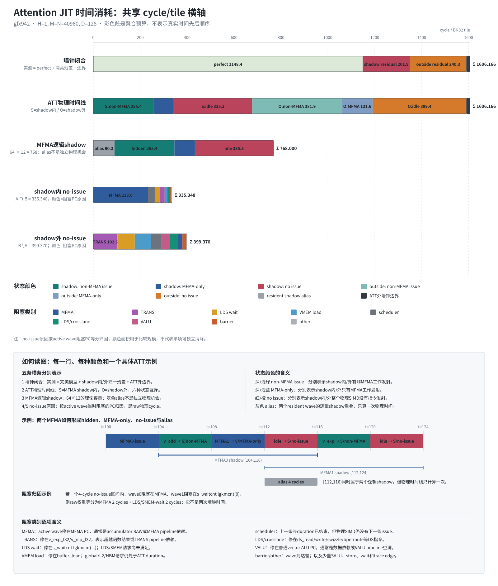
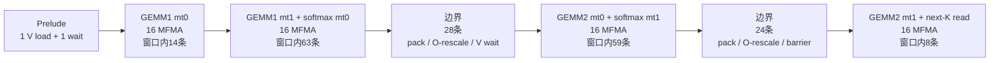
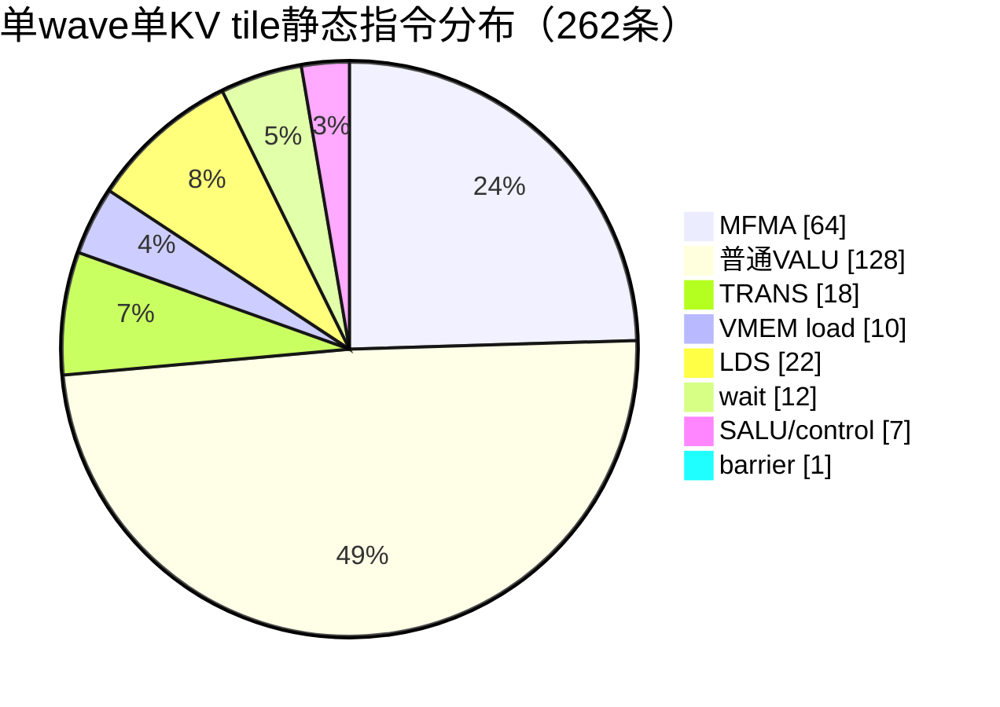
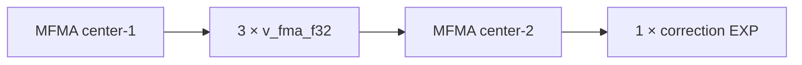
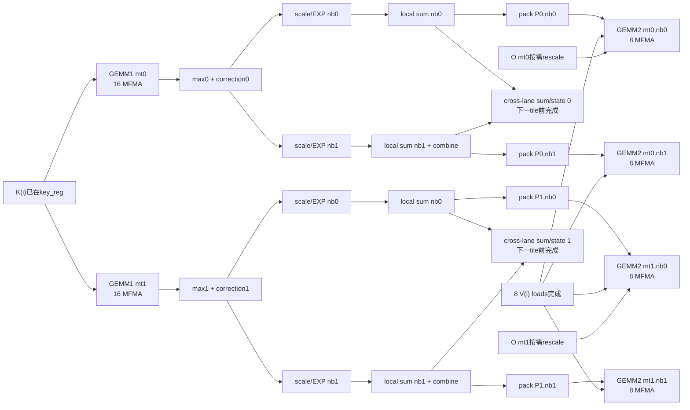
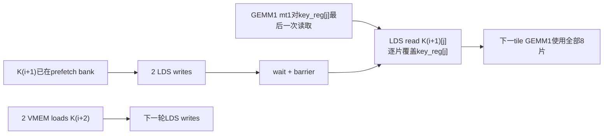
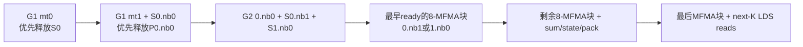
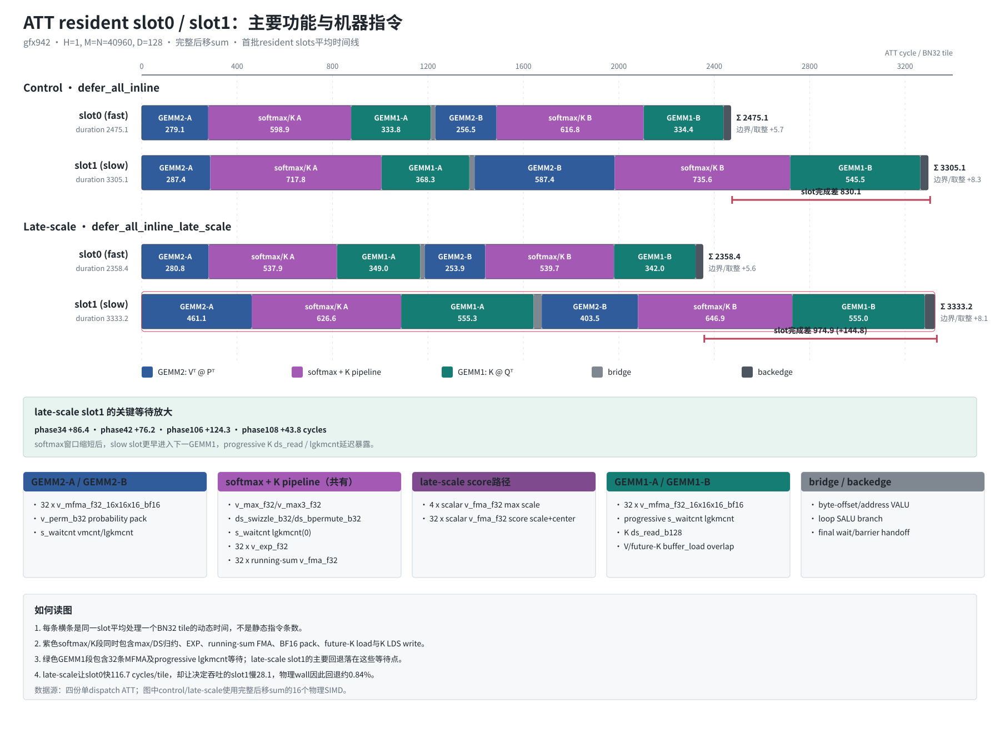

# 融合 Attention 双 GEMM 优化记录(FlyDSL, bf16, gfx942/MI3xx)

对应脚本:[`test_attn_gemm.py`](../test_attn_gemm.py)

## 1. 问题定义

无 softmax 的两段链式 GEMM(数学上等价于一次 attention 前向):

```
gemm1: S = Q[M,D] @ K[N,D]^T   -> [M, N]      # pv
gemm2: O = S[M,N] @ V[N,D]     -> [M, D]      # v
```

- 规模:`M = N = 8192`,`D = 128`,精度 bf16。
- 融合实现:一个 kernel 内沿 KV 维度循环,逐 tile 先算 `S`、再累加 `O`,中间结果 `S`(即 `pv`,完整为 `[8192,8192]`)**不落全局显存**。
- 参考:torch 两次 bf16 matmul(内部 rocBLAS)。

FLOPs = `2·M·N·D`(gemm1) + `2·M·N·D`(gemm2) = `4·M·N·D` ≈ 34.4 GFLOP。

## 2. 性能总览(MI308X / gfx942, HIP_VISIBLE_DEVICES=2)

| 版本 | 方法要点 | 延迟 | TFLOPS | VGPR | rel_l2 |
|---|---|---:|---:|---:|---:|
| torch 参考 | 两次独立 bf16 matmul(rocBLAS) | 312 µs | 110.0 | — | — |
| **v1 baseline** | 融合;`S` 经 LDS 中转;`V^T` 非合并全局加载 | 853 µs | 40.3 | — | 1.3e-4 |
| **v2 register-resident S**(BN=128) | `K@Q^T` register trick;4-wave M-split;K/V 协作载入 LDS | 915 µs | 37.6 | 326 | 1.3e-4 |
| **v3 低 VGPR**(BN=64) | v2 + `sched_barrier` 错峰 + 协作 frag 复用 + BN=64 | 882 µs | 38.9 | **202** | 1.3e-4 |
| **v4 k_perm(K 128-bit)** | v3 + `tmma1` 加 `k_perm=(4,4,2):(1,8,4)` → K 的 ds_read 从 128×16bit 变 16×128bit | 476 µs | 72.1 | 196 | 1.3e-4 |
| path-b V 128-bit(S 经 LDS,已被 v5 取代) | v4 去 register trick,`S^T` 经 LDS 中转 → GEMM2 用 `k_perm`+paged V | 500 µs | 68.8 | 196 | 1.3e-4 |
| **v5 register trick + V 全 128-bit** | v4 + `tmma1` 的 **M 维(Nk)也加 perm_M=k_perm** → C 累加器每 lane 8 连续 Nk,`select` register trick 仍成立 → GEMM2 用 `k_perm`+paged V（直读 global）,**保留 S 在寄存器**且 K/Q/A/V 读**全 128-bit** | **374 µs** | **91.7** | 200 | 1.3e-4 |
| **v6 V 协作→LDS** | v5 + V 由「直读 global」改为「协作加载到 v_lds（保留 v-连续 paged）→ 从 LDS 读」；V 全局读 4×广播→1×协作（`buffer_load` 28→16, `ds_read` 16→32） | 382 µs | 90.0 | 200 | 1.3e-4 |
| **v7 廉价 f32→bf16（当前主文件）** | v6 + 把 register trick 与 O epilogue 的 `.to(fx.BFloat16)`（RNE+NaN）换成 `_cvt_f32_to_bf16`（add-0x8000 舍入+截断）→ 热循环每 KV-tile 省 ~96 条 `v_bfe/v_cndmask` | **354 µs** | **97.1** | 200 | 1.5e-4 |

> **v4 是关键提速(1.85x)**:`k_perm` 让每 lane 沿 K(=D)取 8 个连续 bf16(FrgV=4 + cntK=2),`ds_read_b128` 替掉大量窄读。参考 `src/contrib/flydsl/moe_gemm_splitk.py::_make_1x4_tiled_mma`。

> **v5 是本轮最快版本（相对 v4 再 1.27x,达 rocBLAS 的 83%）**:给 GEMM1 的 **M 维(Nk)也加 perm_M**,使 C 累加器 `frag_St` 每 lane 直接持 **8 连续 Nk**,物理上匹配 GEMM2 的 `k_perm` A;`fx.select([0,2,1])` register trick **仍成立**（与 k_perm A 形状全等 `[4,2,(2,2)]`,详见 §8）,于是 GEMM2 可用 `k_perm`+paged V 拿到 V 128-bit,**同时保留 S 常驻寄存器**（无 LDS 中转）。关键教训:早前以为「带 perm_M 的 select 会 poison」是**误判**——poison 实际来自 paged V 读（未用 buffer-tile 模板 `v_fake`）,select 本身可编译。

> **v7 是当前主文件**（`tests/flydsl/test_attn_gemm.py`）:MFMA 的 f32 累加器转 bf16 时,`.to(fx.BFloat16)` 在 gfx942 上展开为逐值 RNE 舍入+NaN 处理（`v_bfe`/`v_add3`/`v_cmp_u`/`v_cndmask` 每值 ~5 条）。register trick 在**热循环**里每 KV-tile 要转 32 个 S 值,O epilogue 转 64 个。改用 `_cvt_f32_to_bf16`（移植自 `moe_gemm_splitk.py`：`((f32.bitcast(u32)+0x8000)>>16).to(u16).bitcast(bf16)`,round-half-up,无 NaN 处理）,每值仅 add+shift ~2 条 → 热循环省 ~96 条 VALU/KV-tile,**90.0 → 97.1 TFLOPS**（达 rocBLAS 的 89%）。精度从 1.3e-4 微升到 1.5e-4（round-half-up vs RNE）,仍 bf16 级别。注:这一优化与 V 路径正交,若用在 v5 直读版上估计可再高几个点。

> 精度均为 bf16 级别一致(`rel_l2 ≈ 1.3e-4`;`max_abs≈16` 是 `O` 量级达 ±千级时的 bf16 舍入,`mean_abs≈0.0036`)。

> 计时:kernel 用 `flyc.compile` 预建 CallState **快速派发**(~6µs/次,而非 `JitFunction.__call__` 的 ~140µs;参考 `tests/contrib/moe/test_moe.py`),再用 `torch.cuda.Event` 计 GPU 时间。本 kernel 为 GPU-bound,host 派发开销基本被 GPU 执行掩盖,故 fly 数值不随派发方式变化;但小 batch / launch-bound 场景该开销显著,`flyc.compile` 编译缓存是必要的。

## 3. 优化步骤

### v1 — baseline 融合(S 经 LDS 中转)

- 布局:一个 block 处理 `BM=128` 行 query,4 wave 排成 `2×2`(`tiled_mma (2,2,1)`),`BN=64`。
- gemm1 `S = Q@K^T`(`fx.gemm` 语义 `C=A@B^T`)在 f32 累加器里。
- **S 的搬运**:f32 累加器 → bf16 → 写入 `S_lds[BM,BN]` →(barrier)→ 作为 gemm2 的 A 操作数从 LDS 读回。
  - 关键坑:bf16 的 **C 累加器存储必须用 16-bit copy atom**(`UniversalCopy16b`)。32b 会把每 lane 的 2 个 bf16 打包到目标里不连续的位置 → 隔列错位。
- **V 的搬运**:以转置视图 `V^T=[D,N]:(1,D)` 直接作 gemm2 的 B 操作数(`A@B^T = S@V`)。
  - 关键坑:转置视图的收缩维在内存里 stride=D,**必须用 16-bit copy atom**;32b 向量化会读连续内存的错元素。此路径非合并、较慢。
- 结果:**40.3 TFLOPS**。瓶颈是每次迭代的 16-bit LDS/global 操作、2 barrier、小 tile、无流水线。V 只有 2MB 被 L2 缓存,故非合并访问被部分隐藏。

> 期间试过「把 V 合并加载到 LDS 再转置读」:38.5 TFLOPS,**反而更慢**(额外 LDS 写 + barrier 抵消了合并收益),已回退。说明 v1 的瓶颈不在 V 全局合并。

### v2 — register-resident S(本次)

目标:**避免 gemm1 的输出 `S` 进入 LDS**,把 `S` 保持在寄存器里直接喂给 gemm2,为后续流水线优化扫清障碍。

**布局(4-wave M-split)**

- 一个 workgroup = 256 线程 = 4 wave;4 个 wave 沿 **Q 的 M 方向均分**,每 wave 负责 **32 行 query**,贯穿两个 GEMM。
- gemm1 处理 `128×128`,每 wave `32×128`;gemm2 处理 `128×128`,每 wave `32×128`,最终每 wave 输出 32 行。

**register trick(核心)**

MFMA `16×16×16` 的 **C 累加器布局** 与 **A 操作数布局** 互为转置(同一 lane 的 4 个值:C 是「固定列、沿行」,A 是「固定行、沿 K」)。因此:

- gemm1 改算 **`S^T = K @ Q^T`**(把 `K` 当 A、`Q` 当 B),其 C 累加器 `S^T[Nk,M]` 的布局,正好等于 gemm2 需要的 A 操作数 `S[M,Nk]` 的布局(逐 atom 一致)。
- 但**多 atom** 时 C 的 rep 维顺序是 `(V, Nk_rep, M_rep)`,A 需要 `(V, M_rep, Nk_rep)`,两者交换了。用 `fx.select` 交换即可对齐:

```python
tmma1 = fx.make_tiled_mma(mma, fx.make_layout((1, WAVES, 1), (1, 1, 0)))  # gemm1: wave 分 query-M(=N 维)
tmma2 = fx.make_tiled_mma(mma, fx.make_layout((WAVES, 1, 1), (1, WAVES, 0)))  # gemm2: wave 分 query-M(=M 维)

frag_St = thr1.make_fragment_C(fx.make_rmem_tensor(fx.make_layout((BN, BM), (BM, 1)), fx.Float32))   # C = S^T
frag_Sa = thr2.make_fragment_A(fx.make_rmem_tensor(fx.make_layout((BM, BN), (BN, 1)), fx.BFloat16))  # A = S

fx.gemm(mma, frag_St, frag_K, frag_Q, frag_St)                      # S^T = K @ Q^T
frag_Sa.store(fx.select(frag_St, [0, 2, 1]).load().to(fx.BFloat16))  # C -> A(重排 rep 维 + f32->bf16)
fx.gemm(mma, frag_O, frag_Sa, frag_V, frag_O)                       # O += S @ V
```

- `tmma1` 与 `tmma2` 都把 wave `w` 分配到 query 行 `[w*32, w*32+32)`,保证 register 复用时数据归属一致。
- `make_rmem_tensor` 直接作 `make_fragment_C/A` 的形状+dtype 模板(无需全局 `S` 张量)。
- 验证:单 atom 无需 select 即对;多 atom 加 select 后 `O_rel` 从 0.99 → 0.0017(见 `/tmp/dbg_regtrick2.py`)。

**K/V 搬运**

- `K`、`V` 各占一块 LDS(`[BN,D]` 各 32KB,合计 64KB);`S` 不占 LDS。
- 每次迭代:4 wave **协作合并**(128b)把 `K`、`V` 从 global 载入 LDS →(barrier)→ 从 LDS 读到 frag。
  - gemm1 的 A(`K`)在 4 个 N-wave 间广播:各 wave 从 LDS 读全部 `Nk`。
  - gemm2 的 B(`V^T`)在 4 个 M-wave 间广播:各 wave 从 LDS 转置读全部 `[D,Nk]`(16b strided)。
- `Q` 是 gemm1 的 B 操作数,按 query-M 分给各 wave 的 32 行,**循环前只载入一次**。

**结果:37.6 TFLOPS**(BN 扫描:BN=128→37.6,BN=64→36.5,BN=32→34.4,故取 128)。

## 4. 分析:为什么 v2 暂未提速

- register trick 本身**不直接提速**——它是把 `S` 移出 LDS、腾出寄存器与同步预算,**为流水线做准备**。
- 当前 v2 仍是**同步**结构(每次迭代:载入→barrier→gemm1→gemm2→barrier),载入延迟没有被计算掩盖,和 v1 一样受 barrier/占用率制约。
- v2 的额外开销:4-wave M-split 使 `K`、`V` 在 wave 间**广播读**(4×);`K`、`V` 双 LDS = 64KB → 1 wg/CU 占用率。
- 实测**降低 LDS 反而更慢**(BN=64/32),说明占用率不是主瓶颈;瓶颈是每迭代固定开销(2 barrier + 协作载入 + 广播读),小 BN 只是把它摊到更多次迭代。
- 距离 rocBLAS(110 TFLOPS)的差距来自缺少软件流水线、指令调度、更宽的 LDS 访问等生产级优化。

## 5. VGPR 优化(326 → 202,<256 = 2 waves/SIMD)

用 `FLYDSL_DUMP_IR=1` 得到 `dump/attn_kernel_0/21_final_isa.s` 里的 `.vgpr_count`。v2(BN=128)= **326 VGPR**(超 256,只 1 wave/SIMD)。

**每步寄存器分析**(per-lane,wave64;bf16=2/reg,f32=1/reg):

| fragment | 形状(per-wave) | 元素/lane | VGPR |
|---|---|---|---:|
| frag_K(gemm1 A,广播全 Nk×D) | `[Nk, D]` | Nk·D/64 bf16 | **Nk·D/128** |
| frag_V(gemm2 B,广播全 D×Nk) | `[D, Nk]` | D·Nk/64 bf16 | **Nk·D/128** |
| frag_St(gemm1 C,f32) | `[Nk, 32]` | Nk·32/64 f32 | Nk/2 |
| frag_O(gemm2 C,f32,常在 AGPR) | `[32, D]` | 32·D/64 f32 | D/2 |
| frag_Q(gemm1 B) | `[32, D]` | 32·D/64 bf16 | D/4 |
| frag_Sa(gemm2 A) | `[32, Nk]` | 32·Nk/64 bf16 | Nk/4 |
| frag_ld(协作载入) | `[BN,D]/256` | BN·D/256 bf16 | BN·D/512 |
| register-trick 临时 | `select(frag_St).load()` | Nk·32/64 f32 | Nk/2 |

**根因**:操作数 `frag_K`、`frag_V` 各 = `Nk·D/128` VGPR。`Nk=D=128` 时**各 128 VGPR**;register trick 夹在 gemm1/gemm2 之间,使两者难以完全错峰 → 光操作数就逼近 256,加上 f32 累加器 `frag_St`(64)与 trick 临时向量(64)→ 326。操作数**随 BN 线性缩放**,是 128×128 的硬下限。

**降低手段**(累计 326 → 202):

1. **`fx.rocdl.sched_barrier(0)` 错峰**(gemm1 之后、读 `frag_V` 之前;协作载入之后):`v_lds` 在 barrier 前就绪,编译器会**提前预取** `frag_V`,使其在 gemm1 期间就与 `frag_K` 同时存活(各 128)。sched_barrier 阻止提前 → 330 → 306。
2. **协作载入复用一块 `frag_ld`**(K 先写 LDS 再复用装 V)+ 及时释放 → 小幅下降。
3. **BN=64**:把 `frag_K`、`frag_V` 各减半到 64 VGPR —— 决定性的一步。峰值(gemm1):`frag_K`(64)+`frag_St`(32)+`frag_Q`(32)+`frag_O`(64,AGPR)≈ 192,加临时 → **202 VGPR,AGPR=0,无 spill**。

> `amdgpu-mfma-vgpr-form` 与 `rocdl.waves_per_eu=2` 两个 hint 实测**无效**(编译器不肯为 128×128 挤到 ≤256,宁可留 1 wave/EU 也不 spill)。真正有效的是减少**实际数据量**(BN)+ 错峰(sched_barrier)。BN=64 同时略微**提速**(37.6→38.9 TFLOPS),因 sched_barrier 也改善了调度。

## 6. 后续优化方向(v2 已为其铺路)

1. **软件流水线 / double-buffer**:`S` 已在寄存器,可在算当前 tile 的 gemm1/gemm2 时,预取**下一** tile 的 `K/V` 到另一块 LDS,掩盖载入延迟(这是 register-resident S 的主要收益点)。
2. **减少 broadcast**:调整 wave 布局或用更宽的 LDS 读,降低 `K/V` 的 4× 重复读。
3. **V 转置读优化**:对 `v_lds` 加 swizzle 或用 `ds_read_tr`(gfx950)消除转置读的 bank 冲突,替掉 16b strided。(注:直接把 V 做成 128-bit 已在 §8 验证**反而更慢**,因需放弃 register trick。)
4. **指令调度**:`rocdl.sched_barrier` / `s_setprio` 等交织 MFMA 与访存(参考 `preshuffle_gemm`)。

## 7. 复现

```bash
cd tests/flydsl
HIP_VISIBLE_DEVICES=2 python3 test_attn_gemm.py     # 8192, BM=128 BN=64, 打印精度 + 性能
# 查看寄存器数(VGPR/AGPR/spill):
FLYDSL_DUMP_IR=1 FLYDSL_DUMP_DIR=./dump HIP_VISIBLE_DEVICES=2 python3 test_attn_gemm.py
grep -E '\.vgpr_count|\.agpr_count|vgpr_spill' dump/attn_kernel_0/*_final_isa.s
```

## 8. v5:register trick + V 全 128-bit(perm_M 让 C 累加器直接 8 连续 Nk)

**动机**:v4 里 K/Q 已 128-bit,但 V 仍是 16-bit 转置读。要让 V 也 128-bit,需给 `tmma2` 加 `k_perm`
(把 V 预 shuffle 成 paged 布局 `[N//8, D, 8]`,每 lane 沿 Nk 取 8 连续 → `buffer_load_dwordx4`)。
但 `tmma2` 加 `k_perm` 后,GEMM2 的 A 操作数 `frag_Sa` 每 lane 需 **8 连续 Nk**,而 register trick 复用的
GEMM1 C 累加器 `frag_St` 默认每 lane 只有 4 连续 Nk。

**关键洞察(v5)**:给 GEMM1 的 **M 维(Nk)也加 `perm_M=k_perm`**,让 C 累加器 `frag_St` 每 lane 直接
持 **8 连续 Nk**。此时:
- `frag_St = ((4,1),(2,2),2)`,`fx.select(frag_St,[0,2,1]) = ((4,1),2,(2,2))`,形状 `[4,2,(2,2)]`;
- `frag_Sa`(k_perm A)`= (4,2,(2,2)):(1,16,(4,8))`,形状 `[4,2,(2,2)]`。
- 两者**形状全等**(判据是形状全等,不是布局完全相同),`frag_Sa.store(select(frag_St,[0,2,1]).load())`
  逐元素对齐 → **register trick 仍成立**,S 不入 LDS。

于是 GEMM2 用 `k_perm` + paged V 直读 global,K/Q/A/V 读**全部 128-bit**,且 **S 常驻寄存器**。
**374 µs / 91.7 TFLOPS**(相对 v4 再 1.27x,达 rocBLAS 的 83%),VGPR=200。

**关键教训:早前判定「带 perm_M 的 select register trick 会 `ub.poison`」是误判**。用 `COMPILE_ONLY`
最小复现证明:`perm_M`+`k_perm` 下 `frag_Sa.store(select(frag_St,[0,2,1]).load())` **可编译**。真正的
poison 来自 **paged V 读**(`make_fragment_B(vt_tile)` 用了 paged 嵌套 layout 且无 buffer-tile 模板)。

**paged V 的两个必修坑**(与被取代的 path-b 相同):
1. **`make_fragment_B` 的模板要用 buffer-tile**(`v_fake = flat_divide(make_buffer_tensor(...), tile)`),
   不能用 paged 嵌套 layout 直接 `make_fragment_B`,否则 register SSA 提升报 `ub.poison`。读取源才用 paged 分区。
2. **paged layout 列主序**:Nk 子模 `(v, nb_local)` 中 **`v` 必须在前(inner, stride 1)**,即
   `(8, NB):(1, D*8)`;写反(`(NB,8):(D*8,1)`)则逻辑 nk 0..7 跨页读错元素,`rel_l2≈1.3`。
   `flat_divide` 对嵌套维会拆散页,需**手动构造** 3 维 tile `[D,(8,NB),N//BN]` 并 `[None,None,kv]` 索引。

**被取代的中间探索 path-b**(S 经 LDS 中转,不用 perm_M):也能让 K/Q/A/V 全 128-bit 且正确,但
**68.8 TFLOPS < v4 的 72.1** —— 放弃 register trick、让 `S^T` 经 LDS 中转的开销(写+读+序列化)超过了
V 128-bit 的收益。v5 用 perm_M 保住了 register trick,才真正把 V 128-bit 变成净收益。
(path-b 另一教训:C→LDS 后各 wave 读写自己的 Mq-slice,是 same-wave,无需 `gpu.barrier()`。)

## 9. v8:软件流水线(预取 K/V,藏全局 load 延迟)

**动机**:每个 KV-tile 的 K/V 全局 load(coop `buffer_load_dwordx4`)与后面的 `frag->LDS->frag->GEMM`
串行,全局延迟暴露。软件流水线把**下一轮**的全局 load 提前发起,藏在**当前**轮的 GEMM 后面。

**结构**(`range(..., init=...)` 的 loop-carried 双缓冲,见 `.claude/skills/prefetch-data-load`):
- **prologue**:先发起 K(0) 的协作加载(`global->frag`,异步)。
- **循环体**(处理 tile i):
  1. 发起 V(i) 协作加载(异步,与下面 K->LDS + GEMM1 重叠);
  2. 上一轮预取的 K frag -> `k_lds` -> `frag_K` -> **GEMM1**;register trick;
  3. **在 S*V 之前**发起 K(i+1) 协作加载(异步,与 V->LDS + GEMM2 重叠);
  4. V frag -> `v_lds` -> `frag_V` -> **GEMM2**。
- K 的协作数据作 **loop-carried 值**(SSA phi)在轮间传递 —— 这本身就是 ping-pong 双缓冲;
  末轮 `kv_i+1` 越界,buffer_load 返回 0 且不被消费,**无需 epilogue**。

**结果(M=N=20480,此尺寸下融合已超 rocBLAS 122 TFLOPS)**:

| 版本 | 延迟 | TFLOPS | VGPR |
|---|---:|---:|---:|
| v7(无流水线) | 1450 µs | 148.1 | 200 |
| **v8 软件流水线** | **1313 µs** | **163.6** | **184** |

**+10.5%,且 VGPR 反降到 184**(K/V 各只用 1 块暂存 + 1 块预取,而非旧的共用 + 立即消费)。

**关键教训:手动"循环展开 2 次 + 显式 A/B ping-pong 寄存器"反而更慢**(155.3 TFLOPS,VGPR 涨到
234):展开使两个子迭代的临时量(`frag_K/St/Sa/V` ×2)+ 4 块 ping-pong 缓冲同时存活,VGPR 压力抵消了
调度收益。`range(init=...)` 的 loop-carried phi **已经**是双缓冲,不必手动展开。

## 10. v9–v12:进一步优化(M=N=20480,cudaPerf 多 buffer 轮换计时)

从 v8 起改用 `cudaPerf`(`pyhip` 包)+ 多 buffer 轮换计时:每次计时读**不同**显存(L2 冷),测真实
HBM 而非 L2 命中的虚高;`cudaPerf` 进入时先 `torch.cuda._sleep` 掩盖 host 派发,再用 CUDA event 计
kernel 时间。基准 torch(rocBLAS 两次 matmul)= 122 TFLOPS。

| 版本 | 方法要点 | TFLOPS | VGPR | rel_l2 |
|---|---|---:|---:|---:|
| v8 软件流水线 | 见 §9 | 163.6 | 184 | 1.5e-4 |
| **v9 LDS swizzle** | `k_lds/v_lds` 加 `SwizzleType.get(3,3,3)` 去 bank 冲突 | **168.6** | 184 | 1.9e-4 |
| **v10 转置 GEMM2 + 64-bit O 写** | GEMM2 交换 A/B 算 `O^T`,O 存转置视图 → C 累加器 4/lane 沿 D 连续 → `buffer_store_dwordx2` | **170.5** | 184 | 1.9e-4 |
| **v11 V 直读(跳过 LDS)** | V 用 paged global buffer 视图直接 `buffer_load` 到 `frag_V`,去掉 V 的 coop+LDS 写+barrier+读 | **183.0** | 178 | 1.9e-4 |
| **v12 BN=32 + K LDS 双缓冲** | BN 64→32 腾 VGPR;K LDS ping-pong 双缓冲,write+barrier 与 GEMM2 重叠 | **229.8** | 190 | 1.9e-4 |

> **v8 → v12 累计 +40%,达 rocBLAS 的 1.9×。全程(v4 72.1 → v12 229.8)约 3.2×。**

### v9 — LDS swizzle(bank 去冲突)

`k_lds`、`v_lds`(及 V 的 paged 读视图 `v_lds_T`)都套上 `swz = fx.SwizzleType.get(3, 3, 3)`(bf16;
参数是 `(mask, base, shift)`,`swz(x)=x ^ ((x & ((2^mask-1)<<(base+shift))) >> shift)`,period =
`2^(mask+base+shift)` = 512 元素),经 `make_view(ptr, make_composed_layout(fx.static(swz), 布局))`。
**写视图与读视图必须用同一个 swz** —— swz 只是对线性字节偏移做置换,两视图对同一物理字节算出相同 flat
offset,故 `swz(k)` 一致、数据正确;且 swz 保留低位,128-bit `ds_read/ds_write` 不受影响。→ **+3%**。

- **swizzle 参数扫描**:`(3,3,3)` 实测最优(170.5 版基线上 168.6);`(3,4,3)` 持平但把 K 读变成
  `ds_read_b64`(64-bit)无收益;**弱 swizzle `(1,3,3)` 暴跌到 94.5**(period 缩到 256B,bank 冲突暴增)。
- **`ds_read2st64_b64` 现象**:K 读(`k_lds`)加 swizzle 后从 `ds_read_b128` 变成 `ds_read2st64_b64`
  (2 个隔 1024B=1 period 的 b64)。**这不是性能损失**:`ds_read2st64_b64` 仍是 128-bit 吞吐,去掉
  k_lds swizzle 反而 164.1 < 170.5(bank 去冲突收益 > 读指令形式变化)。V 的 paged 读(内层 8-v 落在
  base=3 保护的低 3 bit)保持 `ds_read_b128`。**结论:swizzle 的 bank 去冲突远比 ds_read 指令形式重要。**

### v10 — 转置 GEMM2 + 64-bit O 写

**动机**:`cp_oc` 想用 64-bit 写 O,但 MFMA_16×16×16 的 C 累加器每 lane 存 **4 个连续 M 行**、固定
N(=D)列;在 `O[M,D]`(D 连续)里这 4 个值按 D 步长跨开,不连续 → 直接 64-bit 写**错误**(rel_l2 0.87)。

**解法**:GEMM2 计算 `O^T = V^T @ S^T`(**交换 A/B 操作数**)→ C 累加器变成 `O^T[D, Mq]`,4/lane 沿
`M'=D` 排列,在 `O[M,D]` 里正好**连续** → `cp_oc` 用 `BufferCopy64b`,16 条 `buffer_store_dwordx2`
替掉 64 条 `buffer_store_short`。附带发现:转置后 `tmma1`/`tmma2` 同 wave 布局 `(1,WAVES,1)`+同
`k_perm`,GEMM1 的 C(=S^T)直接就是 GEMM2 的 B(=S^T),register trick 的 `select([0,2,1])` 仍成立。
`make_fragment_B` 模板取 `[N,K]=[Mq,Nk]=[BM,BN]`(取错成 `[BN,BM]` 会触发 `Mismatch in loop_n`)。
compute-bound 下收益小(+1.1%),但免费且正确。

### v11 — V 直读(跳过 LDS)

V(GEMM2 的 A 操作数 `V^T[D,Nk]`)改为**直接从 global** `buffer_load` 到 `frag_V`,不经 LDS:
```python
v_g = fx.rocdl.make_buffer_tensor(
    fx.make_view(fx.get_iter(V_), fx.make_layout((D, (8, NB), N // BN), (8, (1, D * 8), BN * D)))
)
# 循环内: fx.copy(cp_vg, tcV.partition_S(v_g[None, None, kv_i]), tcV.retile(frag_V))
```
去掉 V 的整条 LDS 路径(coop 加载 + LDS 写 8.1% + barrier 2% + LDS 读 4.9%,ATT 里约 15%)→ **+7.3%**。

- **为什么 V 能直读、K 不能**:V 是 GEMM2 的 A 操作数,每 wave 读**自己**的 `V^T[D,Nk]`,且 V 常驻 L2;
  K 是 GEMM1 的 A 操作数,**在 4 个 N-wave 间广播**(每 wave 要全部 Nk×D)。K 直读 = 每 wave 各读一遍
  → **4× 冗余 + 合并度差**,实测全直读(K+V)只有 49.7(BN=64)/ 69.3(BN=32)TFLOPS。
  **广播操作数(K)必须走 LDS**(协作合并读一次 + LDS 广播)。
- **编译器坑**:`perm_M`(GEMM1 的 A 在 M=Nk 维的 k_perm)+ 直接 `buffer_load` 触发 LLVM `Invalid cast`。
  更一般的规则:**`BufferCopyNb` 宽度要匹配每 lane 连续元素数**(k_perm→8→128b;无 perm→4→64b;
  128b 灌进 4 元素/lane 的 frag 会崩)。

### v12 — BN=32 + K LDS 双缓冲(关键突破,229.8 TFLOPS)

**ATT 定位(v11)**:#1 停顿是 GEMM1 等 K 的 LDS 读(`s_waitcnt lgkmcnt`)= **54.9%** —— K 走
`coop → LDS 写 → barrier → LDS 读 → GEMM1 MFMA` 串行,读延迟暴露。

**K LDS 双缓冲**:开 2 块 `k_lds`,本轮读 `k_lds[kv%2]`(上轮写好、barrier 已过),同时把 K(kv+1) 写到
`k_lds[(kv+1)%2]`,barrier 放到 GEMM2 之后 → **write+barrier 移出 GEMM1 关键路径**,与 GEMM2 重叠。
staged 视图 `k_lds2 = make_view(ptr, make_composed_layout(swz, make_layout((2,BN,D),(BN*D,D,1))))`,
运行时索引 `k_lds2[stage, None, None]`(`k_lds2[stage]` 不行,返回非 Value);stage 偏移 `BN*D` 是
swizzle period 整数倍 → 两 buffer swz 一致。

**关键:先砍 VGPR 再上双缓冲。** 双缓冲的运行时 `kv%2` 让 LDS 读地址变动态,吃寄存器:

| 配置 | VGPR | 占用率 | TFLOPS |
|---|---:|---|---:|
| v11(BN=64 单缓冲) | 178 | 2 waves/SIMD | 183 |
| BN=64 双缓冲 | 265 | **1 wave/SIMD** | 115 ❌ |
| BN=32 单缓冲 | 152 | 3 waves/SIMD | 184 |
| **BN=32 + 双缓冲** | **190** | **2 waves/SIMD** | **229.8** ✅ |

BN=64 双缓冲(265 VGPR)掉到 1 wave 反而暴跌;**BN=32 把 K 操作数减半(178→152)腾出预算**,双缓冲塞进去
后仍保持 2 waves(190),既隐藏了 K 读停顿又不掉占用率 → **+25%**。ATT 复测:总停顿 82.5%→66.4%,
#1 的 54.9% K 读停顿被消到 1.6%,瓶颈变均衡(MFMA 38% / LDS 19% / VMEM 17% / barrier 14%)。

## 11. 失败的尝试与核心教训(VGPR → 占用率悬崖)

v12 之后瓶颈已均衡、无单一大头,且 kernel **死死卡在 2 waves/SIMD 的 VGPR 预算(190/256)**。所有
**增加寄存器的重构一律回退**:

| 尝试 | VGPR | 占用率 | TFLOPS | 回退原因 |
|---|---:|---|---:|---|
| unroll-by-2(v8 期) | 234 | — | 155(<163.6) | 展开使临时量翻倍 |
| V ping-pong @BN64 | 344 | 1 wave | 132 | 掉占用率 |
| K 双缓冲 @BN64 | 265 | 1 wave | 115 | 掉占用率 |
| V 预取 @BN32 | 222 | **2 waves** | 210.8 | **不掉占用率也慢** |
| 2-stage 计算流水 @BN32 | 200 | **2 waves** | 208.5 | **不掉占用率也慢** |
| hot_loop_scheduler(手写调度) | 190 | 2 waves | 185.6 | 手写不如编译器 |
| K 不经 LDS(全直读) | — | — | 69.3 | 广播 K 4× 冗余 |

**教训**:
1. **`reg-adding` 流水线要先造 VGPR 余量再上**:v12 唯一成功,靠先 BN=32 砍 VGPR 保证双缓冲后 ≥2 waves;
   BN=64 无余量(178)所以双缓冲失败。
2. **即使不掉占用率也可能变慢**:V 预取(222)、2-stage 流水(200)都仍是 2 waves、无 spill,但多携带
   loop-carried 状态**挤占了编译器交错 MFMA 的自由寄存器** → 变慢。
3. **广播操作数必须走 LDS**:K 直读永远赢不了 coop+LDS 广播。
4. **手写指令调度不如编译器**:`sched_group_barrier` 硬排 GEMM1-then-GEMM2 比编译器默认交错差(185.6)。
5. **`ds_read2st64_b64` / 宽读指令形式** 不是性能关键;bank 去冲突、占用率、隐藏关键路径延迟才是。

**天花板**:v12 = 229.8 TFLOPS 是当前结构在 2-wave VGPR 预算下的平台。再往上需要**根本上更省寄存器的
结构**(如 FP8 K/V 减半带宽+VGPR)或换 MMA 指令(32×32×8),属大改、非增量。

> **后续被 §12 推翻**:v12 不是终点。找到一个"省寄存器的等价变换"(把 perm_M 挪到全局 K)腾出预算后,
> 就能继续上流水(K-prefetch),v13 达到 235 TFLOPS。见 §12。

## 12. v13:突破天花板 —— perm_M 挪到全局 K + K-prefetch(235 TFLOPS)

§11 判断 v12(229.8)是 2-wave VGPR 预算下的平台,任何"加寄存器的流水"都回退。**但按「先腾寄存器、再上流水」
这条主线,v13 打破了天花板:同尺寸 M=N=20480 下 235.8 TFLOPS(1.92x,> v12 的 229.8);放大到 M=N=40960
达 266.0 TFLOPS(2.24x rocBLAS 119)。rel_l2=0.00021,VGPR 204,2 waves/SIMD。** 三步缺一不可,
`KLDS=gpermswz` 现为默认;`KLDS=swz` 走 v12 路径(此结构下 20480=168 / 40960=219.6,见下)。

### v13a — perm_M 从 MMA 挪到全局 K(gpermswz):直接看是负优化,实为腾寄存器

v12 的 perm_M(GEMM1 在 M=Nk 维加 k_perm)让 C 累加器每 lane 8 连续 Nk;它同时占着 MMA 的寄存器/寻址。
v13a 把这个 Nk 重排**预先做进全局 K**:coop 读源按**正向** k_perm `make_layout((4,4,2):(D,8D,4D))` 重排,
GEMM1 的 MMA **去掉 perm_M**(`make_tile(None, None, k_perm)`)。plain 读入 LDS 后,不加 perm_M 也能得到
**同样的 8-连续-Nk C 布局**(N 方向已在全局 shuffle)→ register trick 与 GEMM2 **完全不变**,正确。

- **单独看是负优化:197 < 230**。原因:(a) 全局 K 的 coop 读从连续变成嵌套 (4,4,2) 散读、合并度差;
  (b) 去 perm_M 后 LDS 读退回 `ds_read_b128`(swizzle 只能部分去冲突),不如 v12 的 `ds_read2st64_b64`。
- **但它腾出了 MMA 的寄存器预算**——这是后两步的关键铺垫。
- 正确性坑:方向必须是**正向 k_perm**(用逆 `(4,2,4)` → rel_l2≈1.2);且**必须同时去掉 perm_M**
  (只挪全局不去 perm_M = 双重 shuffle,也是 1.2)。

### v13b — 循环展开 2 次

每轮处理 2 个 kv,LDS stage 的 rd/wr 变编译期常量(0/1),消掉运行时 `kv%2`。展开本身不是收益点
(单独在 v12 上展开 = 175 回退,VGPR 190→254;在 gpermswz 上 = 194),它是为 K-prefetch 铺路——
静态 stage 让预取地址简单、`frag_ldK`/`frag_ldK_next` 做 coop ping-pong。

### v13c — K 读做成 prefetch(关键收益)

v12 的 K 读是 `coop → LDS 写 → barrier → LDS 读 → GEMM1` 串行,LDS 读延迟暴露在 GEMM1 前(v11 ATT 里这是
#1 停顿 54.9%,v12 用双缓冲把 write+barrier 移出关键路径,但**读**仍在 GEMM1 前)。v13c 把 `LDS 读 → frag_K`
从 GEMM1 **之前**移到 GEMM2+barrier **之后**:读 `k_lds[wr]`(刚写好且 barrier 过的 buffer)供**下一步**的
GEMM1;prologue 先预取第一个 `frag_K`;**`frag_K` 变成第 3 个 loop-carried 值**(`init=[frag_O, frag_ldK,
frag_K]`)。GEMM1 于是直接用已就绪的 `frag_K`,LDS 读延迟被上一步的 GEMM2 掩盖。→ **197 → 235.8**。

### 核心洞见:先砍寄存器,再上流水

- K-prefetch 单独加在 **swz** 上 = **168**(回退):swz 的 perm_M 还占着寄存器,多携带 `frag_K` 撑爆调度。
- **gpermswz 去了 perm_M → 216 VGPR 仍 2 waves → 装得下 `frag_K` + 流水 → 235.8。**
- 所以**把 perm_M 挪到全局的真正价值不是直接提速**(那步 197 反而更慢),而是**腾出寄存器,让下游的
  K-prefetch 流水成为可能**。这和 §11 里 v11→v12(先 BN=32 砍 VGPR 才装得下 K 双缓冲)是**同一条主线**:
  在 2-wave VGPR 预算下,任何"加寄存器的流水"都必须先在别处**省出等量寄存器**。
- **修正 §11 的"天花板":** v12 不是终点。只要能找到"省寄存器的等价变换",就能继续叠流水。下一步方向:
  把全局 K 的嵌套散读变回连续合并(host 侧物理预 shuffle K),或对 V 也做同样的 prefetch。

| 版本 | 方法 | TFLOPS | VGPR |
|---|---|---:|---:|
| v12 | swz(perm_M 在 MMA + K LDS 双缓冲,干净 v12) | 229.8 | 190 |
| v13a | + perm_M 挪全局 K(gpermswz) | 197 | — |
| v13b | + 展开 2 次 | 194 | — |
| **v13c** | **+ K-prefetch(= 当前默认 `gpermswz`)** | **235.8** | 216 |
| 参照 | 当前文件 `KLDS=swz`(v13 结构但 perm_M 在 MMA) | 168 | — |

> 上表 TFLOPS 为空闲 GPU 复测中位数(cudaPerf 多 buffer 轮换,**M=N=20480**);torch(rocBLAS)= 122.7 → **1.92x**。
> **放大到 M=N=40960(当前 main 默认):gpermswz = 266.0 TFLOPS(2.24x rocBLAS 119),swz = 219.6,rel_l2=0.00021**
> ——更大问题摊薄 host/prologue 开销;`hot_loop_scheduler` 手工微调(is_first_gemm 先排 8×(vmem+3mfma),else 用 mfma(7))
> 把 gpermswz 从初版 248.7 逐步抬到 266.0(VGPR 216→204),sched 指令数按 tile 尺寸(BN·D)自动算。
> 注意 `KLDS=swz`(20480=168 / 40960=219.6)因 perm_M+frag_K 撑爆寄存器而慢于 gpermswz;干净 v12 的 swz 才是 229.8。


## 13. 完整 MHA:multi-head + flash softmax

在 v13(266 TFLOPS 无 softmax 双 GEMM)之上加完整的多头注意力(non-causal)。分两阶段落地:

### 阶段 A — multi-head 布线

- `build(..., H)` 加 head 维;`launch` grid `(M//BM, H, 1)`,`h = block_idx.y`。
- 每 head 的 Q/K/V/O 按 head 偏移基址:**用 `fx.make_view(fx.get_iter(X_) + off, layout)`**(`qo_off=h*M*D`,
  `kv_off=h*N*D`)。**坑:`fx.Tensor(view)[h]` 返回标量元素,不是 head 子视图**——必须用 iter 偏移。
- `_make_ktiles(..., koff)` / `v_g` / `v_fake` 内部都 `get_iter(X_) + koff`。
- 验证:8 头无 softmax vs `(Q@K^T)@V` 逐头参考,rel_l2 = **0.00012**。

### 阶段 B — 在线 flash softmax

GEMM1 出 `frag_St`(= S^T[Nk, Mq],C 累加器 3 mode `((4 Nk),(2 Nk-tile),(2 Mq-tile))`)后,register trick 前插在线 softmax:

```python
for mt in range_constexpr(2):                 # 按 Mq-tile 切片(mode2)
    v    = frag_St[None, None, mt].load() * sm_scale   # 该 Mq-tile 的 8 个 Nk
    tmax = v.reduce("max")                     # lane 内 8 Nk 求 max(v_max3 链)
    for sh in (16, 32):                        # 跨 lane:合并 l//16 的 4 行组
        tmax = _maxnumf(tmax, tmax.shuffle_xor(sh, 64))
    nm   = _maxnumf(m[mt], tmax)               # 新 running max
    corr = _exp2_amdgcn((m[mt] - nm) * LOG2E)  # 旧统计的校正因子
    p    = _exp2_vec_amdgcn((v - nm) * LOG2E)  # P^T 片段(exp2 用 amdgcn 单 v_exp_f32)
    ts   = p.reduce("add") + 跨lane(16,32)     # tile 内 P 求和
    l[mt] = l[mt]*corr + ts;  m[mt] = nm
    frag_St[None,None,mt].store(p)             # 就地覆盖 frag_St = P,复用原 register trick
frag_O[None,None,mt] *= corr                    # GEMM2 累加前 rescale 旧 O
# 循环携带 m0,m1,l0,l1;epilogue: frag_O[None,None,mt] *= 1/l_final[mt]
```

- **`m`/`l` 循环携带**(每 lane 2 个 Mq-tile 标量,冗余存 4 行组);`frag_O` 与 `frag_St` 共享 Mq=col 结构,
  所以 correction 按 Mq-tile 正确广播到 `frag_O` 的 D 元素。
- **exp2 用 `llvm.amdgcn.exp2.f32`**(单 `v_exp_f32`,省 OCML 的 `v_ldexp`);指数 ≤ 0 在 fast-range,安全。
  相比 `.exp2()`(OCML):2048 尺寸 98.9 → 119.6 TFLOPS(+21%),精度不变。
- 精度:rel_l2 = **0.00311**(bf16 attention 正常范围),多尺寸一致。

### 性能(空闲 GPU,cudaPerf CUDA-event 计时)

| 配置 | per-head M=N | TFLOPS | 备注 |
|---|---|---:|---|
| H=8 | 8192 | 150 | |
| **H=8** | **16384** | **~164** | **最佳(3 次 156/164/164)** |
| H=4 | 20480 | 162 | |
| H=1 | 40960 | 160 | 单头,直接对比无 softmax 266 |
| H=8 | 20480 | 143 | 超长跑降频 |

- 好尺寸 plateau **160–164 TFLOPS**;vs 无 softmax 266@40960 → softmax 约 **−38%**。
- VGPR **204 → 247**(m/l 携带 + exp 中间量),但 `512/247 = 2 waves/SIMD` **occupancy 仍保住**,无 spill,LDS 16KB。

### 跨-lane reduce 的硬件约束(为何仍是 ds_swizzle/ds_bpermute)

softmax 的跨-lane 归约是**列向的跨-row all-reduce**:`frag_St` 的 C 布局里 Nk = `4*(l//16)+reg`(行组),
Mq = `l%16`(列)。over Nk 归约 = 合并 4 个行组(l//16),即 `xor 16` + `xor 32`。当前分别降为
`ds_swizzle_b32 SWAP,16`(xor16,32-lane 组内)和 `ds_bpermute_b32`(xor32,跨 32-lane)。

**gfx942(CDNA3)无法用少量 DPP 指令消掉它们**:
- `permlane16` / `v_permlanex16` / `row_xmask` DPP 都是 `isGFX10Plus`(RDNA)特性,CDNA3 没有。
- DPP row 操作只在 **16-lane 行内**(offset 1/2/4/8);`row_bcast:15/31` 是**单 lane 广播**,会混掉不同 Mq 列,
  不能做列向归约。
- `wave_rol:1`能跨row且最终保持`lane%16`列,但每条只能rotate 1 lane。连续执行16/32/48步可以取到
  `{lane+16,lane+32,lane+48}`,数学上能完成四row归约,代价见§22.10。

**要彻底去掉 ds 归约,只能让归约变成行内(intra-row)**:即 GEMM1 改算 S[Mq, Nk](Nk 成为列 `l%16`)→ over Nk
= 行内 DPP(xor 1/2/4/8)。但这要求 GEMM2 也转置成 O[Mq,D](A=S、B=V),连带改 V 的 B-operand 布局与 O 的存出
(丢掉当前 O^T 的 64-bit 连续写)。属整核重构,权衡:去掉热循环里每步的 ds 归约 vs. V/O 通路重写 + 存出可能变散。

**但实测证明不值得**:临时去掉两句 `shuffle_xor`(perf probe,结果故意算错只测速),H=8/8192 同会话同 GPU 对比:

| 版本 | rel_l2 | TFLOPS |
|---|---|---:|
| baseline(有 ds 归约) | 0.00311(正确) | 150.5 |
| probe(去掉 ds 归约) | 错(仅测速) | 151.1 |

**差 +0.4%** ——`ds_swizzle`/`ds_bpermute` 已被 MFMA 流水大量掩盖。§22.10进一步证明连续
`wave_rol:1`虽能正确完成列向跨-row归约,但指令膨胀使性能严重回退,因此生产kernel仍保留DS路径。
softmax 的 −38% 开销来自别处:VGPR 204→247(挤压调度)、`v_exp_f32`、以及在线 softmax 的 `v_pk_mul`/`v_sub`/`v_add`
(缩放/correction/rescale)占用 VALU 发射槽 —— 优化要往**压 VGPR / 减 VALU / 调度**方向,而非跨-lane 归约。

### VALU 优化 1:LOG2E 折进缩放(+6.6%)

既然 softmax 是 VALU-bound,先砍 `* LOG2E`。指数 `(S·sm_scale − m)·LOG2E = S·(sm_scale·LOG2E) − m·LOG2E`。
定义 `sm_scale_log2 = sm_scale * LOG2E`,开头就用它缩放(`v = S * sm_scale_log2`,把 `m` 也带进 log2 域):

```python
sm_scale_log2 = float(sm_scale * LOG2E)     # build 内
corr[mt] = _exp2_amdgcn(m_in[mt] - nm)      # 免标量 *LOG2E
p        = _exp2_vec_amdgcn(v - nm)          # 免逐元素(8 Nk)*LOG2E
```

`m` 只用于差值(corr/p)、`l` 是 exp 之和、`O/=l` 不变,放 log2 域完全等价。消掉每 kv-step 的 8 个
`v_pk_mul`(向量 *LOG2E)+ 2 个标量 *LOG2E。**H=8/8192:150.5 → 160.4 TFLOPS(+6.6%),rel_l2 不变 0.00311**
(3× 稳定);单头 40960 = 160 → 164.4。对比去 ds 的 +0.4%,坐实了“softmax 是 VALU-bound”。

> 注:large-size(16384/20480)在共享机上连续跑会热降频(同一配置多次跑递减),短跑的 8192(~1.7ms)才稳定可信。

### 回退的尝试(均为负优化)

下面两个"减 VALU/VGPR"的直觉改动**实测变慢**,已回退(请勿重试):
- **合并 O-rescale 进 softmax 循环**(`frag_O *= corr` 从独立循环挪到主循环内、corr 即用即弃):同 GPU
  156.0→152.4(−2~5%)。指令数不变,纯因重排——**独立的 rescale 循环反而调度更好**(编译器把 32 个
  `v_pk_mul` 批量与 MFMA 重叠;交织进 exp/reduce 依赖链反而上关键路径)。
- **预缩放 Q**(`frag_Q *= sm_scale_log2` 一次,免循环内 `v=S*scale`):158.5(−)且 rel_l2 0.00311→0.00358
  (bf16 乘常数掉精度)。且初始 `v=S*scale` 那批 mul 也被 MFMA 掩盖,去掉不帮忙。

**经验**:此核对指令顺序极敏感、已被编译器排得很好;只有**减关键路径上的 VALU**(如 LOG2E 折入 exp 前的乘法)才有效,
而重排/搬动那些已被 MFMA 掩盖的 VALU 反而打乱调度。VGPR 247 仍 2 waves(512/247),降到 ≤170 才能 3 waves,softmax 微调达不到。

### Profile 总结 + FA3/scheduler 结论

ISA 指令统计(LOG2E-fold 版,VGPR 238;每轮循环 = 2 kv-step):

| 指令 | 数 | 归属 |
|---|---:|---|
| `v_mfma_16x16x16_bf16` | 128 | 计算(有效功) |
| `v_pk_mul_f32` | 99 | **O-rescale ~64** + scale ~16 |
| `v_perm_b32` | 48 | register trick + O 存出 |
| `v_exp_f32` | 36 | softmax exp |
| `v_sub_f32` | 36 | v−nm, m−nm |
| `ds_swizzle+ds_bpermute` | 16 | 跨-lane 归约(已确认被 MFMA 掩盖) |

- **VALU-bound**:128 MFMA vs ~300 VALU/轮;最大 VALU 是 **O-rescale(64 v_pk_mul)**,其次 exp(36),二者均为 online softmax 固有,难降。
- **hot_loop_scheduler 无效(实测)**:`SCHED=0`(编译器默认)vs `SCHED=1`(手工)= 156.5 完全相同。无 softmax 时手工调度把 GEMM 从初值抬到 266;softmax 后瓶颈变 VALU 吞吐,mfma 调度 hint 不再起作用。
- **FA3 不适用**:FA3 核心(异步/warp-specialization/wgmma/FP8)是 Hopper 专属,CDNA3 无对应硬件;可迁移的"softmax-VALU 与 MFMA overlap"被 register-trick(GEMM1→softmax→GEMM2 硬依赖)+ `gpu.barrier`(串行化 kv-step)挡住,且本核 mfma 不是瓶颈(overlap GEMM 无益);FA3-FP8 只降 mfma、反而更 VALU-bound。
- **结论**:softmax 核 156~164 TFLOPS 已接近此在线-softmax 公式在 CDNA3 的 **VALU roofline**;本轮净胜 = LOG2E 折叠(+6.6%)。唯一(高风险)剩余杠杆:用 LDS 承载 S 替 register-trick,卸掉 48 perm+32 add 的 VALU(代价:加 LDS 流量,收益不确定)。

### 编译时 softmax 开关

`build(..., softmax=True)`(环境变量 `SOFTMAX`,默认 1)。关闭时退化为纯双 GEMM(`S@V`,无 softmax/scale),用于对照无 softmax 基线。

- **必须用 `if const_expr(softmax):`**,不能用裸 `if softmax:`——FlyDSL `@flyc.kernel` 里裸 `if` 被当运行时分支,内部赋值不传播(报 `UnboundLocalError: m0`)。共 5 处:kv_step 的 softmax 块、`loop_init`、state 解包、`yield_vals`、epilogue;loop-carried/yield/epilogue 全部按 `softmax` 条件化(关闭时只 carry `[frag_O, frag_ldK, frag_K]`,不带 `m/l`)。
- 关闭时是纯编译期分支,**零** softmax 指令,精确回到 266 基线路径。
- 验证:`SOFTMAX=1` @8192 = 160.6(rel_l2 0.00311);`SOFTMAX=0` @8192 = 250.1 / **@40960 = 265.2**(rel_l2 0.00023)。

同尺寸(H=1, M=N=40960)直接对比 softmax 开销:

| 模式 | rel_l2 | TFLOPS | 相对 |
|---|---|---:|---|
| `SOFTMAX=0`(纯双 GEMM) | 0.00023 | 265.2 | 基线 |
| `SOFTMAX=1`(flash softmax) | 0.00317 | 164.1 | **−38%** |

softmax 开销 −38%,与 profile 结论一致(VALU-bound,O-rescale + exp 主导,已接近 CDNA3 上此在线-softmax 公式的 VALU roofline)。

## 14. SOFTMAX=1 后续实验:条件 rescale、lazy rebase、two-pass、BN/pipeline

基准配置:gfx942,`H=8,M=N=8192,D=128,BN=32`,空闲 GPU,cudaPerf 多 buffer 中位数。下表模式均为
历史实验结果;实验结束后已删除失败分支,当前代码在 `SOFTMAX=1` 时**只保留最快的 lazy Δ=8**,
`SOFTMAX=0` 仍是纯双 GEMM 对照。

| 模式 | 方法 | TFLOPS | 相对 online | rel_l2 |
|---|---|---:|---:|---:|
| online | 原在线 softmax | 150.6 | 基线 | 0.00311 |
| branch | 仅 `tmax>m` 时计算 correction 并 rescale O | 158.4 | **+5.2%** | 0.00311 |
| **lazy(Δ=8)** | 仅 `tmax>reference+8` 时 rebase | **166.9** | **+10.8%** | 0.00316 |
| twopass | 第一遍全局 max,第二遍固定 max 做 exp/sum/PV | 93.0 | -38.2% | 0.00314 |
| pair | 两个物理 BN32 score 合并一次 64-key lazy 更新 | 161.2 | +7.0% | 0.00316 |
| lazy,BN=64,K-prefetch=0 | 更新次数减半,关闭跨迭代 K prefetch | 128.8 | -14.5% | 0.00316 |
| lazy,BN=64,K-prefetch=1 | 更新次数减半,保留 K prefetch | 128.0 | -15.0% | 0.00316 |

### 方案 1:条件 correction/O-rescale(+5.2%)

标准 online 更新中,只有新 tile max 超过 running max 时 `corr=exp2(m-nm)<1`;否则 `corr=1`,整块
`frag_O*=corr` 是无效工作。`branch` 用运行时 `scf.if` 跳过 correction 和 O-rescale。结果从 150.6 提升到
158.4 TFLOPS,精度不变。分支条件在一个 wave 的 16 个 query row 间并不一致,只要 wave 内任一活动 lane 需要
rebase,对应 VALU 仍会执行,因此收益有限。

### 方案 2:lazy rebase(+10.8%,当前最佳)

online softmax 不要求参考指数每轮都等于已见最大值。保持参考值 `r`,始终累计
`p=2^(score-r)`,`l=sum(p)`,`O=sum(p*V)`,最终 `O/l` 与标准 softmax 相同。只有
`tmax>r+LAZY_DELTA` 时才把 `l/O` 乘 correction 并更新 `r`;默认实验阈值为 log2 域 8。

| LAZY_DELTA | TFLOPS | rel_l2 |
|---:|---:|---:|
| 2 | 162.6 | 0.00315 |
| 4 | 165.4 | 0.00316 |
| **8** | **166.9** | 0.00316 |
| 16 | 166.8 | 0.00316 |

阈值 8 后已进入平台。`H=1,M=N=40960` 长序列复测:online 169.7 → lazy 181.2 TFLOPS(+6.8%),
`rel_l2 0.00317→0.00319`。全 1、单调上升 score、大幅随机 logits 三类边界输入均 finite;
对应 rel_l2 为 0、0.00331、0.00131。

PMC(`H=8,M=N=8192`)证实收益来自跳过 O-rescale,不是 occupancy:

| 每 wave PMC | online | lazy Δ=8 | 变化 |
|---|---:|---:|---:|
| `SQ_INSTS_VALU` | 53829 | 46567 | -13.5% |
| `SQ_INSTS_VALU_MUL_F32` | 12450 | 2370 | **-81.0%** |
| `SQ_INSTS_VALU_TRANS_F32` | 4610 | 4610 | 不变 |
| `MfmaUtil` | 48.0% | 50.0% | +2.0pp |
| `ValuPipeIssueUtil` | 49.5% | 46.1% | -3.4pp |
| VGPR | 240 | 240 | 不变,2 waves/SIMD,无 spill |

注意 correction `v_exp_f32` 虽位于分支内,LLVM 在无副作用条件下会投机执行,所以 transcendental 计数不降;
真正减少的是条件块内约 81% 的 O-rescale MUL。若要继续优化,应集中在禁止/延迟 correction exp 的投机执行,
或减少每 tile 固有的 16 个 probability exp,而不是再调 O-rescale 指令顺序。

已尝试把 correction exp 改成 `has_side_effects=True` 的 inline `v_exp_f32`,强制它留在 rebase 分支内;
精度不变,但 `H=8,M=N=8192` 从 166.9 降到 160.1 TFLOPS。side effect 阻断了有益的跨分支调度,
收益小于调度损失,已回退到纯 intrinsic。

### 方案 3:精确 two-pass(失败)

第一遍只执行 QK+max,重置 K 双缓冲 pipeline 后,第二遍用固定全局 max 执行 QK+exp/sum/PV。它彻底去掉
online correction/O-rescale,但多做一遍 QK,并重复 K 全局/LDS 流水。实测仅 93.0 TFLOPS;额外 MFMA 与访存远大于
省下的 VALU,不采用。

### 方案 4:BN/pipeline(失败)

- `BN=32,K_PREFETCH=0`:lazy 166.9 → 161.7,说明现有 K-prefetch 仍有约 3.2% 收益。
- `BN=64`:softmax 统计更新次数减半,但 K/V/S fragment 翻倍、live range 变长;无论 K-prefetch 开关都约
  128 TFLOPS,远慢于 BN=32。
- `pair`:保持 K/V 物理 tile 为 BN32,在寄存器同时保留两块 score,合并一次 64-key max/sum/correction,
  再执行两次 PV。精度正确、VGPR=230、2 waves/SIMD、无 spill,但只有 161.2 TFLOPS,低于普通 lazy 的 166.9。
  原因不是 occupancy,而是执行顺序被拉成长依赖链 `2×GEMM1 → softmax → 2×GEMM2`,破坏原先逐 tile 的
  GEMM/访存交错。既然纯寄存器 pair 已回退,再增加约 16KB score LDS 写读和同步没有继续实现价值。

当前最快实现复现:

```bash
cd tests/flydsl
HIP_VISIBLE_DEVICES=2 H=8 MULT=64 SOFTMAX=1 python3 test_attn_gemm.py
```

## 15. Fastest-only PMC + MFMA/VALU co-issue 复测

代码收敛为 `BN=32 + K-prefetch + lazy rebase Δ=8` 后重新采集。非 profiler cudaPerf 基线为
**1654 us / 166.1–166.3 TFLOPS / rel_l2=0.00316**;ISA 为 240 VGPR、2 waves/SIMD、16KB LDS、无 spill。
PMC 会把绝对时间扰动到约 2.38ms,所以下表只使用硬件计数及同类比值。

### PMC 结果

配置:`H=8,M=N=8192,D=128`;每组最多 4 个 counter,分别采集并按 dispatch 取中位数。

| 指标 | 结果 |
|---|---:|
| instructions / wave | 63,417 |
| MFMA / wave | 16,384 |
| non-MFMA VALU / wave | 30,183 |
| F32 ADD / wave | 9,600 |
| F32 MUL / wave | 2,370 |
| F32 TRANS(`v_exp`) / wave | 4,610 |
| `ValuPipeIssueUtil` | 46.42% |
| `MfmaUtil` | 50.37% |
| `OccupancyPercent` | 21.23% |
| active cycles / wave | 73,067 (33.06%) |
| dependency wait / wave | 30,047 (13.60%) |
| **issue wait / wave** | **117,902 (53.35%)** |
| issued IPC (`SQ_INSTS/SQ_ACTIVE_INST_ANY`) | 0.868 |

结论:lazy 已大幅消掉 O-rescale MUL,剩余大头不是 HBM/L2,而是 scheduler issue 空洞。超过一半 wave 周期是
`SQ_WAIT_INST_ANY`;依赖等待只有 13.6%。VALU 与 MFMA 利用率都约 50%,说明两条独立 pipeline 理论上有重叠空间,
但单独把两个百分比相加不能得到交集。

### co-issue 的定义与实测

ROCm 7.2 的 gfx950 配置提供 `VALU Co-Issue Efficiency`,公式依赖 `SQ_ACTIVE_INST_VALU2`;gfx942 不暴露
`SQ_ACTIVE_INST_VALU2`,且 gfx942 profile 配置明确删除该指标。因此 **gfx942 无法用 PMC 精确报告官方 VALU
co-issue**。这里增加一个 ATT 时间线指标,专门回答本 kernel 的 MFMA/VALU overlap:

1. 按物理 SIMD 合并其所有 raw wave issue 时间线(`seX_smY_*`)。
2. 每条 `v_mfma_f32_16x16x16_bf16` 建立 `[issue, issue+16)` busy window并取并集。
3. 普通 VALU/EXP 每次 issue 视为 4-cycle slot,计算它与 MFMA busy-window 并集的交集。
4. 对 16 个被跟踪 SIMD 取中位数。

ATT(dispatch 86,完整 128 workgroup grid)结果:

| 自定义 co-issue 指标 | 结果 |
|---|---:|
| **MFMA busy cycles covered by VALU issue** | **13.29%** |
| VALU instructions issued during MFMA busy | 26.29% |
| VMEM instructions issued during MFMA busy | 26.77% |
| LDS instructions issued during MFMA busy | 53.00% |

因此 K-LDS pipeline 的 overlap 已较好,真正不足的是 softmax VALU/EXP 与 MFMA overlap。ATT 同时显示总 stall
48.63M/80.56M=60.4%;其中 MFMA dependency 49.6%,softmax packed add/mul 链是主要 non-MFMA stall。

后续使用固定 ISA 微基准进一步区分了“时间线上落入 MFMA busy window”、fully hidden和partial co-issue:
gfx942 不提供 `SQ_VALU_MFMA_COEXEC_CYCLES`;LLVM gfx94x 将 TRANS(`v_exp_f32`/`v_rcp_f32`)和 packed FP32
add/mul 标为 never-coissue。该调度模型标记不等于组合时间必然是两条指令之和:正式微基准测得
MFMA+EXP约20.056 cycle,相对完全串行的32.026 cycle仍有74.8% overlap。packed FP32的gap0实验则确有
额外阻塞;普通`v_add_f32`/`v_perm_b32`无额外penalty。完整定义、方法与脚本见
[`mfma-valu-coissue.md`](mfma-valu-coissue.md)。因此 ATT 的 13.29% 是 issue 时间线 overlap 指标,
不能替代缺失的硬件 co-exec counter。

### co-issue 调度实验(均已回退)

| 尝试 | TFLOPS | co-issue/结论 |
|---|---:|---|
| fastest lazy baseline | **166.2** | MFMA-cycle VALU coverage 13.285% |
| `sched_barrier(0x2)`允许 VALU 跨 GEMM1 边界 | 164.6 | live range/调度变差 |
| `sched_barrier(0x402)`允许 VALU+EXP 跨边界 | 164.0 | 进一步回退 |
| branchless lazy + 显式 VMEM/MFMA/VALU/EXP groups | 150.7 | 固定分组破坏原 VMEM/LDS/MFMA 交错;VGPR 236 |
| softmax `s_setprio(1)` | 165.1 | 抢占 MFMA issue机会 |
| GEMM1 `s_setprio(1)` | 153.7 | softmax/访存阶段饥饿 |
| 奇数 workgroup `s_sleep(1..15)`一次性错相 | 166.2–166.3 | sleep15 coverage 13.310%,与 13.285% 基线等价 |

纯调度 hint 无法跨越 `GEMM1 -> softmax -> GEMM2` 的真实数据依赖;强制排序还会损失编译器已形成的 VMEM/LDS
流水。故最终代码不保留任何上述 hint/stagger,只保留原始 fastest 调度。

### 下一步改进方案

1. **已完成:GEMM1 拆分两个独立 Mq accumulator group。** 结果见 §16。拆分本身小幅提升到 166.7 TFLOPS;
  但把 `softmax(mt0)` 插进两个 GEMM1 group 之间会回退到 161.8,没有形成有效 co-issue。
2. **已验证并回退:8-wave双pipeline。** §20把单workgroup扩成8 waves,测试两组独立K stage、GEMM1后
  两相握手和延迟GEMM2。最佳版本虽保持完整MFMA链并降低issue wait,但全组barrier使dependency wait翻倍,
  最终从170.5T回退到150.5T。
3. **低风险但收益有限:减少剩余 VALU/EXP,而非继续加 scheduler hint。** correction exp 会被 LLVM 投机执行;
  side-effecting inline exp 已测 160.1 TFLOPS。可尝试针对 `v_exp_f32` 的近似多项式/分段近似,但需保持
  `rel_l2 <=0.0035` 并覆盖大 logits/长序列。每 tile 固有的 16 个 probability exp 才是主要目标。
4. **不建议:**继续调 `sched_barrier` mask、固定 group 比例、`s_setprio`、workgroup 启动 sleep、DPP reduce、
  L2/HBM。这些方向已被 PMC/ATT 或直接性能实验否定。

## 16. GEMM1 按 Mq accumulator group 拆分

### 实现

GEMM1 fragment 的逻辑结构为:

```text
frag_St: [value, m_rep=2, n_rep=2]
frag_K : [value, m_rep=2, k_rep=8]
frag_Q : [value, n_rep=2, k_rep=8]
```

其中 `n_rep` 就是 softmax 使用的两个 `mt`(每个对应 16 个 query row)。原来的完整调用:

```python
fx.gemm(mma, frag_St, frag_K, frag_Q, frag_St)
```

改为显式原子 MFMA:

```python
def gemm1_mt(mt):
    for k in range_constexpr(D // 16):
        for m in range_constexpr(BN // 16):
            acc = frag_St[None, m, mt]
            fx.mma_atom_call(
                mma,
                acc,
                frag_K[None, m, k],
                frag_Q[None, mt, k],
                acc,
            )

for mt in range_constexpr(2):
    gemm1_mt(mt)
```

这与 `ExpandGemmOpLowering` 最终发出的 `MmaAtomCall` 数完全相同,但把两个 `n/mt` accumulator group 明确分开。
最终顺序为 `mt -> k -> m`:固定一个 16-row query group,每个 K-step 在两个独立 `m` accumulator 之间交替。
MFMA 总数、VALU/EXP 数、VGPR 和数学结果均不变。

### 性能与资源

| 配置 | 拆分前 | 拆分后 |
|---|---:|---:|
| `H=8,M=N=8192` | 1653.8us / 166.2T | **1648.8us / 166.7T** |
| `H=1,M=N=40960` | 4740.0us / 181.2T | **4690.7us / 183.1T** |
| `SOFTMAX=0,H=8,M=N=8192` | 1131.0us / 243.1T | **1126.3us / 244.1T** |
| rel_l2(softmax) | 0.00316 | 0.00316 |
| VGPR / occupancy | 240 / 2 waves | 240 / 2 waves |
| LDS / spill | 16KB / 0 | 16KB / 0 |

`8192²×8 heads` 连续三次均为 1648.8us/166.7T,不是单次噪声。长序列提升更明显(+1.0%)。

### PMC/ATT 对比

| 指标 | 拆分前 | 拆分后 |
|---|---:|---:|
| instructions / wave | 63,417 | 63,161 |
| VALU / wave | 46,567 | 46,567 |
| MFMA / wave | 16,384 | 16,384 |
| wave cycles | 221,010 | **219,926(-0.49%)** |
| dependency wait | 13.60% | **13.04%** |
| issue wait | 53.35% | 53.75% |
| `ValuPipeIssueUtil` | 46.42% | 46.62% |
| `MfmaUtil` | 50.37% | 50.59% |
| ATT total stall | 48.63M / 60.4% | **46.52M / 60.2%** |
| MFMA-cycle VALU coverage | 13.285% | 13.393% |

收益主要来自 GEMM1 MFMA accumulator-chain 顺序和 dependency wait 下降,而不是显著提高 VALU/MFMA co-issue。
LDS/SMEM wait 也从 4.57M 降到 3.78M,但 barrier stall 从 1.75M 升到 2.05M,整体仍为净收益。

### 回退的交错尝试

- `GEMM1(mt0) -> softmax(mt0) -> GEMM1(mt1) -> softmax(mt1)`:精度正确、VGPR 240,但仅 161.8T。
  `mt0` softmax 的长 reduce/EXP 依赖链延迟了第二组 MFMA;机器调度器没有把 mt1 MFMA 提前到有效窗口。
- 拆分后允许 VALU+EXP 跨 `sched_barrier(0x402)`:162.7T。仍会破坏原 VMEM/MFMA 排程。
- `mt->m->k` 与 `mt->k->m` 三次中位数只差约 0.05%;最终保留已完成 PMC/ATT 验证、在两个 m accumulator
  之间按 K-step 交替的 `mt->k->m`。

## 17. 根据 co-issue profile 融合 running-sum correction

### 热点定位

最终 ISA 共有 114 条静态 `v_pk_mul_f32`,但不能按静态数量全部 scalarize。结合 source-mapped ATT:

| 源码位置 | 静态 packed MUL | 动态特征 | 处理决定 |
|---|---:|---|---|
| `l_out = l_in * corr + ts` | 2 | `exec=26,624`,stall 约 1.52M,并夹在 GEMM2 MFMA 之间 | 优先优化 |
| score scaling `S * sm_scale_log2` | 16 | 紧跟 GEMM1 尾部 | 只做 A/B 探针 |
| 条件 O-rescale / epilogue | 96 | 大多由 lazy 分支跳过或远离关键 MFMA shadow | 保持不动 |

gfx942 固定周期微基准已经证明 packed FP32 MUL 是 never-coissue,而 scalar `v_mul_f32`/`v_fma_f32`
可与 MFMA 共发。但“指令类别可共发”不等于“强制改写必然更快”:inline asm 还会改变后端可见性、寄存器分配和
机器调度。

### 失败的直接 scalar MUL

先用 LLVM inline asm 强制 `v_mul_f32` 做了两个最小实验:

| 变体 | ISA / 资源 | `H=8,M=N=8192` | 结论 |
|---|---|---:|---|
| 原拆分基线 | 114 pk-mul + 2 scalar-mul,240 VGPR | 1645.8–1648.6us / 166.7–167.0T | 基线 |
| 只 scalarize `l_in * corr` | 111 pk-mul + 8 scalar-mul,236 VGPR | 1689.4–1689.5us / 162.7T | **-2.5%,回退** |
| 只 scalarize score scaling | 98 pk-mul + 34 scalar-mul,240 VGPR | 1657.1–1658.3us / 165.8–165.9T | **-0.7%,回退** |

两者均无 spill且精度不变。第一版即使降低 VGPR仍明显变慢,说明 opaque inline asm 阻碍后端重排的损失大于
消除 packed issue block 的收益;第二版把 16 条 packed MUL 拆成 32 条 scalar MUL,issue 数增加也没有被
最后一段 GEMM1 shadow 完全吸收。因此两种 inline-asm 改写都已回退。

### 保留方案:scalar FMA 融合

running-sum 更新本来是:

```python
l_out[mt] = l_in[mt] * corr[mt] + ts
```

改为 FlyDSL 标准 math op:

```python
l_out[mt] = fx.fma(l_in[mt], corr[mt], ts)
```

这不是 opaque inline asm;LLVM 能看到 `math.fma` 并把每个 packed lane 生成为独立 `v_fma_f32`。最终 ISA 中
目标 2 条 `v_pk_mul_f32` 消失,新增 4 条 `v_fma_f32`,且它们实际穿插在 GEMM2 MFMA 之间。总资源仍为
240 VGPR、2 waves/SIMD、16KB LDS、零 spill。浮点语义从 `mul` 后 `add` 的两次舍入变为 FMA 的一次舍入,
并非位级等价;小尺寸与标准 `8192²×8 heads` 精度回归均通过,`rel_l2` 保持 0.00315–0.00316。

| 指标 | 拆分基线 | FMA correction | 变化 |
|---|---:|---:|---:|
| `H=8,M=N=8192` 三次 | 1645.8–1648.6us / 166.7–167.0T | **1612.1–1612.7us / 170.5T** | **约 +2.2%** |
| 最终复验 | - | **1611.5us / 170.6T** | - |
| rel_l2 | 0.00316 | 0.00316 | 不变 |
| VGPR / spill | 240 / 0 | 240 / 0 | 不变 |

PMC 使用 `H=8,M=N=8192`,512 workgroup × 4 waves = 2048 waves,每组最多 4 个 counter并按 dispatch
取中位数:

| 每 wave PMC | 拆分基线 | FMA correction | 变化 |
|---|---:|---:|---:|
| `SQ_INSTS` | 63,161 | **62,905** | -256 |
| `SQ_INSTS_VALU` | 46,567 | **46,311** | -256 |
| `SQ_INSTS_MFMA` | 16,384 | 16,384 | 0 |
| MFMA busy cycles/MFMA | 16.0 | 16.0 | 0 |
| F32 ADD | 9,600 | **9,088** | -512 |
| F32 MUL | 2,370 | **2,114** | -256 |
| F32 FMA | 12 | **524** | +512 |
| F32 TRANS | 4,610 | 4,610 | 0 |

每 wave 正好有 256 次 correction 更新。原版本每次用一条 packed MUL处理两个 lane,再用两条 scalar ADD;
新版本改为两条 scalar FMA,所以动态变化严格为 `MUL -256,ADD -512,FMA +512`,总 VALU 减少 256。
MFMA 数、16-cycle busy 和 TRANS 均不变,排除了少算矩阵工作或减少 EXP 的可能。收益来自同时减少依赖链指令数、
消除 hot-loop packed FP32 issue block,并保留 LLVM 对 scalar FMA 的调度自由。

## 18. FMA 版本重新 PMC 与后续机会

### 采集配置与归一修正

配置为 gfx942、`H=8,M=N=8192,D=128,BN=32,SOFTMAX=1`;非 profiler 基线稳定在
**1612.0–1612.6us / 170.5 TFLOPS / rel_l2=0.00316**。每个 PMC pass 最多 4 个 counter,
每组均得到 61 个 `attn_kernel` dispatch并取中位数。原始 CSV 与汇总保存在:

```text
/tmp/attn-fma-reprofile-{sched,inst,f32,meminst,util,l2,tcp,active,waitlds,int}/
/tmp/attn-nosm-reprofile-sched/
/tmp/attn-fma-reprofile-summary.json
```

本轮额外采集 `SQ_WAVES=2048`,确认 workload 是 512 workgroup × 4 waves。§15/§16 早期表格的
active/wait/wave-cycle **绝对值误按 512 workgroup 归一**,因此放大了 4 倍;百分比和前后比值不受影响。
本节统一按真实的 2048 waves 归一。

### 调度周期分解

四个原始 counter 完整闭合到 100%:

| 每 wave 周期 | FMA softmax | 占比 | `SOFTMAX=0` | 占比 |
|---|---:|---:|---:|---:|
| `SQ_WAVE_CYCLES` | **219,197** | 100% | 146,576 | 100% |
| `SQ_ACTIVE_INST_ANY` | 72,800 | 33.21% | 31,851 | 21.73% |
| `SQ_WAIT_ANY`(依赖等待) | 28,139 | 12.84% | 14,961 | 10.21% |
| **`SQ_WAIT_INST_ANY`(issue wait)** | **118,258** | **53.95%** | 99,758 | 68.06% |

softmax 使 wave cycles 增加 72,621(+49.5%):active +40,949、dependency wait +13,179、issue wait
+18,500。虽然 issue-wait **占比**低于无 softmax,它的绝对值仍增加,且在当前版本中继续占总周期 53.95%。
这说明主瓶颈不是单条依赖 latency,而是 2 waves/SIMD 下缺少足够的独立可发射工作。

### 指令、pipeline 与存储层次

| 每 wave PMC | 当前值 |
|---|---:|
| `SQ_INSTS` | 62,905 |
| `SQ_INSTS_MFMA` | 16,384 |
| `SQ_INSTS_VALU` | 46,311 |
| non-MFMA VALU | **29,927** |
| MFMA busy cycles/MFMA | 16.0 |
| F32 ADD / MUL / FMA / TRANS | 9,088 / 2,114 / 524 / **4,610** |
| INT32 / branch | **4,677** / 641 |
| LDS / VMEM read / VMEM write / SMEM | 4,618 / 2,572 / 16 / 4 |
| `ValuPipeIssueUtil` / `MfmaUtil` | 46.60% / 50.78% |
| `OccupancyPercent` | 21.23% |

`SQ_ACTIVE_INST_VALU/LDS/VMEM` 分别为 60,141 / 7,728 / 2,588 cycles/wave。VALU 明显大于数据搬运,
与 non-MFMA VALU 数量一致。LDS 专项 counter进一步排除了 LDS 主瓶颈:

| LDS wait | 周期/wave | 占总周期 | 占依赖等待 |
|---|---:|---:|---:|
| `SQ_WAIT_INST_LDS` | 2,097 | **0.96%** | 7.45% |

L2/TCP 结果也不支持继续优先调 HBM/L2:

| 指标 | 结果 |
|---|---:|
| `TCC_HIT/(HIT+MISS)` | **89.25%** |
| `TCC_MISS/TCC_READ` | 11.08% |
| L2 write占 read+write | 3.01% |
| TCP→TCC read request / TCP cache access | 0.194 |
| TCP pending-stall cycles / cache access | 0.285 |

cache/TCP pass 对 wall time 的 profiler 扰动比 SQ pass 更大,上述值只用于同组比例,不比较不同 pass 的绝对时间。

### 按 PMC 验证的局部优化(均回退)

1. **Q 预缩放:**把 `sm_scale_log2` 折入只加载一次的 BF16 `frag_Q`,希望消除循环内约 2,048 条
  F32 MUL/wave。额外 BF16 量化使小尺寸 `rel_l2=0.00356>0.0035`,立即回退。
2. **score MUL+SUB → vector FMA:**静态 `v_pk_mul_f32 112→98`,`v_sub_f32 36→0`,但 LLVM 生成
  16 条 never-coissue `v_pk_fma_f32`;三次仅 **161.7T**,回退。
3. **延后 score scaling:**先归约未缩放 max,再执行原 packed MUL,试图让 MUL 离开 GEMM1 shadow。
  它拉长 GEMM1→EXP 关键路径并增加 max 指令,三次仅 **158.9–159.0T**,回退。
4. **BF16 直接截断:**希望消除当前 helper 的逐值 `+0x8000`;小尺寸 `rel_l2=0.00648`,回退。

gfx942 没有 `v_cvt_pk_bf16_f32`/`v_cvt_bf16_f32`:ROCm assembler 会拒绝,LLVM 的 gfx942
`bf16-conversions.ll` 也使用软件序列。当前 round-half-up helper 已被后端优化为每值一条 `v_add_u32 0x8000`
+每对一条 `v_perm_b32`,没有额外 shift;不能套用 gfx950 的硬件 packed conversion。

### 后续机会排序

1. **8-wave双pipeline已验证并回退:**§20让两套4-wave pipeline显式错相,且保留每wave完整MFMA链。
  issue wait仅下降1%,全workgroup barrier却使dependency wait增加120.8%,最佳版本只有150.5T。gfx942缺少
  4-wave子组named barrier,当前结构无法低成本维持相位差。
2. **VGPR 降档需要大改,不是微调:**LLVM gfx942 模型为 512 VGPR/SIMD、8-VGPR分配粒度。当前 240
  VGPR静态 occupancy 为 2 waves/SIMD;3 waves要求 **≤168 VGPR**,即至少减少 72。236/192/176 VGPR仍只有
  2 waves。可研究每 wave 只负责 16 query rows(减半 `frag_Q/frag_St/frag_O`)的 8-wave tile,但 K/V广播
  和访存重复可能抵消收益,必须先做资源/流量模型。
3. **减少 probability EXP:**`v_exp_f32`为4,610/wave;它不能被MFMA fully hidden,但正式微基准显示约
  74.8%的partial overlap。correction EXP的条件执行已因调度损失回退;剩余可研究有误差上界的`exp2`
  分段近似,门槛仍为`rel_l2<=0.0035`,并需覆盖全1、
  单调 logits和长序列。多项式若需要过多 scalar VALU,可能只把 TRANS瓶颈换成更长 issue 链。
4. **不再优先:**LDS swizzle/prefetch、L2/HBM、packed score FMA、Q BF16预缩放、BF16 truncate、
  scheduler mask/setprio/sleep。PMC 或直接 A/B 已否定这些局部方向。

## 19. softmax(mt0)/GEMM1(mt1) 细粒度交织验证

### 依赖结论

用户提出的依赖判断成立:

```text
GEMM1(mt0) -> softmax(mt0) -> GEMM2(mt0)
GEMM1(mt1) -> softmax(mt1) -> GEMM2(mt1)
```

两条链之间没有交叉 RAW依赖,因此理论上存在两个同wave窗口:

1. `softmax(mt0) ↔ GEMM1(mt1)`;
2. `softmax(mt1) ↔ GEMM2(mt0)`。

但“数据独立”只说明允许重排,不保证能免费共发。gfx942的
`v_mfma_f32_16x16x16_bf16` shadow为16 cycles;普通scalar VALU可被fully hidden,packed FP32不能;
TRANS/EXP不能被fully hidden,但与MFMA存在约74.8%的partial overlap。line 303的lazy条件在最终ISA中被
if-convert为`v_cmp_gt_f32 + v_cndmask_b32`,没有形成
控制流basic-block边界;假设去掉该条件只会删除比较/选择和投机correction EXP,不会解除mt0/mt1之间的依赖。

### 单mt指令预算与理论遮盖上限

当前每个mt有16条GEMM1 MFMA,softmax主体的静态工作量约为:

| 阶段 | 典型指令 | 可被MFMA fully hidden |
|---|---|---|
| score scale | 8条`v_pk_mul_f32` | **否** |
| local max | 1 `v_max_f32` + 3 `v_max3_f32` | 是 |
| wave max | 2 DS shuffle/read + 4 scalar max | scalar max可,DS另管线 |
| lazy选择 | cmp/cndmask;无条件假设下可删除 | 是 |
| center | 8条`v_sub_f32` | 是 |
| probability | 8条`v_exp_f32` | **否,但有partial overlap** |
| local/wave sum | 7 scalar add + 2 DS shuffle/read + 4 scalar add | scalar add可 |
| running sum | 2条scalar FMA | 是 |
| correction/O-rescale | 1 correction EXP + 条件packed MUL | **否;EXP有partial overlap** |

在无line303条件的理想模型里,可作为MFMA shadow候选的scalar VALU约为
`4 local-max + 4 wave-max + 8 center + 11 sum + 2 running-FMA = 29条/mt`;另有4条DS归约。
8条packed scale、8条probability EXP以及correction/O-rescale不能由MFMA fully hidden;其中EXP仍可与MFMA
形成约74.8%的partial overlap。

为测量容量,额外运行了固定32-cycle period、每条MFMA后0–4条独立FMAC的gfx942微基准:

| scalar VALU/MFMA | 增量 cycles/MFMA | 纯串行成本 | 净遮盖 |
|---:|---:|---:|---:|
| 0 | 0 | 0 | 0 |
| 1 | 6.0 | 4 | 该固定period下反而+2 |
| 2 | 11.0 | 8 | 该固定period下反而+3 |
| 3 | 16.0 | 12 | 该固定period下反而+4 |
| 4 | 20.0 | 16 | 该固定period下反而+4 |

因此不能把16-cycle shadow简单解释为“每条MFMA免费塞4条VALU”。在该一wave probe中,即使普通VALU被判为
`coissue-capable`,加入它仍增加固定period总周期;收益来自更少的阻塞,而不是零成本。后续无固定period的
正式微基准进一步测得MFMA+EXP也有partial overlap,因此不能把旧`never-coissue`标签解释为零overlap。
16条mt1 MFMA最多容纳约32条实用scalar候选(每MFMA 2条后边际收益很小),数量上刚好覆盖29条,
但理论时间收益上限很低,而且依赖链只能分阶段释放这些候选。

### 窗口1:`softmax(mt0) ↔ GEMM1(mt1)`

共测试两版:

1. **自动sched-group:**源码为`GEMM1(mt0)->softmax_prepare0->GEMM1(mt1)`,在后16条MFMA声明
   `2 MFMA + 2 VALU + 2 MFMA`。最终ISA没有把mt0 max拉入mt1区域,只重排了原VMEM/MFMA;VGPR 240→232,
   说明完整vector scale/DS依赖链没有给scheduler足够可选scalar节点。
2. **显式staged:**把mt0 local max、shuffle16/max、shuffle32/max拆开,在每阶段之间发4条mt1 MFMA,
   并使用LLVM官方alternating group pattern。最终ISA确认在16条mt1 MFMA中实际插入12条scalar max和2条DS
   shuffle,EXP/packed scale未进入shadow;VGPR=240、无spill、`rel_l2=0.00316`。

真正交织已经发生,但标准workload三次只有 **157.8–157.9T**,相对170.5T基线回退7.4%。原因是12条
scalar VALU的潜在遮盖远小于拆断连续mt1 MFMA链、增加wait和延长GEMM1→EXP关键路径的损失。

### 窗口2:`softmax(mt1) ↔ GEMM2(mt0)`

先建立只拆GEMM2、不交织的直接基线:

| 版本 | VGPR | 性能 |
|---|---:|---:|
| 原完整GEMM2 | 240 | **170.5T** |
| `gemm2_mt(0);gemm2_mt(1)` | 228 | 165.2–165.3T |

仅拆分GEMM2就损失约3.1%,说明原`fx.gemm`的atom顺序和机器调度已有重要ILP。随后把GEMM2(mt0)的16条MFMA
按`4/2/2/4/4`拆分,分别与softmax1的local max、两级wave max、center和sum/running-FMA阶段交织;
line303条件保留,EXP与packed指令不进入MFMA组。最终精度正确、VGPR降到222、无spill,但三次仅
**157.2–157.3T**。

同counter PMC证明调度确实减少了issue空洞,但转换成更大的依赖等待:

| cycles/wave | 170.5T基线 | 窗口2细粒度 | 变化 |
|---|---:|---:|---:|
| total | 219,197 | 232,827 | +13,630(+6.2%) |
| active | 72,800 | 74,082 | +1,282 |
| dependency wait | 28,139 | **44,023** | **+15,884(+56.5%)** |
| issue wait | 118,258 | **114,719** | -3,539(-3.0%) |

即:共发机会真实存在,issue wait也确实下降,但拆MFMA accumulator链带来的dependency wait增长更大。

### LLVM attention IGLP策略

还测试了无需手拆GEMM链的LLVM `rocdl.iglp.opt`:

| 策略 | 方法 | EXP到前一MFMA中位距离 | VGPR | 性能 |
|---|---|---:|---:|---:|
| baseline | 原scheduler | 122条指令 | 240 | **170.5T** |
| IGLP 3 | 简单`TRANS↔MFMA`一对一 | 49(最小2) | **280** | 105.7T |
| IGLP 2 | attention TRANS/MFMA+前驱分析 | 51(最小2) | **262** | 112.5–112.6T |

两种策略都真正把EXP靠近MFMA,但扩张live range并越过256-VGPR阈值,occupancy从2 waves/SIMD降到1,
因此严重回退。IGLP不能与同region的`sched_barrier/group`混用,实验中已关闭原hint后单独测试。

### 最终结论

- **合理性:**依赖分析正确,两个交织窗口都存在。
- **可遮盖量:**数量上最多约29条scalar VALU/mt可成为候选;packed scale、8条EXP和条件packed rescale不能
  被MFMA fully hidden,但EXP存在约74.8%的partial overlap;微基准显示scalar插入也不是零成本。
- **实测:**手工两窗口和LLVM IGLP都回退。前者破坏MFMA链ILP并增加dependency wait,后者扩大live range导致
  occupancy降档。
- **softmax(mt1)的合适机会:**仍是GEMM2(mt0),但必须在**不拆MFMA accumulator链且不扩张到>256 VGPR**的
  条件下由更强的后端全局scheduler实现。§20进一步验证跨wave双pipeline也受gfx942全组barrier限制;
  当前FlyDSL/LLVM hint和8-wave软件协议均未满足低成本重叠条件。

## 20. 8-wave跨wave双pipeline验证

### 目标与实现

本轮把一个4-wave、`BM=128`的workgroup扩展成8 waves、`BM=256`,同一workgroup内形成两组4-wave
pipeline。每个wave仍负责32行query,GEMM1/GEMM2的单wave tile和MFMA accumulator链均不变。与§19的
同wave细粒度交织不同,这里不在源码中拆分任何GEMM MFMA链,而是让一组wave执行完整MFMA链时,另一组执行
softmax/EXP。

测试了四种相位和K ownership方案：

| 8-wave变体 | K LDS | 相位方法 | VGPR | 标准性能 |
|---|---:|---|---:|---:|
| 仅入口整步错相 | 32KB,每组独立双缓冲 | 组B入口多等一个全组barrier | 242 | 133.6T |
| **GEMM1后两相握手** | **32KB,每组独立双缓冲** | A的softmax/GEMM2与B的完整GEMM1交替 | **242** | **150.5T** |
| 延迟GEMM2 | 16KB,前4 waves生产共享K | B执行`GEMM2(i-1)->GEMM1(i)->softmax(i)` | 232 | 132.3T |
| 延迟GEMM2+8-wave协作K | 16KB,8 waves共同搬K | 同上,去掉重复K global/LDS搬运 | 232 | 125.8T |

工作负载均为`H=8,M=N=8192,D=128`,精度均为`rel_l2=0.00316`。本轮4-wave基线实测
168.9–170.5T,最终恢复后为`1612.4 us / 170.5T`;最佳8-wave版本稳定三次为
`1826.5–1826.8 us / 150.5T`,仍回退10.9–11.7%。

### MFMA链与资源核对

最终ISA中4-wave基线和最佳两相8-wave版本均为128条静态MFMA,连续MFMA段的数量和长度分布完全相同：

```text
segments=64
length histogram={1:37, 2:15, 3:7, 4:2, 10:1, 11:2}
```

因此本轮满足“每个wave内部保留完整MFMA链”的约束,没有复现§19手工拆链造成的dependency问题。最佳8-wave
版本为242 VGPR、32KB LDS、零scratch,相对基线240 VGPR、16KB LDS、零scratch;两者都保持2 waves/SIMD,
回退也不是VGPR occupancy降档。

### PMC根因

对4-wave基线和最佳“GEMM1后两相握手”版本采集相同四个counter。两版总工作量都是2048 waves：基线为
512个4-wave workgroup,双pipeline为256个8-wave workgroup。以下是最后50个主kernel dispatch的中位数：

| cycles/wave | 4-wave基线 | 8-wave双pipeline | 变化 |
|---|---:|---:|---:|
| total | 218,845 | 251,453 | +32,608(+14.9%) |
| active | 72,806(33.27%) | 73,054(29.05%) | +248 |
| dependency wait | 27,756(12.68%) | **61,286(24.37%)** | **+33,530(+120.8%)** |
| issue wait | 118,283(54.05%) | **117,114(46.57%)** | -1,169(-1.0%) |

跨wave错相确实让issue wait下降,但下降只有约1,169 cycles/wave;用于建立和维持相位的全workgroup barrier
使dependency wait增加约33,530 cycles/wave,完全抵消重叠收益。active cycles几乎不变,也证明算术工作量没有
实质增加。

gfx942只提供全workgroup `s_barrier`;FlyDSL/LLVM中的`s_barrier_signal/wait`和named barrier标为
gfx1200+/gfx1250+。因此gfx942无法直接建立两套互不锁步的4-wave子组barrier。两组即使拥有独立K LDS,
仍必须经过全组barrier握手;共享K版本则必须在每个K stage边界重新会合。延迟GEMM2虽去掉额外半程barrier,
却需要跨`scf.for`携带上一拍的V/P fragment并增加动态分支,性能进一步回退。

### 结论

- 跨wave双pipeline在依赖和数值上可行,并且可以完整保留每wave的MFMA链。
- 在gfx942上,缺少4-wave子组barrier使同步成本远大于减少的issue wait;8-wave workgroup本身不能自动形成有效错相。
- 所有实验代码均已回退,当前kernel继续保留`lazy Δ=8 + GEMM1 mt拆分 + running-sum fx.fma`最快路径。
- 该结构更适合gfx1250等支持named barrier的平台;gfx942若继续研究,需要无barrier的持久wave协议或硬件级
  workgroup间配对,而不是继续增加全组barrier。

## 21. PyHIP JIT精确交织

### 实现

[`test_attn_gemm_jit.py`](test_attn_gemm_jit.py)改为与Fly生产kernel相同的4-wave结构：

- 固定`D=128,BM=128,BN=32`,一个256-thread workgroup包含4 waves,每wave负责32行query;
- 每wave内部有两个独立16行`mt`,寄存器状态为`score[2,2,4]`、`P_bf16[2,2,2]`和
  `O[2,8,4]`;
- Q/K/V在host侧预排布为MFMA物理布局。K由4 waves协作global读取,经`S<3,3,3>`等价字节swizzle
  写入16KB双缓冲LDS;V保持每wave直接128-bit global读取;
- 在线softmax与Fly一致:log2域scale、lazy $\Delta=8$、running-sum FMA、条件O重缩放和BF16
  round-half-up;
- O转置后使用16条`buffer_store_dwordx2`,不再逐BF16 short store。

最终只保留最快生产调度,不再保留8-wave barrier路径和顺序对照分支。两个合法的同wave窗口由PyHIP
generator和`J.emit`直接决定机器码顺序：

1. `softmax(mt0) -> GEMM1(mt1)`;
2. `softmax(mt1) -> GEMM2(mt0)`。

当前每个窗口把16条MFMA按`prepare/center/finish = 5/3/8`分配。`v_exp_f32`和packed
FP32操作不能被MFMA fully hidden,仍留在两个scalar窗口之间;max、ADD、FMA、compare、cndmask和BF16打包
按gfx942实测共发容量插入MFMA之间。GEMM1保持`k_half -> n_block`顺序,同一score accumulator之间
至少隔一条独立MFMA;GEMM2保持`n_block -> d_block`,在8个D accumulator间轮转。

访存流水也与计算窗口合并：

- 8条V load与`GEMM1(mt0)`按`1 load + 2 MFMA`交错;
- future-K的两条协作VMEM分别插入`softmax(mt0)`两次max shuffle等待窗口;
- 两条next-K LDS写分别插入softmax1的`DS reduce -> wait -> consume`窗口,最终顺序为
  `DS reduce -> K write -> lgkmcnt(1) -> consume`;barrier位置和数量不变;
- barrier后8条下一K `ds_read_b128`与`GEMM2(mt1)`按`1 read + 2 MFMA`交错。

### 正确性与机器码

小尺寸和标准尺寸均通过同一个PyTorch BF16参考：

```text
small: rel_l2=0.00315
8192:  rel_l2=0.00316
```

最终ISA资源和核心静态指令如下：

```text
VGPR                   = 150
AGPR                   = 64
LDS                    = 16384 bytes
occupancy              = 2 waves/SIMD
scratch / spill         = 0
v_mfma_*               = 128
v_exp_f32              = 36
ds_swizzle / bpermute  = 8 / 8
ds_read_b128           = 24
buffer_load_dwordx4    = 32
buffer_store_dwordx2   = 16
```

最终机器码明确出现`DS shuffle -> MFMA -> independent VALU/VMEM -> lgkmcnt wait -> consume`。例如max
归约第一步依次发出`ds_swizzle`、一条独立MFMA、lazy-threshold ADD、future-K VMEM,最后才等待并消费
shuffle结果;sum归约用同样窗口提前提交`running_max`更新和`correction_pk`准备。softmax1还形成
`ds_swizzle/bpermute -> ds_write_b128 -> s_waitcnt lgkmcnt(1) -> consume`,使较新的K写保持在途,
只等待较早的归约结果。这不是源码层面的推测,而是最终ISA中的实际顺序。

### 性能（早期171.7T里程碑）

`H=8,M=N=8192,D=128`,GPU 2,多buffer、50次中位数：

| 版本 | 时间 | TFLOPS |
|---|---:|---:|
| 4-wave顺序JIT | 2172 us | 126.6 |
| 第一交织窗口 + K协作LDS | 1830 us | 150.3 |
| 加第二交织窗口 | 1693 us | 162.4 |
| scalar sum进入MFMA shadow | 1661 us | 165.5 |
| DS后插1条MFMA,独立VALU填wait | 1621 us | 169.6 |
| future-K VMEM填max-shuffle wait | **1601 us** | **171.7** |
| 当前FlyDSL生产路径 | 1612 us | 170.5 |

最终同机各重复3次：

```text
JIT: 1601.0 / 1601.6 / 1600.8 us = 171.7 / 171.6 / 171.7 TFLOPS
Fly: 1612.8 / 1612.6 / 1611.8 us = 170.4 / 170.5 / 170.5 TFLOPS
```

JIT中位数比Fly低约11.6 us,吞吐高约0.7%,达到“至少与Fly一致”的目标。

ATT解释了最后一段收益。只在DS后插一条MFMA时,LDS/SMEM wait仍为10.32M cycles,占全部stall的
26.2%。继续把threshold ADD、running-max move、correction打包和future-K VMEM放到shuffle与wait之间后,
最终ATT降到6.48M cycles和16.8%;总stall为38.50M cycles。两条MFMA间隔虽然隐藏更多DS延迟,但破坏
MFMA整体顺序并回退到167.1T,因此没有保留。

最终PMC中JIT与Fly均为`16384 MFMA/wave`和`2588 VMEM/wave`;JIT用更多可共发scalar VALU换取更低
墙钟时间。跨lane归约仍是后续可优化点,但gfx942不支持`v_permlane16[_swap]_b32`,必须继续通过DS流水
隐藏,不能照搬gfx950专用指令。

### 后续激进实验（2026-07-27）

在171.7T版本上继续验证了EXP、occupancy和更细粒度调度。仅保留能证明无损的代码变化：

- probability BF16打包直接覆盖已死亡的`score[...,0:2]`,删除独立概率fragment,VGPR由158降到150;
- xor32的`ds_bpermute`字节地址提到prologue复用,减少热循环重复XOR/shift;
- correction EXP先发射,用8条独立probability EXP隐藏其结果延迟,最后才执行cndmask;
- prepare阶段的rebase VCC跨EXP保持有效,复用它删除第二次相同比较。

空闲GPU上前两项把标准性能稳定抬到约`1599.9 us / 171.8T`;后两项精度和最终ISA已验证,但复测时
8张GPU均被外部作业占满（约95–100% busy、每卡约178GB VRAM）,不记录受干扰的墙钟数字。

已验证并回退：

| 实验 | 结果 | 原因 |
|---|---:|---|
| correction EXP逐lane条件分支 | 170.7T | exec-mask/branch破坏调度 |
| correction EXP wave-uniform分支 | 171.2T | basic-block开销仍超过跳过收益 |
| 无branch exec-mask EXP | 170.5T | saveexec/restore与TRANS调度屏障 |
| probability EXP穿插MFMA | 170.3T | 手工顺序破坏MFMA链,未兑现微基准中的partial overlap |
| 全probability三阶range-reduced exp2 | 167.0T | 每元素floor/cvt/ldexp+3 FMA过多 |
| 仅correction三阶近似 | 171.5T | 7条VALU与额外VGPR不值1条EXP |
| packed score scale | 165.1T | gfx942 packed FP32 never-coissue |
| 一次性workgroup启动错相 | ≤172.0T | 相位不能靠一次delay稳定维持 |
| K流式（126 VGPR+64 AGPR） | 149.7T | 未跨3-wave阈值且K LDS读翻倍 |
| K/V双流式（126+40,3 waves） | 111.8T | 重复V global与vmcnt等待过重 |
| K流式+V协作LDS（132+32,3 waves） | 134.1T | V LDS读写与额外barrier抵消occupancy |

还验证了`lazy Δ=64 + rebase时correction=0`:随机8192可到176.5T,但对抗序列
`[0,63,63,63,63,63,63,66]`（log2 tile max）中输出`-1.0`,参考`-0.07617`,因此该近似不安全并已回退。

当时进一步把max/running-max保留在raw score域,用scalar FMA融合scale+center。small、8192和上述
对抗输入精度均通过,资源仍为150 VGPR+64 AGPR;每双tile把`28 MUL + 36 SUB`改为`36 FMA`（净减28条
VALU）,并按`prepare/center/finish = 7/4/5`放入MFMA shadow。在8卡外部作业持续满载时,用同一进程、
共享buffer、交替顺序做两轮各100对计时:raw/base中位比值分别为`0.99907`和`0.99915`,胜出81/100和
73/100次。该变化方向稳定但仅约0.08–0.09%;绝对TFLOPS仍需空闲GPU复测,不得把受干扰数据描述为
“大幅领先”。

此后的空闲GPU无尾批优化将调度更新为5/3/8,并加入wait前K写;当前最终结果为194.5T,见§22.9。

## 22. 基于co-issue实测吞吐的softmax+GEMM性能上限

本节只分析当前BF16 4-wave JIT,不继续实现新优化。FP16 GEMM2实验已放弃并从代码删除。分析输入为：

- 当前JIT最终ISA:`H=1,M=N=40960,D=128,BM=128,BN=32`;
- gfx942正式微基准:
  `/tmp/coissue-canonical-10x-gfx942.json`;
- MI308X:80 CU,4 SIMD/CU;按指定主频1.8GHz计算（硬件额定上限1850MHz只作敏感性分析）;
- 每workgroup 4 waves,恰好每SIMD一条wave;
- FLOPs按两次GEMM计:$H\times4MND=858,993,459,200$ FLOPs。

### 22.1 grid和循环工作量

```text
workgroups       = H * (M / BM) = 1 * 320 = 320
KV tiles / task  = N / BN = 1280
pair loops/task  = N / (2*BN) = 640
tasks / CU       = 320 / 80 = 4
grid remainder   = 320 % 80 = 0
```

320个4-wave workgroup恰好均匀分给80个CU,每个CU执行4个task,没有尾批。因此平均分摊时间与实际
grid关键路径使用同一个`4 task/CU`,不再需要finite-grid修正。

### 22.2 co-issue微基准

微基准使用1 workgroup x 64 threads、`s_memtime`、$1000\times1000$条静态/动态指令。表中`cycle/op`
为扣除空循环后的实测吞吐周期;`fully hidden/MFMA`表示加入tested-op后总时间相对MFMA baseline
不增加。未达到fully hidden不等于“完全无法co-issue”;还需用实测总时间计算partial overlap。
本机`clock64()`/`s_memtime`也用于既有LDS/HBM延迟测量;本次结果由已知的BF16 MFMA约16 cycle和普通VALU
约4 cycle自校准到shader-cycle尺度。绝对时间换算仍显式采用指定1.8GHz,不使用空闲态`sclk`读数。

| opcode | cycle/op | fully hidden/MFMA | N=1/2/3/4相对纯MFMA增量(cycle/group) |
|---|---:|---:|---|
| `v_add_f32` | 4.012 | 3 | 0.020 / 0.024 / 0.028 / 4.028 |
| `v_sub_f32` | 4.012 | 3 | 0.020 / 0.024 / 0.028 / 4.028 |
| `v_mul_f32` | 4.012 | 3 | 0.020 / 0.024 / 0.028 / 4.029 |
| `v_fma_f32` | **4.016** | **3** | 0.020 / 0.025 / 0.029 / 4.029 |
| `v_max_f32` | 4.012 | 3 | 0.020 / 0.024 / 0.028 / 4.028 |
| `v_max3_f32` | **4.016** | **3** | 0.020 / 0.024 / 0.029 / 4.029 |
| `v_exp_f32` | **16.000** | **0** | 4.028 / 20.028 / 36.028 / 52.028 |
| `v_rcp_f32` | **16.000** | **0** | 4.028 / 20.028 / 36.028 / 52.028 |
| `v_pk_add_f32` | **4.008** | **0** | 12.012 / 16.012 / 20.013 / 24.013 |
| `v_pk_mul_f32` | **4.008** | **0** | 12.012 / 16.012 / 20.013 / 24.013 |
| `v_cmp_gt_f32` | 4.016 | 3 | 0.020 / 0.024 / 0.028 / 4.028 |
| `v_cndmask_b32` | 4.008 | 3 | 0.008 / 0.016 / 0.024 / 4.024 |
| `v_add_u32` | 4.008 | 3 | 0.008 / 0.016 / 0.024 / 4.024 |
| `v_perm_b32` | 4.012 | 3 | 0.008 / 0.017 / 0.025 / 4.025 |

关键结论：

- BF16 MFMA实测为16.024 cycle/op;
- EXP/rcp为16 cycle,不能被MFMA fully hidden,但与MFMA存在约74.8%的partial co-issue;
- FMA/MAX3的canonical吞吐约4 cycle,每MFMA可隐藏3条;
- packed FP32 ADD/MUL的canonical吞吐也约4 cycle,但仍不能被MFMA fully hidden,说明限制来自pipeline冲突。

旧FMA/MAX3/packed约5-cycle值来自8-byte VOP3/VOP3P从$PC\bmod8=4$开始时每条跨界的对齐罚时。
正式结果提高到1M指令,并为每opcode选择不跨8-byte边界的hot-loop对齐;完整方法见
[`mfma-valu-coissue.md`](mfma-valu-coissue.md)。
当前生产JIT每pair的实际机器码并非统一对齐:40条FMA中20条跨界、12条MAX3中6条跨界;
条件64条packed MUL中32条跨界。理论上限采用canonical 4-cycle值,实际混合对齐成本归入实测残差。

### 22.3 每个BN32 tile的完整指令分类

当前PyHIP JIT和FlyDSL kernel每个BN32 KV tile都执行：

```text
GEMM1: 32 MFMA
GEMM2: 32 MFMA
total: 64 MFMA/tile
```

JIT的动态循环一次处理两个tile,所以机器码循环中有128条MFMA。下表由当前PyHIP最终reg-allocation
机器码按源码行分类,再除以2得到单tile数据。fast path每tile执行64条MFMA、112条常驻VALU/TRANS、
10条VMEM、18条LDS/cross-lane和28.5条SALU/同步指令;另外32条`v_pk_mul_f32`位于`execz`可跳过块。

普通VALU/TRANS使用正式微基准吞吐;VMEM、LDS、SALU、wait和barrier在统一slot模型中只计最小4-cycle
issue成本。`waitcnt`/barrier实际等待时间不在此处重复累加,而是留在模型与实测的差额中。

| 功能类别 | fast-path指令/tile | raw/issue cycles |
|---|---|---:|
| GEMM1+GEMM2 | $64\times$ MFMA | **1025.546** |
| max归约与lazy选择 | $6\times$MAX3+$6\times$MAX+$2\times$ADD+$2\times$CMP+$2\times$CNDMASK | 72.242 |
| center与EXP | $2\times$MUL+$18\times$FMA+$18\times$EXP+$2\times$CNDMASK | **376.332** |
| sum归约与online状态 | $18\times$ADD+$2\times$FMA+$6\times$MOV | 104.250 |
| probability f32→bf16 | $16\times$`v_add_u32`+$8\times$`v_perm_b32` | **96.227** |
| O-rescale predicate | $2\times$CMP | 8.032 |
| LDS地址生成 | $2\times$`v_add_u32` | 8.016 |
| V global读取 | $8\times$`buffer_load_dwordx4` | 32.000 |
| future-K global读取 | $2\times$`buffer_load_dwordx4` | 8.000 |
| K LDS读写 | $8\times$`ds_read_b128`+$2\times$`ds_write_b128` | 40.000 |
| softmax跨lane归约 | $4\times$`ds_swizzle`+$4\times$`ds_bpermute` | 32.000 |
| waitcnt | $16\times$`s_waitcnt` | 64.000 |
| workgroup同步 | $1\times$`s_barrier` | 4.000 |
| O-rescale EXEC控制 | $2\times$(saveexec+branch+restore) | 24.000 |
| 循环与地址SALU | 5.5条/tile（pair循环开销除以2） | 22.000 |
| 条件O-rescale | 最多$32\times$`v_pk_mul_f32` | 最多128.264 |

这里没有`v_cvt_bf16_f32`:gfx942的probability f32→bf16使用16条round-bias `v_add_u32`和8条
`v_perm_b32`,共96.227 cycles/tile。epilogue的O转换也使用同一策略,在固定开销表中单列。

18条EXP来自两个mt各8条probability EXP和1条correction EXP：

$$
2\text{ mt}\times(8+1)=18\text{ EXP/tile}.
$$

因此示例中的38条EXP不对应当前kernel的单tile粒度。只统计常驻vector ALU/TRANS时：

$$
\begin{aligned}
x={}&18(16.000)+20(4.016216)+6(4.016208)+20(4.012092)\\
&+18(4.008084)+6(4.012092)+4(4.016100)+4(4.008116)\\
&+6(4)+2(4.012100)+8(4.012216)\\
={}&665.100\ \text{cycles/tile}.
\end{aligned}
$$

把VMEM issue、LDS/cross-lane issue和SALU/同步的最小issue成本也加入用户要求的统一slot池：

$$
\begin{aligned}
x_{\mathrm{all}}
&=665.100+(10\times4)+(18\times4)+(28.5\times4)\\
&=\boxed{891.100\ \text{cycles/tile}}.
\end{aligned}
$$

64条MFMA的基线时间和可提供的aggregate co-issue slots分别为：

$$
C_{\mathrm{MFMA}}=64\times16.02416=1025.546\ \text{cycles/tile},
$$

$$
S_{\mathrm{coissue}}=64\times(16.02416-4)=769.546\ \text{cycles/tile}.
$$

按统一slot池模型,完整一轮为：

$$
\begin{aligned}
y&=C_{\mathrm{MFMA}}+\max(0,x_{\mathrm{all}}-S_{\mathrm{coissue}})\\
 &=1025.546+\max(0,891.100-769.546)\\
 &=\boxed{1147.100\ \text{cycles/tile}}.
\end{aligned}
$$

完整非MFMA预算超过MFMA slots 121.554 cycles/tile。这里的aggregate slot仍是假设跨整轮可自由重排的
理论上限,不表示每条指令都能被任意MFMA覆盖。MFMA+EXP微基准的74.8% partial overlap证明EXP可以使用
这些slots;实际内存延迟、wait/barrier stall、数据依赖和寄存器生存期会进一步降低性能。

标准random/lazy输入通常只有首tile触发32条packed O-rescale。packed FP32 intra微基准没有测到与MFMA
overlap,因此taken path按128.264 cycles严格串行加入;对抗输入可能每tile都触发。

### 22.4 prologue与epilogue固定开销

以下工作每个task/workgroup只执行一次,不能乘1280 tiles。机器码分别为168/249条指令：
表中同样只计最小issue成本;固定阶段的VMEM/store完成延迟不重复加入,由后续残差校准。

| 固定阶段 | 指令组成 | cycles/task |
|---|---|---:|
| prologue寄存器清零/地址 | 94条vector issue | 376.000 |
| prologue Q/K global读取 | $12\times$`buffer_load_dwordx4` | 48.000 |
| prologue首K stage LDS | 8 read+2 write | 40.000 |
| prologue SALU/同步 | 52条issue | 208.000 |
| epilogue归一化 | $2\times$RCP+$64\times$MUL | 288.774 |
| epilogue O f32→bf16 | $64\times$`v_add_u32`+$32\times$`v_perm_b32` | **384.908** |
| epilogue per-lane转置 | $64\times$MOV | 256.000 |
| epilogue地址/O写回/控制 | 3 ADD+2 SHIFT+16 STORE+2 NOP | 92.024 |
| **固定开销合计** | prologue 672.000 + epilogue 1021.707 | **1693.707** |

因此fast-path完整task周期为：

$$
\begin{aligned}
C_{\mathrm{task}}^{\mathrm{perfect}}
&=1280y+C_{\mathrm{fixed}}\\
&=1280\times1147.100+1693.707\\
&=\boxed{1,469,982.045\ \text{cycles/task}}.
\end{aligned}
$$

额外构造`co-issue=0`对照:MFMA和全部非MFMA成本完全串行,不扣除任何MFMA slot：

$$
\begin{aligned}
y_{0}&=C_{\mathrm{MFMA}}+x_{\mathrm{all}}\\
&=1025.546+891.100\\
&=\boxed{1916.647\ \text{cycles/tile}},\\
C_{\mathrm{task}}^{0}
&=1280y_0+C_{\mathrm{fixed}}\\
&=\boxed{2,455,001.232\ \text{cycles/task}}.
\end{aligned}
$$

### 22.5 时间和TFLOPS上限

全grid累计计算量为：

$$
z=C_{\mathrm{task}}\times320\text{ workgroups}.
$$

两种模型的全grid累计cycle分别为：

$$
z_{\mathrm{perfect}}=470,394,254,
\qquad
z_0=785,600,394\ \text{CU-cycles}.
$$

这里$z$是所有CU累计cycle。由于grid恰好整除80 CU,墙钟时间可等价写成：

$$
T=\frac{z/80}{1.8\times10^9}
=\frac{4C_{\mathrm{task}}}{1.8\times10^9}.
$$

| co-issue模型 | O-rescale路径 | cycles/tile | cycles/task | 时间 | 理论上限 |
|---|---|---:|---:|---:|---:|
| **完美co-issue** | **fast path** | **1147.100** | **1,469,982** | **3266.6 us** | **263.0T** |
| 完美co-issue | 标准random:首tile rebase | 1147.100 | 1,470,110 | 3266.9 us | 262.9T |
| 完美co-issue | 对抗输入:每tile rebase | 1147.100 | 1,634,161 | 3631.5 us | 236.5T |
| **co-issue=0** | **fast path** | **1916.647** | **2,455,001** | **5455.6 us** | **157.5T** |
| co-issue=0 | 标准random:首tile rebase | 1916.647 | 2,455,129 | 5455.8 us | 157.4T |
| co-issue=0 | 对抗输入:每tile rebase | 1916.647 | 2,619,180 | 5820.4 us | 147.6T |

完美co-issue表示全部非MFMA工作先使用769.546-cycle MFMA slot,只有溢出的121.554 cycles串行;
`co-issue=0`则把891.100 cycles全部串行加入。两组均包含相同的prologue/epilogue固定开销。

按用户指定的完整统一slot假设,无尾批grid的完美co-issue模型上限为**263.0T**,零co-issue对照为
**157.5T**。完美模型不是硬件不可突破的绝对上界;
若允许独立硬件管线完美并行,
还可构造更乐观的resource roofline,用于判断哪个资源可能成为硬上限：

| 资源/模型下界 | cycles/task | 依据 |
|---|---:|---|
| MFMA+VALU aggregate，加固定开销 | 1,314,393 | 1280×1025.546+1693.707 |
| 全部已执行指令front-end issue | 1,192,068 | (232.5×1280+417)×4 cycles |
| 假设L2命中89.25%的HBM流量 | 177,262 | (52,461,568B读×10.75%+32,768B写)/32B/cycle |
| LDS吞吐保守值 | 573,760 | 1280×448+320 |
| SALU issue | 146,136 | 1280×114+216 |

资源项取最大值1,314,393 cycles/task,对应**294.1T**宽松硬件roofline。89.25%的L2命中率来自旧
`H=8,M=N=8192` PMC,这里只作敏感性假设,不是40960配置的实测值。

作为带宽敏感性检查,有效流量为Q 32KB+K 10MB+4-wave重复V 40MB+O 32KB,即52,494,336B/task。
最后两块越界K预取会占VMEM issue slot,但buffer descriptor返回0,不计有效HBM字节。若有效流量全部落到
HBM,按32B/cycle需1,640,448 cycles/task,理论上限降到**235.6T**。全冷值只作敏感性下界。

### 22.6 实测校准与剩余空间

2026-07-27在同一空闲GPU 0上,使用与推导相同的`H=1,M=N=40960`配置、10 buffers、50次中位数,
按JIT→Fly→JIT顺序夹心复测：

```text
JIT: 4570.4 / 4566.9 us, 中位4568.65 us = 188.02 TFLOPS, rel_l2=0.00319
Fly: 4650.8 us = 184.70 TFLOPS, rel_l2=0.00319
```

JIT按时间比Fly快约1.80%。相对完美co-issue模型263.0T：

- JIT达到71.5%,还差约75.0T;
- Fly达到70.2%,还差约78.3T;
- JIT/Fly都超过零co-issue上限157.5T,分别高30.6T/27.2T,直接证明实际kernel存在显著co-issue。

按每CU恰好4个task反推实测cycle账本：

```text
JIT: 4568.65 us * 1.8GHz / 4 = 2,055,892.5 cycle/task
Fly: 4650.8 us * 1.8GHz / 4 = 2,092,860.0 cycle/task
perfect co-issue fast path         = 1,469,982 cycle/task
zero co-issue fast path            = 2,455,001 cycle/task
JIT residual vs perfect            =   585,910 cycle/task = 457.7 cycle/tile
Fly residual vs perfect            =   622,878 cycle/task = 486.6 cycle/tile
```

所有静态指令的最小issue成本已经进入完整模型。相对完美模型剩余457.7 cycle/tile不是漏计指令,而是
`waitcnt`/barrier实际stall、VMEM/LDS FIFO与延迟、MFMA accumulator RAW、跨阶段依赖、寄存器生存期和无法达到理想slot
填充率。JIT相对Fly的优势仍对应每tile约27.5 cycle。

#### ATT按物理SIMD闭合cycle账本

最终JIT在相同`H=1,M=N=40960`配置上采集rocprofv3 ATT。trace包含949个已解码PC且全部有源码映射;
48条wave完整命中$48\times640=30,720$次pair热循环,按`SE/SIMD`组成12个物理SIMD样本,每个样本覆盖
4个task。各样本的task-equivalent关键路径为2,035,340--2,036,637 cycles,离散仅0.064%。

不能直接累加`code.json`中的stall列。该列对每条wave分别统计,本次得到165,775,440 total cycles和
92,161,124 stall cycles;两个resident wave在同一物理SIMD周期同时等待时会被重复计费。这里改用
[`analyze-attn-att-cycle-ledger.py`](tools/analyze-attn-att-cycle-ledger.py)按物理SIMD去重：

1. 将同一物理SIMD上所有wave的$[issue,issue+4)$区间求并集;
2. 并集之间的gap才计为物理no-issue cycle;
3. 在每个gap中查找所有active wave当时阻塞的PC,并发阻塞PC等分该gap;
4. 若上一条指令的ATT duration已结束但仍没有新issue,归入`scheduler/ready`;
5. trace两端无法定位到PC的305.25 cycles/task没有独立PC;它先进入闭合总量,随后随ATT总超额按内部PC
  权重归一。

物理issue/no-issue账本为：

$$
\begin{aligned}
C_{\mathrm{ATT}}
&=C_{\mathrm{issue\ union}}+C_{\mathrm{physical\ no\ issue}}\\
&=1,095,555.167+940,438.000\\
&=2,035,993.167\ \mathrm{cycles/task}.
\end{aligned}
$$

完美模型本身已允许一部分no-issue时间,不能把940,438 cycles全部再次算作残差：

$$
\begin{aligned}
C_{\mathrm{model\ no\ issue}}
&=C_{\mathrm{task}}^{\mathrm{perfect}}-C_{\mathrm{issue\ union}}\\
&=1,469,982.045-1,095,555.167\\
&=374,426.878\ \mathrm{cycles/task},\\
\Delta C_{\mathrm{ATT}}
&=C_{\mathrm{ATT}}-C_{\mathrm{task}}^{\mathrm{perfect}}\\
&=566,011.122\ \mathrm{cycles/task}.
\end{aligned}
$$

墙钟比采样SIMD的ATT关键路径再多19,899.333 cycles/task。该项包含trace起止边界、未采样CU关键路径差异和
launch envelope,没有可证明的PC归属,因此单列而不强行分摊：

$$
\begin{aligned}
C_{\mathrm{wall}}
&=C_{\mathrm{task}}^{\mathrm{perfect}}+\Delta C_{\mathrm{ATT}}+
\Delta C_{\mathrm{outside\ ATT}}\\
&=1,469,982.045+566,011.122+19,899.333\\
&=2,055,892.500\ \mathrm{cycles/task},\\
\frac{\Delta C_{\mathrm{ATT}}+\Delta C_{\mathrm{outside\ ATT}}}{1280}
&=442.196+15.546\\
&=\boxed{457.743\ \mathrm{cycles/tile}}.
\end{aligned}
$$

这与4568.65 us、1.8GHz、4 task/CU反推的墙钟cycle完全一致,闭合误差小于$10^{-6}$ cycle/task。

为了把ATT内部的442.196 cycles/tile归到PC,先排除不可定位的305.25 trace-edge cycles/task,再将
566,011.122 cycles/task按940,132.75个内部阻塞权重归一,比例为：

$$
\alpha=\frac{566,011.122}{940,132.75}=0.602054.
$$

下面的类别与PC数字均为`raw physical gap weight * alpha / 1280`。这是保持总量严格闭合的accounting
attribution,不是每类可独立消除的counterfactual speedup。特别是`MFMA`/`TRANS`表示no-issue gap发生时
active wave仍阻塞在该PC,并非完整模型漏算了MFMA/EXP的静态issue成本。

| 阻塞PC类别 | 归一残差(cycle/tile) | 含义 |
|---|---:|---|
| MFMA | **151.961** | GEMM依赖链或MFMA pipeline未被另一resident wave填满 |
| TRANS | **74.256** | EXP/rcp依赖或TRANS pipeline空洞 |
| LDS/SMEM wait | **56.979** | `s_waitcnt lgkmcnt(...)` |
| VMEM load | **49.186** | load仍在ATT duration内,包括与MFMA并发阻塞 |
| scheduler/ready | **43.547** | 没有长duration指令可归属但物理SIMD未issue |
| LDS/cross-lane | **26.626** | `ds_read/write/swizzle/bpermute` |
| VALU | **24.690** | 普通VALU的数据依赖或pipeline空洞 |
| barrier | **13.388** | 两个热循环`s_barrier`的到达差 |
| VMEM store | 0.765 | epilogue store |
| VMEM wait | 0.512 | 显式`vmcnt`等待 |
| SALU/control | 0.286 | 循环和地址控制 |
| **ATT内部合计** | **442.196** | 566,011.122 cycles/task |

同一批PC按源码阶段重组后,可直接看到残差落在哪段kernel：

| 源码阶段 | 残差(cycle/tile) |
|---|---:|
| GEMM2/MFMA | **86.816** |
| softmax center/EXP | **80.376** |
| GEMM1/progressive K wait | **65.145** |
| scheduler/ready | **43.547** |
| V global load | **40.952** |
| softmax sum reduction/state | **39.753** |
| softmax max reduction | **34.495** |
| K LDS write | 15.957 |
| K stage write/wait/barrier | 14.921 |
| future-K global prefetch | 8.136 |
| probability f32→bf16 | 4.502 |
| K LDS read | 2.784 |
| 其他ATT内部PC | 4.812 |
| ATT外墙钟边界 | 15.546 |
| **墙钟残差合计** | **457.743** |

按单PC排序的前十项如下。两个机器码副本来自pair循环中偶/奇tile的展开,所以同一Python行对应不同PC：

| PC | Python行(采集时) | 指令/状态 | 阶段 | 残差(cycle/tile) |
|---|---:|---|---|---:|
| -- | -- | `scheduler/ready` | 无可归属阻塞PC | **43.547** |
| `0x2790` | 436 | `s_barrier` | K stage barrier | 7.036 |
| `0x20a4` | 436 | `s_barrier` | K stage barrier | 6.330 |
| `0x1e10` | 139 | `ds_write_b128` | K LDS write | 4.973 |
| `0x256c` | 224 | `s_waitcnt lgkmcnt(0)` | max reduction | 4.957 |
| `0x1e80` | 224 | `s_waitcnt lgkmcnt(0)` | max reduction | 4.864 |
| `0x24fc` | 139 | `ds_write_b128` | K LDS write | 4.763 |
| `0x1b38` | 119 | `buffer_load_dwordx4` | V global load | 4.498 |
| `0x1fa0` | 293 | `s_waitcnt lgkmcnt(0)` | sum reduction/state | 4.442 |
| `0x268c` | 293 | `s_waitcnt lgkmcnt(0)` | sum reduction/state | 4.416 |

完整采样元数据、闭合项和top-PC数据保存在
[`attn-jit-att-cycle-ledger-gfx942.json`](data/attn-jit-att-cycle-ledger-gfx942.json)。分析器内部对全部PC执行归因;
传`--topk 1000 --json <path>`可导出本次949个PC的完整账本。

#### MFMA未隐藏与全流水线空洞的互斥分解

“MFMA中没有隐藏的部分”和“流水线没有执行指令的部分”有交集,不能直接相加。为得到互斥账本,
对每个物理SIMD的时间线同时标记：



图中所有横条使用同一个$0$--$1606.166$ cycle/tile坐标轴。彩色段表示聚合时间预算,用于比较规模,
不表示这些阶段按图中顺序连续执行。图由
[`render-attn-cycle-axis.py`](tools/render-attn-cycle-axis.py)直接读取ATT账本JSON生成。
图下半部用$t=100$发射MFMA的具体时间片解释hidden/MFMA-only/no-issue/alias,并用双resident-wave
同时阻塞示例说明no-issue cycle如何按PC等分归因。
该图对应本轮优化前的`7/4/5`连续K写基线（188.1T）;方法1/4实施后的before/after结果见§22.9。

- MFMA逻辑shadow:每条MFMA的$[issue+4,issue+16)$;
- issue状态:`non-MFMA issue`、`MFMA-only issue`或`no issue`。

64条MFMA提供$64\times12=768$个逻辑shadow cycles/tile。但两个resident wave的MFMA窗口会重叠,
这些逻辑cycle不全是独立物理机会：

$$
\begin{aligned}
C_{\mathrm{shadow}}^{\mathrm{logical}}
&=768.000,\\
C_{\mathrm{shadow}}^{\mathrm{physical\ union}}
&=677.706,\\
C_{\mathrm{shadow\ alias}}
&=768.000-677.706=90.294\ \mathrm{cycles/tile}.
\end{aligned}
$$

完整的$2\times3$互斥矩阵为：

| 时间区域 | non-MFMA issue | MFMA-only issue | no issue | 小计(cycle/tile) |
|---|---:|---:|---:|---:|
| MFMA shadow内 | **255.435** | **86.923** | **335.348** | **677.706** |
| MFMA shadow外 | 381.932 | 131.612 | **399.370** | 912.914 |
| **ATT关键路径** | **637.367** | **218.535** | **734.717** | **1590.620** |

六格精确加回ATT关键路径$2,035,993.167/1280=1590.620$ cycles/tile;两格`no issue`也精确加回
$940,438/1280=734.717$ cycles/tile。

按用户提出的两个观察量：

1. **MFMA逻辑shadow未隐藏:**

  $$
  C_{\mathrm{MFMA\ unhidden}}^{\mathrm{logical}}
  =768.000-255.435
  =\boxed{512.565\ \mathrm{cycles/tile}}.
  $$

  其中90.294是resident-wave shadow重叠,不是独立物理优化机会;可在物理时间线上行动的部分为：

  $$
  C_{\mathrm{MFMA\ unhidden}}^{\mathrm{physical}}
  =86.923+335.348
  =\boxed{422.270\ \mathrm{cycles/tile}}.
  $$

2. **全流水线没有执行指令:**

  $$
  C_{\mathrm{no\ issue}}
  =335.348+399.370
  =\boxed{734.717\ \mathrm{cycles/tile}}.
  $$

若定义$A$为“物理MFMA shadow未隐藏”、$B$为“物理SIMD no-issue”,则：

| 互斥集合 | cycle/tile | 解释 |
|---|---:|---|
| $A\cap B$ | **335.348** | MFMA shadow内完全没有issue,两类问题的交集 |
| $A\setminus B$ | **86.923** | shadow内仍有MFMA issue,但没有non-MFMA工作填充 |
| $B\setminus A$ | **399.370** | MFMA shadow外的纯流水线空洞 |
| 逻辑shadow alias | 90.294 | 两个resident MFMA shadow重叠,从物理集合中单列 |

因此不能报告$512.565+734.717$为总损失;这会重复计算335.348并把90.294个逻辑别名当成物理cycle。

shadow内335.348个no-issue cycle主要仍阻塞在MFMA链：

| shadow内阻塞类别 | 物理cycle/tile | 归一残差cycle/tile |
|---|---:|---:|
| MFMA | **233.014** | **140.287** |
| scheduler/ready | 28.964 | 17.438 |
| LDS/SMEM wait | 21.067 | 12.683 |
| TRANS | 20.740 | 12.487 |
| VMEM load | 11.834 | 7.125 |
| LDS/cross-lane | 10.587 | 6.374 |
| barrier | 5.293 | 3.187 |
| VALU | 3.572 | 2.151 |
| 其他 | 1.277 | 0.769 |
| **合计** | **335.348** | **201.897** |

按源码阶段,其中GEMM2占132.951 raw cycles/tile,GEMM1/progressive-K占100.063;两者合计233.014,
即shadow内空洞的69.5%。这说明首要问题不是缺少静态VALU数量,而是两个resident wave经常同时位于MFMA依赖区,
没有ready non-MFMA工作供scheduler选择。

shadow外399.370个no-issue cycle则更分散：

| shadow外阻塞类别 | 物理cycle/tile | 归一残差cycle/tile |
|---|---:|---:|
| TRANS | **102.596** | **61.769** |
| LDS/SMEM wait | 73.575 | 44.296 |
| VMEM load | 69.863 | 42.061 |
| scheduler/ready | 43.377 | 26.115 |
| VALU | 37.430 | 22.535 |
| LDS/cross-lane | 33.638 | 20.252 |
| MFMA | 19.390 | 11.674 |
| barrier | 16.945 | 10.202 |
| 其他可归因项 | 2.318 | 1.396 |
| trace edge | 0.238 | 0.000 |
| **合计** | **399.370** | **240.299** |

两区域按同一$\alpha=0.602054$归一后,ATT内部残差精确分为：

$$
442.196=201.897\ (\mathrm{shadow\ no\ issue})
+240.299\ (\mathrm{outside\ shadow\ no\ issue}).
$$

再加ATT外墙钟边界15.546,仍得到457.743 cycles/tile总残差。

##### 由分解得到的优化顺序

1. **优先:不改MFMA顺序,扫描`prepare/center/finish`边界。** 分析时基线为7/4/5,shadow外仍有73.477
  cycles/tile的probability f32→bf16实际issue工作。测试总数固定为16的窄组合（如6/4/6、7/3/6、
  6/3/7）,目标是把scalar `v_add_u32/v_perm_b32`尾部移入335.348-cycle shadow空洞。每个候选必须保持
  150 VGPR+64 AGPR附近、2 waves/SIMD和原MFMA accumulator次序;先比较ISA矩阵,再跑正确性/性能。
2. **其次:双路DS归约流水,不再加MFMA间距。** shadow外max+sum阶段no-issue合计94.115 raw cycles/tile;
  用mt0/mt1两路`DS -> lgkmcnt(1/0) -> consume`提高同时在途DS请求数。此前`DS`后插第二条MFMA已从
  171.7T回退到167.1T,新实验不得重复拆长MFMA链。
3. **独立候选:V跨tile寄存器双缓冲。** shadow外V-load阶段no-issue为59.547 raw cycles/tile,且另有
  17.392 cycles/tile的V load实际issue在shadow外。增加一组32 AGPR的`value_reg`并轮换,估算资源从
  150 VGPR+64 AGPR到约150+96=246,理论上仍低于2-wave的256总寄存器阈值,但余量只有约10;
  必须先检查最终ISA是否spill或降occupancy。VMEM数量保持不变,只把下一tile的8条V load前移。
4. **不再重复:**probability EXP穿插MFMA已回退到170.3T;DS后增加第二条MFMA回退到167.1T;
  一次性workgroup错相、8-wave双pipeline和强制IGLP也已回退。barrier归一残差总共仅13.388 cycles/tile,
  不作为第一优先级。

### 22.7 对后续优化的约束

1. **完美与零co-issue给出宽区间。** fast path分别为263.0T和157.5T;优化前实测188.0T位于两者之间,
  且明显高于零co-issue上限。
2. **完整$x$已经溢出MFMA slots。** center+EXP占376.3 cycles（42.2%）,是最大类别;SALU/同步114.0、
  sum/state 104.3、probability f32→bf16 96.2依次是下一层开销。
3. **EXP和f32→bf16会直接改变完美模型上限。** 理想删除2条correction EXP可从263.0T提到270.5T;
  删除16条probability EXP可到294.1T;完全删除probability f32→bf16可到287.0T。零co-issue下对应
  160.1T/181.7T/165.8T。
  这些只是收益上界,替代算法的新增指令和精度约束仍必须实测。
4. **packed O-rescale需要独立对待。** 标准random仅首tile触发,完美/零co-issue上限约262.9T/157.4T;
  对抗输入每tile触发时降到236.5T/147.6T。
5. **ATT已把优化顺序收窄。** 768个逻辑MFMA shadow cycles中255.4已填充、90.3为resident-window
  重叠、422.3是物理未隐藏部分;全流水线734.7个no-issue cycles又分为shadow内335.3和shadow外399.4。
  后续只做不破坏MFMA链的阶段边界扫描、双路DS归约和资源受控的V预取。

### 22.8 待确认后再继续的尝试

方法1和方法4已经实施并记录在§22.9。剩余候选为：

1. **减少跨lane归约wait:**保持`ds_swizzle/ds_bpermute`数量不变,尝试同时启动mt0/mt1两路DS归约,
  使用`lgkmcnt(1/0)`流水,避免单路`DS -> wait -> consume`。
2. **V跨tile寄存器双缓冲:**增加一组32 AGPR的`value_reg`,保持VMEM数量不变;先确认总寄存器不超过
  2-wave阈值且无spill,再比较V-load no-issue。
3. **raw-domain FMA贡献拆分:**当前最终调度为5/3/8;后续与log2-domain基线同进程配对,
  确认约1.4T总收益中哪些来自raw-FMA、概率寄存器复用和xor32地址复用。

继续任何一项前先由用户确认候选和优先级。

### 22.9 实施方法1和方法4：194.5T

本节以优化前`7/4/5`连续K写、4566.8 us/188.10T为基线。所有候选保持：

- 64条MFMA/tile、静态指令总数和MFMA accumulator次序不变;
- 150 VGPR+64 AGPR、34 SGPR、16KB LDS、2 waves/SIMD;
- scratch/spill为0;
- `H=1,M=N=40960,D=128`,10 buffers、每次50个样本取中位数;
- random输入`rel_l2=0.00319`,全1输入`rel_l2=0`。

#### 方法1：重分配prepare/center/finish的MFMA窗口

`prepare/center/finish`三个数表示16条独立MFMA分别与三个softmax generator交织的数量。扫描时只改变
每个generator获得的MFMA shadow数量,不改变MFMA自身顺序和工作量。

原`7/4/5`表示每个16-MFMA窗口按如下配额取softmax指令：

```text
7次: MFMA -> prepare的一小段(max/DS/compare)
4次: MFMA -> center的一小段(scale/center FMA)
5次: MFMA -> finish的一小段(sum/DS/state/BF16 pack)
```

`J.emit(generator, cycles)`按估计周期从对应generator取若干指令,三个配额之和始终为16。`7/4/5`把较多
MFMA shadow给prepare,但finish尾部的ADD、`v_add_u32`和`v_perm_b32`较多落在shadow外。最终`5/3/8`
把2个prepare窗口和1个center窗口转给finish,让更多sum/state和BF16打包VALU落入MFMA shadow。
它不增加或删除MFMA,也不改变accumulator顺序;动态MFMA命中始终为3,932,160。

代表性结果：

| 调度 | K写模式 | 时间(us) | TFLOPS | 结论 |
|---|---|---:|---:|---|
| 7/4/5 | 连续写 | 4566.8 | 188.10 | 优化前基线 |
| 6/4/6 | 连续写 | 4511--4520 | 190.0--190.4 | 将一条prepare MFMA移给finish有效 |
| **5/5/6** | **连续写** | **4508.8中位** | **190.51** | 方法1单独最优区间 |
| 3/5/8 | 连续写 | 4508--4517 | 190.2--190.5 | shadow VALU更多,但shadow外idle增加 |
| 4/4/8 | 连续写 | 4575.7 | 187.7 | finish过多会破坏全局平衡 |

`5/5/6` ATT相对7/4/5：shadow内non-MFMA从255.435增至293.700 cycles/tile,
shadow no-issue从335.348降至312.486,ATT关键路径从1590.620降至1569.611。方法1确实增加了
MFMA co-issue阶段的有效工作,并非只依赖墙钟噪声。

#### 方法4：把K LDS写放入DS归约等待窗口

原顺序在softmax1之前连续发两条K `ds_write_b128`,随后才进入两次跨lane归约。最终保留的顺序为：

```text
ds_swizzle / ds_bpermute     # 较早的softmax归约请求
ds_write_b128 next-K         # 较新的K stage写请求
s_waitcnt lgkmcnt(1)         # 只等待较早归约,保留K写在途
consume reduction result
```

两次归约窗口各插入一条K写。后续softmax、`lgkmcnt(0)`和barrier仍保证K写在下一K读取前完成;
barrier位置和数量均不变。最终ISA在两个偶/奇展开副本中均确认上述顺序。

`lgkmcnt(1)`不是“等待一条请求”,而是允许1条较新的LGKM请求继续在途。归约DS先发、K写后发,
所以wait只保证较早的归约结果可消费,不会把较新的K写重新串行化。K写最终在后续
`lgkmcnt(0)+barrier`处完成。

对照实验：

| K写方案 | 5/5/6时间(us) | TFLOPS | 决定 |
|---|---:|---:|---|
| 连续写 | 4505--4513 | 190.3--190.7 | 对照 |
| 写在归约`lgkmcnt(0)`之后 | 4506--4513 | 190.3--190.6 | 无稳定收益,回退 |
| **写在wait之前 + `lgkmcnt(1)`** | **4437--4444** | **193.3--193.6** | **保留** |

方法4加入后重新扫描阶段配额,局部最优从5/5/6移动到**5/3/8**。邻点5/4/7为194.1--194.3T、
5/2/9为194.3T、4/3/9为192.5T,说明5/3/8是当前局部峰值,不是finish越多越好。

#### 最终性能和ATT

收敛后的默认kernel固定为`5/3/8 + DS reduce -> K write -> lgkmcnt(1) -> consume`,不保留运行时
扫描参数或失败路径。40960无尾批三次独立运行：

```text
4415.5 us = 194.5T
4417.2 us = 194.5T
4415.3 us = 194.6T
```

取4415.4 us中位,相对4566.8 us基线节省151.4 us,时间加速**3.43%**,吞吐增加约**6.45T**。

最终ATT覆盖949个源码映射PC、48条wave、3,932,160个动态MFMA命中。raw物理SIMD账本：

| 指标(cycle/tile) | 7/4/5连续写 | 最终5/3/8 | 变化 |
|---|---:|---:|---:|
| ATT关键路径 | 1590.620 | **1532.769** | **-57.851(-3.64%)** |
| shadow non-MFMA issue | 255.435 | **300.037** | **+44.602(+17.46%)** |
| shadow MFMA-only | 86.923 | **79.171** | -7.752(-8.92%) |
| shadow no-issue | 335.348 | **301.528** | **-33.819(-10.08%)** |
| shadow外no-issue | 399.370 | **377.692** | -21.677(-5.43%) |
| shadow内VALU | 167.023 | **212.619** | **+45.597(+27.30%)** |
| shadow内TRANS | 8.554 | **10.865** | +2.311(+27.02%) |

因此本轮满足“增加MFMA co-issue阶段有效VALU”的目标:shadow内VALU提高27.3%,同时shadow内外
no-issue和全ATT关键路径均下降,没有把局部覆盖提升转化成其他阶段的更大空洞。完整before/after数据见
[`attn-jit-coissue-optimization-gfx942.json`](data/attn-jit-coissue-optimization-gfx942.json)。

### 22.10 DPP `wave_rol`列向归约实验

参考GPUOpen的
[`AMD GCN Assembly Cross-Lane Operations`](https://gpuopen.com/learn/amd-gcn-assembly-cross-lane-operations/),
验证是否可以用`wave_shl/wave_rol`替换max/sum的`ds_swizzle/ds_bpermute`。
本核lane布局为：

$$
Mq=lane\bmod16,\qquad row=\lfloor lane/16\rfloor.
$$

同一个query列需要合并`{q,q+16,q+32,q+48}`。`row_shl/row_ror`只在16-lane row内,会改变$Mq$,
不能直接使用。`wave_rol:1`可跨整个wave,但gfx942每条只移动1 lane,所以必须连续rotate 16、32、48步。

新增[`test_dpp_column_reduce.py`](test_dpp_column_reduce.py)验证：

```text
wave_rol:1 × 16 -> source lane (lane + 16) mod 64
wave_rol:1 × 32 -> source lane (lane + 32) mod 64
wave_rol:1 × 48 -> source lane (lane + 48) mod 64
```

四row `max`和`add`与PyTorch参考完全一致。probe同时复现GPUOpen所述DPP RAW hazard:首条DPP前若
没有两个wait-state,16次rotate实际只前进15 lane;显式加入`s_nop 1`后结果正确。

随后在attention中做真实A/B。每个pair循环有4次max/sum列向归约,最终ISA：

| 指标 | DS生产路径 | DPP `wave_rol`路径 |
|---|---:|---:|
| `ds_swizzle_b32` | 8 | 0 |
| `ds_bpermute_b32` | 8 | 0 |
| `wave_rol:1` | 0 | **384** |
| DPP hazard `s_nop 1` | 0 | **392** |
| MFMA | 128 | 128 |
| VGPR+AGPR | 150+64 | 149+64 |
| occupancy/spill | 2 waves / 0 | 2 waves / 0 |

40960夹心结果：

| 归约实现 | rel_l2 | 时间(us) | TFLOPS |
|---|---:|---:|---:|
| 同实验分支DS对照 | 0.00319 | 4490--4494 | 191.2--191.3 |
| DPP `wave_rol` | 0.00319 | **7493.7** | **114.6** |
| 恢复后的生产DS路径 | 0.00319 | 4416.4 | 194.5 |

DPP相对同分支DS对照时间增加66.8%,吞吐下降40.1%。结论不是“DPP不能表达列向归约”,而是gfx942
缺少`xor16/xor32`或一次性rotate16/32控制,正确表达需要过多指令和hazard间隔。生产kernel已回退
DPP分支,继续保留`ds_swizzle/ds_bpermute`以及§22.9的wait前K写优化。

#### 三次`wave_shr + max`再`readlane`的专项验证

另外精确实现并测试了以下更短方案：

```text
x = max(current, wave_shr(current, 1))
y = max(x,       wave_shr(x, 1))
z = max(y,       wave_shr(y, 1))
s = readlane(z, 63)
```

使用`value=100*row+column`唯一编码每个lane。对lane20（`row=1,column=4`）实测：

```text
x = 104
y = 104
z = 104
当前attention所需列向max = max(4,104,204,304) = 304
readlane(z,63) = 315
```

原因是三次`wave_shr:1`累计覆盖的是相邻lane窗口`{lane,lane-1,lane-2,lane-3}`,而不是当前布局所需的
`{q,q+16,q+32,q+48}`。`v_readlane_b32`又只把一个指定lane读到SGPR;广播后全wave都是315,无法同时保留
16个query列各自不同的max。因此该短方案在当前MFMA fragment布局下正确性不成立,没有接入生产attention计时。
实测probe保留在[`test_dpp_column_reduce.py`](test_dpp_column_reduce.py)。

### 22.11 三路DS fanout：200.3T

§22.9的串行跨row归约有两级依赖：

```text
xor16 DS -> wait -> consume
xor32 DS -> wait -> consume
```

最终改为从同一个原始标量同时发三条pull请求：

```text
xor16 = ds_swizzle(source, SWAP16)
xor32 = ds_bpermute(source, lane ^ 32)
xor48 = ds_bpermute(source, lane ^ 48)
wait once
max: max3(source, xor16, xor32), then max(xor48)
sum: source + xor16 + xor32 + xor48
```

max和sum的三路请求都fanout。softmax1还在三条归约请求之后发两条next-K写,随后使用`lgkmcnt(2)`:
只等待更早的三条归约请求,允许较新的两条K写保持在途。这样把“DS请求数”从每次2条增加到3条,
但把两次串行wait缩成一次。

#### max/sum拆分贡献

在`4/3/9`调度下做两轮交错A/B：

| fanout模式 | 时间(us) | TFLOPS | 结论 |
|---|---:|---:|---|
| 无fanout | 4461.0 | 192.6 | 同调度串行DS对照 |
| 仅max fanout | 4403.9--4404.3 | 195.0--195.1 | 有效 |
| 仅sum fanout | 4353.9--4359.5 | 197.0--197.3 | 收益更大 |
| **max+sum fanout** | **4295.3--4295.6** | **200.0** | **收益叠加,保留** |

加入fanout后重新扫描阶段配额,最优点从5/3/8移动到**4/3/9**。最终收敛版本三次：

```text
4290.1 us = 200.2T
4289.4 us = 200.3T
4289.5 us = 200.3T
```

取4289.5 us中位,相对上一版5/3/8串行DS的4413.8 us/194.62T再快**2.90%**;
相对最初7/4/5连续K写的4566.8 us/188.10T累计快**6.47%**。

资源从150 VGPR+64 AGPR增至154+64,仍为2 waves/SIMD、零spill;MFMA仍为128条/pair。
静态cross-lane从8条swizzle+8条bpermute变为8+16,wait从35条降到27条。

#### ATT before/after

| 指标(cycle/tile) | 5/3/8串行DS | 4/3/9三路fanout | 变化 |
|---|---:|---:|---:|
| ATT关键路径 | 1532.769 | **1492.504** | **-40.265** |
| physical no-issue | 679.221 | **633.294** | **-45.927** |
| shadow non-MFMA issue | 300.037 | **325.110** | **+25.073** |
| shadow MFMA-only | 79.171 | **73.681** | -5.490 |
| shadow no-issue | 301.528 | **286.436** | **-15.093** |
| shadow外no-issue | 377.692 | **346.858** | **-30.834** |
| shadow内VALU | 212.619 | **246.440** | **+33.820** |
| shadow外LDS wait | 53.817 | **11.038** | **-42.779** |

fanout同时增加有效VALU co-issue并减少shadow内外idle;最大的直接变化是把shadow外LDS wait削掉79.5%。

额外测试了lane内平衡树:8值max依赖深度4→2会稳定回退;8值sum深度7→3与原串行sum性能区间重叠,
没有稳定收益,均未保留。

### 22.12 半量BF16打包填充sum DS窗口:203.3T

§22.11之后,每个softmax finish仍在三路sum DS请求与`lgkmcnt(0)`之间留下可利用窗口。概率共有两个
`n_block`;每个block、每个mt的BF16打包包含4条`v_add_u32`和2条`v_perm_b32`。先测试把两个block
全部移到wait前:

```text
DS fanout -> pack block0 -> pack block1 -> wait -> sum merge/FMA
```

该版本正确性和资源不变,但从200.1--200.3T回退到199.1--199.2T。24条/tile打包VALU超过了DS
延迟窗口,反而推迟wait后的sum合并和running-sum FMA。

最终只前移第一个block,第二个block留在running-sum FMA之后:

```text
DS fanout -> state copy -> pack block0 -> wait -> sum merge/FMA -> pack block1
```

每个mt前移6条指令,两个mt合计前移12条/tile,不增加任何动态工作。40960夹心A/B和生产入口三次复验为:

| 版本 | 时间(us) | TFLOPS | 结论 |
|---|---:|---:|---|
| 三路fanout基线 | 4289.9--4292.9 | 200.1--200.2 | 对照 |
| 两个block全部前移 | 4313.0--4314.1 | 199.1--199.2 | 填窗过量,回退 |
| 一个block前移,夹心A/B | **4226.3--4227.9** | **203.2** | 保留 |
| 一个block前移,生产入口三次 | **4225.9--4230.1** | **203.1--203.3** | 稳定复现 |

以4226.1 us为代表值,相对三路fanout的4289.5 us再快1.50%;相对最初4566.8 us/188.10T累计
快8.06%。资源仍为154 VGPR+64 AGPR、34 SGPR、16KB LDS、2 waves/SIMD、零spill。

#### 同口径ATT闭环

新trace继续使用kernel iteration 20(dispatch 145)、CU1、16个物理SIMD组、每SIMD 4个task、每task 1280 tile。静态工作量
没有变化,issue union保持在859.1 cycle/tile;收益来自相同指令的物理发射位置变化:

| 指标(cycle/tile) | 三路fanout | 半量打包填窗 | 变化 |
|---|---:|---:|---:|
| ATT关键路径 | 1492.504 | **1470.377** | **-22.127** |
| physical no-issue | 633.294 | **611.249** | **-22.045** |
| issue union | 859.210 | 859.128 | -0.082 |
| shadow non-MFMA issue | 325.110 | **340.416** | **+15.306** |
| shadow no-issue | 286.436 | **274.173** | **-12.263** |
| shadow外no-issue | 346.858 | **337.076** | **-9.783** |
| shadow内VALU | 246.440 | **261.448** | **+15.008** |
| LDS/SMEM-wait blocker | 19.699 | **1.515** | **-18.184** |

总issue量几乎不变,而shadow内VALU增加15.0 cycle/tile、物理idle减少22.0 cycle/tile。尤其
`lgkmcnt` blocker下降92.3%,说明一个block已经基本填满三路DS延迟;继续搬第二个block没有可用等待可隐藏。

#### 额外否决项

- V跨tile寄存器双缓冲通过正确性,154 VGPR+96 AGPR仍为2 waves/SIMD且零spill,但40960从
  200.1--200.2T回退到196.9--197.0T。额外32 AGPR的生存期和调度压力超过VMEM前移收益。
- 半量打包后重新扫描相邻配额:5/3/8为202.2T,3/3/10为202.7T,4/4/8为203.0--203.1T;
  4/3/9稳定为203.1--203.3T,因此继续保留4/3/9。

### 22.13 e32常量编码与循环相位:205.5T

半量打包版本中,`scale_log2`、`round_bias`和`lazy_delta`最初放在SGPR。对`round_bias`而言,这使
概率打包的`v_add_u32`采用8-byte e64编码;三个常量改为VGPR后,LLVM/汇编器可使用4-byte e32形式。
资源从154 VGPR+64 AGPR变为156+64,仍为2 waves/SIMD、零spill。

随后把循环地址状态改为字节offset并使用尾部条件分支:

- 删除`pair -> pair_base`的每轮shift和独立`tile_soffset`更新;
- 缓存偶/奇V与两组future-K字节offset;
- 固定非空pair循环改为do-while形态,每轮少一条无条件branch;
- 三个下一pair offset从循环头计算改为当前pair尾部滚动更新,动态SALU总数不变,但能落入尾部MFMA窗口。

最终生产入口三次:

```text
4181.1 us = 205.4T
4180.9 us = 205.5T
4183.7 us = 205.3T
```

取4181.1 us中位,相对§22.12的4226.1 us/203.26T再快1.08%;相对最初4566.8 us/188.10T累计
快9.22%。random输入`rel_l2=0.00319`,小尺寸`rel_l2=0.00315`。

#### 205.2T最终ATT

最终capture为4186.3 us/205.19T,仍使用kernel iteration 20(dispatch 145)、CU1、16个物理SIMD组、64个wave文件。与203.2T
半量打包版本比较:

| 指标(cycle/tile) | 203.2T | 205.2T | 变化 |
|---|---:|---:|---:|
| ATT关键路径 | 1470.377 | **1452.708** | **-17.669** |
| wall cycle | 1486.441 | **1471.746** | **-14.695** |
| issue union | 859.128 | **850.443** | **-8.685** |
| physical no-issue | 611.249 | **602.265** | **-8.984** |
| shadow non-MFMA issue | 340.416 | **344.344** | **+3.928** |
| shadow MFMA-only | 71.831 | 71.702 | -0.130 |
| shadow no-issue | 274.173 | **271.927** | **-2.246** |
| shadow外no-issue | 337.076 | **330.338** | **-6.738** |

本轮既减少了实际issue工作,也继续增加shadow内非MFMA发射;关键路径下降17.67 cycle/tile由issue union
和physical idle近似各贡献一半。

#### 回退项

- correction寄存器别名虽然删4条pair-loop move并把VGPR降到152,但回退到202.7--202.9T。
- block0 add/perm跨MFMA拆分、提前round-add、局部8-byte对齐均回退到202.2--202.8T。
- 两个softmax窗口解耦配额、相邻4/4/8等没有超过4/3/9。
- V load批量前压2/4条分别回退到201.9T/195.7T;非均匀间隔和地址组交替无收益。
- SGPR stride/循环上界缩码虽减小机器码,但分别回退到204.4--204.5T和204.5--204.6T。

### 22.14 移植到FlyDSL:185.1T到194.4T

FlyDSL原路径40960为4639.5--4641.3 us/185.1--185.2T,240 VGPR、2 waves/SIMD。直接移植
三路DS fanout会把VGPR增至250并回退到179.6--179.8T,说明高层公式不能自动复现JIT的精确wait/VALU顺序。

最终保留两项可由LLVM scheduler稳定表达的移植:

1. GEMM2 scheduler中第一条K写后发7条MFMA;第二个VMEM后发3条MFMA,再发第二条K写和4条MFMA。
  第二条K写从约第7条MFMA后提前到第4条MFMA后,资源仍为240 VGPR。40960提升到
  4429.3--4431.0 us/193.9T。
2. 根据fragment真实布局`frag_St[V,m,n] -> frag_Sb[V,n,m]`,先转换`m=0 -> n=0`,发K copy,
  再转换`m=1 -> n=1`。最终ISA确认两组BF16 round/perm分列K写两侧,资源仍240 VGPR。
  40960进一步到4418.1--4418.5 us/194.4T;生产复验三次4418.5--4421.0 us/194.3--194.4T。

FlyDSL两项合计相对185.08T基线快5.01%,精度保持`rel_l2=0.00319`。第二条K写位置扫描中第3条
MFMA后是唯一明显最优点;位置1/2/5回落到184--185T,位置4为193.4T。强制scalar sum虽然消除
`v_pk_add_f32`并把VGPR降到238,但因串行依赖回退到179.8T;AGPR后端选项对该kernel未生效。

### 22.15 FlyDSL的8192回退与shape分派

§22.14的两项调度不能无条件用于短序列。在空闲GPU6上用同一进程配置分别运行移植前、仅K写中置、
K写中置+半量转换三个精确版本,`H=8,M=N=8192`的夹心结果为：

| 版本 | 时间(us) | TFLOPS | 相对移植前 |
|---|---:|---:|---:|
| 移植前scheduler + 整片转换 | 1608.8--1609.3 | 170.8--170.9 | 基线 |
| 仅K写中置scheduler | 1635.2--1635.5 | 168.1 | -1.6% |
| 再加按`m_rep`半量转换 | 1646.0--1647.4 | 166.9--167.0 | -2.3% |

三者`rel_l2`均为0.00316。两项改动都只重排热循环中的现有指令,资源仍为240 VGPR、2 waves/SIMD；
因此回退不是额外计算、spill或occupancy下降,而是短序列下两个resident wave的MFMA、softmax VALU和
barrier相位变差。长序列有足够多的KV迭代摊平相位并受益于K写中置,所以同一顺序在40960反而更快。

三份8192 ATT分别采到100、108、104个wave,每个物理SIMD包含5--7个不完整task边界,不能套用40960
的固定4 task/SIMD账本。按每个wave实际MFMA数归一化后,关键路径中位数从移植前2868.9升到
scheduler-only的3014.1 cycle/tile,半量转换后为2950.4 cycle/tile；`v_pk_add_f32`、
`v_pk_mul_f32`和barrier的驻留时间同步上升。该ATT只作相位/阻塞类型的定性佐证,性能归因以空闲GPU
夹心墙钟为准。

交叉点扫描显示优化路径在已验证的32768开始有正收益：

| shape | 移植前 | 长序列调度 | 变化 |
|---|---:|---:|---:|
| `H=8,M=N=8192` | 170.8--170.9T | 166.9--167.0T | -2.3% |
| `H=1,M=N=32768` | 151.6T | 155.0--155.3T | +2.3% |
| `H=1,M=N=40960` | 184.9--185.0T | 194.3--194.4T | +5.1% |

最终用编译期常量`use_long_sequence_schedule = N >= 32768`分派：短序列恢复原来的
`2 x (VMEM1 -> DSWR1 -> MFMA7)`和整片BF16转换,长序列保留§22.14的K写中置与半量转换。
kernel中只有`const_expr`分支,最终机器码没有运行时shape判断。修复后的8192严格夹心为：

```text
移植前:      1612.2 / 1612.6 us = 170.5 / 170.5T
shape分派后: 1611.4 / 1610.4 us = 170.6 / 170.7T
```

40960复验为4425.8--4428.1 us/194.0--194.1T,仍保持长序列收益；所有shape精度不变。

### 22.16 JIT的K读与VMEM等待填窗:206.5T

重新检查最终JIT机器码时需要区分普通`v_fma_f32`和`v_mfma`：普通FMA本身不产生MFMA co-issue
窗口；可填充的是每条MFMA发射后$[+4,+16)$的12 cycles。205.5T版本的物理SIMD ATT矩阵为：

| 区域 | non-MFMA issue | MFMA-only | no-issue | 小计(cycle/tile) |
|---|---:|---:|---:|---:|
| MFMA shadow内 | 344.344 | 71.702 | 271.927 | 687.972 |
| shadow外 | 288.900 | 145.498 | 330.338 | 764.736 |

普通5-cycle FMA在center段已经按MFMA后两条分配。`J.emit(center, 10)`正好消费两条5-cycle FMA；
改成11会继续取第三条（预算依次为11→6→1→-4）,并非只增加1 cycle。实测该变体从约206T降到
169.1T,说明三条FMA挤占下一条MFMA发射,不能保留。逐静态MFMA PC审计还显示128个MFMA PC中
64个平均至少有4个物理no-issue cycle,但主要集中在GEMM1/2依赖链,不能仅靠增加相邻FMA解决。

#### 把下一K读放进GEMM2 shadow

原来每组为：

```text
ds_read_b128 next-K
MFMA current-GEMM2
MFMA current-GEMM2
```

K读写下一tile的`key_reg`,当前GEMM2只读V/P/O,因此改成：

```text
MFMA current-GEMM2
ds_read_b128 next-K
MFMA current-GEMM2
```

同卡夹心结果为：

| 版本 | 两次时间(us) | 两次TFLOPS |
|---|---:|---:|
| 原K读相位 | 4170.7 / 4165.3 | 206.0 / 206.2 |
| MFMA中置K读 | **4158.9 / 4158.3** | **206.5 / 206.6** |

资源保持156 VGPR+64 AGPR、34 SGPR、16KB LDS、2 waves/SIMD、零spill,`rel_l2=0.00319`。
候选ATT相对205.5T基线：

| 指标(cycle/tile) | 原相位 | K读中置 | 变化 |
|---|---:|---:|---:|
| ATT关键路径 | 1452.708 | **1449.083** | **-3.625** |
| issue union | 850.443 | 850.147 | -0.297 |
| physical no-issue | 602.265 | **598.936** | **-3.329** |
| shadow non-MFMA issue | 344.344 | **347.657** | **+3.313** |
| shadow MFMA-only | 71.702 | 69.904 | -1.797 |
| shadow no-issue | 271.927 | **266.613** | **-5.314** |

因此墙钟收益与“更多K读进入MFMA shadow、物理idle下降”闭合,不是静态邻接造成的假象。

#### 用softmax max覆盖`vmcnt(2)`

ATT中两处`s_waitcnt vmcnt(2)`合计约15.9--18.6 physical cycles/tile。score已经由GEMM1产生,
lane-local max不依赖当前V数据,所以在原来的：

```text
s_waitcnt vmcnt(10)
s_waitcnt vmcnt(2)
MFMA
max / DS fanout
```

之间逐步前移1--4条max。四条完整lane-local max链（$5+5+5+4=19$ cycles）稳定最快：

```text
s_waitcnt vmcnt(10)
v_max3 / v_max3 / v_max3 / v_max
s_waitcnt vmcnt(2)
MFMA
ds_swizzle / ds_bpermute / ds_bpermute
MFMA
```

深度扫描中四max两次为4160.3/4161.5 us、206.5/206.4T；两max为4175.7/4182.9 us,
三max为4170.5/4175.0 us。最终生产源码hash为
`9d9587422b922b48094789b86a3300846e4fa0b363112fdbf17fec4c7d6b5e0f`,精度和资源不变。

GPU随后被外部8卡任务全部占满（每卡约159GB、util 100%）,所以没有用之后的154--169T污染数据
做决策。已准备但未进入生产文件的下一轮候选，是把预执行预算从19扩到31/35/43 cycles：分别再
前移三路DS fanout、threshold add、两条K写；三者小shape精度均通过,待空闲GPU夹心后再决定。

### 22.17 两MFMA共享3 ALU和1 EXP:208.3T

单独的co-issue测试只能说明`MFMA+3 ALU`和`MFMA+EXP`各自的重叠,不能推导三者同时出现时的成本。
新增精确混合bundle后,gfx942结果为：

| 单MFMA bundle | 0 ALU | 1 ALU | 2 ALU | 3 ALU |
|---|---:|---:|---:|---:|
| `MFMA -> ALU -> EXP` | 20.056 | 24.040 | 28.041 | 32.041 |
| `MFMA -> EXP -> ALU` | 20.056 | 24.041 | 28.427 | 32.043 |

EXP与普通ALU基本串行,所以不能把3 ALU和1 EXP同时视为一个MFMA的免费16-cycle窗口。随后按用户提出的
“每两条MFMA一组”测三种顺序：

| 双MFMA bundle,3 ALU | cycle/group |
|---|---:|
| `MFMA -> MFMA -> 3 ALU -> EXP` | 48.052 |
| **`MFMA -> 3 ALU -> MFMA -> EXP`** | **36.053** |
| `MFMA -> EXP -> MFMA -> 3 ALU` | 36.053 |

两条MFMA加1条EXP、0 ALU的基线约36.040 cycles；因此把3条独立ALU放在两条MFMA之间只增加约
0.013 cycle/group,而把ALU与EXP都堆在组尾会增加12 cycles。

把该pattern机械应用到每个mt的全部6组pair虽然精度正确、静态指令数不变,但40960从
207.0--207.1T回退到200.7--201.0T：局部bundle容量不能替代完整softmax依赖链调度。最终只在center
第2/3条MFMA之间保留一组：

```text
MFMA
v_fma_f32
v_fma_f32
v_fma_f32
MFMA
v_exp_f32 correction
```

第1/2条MFMA位置中性略慢（4157.6--4159.5 us）,第2/3条位置稳定提升：

| 版本 | 时间(us) | TFLOPS |
|---|---:|---:|
| 206.5T基线 | 4146.0 / 4140.8 | 207.2 / 207.4 |
| **center pair23** | **4132.3 / 4124.7** | **207.9 / 208.3** |

反向的`MFMA -> EXP -> MFMA -> 3 ALU`在真实kernel中为207.1--207.2T,低于ALU-first的207.3--207.6T,
未保留。最终随机40960精度`rel_l2=0.00319`,资源仍为156 VGPR+64 AGPR、34 SGPR、16KB LDS、
2 waves/SIMD、零spill。

继续增加第二个局部pair（`MFMA -> cndmask+2 correction copy -> MFMA -> probability EXP0`）虽然精度、
资源和静态指令数均不变,但单次回退到206.3T；提前p0破坏了后续probability EXP的整体相位,
因此最终只保留center pair23这一组。

pair23 ATT相对K读中置版本：

| 指标(cycle/tile) | K读中置 | pair23 | 变化 |
|---|---:|---:|---:|
| ATT关键路径 | 1449.083 | **1441.530** | **-7.553** |
| issue union | 850.147 | 853.901 | +3.754 |
| physical no-issue | 598.936 | **587.629** | **-11.307** |
| shadow TRANS issue | 11.885 | **18.518** | **+6.633** |
| shadow外 TRANS issue | 59.218 | **52.037** | **-7.181** |

虽然shadow内局部no-issue增加7.143,shadow外no-issue减少约18.45,全局净idle下降11.31 cycles/tile。
这说明收益来自把correction EXP和相邻ALU/MFMA相位移动到更合适的位置,不是增加静态工作。

### 22.18 选中GEMM1区的整体pipeline填窗:208.8T

208.3T汇编的GEMM1 mt0段按8组`V load -> MFMA -> MFMA`展开。由于每个k-half有两个n_block,
四个奇数k-half处出现连续MFMA,选中区共有4个空窗。ATT同时显示这些PC主要阻塞在两条8-deep
score accumulator依赖链；因此“静态放入更多指令”必须保持VMEM成熟距离和请求年龄顺序。

最终保留两项零工作量重排：

1. K LDS写地址原来每tile在写前执行两条`base + stage*8192`的`v_add_u32`。改为持久地址每tile
  原地`xor 8192`,并把两条`v_xor_b32`放入group1/group3的连续MFMA空窗。偶tile切到stage1,
  奇tile切回stage0；K写前的两条地址ADD同时消失,静态指令数不变。
2. `pair_base/odd_value_soffset`在各自最后一条V load后已无本tile用途,将对应`s_add_u32`移动到
  group7的MFMA空窗；两个future-K offset仍留在循环尾,避免过早改变预取地址。

最终选中区四个连续MFMA空窗中三个分别由`XOR/XOR/V-offset ADD`填充；group5保留为空。尝试填满
group5需要增加临时offset状态或改变VMEM请求顺序,实测均不划算。

| 版本 | 两次时间(us) | 两次TFLOPS |
|---|---:|---:|
| 208.3T pair23基线 | 4142.2 / 4140.6 | 207.4 / 207.5 |
| K写地址XOR(group1/3) | 4134.3 / 4131.7 | 207.8 / 207.9 |
| **再加V-offset滚动** | **4117.1 / 4114.9** | **208.6 / 208.8** |

XOR位置扫描中group1/3最快：group1/5=207.4T、1/7=206.4T、3/5=207.6T、3/7=206.2T、
5/7=207.0T。地址越早准备、离K写越远越有利。

ATT从pair23到XOR13再到XOR+V-offset：

| 指标(cycle/tile) | pair23 | XOR13 | XOR+V-offset |
|---|---:|---:|---:|
| ATT关键路径 | 1441.530 | 1439.736 | **1430.918** |
| physical no-issue | 587.629 | 587.256 | **579.375** |
| shadow non-MFMA issue | 345.970 | 356.327 | **358.632** |
| shadow no-issue | 273.756 | 268.626 | **265.888** |

最后一级相对XOR13关键路径-8.818、physical idle -7.881、shadow non-MFMA issue +2.305、
shadow no-issue -2.739 cycle/tile,与墙钟收益方向一致。

以下候选虽然增加静态交织,但均未保留：

- 把V load移到两MFMA之间：缩短V到GEMM2的成熟距离,回退约0.6--0.9T。
- V lookahead：load1--7各提前一条MFMA,仍回退约1.2T。
- future-K提前：增加VMEM队列压力,回退到204.4--204.6T；保持V8→K2顺序但靠近尾部也仅约203T。
- threshold预计算：填两个空窗但增加2 VGPR,回退到206.2T。
- 单/双max前移：中性或略慢；读取未完成n_block的双max版本语义不严格,已移除。
- 四个offset全部滚动：无稳定收益；只滚动V offsets与XOR叠加后才有收益。
- mt0奇偶K-half双accumulator：4条短依赖链正确,但增加8 VGPR和8 ADD,约203T；双mt版本增加
  16 VGPR/16 ADD,同样约203T。

最终源码hash为`92c26d1ed86807aa12700c6cab66f542fdb24fe9eeb824ac9c06988bb054787e`,
汇编归档为`tests/flydsl/attn_4wave/isa/attn-gemm-jit-gfx942-m40960-n40960-208p8t.s`。随机40960
`rel_l2=0.00319`,资源仍156 VGPR+64 AGPR、34 SGPR、16KB LDS、2 waves/SIMD、零spill。

### 22.19 208.8T热循环逐MFMA窗口指令账本

本节以`tests/flydsl/attn_4wave/isa/attn-gemm-jit-gfx942-m40960-n40960-208p8t.s`中的第一个偶KV tile为准,
统计范围从该tile首条V load到最后一条GEMM2 mt1 MFMA。单位均为**单wave、单BN=32 KV tile**。
窗口$i$表示MFMA $i$发射后、MFMA $i+1$发射前的静态指令。静态相邻不等于全部能被一个12-cycle
MFMA shadow隐藏；特别是连续9条EXP的窗口明显跨越多个issue周期。



#### 单tile静态总账

| 类别 | 条数 | 主要内容 |
|---|---:|---|
| MFMA | **64** | GEMM1 32 + GEMM2 32 |
| 普通VALU | **128** | FMA/ADD/MAX/PERM/CMP/CNDMASK/XOR及条件O-rescale |
| TRANS | **18** | 每个mt 1 correction EXP + 8 probability EXP |
| VMEM load | **10** | 当前V 8 + future-K 2 |
| LDS | **22** | max/sum fanout 14 + next-K read 8 |
| wait | **12** | progressive K、DS归约、VMEM及barrier前wait |
| SALU/control | **7** | offset更新及两次条件O-rescale控制 |
| barrier | **1** | K stage切换 |
| **合计** | **262** | 不含prologue、epilogue和两tile一次的pair-loop尾部4条SALU |



其中32条`v_pk_mul_f32`位于两个条件O-rescale块中；标准random fast path通常只在首tile执行,
所以262是编码在该tile路径中的静态总数,不是每个动态tile必然发射的指令数。pair loop每处理两个tile
还执行2条next-K offset更新、1条compare和1条branch,平均另加2条SALU/tile。

#### Block 1:GEMM1 mt0的16条MFMA

首条MFMA前先发1条V load和`lgkmcnt(7)`。随后15个MFMA间隔如下：

| MFMA窗口 | 夹入指令 | 条数 |
|---|---|---:|
| 0→1 | `s_waitcnt lgkmcnt(3)` | 1 |
| 1→2 | V `buffer_load_dwordx4` | 1 |
| 2→3 | `v_xor_b32 key_write_addr0,8192` | 1 |
| 3→4 | V load | 1 |
| 4→5 | `s_waitcnt lgkmcnt(2)` | 1 |
| 5→6 | V load | 1 |
| 6→7 | `v_xor_b32 key_write_addr1,8192` | 1 |
| 7→8 | V load | 1 |
| 8→9 | `s_waitcnt lgkmcnt(1)` | 1 |
| 9→10 | V load | 1 |
| 10→11 | 空 | 0 |
| 11→12 | V load | 1 |
| 12→13 | `s_waitcnt lgkmcnt(0)` | 1 |
| 13→14 | V load | 1 |
| 14→15 | `s_add_u32`滚动V offset | 1 |

窗口内合计14条：7 VMEM load、4 wait、2 VALU XOR、1 SALU；加首条MFMA前的V load和wait,
本block为16 MFMA + 16非MFMA = 32条。原4个连续MFMA空窗中group1/group3/group7已分别由
`XOR/XOR/V-offset`填充,只保留group5一个空窗。


#### Block 2:GEMM1 mt1与softmax mt0

| 阶段/窗口 | 夹入工作 | 条数 |
|---|---|---:|
| prepare 0 | 2×`v_max3_f32` | 2 VALU |
| prepare 1 | `max3 + max` + 三路max DS fanout | 2 VALU + 3 LDS |
| prepare 2 | threshold ADD + 2 future-K load + wait | 1 VALU + 2 VMEM + 1 wait |
| prepare 3 | 合并DS max + compare + cndmask | 4 VALU |
| center 4 | MUL + correction FMA + score FMA | 3 VALU |
| center 5 | 3 score FMA | 3 VALU |
| center 6 | correction EXP + 4 score FMA + 8 probability EXP + cndmask | 5 VALU + 9 TRANS |
| finish 7 | 3 probability-sum ADD | 3 VALU |
| finish 8 | 3 probability-sum ADD | 3 VALU |
| finish 9 | 1 sum ADD + 三路sum DS fanout | 1 VALU + 3 LDS |
| finish 10 | running-max + 2 correction copy | 3 VALU |
| finish 11 | block0:4 round ADD + 2 PERM | 6 VALU |
| finish 12 | wait + 2 DS-result ADD | 1 wait + 2 VALU |
| finish 13 | 第3条DS ADD + running-sum FMA + 1 round ADD | 3 VALU |
| finish 14 | 3 round ADD | 3 VALU |

窗口内合计63条：44 VALU、9 TRANS、6 LDS、2 VMEM、2 wait。加16条MFMA后block内共79条。
center窗口4--6中保留的局部pair为：



MFMA15后到Block 3首条MFMA还有28条边界工作：2 PERM；compare/saveexec/branch/restore共4条；
条件O-rescale 16条`v_pk_mul_f32`；以及`vmcnt(10) + 4条mt1 local max + vmcnt(2)`共6条。

#### Block 3:GEMM2 mt0与softmax mt1

mt1的4条lane-local max已放在`vmcnt(10)`和`vmcnt(2)`之间,所以Block 3从DS fanout开始：

| 阶段/窗口 | 夹入工作 | 条数 |
|---|---|---:|
| prepare 0 | 三路max DS fanout | 3 LDS |
| prepare 1 | threshold ADD + 2 next-K LDS write | 1 VALU + 2 LDS |
| prepare 2 | `lgkmcnt(2)` + 2条DS max合并 | 1 wait + 2 VALU |
| prepare 3 | compare + cndmask | 2 VALU |
| center 4 | MUL + correction FMA + score FMA | 3 VALU |
| center 5 | 3 score FMA | 3 VALU |
| center 6 | correction EXP + 4 score FMA + 8 probability EXP + cndmask | 5 VALU + 9 TRANS |
| finish 7 | 3 probability-sum ADD | 3 VALU |
| finish 8 | 3 probability-sum ADD | 3 VALU |
| finish 9 | 1 sum ADD + 三路sum DS fanout | 1 VALU + 3 LDS |
| finish 10 | running-max + 2 correction copy | 3 VALU |
| finish 11 | block0:4 round ADD + 2 PERM | 6 VALU |
| finish 12 | wait + 2 DS-result ADD | 1 wait + 2 VALU |
| finish 13 | 第3条DS ADD + running-sum FMA + 1 round ADD | 3 VALU |
| finish 14 | 3 round ADD | 3 VALU |

窗口内合计59条：40 VALU、9 TRANS、8 LDS、2 wait；加16 MFMA后block内共75条。
MFMA15后的24条边界工作为：2 PERM；条件O-rescale控制4条；16条条件`v_pk_mul_f32`；
`lgkmcnt(0)`和barrier各1条。

#### Block 4:GEMM2 mt1与next-K LDS读取

8组固定为`MFMA -> ds_read_b128 -> MFMA`：


因此16条MFMA间夹8条LDS read,block合计24条。读入的是下一KV tile的K,当前GEMM2只读取V/P/O,
所以K读与当前MFMA无RAW依赖；下一tile GEMM1开始时`key_reg`已经就绪。

### 22.20 非MFMA周期账本与依赖约束下的理论最佳排法

本节重新使用完整两tile pair-loop计数,补入§22.19为便于观察单tile而未包含的pair-loop尾部SALU。
标准steady-state fast path每tile实际编码232条动态指令：64 MFMA和168条非MFMA；若lazy O-rescale
taken,再执行32条`v_pk_mul_f32`。以下`raw issue cycles`表示独立指令流的canonical吞吐成本,不是把
load latency、`waitcnt`停顿或barrier等待重复加到每条指令上。

#### 非MFMA原始issue成本

| 类别 | 指令/tile | 吞吐假设 | raw issue cycles/tile | 非MFMA占比 |
|---|---:|---:|---:|---:|
| 普通scalar VALU | 96 | 4.008--4.016 cycle/inst | **385.117** | **43.31%** |
| TRANS/EXP | 18 | 16.000 cycle/inst | **288.000** | **32.39%** |
| LDS/cross-lane | 22 | 最小4 cycle/issue | **88.000** | **9.90%** |
| `s_waitcnt` | 12 | 4 cycle issue slot | **48.000** | **5.40%** |
| VMEM load | 10 | 最小4 cycle/issue | **40.000** | **4.50%** |
| SALU/address/control | 9 | 4 cycle issue slot | **36.000** | **4.05%** |
| barrier | 1 | 4 cycle issue slot | **4.000** | **0.45%** |
| **非MFMA合计** | **168** |  | **889.117** | **100%** |

普通VALU的96条具体为22 ADD、20 FMA、16 `v_add_u32`、8 MAX3、8 PERM、6 MOV、4 MAX、
4 CMP、4 CNDMASK、2 XOR和2 MUL。64条MFMA自身为：

$$
C_{\mathrm{MFMA}}=64\times16.02416=1025.546\ \text{cycles/tile}.
$$

若完全串行,核心循环成本为：

$$
C_{\mathrm{serial}}=1025.546+889.117=1914.663\ \text{cycles/tile}.
$$

O-rescale taken path额外增加：

$$
C_{\mathrm{rescale}}=32\times4.008084=128.259\ \text{cycles/tile}.
$$

`v_pk_mul_f32`在gfx942微基准中不能被MFMA fully hidden,所以该项不能按普通scalar VALU处理。
标准random输入通常只有首tile taken,1280个tile分摊后接近0.1 cycle/tile；对抗输入每tiletaken时则必须
完整计入。VMEM/LDS表中的40/88只表示请求发射成本；数据完成延迟会在后面的ATT no-issue账本体现。

#### 208.8T最终ATT的实际物理周期

对`ui_output_agent_62545_dispatch_145`重新按物理SIMD合并两个resident wave的issue区间。最终trace为：

| 物理时间线 | cycles/tile |
|---|---:|
| 有指令issue的并集 | **851.543** |
| 完全no-issue | **579.375** |
| **ATT关键路径** | **1430.918** |
| ATT外墙钟边界 | 16.113 |
| **墙钟反推** | **1447.031** |

其中非MFMA指令的物理issue区间合并后为634.563 cycles/tile：

| 实际非MFMA issue类别 | 物理cycles/tile | 占非MFMA issue |
|---|---:|---:|
| VALU | **368.673** | **58.10%** |
| LDS/cross-lane | 79.189 | 12.48% |
| TRANS | 70.899 | 11.17% |
| VMEM load | 37.651 | 5.93% |
| LDS/SMEM wait | 36.810 | 5.80% |
| SALU/control | 30.983 | 4.88% |
| VMEM wait | 7.116 | 1.12% |
| barrier | 3.194 | 0.50% |
| 其他 | 0.048 | 0.01% |
| **合计** | **634.563** | **100%** |

这634.563是两个resident wave在物理时间轴上的non-MFMA issue并集；前面的889.117则是单wave把各类
独立吞吐成本相加。两者之差来自MFMA/非MFMA partial co-issue、两个resident wave互相填窗和issue区间重叠,
不能把889.117再加到1430.918上。

no-issue的579.375 cycles按两个active wave当时阻塞的PC等分如下。它是stall归因,各行不能直接解释为
单独消除该类就能得到同等加速。

| no-issue阻塞类别 | cycles/tile | 占no-issue |
|---|---:|---:|
| MFMA依赖链 | **211.528** | **36.51%** |
| TRANS/EXP | **126.980** | **21.92%** |
| VMEM load未成熟 | **65.916** | **11.38%** |
| LDS/cross-lane | **46.953** | **8.10%** |
| scheduler/ready空洞 | **46.887** | **8.09%** |
| 普通VALU依赖 | 35.229 | 6.08% |
| barrier | 23.186 | 4.00% |
| 显式VMEM wait | 16.435 | 2.84% |
| 显式LDS/SMEM wait | 4.070 | 0.70% |
| 其他 | 2.191 | 0.38% |

64条MFMA提供768个逻辑shadow cycles；两个resident wave合并后物理shadow为693.957 cycles/tile：

| MFMA物理shadow状态 | cycles/tile |
|---|---:|
| 已有non-MFMA issue | **358.632** |
| 只有另一条MFMA issue | 69.437 |
| 完全no-issue | **265.888** |
| resident-wave shadow重叠/alias | 74.043 |

因此剩余瓶颈首先是MFMA/EXP依赖波前,不是继续移动`s_waitcnt`本身：显式LDS wait只对应4.070个
physical no-issue cycles,而MFMA+TRANS合计338.508 cycles。

#### 真实依赖DAG

每个mt内部不能把softmax当作一个不可拆的整体。由于pack会原地覆盖FP32 probability,
`P[mt,nb0]`必须先完成四条score EXP、该n_block的3条local-sum ADD和nb0 pack,之后即可供8条
GEMM2使用；它不必等待nb1或跨lane sum归约。nb1对应4条local-sum/combine ADD。online sum的
DS fanout、跨lane合并和running-sum更新只需在下一tile使用状态前完成。



K流水线的独立依赖为：



K写可以提前。K读覆盖`key_reg[j]`,只需等GEMM1 mt1对该切片的最后一次消费,理论上可按
`j=0,4,1,5,...`逐片读入；但GEMM1 mt1的33个regular slot已全部用于release-critical softmax0工作,
提前K读必然等量推迟P0,nb0,不会降低上述DAG下界。K读还不应让softmax reduction的`lgkmcnt`误等
全部K读；最稳妥的位置仍是最后一组softmax DS consume之后,用
`MFMA -> ds_read_b128 -> MFMA`覆盖。

#### 两层理论下界

**资源级下界。** 混合微基准给出：

```text
MFMA -> 3 scalar ALU -> MFMA -> EXP = 36.053 cycles
2 MFMA + EXP、无ALU                  = 36.040 cycles
```

所以18条EXP理想地各与一条MFMA partial-overlap,每条只在MFMA基线上增加：

$$
\Delta C_{\mathrm{EXP}}=20.05616-16.02416=4.032\ \text{cycles}.
$$

EXP占用18个MFMA的scalar容量后,其余普通4-cycle工作可使用：

$$
N_{\mathrm{hidden}}=3(64-18)=138\ \text{instructions}.
$$

普通工作共有$96+10+22+9+12+1=150$条,仅12条溢出。因此无依赖限制的资源下界为：

$$
\begin{aligned}
C_{\mathrm{resource}}
&=1025.546+18\times4.032+(150-138)\times4\\
&=\boxed{1146.122\ \text{cycles/tile}}.
\end{aligned}
$$

该值对应约263.5T的纯核心循环roofline；它要求跨整个tile自由搬运工作,不是当前单tile数据流可达到值。

**单tile DAG下界。** 为最早释放softmax0,应先完成GEMM1 mt0；过早发GEMM1 mt1只会消耗后面用于
覆盖softmax的MFMA anchor,并不会更早产生完整score。当前排法在mt0结束前使用16条独立工作：

```text
8 V loads + 5 progressive-K waits + 2 stage-address XOR + 1 V-offset ADD
```

零延迟理论排法还可以增加12条：2 K LDS write、2 future-K load、1 future-K offset更新、K-stage
wait+barrier、2条VMEM wait、预计算mt0/mt1 threshold,以及在GEMM1 mt0倒数第二条MFMA完成nb0 score后
立即执行第一条partial-max,得到$E=28$。这些前移会增加live range或改变VMEM年龄,这里只用于理论下界。
softmax0释放后还剩48条MFMA；
18条EXP配对后只剩$3(48-18)=90$个普通工作隐藏位置。因此：

$$
C_{\mathrm{DAG}}(E)
=1025.546+18\times4.032
+4\max(0,150-90-E).
$$

| 早期可用工作$E$ | 假设 | 下界cycles/tile | 核心循环roofline |
|---:|---|---:|---:|
| 16 | 当前数据流可合法前移集合 | **1274.122** | **237.0T** |
| 23 | K写/远期预取/同步也全部提前 | **1246.122** | **242.3T** |
| **28** | **零延迟list schedule的全部early-ready工作** | **1226.122** | **246.3T** |
| 不受release限制 | 跨tile持续供给独立工作 | **1146.122** | **263.5T** |

这些仍是乐观下界：把VMEM、LDS、wait和barrier都按普通4-cycle slot处理,且未加入请求完成延迟、
MFMA accumulator RAW、VGPR live range和两resident-wave相位冲突。最终ATT 1430.918、墙钟1447.031
cycles/tile分别达到约211.1T和208.7T；相对零延迟DAG最佳1226.122仍有204.796个ATT cycles/tile。

#### 理论最佳wavefront排法

最优目标不是固定`4/3/9`,而是按ready-time和consumer deadline做list scheduling：

| 优先级 | MFMA anchor | 应夹入的工作 | 依赖/截止点 |
|---:|---|---|---|
| 1 | GEMM1 mt0的16条 | V(i) loads、progressive K wait、stage XOR、已预取K的LDS write | mt0尽早结束以释放softmax0；V必须早于首条GEMM2 |
| 2 | GEMM1 mt1的16条 | softmax0 max；correction；先完成nb0的4 FMA+4 EXP、local sum与pack | mt1尽早结束以释放softmax1；P0,nb0一ready即可释放首批GEMM2 |
| 3 | GEMM2 mt0,nb0的8条 | softmax0 nb1的FMA/EXP/local sum/pack；softmax1 max/correction/nb0 | nb1概率不应阻塞已就绪的nb0 GEMM2 |
| 4 | 最早ready的GEMM2 8-MFMA块 | softmax1 nb1、两路sum/state、剩余probability pack | 在`G200/G201/G210/G211`之间按ready优先并轮换O accumulator链 |
| 5 | 最后两组GEMM2 | K-stage wait/barrier后的8条next-K LDS read | 每两条MFMA间发一条DS read；保证下一tile K成熟 |

按零延迟$E=28$口径,各wavefront的容量可以闭合。每个mt的softmax拆为：

```text
X(mt): shared max/correction + nb0 FMA/EXP/local-sum/pack + rescale控制 = 35 regular + 5 EXP
Y(mt): nb1 FMA/EXP/local-sum/combine/pack                            = 14 regular + 4 EXP
Z(mt): sum DS fanout + cross-lane combine + online state             = 9 regular
```

| wavefront | anchor | 必须优先完成的ready工作 | regular容量/使用 | 结果 |
|---|---:|---|---:|---|
| A | GEMM1 mt0,16 MFMA | early-ready预取/地址/K-stage/threshold/partial-max | 48 / **28** | 20个slot因softmax尚未ready而空置 |
| B | GEMM1 mt1,16 MFMA | $X(0)$剩余$33R+5E$ | $3(16-5)=33$ / **33** | P0,nb0 ready |
| C | GEMM2 mt0,nb0,8 MFMA | $Y(0)=14R+4E$ | $3(8-4)=12$ / **14** | 隐藏12R,串行补**2R=8 cycles**后P0,nb1 ready |
| D | GEMM2 mt0,nb1,8 MFMA | $X(1)$剩余$34R+5E$ | $3(8-5)=9$ / **34** | 隐藏9R,串行补**25R=100 cycles**后P1,nb0 ready |
| E | GEMM2 mt1,nb0,8 MFMA | $Y(1)=14R+4E$ | $3(8-4)=12$ / **14** | 隐藏12R,串行补**2R=8 cycles**后P1,nb1 ready |
| F | GEMM2 mt1,nb1,8 MFMA | $Z(0/1)=18R$ + 8 K read + 1 loop control | 24 / **27** | 串行溢出**3R=12 cycles** |

六段实际隐藏$28+33+12+9+12+24=118$条regular工作；150条regular中32条溢出。
故同一结果也可直接写成：

$$
C_{\mathrm{DAG}}
=1025.546+18\times4.032+32\times4
=1226.122\ \text{cycles/tile}.
$$

C/D/E/F四段的串行溢出为$2+25+2+3=32$条：其中D段是主要release bottleneck,因为softmax1必须等
GEMM1 mt1结束才ready,但P1,nb0又必须在GEMM2 mt1开始前ready。它与前述
$150-90-E=150-90-28=32$完全一致。

局部发射规则为：

```text
普通窗口: MFMA -> request/ALU -> ALU -> ALU -> MFMA
EXP窗口 : MFMA -> 3 independent ALU -> MFMA -> EXP
内存请求: request尽量放shadow开头；wait只放在第一个真实consumer之前
taken rescale: 当前逐lane exec-mask块中的16条packed MUL必须全部完成并恢复exec后才能进入GEMM2
```

taken path不能直接使用“每个d-block的2条packed MUL紧贴对应GEMM2”的排法：correction predicate是逐lane
条件,MFMA不能在部分exec mask下执行。若要逐块交织,必须为每个d-block重复saveexec/restore或改写为
branchless masked rescale,会增加未计入的控制/VALU工作。因此固定当前指令集时,taken path在fast-path
下界上严格串行增加128.259 cycles/tile。



与当前实现相比,最值得验证的结构性变化只有一个：把softmax按`n_block`拆成
`nb0 EXP/sum/pack -> GEMM2 nb0 -> nb1 EXP/sum/pack -> GEMM2 nb1`波前。机械地把更多EXP或VALU
铺进任意MFMA窗口仍会破坏VMEM成熟距离和live range；最终排法必须保持156 VGPR+64 AGPR、2 waves/SIMD,
并先用ISA确认64 MFMA、18 EXP、10 VMEM和22 LDS数量不变。

### 22.21 理论wavefront实作与反证：最快204.1T，不保留

按§22.20依赖图实现了三类wavefront。所有候选都保持每pair 128 MFMA、36 EXP、48 VMEM、54 LDS、
27 wait和3 barrier，与控制组逐项完全一致；随机40960均为`rel_l2=0.00319`，小shape全1输入为
`rel_l2=0`，且都保持2 waves/SIMD、零spill。

实现过程中发现两个理论DAG必须补充的真实约束：

1. probability pack原地覆盖FP32 score。对应n-block必须先执行其local-sum ADD，再round/pack，不能只按
  `EXP -> pack -> GEMM2`计release时间。
2. 两个mt的sum DS结果不能长期同时保存在各自`reduce_tmp`后再统一消费。首版这么做产生NaN；改为每个mt
  在另一套DS归约覆盖/扰动LDS依赖窗口前及时`lgkmcnt(0)`并消费后，精度恢复。该约束缩短了可自由调度区间。

最终在空闲GPU 0上使用10 buffers、50 samples中位数，按control→candidate→control夹心测试：

| 版本 | 排法 | VGPR+AGPR | 时间(us) | TFLOPS | 相对控制均值 |
|---|---|---:|---:|---:|---:|
| control A | 208.8T生产调度 | 156+64 | 4135.5 | 207.7 | — |
| control B | 同上 | 156+64 | 4131.0 | 207.9 | — |
| 完整wavefront v2 | `0.nb0 -> 0.nb1 -> 1.nb0 -> 1.nb1` | 158+64 | 4220.7 | 203.5 | **-2.12%** |
| 完整wavefront v3,p19 | sum/round/pack pair流水，prepare=19 | 158+64 | 4331.3 | 198.3 | -4.79% |
| 完整wavefront v3,p43 | 同上，prepare=43 | 159+64 | 4231.5 | 203.0 | -2.38% |
| **半wavefront** | 保留S0/G1原调度，只拆S1/G2 | **158+64** | **4207.8** | **204.1** | **-1.80%** |

控制均值为4133.25 us。最快候选半wavefront仍增加74.55 us，即约26.21 cycles/tile。完整v2增加
87.45 us，即约30.74 cycles/tile。

#### 为什么零延迟DAG没有兑现

完整v2虽然把概率EXP分散到MFMA中，但生成汇编出现新的release边界：

```text
M39 -> M40: 11条 = pack6 + wait + 3 sum ADD + running-sum FMA
M47 -> M48: 35条 = 3 EXP + state/pack + 条件O-rescale
M55 -> M56: 11条 = pack6 + wait + 3 sum ADD + running-sum FMA
```

控制组的长团总数约80条，完整v2反而为83条；v3进一步把工作移相后，长团总数升到89条。交叉拓扑
`0.nb0 -> 1.nb0 -> 0.nb1 -> 1.nb1`只把33条边界从`M47`移动到`M39`，总量仍为89条，同时VGPR升到164，
因此没有运行40960。

主要原因是：

- n-block概率release需要`scale FMA -> EXP -> local sum -> round/pack`完整链，不是只等EXP；
- softmax1只有在GEMM1 mt1结束后才ready，仍形成不可消除的中段release bottleneck；
- taken O-rescale必须在部分exec mask下串行完成并恢复exec，不能与MFMA交织；
- 把sum fanout移出概率ready链不改变35条边界，说明主因是剩余EXP/state/pack/rescale，而非DS fanout；
- wavefront延长两套softmax临时状态live range，VGPR从156增至158--164，虽不降occupancy，仍增加调度压力；
- 理论公式把VMEM/LDS/wait都当4-cycle可搬动regular slot，也没有表示MFMA accumulator RAW和两个resident
  wave的相位冲突。

因此§22.20的1226.122 cycles/tile应视为**忽略真实release latency和live range的宽松资源roofline**，
不是当前寄存器数据流的可实现schedule。实测表明，当前整体4/3/9 + 局部pair23 + K-read中置 +
XOR/V-offset方案优于完整或半n-block wavefront。所有实验分支均已移除，生产源码恢复为hash
`92c26d1ed86807aa12700c6cab66f542fdb24fe9eeb824ac9c06988bb054787e`。

### 22.22 四阶段`s_setprio`双resident-wave流水线

新增独立入口`attn_gemm_jit_setprio_pipeline`，不替换或改写现有`attn_gemm_jit`默认生成路径。规范化
自动exec-mask标签编号后，生产入口新增函数前后的951条ISA逐指令完全一致。新入口按每tile四阶段执行：

```text
V(i) + K(i+2) prefetch + address VALU
GEMM1 mt0: MFMA0 -> s_setprio(1) -> MFMA1..15 -> s_setprio(0)
softmax mt0
GEMM1 mt1: MFMA0 -> s_setprio(1) -> MFMA1..15 -> s_setprio(0)
softmax mt1
GEMM2 mt0: MFMA0 -> s_setprio(1) -> MFMA1..15 -> s_setprio(0)
K(i+1) LDS write/wait/barrier/read
GEMM2 mt1: MFMA0 -> s_setprio(1) -> MFMA1..15 -> s_setprio(0)
```

一个WG仍为4 waves；156 VGPR+64 AGPR使每SIMD驻留2 waves、occupancy保持2，零spill、16KB LDS。
由于pair loop静态展开两个tile，机器码有128 MFMA和16条`s_setprio`，即每tile64 MFMA和8次优先级切换。
所有`setprio(1)`都紧跟各GEMM块首条MFMA，`setprio(0)`紧跟第16条MFMA。

正确性与资源验证：

| 检查 | 结果 |
|---|---|
| 随机`H=1,M=N=256` | `rel_l2=0.00305139`, `max_abs=0.00195312` |
| 全1`H=1,M=N=256` | `rel_l2=0`, `max_abs=0` |
| 标准pytest（正确`PYTHONPATH=src`） | 1 passed |
| 资源 | 156 VGPR+64 AGPR、34 SGPR、2 waves/SIMD、零spill |
| 40960 code object | SHA256 `2c271bdec049bf7acf0af45fa021ed78d42a2ccef39f37e40b581189fc3fda1e` |

#### 理论可行性与限制

若同一SIMD的两条resident wave能够理想反相：一条处于MFMA块时，另一条处于VALU/访存块，粗资源下界为：

$$
C_{\mathrm{ideal\ antiphase}}
=\max(C_{\mathrm{MFMA}},C_{\mathrm{nonMFMA}})
=\max(1025.546,889.117)
=1025.546\ \text{cycles/tile}.
$$

当前208.8T ATT为1430.918 cycles/tile，因此纯资源模型给出最多405.372 cycles/tile的宽松空间。但该数字
忽略以下硬约束：

1. 4-wave WG每个SIMD只有该WG的一条wave；同SIMD的第二条resident wave来自另一个WG，不能用WG barrier
  对二者建立显式反相。两条wave只有在竞争同一MFMA pipeline时，第一条MFMA后的priority差异才可能自发
  打破对称并维持错相。
2. 阶段明显不等长：16 MFMA约256 cycles；常驻softmax raw issue约372 cycles/mt；V+K预读和地址工作仅约
  52 issue cycles/tile。即使入口暂时反相，也可能每tile发生相位漂移。
3. `s_setprio`只影响wave调度优先级，不创造额外MFMA/VALU执行槽；两条wave同时进入GEMM时会同时提权，
  退化成普通竞争。每tile新增8条SALU priority指令，最小另占32 issue cycles。
4. 历史实验中“GEMM1全块`setprio(1)`”从166.2T回退到153.7T，但它没有采用本节的四阶段粗粒度顺序，
  因此是强烈负面先验，却不能单独否定当前反相方案。

按40960候选ISA和fast path吞吐估算，priority并非覆盖整段16 MFMA，而是从首条MFMA后的`setprio(1)`
生效，到末条后的`setprio(0)`结束。每tile约989 cycles处于priority-high，约952 cycles处于normal，
占空比接近1:1。将两条相同阶段序列做循环相位扫描后：

| 固定阶段相位指标 | 最佳值(cycles/tile) |
|---|---:|
| 两条wave high/high重叠 | **344.5** |
| 两条wave normal/normal重叠 | **307.5** |
| high/normal互补 | **1289.0** |
| 最佳相位偏移 | **约244.25** |
| 互补比例 | **66.4%** |

即使high/normal总工作量接近1:1，固定的四段顺序仍不能做到全程反相：softmax约376--380 cycles，而
priority-high GEMM tail约244--256 cycles，必然漂移并留下同类阶段重叠。若同类重叠完全串行、异类重叠
完全并行，粗略乐观下界约为$344.5+307.5+1289/2\approx1296.5$ cycles/tile，仍对应约233T，
所以理论上存在超过208.8T的空间，但远小于1025.546-cycle纯资源roofline所暗示的余量。

最佳初相位约一段GEMM tail。曾经用奇数WG一次性`s_sleep(1..15)`做启动错相，性能与coverage均中性；
且同SIMD第二条wave来自另一个WG，block奇偶不能保证物理配对。因此当前候选先依赖“第一条MFMA先发者立即
提权”自发打破对称，不再加入未经验证的slot/WG sleep。

故该方案不能仅凭资源roofline判定必胜或必败。最终标准是在稳定空闲GPU上，与production使用同一进程、
同一10组buffer做`control -> setprio -> control`，每阶段50样本取中位数；只有超过208.6--208.8T且
精度/资源不变才保留。目前8卡均被外部作业占满，联合自动watcher会在同一卡连续3次`gfx<=5%`且空闲显存
`>=160GB`后，同时完成最佳半wavefront和setprio五阶段夹心，输出
`/tmp/attn-wavefront-retest-latest.json`。

### 22.23 空闲GPU复测方法修正与`s_setprio`迭代

外部8卡作业第一次退出后，五阶段夹心自动触发，但control A从前40次约4.13 ms切换到约6.20 ms；
control mid又从6.20 ms恢复到4.13 ms。独立在GPU 3运行200次production也复现同样双稳态。同步
`amd-smi monitor`确认不是温度问题，而是650W功耗上限下的DPM切换：

| 状态 | gfx clock | production时间 | 备注 |
|---|---:|---:|---|
| fast | 约1.80--1.83 GHz | 约4.13 ms | 208T附近 |
| slow | 约1.42--1.48 GHz | 约6.20 ms | 约139T |

温度仅约50--73°C；slow状态出现时功耗接近650W上限。故连续50样本的阶段式
`control -> candidate -> control`会把不同kernel落入不同DPM状态，阶段中位数不可直接比较。测试方法改为：

```text
control-before -> candidate -> control-after
ratio = candidate / mean(adjacent controls)
```

候选顺序交替，每个样本若前后control相差超过2%则丢弃；同时分别报告fast/slow状态。GPU 3上50轮可靠
配对结果：

| 候选 | 全体配对 | fast-state | slow-state |
|---|---:|---:|---:|
| 半wavefront | -0.23% | **+0.76%** | -0.29% |
| 粗粒度四阶段setprio | -15.57% | -14.76% | -15.67% |

半wavefront在fast状态已经出现正收益，因此空闲GPU待办不能按先前一次阶段中位数直接关闭；还需在fast状态
做更长配对确认。

#### priority本身还是阶段切分

新增严格消融`attn_gemm_jit_phase_pipeline`：与粗setprio ISA去掉16条`s_setprio`后949条指令逐条一致。
GPU 6上20轮紧邻control配对：

| 版本 | 相对production | 含义 |
|---|---:|---|
| phase，无priority | **-21.16%** | 粗粒度阶段切分破坏生产intra-wave交织 |
| phase + setprio | **-15.71%** | 同一阶段切分下明显更快 |
| setprio / phase | **0.9353x time** | priority本身带来约**6.47%**相对改善 |

这直接证明`s_setprio`机制有正贡献，主损失来自把已有4/3/9、pair23、VMEM/LDS交织改成粗串行阶段，不能
据粗版本回退而放弃priority方向。

随后新增`attn_gemm_jit_setprio_fine`：保持production的951条原ISA顺序，仅增加16条priority指令/pair。
全开四块在fast/slow状态分别回退7.79%/9.13%，说明高优先级窗口包住了本wave穿插的VALU/VMEM/LDS，
会压制另一resident wave的互补工作。

#### 四块priority掩码扫描

四bit含义：

```text
bit0: GEMM1 mt0
bit1: GEMM1 mt1 + softmax0交织区
bit2: GEMM2 mt0 + softmax1交织区
bit3: GEMM2 mt1 + next-K LDS read交织区
```

15个非零组合均用随机顺序、紧邻control扫描8轮，丢弃control漂移超过2%的样本。全部候选仍回退，但差异很大：

| mask | priority块 | 配对性能变化 |
|---:|---|---:|
| **0x7** | G1 mt0 + G1 mt1 + G2 mt0 | **-1.23%** |
| 0x6 | G1 mt1 + G2 mt0 | -2.21% |
| 0x8 | 仅G2 mt1/K-read | -2.31% |
| 0x1 | 仅G1 mt0 | -2.91% |
| 0x5 | G1 mt0 + G2 mt0 | -3.06% |
| 0xf | 全四块 | -9.28% |
| 0x9 | G1 mt0 + G2 mt1/K-read | -9.44% |

单块全部回退，但组合存在强非线性正相互作用：`0x7`若按三个单块时间比独立相乘，预期回退约11.86%，
实际只回退1.23%，相互作用改善约9.48个百分点。相反，包含bit3经常明显变慢，说明最后GEMM2的K-read
交织窗口不应长时间提权。

因此尚无“无法超过production”的直接证据。当前继续对最佳mask `0x7`扫描priority起止边界：起点
`0/1/3/7`、终点`7/11/14/15`共15个合法组合。外部8卡作业重新占满后，分布式watcher等待全卡连续30秒
空闲，再并行运行每组合4轮紧邻control筛选；前两名将做长样本确认。只有边界扫描和后续ATT都表明
priority-high冲突不可下降时，才允许停止该方向。

第一轮分布式边界扫描中，`start=3,end=15`按2% control漂移阈值表面得到+1.06%，但原始记录显示两个
“正收益”样本的control-before约4107 us、control-after约4025--4034 us，DPM状态恰在候选前切换。
将阈值收紧到0.5%后只剩一个稳定样本，ratio为1.000293，即-0.03%、完全中性。该+1.06%判定为
**DPM切换假阳性**，不能作为性能结论。后续worker改为0.5%阈值和`C-X-X-C`对称采样，并细扫
`start=2..6,end=12..15`的18个邻域组合。

### 22.24 单次priority窗口突破：236.8T

统一mask/边界扫描最终都没有超过production。关键消融表明，每个tile三次priority开关的最小SALU成本
约24 cycles，已经接近`mask=0x7`的1.22%回退；且每个GEMM块结束后立即降权会破坏两条resident wave已经
建立的长期反相。于是改为**每tile只切换一次**：

```text
GEMM1 mt0 MFMA 0..6
GEMM1 mt0 MFMA 7
s_setprio(1)
GEMM1 mt0 MFMA 8..15
softmax0 + GEMM1 mt1（保持production 4/3/9交织）
softmax1 + GEMM2 mt0（保持production 4/3/9交织）
GEMM2 mt0 MFMA 15
s_setprio(0)
K wait/barrier + GEMM2 mt1 + next-K LDS read（normal priority）
```

即高优先级窗口从GEMM1 mt0第8条MFMA之后，跨越两个softmax/中间GEMM，一直保持到GEMM2 mt0末条；
最后的GEMM2 mt1/K-read区不提权。pair loop两个tile只增加4条`s_setprio`，每tile仅2条。

#### 边界扫描

先扫描粗网格`start=0/3/7,end=7/11/15`，`start=7,end=15`在1400MHz相对稳定环境中得到：

| single-window | 相对production |
|---|---:|
| **start=7,end=15** | **+11.69%** |
| start=7,end=11 | +2.70% |
| start=3,end=11 | +1.52% |
| start=3,end=15 | +0.54% |

随后在8张冷态AUTO卡并行细扫`start=5..9,end=13..15`，每个组合3轮`C-X-X-C`：

| 排名 | start,end | 相对production | 候选TFLOPS |
|---:|---|---:|---:|
| **1** | **7,15** | **+11.25%** | **236.56T** |
| 2 | 9,15 | +10.11% | 234.54T |
| 3 | 8,15 | +10.00% | 234.69T |
| 4 | 9,14 | +5.79% | 224.76T |
| 5 | 7,14 | +5.29% | 224.15T |

最佳点在两次独立扫描中一致。

#### 最终性能与正确性

由于MI308X在650W功耗上限下会从约1.82GHz/4.13ms切换到约1.45GHz/6.20ms，最终性能使用两种口径：

1. **8卡冷态AUTO短burst**：每卡只跑5轮`C-X-X-C`，避免进入功耗慢态；40/40样本有效。
2. **标准单卡**：GPU 3、10 buffers、50 samples中位，同时保存全部样本并标记功耗状态。

| 方法 | production | `setprio_best` | 提升 |
|---|---:|---:|---:|
| 8卡40轮局部control配对 | 212.95T / 4033.87 us | **236.63T / 3630.17 us** | **+11.11%** |
| GPU 3标准50样本中位 | — | **236.82T / 3627.17 us** | — |
| 清理后当前源码GPU 3标准50样本 | — | **237.1T / 3623.5 us** | — |

8张卡的时间比分别为0.8993--0.9007，中位0.90002；候选TFLOPS各卡均约236.2--237.0T。标准50样本中
46个fast-state样本中位3626.77 us/236.85T，最后4个样本进入功耗慢态，但不足以改变全50中位数。

正确性/资源/ISA：

| 项目 | 结果 |
|---|---|
| 随机40960 candidate vs production | **逐元素完全相同**，`rel_l2=0` |
| 随机40960 vs reference | `rel_l2=0.00318646`, `max_abs=0.00024414` |
| 全1输入 | `rel_l2=0` |
| 资源 | 156 VGPR+64 AGPR、34 SGPR、16KB LDS、2 waves/SIMD、零spill |
| pair-loop核心工作 | 128 MFMA、36 EXP、48 VMEM、54 LDS、27 wait、3 barrier，与production相同 |
| 唯一ISA增量 | 每pair 4条`s_setprio` |

生产入口`attn_gemm_jit`仍生成原951条ISA；独立入口`attn_gemm_jit_setprio_best`生成955条ISA。清理全部
实验入口后，两者分别与清理前已测ISA逐条一致。237.1T测量对应的源码SHA256为
`e27685959df2b7ab431afecccd052d6e47be68a589547294dc132395ade845d8`。

加入`CHECK=auto`显存门控和全V/Fly ABI测试入口后的当前harness源码SHA256为
`f8629bf5415d2219ab7cd8c6af5affdbd50bfe804cf37f5e01d211817b06f82d`。当前重新生成的955条可执行
指令在归一化编译器自动exec-mask标签编号后，与下述237.1T归档逐条一致；harness改动没有改变kernel机器码。

清理后当前源码生成的最终汇编归档为
`tests/flydsl/attn_4wave/isa/attn-gemm-jit-setprio-best-gfx942-m40960-n40960-237p1t.s`，SHA256
`18e3fe8e48e9eaa2bc62ba6ac82e7f41c5019e216b6638c0bd8decb452139c3b`；可独立组装，code object SHA256
`be9667e16e8ececfd339af68fcc88e09da240004488ee959a1d63c40e07339d8`。

尝试采集新ATT时，当前rocprofiler-sdk在`rocprofiler_configure_device_thread_trace_service`阶段返回error 19；
单GPU/单SE/单SIMD最小配置同样失败，kernel尚未执行。此前production ATT仍可用于背景，但本轮没有伪造新的
ATT归因。8卡一致的冷态配对、两次边界扫描、严格ISA消融和逐元素正确性已经完成性能闭环。

### 22.25 Fly目标校准与A/V寄存器消融

后续Fly移植的性能目标统一按最新JIT `setprio_best`计算，不再使用早期205T目标或208.8T production基线。
当前源码在空闲GPU 3重新编译并运行`H=1,M=N=40960,D=128`，得到3631.4 us/**236.5T**；该结果与
§22.24的236.63T冷态配对、236.82T标准中位和237.1T最佳复测一致。因此验收目标记为**约237T**，
230T只作为中间门槛。

gfx942按统一向量寄存器压力计算occupancy：

```text
JIT setprio_best: align(156 VGPR, 4) + 64 AGPR = 220 -> 2 waves/SIMD
Fly baseline:     align(240 VGPR, 4) +  0 AGPR = 240 -> 2 waves/SIMD
```

两者都未跨过2-wave阈值。若最终机器指令、copy、wait和依赖关系相同，仅把值分配到A或V寄存器，不能解释
约39T差距；只有寄存器类别改变指令合法形式、引入`v_accvgpr_read/write`或copy、改变live range/调度时，
才会间接影响性能。本轮还有更直接的反证：手写mt分片候选降到226 VGPR、0 AGPR、零spill，仍保持
2 waves/SIMD，但40960相对240-VGPR基线稳定回退5.4%；恢复旧调度约束后回退扩大到11.8%。因此不再把
AGPR迁移作为Fly追赶JIT的主路径。

只修改`pyhip/`目录的最终ISA后处理路径保留原Fly机器码，仅增加`s_setprio`：

| Fly候选 | 局部control | 候选 | 变化 |
|---|---:|---:|---:|
| 每64 MFMA的`46:2,64:0`短窗口 | 194.4T | **197.6T** | **+1.64%** |
| 清理/格式化后最终复测（8/8有效） | 194.7T | **196.9T** | **+1.07%** |
| 历史最佳短窗口复测 | 约194.9T | **197.7--198.5T** | 约+1.5--1.8% |
| 映射JIT动态阶段的128-MFMA长窗口 | 194.2T | 182.3T | -6.14% |

短窗口结果使用8/8有效的`C-X-X-C`配对；长窗口同样为8/8有效，不是DPM状态切换。长窗口失败说明
JIT的priority边界不能脱离其精确MFMA/softmax机器顺序直接套到Fly。为验证结构差异，本轮还实现并清理了
默认关闭的`GEMM1(mt0) -> softmax(mt0)/GEMM1(mt1) -> softmax(mt1)/GEMM2(mt0) -> GEMM2(mt1)`候选：

- 40960输出与Fly基线逐元素完全相同；
- 128 MFMA、36 EXP、226 VGPR、0 AGPR、零spill；
- wait从49降到41，但性能从194.7T降到184.2T（-5.4%）；
- 单独拆GEMM2为mt0/mt1也回退6.98%。

这与§19的dependency-wait结论一致：减少wait数量或VGPR数量不等于缩短关键路径。Fly追赶237T的剩余问题
是复现JIT最终ISA中连续MFMA accumulator链、24条pair-loop wait和长期resident-wave反相，同时保留Fly的
数据布局与编译链；不是单独选择A寄存器或V寄存器。

#### A/V直接同ISA消融与JIT ISA oracle

为直接验证A/V分类是否影响性能，将237T归档中`a0:a63`机械映射到统一寄存器文件未占用的
`v156:v219`，并同步把资源元数据从`156V+64A`改为`220V+0A`。转换严格保持所有MFMA、VALU、VMEM、LDS、
wait和4条`s_setprio`的顺序不变；assembler接受该code object，资源仍为220总向量寄存器、2 waves/SIMD、
零spill。

同一进程、同一输入的12轮`C-X-X-C`结果：

| 机器码 | 时间 | TFLOPS | 输出 |
|---|---:|---:|---|
| 原`156V+64A` | 3631.1 us | **236.56T** | 基线 |
| 机械重命名`220V+0A` | 3631.1 us | **236.56T** | 逐元素完全相同 |

中位时间比0.99985，差异仅+0.01%。因此在总压力不跨occupancy阈值且机器工作相同的前提下，用户提出的
“A/V寄存器选择与性能无关”已由直接实验确认。

随后将该全V机器序列的四个指针槽位转换为Fly tensor ABI：kernarg从32字节改为164字节，指针offset改为
`0/40/80/128`，workgroup上限改为256；热循环ISA不变。它仍然是JIT生成并归档的机器码，只是在Fly测试
harness中加载，运行时不重新调用Python JIT。`tests/flydsl/test_attn_gemm.py`将其明确标记为
`ATTN_FLY_BACKEND=jit_isa_oracle`：

```text
JIT ISA oracle (all-V, Fly ABI): 3630.9 us / 236.6T, rel_l2=0.00319
strict compare: Fly DSL 194.1T -> jit_isa_oracle 236.1T, +21.59% (8/8 valid)
```

复现命令：

```bash
HIP_VISIBLE_DEVICES=0 H=1 MULT=320 SOFTMAX=1 ATTN_FLY_BACKEND=jit_isa_oracle \
  python3 tests/flydsl/test_attn_gemm.py
HIP_VISIBLE_DEVICES=0 H=1 MULT=320 SOFTMAX=1 ATTN_FLY_BACKEND=compare_oracle \
  ATTN_FLY_PAIR_COUNT=8 ATTN_FLY_MAX_CONTROL_DRIFT=0.005 python3 tests/flydsl/test_attn_gemm.py
```

转换后Fly ABI汇编SHA256为`2759206039c58f8c14cac7749e3d8b591feb29485e7f0281b871d58c8d5ab2f9`，
code object SHA256为`faf55daeb0dfe3e168d9267bc7b757b3c09dc2acb739ee75bfaf4496098232a4`。

该oracle只证明目标机器序列和A/V无关结论，**不算FlyDSL codegen达到目标**。真正FlyDSL路径仍约194T
（短priority后约197--198T）；剩余约18%的差距来自最终机器调度/依赖，不来自A/V寄存器类别。

### 22.26 严格Fly最终ISA达到205.2T与p0交织反证

后续优化继续只修改`pyhip/`。正式路径的输入必须是当前
`flyc.compile(build(...))`生成的`22_final_isa.s`，并对每个待变换序列做唯一形态校验；源ISA变化时直接失败，
不能静默套用，更不能用237T JIT归档机器码通过Fly ABI调用来冒充FlyDSL codegen。

当前保留的严格Fly最终ISA组合为：

1. 删除max归约等待窗中的8条identity `v_max_f32 x, x, x`；
2. 把两个展开步共12条BF16 round/pack指令移入sum DS等待窗；
3. 在全局MFMA编号16和96后分别插入`setprio(0)`与`setprio(2)`。

`ATTN_FLY_SUM_PACK=compare`使用10套独立buffer、12轮`C-X-X-C`和0.5%首尾control漂移门限，结果为
12/12有效：高层Fly约194.6T，post-ISA约**205.2T**，提升**5.42%**；随机40960精度
`rel_l2=0.00319`。identity-only、pack-only和priority-only都可能回退，三者组合才为正，说明该收益来自
双resident-wave长期相位，而不是任一局部缩码。正式产物与用于ATT的候选规范化后969条机器指令逐条一致。

#### 205T与237T oracle的ATT差距

按每个物理SIMD只取begin最早的两条完整resident wave，Fly 205T相对237T oracle每tile仍多约202个物理
周期，而issue只多约3.6个周期，差距几乎全部是no-issue。Fly在动态phase32后仍有约118条指令的长团，
单wave约1.2--1.5K cycles；两wave长团重叠约248.7 cycles/tile，而oracle接近零。故剩余约32T不是
“少几条指令”问题，而是两个resident wave在长softmax团上的同相等待。

#### raw/formal p0概率交织

为验证`MFMA -> 3 ALU -> MFMA -> EXP`能否直接移植，先在最终ISA上建立了严格逐步探针：

- raw-domain ordered probability在M24执行8条scalar FMA、M29/M30执行8条EXP，随机40960与raw control
  逐元素完全相同；
- 删除原p0 center/EXP后仍逐元素相同；进一步接管p0 local/global max、DS归约并原地复用score寄存器，
  也保持逐元素相同；
- 但该raw路径相对自身control仅统计中性，叠加正式identity/pack/priority后相对205T稳定回退5.18%；
- formal log2-domain概率替代的误差仅`rel_l2=4.84e-5`，但256V和248V版本分别回退7.70%和7.53%，
  排除额外VGPR数量是主因；
- formal完整接管把p0 scale/max/DS/SUB/EXP整体移入M18--M30，输出与205T control逐元素完全相同，
  三路max fanout版本仍回退9.67%；raw-domain scalar FMA接管回退8.59%，且相对205T control误差增至
  `rel_l2=0.00204`；
- 扫描首个priority边界16/20/24/28/32/36/40，最佳M32仍回退约8.6%；删除priority回退14.86%；
  只交换独立的M16/M17以提前一条MFMA释放p0则为+0.023%，统计中性。

这些结果共同否定“只把p0 FMA/EXP塞进当前32条MFMA”这一路线。局部静态指令更少、VGPR仍为2 waves、
甚至逐元素完全相同，都不能保证长期物理时间线更快。

#### 失败候选ATT闭环

重新采集正式205T control和三路fanout完整接管候选的ATT。两份trace均有16个物理SIMD，每个SIMD 4条
完整wave；比较时仍只取begin最早的两条，每条含81920个MFMA，即1280个tile。原始物理周期如下：

| 指标（cycles/tile） | Fly 205T | p0完整接管 | 变化 |
|---|---:|---:|---:|
| wall | 1455.363 | 1609.205 | **+153.842** |
| issue union | 845.001 | 872.705 | +27.704 |
| physical no-issue | 610.362 | 736.500 | **+126.137** |
| MFMA shadow内non-MFMA issue | 226.326 | 192.543 | **-33.783** |
| MFMA shadow内no-issue | 447.010 | 452.982 | +5.972 |
| shadow外no-issue | 163.352 | 283.517 | **+120.165** |
| phase32双wave长团重叠 | 250.356 | 429.501 | **+179.145** |

接管版并没有把VALU/EXP变成更多有效shadow issue，反而减少33.783 cycles/tile，并把大部分新增等待推到
shadow外。动态phase32的平均间隔虽从1350.923降到1322.332 cycles，双wave重叠却增加179.145 cycles/tile：
单wave局部链略短，但两wave更同相，最终总时间明显变差。

CFG解释了为什么单边搬迁必然危险：全局MFMA G33--G64之后计算p0 softmax，G65--G96消费p0做GEMM2；
G97--G128才生成p1 score，p1 softmax结束后通过`.LBB0_1 -> .LBB0_2`回边，由下一轮G1--G32消费。
因此对称调度必须跨回边：只搬p0会改变半个pair的相位，却不处理p1到下一轮GEMM2的release链。

后续可行方案必须同时满足：

1. 以完整pair为单位，让p0与当前GEMM1、p1与下一轮GEMM2对称交织；
2. 保持当前约240V、2 waves/SIMD、原K/V等待距离和已验证priority窗口的长期作用；
3. 每次先做`C-X-X-C`，再用首批两条resident-wave ATT检查phase32双wave重叠；局部MFMA shadow指令数
   增加但重叠恶化时立即否决。

在完成跨回边对称数据流之前，不再继续扫描单独p0的FMA/EXP位置。

#### 对称pair补充实验与局部结构消融

单边ATT之后又用同一`v240:v247`临时区，把第二个展开步的mt0 scale/max/SUB/EXP对称搬入其GEMM1
局部M50--M62。候选相对205T逐元素完全相同，严格配对22/24有效，但仍回退6.91%；相对单边9.67%
确实追回约2.8个百分点，证明完整pair相位重要，但不够消除release边界。

对称候选ATT仍按16个物理SIMD、每SIMD首批两条完整resident wave统计：

| 指标（cycles/tile） | Fly 205T | 对称pair接管 | 变化 |
|---|---:|---:|---:|
| wall | 1455.363 | 1576.974 | +121.610 |
| issue union | 845.001 | 902.122 | +57.121 |
| physical no-issue | 610.362 | 674.852 | +64.489 |
| MFMA shadow内non-MFMA issue | 226.326 | 226.289 | -0.037 |
| MFMA shadow内no-issue | 447.010 | 396.670 | **-50.340** |
| shadow外no-issue | 163.352 | 278.182 | **+114.829** |
| phase32双wave长团重叠 | 250.356 | 445.208 | **+194.851** |

对称搬迁已经减少shadow内空洞，但新增收益被shadow外TRANS（+58.241）、VALU（+30.403）和
`lgkmcnt(0)`（+17.068 cycles/tile）吃掉。动态phase32平均间隔从1350.923缩至1213.534 cycles，
两wave重叠却进一步增加，说明“单wave长团变短”仍不足以让两wave反相。

随后完成若干只改一处机器结构的严格消融，均逐元素完全相同：

| 候选 | 有效配对 | 相对205T |
|---|---:|---:|
| 对称接管第二priority边界80--112 | 每点4--6/8 | -6.86%--7.08% |
| priority终点96→104 | 22/24 | -4.57% |
| GEMM1末尾独立M16/M17交换 | 20/24 | +0.023%，中性 |
| 回边GEMM2唯一RAW距1 accumulator链移到块尾 | 19/24 | -0.29% |
| 严格205T上的max-only三路DS fanout，240V→244V | 22/24 | -7.73% |
| 两套GEMM1 K wait从`7/6/5/4/3/2/1/0`压成oracle式`7/3/2/1/0` | 19/24 | -0.42% |

最后一项删除了6条数值上冗余的wait，仍然变慢；max-only fanout也减少两级串行wait但大幅回退。
因此Fly steady-state的49条wait与oracle 24条wait不能按数量直接对齐，这些wait同时塑造resident-wave相位。
同理，oracle的MFMA链和Fly不同：Fly GEMM2有16条accumulator链、典型RAW距离16；oracle按mt为8条链、
RAW距离8。直接照搬oracle MFMA顺序等价于历史已回退的GEMM2拆分。

本轮进一步收紧了后续约束：只有能同时搬走`EXP -> local sum -> pack -> state/rescale`完整release链，并在
ATT中降低phase32双wave重叠的跨块调度才值得保留。单独删除wait、改DS fanout、移动priority边界、旋转一条
MFMA链或只搬概率FMA/EXP都已由严格A/B否决。

### 22.27 Fly源码级inline asm系统消融

为了让真正的FlyDSL源码原生生成接近205.2T最终ISA组合的机器形态，本轮系统测试了inline asm及原生
`rocdl.s_setprio`。所有性能数据均为`H=1,M=N=40960,D=128`，先做逐元素正确性，再用10套buffer、
12轮`C-X-X-C`和0.5%首尾control漂移门限。所有进入长测的候选均与高层Fly逐元素完全相同。

局部max/pack表达均未转正：

| 候选 | 静态形态 | 相对高层Fly |
|---|---|---:|
| 两路成组max，side-effect inline | 242V，8条VOP3 max并增加nop | -4.89% |
| tied e32 max，side-effect inline | 240V，identity max消失 | -8.64% |
| 概率pack零字节anchor | 242V，热循环仍553条 | -8.55% |
| tied e32 max，`has_side_effects=False` | 240V，热循环547条、全e32 max | -4.31% |
| pure max再删两条VCC hazard nop | 数值仍逐元素一致 | 相对pure再-2.91% |

最后一项说明新增nop并非pure-inline回退的主因；删除hazard nop反而更慢。真正原因是inline操作改变LLVM可见的
SSA依赖、寄存器分配和全局调度，从而改变两条resident wave的长期相位。

随后针对正式绝对priority事件`16:0,96:2`逐步扩大inline范围：

| priority表达 | 最终ISA资源/形态 | 严格配对结果 |
|---|---|---:|
| 全调度屏障夹零操作数inline | 224V，priority精确16/96 | -10.86%，7/12有效 |
| 16个累加器tied输入/输出 | 232V，16条nop，priority精确16/96 | -9.38%，9/12有效 |
| 仅锁MFMA/SALU的选择性屏障+SGPR分类 | 236V，13条nop，priority精确16/96 | -8.23%，8/12有效 |
| 边界MFMA与priority同一asm块，AGPR分类 | 229V，16条nop，priority精确16/96 | **-5.30%**，9/12有效 |
| 原生`rocdl.s_setprio` | 224V，19条nop，priority精确16/96 | -10.88%，7/12有效 |
| 首窗口2条MFMA块+第二窗口16条MFMA块 | 234V，10条nop，priority精确16/96 | -8.76%，8/12有效 |

其中手工按Fly默认NMK顺序展开GEMM2、但不插priority时，962条可执行ISA与`fx.gemm`基线逐条完全一致；
因此回退不是Python展开本身，而是priority表达引入的机器调度约束。单条inline MFMA无论选择哪条独立
accumulator链，都会自然排到块内第15条；两条MFMA合并后可精确覆盖第15/16条。第二窗口要自然到第96条，
则必须把整个16条独立链放进同一asm块，但这仍改变全局寄存器分配和softmax长团相位。

还尝试将精确inline-priority ISA叠加identity删除和sum-pack搬移。第二展开步的pack可安全搬移且逐元素一致，
第一展开步的pack却因inline后寄存器活跃区变化而仍承载correction/EXP活值，机械前移会产生NaN。故不能把
baseline最终ISA变换按寄存器名套到新的inline codegen上；每份源ISA都必须重新证明数据流与唯一形态。

结论：inline asm能精确生成目标`setprio`机器位置，但无法保持LLVM原先的全局排程，局部静态形态更短或
VGPR更少也没有转化为性能。正式路径继续保留“先让Fly/LLVM完成全局调度，再对最终ISA做严格最小变换”的
205.2T组合。后续若再使用inline asm，只考虑一次覆盖完整pair、跨回边并保持两路release链对称的整段实现；
不再重复单条max、pack anchor、hazard nop删除或局部priority锚定。

### 22.28 Fly外壳加完整JIT主流程inline达到236T

局部inline会让LLVM重新安排其余SSA和寄存器活跃区，因此无法保持JIT的长期resident-wave相位。为验证边界扩大后
能否保留机器节奏，新实现将受SHA256保护的237T JIT归档主体转换成全V寄存器和Fly ABI，再作为一个完整
`llvm.inline_asm`块嵌入Fly kernel。归档SHA256固定为
`18e3fe8e48e9eaa2bc62ba6ac82e7f41c5019e216b6638c0bd8decb452139c3b`，漂移时直接拒绝构建。

职责边界为：

- Fly负责tensor ABI，计算Q/K/V/O的block/head base pointer，以及`grid=(320,H,1)`、256线程和16KB动态LDS launch；
- inline主体负责wave内offset、buffer descriptor、Q/K/V prologue、完整pair-loop、每轮两次`kv_step`等价流程、
  softmax/GEMM交织、epilogue transpose和O store；
- K/V输入仍需`preshuffle_jit_key()`/`preshuffle_jit_value()`生成JIT物理字节布局；Fly侧仅reshape成rank3/rank4
  tensor descriptor，reshape不改变物理字节顺序。

最终Fly产物为164字节kernarg、220 VGPR、34 SGPR、0 AGPR、零spill、128条MFMA和4条`s_setprio`。
从首条inline指令到末条inline指令的951条规范化指令与提取器输出逐条完全一致；输出与静态JIT ISA oracle
逐元素完全相同，对PyTorch参考为`rel_l2=0.00319`。

8轮、10套buffer、0.5% control漂移门限的严格配对结果：

| 配对 | control | candidate | 时间比 | 结果 |
|---|---:|---:|---:|---:|
| 高层Fly → 大块inline | 4417.3 us / 194.5T | 3633.1 us / **236.4T** | 0.82230 | +21.61% |
| JIT ISA oracle → 大块inline | 3635.8 us / 236.3T | 3636.3 us / **236.2T** | 1.00025 | -0.02% |

第二组8/8配对落在测量噪声内，证明Fly侧base-offset和launch外壳没有可测GPU开销。复现：

```bash
cd tests/flydsl
HIP_VISIBLE_DEVICES=0 H=1 MULT=320 SOFTMAX=1 ATTN_FLY_BACKEND=compare_inline \
  ATTN_FLY_PAIR_COUNT=8 ATTN_FLY_MAX_CONTROL_DRIFT=0.005 python3 test_attn_gemm.py
HIP_VISIBLE_DEVICES=0 H=1 MULT=320 SOFTMAX=1 ATTN_FLY_BACKEND=compare_inline_oracle \
  ATTN_FLY_PAIR_COUNT=8 ATTN_FLY_MAX_CONTROL_DRIFT=0.005 python3 test_attn_gemm.py
```

该实验通过Fly tracing/lowering生成wrapper和launch，但主要计算机器序列仍来自JIT归档并对LLVM保持opaque，
所以它证明“足够大的inline边界能无损承载JIT节奏”，**不等于高层Fly原生codegen达到237T**。原生路径仍为
高层约194.6T、严格Fly源ISA后处理约205.2T。

### 22.29 sum归约后移的v_pk归因与inline消融

将`p.reduce("add")`及两次`shuffle_xor(16,32)`移到循环外有两种合法变体：只后移跨lane shuffle，或把
running sum改为逐元素向量并把完整reduce后移。两者对40960参考精度均保持`rel_l2=0.00319`，但原始实现
分别从194.1T降到181.7T和143.0T。最终ISA确认两种回退都包含packed FP32算术：

| 版本 | VGPR | `v_pk_add` | `v_pk_mul` | `v_pk_fma` | scalar `v_fma` |
|---|---:|---:|---:|---:|---:|
| base | 240 | 5 | 112 | 0 | 10 |
| 只后移shuffle | 254 | 2 | 112 | 2 | 6 |
| 只后移shuffle + inline FMA | 232 | 0 | 112 | 0 | 10 |
| 完整后移sum | 268 | 10 | 125 | 0 | 6 |
| 完整后移sum + inline FMA | 246 | 0 | 112 | 0 | 38 |

只后移shuffle时，两条`v_pk_fma_f32`位于MFMA之间，其中一条与下一条MFMA零条指令间隔。完整后移时新增
13条`v_pk_mul_f32`和5条`v_pk_add_f32`，多条与前后MFMA仅隔0--2条指令；268 VGPR还跨过约256的
2 waves/SIMD阈值。用`has_side_effects=False`的LLVM inline asm强制`v_fma_f32`后，目标packed算术全部
消失，完整后移版本也恢复到246 VGPR、2 waves/SIMD、零spill。

10套buffer、0.5% control漂移门限的严格配对结果：

| 配对 | control | inline candidate | 结果 |
|---|---:|---:|---:|
| 只后移shuffle：packed → scalar | 4721.0 us / 182.0T | 4534.1 us / 189.5T | **+4.16%**，11/12有效 |
| 完整后移：packed → scalar | 5983.9 us / 143.6T | 4496.0 us / 191.1T | **+33.02%**，11/24有效 |
| base → 只后移shuffle inline | 4415.3 us / 194.6T | 4529.4 us / 189.6T | -2.54%，14/16有效 |
| base → 完整后移inline | 6794.3 us / 126.4T | 6930.4 us / 123.9T | -1.96%，22/24有效 |

前两组证明`v_pk`不能与MFMA共发是回退的重要来源，完整后移还叠加了occupancy下降；后两组说明消除
packed算术仍不足以超过base，剩余约2%来自归约边界改变后的全局调度和活跃区。最后一组处于control与
candidate共同的slow功耗态，严格时间比有效，但绝对TFLOPS不用于跨组比较。默认保持`base`，实验入口为：

```bash
cd tests/flydsl
HIP_VISIBLE_DEVICES=0 H=1 MULT=320 SOFTMAX=1 \
  ATTN_FLY_SUM_REDUCE=defer_shuffle_inline \
  ATTN_FLY_SUM_REDUCE_CONTROL=defer_shuffle ATTN_FLY_PAIR_COUNT=12 \
  ATTN_FLY_MAX_CONTROL_DRIFT=0.005 python3 test_attn_gemm.py
HIP_VISIBLE_DEVICES=0 H=1 MULT=320 SOFTMAX=1 \
  ATTN_FLY_SUM_REDUCE=defer_all_inline \
  ATTN_FLY_SUM_REDUCE_CONTROL=defer_all ATTN_FLY_PAIR_COUNT=24 \
  ATTN_FLY_MAX_CONTROL_DRIFT=0.005 python3 test_attn_gemm.py
```

#### 延后`sm_scale_log2`并用inline FMA合并scale+center

在上述两个inline sum组合上，进一步把score向量的`sm_scale_log2`从GEMM1后移到概率生成点。为保持running
max仍在log2域，先归约raw score，再用一条scalar inline FMA缩放标量max；概率输入则逐元素生成
`v_fma_f32(score, sm_scale_log2, -nm)`。这避免了历史vector FMA被LLVM重新合成`v_pk_fma_f32`的问题。

两种组合的ISA变化相同：删除16条`v_pk_mul_f32`和32条`v_sub_f32`，新增36条scalar
`v_fma_f32`及8条scalar max。只后移shuffle版本从232V升到234V，完整后移sum版本从246V升到248V；
两者仍为2 waves/SIMD、16KB LDS、零spill，40960精度均为`rel_l2=0.00319`。

严格`C-X-X-C`在两张不同GPU上的复测方向一致：

| 组合 | 首次配对 | 换GPU复测 | 相对base |
|---|---:|---:|---:|
| 只后移shuffle inline → late-scale | +0.30%，11/16有效 | **+0.29%**，17/24有效 | 190.1T vs 194.4T，-2.24% |
| 完整后移sum inline → late-scale | -0.84%，22/24有效 | **-0.83%**，21/24有效 | -2.80%（共同slow态） |

因此late-scale scalar FMA对标量running-sum组合有约0.3%的小幅稳定收益，但对向量running-sum组合稳定
回退约0.8%；相同局部ISA缩减并不保证相同的resident-wave相位。最佳late-scale候选仍未超过base，默认不变。
复现模式分别为`defer_shuffle_inline_late_scale`和`defer_all_inline_late_scale`。

#### late-scale回退的ATT闭环

对四个模式分别采集单dispatch ATT：只后移shuffle的inline/late-scale，以及完整后移sum的inline/late-scale。
每个物理`SE+SM+CU`取`slot0/slot1`首批两条resident wave，每条含163,840个MFMA，即1,280个BN32 tile；
按物理SIMD合并4-cycle issue区间和MFMA后12-cycle shadow，避免两wave重复计费。完整后移两份trace均覆盖
16个物理SIMD；只后移shuffle control因SE0未解码而使用其余12个SIMD，所有指标均按SIMD/tile归一化。



图中每条横条按共享cycle轴展示一个slot的主要动态功能；紫色段同时包含max/DS归约、EXP、running-sum FMA、
BF16 pack、future-K load和K LDS write。下方卡片给出各功能段的主要ISA，红框和括号标出决定吞吐的late-scale
slot1及其扩大后的完成时间差。图由`tools/render-attn-slot-functions.py`从结构化ATT数据生成。

物理时间线与严格性能方向闭合：

| 指标（cycles/tile） | shuffle inline | shuffle late | 变化 | full inline | full late | 变化 |
|---|---:|---:|---:|---:|---:|---:|
| physical wall | 1661.751 | 1653.983 | **-7.767** | 1652.595 | 1666.643 | **+14.049** |
| issue union | 865.053 | 864.059 | -0.994 | 874.291 | 866.561 | -7.730 |
| physical no-issue | 796.698 | 789.924 | **-6.774** | 778.304 | 800.082 | **+21.778** |
| shadow内non-MFMA issue | 187.456 | 188.615 | +1.159 | 190.347 | 183.734 | **-6.613** |
| shadow内no-issue | 469.889 | 458.122 | -11.767 | 461.945 | 459.602 | -2.343 |
| shadow外no-issue | 326.809 | 331.802 | +4.993 | 316.359 | 340.480 | **+24.121** |

完整后移候选的issue反而减少，新增wall几乎全部是shadow外no-issue。其阻塞类别增量主要为
LDS wait `+11.449`、TRANS `+8.260`、scheduler-ready `+6.502`、barrier `+6.193`、MFMA `+3.923`
和LDS/crosslane `+3.522 cycles/tile`；VALU阻塞反而下降`14.918`。源码归因同样沿整条release链扩散：
softmax DS归约等待、EXP、V load、GEMM2、barrier和下一K LDS read都增加，而不是集中在inline FMA本身。

最直接的闭环来自两个resident slot：

| 完整后移sum | slot0 duration | slot1 duration | 两slot完成时间差 | 共同活跃区 |
|---|---:|---:|---:|---:|
| inline control | 2475.062 | 3305.127 | 830.127 | 2474.999 |
| late-scale | 2358.382 | 3333.224 | 974.904 | 2358.320 |
| 变化 | **-116.680** | **+28.097** | +144.777 | -116.679 |

late-scale使单wave平均缩短44.291 cycles/tile，但只加速了原本较快的slot0；决定物理SIMD完成时间的slot1
反而变慢28.097。两任务共享wall后正好得到`28.097/2 = 14.049 cycles/tile`，即ATT的`+0.85%`，与
严格配对`-0.83%--0.84%`一致。只后移shuffle组合中slot0/slot1则分别缩短124.975/15.535，故整体小幅转正。

phase扫描解释了slot1为何变慢。late-scale把两个主要softmax间隔phase32/96分别缩短182.339/177.315 cycles，
但等待转移到下一组GEMM1的progressive K消费点：phase34 `+86.427`、phase42 `+76.205`、phase106
`+124.341`、phase108 `+43.776`。phase42/106两对MFMA在静态ISA中直接相邻，没有新增FMA；其A操作数
最近由`ds_read_b128`定义，B操作数是常驻Q。因此增长是K LDS输入未ready/机器调度相位造成的动态等待，
不是scalar FMA占用issue槽。完整后移的phase37--45与101--109整段分别增加71.998和65.694 cycles；
只后移shuffle对应第一段减少36.279、第二段增加38.219，基本抵消。

结论：删除packed scale确实缩短单wave softmax链，但在向量running-sum版本中也移除了原本隐藏K LDS延迟的
时间，且寄存器分配/全局排程让慢resident slot更早撞上progressive K wait。后续若继续该方向，应调整
`barrier -> K ds_read -> next GEMM1`距离，或把有用的独立工作放入phase34/42/106/108等待窗；不能只继续
前移/缩短scale+EXP，也不应以NOP恢复距离。默认继续保留base。

### 22.30 full-late上的周期setprio反相与K-read填窗反证

§22.29表明`defer_all_inline_late_scale`的单wave平均更短，但slot0/slot1严重失衡，慢slot在下一轮GEMM1
progressive K消费点暴露LDS延迟。本轮不再继续压缩scale/EXP，而是分别验证：

1. 只在最终ISA增加两条周期性`s_setprio`，不改变LLVM codegen、MFMA/VMEM/LDS/wait顺序；
2. 将已有独立工作放入phase34/42/106/108，或合法提前K `ds_read_b128`增加成熟距离；不插NOP。

#### 周期priority窗口扫描

`ATTN_FLY_SUM_SETPRIO_EVENTS`以128条MFMA为周期，把同一full-late最终ISA交给严格post-ISA插入器。事件
`end:0,start:priority`表示源码顺序中先在`end`降到normal，随后在`start`升权；由于周期回边，实际高优先级
窗口是`start -> 128 -> 0 -> end`。所有候选保持128 MFMA、原VMEM/LDS/wait和248V、零scratch，只增加两条
`s_setprio`。

首个跨回边窗口`48:0,96:2`为14/16有效，full-late约188.9T→191.0T，严格提升1.08%，证明priority可以
修复ATT发现的slot失衡。粗扫`start=88/96/104 × end=40/48/56`后，`56:0,88:2`达到8/8有效、约+4.88%；
换GPU长测21/24有效，严格提升约4.92%。细扫`start=84/88/92 × end=52/56/60`确认end=56是尖峰，
start=88附近较平；priority 1/2/3结果接近，最终保留priority 2作为复现事件。

最佳窗口相对高层base也转正：首次严格配对约+1.96%；32轮跨GPU复测约+1.93%，fast-state从
194.8T提升到198.5T（+1.90%）。当前8卡重新被外部作业占满，因此不使用受干扰的绝对值更新该结论；
性能采用上述已完成的0.5% control漂移`C-X-X-C`结果。该路径仍是实验入口，不替换高层base默认值。

复现命令：

```bash
cd tests/flydsl
HIP_VISIBLE_DEVICES=0 H=1 MULT=320 SOFTMAX=1 \
  ATTN_FLY_SUM_REDUCE=defer_all_inline_late_scale \
  ATTN_FLY_SUM_SETPRIO_EVENTS=56:0,88:2 ATTN_FLY_PAIR_COUNT=24 \
  ATTN_FLY_MAX_CONTROL_DRIFT=0.005 python3 test_attn_gemm.py
```

#### ATT：slot完成差从976.9降到7.8 cycles/tile

保存的单dispatch ATT中，dispatch 86是997个PC、无`s_setprio`的full-late control；dispatch 88是999个PC、
仅增加两条`s_setprio`的最佳候选。两份trace均覆盖16个物理`SE+SM+CU`组、每组slot0/slot1首批两条wave。
ATT插桩显著扰动绝对墙钟，因此只用于相位/阻塞结构，性能结论仍以上述无ATT严格A/B为准。

| 首批resident slot（cycles/tile） | full-late control | `56:0,88:2` | 变化 |
|---|---:|---:|---:|
| slot0 duration | 2360.286 | 3004.311 | +644.025 |
| slot1 duration | 3337.090 | 3012.050 | **-325.040** |
| slot完成时间差 | 976.867 | **7.802** | **-969.065** |
| 两slot共同活跃区 | 2360.223 | 3004.248 | +644.025 |
| 双任务物理makespan | 1668.576 | 1506.056 | **-162.520** |

priority没有让两条wave都更快，而是有意放慢原快slot0、加速决定吞吐的slot1，使二者几乎同时完成。这正是
“反相”的目标：物理SIMD不再被一条极慢wave拖尾。慢slot原先最严重的K-ready点也显著收缩：phase34
`104.446→21.521`、phase42 `218.590→166.388`、phase96 `1295.955→1046.238`、phase106
`254.539→140.011`、phase108 `82.439→44.204 cycles`。priority窗口边界自身没有形成新热点。

#### 有效工作填窗与K-read前移

随后尝试把phase35后的V `buffer_load_dwordx4`前移到phase34/42/106/108。首个`fill34`即不再与setprio
control逐元素相同：load目标VGPR仍被中间MFMA作为输入/累加器使用，提前会覆盖活值。因此7个V-load
填窗变体在live-range/逐元素检查阶段否决，不能称为独立工作。

K LDS读的live-range审计显示前3条读受BF16 pack/GEMM2活值约束，后5条可合法提前。构造9个候选：
第一组、第二组、两组对称分别提前1/2/4个phase。所有候选均保留128 MFMA、2条setprio、24条K ds-read、
原相对顺序和wait数量，输出与最佳setprio control逐元素完全相同；严格A/B却全部回退`0.27%--1.55%`。
结论是当前`MFMA -> DSRD -> MFMA`交织优于批量增加成熟距离；更早发读会改变LDS请求年龄、MFMA/DS管线竞争
和两slot相位。pair-loop也没有剩余、目标VGPR已死亡且不会改变请求顺序的独立SALU/VALU可安全搬入这四个窗。

最终保留`56:0,88:2`实验入口；不保留V-load填窗或K-read前移ISA。下一步若继续，应围绕该已平衡slot的
post-setprio ATT重新寻找工作，而不是依据无priority control的phase34/42/106/108空洞机械搬指令。

## 23. 全部优化思路、决策与最终性能

本节将前文所有主要路线压缩为统一决策表。早期v1--v7数据使用`M=N=8192`，v8--v13阶段数据主要使用
`M=N=20480`；除表内特别注明外，最终attention数据均使用
`H=1,M=N=40960,D=128,BM=128,BN=32`。不同shape的绝对TFLOPS不可直接横比。最终A/B使用10套buffer、
`C-X-X-C`和0.5%相邻control漂移门限；650W功耗墙导致共同slow态时只采用同组时间比，不跨组比较绝对值。

状态含义：**采纳**表示进入对应阶段默认路径；**阶段采纳**表示形成后续方案但已被更新版本取代；
**仅验证**表示保留为oracle/分析入口而非高层生产codegen；**失败**表示精度或严格性能已否决。

### 23.1 无softmax融合双GEMM主线

| 阶段 | 优化思路与机器变化 | 资源/精度 | 性能 | 决策与关键结论 |
|---|---|---|---:|---|
| v1 | `S`经LDS中转，V非合并global读，2个barrier | `rel_l2≈1.3e-4` | 40.3T @8192 | **阶段基线**；窄访存、LDS往返和无流水共同限制 |
| v2 | register-resident `S`，`K@Q^T` register trick，4-wave M-split | 326V，1 wave/SIMD | 37.6T @8192 | **阶段采纳**；避免S落全局，但VGPR悬崖和同步结构使其暂时更慢 |
| v3 | fragment错峰复用、BN 128→64 | 202V，2 waves/SIMD | 38.9T @8192 | **阶段采纳**；证明必须先释放VGPR预算 |
| v4 | GEMM1 K维加入`k_perm`，窄LDS读改128-bit | 196V | 72.1T @8192 | **采纳**；首次关键提速 |
| path-b | 放弃register trick，S经LDS，让V走128-bit | 196V | 68.8T @8192 | **失败**；S的LDS写读与序列化超过V宽读收益 |
| v5 | GEMM1 M维也加`perm_M`，S累加器物理布局直接匹配GEMM2 | 200V，`rel_l2≈1.3e-4` | 91.7T @8192 | **阶段采纳**；register trick与K/Q/V全128-bit可以共存 |
| v6 | V改为协作global→LDS→register | 200V | 90.0T @8192 | **失败**；V直读global更优，额外LDS/barrier抵消合并收益 |
| v7 | f32→bf16由RNE+NaN序列改为`+0x8000`截断 | 200V，`rel_l2≈1.5e-4` | 97.1T @8192 | **采纳**；热循环每tile约省96条转换VALU |
| v8 | K/V软件预取，global load与当前计算重叠 | 184V | 163.6T @20480 | **采纳**；真正建立软件流水 |
| 显式双套寄存器ping-pong | 手工展开并同时保留两组K/V/临时fragment | 234V | 155.3T @20480 | **失败**；live range扩张抵消流水收益 |
| v9 | K/V LDS加入`swizzle(3,3,3)` | `rel_l2≈1.9e-4` | 168.6T @20480 | **采纳**；消除bank冲突 |
| v10 | GEMM2转置为`O^T`，输出改64-bit store | 同占用率 | 170.5T @20480 | **采纳**；输出连续化的小幅稳定收益 |
| v11 | V绕过LDS，paged global直接进入fragment | 去掉V LDS链 | 183.0T @20480 | **采纳**；V无需像广播K一样经LDS |
| v12 | BN 64→32释放VGPR，再加入K LDS双缓冲 | 190V，2 waves/SIMD | 229.8T @20480 | **采纳**；“先省寄存器，再装流水”的关键范式 |
| BN64双缓冲等VGPR扫描 | 保持大tile再增加双缓冲 | 265V，降到1 wave/SIMD | 显著回退 | **失败**；跨occupancy阈值比局部流水收益更大 |
| v13a | `perm_M`从MMA挪到全局K物理布局 | 降低后续峰值VGPR | 197T @20480 | **单独失败、组合采纳**；本身改变读形态，但为K-prefetch腾空间 |
| v13b | KV循环展开2次，stage变编译期常量 | 中间态 | 194T @20480 | **单独失败、组合采纳**；展开仅为地址和prefetch铺路 |
| v13c | K LDS读跨迭代prefetch，GEMM1直接消费已就绪fragment | 204V，2 waves，`rel_l2=0.00021` | **235.8T @20480；266.0T @40960** | **最终无softmax采纳**；三步组合缺一不可 |

### 23.2 在线softmax与高层FlyDSL主线

| 阶段/思路 | 实现与机器变化 | 性能/精度 | 状态 | 结论或失败原因 |
|---|---|---:|---|---|
| 完整multi-head + flash softmax | 在线`m/l/O`，`exp2`走单`v_exp_f32` | 160--164T；`rel_l2≈0.00311` | **阶段采纳** | softmax将瓶颈从GEMM转为VALU/EXP与长期相位 |
| LOG2E折进缩放 | `exp(x)`改为`exp2(x*LOG2E)`并合并常量乘 | +6.6%，160.4T @8192 | **采纳** | 删除逐元素额外LOG2E乘 |
| Q预缩放 | BF16 Q提前乘scale，试图删除循环内F32 MUL | 158.5T；`rel_l2=0.00358` | **失败** | BF16量化超精度门限且原MUL已有部分隐藏 |
| 条件correction/O-rescale | 仅rebase lane执行correction和O缩放 | +5.2%阶段收益 | **阶段采纳** | 降低常见路径工作，但分支/exec-mask仍有成本 |
| lazy rebase `Δ=8` | 只有`tmax > m+8`时更新reference | 166.9T @8192；181.2T @40960 | **采纳** | 大幅减少常见路径O-rescale；边界输入均finite |
| 精确two-pass | 先求全局max，再重算QK与PV | 93.0T | **失败** | 重复MFMA、K访存和流水远大于省下的状态维护 |
| BN64/两套PV等pipeline | 更大BN或并行两套GEMM2 | 128T / 161.2T | **失败** | VGPR、重复工作和占用率抵消收益 |
| PMC/ATT co-issue建模 | 自定义MFMA busy-window与VALU/EXP overlap | VALU覆盖MFMA busy约13.29% | **分析采纳** | 目标应是有效重叠，不是单纯减少静态指令 |
| scheduler hint、sleep、局部priority | 强制VMEM/MFMA/VALU分组或错相 | 150.7--165.1T | **失败** | 破坏原VMEM/LDS/MFMA交错，不能跨越真实依赖 |
| GEMM1按两个mt拆分 | 显式保留两条独立query-row accumulator链 | 166.7T @8192；183.1T @40960 | **采纳** | dependency wait小幅下降，长序列收益更明显 |
| 直接scalarize running-sum MUL | opaque inline `v_mul_f32`替代packed MUL | 162.7T | **失败** | inline阻碍全局重排，收益小于调度损失 |
| running-sum标准FMA | `l_out=fma(l_in,corr,ts)`，消除目标packed MUL | **170.6T @8192**；`rel_l2=0.00316` | **采纳** | scalar FMA可进入MFMA窗口，且不引入opaque屏障 |
| Q预缩放、vector packed FMA、延后scale、BF16截断 | 局部减指令或缩短链 | 161.7T、158.9T或精度失败 | **失败** | packed指令、依赖迁移或舍入误差否决 |
| softmax(mt0)细粒度穿插 | 在GEMM1(mt1)/GEMM2(mt0)内插max/EXP | 157.2--157.9T | **失败** | 扩live range、打断MFMA accumulator ILP |
| 8-wave双pipeline | 两组4-wave显式错相 | 150.5T | **失败** | gfx942缺少低成本子组barrier，dependency wait上升 |
| JIT调度移植到高层Fly | K写中置、半量BF16转换、长序列scheduler | **194.4--194.7T @40960**；240V | **最终高层Fly采纳** | 高层codegen当前稳定主路径 |
| shape分派 | `N<32768`恢复短序列旧scheduler/整片转换 | 170.6--170.7T @8192 | **采纳** | 长序列相位优化不能机械用于短shape |

### 23.3 PyHIP JIT、最终ISA与inline主线

| 阶段/思路 | 机器变化 | 性能/精度 | 状态 | 决策依据 |
|---|---|---:|---|---|
| PyHIP JIT精确双窗口交织 | 精确控制MFMA/VMEM/DS/VALU顺序 | 171.7T早期里程碑 | **阶段采纳** | 证明机器级调度可超过高层路径 |
| prepare/center/finish窗口重配 + K写入DS等待窗 | 保持MFMA数与资源，仅移动独立工作 | 188.1→**194.5T** | **采纳** | 减少物理no-issue而不扩live range |
| 三路DS fanout | max/sum两级串行wait改为三路fanout一次wait | **200.3T** | **采纳** | physical no-issue显著下降 |
| 半量BF16 pack填sum等待窗 | 只前移一半pack | **203.1--203.3T** | **采纳** | 第二半继续前移会过量填窗并回退到199T |
| e32常量 + rolling byte offset | 缩短编码并改变循环长期相位 | **205.3--205.5T** | **采纳** | 156V+64A，仍2 waves、零spill |
| next-K LDS读进GEMM2 shadow + max覆盖VMEM wait | `MFMA→DSRD→MFMA`，max置于`vmcnt(10/2)`间 | **206.4--206.5T** | **采纳** | 同时减少LDS与VMEM暴露 |
| 两MFMA间3 ALU+1 EXP | 局部`MFMA→3 ALU→MFMA→EXP` | **207.9--208.3T** | **采纳** | 微基准与kernel均证明局部bundle有效 |
| 全局复制6组bundle | 机械扩大同一排法 | 200.7--201.0T | **失败** | 改坏probability EXP与resident-wave相位 |
| GEMM1区整体pipeline填窗 | K写地址XOR、V offset滚动等选中改动 | **208.6--208.8T** | **JIT production采纳** | 默认`production`入口与208.8T归档 |
| 理论wavefront重排 | 按零延迟DAG追求更高静态重叠 | 最快204.1T | **失败** | 静态合法不等于物理ready；等待与双wave相位恶化 |
| 四阶段多次`setprio` | 多窗口priority切换 | 先有收益但不稳定/回退 | **失败** | 切换成本和不连续高优先级窗口破坏流水 |
| 单次连续priority窗口 | GEMM1 mt0第8条后升权，跨两次softmax，到GEMM2 mt0末尾降权 | **3623.5us / 237.1T**；156V+64A；`rel_l2=0.00318646` | **当前最佳JIT，独立入口采纳** | 8卡40/40冷态配对约+11.11%，长期resident-wave反相成立 |
| A/V寄存器同ISA消融 | `156V+64A`机械重命名为`220V+0A`，顺序不变 | 236.56T vs 236.56T | **验证采纳** | 总压力与occupancy不变时，A/V类别本身无性能差异 |
| JIT ISA oracle（all-V, Fly ABI） | 指针offset改为Fly 164-byte ABI，热循环不变 | **3630.9us / 236.6T** | **仅验证** | 目标机器序列，不是FlyDSL codegen |
| strict Fly post-ISA | 删除8条identity max、移动12条pack、插绝对priority 16/96 | **205.2T**，相对194.6T +5.42% | **严格Fly阶段采纳** | 只变换当前Fly输出，形态漂移即失败 |
| raw/formal p0局部交织 | 接管scale/max/DS/SUB/EXP，含对称pair版本 | 相对205T -5.18%至-9.67% | **失败** | shadow外空洞和双wave长团重叠增加 |
| wait/fanout/priority/链旋转微消融 | 删wait、max fanout、移动priority、旋转RAW链 | 0至-7.73% | **失败** | wait数量和局部链长同时塑造长期相位，不能机械减少 |
| Fly源码级局部inline asm | max、pack、priority、2+16 MFMA块 | 最好仍-5.30%，其余-4.31%至-10.88% | **失败** | opaque SSA边界改变LLVM寄存器分配与全局排程 |
| 完整JIT主流程inline | Fly仅负责ABI/base offset/launch，单asm覆盖prologue/pair-loop/epilogue | **3633.1us / 236.4T**；220V/34S/0A | **仅验证** | 与oracle时间比1.00025；证明大边界可保JIT节奏，但非高层Fly |

### 23.4 sum归约、packed指令与late-scale专项消融

| 方案 | 最终ISA/资源 | 严格性能 | 状态 | 根因 |
|---|---|---:|---|---|
| 高层base | 240V；5 `v_pk_add`、112 `v_pk_mul`、10 scalar FMA | 194.1--194.6T | **默认保留** | 当前高层Fly稳定基线 |
| 只后移跨lane shuffle | 254V；新增2 `v_pk_fma` | 181.7--182.0T，-6.43% | **失败** | packed FMA位于MFMA关键区且全局排程改变 |
| 只后移shuffle + scalar inline FMA | 232V；目标`v_pk_fma/add`清零 | 189.5--189.7T；相对packed版+4.16% | **失败但保留实验入口** | 消除packed阻塞仍比base慢2.54% |
| 完整后移sum | 268V；125 `v_pk_mul`、10 `v_pk_add` | 143.0--143.6T，-26.33% | **失败** | packed算术增加且跨256阈值，降为1 wave/SIMD |
| 完整后移sum + 逐元素inline FMA | 246V；目标packed恢复到base数量，38 scalar FMA | 191.1T；相对packed版+33.02% | **失败但保留实验入口** | 恢复2 waves仍比base慢1.96% |
| shuffle-inline late-scale | 删除16 packed scale+32 SUB，新增36 scalar FMA；234V | 189.8--190.1T；相对control **+0.29--0.30%** | **局部有效，不设默认** | 两个resident slot都缩短，但仍比base慢2.24% |
| full-inline late-scale | 同指令替换；248V | 189.4T fast态；相对control **-0.83--0.84%** | **失败** | ATT显示slot0快116.7，但慢slot1慢28.1；shadow外no-issue +24.1 cycles/tile，K LDS延迟在phase34/42/106/108暴露 |
| full-late + 周期setprio | 248V；128 MFMA与原wait不变，仅增`56:0,88:2`两条priority | 相对full-late **+4.92%**；相对base约**+1.93%**；fast 198.5T | **实验采纳** | slot完成差976.9→7.8 cycles/tile，跨回边反相修复慢slot |
| setprio后V-load填phase窗 | 7个phase34/42/106/108变体 | 未进入性能长测 | **正确性失败** | 目标VGPR仍被中间MFMA使用，前移会覆盖活值 |
| setprio后K-read前移 | first/second/both × 提前1/2/4 phase，共9个逐元素一致变体 | 全部回退0.27%--1.55% | **失败** | 更长名义距离破坏DS/MFMA交织、请求年龄和slot相位 |

### 23.5 专项失败、中性结果与待验证索引

下表补齐没有形成独立里程碑、但已经影响后续决策的专项消融。除“待验证”外，失败探针均已从默认kernel清理。

| 专项思路 | 结果/性能 | 状态 | 可复用结论 |
|---|---:|---|---|
| V跨tile寄存器双缓冲 | 154V+96A仍2 waves、零spill；196.9--197.0T | **失败** | occupancy不变也不代表live range和VMEM相位无成本 |
| DPP `wave_rol:1`列归约 | 384 rotate + 392 hazard NOP；114.6T | **失败** | gfx942缺少一次rotate16/32，DS fanout更合适 |
| 三次`wave_shr`+`readlane` | lane20得到104而期望304；广播后全wave为315 | **精度失败** | 相邻lane窗口不等于`q/q+16/q+32/q+48`列布局 |
| lane内max/sum平衡树 | max稳定回退；sum落在噪声内 | **失败/中性** | 更短依赖树未必改善跨lane和resident-wave调度 |
| 两个probability n-block全部提前pack | 199.1--199.2T | **失败** | 24条/tile超过DS等待窗，延迟wait后的sum/FMA |
| 一个n-block提前pack | 203.1--203.3T | **采纳** | 12条/tile基本填满可用DS窗口 |
| correction寄存器别名 | 152V但202.7--202.9T | **失败** | 少4条move/少VGPR不等于更短物理关键路径 |
| pack跨MFMA拆分、提前round-add、8-byte对齐 | 202.2--202.8T | **失败** | 编码或局部邻接优化会破坏已建立的填窗相位 |
| V load批量前压2/4条 | 201.9T / 195.7T | **失败** | 缩短VMEM成熟距离并增加队列竞争 |
| SGPR stride/循环上界缩码 | 204.4--204.6T | **失败** | 机器码更小不是吞吐充分条件 |
| `J.emit(center)`预算10→11 | 169.1T | **失败** | 预算11会完整取第三条5-cycle FMA并挤占下一MFMA |
| 全局6组`MFMA→3ALU→MFMA→EXP` | 200.7--201.0T | **失败** | 微基准局部最优不能机械复制到全循环 |
| 第二个局部ALU/EXP pair | 206.3T | **失败** | 提前p0 EXP破坏后续probability EXP相位 |
| V load中置/lookahead | 回退约0.6--1.2T | **失败** | V到GEMM2的成熟距离变短 |
| future-K进一步提前 | 203--204.6T | **失败** | VMEM队列压力和请求年龄顺序恶化 |
| threshold/max预计算填GEMM1空窗 | 206.2T或中性 | **失败/中性** | 增加VGPR或读取未完成n-block，不是真正独立工作 |
| 四个offset全部滚动 | 无稳定收益 | **中性** | 只保留与K地址XOR协同的V-offset滚动 |
| GEMM1 split-K双accumulator | 约203T，+8V到+16V/+8到+16 ADD | **失败** | 缩短RAW链的代价超过收益 |
| 完整/半n-block wavefront | 198.3--204.1T，最快仍-1.80% | **失败** | 真实release链包含EXP/sum/pack/rescale及live range，不是零延迟DAG |
| 半wavefront功耗态复测 | fast +0.76%，全体-0.23%，slow -0.29% | **失败** | 650W DPM双态下必须用紧邻control，局部正样本不够采纳 |
| 粗四阶段setprio | -15.57%；去priority后-21.16% | **失败但证明机制有效** | priority自身约+6.47%，主损失来自粗阶段切分 |
| 15种fine priority mask | 最佳`0x7`仍-1.23%，全开-9.28% | **失败** | 多次切换与最后K-read区提权破坏互补工作 |
| `start=3,end=15`早期+1.06% | 收紧control漂移到0.5%后-0.03% | **假阳性** | DPM切换必须用`C-X-X-C`和严格漂移门限 |
| 单次连续priority窗口`7→15` | 237.1T | **采纳** | 减少切换并维持跨softmax的长期反相 |
| Fly JIT式长priority窗口 | 194.2→182.3T，-6.14% | **失败** | 边界不能脱离JIT精确机器顺序移植 |
| Fly mt分片、wait 49→41 | 226V但184.2T，-5.4% | **失败** | wait/VGPR下降未改变occupancy，且长期相位更差 |
| raw/formal p0接管 | 相对205T -5.18%至-9.67% | **失败** | 单边搬迁增加shadow外空洞和双wave长团重叠 |
| 对称pair p0接管 | -6.91%；shadow内no-issue下降但shadow外+114.829 cycles/tile | **失败** | 对称局部链仍未处理完整release/backedge |
| priority终点96→104 | -4.57% | **失败** | priority窗口长度与resident-wave相位高度耦合 |
| 独立M16/M17交换 | +0.023% | **中性** | 提前一条MFMA释放不足以改变墙钟 |
| 回边GEMM2 RAW链旋转 | -0.29% | **失败** | 单条chain重排不能改善全局ready关系 |
| strict Fly max-only三路fanout | 240V→244V，-7.73% | **失败** | 减wait同时改变寄存器和双wave相位 |
| GEMM1 K wait压缩6条 | -0.42% | **失败** | 数值冗余wait仍参与塑造物理调度相位 |
| 局部inline max/pack/priority | -4.31%至-10.88% | **失败** | opaque inline改变SSA、寄存器分配和LLVM全局调度 |
| 完整JIT body inline | 236.4T，与oracle时间比1.00025 | **仅验证** | 足够大边界可保机器节奏，但不是高层Fly原生codegen |
| softmax1 prepare预执行31/35/43 cycles | 小shape精度/资源通过，未完成空闲GPU严格A/B | **待验证** | 只在能保持DS fanout、threshold和K写成熟距离时继续 |
| persistent grid（有尾批shape） | 40960的320 WG整除80 CU，无尾批收益点 | **待验证** | 只应在实际尾批shape评估 |
| xor32地址复用 | 尚未独立严格A/B | **待验证** | 不与已回退的raw-FMA/max-fanout混合判断 |

### 23.6 最终性能快照（更新至2026-07-30）

| 路径/入口 | shape与口径 | 时间 | TFLOPS | 资源 | 精度 | 最终定位 |
|---|---|---:|---:|---|---:|---|
| Fly无softmax默认 | `SOFTMAX=0,H=1,M=N=40960` | 约3230us | **265.2--266.0T** | 204V，2 waves | `rel_l2≈0.00021--0.00023` | 无softmax最终高层基线；266.0T为当前最佳复测 |
| Fly高层softmax默认 | `SOFTMAX=1,H=1,M=N=40960` | 约4415--4425us | **194.4--194.7T** | 240V，2 waves | `rel_l2≈0.00319` | 当前真正高层FlyDSL默认路径 |
| Fly strict post-ISA | 当前Fly ISA的严格三变换 | 约4185us | **205.2T** | 2 waves，零spill | `rel_l2≈0.00319` | 当前严格来源于Fly的阶段终态 |
| PyHIP JIT production | `ATTN_JIT_KERNEL=production` | 约4115us | **208.6--208.8T** | 156V+64A | `rel_l2≈0.00319` | 默认生产JIT入口 |
| PyHIP JIT setprio_best | `ATTN_JIT_KERNEL=setprio_best` | **3623.5us** | **237.1T** | 156V+64A，2 waves | `rel_l2=0.00318646` | 当前最高性能、独立入口 |
| all-V同ISA | setprio归档机械重命名 | 3631.1us | **236.56T** | 220V+0A | 与原ISA逐元素相同 | 证明A/V类别不是差距根因 |
| JIT ISA oracle（Fly ABI） | `ATTN_FLY_BACKEND=jit_isa_oracle` | 3630.9us | **236.6T** | 220V/34S，164-byte ABI | `rel_l2≈0.00319` | 静态目标机器序列，仅验证 |
| 完整JIT主流程inline | `ATTN_FLY_BACKEND=jit_body_inline` | 3633.1us | **236.4T** | 220V/34S/0A | `rel_l2≈0.00319` | Fly外壳+JIT body，仅验证 |
| shuffle-inline late-scale | `ATTN_FLY_SUM_REDUCE=defer_shuffle_inline_late_scale` | 约4525us | **约189.8--190.1T** | 234V | `rel_l2≈0.00319` | 相对自身control小幅转正，仍不替代base |
| full-inline late-scale | `ATTN_FLY_SUM_REDUCE=defer_all_inline_late_scale` | 约4535us（fast态） | **约189.4T** | 248V | `rel_l2≈0.00319` | ATT闭合回退，否决 |
| full-late + setprio反相 | 上项 + `ATTN_FLY_SUM_SETPRIO_EVENTS=56:0,88:2` | fast态约4328us | **约198.5T** | 248V、2 periodic priority | `rel_l2≈0.00317--0.00319` | 实验路径；相对full-late +4.92%，相对高层base +1.9% |

最终结论：高层FlyDSL默认路径稳定在约194.6T；full-late+周期setprio实验路径达到约198.5T；严格Fly最终ISA
后处理达到205.2T；生产JIT为208.8T，
单窗口`setprio_best`达到237.1T。JIT oracle与完整body inline都约236T，证明差距来自高层Fly生成的机器调度，
不是Fly ABI、A/V寄存器类别或launch外壳。后续原生Fly优化必须同时缩短单wave依赖并保持两resident slot平衡，
以ATT中的physical wall和shadow外no-issue为验收指标；仅减少静态指令、wait数量或局部长团长度不足以判定收益。


