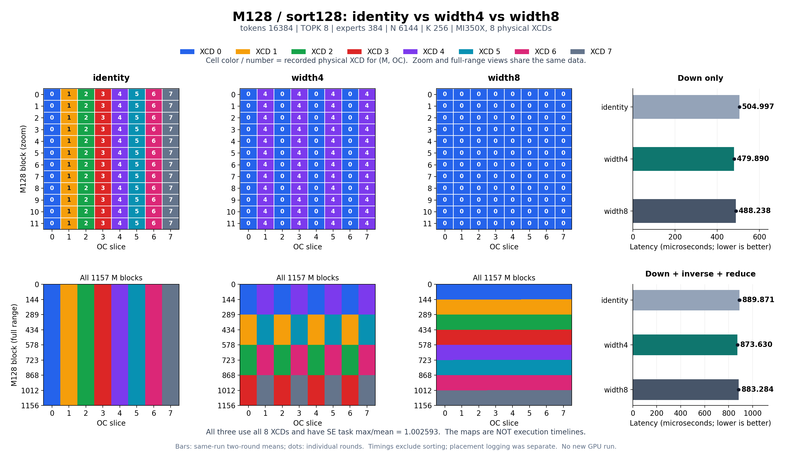

# SE顺序分派、接纳回压与M128 swizzle4

## 结论

**不是整轮完成屏障。论文已有“顺序分派、不能跳过无法接纳block的SE”的结论；本机实验也支持接纳阻塞，但直接反驳“必须等四个SE的旧任务全部结束才能继续”。**

仅看到有效CTA计数 `{384,384,384,5}`，不能区分固定映射、资源不足、排队阻塞或整轮完成屏障。需要记录后续block实际何时、在哪个CU开始。

**可以这样理解用户所说的“第二轮”：SE0接纳成功→轮到SE1，但SE1无法接纳→这个分派流暂时停在SE1，即使SE2/SE3有资源也不能绕过；SE1一旦接纳成功就继续，而不是等四个SE的旧任务全部完成。** 这是论文的行为模型。本机实验支持该类接纳回压，但没有直接观测gfx950内部的分派指针、预分派缓冲或全部ACE连接，不能把简化流程当成精确电路时序。

## 1. 先区分五个概念

| 概念 | 本文含义 | 不等于 |
|---|---|---|
| WG／CTA／block | 一次调度的线程块，本探针每块256线程／4 waves | 单个wave、单条MFMA、一个SE |
| 分派 | 上游把下一个WG交给目标SE的过程 | WG执行完成 |
| 接纳 | 目标SE能为WG找到足够的资源；可能经过内部缓冲 | 必须有一个完全空闲的CU |
| 执行 | WG的wave在具体CU/SIMD运行 | 精确的硬件接纳时刻 |
| 退休／资源释放 | 资源可供新WG使用；可能分阶段释放 | 软件记录出口的同一个瞬间 |

“某CU可以接纳”需要同时满足VGPR、SGPR、LDS、wave／WG槽等要求。一个CU已有WG并不意味着不能再接纳；反过来，有空闲执行单元也不意味着LDS等资源足够。

“轮”只是描述对SE的再次遍历，不是kernel中的同步轮：一个SE内部有多个CU，每CU也可有多个WG。首次填充在没有其他负载、资源足够时通常不因容量不足而停顿，但不能假定首次填充绝无开销／回压，更不能把前4个WG视为整个GPU容量。

### 1.1 CU属于固定SE，阻塞不是CU跨SE共享

本机观测8 XCD，每XCD4 SE、每SE8个有效CU。物理位置用完整的 **`(XCD, SE, CU)`** 标识；`SE0/CU4` 和 `SE1/CU4` 是两个不同CU，CU编号不应单独当作全GPU编号。

示例中的“SE0释放→SE1继续”是：**SE0的接纳障碍解除，上游分派能够继续给SE1，SE1再使用自己的CU**。不是SE1把任务发到SE0的CU，不是WG跨SE迁移。阻塞也不会暂停其他SE已经执行或已接纳的工作，其他SE可以先排空已有任务，然后才表现为没有新任务的空档。

## 2. 逐步例子：SE0先接纳，SE1阻塞SE2/3

以下是 [单文件的 `model` 示例](se-dispatch.py)，**人为规定的CPU模型，不是GPU测量**：只有4个SE、每SE一个接纳位置、分派顺序0→1→2→3、没有前看缓冲；时间单位μs，忽略分派本身的耗时。

| WG | SE | 执行时长 | 顺序接纳模型的开始→结束 | 错误的“整轮完成屏障”开始→结束 |
|---:|---:|---:|---|---|
| 0 | 0 | 10 | 0→10 | 0→10 |
| 1 | 1 | 100 | 0→100 | 0→100 |
| 2 | 2 | 5 | 0→5 | 0→5 |
| 3 | 3 | 5 | 0→5 | 0→5 |
| 4 | 0 | 20 | **10→30** | **100→120** |
| 5 | 1 | 10 | 100→110 | 100→110 |
| 6 | 2 | 10 | 100→110 | 100→110 |
| 7 | 3 | 10 | 100→110 | 100→110 |

过程：

1. 0μs：四个初始WG均可接纳；派发不等待它们完成。
2. 5μs：SE2、SE3空闲，但下一目标是SE0，WG6/7不能跳到WG4/5之前。
3. 10μs：SE0释放位置，**立即接纳WG4**，不等SE1的WG1结束。随后轮到SE1的WG5，但SE1仍满。
4. 10～100μs：分派停在WG5／SE1。SE2、SE3虽空闲也收不到该流中位于其后的WG6/7。与此同时，已经接纳的WG4继续运行，30μs结束；**分派受阻不等于正在运行的WG被暂停**。
5. 100μs：SE1接纳WG5，之后SE2/3接纳WG6/7；不需要等刚派发的WG5完成。

如果有前看缓冲，其他SE可能先执行已派发／已缓存的若干WG，不能要求它们在SE1满的同一周期立即停止。GPU探针因此检查长时间执行空档和后续同CU复用，不根据最初少数CTA的同时开始就宣称存在／不存在接棒机制。

## 论文究竟说了什么

Nathan Otterness、James H. Anderson，*Exploring AMD GPU scheduling details by experimenting with “worst practices”*，Real-Time Systems 58(2), 105–133 (2022)。[NSF PDF](https://par.nsf.gov/servlets/purl/10385873)、[全文XML](https://par.nsf.gov/biblio/10385873/media/xml)、[DOI](https://doi.org/10.1007/s11241-022-09381-y)。以下为概括，而非整段转载。

- **§4.3／Fig.6：顺序分派。** 先将较小编号block分派给一个SE，才能继续分派下一个block；强调的是**已分派／能接纳**，不是之前的block已经执行完。
- **脚注16：证据层级。** 作者将具体的“baton-passing”实现归于AMD工程师的私人通信，未找到其他公开资料直接佐证；Table1/Fig.9的实验支持其行为模型。这不是完全无依据的猜测，也不是公开硬件接口保证。
- **§4.4：不能跳过接纳受阻的SE。** 若一个SE只有一个启用CU且暂时无法容纳新block，ACE会被阻塞，不能先给其他SE继续分派。这是队头阻塞／接纳回压，不要求该SE所有在运行的block都结束。
- **§4.3／Fig.7说明：不是完成屏障。** 作者还指出，资源开始释放后，新block可以在之前整个block结束前启动。这也与“所有旧任务结束才发下一轮”的强说法不同。
- 平台为**Radeon VII／60 CU／ROCm4.2**，不是MI350X。其“四SE”和具体workload-manager结构不能直接当作gfx950 XCD内部实现；跨代需要重新检验。

### 论文中另外两个容易混淆的行为

1. **SE内部的workload manager与小block越过大block（§4.3／Fig.5、7）**：论文描述每SE的workload manager从不同ACE对应的入口向自己的CU安排block。当某入口的大block暂时放不下，另一个入口中资源需求更小的block可能先进入。MM256的完成不一定释放足够资源供MM1024使用，后续MM256因而可能继续进入，拖延MM1024。它不是抢占已经运行的大block，也不与“一个ACE的顺序流不能跳过受阻SE”矛盾：**不同层级、不同入口**。M128与M64分开运行的比较不能借此声称存在跨kernel抢占。
2. **CU mask不均衡（§4.4、§5.1／Fig.9）**：论文中只要某SE仍有启用CU，就仍会分到任务；完全屏蔽该SE的所有CU才例外。某个SE只启用一个CU，另一个SE启用很多CU，仍按SE分派会使前者容易成为接纳瓶颈。因此多加一个位于另一SE的CU反而可能让整体更慢。论文通过不均等／共享分区测到恶化；我们的探针不改CU mask，而用长任务占据一个SE的接纳资源来构造类似压力。

论文把按block顺序分派与HSA规范中的前向进展／较大block ID可等待较小ID的约束联系起来。这是一种实现背景，不意味着规范要求“同一轮所有block先完成”，也不能据此要求本机任意工作负载都严格按照数字SE顺序执行。

**本机范围更窄：** 实测饱和XCD0中的一个SE可以拖延同XCD其他SE，而其他XCD仍能推进。不能把论文的四SE直接换成整台MI350X的8个XCD，推导全GPU共享一个串行派发指针。

## 3. 一个Python文件包含全部示例

唯一维护入口：[se-dispatch.py](se-dispatch.py)。其中包含HIP源码字符串、编译/launch、五组GPU对照、逐wave分析/画图、CPU教学模型、M128已有证据复查、三映射对比图和18项内置测试。原独立探针入口、C++源文件和独立测试脚本均已删除；**与本主题无关的其他tools未删除**。

| 子命令 | 功能 | 参数/依赖 |
|---|---|---|
| `model` | 上面的顺序阻塞时间表，以及旧/新sorting的相位统计教学模型 | 纯Python标准库，不读GPU |
| `test` | 18项内置回归：同CU、不同SE/XCD、时间边界、模型、源码指纹、实际映射网格 | 纯Python标准库 |
| `run` | 全五组GPU例子，读取实际XCC/HW_ID，生成raw JSON、摘要和SVG | `--out`新目录；默认两种LDS、3次重复，支持`--target-se`、`--target-xcc`、三种本地时间预算 |
| `analyze` | 用原始逐wave记录重新计算每一项结果，并核对二进制哈希 | `--out`已有结果目录；只用CPU，兼容先前三文件版本数据 |
| `moe-evidence` | 核验下面引用的真实M128 sort256/sort128放置、均值及A消费域 | 默认读仓库中已有[真实MoE结果](../../moe_8w_down/try/sort_alignment_20260913/default/results.json)，也可`--data`指定；Torch仅CPU加载原始tensor，不导入旧实验脚本 |
| `plot-mappings` | identity／width4／width8同图：实际XCD网格、局部放大、全M范围和普通计时时延 | `--figure`新PNG路径，同步生成SVG与核验JSON；`--start-m`／`--rows`控制放大范围；只读既有数据，不运行GPU |

使用现有Python/ROCm，不安装依赖。HIP编译需要分别读取device与host代码，所以运行时将内嵌源码写入自动清理的临时目录，再用hipcc编译；**不需要维护第二个源文件**。结果目录保留共享库及其哈希，不保留新的独立源码入口。采集拒绝覆盖已有目录，旧数据不重写。

当前脚本内嵌HIP与原成功采样的GPU源码**逐字节相同**。`analyze`能识别旧的源码指纹并重算30个样本，但明确说明“新分析器重算旧数据”，不声称删掉的旧Python文件仍与当前文件哈希相同。

### 为什么实验没有自己制造全局同步

- 一个kernel内2048 CTA，每CTA256线程／4 waves。
- **无跨CTA barrier、无原子计数器、无软件任务队列、无CU mask或新队列设置。** 只有CTA内部LDS初始化／结束barrier，不等待其他CTA。
- 短任务20μs，长任务800μs；提前释放任务200μs。用设备wall-clock设置**有限本地时间预算**，不轮询全局变量，不等待将来任务。
- 记录发生在探针内，不用ATT；报告的是自记录执行时间线，不是正常MoE性能。
- 静态LDS分别为98304B和68616B，runtime实际查询到每CU最多1／2 CTA；均12 registers、0 private bytes。单CTA/CU配置使“同CU先前任务已退出、后续任务开始”特别容易解释。
- 根据实际XCC/SE决定重任务，不假定SE的数字排列；事后检查256个CU、32个SE、同CTA的wave归属及每条校验值。

### 五组对照

| 模式 | 构造 | 目的 |
|---|---|---|
| `uniform_short` | 全部20μs | 正常推进／时间尺度控制 |
| `one_straggler` | 只有bid0为800μs | 长任务未结束时，其他SE能否复用CU执行后续block？ |
| `one_se_saturated` | XCD0/SE0的初始全部驻留位置为800μs | 一个SE无法再接纳block时，是否影响其他SE？ |
| `one_se_partial_release` | 同上，仅其中一个block改为200μs | 释放一个位置是否足够，还是必须等待其余全部结束？ |
| `spread_same_work` | 与饱和组相同长任务数，分散到同XCD的4个SE | 排除长任务总数量／总预算不同 |

每组3次，第二次反向测试顺序。原始记录保存后才检查假设；若硬件映射不同而断言失败，记录仍保留，不能删除“坏”结果。

## 4. 本机实测：支持哪个模型？

`HIP_VISIBLE_DEVICES=5`，逻辑设备0实际PCI **0000:85:00.0**，MI350X/gfx950，256 CU、8 XCD、160KiB LDS/CU，wall-clock100MHz，ROCm7.2。使用实际BDF，不把SMI索引与HIP逻辑索引混淆。

30次采样均通过，全部观测到 `XCC=bid%8` 和每XCD的4相位SE排列；这只是该探针的观测，不作为以后kernel的保证。

### 1. 单个长CTA已构成反例

98304B LDS／每CU1 CTA，第一次采样：

- 长block0在 **XCD0/SE3**，至少到 **800.74μs**仍在执行工作。
- 同XCD的 **SE2/CU4** 上，block104于 **20.90μs**记录出口。
- 后续block488在**同一个SE2/CU4**于 **41.94μs**记录入口。
- block488位于初始256个block之后，不是首次填充时一起驻留的任务。

所以其他SE并没有等该长CTA结束。三次均找到147个这种post-prefix同CU复用证据。[原始样例与计时](se_dispatch_20260913_v2/lds98304_one_straggler_0.json)、[时间线](se_dispatch_20260913_v2/lds98304_one_straggler_0.svg)。

### 2. 整个SE不能接纳时，确实阻塞同XCD的其他SE

98304B LDS时，XCD0/SE0的8个CU各有一个800μs长任务；检查其运行区间确实重叠，目标SE的可驻留位置全部占满。

其他三个SE在短任务排空后，出现约 **754.19μs**没有任何记录中的CTA执行区间的空档，之后还有新CTA开始，故不是grid已经耗尽。把相同8个长任务分散到四SE后，原始horizon均值 **945.66→800.65μs**。这是接纳阻塞的支持证据，但仅此一项仍不能区分其与整轮完成屏障。

### 3. 提前释放一个位置：不需要等待剩余7个长任务

仍是每CU1 CTA，只把目标SE的一个长block改为200μs，第一次采样：

| 事件 | 相对时间 μs |
|---|---:|
| XCD0/SE0的block16记录出口 | **200.56** |
| XCD0/SE1/CU4的后续block312记录入口 | **221.60** |
| 同SE1/CU4前一block56早已记录出口 | 20.56 |
| XCD0/SE0剩余7个长block最早工作结束 | **800.44** |

**到221.60μs，另外7个长block都还没结束，其他SE已经恢复启动后续block。** 三次均找到84个同CU复用证据。其他SE空档由约754.19μs缩短到154.21μs，变化约600μs，与一个位置的释放提前量一致。

[详细记录](se_dispatch_20260913_v2/lds98304_one_se_partial_release_0.json)、[时间线](se_dispatch_20260913_v2/lds98304_one_se_partial_release_0.svg)。

### 3.1 怎么确认后续WG在另一个SE，而不是刚释放的SE？

每个wave在自己执行时读取 `HW_REG_XCC_ID` 和 `HW_REG_HW_ID`，后者按 `SE=(hw>>13)&7`、`CU=(hw>>8)&15` 解码；同WG的四条记录必须有相同 `(XCD,SE,CU)`，否则检查失败。**不是通过WG编号或时间接近推断归属。**

上述记录是两条不同物理CU上的事件：

| WG | XCD | SE | CU | 记录事件 |
|---|---:|---:|---:|---|
| WG56 | 0 | **1** | **4** | 20.56μs出口 |
| WG16 | 0 | **0** | **1** | 200.56μs出口 |
| WG312 | 0 | **1** | **4** | 221.60μs入口 |

“同CU复用”指 **WG56→WG312复用SE1/CU4**，不包括SE0/CU1上的WG16。没有哪个SE把自己的CU交给别的SE。只能直接知道WG实际运行在哪个SE/CU，不能从这些寄存器读取内部哪个调度电路发出了命令。

脚本要求后续WG位于初始驻留容量前缀之外，并在同一CU前一个短WG出口至少5μs之后启动，同时仍有其他SE的长WG继续工作至少5μs；不是把首次填充中的并发WG错当作新一轮。每CU1 CTA配置尤其明确地排除了“原来的两个WG一起驻留”解释。

### 4. 接近M128 LDS配置的复测

68616B LDS／每CU2 CTA：目标SE初始占16个位置，提前释放其中1个，其余15个长任务仍在执行。反例依然存在，不依赖“每CU只放一个CTA”的特殊配置。

| LDS B | 饱和组空档均值 μs | 单位置提前释放组空档 μs | 提前释放组同CU复用数（每次） | 首次样例：释放／后续入口／其余仍忙至 μs |
|---:|---:|---:|---:|---|
| 98304 | 754.187 | 154.213 | 84,84,84 | 200.56 / 221.60 / 800.44 |
| 68616 | 754.187 | 154.227 | 84,84,84 | 200.56 / 221.60 / 800.40 |

这两组只是LDS容量匹配的调度探针，没有复现M128的VGPR/MFMA/VMEM指令流，不能把时间差直接换算成MoE的stall占比。

### 5. 单文件重新运行：把受阻目标改成SE1

合并后又实际编译运行五组例子、两种LDS各一次，**目标设为XCD0/SE1**。不是只跑CPU模型，也没有复用旧的共享库代替新编译。

98304B LDS的提前释放样本中：SE1/CU3的WG24于 **200.79μs**记录出口；SE3/CU5的WG320、SE2/CU2的WG328、SE0/CU4的WG336在 **221.83μs**已记录入口，而SE1其余7个长WG至少继续到 **800.67μs**。它们运行在各自SE的CU，不是抢用SE1刚释放的CU。

| LDS B | SE1全满时其他SE空档 μs | 仅一个位置提前释放后的空档 μs | 提前释放组同CU复用证据数 |
|---:|---:|---:|---:|
| 98304 | 754.24 | 154.20 | 84 |
| 68616 | 754.16 | 154.16 | 84 |

[单文件GPU日志](se_dispatch_singlefile_20260913_gpu_v3.log)、[完整新结果](se_dispatch_singlefile_20260913_v3/results.json)、[SE1提前释放样例](se_dispatch_singlefile_20260913_v3/lds98304_one_se_partial_release_0.json)、[SE1时间线](se_dispatch_singlefile_20260913_v3/lds98304_one_se_partial_release_0.svg)。同一kernel内仍只有CTA局部barrier；这个更换目标SE的运行支持现象不是SE0特有。

它与“SE1不能接纳时拖住后续SE”的模型一致，但**仍没有直接证明每一个block在零缓冲硬件中严格逐条按SE0→1→2→3接纳**。实测SE相位是排列，且本探针观察的是执行入口/出口。详细等待顺序的CPU例子是帮助理解模型，不是用模拟器证明自身假设。

## 5. 用这些行为解释之前M128 swizzle4为什么有效

### 5.1 必须先声明旧实验使用sort256，而不是原生sort128

旧默认形状tokens16384、TOPK8、384个专家；真实route数131072。每专家路由数都在257～512，于是 **sort256** 将每个专家补齐到512行；M128 kernel再将其拆成4个128行任务。前三块都非空，只有5个专家的第四块非空，因此全局M块余数统计是：

| `M%4` | 0 | 1 | 2 | 3 |
|---|---:|---:|---:|---:|
| 非空M128块 | 384 | 384 | 384 | **5** |

这里 `M` 是排序后M128块编号，不是token编号；“每专家4块”只是此shape与sort256共同造成，不是MoE必须如此。原来的379个全padding M128块对应 **379×8＝3032个CTA**（每个OC一份），也会launch并检查后快速退出，kernel没有对其执行完整GEMM。

### 5.2 identity把padding周期与SE相位对齐

OC8、identity下：

$$
t=b,\quad M=\lfloor b/8\rfloor,\quad OC=b\bmod8.
$$

旧实际放置观察到：

$$
XCD=b\bmod8,\qquad SE=P_x\!\left(\lfloor b/8\rfloor\bmod4\right).
$$

$P_x$ 是该次采样、该XCD上的SE编号排列。因此每个XCD虽然都有1157个有效CTA，内部四个SE却得到 `{384,384,384,5}` 的排列；三个SE长期处理GEMM，另一个SE几乎只处理快速退出的padding。

**与接纳模型的联系：** 繁忙SE的VGPR/LDS/WG位置更容易持续被占满。当顺序流走到这个SE而暂时无法接纳下一WG，后续给较轻SE的任务也可能被回压。轻SE完成自己的padding并不意味着能绕过其他SE自由领取更多后续工作。所以仅平衡8个XCD的总任务数不够，内部SE的有效工作也重要。

这里有两层成本：繁忙SE自身决定负载倾斜的完工下界；不能绕过的接纳回压还可能使其他SE出现空档。不能从计数表单独定量拆分这两层，更不能据此宣称每轮有一个跨SE完成barrier。

### 5.3 width4改变任务身份，让四SE分摊同一M块的不同OC

对可整分的有效前缀，逻辑转置宽度 $w=4$：

$$
t_4(b)=(b\bmod4)\lfloor T/4\rfloor+\lfloor b/4\rfloor.
$$

旧形状有1536个M128槽位（含padding），所以 $T=1536\times8=12288$，不是9256个真正非空CTA。固定物理XCD $x$，令 $b=8j+x$：

$$
t_4=(x\bmod4)3072+2j+\lfloor x/4\rfloor.
$$

当 $j$ 连续变化时，物理SE相位每步轮换，而同一个M块现在可连续对应四个不同OC。这样，同一M块是非空还是padding，不再总固定到一个SE；实际SE任务max/mean从 **1.327571降至1.009507**。

例如XCD0、最初四个 $j$：

| $j$ | identity逻辑 `(M,OC)` | width4逻辑 `(M,OC)` | 物理SE相位 |
|---:|---|---|---:|
| 0 | (0,0) | (0,0) | 0 |
| 1 | (1,0) | (0,2) | 1 |
| 2 | (2,0) | (0,4) | 2 |
| 3 | (3,0) | (0,6) | 3 |

identity下专家第四块容易是padding，对应相位3；width4下这四个相位都处理M0的不同输出列任务，M3若是padding则其四个OC任务也会被分摊。**width4是逻辑转置宽度，不是只使用4个XCD，也不是改变CU归属。** 尾部按原kernel规则保持不完全转置部分的identity映射。

### 5.4 不只是一个推测：证据链及边界

1. **真实MoE放置**：旧sort256的identity确有严重SE有效任务偏斜，width4显著减轻。
2. **真实MoE的受控块重排**：不改每块route和专家归属，只在专家内打乱完整M128块，identity Down **552.392→488.876μs**，width4 **484.956→484.536μs**几乎不变。它直接支持固定padding周期影响性能，但也改变访问时间顺序，不能将63.5μs全部称为单独的SE阻塞时间。
3. **真实live mask、无A/B/C的旧调度重放**：identity **508.173μs**，width4 **402.890μs**。没有MoE张量流量仍有明显差异，支持调度因素；它不是实际MoE时长，不能从真实MoE中相减。
4. **本文有限时长GPU例子**：SE全满时能使同XCD其他SE缺少后续工作；只释放一个位置就能继续，且不等剩余长WG结束。它区分“接纳回压”与“整轮完成屏障”，但没有测实际MoE的独占stall占比。

旧受控MoE实验的[结果与方法](../../moe_8w_down/try/xcd_schedule_20260913/README.md#4-两个因果对照不靠缓存也能复现收益)保留，本文单文件的 `moe-evidence` 无需导入那些旧脚本即可复查本次引用的真实M128时延与原始放置。

### 5.5 A局部性是另一条证据，不能只说B复用

OC8下，同一M块的A被8个OC消费。旧sort256实际归属为：identity分布到8 XCD，width4降到2 XCD。旧独立A-only PMC读量约 **260.013→65.013MiB**，支持跨XCD重复读取减少；但这不是实际MoE中A专属计数，不能把字节或时长直接拿来分摊MoE收益。

旧实际MoE中，每个B `(expert,OC)` 在identity和width4都只由一个XCD消费，不能说identity必然把同一B片段复制8次。B-only对照中identity／width8约111.836／113.325μs，几乎无swizzle收益，也是不能删掉的反例。[A/B局部性及PMC](../../moe_8w_down/try/xcd_schedule_20260913/README.md#5-第二个机制a跨xcd复制而非只有b)。

### 5.6 修正sort128后，不能再沿用旧的padding解释

同进程正反两轮的[修正复测](../../moe_8w_down/try/sort_alignment_20260913/default/results.json)：

| 输入／映射 | 非空M块 `M%4` | 实测SE max/mean | Down μs | Down＋inverse＋reduce μs |
|---|---|---:|---:|---:|
| 旧sort256／identity | 384,384,384,5 | 1.327571 | 553.358 | 934.710 |
| 旧sort256／width4 | 384,384,384,5（逻辑，已转置） | 1.009507 | 484.838 | 877.748 |
| **sort128／identity** | **290,289,289,289** | **1.002593** | **504.997** | **889.871** |
| **sort128／width4** | **290,289,289,289** | **1.002593** | **479.890** | **873.630** |

原生sort128下，379个专家各3个M块、5个专家各4块，没有有效前缀中的全空M128块。identity本身已经均衡；width4的Down优势从旧 **14.13%**缩小到 **5.23%**，不能把剩余5.23%继续归因于`384/384/384/5`。

单文件的 `moe-evidence` 还从真实放置复算出：原生sort128时，identity的1157个M块都由8个XCD消费；width4中1154个M块由2个XCD消费，**边界的3个M块由4个XCD消费**。这说明A域局部性仍有变化，但不能无条件断言原生布局所有M块都是2份，更不能在没有新PMC的情况下将剩余速度差全部量化为A缓存收益。[单文件复算日志](se_dispatch_singlefile_20260913_moe.log)。

**最终解释：旧sort256的swizzle4收益有“打散padding/SE相位、减轻接纳回压风险”与“A消费域更集中”两条证据；原生sort128消除了前一项严重偏斜，剩余收益需另行分解。** 更少HBM字节不保证更快，width4比width8好也不是单靠这个模型就能推出的硬件定律。

### 5.7 identity／width4／width8同图比较

[可放大SVG](se_dispatch_m128_mapping_comparison.svg)、[逐格数据及来源SHA256](se_dispatch_m128_mapping_comparison.json)、[生成日志](se_dispatch_plot_20260913.log)。使用同一次M128/sort128、Batch16384测试的实际GEMM放置回读与普通计时，**没有重新运行GPU**。

- **横轴OC0～7，纵轴逻辑M128块编号**；颜色和格内数字表示执行该 `(M,OC)` 任务的实际XCD，不是SE编号。
- 上排放大M0～11，下排展示全部1157个M块，避免仅看width8最初全是XCD0便误认为没有使用其他XCD。三种映射都使用全部8个物理XCD。
- identity按OC分配XCD，因而呈纵向色带；width4主要将同一M的OC分给两个XCD，同时沿M分段；width8主要沿M分段，同一M的OC更集中。分段边界按实际记录绘制，不假定每个M都刚好落在理想整分范围。
- 右侧是同次正反两轮的平均时延，黑点是单轮值；普通计时与放置记录分开采集。完整流程指Down＋inverse＋reduce，仍不包含sorting。
- **网格不是时间线**，无法从相邻色块直接推断wave阻塞或SE分派空档；三者的SE任务max/mean都是1.002593。

| M128/sort128映射 | 配置含义 | Down μs | Down＋inverse＋reduce μs |
|---|---|---:|---:|
| identity | `xcd_swizzle=False`，不做任务转置 | **504.997** | 889.871 |
| width4 | `xcd_swizzle=True, xcd_count=4` | **479.890** | **873.630** |
| width8 | `xcd_swizzle=True, xcd_count=8` | **488.238** | 883.284 |

504.997是identity，不是width8；“使用8个物理XCD”也不等于“width8逻辑转置”。width4相对identity速度提升5.23%，相对width8提升1.74%，是两个不同的比较对象。新增绘图/指纹回归后的[18项内置测试](se_dispatch_plot_20260913_tests.log)通过。

### 5.8 persistent与L2局部性可以兼得吗？

**可以设计成兼顾两者；persistent并不天然破坏L2局部性。** 需要区分“常驻执行方式”和“逻辑任务归属策略”。以下设计已有[独立M128/sort128实现](../../moe_8w_down/try/xcd_persistent_20260913/README.md)，默认路径不变；实现通过正确性测试，不等于已经证明性能更快或L2命中率更高。

#### 为什么一个全局原子队列容易损失局部性

当前[主M256 persistent内核](../../moe_8w_down/moe_multistage_down.py)由所有常驻CTA从同一个计数器逐项领取任务。谁先完成谁先拿到下一个 `(M,OC)`，任务落在哪个XCD由完成顺序决定；对领取到的task再套swizzle，也不能恢复原来“任务固定归属某个XCD”的关系。

问题来自**不区分XCD的任务领取**，不是persistent本身。常驻CTA在自己的CU内切换逻辑任务，省去每个逻辑任务都重新经过硬件WG接纳的过程；但初次CTA启动仍需要硬件分派，wave数据等待/CTA内barrier也不会因此消失。工作量不均或启动过多常驻CTA时，仍可能有长尾和排队。

#### 方案A：静态persistent＋同一个swizzle（最小改动）

设常驻CTA数为 $P$，CTA编号为 $b$，处理第 $k$ 个虚拟任务：

$$
v=b+kP,\qquad t=t_w(v),\qquad v<T.
$$

当 $P$ 是8的倍数，$v\bmod8=b\bmod8$。如果实际放置仍满足观测到的 `XCD=b%8`，那么这个CTA处理的虚拟任务与原独立CTA grid有相同XCD归属。**既没有每个逻辑任务的新WG接纳，也不用牺牲原swizzle的空间局部性。** 任务的实际执行顺序仍可能变化，L2命中率不是自动保证。

现有[M128实验工厂](../../moe_8w_down/try/moe_multistage_down_m128.py)的 `static_ctas` 分支已经是这类 `linear_task += static_ctas` 后重新转置的枚举方式；它不是动态work stealing，不能平衡任务时长差异，而且当前selected active-B/spread配置并不直接允许开启该分支。不能把开关改成非零就宣称现有最佳流水得到保留或必然更快。

#### 方案B：每XCD一条共享队列，XCD内跨SE动态领任务（建议优先试）

保留原来的逻辑转置，但不要由全GPU争用一个 `next`。初始化8个XCD分片计数器，resident CTA读取一次真实XCC ID $x$；同XCD的所有SE/CTA共享该分片：

$$
r=\operatorname{atomicAdd}(next[x],B),\qquad
v_i=8(r+i)+x,\quad t_i=t_w(v_i),\quad 0\leq i<B,\ v_i<T.
$$

这里 $B$ 是一次领取的逻辑任务数量，例如先试4或8，并非Block M。每个虚拟编号 $v$ 属于唯一的分片 $(v\bmod8)$，计数器原子领取保证不重复；$t_w$ 的前缀/尾部规则保持双射，所以覆盖原task集合且不漏不重。

- **保留XCD局部性**：同一批原width4虚拟任务仍在其指定XCD执行；对于已验证的映射，A/B的XCD消费域保持原样，不需要硬件将某个指定block固定放到某个XCD。
- **在XCD内平衡SE**：该XCD哪个resident CTA先完成就从本地队列继续取任务。SE0有慢任务，不妨碍已经常驻的SE1/2/3工作者取下一项；逻辑任务领取无需再次经过四SE硬件分派轮。
- **不要每SE再固定一条队列**：否则静态任务时长偏斜又会固化到SE。本地共享队列的范围应首先是L2复用域，而不是刚刚导致负载偏斜的SE相位。
- **小批量领取＋专家内排列**：优先连续领取同一expert的相邻M／OC任务，减少原子开销、缩短B复用距离。保持width4时，一批4个虚拟任务通常对应同M的4个OC；若进一步跨OC复用CTA内A寄存器，则是额外kernel改动，必须单独验证寄存器压力与准确性。

这种分片计数器可以是全局显存中的普通device atomics，逻辑上按XCD分片，**不要求计数器物理存放在某个XCD的L2里**。固定XCD消费域只是复用机会，实际命中率还取决于工作集大小、替换策略和并发。

#### 长尾与正确性边界

1. 先按实测occupancy和硬件CU数量配置常驻worker，验证每个XCD的worker覆盖；仅读取XCC ID不能保证每个分片都有worker。不能让已经常驻的CTA在全局barrier等尚未入场的CTA。
2. 分片任务数量接近不代表耗时相同。优先在本XCD领取；本分片耗尽后，可以有限度窃取其他XCD的**未领取小bundle**以收尾，但这会用少量L2局部性交换负载均衡。领取需要原子所有权，终止规则不能遗漏没有本地worker的分片。
3. 不能将同一task重复分配，或把已在执行的bundle再次窃取；输出布局、sort128 expert索引和TOPK累加契约保持不变。
4. 每次launch重置所有分片计数器，重置成本计入完整时延，graph replay也要重新初始化。跨任务复用LDS前，必须排空上一任务的异步B DMA/输出并保留必要CTA barrier，不因为persistent而省掉数据依赖同步。
5. 分别比较原width4独立CTA、静态swizzled persistent、XCD分片persistent，报告正常Down/完整时间与实际XCD归属；要声称L2收益保留，还需同dispatch PMC／访存证据，不能仅凭调度公式。

**推荐路线：先保留width4的任务归属，采用“XCD分片队列＋分片内动态领取＋小bundle”，最后只在尾部允许有限跨XCD窃取。** 这比全GPU逐task抢一个计数器更有机会兼顾SE推进和L2复用，但不是已经证明快于479.890μs的新实现。

随后按请求增加了[独立入口](../../moe_8w_down/try/xcd_persistent_20260913/moe_xcd_persistent.py)：8个128B间隔的XCD分片头、CTA内bundle状态、本地优先＋有限遍历其他分片、每次launch内部计数器清零。保留选定M128的PF3/ring4、activeB3/spread；不改默认width4或主M256。原调用者的一word counter保持不变，计数器由可复用workspace管理。

实现的tail stealing可以在本地分片耗尽后继续领取其他分片，并非严格限制为最后固定比例任务；这保证单CTA也能覆盖全部分片，但可能扩大部分A/B消费域。诊断单独记录home/actual XCD、逐任务访问次数及窃取量，以实测评估这个折中，不把领取公式直接当成L2收益。

第一组正常计时（默认shape、同址正反两轮）也说明“理论上可以兼顾”不等于实际自动加速：原width4 Down **478.587μs**；256-worker/bundle4 **570.742μs**，256-worker/bundle8 **644.479μs**，512-worker/bundle4 **546.051μs**，均更慢。队列清零已计入，数值通过，不将该实现提升为默认。没有新ATT/PMC，因此这些数字尚不能区分额外queue/barrier、寄存器存活或访问时序各自的影响。[实现测量记录](../../moe_8w_down/try/xcd_persistent_20260913/README.md#默认形状普通计时)。

## 6. 能证明与不能证明

- **可以反驳**严格的“XCD四SE必须等一批旧任务全部完成才能发下一轮”模型。判定用同XCD、同CU复用、初始capacity前缀之外的block及5μs保护间隔；不是仅看block编号或总任务数。
- **支持但不唯一确定**SE接纳回压／顺序队头阻塞。排队深度、token数量、具体ACE/workload-manager实现没有直接可观测接口；不根据这些样本逆推出精确电路。
- 软件记录的是执行入口/出口，不是硬件派发、接纳或完全退休时刻；输出store在出口记录之后。5μs保护区间和几百微秒的剩余长任务窗口，远大于这里的边界误差。空档是所有观测执行区间的补集，保守报告，不叫HBM空闲。
- 一个有效反例即可否定强模型；没找到反例只能称“本次未区分”，不能当成整轮同步已被证明。
- 对旧sort256/M128的 `{384,384,384,5}`，更准确的描述是**固定分派＋负载倾斜可能触发接纳阻塞**，不是四SE之间存在任务完成barrier。原生sort128的数据不能继续使用该padding例子解释。

## 7. 原始数据与复查

[完整结果](se_dispatch_20260913_v2/results.json)、[全部采样日志](se_dispatch_20260913_v2.log)、[30份原始记录CPU复查](se_dispatch_20260913_v2/recheck.log)、[10项CPU测试](se_dispatch_20260913_v2/cpu_tests.log)。结果保留源码和编译二进制SHA256；每个sample有未裁剪的逐wave压缩JSON及单独摘要，第一轮关键case有SVG。

首次构建因ROCm7.2的 `hipFuncGetAttributes` 要求显式kernel pointer转换而失败；[失败日志](se_dispatch_20260913.log)保留。修复该类型转换后重建到新目录，没有修改任务模式或筛除不符合预期的GPU样本。

本次单文件整理的检查包括：[15项内置测试](se_dispatch_singlefile_20260913_tests_v2.log)、[CPU模型输出](se_dispatch_singlefile_20260913_model.log)、[旧30样本重新核验](se_dispatch_singlefile_20260913_legacy.log)、[M128原始放置和时延复算](se_dispatch_singlefile_20260913_moe.log)，以及上面的新10次GPU采样。旧数据不重标为新运行，也不因旧脚本删除而改写其历史源码字段。

删除旧三个源文件后再次验证：[15项测试](se_dispatch_singlefile_20260913_tests_final.log)、[旧30样本](se_dispatch_singlefile_20260913_legacy_final.log)、[新10样本](se_dispatch_singlefile_20260913_new_final.log)、[教学模型](se_dispatch_singlefile_20260913_model_final.log)、[真实M128数据](se_dispatch_singlefile_20260913_moe_final.log)全部通过。所有入口均只由当前单文件提供，不依赖已经删除的脚本。

合并时保留了两个编译试错：[hipcc标准输入丢失目标架构](se_dispatch_singlefile_20260913_gpu.log)、[标准输入被device pass消耗后缺失host包装符号](se_dispatch_singlefile_20260913_gpu_v2.log)。最终使用自动清理的临时源码进行正常host/device双编译；没有修改GPU任务逻辑或隐藏失败数据。