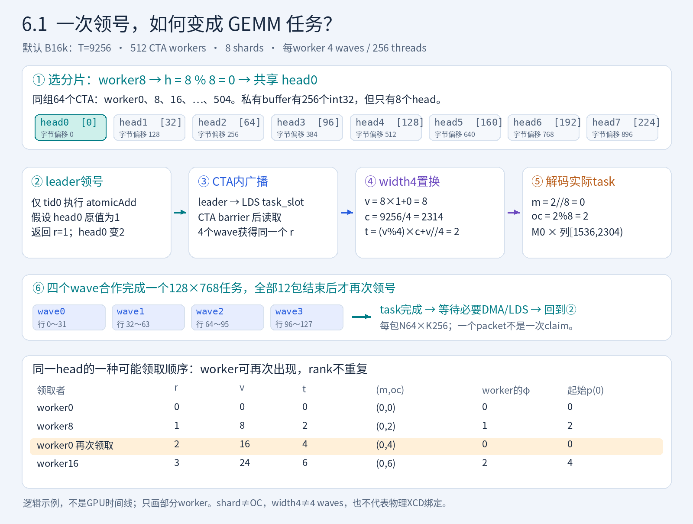
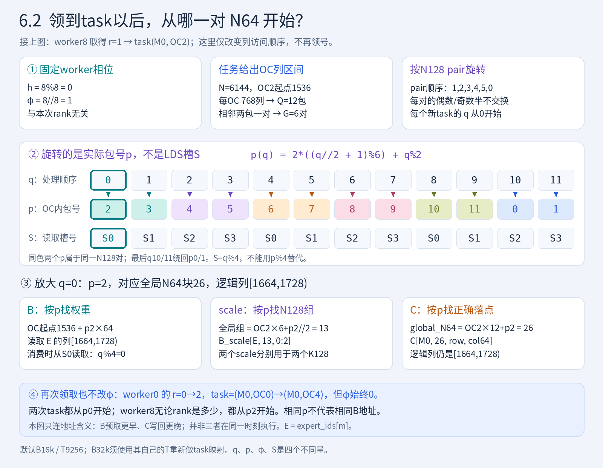
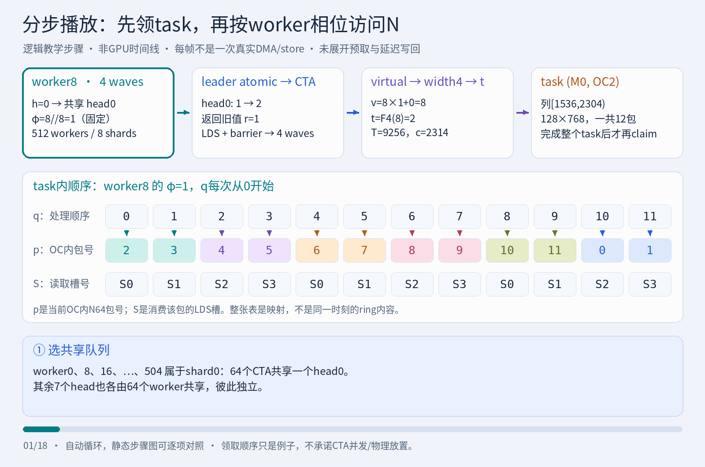

# MoE down：相对PyHIP的优化与四个固定case

本文对应2026-09-14清理后的主代码，包含B32k的packed大buffer寻址修复。以测试中的 **PyHIP FP8 down＋Torch TOPK sum** 为基线，先列公共增量，再分别说明 **256x128 persist、256x128、128x128、128x128 persist**。历史筛选数字不作为每项优化的独立收益证明。

## 1. 名称、任务粒度与基线

[case入口和工厂](test_blockscaled.py#L25-L51)保留七项；旧FlyDSL BN32/BN64仍作对照，本文重点说明四个packed case。

`Mx128`中的M是计算/排序行块；128是该实现的N128组织单位，**不是一次任务只算128列**。B的实际DMA和单个Compute以 **N64×K256** packet进行。一次逻辑任务覆盖`M × (N / OC分片数)`，内部循环多个packet。

| case | M／sort粒度 | waves/CTA | OC分片数S | 一次逻辑任务的N范围 | 调度 | task swizzle | 输出策略 |
|---|---:|---:|---:|---|---|---|---|
| PyHIP | 256 | 8 | 1 | 全N，内部按N64循环 | 256个persistent CTA，全局atomic | 无启用的task swizzle | routed，默认store策略 |
| **256x128 persist** | 256 | 8 | 4 | N/4 | 256个persistent CTA，全局atomic | 无 | packed，NT／aux2 |
| **256x128** | 256 | 8 | 4 | N/4 | 每task独立CTA | **width8** | packed，NT／aux2 |
| **128x128** | 128 | 4 | 8 | N/8 | 每task独立CTA | **width2** | packed，SC1/NT／aux18 |
| **128x128 persist** | 128 | 4 | 8 | N/8 | 512个persistent CTA，8个逻辑分片队列 | **width4** | packed，SC1/NT／aux18 |

以上CTA数量是launch/work分配方式，不等于同时驻留数量。硬件为gfx950／MI350X，256 CUs、8 XCDs；`width2/4/8`是逻辑置换宽度，不是使用的物理XCD个数。

### PyHIP已经有的机制——不能算成新增

以[真正的基线调用](test_blockscaled.py#L71-L86)为准，进入的是[PyHIP down](../../../src/contrib/moe_gemm_8wave.py#L781-L864)，不是同文件的gate/up函数。

- 全局`atomicAdd(1)`领任务，LDS向整个CTA广播，任务内复用A寄存器片段。
- FP8原生MFMA16×16×128，K128独立scale，FP32乘法/FMA后routing乘法。
- B权重pre-shuffle、直接global→LDS、四个B槽，以及8 waves分成4＋4错相执行Memory/Compute。
- BF16 conversion和`permlane16_swap`在寄存器中完成；**原基线也没有C LDS shuffle**。

代码：[A加载与四槽B DMA](../../../src/contrib/moe_gemm_8wave.py#L869-L947)、[FP8 MFMA/反量化/打包](../../../src/contrib/moe_gemm_8wave.py#L969-L1077)、[错相流水](../../../src/contrib/moe_gemm_8wave.py#L1121-L1225)。默认`M256/8 waves`每wave是32行，`nrM=2`；不能照搬源码中遗留的`nrM=4`注释。

本测试的PyHIP输出为`[tokens, TOPK, N]` routed BF16，最终使用[预分配Torch sum](test_blockscaled.py#L89-L112)。源码里另有手写reduce函数，但**本基线没有调用它**。

## 2. 四个case共享的增量优化

### 2.1 OC拆分：缩短单任务，增加可调度任务

PyHIP基线OC1，一个claim计算整个N。新M256为OC4，新M128为OC8，多个任务分别计算同一M块的不同输出列，增加调度粒度。

默认tokens16384／TOPK8／E384／N6144／K256：

| 路径 | valid排序行 | 有效M块 | 逻辑任务数 | 每task列数 | 每task N64 packet数 |
|---|---:|---:|---:|---:|---:|
| PyHIP／sort256／OC1 | 196608 | 768 | 768 | 6144 | 96 |
| M256／sort256／OC4 | 196608 | 768 | 3072 | 1536 | 24 |
| M128／sort128／OC8 | 148096 | 1157 | 9256 | 768 | 12 |

收益意图是更细的负载平衡和N维并行；代价是更多task启动/领号/metadata，以及A按OC重复加载。不同OC读不同B列，合起来才是一份该M块所需的B，**不要再把B字节总量乘OC**。代码：[M256划分](moe_multistage_down.py#L118-L143)、[M128划分](moe_multistage_down_m128.py#L34-L55)。

### 2.2 把“反量化＋上一结果打包”穿插在MFMA之间

PyHIP已有延迟反量化队列，但其BF16/routing打包位于当前MFMA批次之后。新流水把已完成的另一半/前一packet的routing乘法、BF16 conversion、permlane/DPP拆成小操作，穿插到当前MFMA间；旧C的store继续延迟到后续阶段。

- 每Compute仍是16条MFMA；不是更换为低精度近似或减少所需dot。
- 以`pending/dequant`短队列延迟消费MFMA结果，用独立操作填依赖间隔；源码`remaining=7`是调度预算，不是所有ISA间隔都严格7条VALU的保证。
- 地址预先准备，热点片段局部pin到VGPR；uniform scale经标量广播，控制长生命周期值，避免意外spill。

代码：[M256 compute_stage](moe_multistage_down.py#L340-L418)、[M128 compute](moe_multistage_down_m128.py#L263-L339)、[寄存器/地址helper](moe_multistage_down.py#L39-L62)。M128与M256实际store时机不同，见后文各case。

### 2.3 从routed scatter改为packed合并写，再由专用reduce消费

PyHIP沿原token/slot写routed行；同wave的相邻排序行可能落在不相邻的token地址。新实现先写：

`[sorted_M_block, global_N64, row_in_M_block, col64]`。

在原BF16/permlane基础上，增加[行低位与列位的DPP交换](moe_multistage_down.py#L64-L115)，让相应lane的16B store组成连续128B地址片段；**不是一条线程指令写128B**，也不需要C进LDS。M256的[packed地址](moe_multistage_down.py#L256-L266)与M128的[地址/目标行掩码](moe_multistage_down_m128.py#L177-L214)都必须和重排匹配。

新的消费者直接从packed布局gather：

1. `inverse.fill_(-1)`并重建`inverse[token,slot]=sorted_position`，只扫描valid前缀。
2. 256线程、2048列/CTA，提前读TOPK位置和片段，FP32顺序累加后转BF16。
3. 没有额外的“先restore成routed再sum”中间步骤；但inverse和gather本身有成本，必须计入Full。

代码：[inverse有效前缀](../../../src/contrib/flydsl/moe_gemm_2stage/moe_reduce.py#L110-L136)、[packed reducer](moe_multistage_reduce.py#L20-L59)、[共享pipeline](moe_multistage_pipeline.py#L34-L82)。

若排序位置为l、输出列为j、Block M为B，则packed元素索引为：

$$
E(l,j)=\lfloor l/B\rfloor BN+\lfloor j/64\rfloor B64+(l\bmod B)64+(j\bmod64).
$$

实际分配是`[capacity_blocks*B,N]`，OC不增加行数。二维shape只是存储容器，不能直接当普通行主序结果。更大的padding分配容量不等于有效输出写流量。

M256的[输出descriptor](moe_multistage_down.py#L239-L244)现在按M块重建：先以64位元素运算计算`output + Int64(m_block) * (256*N)`，再用块内32位offset和块尾OOB sentinel。这样总packed容量可超过4GiB，而无效行不会因全局sentinel溢出而写回低地址。[reducer](moe_multistage_reduce.py#L41-L57)对每route同样使用64位M块基址，非法inverse先选安全基址再屏蔽load。原有store/load向量宽度、cache policy和布局不变。

### 2.4 明确B/C的cache policy，保持原数值顺序

四个新case的B DMA均为aux16／SC1；M256输出aux2／NT，M128输出aux18／SC1+NT。专用reduce中间读取aux2／NT，最终输出aux0。PyHIP基线的[Buffer load默认未加SC1](../../../src/core/asmjit.py#L672-L684)，[store调用没有NT扩展标志](../../../src/contrib/moe_gemm_8wave.py#L1099-L1110)。这些是当前实测选择，不是通用“开NT就快”的规则。

四个case仍保持：K128 partial分别缩放→第二项FP32 FMA→routing乘法→每route BF16 RNE→TOPK FP32 sum→最终BF16。没有把scale/routing重结合，也没有在BF16舍入前跨route求和。代码：[M256显式FMA](moe_multistage_down.py#L377-L383)、[M128显式FMA](moe_multistage_down_m128.py#L295-L302)、[严格相消回归](test_blockscaled.py#L515-L555)。

## 3. 256x128 persist

在PyHIP的M256、8-wave、全局persistent基础上，采用公共的OC4、packed/DPP、缓存策略和compute/pack交错。

- **每N128组织成两个N64 Memory/Compute对**，四个16KiB B槽、PF3；prologue先发至多3包，依赖允许时提前补q+3。8 waves共享同一份B，各自计算32行，4＋4组错相沿用基线思想。
- **上一N128输出均摊到下一tile两个Memory阶段**，每个阶段发一半；Compute计算当前半同时打包已完成的另一半。最后两个结果由epilogue排空。
- **任务不做swizzle**。所有resident CTA争同一全局counter，claim解码`m=t//4, oc=t%4`；谁先完成谁取下一个task，不能承诺相邻同expert任务总留在同一XCD。
- 调用者counter每次清零，计入Down；每任务结束的DMA/LDS等待与错相barrier保留。

代码：[全局领取](moe_multistage_down.py#L188-L211)、[DMA/scale](moe_multistage_down.py#L278-L316)、[Memory store与compute/pack衔接](moe_multistage_down.py#L420-L448)、[首尾错相及排空](moe_multistage_down.py#L474-L511)、[counter reset](moe_multistage_down.py#L547-L556)。

## 4. 256x128

与256x128 persist使用**同一M256算术、4＋4错相、PF3和packed epilogue**，不同之处只在任务调度：

- 每个逻辑task由一个独立CTA处理，不执行atomic领号，不修改counter。
- 按有效任务前缀做**width8转置**；capacity尾部仍无效，不足8个task的最后一段保留identity。
- 在已观测的`XCD=blockIdx.x%8`放置关系下，把原本随相邻block轮流跨XCD的任务，变成每XCD消费一段连续逻辑`(m,oc)`，有利于同M的A及同expert的B列片段复用。
- 代价是每个task都需要硬件CTA接纳；也可能存在资源/SE回压。更少HBM读取不自动意味着优于persistent。

代码：[独立width8映射](moe_multistage_down.py#L202-L211)、[独立退出/launch grid](moe_multistage_down.py#L509-L525)、[case工厂](test_blockscaled.py#L34-L36)。当前`persistent=False`固定选择此路径，已无额外`xcd_swizzle`开关。

## 5. 128x128

相对PyHIP进一步把M256/8 waves缩成 **M128/4 waves**，OC4再细分为OC8；每wave仍32行，不是将单wave行片段减半。

- **原生sort128减少padding计算**。默认case有效计算行从sort256的196608降至148096；与此同时M块数和task数增加，B的跨M读取与metadata开销不能忽略。不能用旧sort256跑M128后声称这是原生收益。
- **独立CTA＋width2 task swizzle**，不是早期实验的width4，也没有persistent queue。整个CTA无有效route时可跳过计算，但valid前缀中的expert仍必须合法。
- **N128成对旋转遍历起点**，phase取原始block ID的`worker//8`；不是取swizzle后的task。B、scale、packed store使用同一旋转后的索引。
- **提前3包B，PF3逐包发布**；每次Memory把q+3的4次DMA补充分散到16次LDS读之间。Memory priority3、Compute priority0。
- **Compute内分散store**：在q的Compute中写q−2、打包q−1、计算q，保持最多几批结果的明确生存期。不同于M256主要在下一Memory发旧C store。

代码：[shape和width选择](moe_multistage_down_m128.py#L34-L55)、[任务转置/空块检查](moe_multistage_down_m128.py#L91-L131)、[N phase与prologue](moe_multistage_down_m128.py#L139-L165)、[PF3/refill](moe_multistage_down_m128.py#L221-L261)、[Compute store/pack](moe_multistage_down_m128.py#L263-L339)。

## 6. 128x128 persist

保留M128/4-wave/OC8、sort128和上述packed算术，但为跨任务复用采用独立测得的调度与流水组合，**不等于只给128x128打开一个while循环**。

### 6.1 8个逻辑分片、512 workers、每次领1个task

#### 分步骤图：跟着worker8领一次任务

图中沿用本章的**默认B16k**：N6144、T9256。假设worker0先领到rank0，随后worker8领到rank1。读图顺序是①选共享head→②leader原子领号→③CTA内广播→④width4置换→⑤解码→⑥完成整个task再领号。

**先记住这条链：** `worker8 → head0 → r=1 → v=8 → t=2 → (M0,OC2)`。其中M0是排序后的第一个128行块，OC2是完整N的列区间`[1536,2304)`；四个wave合作计算这同一个任务，不是各领一个任务。

先把不同层级的数量分开：

| 名称 | 当前实现的含义 |
|---|---|
| worker | 一个persistent CTA，编号`worker=blockIdx.x`，范围0～511；它反复领取并执行task |
| 4-wave | **每个worker内部**4个wave、每wave64线程，共256线程；四个wave合作执行同一task |
| task | 一个排序M128块的一个OC分片，计算`128 × (N/8)`的输出；N6144时是128×768 |
| shard | 一组共享同一head的worker及其可领取的virtual task编号；共有8组 |
| B packet | task内部的一块N64×K256 FP8权重；N6144时一个task依次消费12包，而不是领取12个task |

因此`grid=512, block=256`是512个CTA，不是512线程，也不是512个任务。实际能同时驻留多少CTA仍受LDS/寄存器和硬件调度限制。[worker定义与launch](moe_multistage_down_m128.py#L68-L74)、[grid/block配置](moe_multistage_down_m128.py#L389-L396)。

#### 谁共享哪个队列？

worker用`h=worker%8`选head。同一分片的worker为：

- shard0：worker0、8、16、…、504；
- shard1：worker1、9、17、…、505；
- …；shard7：worker7、15、23、…、511。

每shard恰好64个worker。**它们共享一个global head，不是每worker各有一个counter**。内部buffer有256个int32，真正的8个head位于元素0、32、64、…、224：`head[h]`的地址相隔32个int32，即128B，其他位置是间隔空间。[head寻址](moe_multistage_down_m128.py#L76-L85)、[私有buffer分配](moe_multistage_down_m128.py#L419-L422)。

#### 一次领取如何变成实际GEMM任务？

1. **仅CTA的`tid==0`**对所属head做`atomicAdd(1)`，返回加1前的rank r。
2. leader将r写到**该CTA私有LDS**中的`task_slot`；CTA barrier后，四个wave读到同一个r。
3. 拼回virtual task编号$v=8r+h$。若$v\ge T$，这个worker退出；否则进行下一步。$T=(valid\_ids[0]/128)\times8$。
4. 对v做width4任务置换，得到$t=F_4(v)$；再解码$m=t//8$、$oc=t\bmod8$，加载`expert_ids[m]`并计算该M块的这一段输出列。
5. **整个task的所有N packet计算完成**，且必要DMA/LDS访问结束后，该CTA才回到同一claim站点再次领号。

默认T=9256，每shard的有效rank为0～1156，对应1157个任务，由64个worker竞争领取。先完成的worker可以多领，慢worker少领；平均约18.1 task/worker，不是固定分配18个。代码：[单claim/广播/while循环](moe_multistage_down_m128.py#L76-L98)、[切换任务前的等待](moe_multistage_down_m128.py#L369-L379)。

例如在shard0中，**假设**某次领取先后顺序如下；这只是演示，不是硬件保证的worker顺序：

| 领取者 | 返回rank r | virtual v=8r | width4后t（T=9256） | 实际task `(m,oc)` |
|---|---:|---:|---:|---|
| worker0 | 0 | 0 | 0 | (0,0) |
| worker8 | 1 | 8 | 2 | (0,2) |
| worker0完成后再次领取 | 2 | 16 | 4 | (0,4) |
| worker16 | 3 | 24 | 6 | (0,6) |

这也说明**shard0不是OC0**：一个shard可以处理多个OC。分片先按v的模8划分，随后width4才决定实际`(m,oc)`。8个shard、8个OC、4个wave和width4是不同概念。

这样做的目的有两项：同一shard内动态平衡任务；同时保持$v\bmod8=worker\bmod8$。若实际放置仍满足`XCD(worker)=worker%8`，同一shard的任务会留在同一XCD复用域。**逻辑正确性不依赖这个放置假设，缓存局部性的解释依赖实际验证**；当前代码不读取XCC、不绑定CTA到指定XCD，也不跨shard偷任务。完整置换公式见第7章。

### 6.2 N phase取resident worker：同一任务内部从哪一对N64开始

前一节决定**这个worker计算哪个`(m,oc)`**；N phase决定**拿到这个task后，先访问它的哪一段N列**。它不是领号、GPU时钟相位或新的同步操作。

#### 分步骤图：仍是worker8、仍是刚才的OC2

①固定`φ=8//8=1`→②将6个N128 pair的顺序旋转一位→③让B、scale和C使用同一实际包号p→④再次领任务时仍保留worker自己的φ。

第一包的具体地址关系：`q=0 → p=2`，逻辑列为`1536+2×64=1664`到1728；从LDS的**S0**消费，使用该expert的全局N128 scale组13，结果稍后写回packed N64块26。**不是从p0开始，也不是从S2消费，更不是按q0的位置写回。**这里描述的是地址对应关系；B DMA会提前发出，C store会延后，不代表三步同时执行。

这里用不同符号避免与queue rank混淆：

- r：刚从head领取的rank，每次领取都可能变化。
- $\phi=\lfloor worker/8\rfloor$：N旋转量，**同一个resident CTA在整次kernel中不变**；实际起点按N128对数取模。
- q：task内处理packet的顺序号，0～Q−1；每个新task从q=0重新开始。
- p(q)：旋转后真正访问的、当前OC内的N64块编号。
- `memory()`参数`phase=q%4`：**LDS ring槽号**，不是这里的$\phi$，也不是p(q)。

每OC共有$Q=N/(8\times64)$个packet。N为1024倍数，故Q是偶数；将相邻两包视作一对，pair数为$G=Q/2$。映射是：

$$
\phi=\lfloor worker/8\rfloor,\qquad
p(q)=2\big((\lfloor q/2\rfloor+\phi)\bmod G\big)+(q\bmod2).
$$

默认N6144、Q=12、G=6，同属shard0的几个worker具有不同起点：

| worker | 所属shard | $\phi\bmod6$ | task内的N64访问顺序p(0)…p(11) |
|---:|---:|---:|---|
| 0 | 0 | 0 | 0,1,2,3,4,5,6,7,8,9,10,11 |
| 8 | 0 | 1 | 2,3,4,5,6,7,8,9,10,11,0,1 |
| 16 | 0 | 2 | 4,5,6,7,8,9,10,11,0,1,2,3 |
| 48 | 0 | 0 | 0,1,2,3,4,5,6,7,8,9,10,11 |

上例worker0第一次拿rank0、后来拿rank2，**两次都用自己的$\phi=0$**；worker8无论拿到什么rank，都用$\phi=1$。它们的`m/oc/expert`可以变化，N访问起点只由固定worker决定。worker0～7虽然分属不同shard，却都有$\phi=0$；相同N起点不代表访问同一个B地址。

N相位只置换task内的列遍历，不改变结果位置：

- B DMA读取当前expert/OC基址下第p(q)包，即该OC列区间中的`[64*p(q), 64*(p(q)+1))`。
- B scale使用`p(q)//2`对应的N128 scale对，每包仍包含两个K128分块。
- C写回当前M块、OC下的第p(q)个packed N64位置，不能按未旋转的q顺序落盘。
- LDS仍用q%4分配槽。例如worker8的启动四槽放的是实际N64块2、3、4、5，而不是0、1、2、3。

代码：[N映射和B DMA](moe_multistage_down_m128.py#L139-L160)、[scale索引](moe_multistage_down_m128.py#L247-L253)、[C写回](moe_multistage_down_m128.py#L211-L214)。

**为什么用worker而不是rank？** 这样同一shard中的不同CTA有固定的N起点，避免每次拿到新任务都统一从N64块0开始；可能分散局部B读取/写回请求的热点和等待。若换成rank，起点会随动态领号变化，访问时序和复用距离也随之改变，是另一种调度实验，不能当等价替换。不同任务不一定同时开始，因此这不是强制错开时间或保证消除stall。

此外，虽然worker的值固定，代码仍在**每个task内**用带副作用的标量identity asm重新物化`phase_worker`，约束LLVM不要将大量衍生N偏移长期保存在外层while的SGPR中。这不改变$\phi$，也不是刷新缓存；它针对的是编译器的寄存器生存期。[对应实现及注释](moe_multistage_down_m128.py#L139-L145)。

#### 动图：把6.1和6.2连起来看

[单独打开动图](figures/queue_n_phase.gif)（18帧，约27秒循环）。前5步解释领取和映射，中间12步高亮packet顺序，最后一步对照worker0的rank从0变2、OC从0变4，但φ仍为0。**最后一步是切换观察另一个worker，不表示worker0必须等待worker8完成。**播放速度、箭头与帧序只用于讲解，不是ATT、并发时间线或GPU同步关系；不展示预取/延迟store的精确时序，也不宣称物理XCD绑定。B32k时须用对应的T重算task映射，不能直接套图中的T9256。

两张静态图便于逐项阅读；图片与GIF都由[CPU绘图脚本](figures/draw_schedule.py)生成，[示例与校验记录](figures/schedule_examples.json)包含全部9256个task的覆盖检查、3072组packet置换检查及本次kernel源码hash。本次只补文档图片，没有运行GPU或修改kernel。

### 6.3 “两包B一次发布，四包启动”到底发生了什么？

**包、槽、发布分别是什么：**

- 一包B是N64×K256的FP8数据，共16KiB。**两包是相邻两个N64块，合起来是N128；不是把K256拆成两包K128**，因为每一包已经含完整K256。
- 每个CTA有四个LDS槽S0…S3，各16KiB。四个wave协作搬入同一个CTA的B数据，不是每wave拥有一包或一套独立ring。
- “启动四包”指在该task的第一次Compute前，**先发出**q0…q3的DMA到四槽；并非先等四包全部完成才计算。短N只发`min(4,Q)`包。
- “发布两包”指在偶数q处，**各wave等待自己发出的相关B DMA完成，再做CTA barrier**，使整个CTA可以安全消费当前pair；同时确认上一pair的LDS读已结束，才能覆写旧槽。不是向其他worker广播B。

下面用$B_q$表示“按本worker的顺序，第q个要消费的B包”，其真实N编号是p(q)。以Q=12为例：

| 时刻 | 等待/发布 | 当前从LDS读出的包 | 向空闲或已退休槽发出的B DMA |
|---|---|---|---|
| task prologue | 暂不等待四包全部完成 | — | B0→S0，B1→S1，B2→S2，B3→S3 |
| Memory q=0 | `wait_asyncmark(2)`＋CTA barrier：B0/B1可读；允许B2/B3仍在途 | B0，S0 | 无，下一pair已在启动时发出 |
| Memory q=1 | **不重复pair等待/barrier** | B1，S1 | 无 |
| Memory q=2 | `wait_asyncmark(0)`＋CTA barrier：B2/B3可读；B0/B1所有LDS读已结束 | B2，S2 | B4→S0，B5→S1 |
| Memory q=3 | 不重复pair等待/barrier | B3，S3 | 无 |
| Memory q=4 | 等待并发布B4/B5；确认B2/B3读完 | B4，S0 | B6→S2，B7→S3 |
| Memory q=5 | 不重复pair等待/barrier | B5，S1 | 无 |
| Memory q=6／7 | q6发布B6/B7，q7直接使用 | B6／B7，S2／S3 | 仅q6补B8→S0、B9→S1 |
| Memory q=8／9 | q8发布B8/B9，q9直接使用 | B8／B9，S0／S1 | 仅q8补B10→S2、B11→S3 |
| Memory q=10／11 | q10发布最后两包，q11直接使用 | B10／B11，S2／S3 | 无，不发不存在的B12/B13 |

每行Memory之后仍逐包执行Compute；**不是把两包一次性读入寄存器、合并成一个Compute**。例如q2读B2时补B4/B5，后者可以与Compute q2、Memory/Compute q3重叠；到q4才必须完成它们。

“分散补两包”的实现也不是一条32KiB指令：每个`dma_turn`发16B/lane×256线程＝4KiB，4个turn组成一包；稳态偶数Memory用8个turn补两包，并穿插在当前包的LDS读取之间。启动时**每包一个**`asyncmark()`；稳态8个turn之后**下一pair共一个**mark。`wait_asyncmark`的数字是标记检查点距离，**不能直接当作裸`vmcnt`的数值**。[启动及DMA](moe_multistage_down_m128.py#L152-L165)、[8-turn refill和mark](moe_multistage_down_m128.py#L222-L246)。

为什么奇数包可以不做publication barrier？例如B3已在q2与B2一起发布；q2/q3期间只覆写S0/S1，不碰B2/B3的S2/S3。下一次q4的barrier又确保所有wave已结束对S2/S3的读取，才将它们用于B6/B7。因此需要同时满足**数据已发布**与**旧槽读者已退出**，不能只保留其中一个条件。

这里省的是**重复的pair发布同步**：Q=12时，内部B publication barrier从逐包12次变成偶数q的6次；不包括metadata、领号及task收尾的同步。每个Memory内的`lgkmcnt=0`仍保留，确保该包已从LDS进入寄存器；task尾部也仍排空必要访问。Q=2时只启动两包且q0用`wait_asyncmark(0)`；Q=4时四包启动后不再refill。[逐包LDS等待](moe_multistage_down_m128.py#L254-L261)、[task收尾](moe_multistage_down_m128.py#L369-L376)。

### 6.4 配套的scale复用、mask和队列生命周期

- 两包对应同一N128，所以偶数包读取两个K128 scale，奇数包直接复用寄存器中的值；并不改变跨K的FP32乘法/FMA顺序。[scale复用](moe_multistage_down_m128.py#L247-L253)。
- 输出目标valid位用DPP从已加载的行mask精确交换，省去重复ID读取。移除整CTA空route ballot，但输入/输出逐行掩码仍在；valid前缀之外不执行GEMM，valid0仍做终止claim。[DPP mask](moe_multistage_down_m128.py#L187-L208)。
- 每shard64个worker各领取一次越界rank后退出。返回最后rank=`T/8+63`的worker可将head置零，因为其他worker已领取终止rank，不能再claim。首次分配置零，此后reset在Down内完成；没有跨CTA自旋，也没有单独清零kernel。**若改成256 workers，每shard只有32个worker，不能仍使用+63。**[自复位](moe_multistage_down_m128.py#L381-L387)。
- 128B head间距用于隔离热点，不是通用L2 line大小声明。公开counter保持原值，私有head不能由调用者修改。缓存callable**不能跨stream并发**；换reduce workspace不能隔离同一个down queue。[状态拥有者](moe_multistage_down_m128.py#L400-L436)、[生命周期/交错回归](test_blockscaled.py#L603-L683)。

## 7. 任务swizzle：worker领取的编号如何变成(M块, OC)

本章只解释**任务编号的置换**：它决定“哪个CTA或队列分片处理哪个M块的哪一段输出列”，不改变矩阵的数据布局，也不是wave内DPP。一个task拿到之后，内部从哪一对N64开始计算，是6.2节的N phase，不在这里重复展开。

### 7.1 先看四个case究竟用了什么映射

| case | virtual task v来自哪里 | v到实际task t的映射 |
|---|---|---|
| 256x128 persist | 全局atomic返回的rank | identity，t=v，无task swizzle |
| 256x128 | 独立CTA的block ID | width8转置 |
| 128x128 | 独立CTA的block ID | width2转置 |
| 128x128 persist | shard rank r和home h拼成v=8r+h | width4转置 |

后三项都先得到t，再用各自的OC分片数S解码`m=t//S, oc=t%S`。**width只改变编号顺序，不代表wave数、worker数或启用的物理XCD数。**代码：[M256分支](moe_multistage_down.py#L188-L211)、[M128分支](moe_multistage_down_m128.py#L72-L98)。

### 7.2 有效前缀转置及尾部

记L为`valid_ids[0]`（padded排序有效前缀，**不是实际route数**），B为Block M，S为OC分片数，$T=(L/B)S$。独立CTA的$v=blockIdx.x$；分片persistent的$v=8r+h$。

对转置宽度w，令$c=\lfloor T/w\rfloor$：

$$
t=F_w(v)=\begin{cases}
(v\bmod w)c+\lfloor v/w\rfloor,&v<wc,\\
v,&v\ge wc,
\end{cases}\qquad m=\lfloor t/S\rfloor,\quad oc=t\bmod S.
$$

可整分区是w×c矩阵转置，剩余尾部identity，保持不重不漏；capacity之外的task不会被“卷回”有效域。T=0、T<w也正确。M128的T为8的倍数，width2/4无需有效task余数尾部，但**转置段边界仍可能切开同一个M的OC集合**。

默认shape下：

- M256：$T=3072,w=8,c=384$。
- M128独立：$T=9256,w=2,c=4628$。
- M128 persistent：$T=9256,w=4,c=2314$。

### 7.3 为什么可能改善局部性

先**假设已在该launch验证**物理XCD满足$x=v\bmod8$，写$v=8j+x$。三个置换为：

$$
\begin{aligned}
F_8(8j+x)&=384x+j &&(\text{M256}),\\
F_2(8j+x)&=4628(x\bmod2)+4j+\lfloor x/2\rfloor &&(\text{M128独立}),\\
F_4(8j+x)&=2314(x\bmod4)+2j+\lfloor x/4\rfloor &&(\text{M128分片persistent}).
\end{aligned}
$$

以XCD0为例，j=0…3的逻辑任务如下。独立CTA中j是`blockIdx.x//8`；分片persistent中j是该shard的rank。表格按virtual编号排列，**不是同一个worker连续四次领取的记录，也不是执行时间线**：

| 映射 | j=0 | j=1 | j=2 | j=3 |
|---|---|---|---|---|
| M128/OC8 identity反例 | (M0,OC0) | (M1,OC0) | (M2,OC0) | (M3,OC0) |
| M256/OC4 width8 | (M0,OC0) | (M0,OC1) | (M0,OC2) | (M0,OC3) |
| M128/OC8 width2 | (M0,OC0) | (M0,OC4) | (M1,OC0) | (M1,OC4) |
| M128/OC8 width4 | (M0,OC0) | (M0,OC2) | (M0,OC4) | (M0,OC6) |

identity行是解释OC8置换的反例，**不是PyHIP OC1全局队列**。swizzle让同M的不同OC更集中在一组复用域，同时沿M分段：减少A跨XCD复制的机会；相邻M若同expert，也可能缩短B列片段复用距离。

在上述假设下，CPU枚举的A消费域数为：

| 配置 | 每M块涉及XCD数的直方图（模型） |
|---|---|
| M128/OC8 identity | 1157块×8域 |
| M128 width2 | 1156块×4域，1个边界块×8域 |
| M128 width4 | 1154块×2域，3个边界块×4域 |
| M256 width8 | 768块×1域 |

[CPU双射/相位检查脚本](../../../.github/skills/gpu-task-swizzle/scripts/check_swizzle.py)可复算以上例子；它没有运行GPU，**模型不是实测缓存命中率**。历史width4真实归属支持其中部分关系，[原生sorting及放置证据](../attn_4wave/tools/se-dispatch.md#L276-L319)有明确版本。当前width2不能直接引用旧width4彩图作为自己的测量。

更小消费域不一定更快：OC与M粒度、每域B工作集、请求发射相位、LDS/寄存器资源和硬件接纳都影响性能。当前独立选择width2，persistent选择width4，不是“宽度越大越好”。同一B`(expert,OC)`即使identity也可能只落一个XCD，不能笼统声称swizzle必然减少B的8份复制。

### 7.4 为什么全局persistent不能直接套相同结论

独立CTA中virtual ID和worker ID相同；全局atomic persistent中rank由完成顺序决定，物理worker与rank没有固定模8关系。仅对全局rank做$F_w$，不保证原独立grid的A/B消费域。

M128通过home shard $h=worker\bmod8$、$v=8r+h$保证$v\bmod8=h$。即使物理放置改变，逻辑覆盖仍正确；只有实际worker的XCD与h相合时，才能解释为保持了XCD affinity。当前方案不读取XCC强行绑定CTA；它是在可验证放置关系之上的调度优化。

### 7.5 置换能证明覆盖，但不能直接证明硬件提速

旧sort256跑M128的`384/384/384/5`非空块周期，会与SE分派相位产生明显别名；原生sort128默认已是`290/289/289/289`。不能把当前收益继续全部归于修复旧padding偏斜，也不能把SE接纳回压说成“四SE必须全部完成一轮”的barrier。[区别与实测反例](../attn_4wave/tools/se-dispatch.md#L186-L292)。

## 8. 使用、验证与证据边界

- 模型输入固定K256、FP8 E4M3FN；M256要求N为512倍数，M128要求N为1024倍数。A scale物理K-major；B scale为`[experts,N/128,2]`；默认真实量化/排序/shuffle见[make_case](test_blockscaled.py#L163-L180)。
- [工厂](test_blockscaled.py#L25-L51)返回down callable；[compile_packed_down_reduce](moe_multistage_pipeline.py#L34-L82)接收已选down，自动使用128/256 stride。返回的十tensor接口最终输出`[tokens,N]` BF16；单独down输出packed，勿重复TOPK sum。
- `--candidate`使用本文四个名称，有空格的case参数需作为一个shell参数传递；`--mode down`只测Down，默认测完整流程；`--profile`单候选23次直接launch。参见[CLI](test_blockscaled.py#L942)。
- 普通计时保留原warmup2/iters10/copies1、同址正反对照；Down包含需要的counter/queue重置，Full直接测down＋inverse清空/重建＋reduce。量化/排序/参考/解码/投毒在计时外。[计时与检查](test_blockscaled.py#L311-L352)。
- B32k（tokens32768／N6144／K256／E384／TOPK8／seed1234）已通过默认七case。[实测容量](analysis/batch32k_20260914/native_capacity.json)为sort256 **4.125GiB**、sort128 **3.5625GiB**；不缩减allocation，不替换native sorting。[七case结果](analysis/batch32k_20260914/batch32k.json)在原容差内均为0 mismatch，M256/M128的route也在计时外解码验证。
- 当前[73项回归通过](analysis/batch32k_20260914/tests_first.log)，包含[M256两个scheduler跨4GiB写回、guard、capacity tail与graph replay](test_blockscaled.py#L795-L889)，以及[128/256 reducer跨4GiB读取、非法inverse和列尾mask](test_blockscaled.py#L892-L939)。B32k的有效M256前缀只有3.375GiB，因此另设真正读写高地址的边界测试，不能仅用大allocation通过代替。
- 本次未扩展M128 down自身的全局32位输出限制；B32k原生sort128 view仍在其范围内，即使共享底层storage更大。reducer的packed source可跨4GiB，但最终`[tokens,N]`输出仍须小于4GiB，行数仍用int32；M256块内offset与sentinel也必须满足工厂断言。不能据此宣称所有更大B/N组合都已支持。
- [B16k同址两轮前后回归](analysis/batch32k_20260914/paired16k.json)共16条route＋sum检查全部通过；Down最大上升0.415%、Full最大上升0.206%，未见明显退化。这是修复的回归检查，不是独立优化收益或普遍提速保证。更早清理时的[57项测试](analysis/cleanup_20260914/tests_final.log)和[对照数据](analysis/cleanup_20260914/paired_final.json)仅对应各自冻结版本，后者仍使用改名前case键。
- [最近M128 persistent PMC](analysis/pmc_down_20260914/README.md)：清理前同算法快照，DRAM读＋写4.839891TB/s，分母为同次PMC dispatch时间；[最近ATT](analysis/att_down_20260914/README.md)同样是清理前来源。不能将其hash或带宽重标为当前文件，也不能将ATT时长用于PMC分母。
- [实测延迟＋ATT 16-cycle在途量与PMC差距分析](../attn_4wave/tools/vmem-inflight.md)：工具和文档已迁入已有tools目录。前3个低谷占内部观察区1.787%，全部221个低谷占24.621%；4.5→5TB/s需减少10%时间，所以前3处不够，全部低谷仅在时间量上可能解释，不能认定都可消除。最大两处是task收尾/领号/metadata barrier链重叠；第三处含A首次消费等待及模型假零。结果是单CU的payload等效速率和统一256CU外推模型，**不是时域HBM利用率**；没有修改当前kernel。
- B32k仅修改M256输出寻址与packed reducer读取，新增边界测试；M128 down、pipeline、旧基线 [moe_8wave_down.py](moe_8wave_down.py)、[moe_8wave_down_utils.py](moe_8wave_down_utils.py)及原参考/计时函数保持不变。修复前七文件已在[本次源码归档](analysis/batch32k_20260914/before_sources.tar.gz)中保存，已有analysis产物保留；未恢复已删除的早期备份目录。README重写前版本见[清理源码归档](analysis/cleanup_20260914/after_sources.tar.gz)。

## 9. 可复用skills

新建的[仓库skills目录与索引](../../../.github/skills/README.md)按需加载，使用标准Agent Skills格式；每篇有实施步骤、必要前提、反例/验证与当前代码链接。

| Skill | 可复用优化 |
|---|---|
| [task swizzle](../../../.github/skills/gpu-task-swizzle/SKILL.md) | 有效前缀双射、OC拆分、XCD消费域、N相位；附纯CPU检查脚本 |
| [MFMA流水](../../../.github/skills/flydsl-mfma-pipeline/SKILL.md) | 延迟退休、compute/pack重叠、LDS ring/pair发布、生存期与编译器调度 |
| [packed epilogue](../../../.github/skills/moe-packed-epilogue/SKILL.md) | 寄存器DPP合并写、native sorting、inverse/gather reduce、精确舍入 |
| [persistent队列](../../../.github/skills/gpu-persistent-work-queues/SKILL.md) | 分片保持归属、单claim站点、可证明的末退出worker自复位与graph生命周期 |